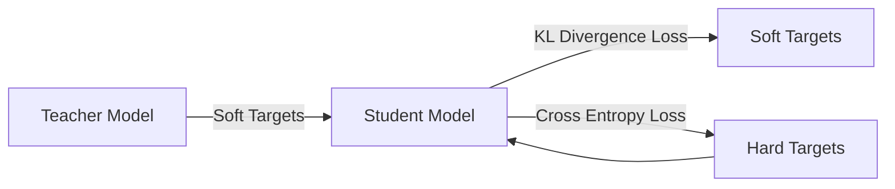

# The Role of Knowledge Distillation in AI

作者：禅与计算机程序设计艺术 / Zen and the Art of Computer Programming

## 1. 背景介绍

### 1.1 问题的由来
随着人工智能(AI)技术的飞速发展,越来越多的复杂AI模型被应用到各个领域。然而,这些高性能的模型通常需要大量的计算资源和存储空间,导致在资源受限的场景下难以实际部署。如何在保证模型性能的同时,降低模型的复杂度,成为了一个亟待解决的问题。

### 1.2 研究现状
近年来,知识蒸馏(Knowledge Distillation)作为一种模型压缩技术受到了广泛关注。通过让小模型(Student)从大模型(Teacher)学习,知识蒸馏可以有效地将Teacher模型学习到的知识迁移到Student模型中,从而在很大程度上保留大模型的性能,同时大幅降低模型复杂度。目前,知识蒸馏已经在计算机视觉、自然语言处理等多个AI领域取得了显著成果。

### 1.3 研究意义
知识蒸馏技术的研究对于推动AI在实际场景中的应用具有重要意义:

1. 降低部署成本:通过知识蒸馏压缩模型,可以大幅降低模型在终端设备上的计算和存储开销,有利于AI技术在移动端、IoT等资源受限场景的普及应用。

2. 提高推理速度:经过蒸馏的小模型计算量显著降低,可以大幅提升模型的推理速度,满足实时性要求高的应用场景。

3. 促进模型创新:知识蒸馏为设计高效模型架构提供了新思路,有利于推动AI模型的进一步优化和创新。

### 1.4 本文结构
本文将全面探讨知识蒸馏技术在AI领域的研究进展和应用实践。第2部分介绍知识蒸馏的核心概念;第3部分重点阐述知识蒸馏的核心算法原理;第4部分给出知识蒸馏的数学模型和公式推导;第5部分提供知识蒸馏的代码实例;第6部分讨论知识蒸馏的实际应用场景;第7部分推荐知识蒸馏的相关工具和资源;第8部分总结全文并展望未来;第9部分给出常见问题解答。

## 2. 核心概念与联系

知识蒸馏的核心思想是:通过Teacher模型指导Student模型学习,将Teacher模型学习到的知识迁移到Student模型中,使得小模型在性能上尽可能接近大模型。其核心概念包括:

- Teacher模型:通常是一个高性能的大模型,但计算量较大。
- Student模型:相对较小的模型,计算效率高,从Teacher模型学习知识。
- Soft Target:指Teacher模型输出的类别概率分布,蕴含了分类的细粒度信息。
- Hard Target:样本的真实标签,即One-hot编码。
- 温度(Temperature):控制softmax函数软化程度的超参数。温度越高,概率分布越趋于平缓。

在蒸馏过程中,Student模型通过拟合Teacher模型的Soft Target,从而学习到Teacher模型的知识。同时,Student模型也通过Hard Target学习真实标签,以保证分类准确性。通过联合优化这两个目标,Student模型可以在降低模型复杂度的同时,最大限度地保留Teacher模型的性能。

下图给出了知识蒸馏的基本流程:



## 3. 核心算法原理 & 具体操作步骤

### 3.1 算法原理概述
知识蒸馏算法的核心是让Student模型去模仿Teacher模型的行为。具体来说,就是最小化Student模型和Teacher模型的预测输出分布之间的差异。通过这种方式,Student模型可以学习到Teacher模型的知识,从而提升自身性能。

### 3.2 算法步骤详解
知识蒸馏算法主要分为以下几个步骤:

1. 训练Teacher模型:在目标数据集上训练一个高性能的大模型作为Teacher。

2. 生成Soft Targets:利用训练好的Teacher模型对训练集数据做推理,得到Soft Targets。Soft Target是Teacher模型输出的类别概率分布。

3. 构建Student模型:设计一个结构更加简单、计算量更小的Student模型。

4. 蒸馏训练Student模型:
   - 前向传播训练数据,得到Student和Teacher的输出概率分布。
   - 计算Student和Teacher的输出分布之间的KL散度损失。
   - 计算Student输出和真实标签之间的交叉熵损失。
   - 将两个损失加权求和,作为Student模型的最终损失函数。
   - 反向传播,更新Student模型的参数。

5. 评估Student模型:在测试集上评估Student模型的性能,验证蒸馏的有效性。

### 3.3 算法优缺点
知识蒸馏算法的优点包括:
- 可以显著压缩模型,降低计算和存储开销。
- 通过从Teacher模型学习,可以提升Student模型的性能。
- 算法原理简单,易于实现。

但知识蒸馏也存在一些局限性:
- Student模型的性能上限受限于Teacher模型。如果Teacher模型性能不够好,蒸馏的提升效果有限。
- Student模型的设计需要针对性调优,不同的模型架构和超参数会影响蒸馏效果。
- 蒸馏需要额外的训练时间和计算资源,相比直接训练Student模型有一定的开销。

### 3.4 算法应用领域
知识蒸馏算法可以应用于各种AI任务,包括图像分类、目标检测、语义分割、语音识别、自然语言处理等。在工业界,知识蒸馏已经成为模型压缩和优化的重要手段,被广泛应用于移动端、嵌入式等资源受限的场景。一些知名的AI应用,如手机上的语音助手、移动端的人脸识别等,都采用了知识蒸馏技术来优化模型性能。

## 4. 数学模型和公式 & 详细讲解 & 举例说明

### 4.1 数学模型构建
设Teacher模型为 $T$,Student模型为 $S$,训练样本为 $(x_i,y_i)$,其中 $x_i$ 为输入特征,$y_i$ 为真实标签。

对于样本 $x_i$,Teacher模型的输出概率分布为:

$$
P_T(x_i) = \text{softmax}(\frac{z_i^T}{\tau}) = [\frac{\exp(z_{i1}^T/\tau)}{\sum_j \exp(z_{ij}^T/\tau)}, \cdots, \frac{\exp(z_{iC}^T/\tau)}{\sum_j \exp(z_{ij}^T/\tau)}]
$$

其中 $z_i^T$ 是Teacher模型的logits输出,$\tau$ 是温度超参数,$C$ 是类别数。

Student模型的输出概率分布 $P_S(x_i)$ 的定义与之类似。

蒸馏过程的损失函数由两部分组成:
1. Student模型和Teacher模型输出分布的KL散度损失:

$$
\mathcal{L}_{KD} = \tau^2 \cdot \sum_i \text{KL}(P_T(x_i) || P_S(x_i))
$$

2. Student模型和真实标签的交叉熵损失:

$$
\mathcal{L}_{CE} = -\sum_i \sum_j y_{ij} \log P_S(x_i)_j
$$

最终的损失函数为两者的加权和:

$$
\mathcal{L} = \alpha \mathcal{L}_{KD} + (1-\alpha) \mathcal{L}_{CE}
$$

其中 $\alpha$ 为平衡因子,控制两个损失的权重。

### 4.2 公式推导过程

KL散度损失 $\mathcal{L}_{KD}$ 的推导如下:

$$
\begin{aligned}
\mathcal{L}_{KD} &= \tau^2 \cdot \sum_i \text{KL}(P_T(x_i) || P_S(x_i)) \
&= \tau^2 \cdot \sum_i \sum_j P_T(x_i)_j \log \frac{P_T(x_i)_j}{P_S(x_i)_j} \
&= \tau^2 \cdot \sum_i \sum_j P_T(x_i)_j (\log P_T(x_i)_j - \log P_S(x_i)_j) \
&= \tau^2 \cdot \sum_i (\sum_j P_T(x_i)_j \log P_T(x_i)_j - \sum_j P_T(x_i)_j \log P_S(x_i)_j)
\end{aligned}
$$

其中第一项与Student模型无关,可以省略。因此最小化 $\mathcal{L}_{KD}$ 等价于最小化:

$$
\mathcal{L}_{KD}' = -\tau^2 \cdot \sum_i \sum_j P_T(x_i)_j \log P_S(x_i)_j
$$

这实际上是最小化Student模型相对于Teacher模型的交叉熵损失。

### 4.3 案例分析与讲解

下面以图像分类任务为例,说明知识蒸馏的应用。

假设我们已经训练好了一个ResNet-101模型作为Teacher,现在希望将其知识蒸馏到一个更小的MobileNet模型中。

首先,我们使用训练好的ResNet-101模型对训练集数据进行推理,得到每个样本的Soft Target。然后,我们构建MobileNet模型作为Student,并使用上述的损失函数进行训练。其中,KL散度损失使得MobileNet尽可能模仿ResNet-101的输出分布,交叉熵损失使得MobileNet的预测结果接近真实标签。

通过联合优化这两个损失函数,MobileNet可以在蒸馏过程中同时学习到ResNet-101的知识和真实标签的信息,从而在压缩模型尺寸的同时尽可能保留分类性能。

实验结果表明,通过知识蒸馏,MobileNet的分类准确率可以显著提升,同时模型尺寸仅为ResNet-101的十分之一左右,实现了性能和效率的良好平衡。

### 4.4 常见问题解答

1. 问:温度超参数 $\tau$ 有什么作用?如何设置?
   答:温度超参数 $\tau$ 控制Teacher模型输出分布的软化程度。$\tau$ 越大,分布越平缓,Student模型越容易学习;$\tau$ 越小,分布越陡峭,Student模型学习难度越大。通常 $\tau$ 可以取值为1到10之间,需要根据任务和数据集进行调优。

2. 问:平衡因子 $\alpha$ 如何选取?
   答:平衡因子 $\alpha$ 控制KL散度损失和交叉熵损失的权重。$\alpha$ 越大,越侧重于从Teacher模型学习;$\alpha$ 越小,越侧重于拟合真实标签。通常 $\alpha$ 可以取值为0.5到0.9之间,需要根据任务和模型进行调优。

3. 问:知识蒸馏对Teacher和Student模型有什么要求?
   答:知识蒸馏对Teacher和Student模型没有特殊的结构要求,原则上任何类型的模型都可以用于蒸馏。但是,Teacher模型的性能上限决定了Student模型的性能上限。因此,Teacher模型需要有足够好的性能,才能使蒸馏有效。此外,Student模型的设计需要根据任务和资源限制进行针对性优化,以平衡性能和效率。

## 5. 项目实践：代码实例和详细解释说明

### 5.1 开发环境搭建
本项目基于PyTorch深度学习框架实现知识蒸馏算法。首先需要安装PyTorch及相关依赖库:

```bash
pip install torch torchvision numpy matplotlib
```

### 5.2 源代码详细实现
下面给出知识蒸馏算法的PyTorch实现代码:

```python
import torch
import torch.nn as nn
import torch.nn.functional as F

# 定义Teacher模型
class TeacherModel(nn.Module):
    def __init__(self):
        super(TeacherModel, self).__init__()
        self.fc1 = nn.Linear(28*28, 1200)
        self.fc2 = nn.Linear(1200, 1200)
        self