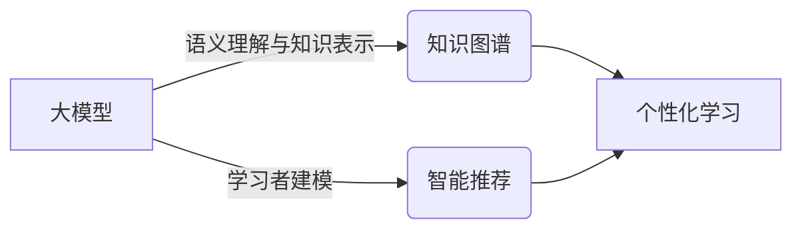

# 大模型在教育中的应用：个性化学习路径

关键词：大模型、教育、个性化学习、自适应学习、人工智能

## 1. 背景介绍

### 1.1 问题的由来
教育是人类社会进步和个人发展的基石。然而，传统的教育模式往往采用"一刀切"的方式，忽视了学生个体之间的差异性。这导致部分学生难以跟上教学进度，而另一部分学生则觉得课程内容过于简单，难以充分发挥自身潜力。因此，如何实现因材施教、个性化教学，成为教育领域亟待解决的问题。

### 1.2 研究现状
近年来，人工智能技术的飞速发展为解决上述问题提供了新的思路。特别是以GPT-3、BERT等为代表的大模型(Large Language Models)的出现，使得自然语言处理和知识表示能力大幅提升。这为实现个性化教学提供了技术基础。目前，国内外已有不少研究者和企业开始探索大模型在教育领域的应用，取得了一些初步成果。

### 1.3 研究意义
将大模型应用于教育领域，构建个性化学习路径，具有重要意义：

1. 有助于提高教学质量和学习效率。个性化学习能够根据学生的知识基础、学习风格、兴趣爱好等因素，为其提供量身定制的学习内容和进度，使其能够事半功倍。

2. 有助于促进教育公平。传统教育受师资、硬件设施等条件限制，优质教育资源分布不均。而个性化学习系统可以将优质资源普惠至每一个学生，缩小教育鸿沟。

3. 有助于培养创新型人才。个性化学习强调学生的主体地位，鼓励其主动探索、独立思考，有利于培养其创新意识和能力，这正是时代发展所需要的。

### 1.4 本文结构
本文将围绕大模型在教育中的应用这一主题，重点探讨如何利用大模型构建个性化学习路径。全文共分为9个部分：第1部分为背景介绍；第2部分阐述相关核心概念；第3部分介绍核心算法原理；第4部分建立数学模型并给出公式推导；第5部分提供代码实例；第6部分分析实际应用场景；第7部分推荐相关工具和资源；第8部分总结全文并展望未来；第9部分为附录，解答常见问题。

## 2. 核心概念与联系

要理解如何利用大模型实现个性化学习，首先需要了解几个核心概念：

- 大模型：是一类参数量巨大（一般在数亿到上千亿量级）的深度学习模型，主要应用于自然语言处理(NLP)领域。当前最著名的大模型包括GPT系列、BERT等。它们通过在海量文本数据上进行预训练，习得了丰富的语言知识和世界知识，具备优秀的语言理解和生成能力。

- 个性化学习：又称自适应学习(Adaptive Learning)，是指根据学习者的个人特征（如知识水平、学习风格、兴趣爱好等）来调整学习内容、学习进度、学习方式，以达到因材施教、优化学习的目的。

- 知识图谱(Knowledge Graph)：是一种结构化表示知识的方法。它以图(Graph)的形式表示概念(Concept)之间的关联。在教育领域，知识图谱可以用来表示学科知识体系，为个性化学习提供知识基础。

- 智能推荐(Intelligent Recommendation)：利用机器学习算法，分析学习者的行为数据，从而推测其特征和需求，进而主动推荐其感兴趣或适合的学习资源。这是实现个性化学习的重要技术手段。

下图展示了上述核心概念之间的关系：

由上图可见，大模型可以从两方面助力个性化学习的实现：一是利用其强大的语义理解与知识表示能力，构建教育领域知识图谱；二是通过对学习者数据的分析，对其进行用户画像(User Profile)，实现智能推荐。知识图谱和智能推荐共同支撑起个性化学习。下面，我们将具体讨论相关算法原理。

## 3. 核心算法原理 & 具体操作步骤

### 3.1 算法原理概述
个性化学习路径的构建涉及两个核心任务：一是根据学习者的已有知识和学习目标，从知识图谱中提取出最优学习路径；二是根据学习者的个人特征，从海量学习资源中推荐出最合适的学习材料。前者可以利用图算法来实现，后者则需要使用推荐系统算法。

### 3.2 算法步骤详解

#### 3.2.1 个性化学习路径生成
输入：学习者已掌握知识点集合S，目标知识点T，知识图谱G
输出：个性化学习路径P

算法步骤：
1. 在知识图谱G中，找出已掌握知识点集合S
2. 在知识图谱G中，找出目标知识点T
3. 使用A*搜索算法，找出从S到T的最短路径P，搜索过程中，需要考虑：
   - 每个知识点的难度
   - 知识点之间的先修关系
   - 学习者的学习能力
4. 输出学习路径P

#### 3.2.2 个性化学习资源推荐
输入：学习者特征向量u，学习资源特征矩阵V
输出：学习资源推荐列表R

算法步骤：
1. 收集学习者的行为数据，如学习时长、学习进度、练习得分等
2. 对行为数据进行清洗和特征工程，得到学习者特征向量u
3. 对学习资源进行语义分析和主题建模，得到学习资源特征矩阵V
4. 使用协同过滤算法，计算学习者u与学习资源V的匹配度，生成推荐列表R
   - 基于用户的协同过滤(User-based CF)
   - 基于物品的协同过滤(Item-based CF)
5. 对推荐列表R进行多样性重排序，提高推荐的覆盖度和新颖性
6. 输出个性化学习资源推荐列表R

### 3.3 算法优缺点

优点：
- 充分利用了知识图谱和用户行为数据，能够生成高度个性化的学习路径和资源推荐
- A*搜索算法能够在海量的路径空间中高效找出最优解
- 协同过滤算法能够挖掘用户的隐式偏好，改善推荐质量

缺点：
- 知识图谱的构建需要大量的人力成本，覆盖范围和准确性有待提高
- 冷启动问题：对于新用户和新学习资源，缺乏足够的行为数据，推荐效果较差
- 推荐结果的解释性较差，用户难以理解为什么推荐这些内容

### 3.4 算法应用领域
个性化学习路径和资源推荐算法不仅可以应用于学校教育，还可以应用于以下领域：

- 企业培训：根据员工的岗位、能力、发展意愿等，推荐个性化的培训课程和学习资源，提高培训效率。
- 在线教育：根据学员的学习进度、兴趣爱好等，推荐个性化的课程和练习，提高学员的学习体验和完课率。
- 职业教育：根据学员的职业发展规划，推荐个性化的技能提升路径和就业指导，帮助其提升职场竞争力。

## 4. 数学模型和公式 & 详细讲解 & 举例说明

### 4.1 数学模型构建
我们可以使用矩阵分解(Matrix Factorization)技术来构建个性化学习推荐的数学模型。

设有m个学员和n个学习资源，定义：
- 评分矩阵：$R\in \mathbb{R}^{m\times n}$，其中$R_{ij}$表示学员i对资源j的评分，未评分项用0填充。
- 学员隐向量矩阵：$U\in \mathbb{R}^{m\times k}$，其中$U_{i}$表示学员i的隐向量，维度为k。
- 资源隐向量矩阵：$V\in \mathbb{R}^{n\times k}$，其中$V_{j}$表示资源j的隐向量，维度为k。

我们的目标是通过已知的评分矩阵R，学习出学员隐向量矩阵U和资源隐向量矩阵V，使得矩阵乘积UV^T尽可能逼近原始评分矩阵R。形式化地，我们要最小化如下损失函数：

$$\underset{U,V}{min} \sum_{i=1}^{m}\sum_{j=1}^{n}I_{ij}(R_{ij}-U_{i}V_{j}^T)^2 + \lambda(||U||^2 + ||V||^2)$$

其中，$I_{ij}$为指示函数，当$R_{ij}$非0时取1，否则取0。$\lambda$为正则化系数，用于控制过拟合。

### 4.2 公式推导过程
求解上述最小化问题，我们可以使用随机梯度下降(Stochastic Gradient Descent, SGD)算法。

对于每个已知评分$R_{ij}$，我们执行如下更新：

$$U_i \leftarrow U_i + \alpha(2(R_{ij} - U_iV_j^T)V_j - \lambda U_i)$$
$$V_j \leftarrow V_j + \alpha(2(R_{ij} - U_iV_j^T)U_i - \lambda V_j)$$

其中，$\alpha$为学习率。

重复执行上述更新，直到损失函数收敛或达到预设的迭代次数。

### 4.3 案例分析与讲解
我们以一个简单的例子来说明矩阵分解的过程。

假设有3个学员和4个学习资源，评分矩阵R如下：

$$R=\begin{bmatrix}
4 & ? & 2 & 5\\
? & 3 & ? & 1\\
2 & 4 & ? & ?
\end{bmatrix}$$

其中，?表示未评分项。

我们取隐向量维度k=2，随机初始化学员隐向量矩阵U和资源隐向量矩阵V：

$$U=\begin{bmatrix}
0.1 & 0.2\\
0.3 & 0.4\\
0.5 & 0.6
\end{bmatrix},
V=\begin{bmatrix}
0.7 & 0.8\\
0.9 & 1.0\\
1.1 & 1.2\\
1.3 & 1.4
\end{bmatrix}$$

设学习率$\alpha=0.01$，正则化系数$\lambda=0.1$。

对于已知评分$R_{11}=4$，我们执行如下更新：

$$U_1 \leftarrow U_1 + 0.01(2(4 - U_1V_1^T)V_1 - 0.1U_1)$$
$$V_1 \leftarrow V_1 + 0.01(2(4 - U_1V_1^T)U_1 - 0.1V_1)$$

重复执行上述更新，直到模型收敛。最终学习到的U和V可用于预测未知评分：

$$\hat{R}_{ij}=U_iV_j^T$$

### 4.4 常见问题解答

Q: 矩阵分解模型能否处理隐式反馈数据？
A: 可以。我们可以将用户的浏览、点击、收藏等行为看作是隐式反馈，赋予不同的权重，纳入模型训练。

Q: 如何解决矩阵分解的冷启动问题？
A: 可以利用学员和资源的副信息（如学员的个人信息、资源的内容信息等），构建额外的特征，引入模型训练。

Q: 矩阵分解的时间复杂度如何？
A: 矩阵分解的时间复杂度为$O(mk+nk)$，其中m为学员数，n为资源数，k为隐向量维度。当m和n较大时，可以采用并行计算、近似计算等技术加速训练。

## 5. 项目实践：代码实例和详细解释说明