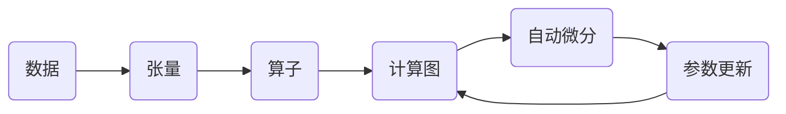

# AI开发框架原理与代码实战案例讲解

## 1. 背景介绍
### 1.1  问题的由来
人工智能(Artificial Intelligence, AI)是计算机科学领域最前沿、最具挑战性的研究方向之一。近年来,随着深度学习等AI技术的突破性进展,AI开发框架也如雨后春笋般涌现。然而,对于广大开发者而言,如何从繁多的AI框架中选择合适的进行开发,并深入理解其原理和实现,仍是一大挑战。

### 1.2  研究现状
目前主流的AI开发框架包括TensorFlow、PyTorch、Keras、Caffe等。它们各有特色,但在易用性、性能、生态等方面各有优劣。学术界和工业界都在不断推动这些框架的发展和创新。同时,围绕AI框架的原理解析、性能优化、最佳实践等也有大量研究。

### 1.3  研究意义
全面剖析AI开发框架的原理,并给出详实的代码实战案例,将有助于开发者系统掌握AI开发技术,加速AI应用落地。同时对框架进行深入的理论分析,也有助于改进框架设计,探索新的优化方向。

### 1.4  本文结构
本文将围绕几个主流AI开发框架,从以下方面展开系统讨论：

- 核心概念与内在联系
- 底层算法原理与实现细节
- 数学模型与关键公式推导
- 代码实例与案例解析
- 实际应用场景与未来展望
- 学习资源与工具推荐

## 2. 核心概念与联系

在深入研究AI框架原理之前,我们先来了解一下几个核心概念：

- 计算图(Computation Graph):一种描述数学运算的中间表示,常用于构建复杂的神经网络模型。AI框架普遍采用计算图作为核心数据结构。

- 自动微分(Automatic Differentiation):一种高效计算导数的数值方法。深度学习大量依赖梯度下降优化算法,自动微分是其高效实现的关键。主流框架都内置了自动微分引擎。

- 张量(Tensor):多维数组,是AI框架中数据的基本表示形式。张量可以表示输入数据、网络权重、中间变量等。GPU加速主要是对张量运算进行加速。

- 算子(Operator):执行具体计算的函数,例如卷积、池化、激活、Dropout等。算子将输入张量映射到输出张量。现代AI框架都采用了各种优化手段来提升算子性能。

下面这张图展示了这几个核心概念在AI框架中的联系:



可以看到,数据首先被转化为张量,然后由算子进行处理,多个算子构成计算图。在训练阶段,根据计算图自动求导,并更新网络参数,如此循环迭代,直到模型收敛。

## 3. 核心算法原理 & 具体操作步骤
### 3.1 算法原理概述
现代AI框架的核心是基于计算图的自动微分系统。它主要解决了两个问题:

1. 如何将复杂的神经网络表示为有向无环图(DAG)
2. 如何在计算图上高效计算梯度

对于第一个问题,主流的思路是引入一个中间层(如TensorFlow的tf.Graph,PyTorch的autograd),用户定义的各种张量运算会被记录在一个计算图数据结构中,构成DAG。

对于第二个问题,主要有两种实现方式:

- 符号式(Symbolic):在构建计算图时,同时构建对偶图(梯度计算图),通过图遍历算法自动求导,如TensorFlow。
- 命令式(Imperative):采用运行时反向传播,通过op级别的梯度定义和张量求导规则动态计算梯度,如PyTorch。

### 3.2 算法步骤详解
下面我们以符号式自动微分为例,详细说明其工作流程:

1. 定义前向计算图:将用户定义的神经网络表示为DAG。
2. 构建对偶图:根据前向图自动生成反向计算图。
3. 图分析优化:对前向图和反向图进行分析,做合并、消除、算子替换等优化。
4. 图编译:将优化后的计算图转换为可执行的程序。
5. 图执行:分配内存,将数据拷贝到设备,调用底层运行时执行计算图。
6. 求导:根据反向计算图,自动计算所有张量的梯度。
7. 参数更新:根据求得的梯度,更新网络权重。重复4-7步骤,直到收敛。

### 3.3 算法优缺点
符号式自动微分的主要优点是:

- 计算图全局可见,可做全局优化如算子融合、内存优化等。
- 可移植性好,能够支持多种硬件后端。

缺点是:

- 调试不便,出错时难定位到代码。
- 灵活性差,不易支持控制流。

命令式自动微分正好互补,优点是灵活易用,缺点是不易做全局优化。

### 3.4 算法应用领域
自动微分技术广泛应用于科学计算、机器学习、计算机视觉、自然语言处理等领域。尤其在深度学习中,复杂模型的训练完全依赖自动微分。可以说没有自动微分就没有现代AI的发展。

## 4. 数学模型和公式 & 详细讲解 & 举例说明
### 4.1  数学模型构建
对神经网络进行数学建模,可以得到一个嵌套的复合函数:
$$\hat{y} = f(x, \theta) = f_n(...f_2(f_1(x,\theta_1),\theta_2)...,\theta_n)$$

其中$x$为输入,$\theta$为网络参数,$\hat{y}$为输出,$f_1...f_n$为网络的各个层。

网络的训练目标是最小化损失函数,常见的损失函数如均方误差(MSE):

$$J(\theta) = \frac{1}{m}\sum^m_{i=1}(\hat{y}_i-y_i)^2$$

其中$m$为样本数,$y$为真实标签。

### 4.2  公式推导过程
根据链式法则,损失函数$J$对每个参数$\theta_j$的梯度为:

$$\frac{\partial{J}}{\partial{\theta_j}} = \frac{\partial{J}}{\partial{\hat{y}}} \frac{\partial{\hat{y}}}{\partial{\theta_j}}
= \frac{\partial{J}}{\partial{\hat{y}}} \frac{\partial{f_n}}{\partial{f_{n-1}}}...\frac{\partial{f_{j+1}}}{\partial{f_j}}\frac{\partial{f_j}}{\partial{\theta_j}}$$

反向传播算法就是按照上式,从后往前递归计算每一层的梯度:

$$\frac{\partial{J}}{\partial{\theta_n}} = \frac{\partial{J}}{\partial{\hat{y}}} \frac{\partial{f_n}}{\partial{\theta_n}}$$
$$\frac{\partial{J}}{\partial{\theta_{n-1}}} = \frac{\partial{J}}{\partial{\hat{y}}} \frac{\partial{f_n}}{\partial{f_{n-1}}}\frac{\partial{f_{n-1}}}{\partial{\theta_{n-1}}}$$
$$...$$
$$\frac{\partial{J}}{\partial{\theta_1}} = \frac{\partial{J}}{\partial{\hat{y}}} \frac{\partial{f_n}}{\partial{f_{n-1}}}...\frac{\partial{f_2}}{\partial{f_1}}\frac{\partial{f_1}}{\partial{\theta_1}}$$

可见反向传播的关键是计算每一层输出对输入的梯度$\frac{\partial{f_i}}{\partial{f_{i-1}}}$,将其乘到上一层的梯度中,直至回溯到初始层。

### 4.3  案例分析与讲解
我们以一个简单的两层神经网络为例,示范手工推导和自动微分计算梯度的过程。

假设网络结构为:
$$f(x) = \sigma(W_2\cdot\sigma(W_1\cdot x))$$

其中$\sigma$为Sigmoid激活函数:

$$\sigma(x) = \frac{1}{1+e^{-x}}$$

Sigmoid函数的导数为:

$$\sigma'(x) = \sigma(x)(1-\sigma(x))$$

对于一个样本$(x,y)$,采用MSE损失,手工推导$W_1$和$W_2$的梯度如下:

令$a=W_1\cdot x$, $h=\sigma(a)$, $z=W_2\cdot h$, $\hat{y}=\sigma(z)$

则$J = \frac{1}{2}(\hat{y}-y)^2$

应用链式法则:
$$\frac{\partial{J}}{\partial{W_2}} = \frac{\partial{J}}{\partial{\hat{y}}}\frac{\partial{\hat{y}}}{\partial{z}}\frac{\partial{z}}{\partial{W_2}} = (\hat{y}-y)\hat{y}(1-\hat{y})h^T$$

$$\frac{\partial{J}}{\partial{W_1}} = \frac{\partial{J}}{\partial{\hat{y}}}\frac{\partial{\hat{y}}}{\partial{z}}\frac{\partial{z}}{\partial{h}}\frac{\partial{h}}{\partial{a}}\frac{\partial{a}}{\partial{W_1}} = (\hat{y}-y)\hat{y}(1-\hat{y})W_2^Th(1-h)x^T$$

可见手工推导梯度需要对网络结构有清晰的认识,且过程繁琐。

而采用自动微分,只需定义前向传播:

```python
def forward(x):
    a = np.dot(W1,x)
    h = sigmoid(a)
    z = np.dot(W2,h)
    y_hat = sigmoid(z)
    return y_hat
```

然后求损失函数对W1和W2的梯度:

```python
W1_grad = grad(loss_func,argnum=0)(W1,W2,x,y)
W2_grad = grad(loss_func,argnum=1)(W1,W2,x,y)
```

自动微分引擎会根据前向传播过程自动构建计算图,并求出梯度,完全屏蔽了数学推导细节。

### 4.4  常见问题解答
Q: 自动微分的计算复杂度如何?
A: 对于n个运算节点的计算图,前向传播的时间复杂度为O(n),反向传播的时间复杂度也为O(n),即反向传播只是一个常数倍的开销。空间复杂度方面,由于需要缓存前向过程中的中间结果,因此是O(n)的,这是一个问题。tape方法可以降到O(sqrt(n)),但会增加额外的前向传播。

Q: 如何解决梯度消失和梯度爆炸问题?
A: 合适的参数初始化(如Xavier)、归一化层(如Batch Norm)、梯度裁剪、残差连接等都是有效的缓解方法。此外可以用其他优化算法替代SGD,如Adam,AdaGrad等自适应学习率方法。

Q: 自动微分对硬件有什么要求?
A: 由于AI训练通常是批量进行的,因此需要高吞吐的矩阵乘法和卷积运算。GPU凭借其高度并行的特点,成为AI加速的主力。此外AI芯片(如TPU)进一步提高了算力。内存带宽也往往是瓶颈,需要尽可能减少数据移动。

## 5. 项目实践：代码实例和详细解释说明
下面我们以PyTorch为例,演示如何用50行代码实现一个简单的手写数字识别模型。

### 5.1  开发环境搭建
首先安装PyTorch:
```bash
pip install torch
```

然后准备MNIST数据集:
```python
from torchvision import datasets, transforms

train_dataset = datasets.MNIST(root='./data',
                               train=True,
                               transform=transforms.ToTensor(),
                               download=True)

test_dataset = datasets.MNIST(root='./data',
                              train=False,
                              transform=transforms.ToTensor())
```

### 5.2  源代码详细实现
定义网络结构:
```python
from torch import nn

class MnistModel(nn.Module):
    def __init__(self):
        super().__init__()
        self.linear = nn.Linear(input_size, num_classes)

    def forward(self, xb):
        xb = xb.reshape(-1, 784)
        out = self.linear(xb)
        return out

model = MnistModel()
```

定义训练循环:
```python
from torch import optim

def train(model, train_loader, optimizer