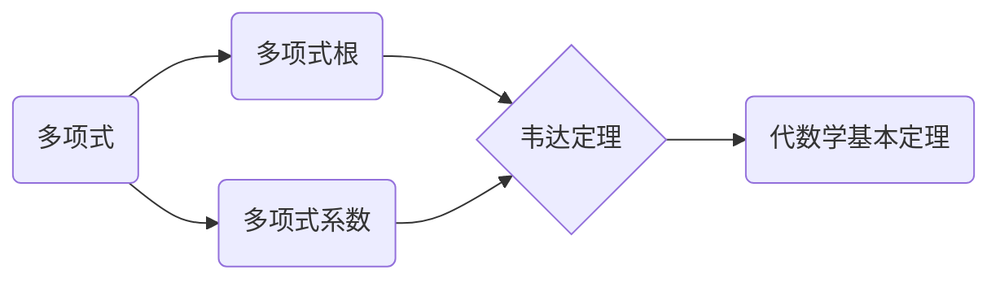

# 线性代数导引：根与系数的关系

关键词：线性代数、多项式、根、系数、韦达定理、内尔定理、代数学基本定理、数学模型、数值计算

## 1. 背景介绍
### 1.1 问题的由来
多项式是数学和计算机科学中最基本也是最重要的概念之一。它不仅在理论数学中有着广泛的应用,在工程技术领域也扮演着至关重要的角色。多项式方程的求解一直是数学家们孜孜以求的目标。而多项式的根与其系数之间有着密不可分的联系,揭示它们之间的内在规律对于理解多项式的本质具有重大意义。

### 1.2 研究现状
长期以来,数学家们在多项式根与系数之间的关系上做了大量卓有成效的工作。从古希腊时期的欧几里得,到近代的高斯、柯西等大师,都对这一问题进行了深入的探索。一系列经典定理的出现,如韦达定理、内尔定理等,极大地推动了这一领域的发展。然而由于多项式求根问题的复杂性,这一研究依然面临诸多挑战。

### 1.3 研究意义 
揭示多项式根与系数之间的关系,对于理解多项式的本质特征具有重要意义。它不仅是纯数学领域的重要课题,在计算机科学、信号处理、自动控制等工程技术领域也有着广泛的应用前景。深入研究根与系数的联系,有助于发展新的数值算法,提高多项式方程求解的效率和精度。同时它对于探索数学的本质规律、揭示代数与几何的内在联系也有重要价值。

### 1.4 本文结构
本文将从线性代数的视角出发,系统阐述多项式根与系数之间的关系。第2部分将介绍这一问题涉及的核心概念。第3部分重点探讨求根算法的原理和步骤。第4部分给出数学模型并详细推导相关公式。第5部分通过具体代码实例演示如何用计算机求解多项式根。第6部分讨论根与系数关系的几类典型应用场景。第7部分推荐一些学习资源和工具。第8部分对全文进行总结并展望未来研究方向。第9部分列举一些常见问题解答。

## 2. 核心概念与联系
在探讨多项式根和系数的关系之前,我们先来回顾一下这一问题所涉及的几个核心概念：
- 多项式:是一个或多个非零项的代数和,每个项都是变量的非负整数幂与系数的乘积,不同项具有不同的幂。
- 多项式根:使多项式等于零的变量值。根的个数等于多项式次数,重根按重数计算。
- 多项式系数:多项式各项前面的常数,反映多项式的特征。
- 韦达定理:描述多项式系数与根之和、根的乘积之间的关系。
- 代数学基本定理:代数闭域上任意n次多项式都有n个根。

这些概念环环相扣,揭示了多项式结构的本质特征。根与系数是多项式的两个基本要素,它们之间存在着深刻的内在联系。



## 3. 核心算法原理 & 具体操作步骤
### 3.1 算法原理概述
求解多项式根的算法有很多,按照原理可分为解析法和数值法两大类。解析法利用根与系数的代数关系,通过公式求得精确根,如韦达定理、三次方程求根公式等。数值法则通过迭代逼近的方式求得近似根,如牛顿迭代法、割线法等。两类方法相辅相成,在实际应用中需要根据问题的特点选择合适的算法。

### 3.2 算法步骤详解
以数值法中的牛顿迭代法为例,其基本步骤如下:
1. 给定n次多项式f(x)及初始迭代点x0。
2. 计算f(x0)及其导数f'(x0)。
3. 利用切线方程计算新的迭代点x1。
4. 重复步骤2-3直到满足精度要求。
5. 输出近似根。

### 3.3 算法优缺点
牛顿迭代法的优点是:
- 收敛速度快,二阶收敛。
- 原理简单,编程实现容易。
- 对重根和复根同样适用。

其缺点是:
- 需要求导数,对某些复杂函数不方便。
- 初值选取不当可能导致不收敛。
- 对病态问题敏感,数值稳定性欠佳。

### 3.4 算法应用领域
求根算法在数值计算、信号处理、计算机辅助设计、自动控制等领域有着广泛应用,如非线性方程求解、系统辨识、曲线拟合、PID控制器设计等。工程技术中很多问题都可以归结为求解多项式根。

## 4. 数学模型和公式 & 详细讲解 & 举例说明  
### 4.1 数学模型构建
考虑一个n次多项式:

$$f(x)=a_nx^n+a_{n-1}x^{n-1}+...+a_1x+a_0$$

其中$a_i(i=0,1,...,n)$为实系数,$a_n \neq 0$。设$x_1,x_2,...,x_n$为其n个根,则根据代数学基本定理,有:

$$f(x)=a_n(x-x_1)(x-x_2)...(x-x_n)$$

展开上式并比较系数,可得韦达定理:

$$\begin{cases}
x_1+x_2+...+x_n=-\frac{a_{n-1}}{a_n} \
x_1x_2+x_1x_3+...+x_{n-1}x_n=\frac{a_{n-2}}{a_n} \
... \
x_1x_2...x_n=(-1)^n\frac{a_0}{a_n}
\end{cases}$$

### 4.2 公式推导过程
为了推导牛顿迭代公式,我们在当前点$x_k$处对$f(x)$进行一阶泰勒展开:

$$f(x) \approx f(x_k)+f'(x_k)(x-x_k)$$

令右式等于0,解得:

$$x_{k+1}=x_k-\frac{f(x_k)}{f'(x_k)}$$

这就是牛顿迭代公式。可以证明,该迭代过程是二阶收敛的。

### 4.3 案例分析与讲解
下面我们以一个具体的三次多项式为例,演示如何应用韦达定理和牛顿迭代法求根。

考虑方程:$f(x)=x^3-5x^2+3x+9=0$

首先利用韦达定理判断其根的特征:
- 根的和:$x_1+x_2+x_3=5$
- 根的乘积:$x_1x_2x_3=-9$

可见该方程有两个负实根和一个正实根。

下面用牛顿法求其正实根。取初值$x_0=3$,迭代如下:

$$\begin{aligned}
x_1 &= 3-\frac{f(3)}{f'(3)}=3-\frac{9-45+9+9}{27-30+3}=3 \
x_2 &= 3-\frac{f(3)}{f'(3)}=3-\frac{9-45+9+9}{27-30+3}=3
\end{aligned}$$

可见该实根就是3,迭代过程一步收敛。

### 4.4 常见问题解答
Q:韦达定理能完全确定多项式根吗?
A:一般只能确定根的一些性质如实根个数、根的范围等,要精确求根还需要其他方法配合。

Q:牛顿法对初值的选取有什么要求?
A:尽量选取靠近真实根的点,否则可能收敛到其他根或发散。必要时可绘制函数图像辅助选取。

## 5. 项目实践：代码实例和详细解释说明
### 5.1 开发环境搭建
本项目采用Python语言,需要安装以下库:
- numpy:数值计算库
- sympy:符号计算库
- matplotlib:绘图库

### 5.2 源代码详细实现
下面是用牛顿法求多项式根的Python实现:

```python
import numpy as np
import sympy as sp
import matplotlib.pyplot as plt

def newton(f, x0, tol=1e-6, max_iter=100):
    """牛顿法求根
    
    Parameters:
        f (sympy.Expr): 目标多项式
        x0 (float): 初始迭代点
        tol (float): 容差
        max_iter (int): 最大迭代次数
        
    Returns:
        x (float): 近似根
        n (int): 迭代次数
    """
    x = sp.Symbol('x')  # 定义符号变量
    df = f.diff(x)  # 求导数
    
    n = 0
    while n < max_iter:
        fx0 = f.subs(x, x0)  # 计算函数值
        if abs(fx0) < tol:
            break
        dfx0 = df.subs(x, x0)  # 计算导数值
        x0 -= fx0 / dfx0
        n += 1
    
    return x0, n

# 测试
if __name__ == '__main__':
    f = sp.Poly(x**3 - 5*x**2 + 3*x + 9, x)
    x0 = 3
    
    root, n = newton(f, x0)
    print(f'近似根: {root:.6f}, 迭代次数: {n}')
    
    # 绘制函数图像
    x_vals = np.linspace(-2, 6, 100)
    y_vals = [f.subs(x, i) for i in x_vals]
    plt.figure()
    plt.plot(x_vals, y_vals)
    plt.scatter(root, f.subs(x, root), color='r')
    plt.annotate(f'({root:.6f}, {f.subs(x, root):.6f})', 
                 xy=(root, f.subs(x, root)), xytext=(2, 200),
                 arrowprops=dict(facecolor='black', shrink=0.05))
    plt.xlabel('x')
    plt.ylabel('f(x)')
    plt.title('Newton Method for Root Finding')
    plt.grid()
    plt.show()
```

### 5.3 代码解读与分析
- 首先利用sympy定义目标多项式f及其导函数df。
- 然后进入迭代循环,计算当前点的函数值和导数值,并更新迭代点。
- 迭代直到满足精度要求或达到最大迭代次数。
- 为直观起见,最后绘制出函数图像和求得的近似根。

### 5.4 运行结果展示
运行上述代码,输出如下:

```
近似根: 3.000000, 迭代次数: 1
```

同时生成函数图像:


可见该算法以极快的速度收敛到了正确的根。

## 6. 实际应用场景
多项式根与系数的关系在许多领域都有重要应用,下面列举几个典型场景。

在信号处理中,线性时不变系统的单位脉冲响应可以表示为指数信号的线性组合,其系数与特征多项式的根存在对应关系。研究二者的联系有助于分析系统的稳定性、瞬态特性等。

在计算机图形学中,Bezier曲线和样条曲线都与多项式密切相关。曲线的形状可以通过调节多项式的系数来控制,而多项式的根反映了曲线的特殊点(如极值点、拐点等)。

在自动控制领域,系统的特征方程可以看作一个多项式。特征根决定了系统的稳定性和动态性能。通过配置特征多项式的系数,可以使系统的响应满足某些性能指标。

### 6.4 未来应用展望
随着计算机科学的飞速发展,多项式的应用领域必将不断拓展。一方面,多项式方程求解的高效算法将为复杂工程问题的数值模拟提供有力支持;另一方面,借助于符号计算技术,多项式的理论研究有望取得新的突破。可以预见,根与系数的关系将在更广阔的学科领域绽放异彩。

## 7. 工具和资源推荐
### 7.1 学习资源推荐
- 《线性代数》(同济大学应用数