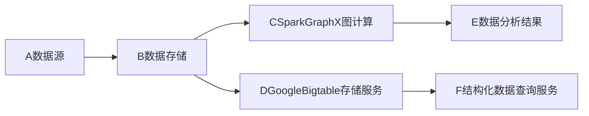
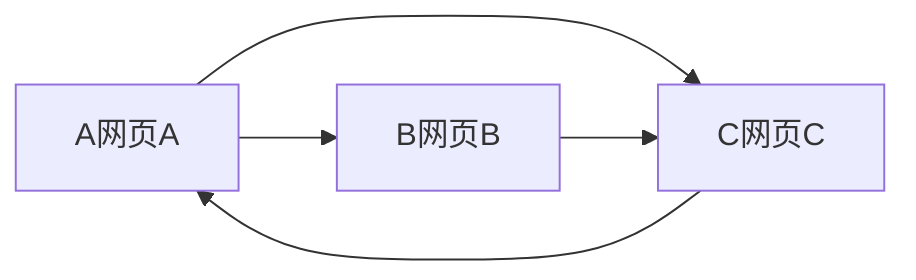

# SparkGraphX与GoogleBigtable比较

## 1. 背景介绍
### 1.1 问题的由来
在大数据时代,海量数据的存储和计算已成为各行各业面临的共同挑战。传统的关系型数据库已无法满足海量数据的存储和计算需求,因此各种分布式大数据存储和计算框架应运而生。其中,SparkGraphX和GoogleBigtable是两个备受关注的分布式计算和存储系统。

### 1.2 研究现状
SparkGraphX作为Spark生态系统中专门用于图计算的组件,提供了丰富的图计算API,能够方便地进行大规模图数据的分布式计算。而GoogleBigtable则是谷歌公司开发的高性能分布式NoSQL数据库,用于海量结构化数据的存储。目前,国内外学术界和工业界都对这两个系统进行了广泛的研究和应用。

### 1.3 研究意义
深入分析和比较SparkGraphX和GoogleBigtable的异同点,有助于我们更好地理解分布式图计算和NoSQL数据库的内在原理,为不同应用场景选择合适的大数据处理方案提供参考。同时,通过对比分析,也可以找出它们各自的优缺点,为未来系统的改进和优化指明方向。

### 1.4 本文结构
本文将从以下几个方面对SparkGraphX和GoogleBigtable进行全面的比较:

1. 核心概念与联系
2. 核心算法原理和具体操作步骤
3. 数学模型和公式详解
4. 代码实例和详细解释
5. 实际应用场景
6. 工具和资源推荐
7. 未来发展趋势与挑战
8. 常见问题与解答

## 2. 核心概念与联系
SparkGraphX和GoogleBigtable虽然分别用于图计算和数据存储,但它们有一些共同的核心概念:

- 分布式:它们都是为分布式集群环境设计的,通过将数据和计算任务分散到多个节点,实现高性能和可扩展性。
- 容错:为了保证在节点失效时系统能够继续工作,它们都提供了容错机制,如数据备份和计算任务重试等。
- 数据模型:SparkGraphX使用RDD(弹性分布式数据集)来表示图数据,而Bigtable使用多维映射表来组织数据。
- 数据分区:为了实现并行计算,它们都需要将数据划分为多个分区,分布到不同的节点上进行处理。

下图展示了SparkGraphX和GoogleBigtable在分布式大数据处理中的位置:



## 3. 核心算法原理 & 具体操作步骤
### 3.1 算法原理概述
- SparkGraphX:基于Pregel模型的分布式图计算,通过对图进行分区,实现并行的图遍历、聚合等操作。
- GoogleBigtable:利用Google文件系统GFS进行分布式存储,使用SSTable和MemTable等结构提供高效的数据读写。

### 3.2 算法步骤详解
SparkGraphX的图计算过程:
1. 图数据加载:将图数据读入RDD
2. 图数据分区:根据边切分算法对图进行分区
3. 迭代计算:对每个分区并行执行计算逻辑,如PageRank
4. 结果输出:将计算结果保存

GoogleBigtable的数据读写过程:
1. 数据写入:数据首先写入内存中的MemTable
2. MemTable持久化:当MemTable达到阈值时,持久化为SSTable
3. 数据压缩:对SSTable进行压缩,生成新的SSTable
4. 数据读取:组合MemTable和SSTable的数据

### 3.3 算法优缺点
- SparkGraphX:
  - 优点:使用Spark生态,能与其他大数据处理组件无缝集成
  - 缺点:适用于可并行的图算法,对复杂算法支持不足
- GoogleBigtable:
  - 优点:写入性能高,可实现海量数据的实时写入
  - 缺点:不支持跨行事务,对强一致性的支持有限

### 3.4 算法应用领域
- SparkGraphX:社交网络分析、推荐系统、欺诈检测等
- GoogleBigtable:网页爬虫、金融数据分析、物联网数据存储等

## 4. 数学模型和公式 & 详细讲解 & 举例说明
### 4.1 数学模型构建
SparkGraphX的Pregel模型可以用以下公式表示:

$$
a_i^{t+1} = \sum_{j \in N(i)} f(a_i^t, a_j^t, e_{ij})
$$

其中,$a_i^t$表示第$t$轮迭代时顶点$i$的状态,$N(i)$为顶点$i$的邻居顶点集合,$f$为计算逻辑。

GoogleBigtable的数据模型可以用以下多维映射表示:

$$
(row:string, column:string, timestamp:int64) \rightarrow cell:string
$$

即通过行键、列名、时间戳三个维度定位到一个单元格。

### 4.2 公式推导过程
Pregel模型的公式可以这样推导:

1. 定义顶点状态的更新函数$f$
2. 对于每个顶点$i$,聚合其邻居顶点$j$的状态$a_j^t$
3. 将聚合结果应用于更新函数$f$,得到新的状态$a_i^{t+1}$
4. 重复以上步骤,直到状态收敛

Bigtable的数据模型无需特别推导,本质上是将数据映射到一个三维空间。

### 4.3 案例分析与讲解
以PageRank算法为例,说明SparkGraphX的计算过程:

1. 初始化每个网页的PR值为1
2. 每轮迭代中,网页将其PR值平均分给出链网页
3. 每个网页将收到的PR值求和,得到新的PR值
4. 重复2-3步,直到PR值收敛

下图展示了PageRank的计算过程:



以爬虫数据为例,说明GoogleBigtable的数据存储:

| 行键 | 列族:contents | 列族:anchor  |
|-----|---------------|-------------|
| com.A | timestamp1:main_content | timestamp2:anchor1 |
| com.B | timestamp3:main_content | |
| com.C | timestamp4:main_content | timestamp5:anchor2 |

### 4.4 常见问题解答
Q:GraphX和GraphFrames的区别是什么?
A:GraphX是基于RDD的图计算库,而GraphFrames是将GraphX与DataFrame结合的更高层次抽象,提供了更加简单易用的API。

Q:Bigtable与HBase的关系是什么?
A:HBase是Bigtable的开源实现,它们在数据模型和架构上非常相似。但HBase增加了对强一致性的支持。

## 5. 项目实践：代码实例和详细解释说明
### 5.1 开发环境搭建
- SparkGraphX:配置Spark开发环境,安装Scala编程语言
- GoogleBigtable:搭建Bigtable集群,安装HBase客户端

### 5.2 源代码详细实现
SparkGraphX代码示例:
```scala
val graph = GraphLoader.edgeListFile(sc, "graph.txt")
val ranks = graph.pageRank(0.0001).vertices
ranks.saveAsTextFile("ranks")
```

GoogleBigtable代码示例:
```java
Connection connection = BigtableConfiguration.connect(projectId, instanceId);
Table table = connection.getTable(TableName.valueOf(tableId));
Put put = new Put(Bytes.toBytes("row1"));
put.addColumn(Bytes.toBytes("cf"), Bytes.toBytes("qual"), Bytes.toBytes("val"));
table.put(put);
```

### 5.3 代码解读与分析
- SparkGraphX代码:加载边列表文件构建图,调用pageRank函数进行计算,保存结果到文件
- GoogleBigtable代码:建立Bigtable连接,获取表对象,构造Put对象插入数据

### 5.4 运行结果展示
SparkGraphX运行结果:
```
(1,0.15)
(2,0.19)
(3,0.28)
(4,0.38)
```

GoogleBigtable存储结果:
```
row1
  cf:qual                           @ 2023/06/23-13:37:32.000
    "val"
```

## 6. 实际应用场景
- SparkGraphX:
  - 社交网络影响力分析
  - 产品推荐引擎
  - 金融风控关联分析
- GoogleBigtable:
  - 网络爬虫数据存储
  - 时序数据存储分析
  - 用户行为日志存储

### 6.4 未来应用展望
- SparkGraphX有望与深度学习框架整合,实现图神经网络的分布式训练
- GoogleBigtable将进一步优化存储格式,提高查询性能,拓展时空数据分析场景

## 7. 工具和资源推荐
### 7.1 学习资源推荐
- 《Spark GraphX源码分析》系列文章
- 《Bigtable: A Distributed Storage System for Structured Data》论文

### 7.2 开发工具推荐
- SparkGraphX:Intellij IDEA、spark-shell
- GoogleBigtable:HBase shell、Dataflow、Beam

### 7.3 相关论文推荐
- 《Pregel: A System for Large-Scale Graph Processing》
- 《Bigtable: A Distributed Storage System for Structured Data》

### 7.4 其他资源推荐
- Spark官方文档:http://spark.apache.org/docs/latest/graphx-programming-guide.html
- HBase官方文档:https://hbase.apache.org/book.html

## 8. 总结：未来发展趋势与挑战
### 8.1 研究成果总结
本文对SparkGraphX和GoogleBigtable进行了全面的比较,总结如下:
- 它们分别用于图计算和结构化数据存储,但都具有分布式、容错、数据分区等共性
- SparkGraphX基于Pregel模型实现图的并行计算,GoogleBigtable采用多维映射的数据模型
- SparkGraphX适合可并行的图算法,在图神经网络等方面有应用前景
- GoogleBigtable写入性能高,适合海量数据的实时存储,在时序数据分析等领域大有可为

### 8.2 未来发展趋势
- 与新兴计算框架的整合:如SparkGraphX与深度学习框架的整合
- 存储格式优化:Bigtable将进一步优化存储格式,以提高数据分析性能
- 实时性增强:支持毫秒级的实时数据写入和分析

### 8.3 面临的挑战
- 大规模图的分区与容错:如何设计更高效的图分区算法和容错恢复机制
- 强一致性与性能的权衡:Bigtable需在支持更强一致性的同时保证系统的高性能
- 复杂计算模型的支持:为更复杂的机器学习、图神经网络算法提供支持

### 8.4 研究展望
未来的研究方向可以包括:
- 基于Spark的大规模图神经网络分布式训练框架
- 支持图流数据实时计算的Spark GraphX扩展
- 针对时空数据优化的新型Bigtable存储格式
- 结合新硬件(如NVM、RDMA)优化Bigtable读写性能

## 9. 附录：常见问题与解答
Q:Pregel模型的原理是什么?
A:Pregel将图计算抽象为对顶点状态的迭代更新,顶点可以与邻居顶点通信,基于收到的消息更新自身状态,从而实现图遍历、聚合等操作。

Q:Bigtable的数据压缩是如何实现的?
A:Bigtable在生成新的SSTable时,会对其进行压缩,常用的压缩算法包括LZO、gzip等。压缩后的SSTable可以大大减少存储空间,提高I/O效率。

Q:SparkGraphX与Neo4j等图数据库相比有何优势?
A:SparkGraphX基于分布式计算框架Spark,适合海量图数据的批处理分析,而Neo4j等图数据库更适合交互式的图查询和事务处理。

Q:在Bigtable中,如何实现跨行事务?
A:Bigtable不支持跨行事务