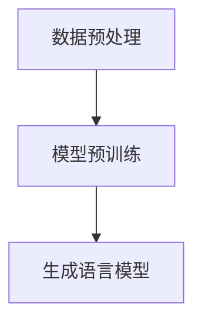
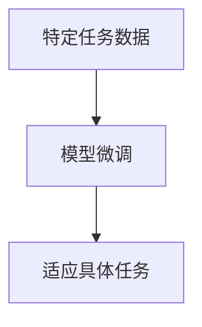
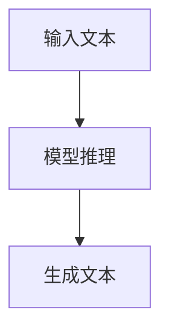
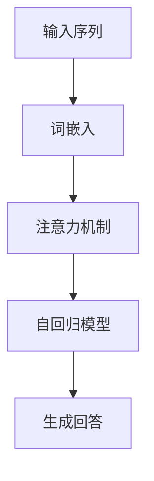

# AIGC从入门到实战：ChatGPT 说自己能做什么？

## 1.背景介绍

人工智能生成内容（AIGC，Artificial Intelligence Generated Content）是近年来迅速崛起的技术领域。随着深度学习和自然语言处理（NLP）技术的进步，AIGC 已经从理论研究走向了实际应用。ChatGPT 作为 OpenAI 开发的一个强大的语言模型，展示了 AIGC 在生成自然语言文本方面的巨大潜力。

### 1.1 AIGC 的发展历程

AIGC 的发展可以追溯到早期的规则基础系统和简单的统计模型。随着计算能力的提升和大数据的普及，深度学习模型逐渐成为主流。特别是自从 Transformer 架构的提出，AIGC 进入了一个新的时代。GPT（Generative Pre-trained Transformer）系列模型是这一领域的代表作。

### 1.2 ChatGPT 的诞生

ChatGPT 是基于 GPT-3 的一个变体，具有强大的文本生成能力。它通过大量的文本数据进行预训练，并通过微调（fine-tuning）来适应特定任务。ChatGPT 的出现标志着 AIGC 技术的一个重要里程碑，使得生成高质量的自然语言文本成为可能。

## 2.核心概念与联系

在深入探讨 ChatGPT 的具体应用之前，我们需要了解一些核心概念和它们之间的联系。

### 2.1 自然语言处理（NLP）

自然语言处理是计算机科学与人工智能的一个分支，旨在使计算机能够理解、解释和生成人类语言。NLP 涉及多个子领域，包括语音识别、文本分析、机器翻译等。

### 2.2 深度学习

深度学习是机器学习的一个子领域，利用多层神经网络来学习数据的表示。深度学习在图像识别、语音识别和自然语言处理等领域取得了显著的成果。

### 2.3 Transformer 架构

Transformer 是一种基于注意力机制的神经网络架构，解决了传统 RNN 在处理长序列数据时的瓶颈问题。Transformer 架构是 GPT 系列模型的基础。

### 2.4 GPT 模型

GPT（Generative Pre-trained Transformer）是一种基于 Transformer 架构的生成模型。GPT 通过大规模预训练和微调，能够生成高质量的自然语言文本。

### 2.5 ChatGPT 的工作原理

ChatGPT 通过预训练和微调两个阶段来实现其强大的文本生成能力。预训练阶段，模型在大规模文本数据上进行训练，学习语言的基本结构和语义。微调阶段，模型在特定任务的数据上进行训练，以适应具体应用场景。

## 3.核心算法原理具体操作步骤

ChatGPT 的核心算法基于 Transformer 架构，以下是其具体操作步骤。

### 3.1 数据预处理

在训练 ChatGPT 之前，需要对大规模文本数据进行预处理。预处理步骤包括分词、去除停用词、标注词性等。

### 3.2 模型预训练

预训练阶段，模型在大规模文本数据上进行训练。通过自监督学习，模型学习语言的基本结构和语义。



### 3.3 微调

微调阶段，模型在特定任务的数据上进行训练。通过监督学习，模型适应具体应用场景。



### 3.4 推理

推理阶段，模型根据输入生成相应的文本。通过注意力机制，模型能够生成连贯且符合语义的文本。



## 4.数学模型和公式详细讲解举例说明

在这一部分，我们将详细讲解 ChatGPT 的数学模型和公式，并通过具体例子来说明。

### 4.1 Transformer 的注意力机制

Transformer 的核心是注意力机制，它通过计算输入序列中每个元素与其他元素的相关性来生成输出。注意力机制的公式如下：

$$
\text{Attention}(Q, K, V) = \text{softmax}\left(\frac{QK^T}{\sqrt{d_k}}\right)V
$$

其中，$Q$ 是查询矩阵，$K$ 是键矩阵，$V$ 是值矩阵，$d_k$ 是键的维度。

### 4.2 GPT 的生成过程

GPT 的生成过程基于自回归模型，即通过前一步的输出生成下一步的输入。生成过程的公式如下：

$$
P(x_t | x_{<t}) = \text{softmax}(W_o h_t)
$$

其中，$x_t$ 是第 $t$ 个时间步的输出，$x_{<t}$ 是前 $t-1$ 个时间步的输入，$W_o$ 是输出权重矩阵，$h_t$ 是第 $t$ 个时间步的隐藏状态。

### 4.3 示例说明

假设我们有一个输入序列 "Hello, how are you?"，我们希望生成一个回答。首先，我们将输入序列转换为词嵌入，然后通过注意力机制计算每个词的相关性，最后通过自回归模型生成回答。



## 5.项目实践：代码实例和详细解释说明

在这一部分，我们将通过一个具体的代码实例来展示如何使用 ChatGPT 进行文本生成。

### 5.1 环境配置

首先，我们需要配置开发环境。安装必要的库和工具。

```bash
pip install transformers
pip install torch
```

### 5.2 加载预训练模型

接下来，我们加载预训练的 ChatGPT 模型。

```python
from transformers import GPT2LMHeadModel, GPT2Tokenizer

model_name = 'gpt2'
model = GPT2LMHeadModel.from_pretrained(model_name)
tokenizer = GPT2Tokenizer.from_pretrained(model_name)
```

### 5.3 文本生成

我们可以使用加载的模型生成文本。以下是一个简单的示例。

```python
input_text = "Hello, how are you?"
input_ids = tokenizer.encode(input_text, return_tensors='pt')

output = model.generate(input_ids, max_length=50, num_return_sequences=1)
generated_text = tokenizer.decode(output[0], skip_special_tokens=True)

print(generated_text)
```

### 5.4 详细解释

在上述代码中，我们首先加载了预训练的 GPT-2 模型和对应的分词器。然后，我们将输入文本转换为模型可以处理的输入 ID。接着，我们使用模型生成文本，并将生成的 ID 转换回文本格式。

## 6.实际应用场景

ChatGPT 具有广泛的应用场景，以下是一些典型的应用。

### 6.1 客服机器人

ChatGPT 可以用于构建智能客服机器人，提供自动化的客户服务。通过训练模型在特定领域的数据上，客服机器人可以回答客户的常见问题，提高服务效率。

### 6.2 内容创作

ChatGPT 可以用于生成高质量的文章、博客、新闻报道等内容。通过提供主题和关键词，模型可以生成连贯且有深度的文本，辅助内容创作者提高生产力。

### 6.3 语言翻译

虽然 ChatGPT 不是专门的翻译模型，但它可以用于简单的语言翻译任务。通过训练模型在多语言数据上，ChatGPT 可以生成不同语言的文本。

### 6.4 教育和培训

ChatGPT 可以用于教育和培训领域，生成教学材料、练习题和答案等。通过个性化的生成内容，模型可以辅助教师和学生提高学习效果。

## 7.工具和资源推荐

在使用 ChatGPT 进行开发时，有一些工具和资源可以帮助我们提高效率。

### 7.1 开发工具

- **Transformers 库**：由 Hugging Face 提供的开源库，支持多种预训练模型，包括 GPT-2 和 GPT-3。
- **PyTorch**：一个流行的深度学习框架，支持动态计算图和自动微分。

### 7.2 数据集

- **OpenAI GPT-3 数据集**：包含大量的文本数据，用于训练和微调 GPT-3 模型。
- **Common Crawl**：一个开源的网页抓取数据集，包含大量的网页文本数据。

### 7.3 在线资源

- **Hugging Face Model Hub**：一个在线平台，提供预训练模型和数据集的下载。
- **OpenAI 官方文档**：提供详细的模型使用说明和 API 文档。

## 8.总结：未来发展趋势与挑战

ChatGPT 作为 AIGC 技术的代表，展示了生成自然语言文本的巨大潜力。然而，未来的发展仍面临一些挑战。

### 8.1 发展趋势

- **模型规模的扩大**：随着计算能力的提升，未来的模型将更加庞大，生成的文本质量也将进一步提高。
- **多模态生成**：未来的 AIGC 技术将不仅限于文本生成，还将涉及图像、音频等多种模态的生成。
- **个性化生成**：通过个性化的训练数据，模型将能够生成更加符合用户需求的内容。

### 8.2 挑战

- **数据隐私**：在使用大规模数据进行训练时，如何保护用户的隐私是一个重要的挑战。
- **生成质量**：虽然 ChatGPT 生成的文本质量已经很高，但在某些情况下仍可能出现不连贯或不准确的内容。
- **伦理问题**：AIGC 技术的应用可能带来一些伦理问题，如生成虚假信息、侵犯版权等。

## 9.附录：常见问题与解答

### 9.1 ChatGPT 可以生成多种语言的文本吗？

是的，ChatGPT 可以生成多种语言的文本，但生成质量取决于训练数据的多样性和质量。

### 9.2 如何提高 ChatGPT 生成文本的质量？

可以通过微调模型在特定领域的数据上，提高生成文本的质量。此外，使用更大的模型和更高质量的数据也有助于提高生成质量。

### 9.3 ChatGPT 可以用于实时应用吗？

是的，ChatGPT 可以用于实时应用，但需要考虑计算资源和响应时间。通过优化模型和使用高效的推理框架，可以提高实时应用的性能。

### 9.4 ChatGPT 的生成内容是否总是准确的？

虽然 ChatGPT 生成的内容通常是连贯且有意义的，但在某些情况下可能会出现不准确或不连贯的内容。因此，在实际应用中需要对生成内容进行验证和校对。

### 9.5 如何保护用户隐私？

在使用大规模数据进行训练时，需要采取措施保护用户隐私。例如，可以对数据进行匿名化处理，避免泄露用户的个人信息。

---

作者：禅与计算机程序设计艺术 / Zen and the Art of Computer Programming