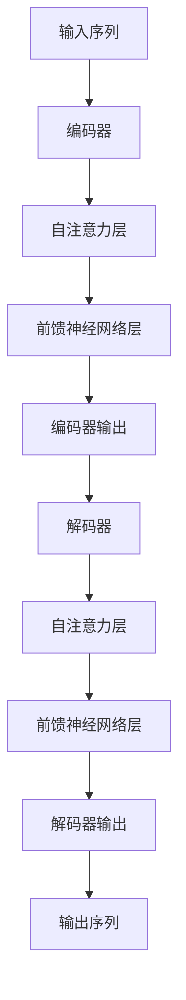

# AIGC从入门到实战：自然语言处理和大语言模型简介

## 1.背景介绍

### 1.1 人工智能生成内容（AIGC）的兴起

人工智能生成内容（AIGC，Artificial Intelligence Generated Content）是近年来人工智能领域的一个重要分支。随着深度学习和大数据技术的快速发展，AIGC在文本、图像、音频和视频等多种媒体形式的生成上取得了显著进展。特别是在自然语言处理（NLP）和大语言模型（LLM）方面，AIGC展示了强大的潜力和广泛的应用前景。

### 1.2 自然语言处理的历史与发展

自然语言处理（NLP，Natural Language Processing）是计算机科学与人工智能的一个重要分支，旨在实现计算机对人类语言的理解、生成和交互。NLP的发展经历了从规则驱动的方法到统计方法，再到如今的深度学习方法的演变。近年来，基于深度学习的模型，尤其是大语言模型（如GPT-3），在NLP任务中表现出色，推动了AIGC的发展。

### 1.3 大语言模型的崛起

大语言模型（LLM，Large Language Model）是指具有大量参数和训练数据的深度学习模型，能够生成高质量的自然语言文本。以OpenAI的GPT-3为代表的大语言模型，通过预训练和微调，在文本生成、翻译、问答等任务中表现出色，成为AIGC的重要技术支撑。

## 2.核心概念与联系

### 2.1 自然语言处理的基本概念

自然语言处理涉及多个核心概念和任务，包括但不限于：

- **分词**：将文本划分为单词或词组。
- **词性标注**：为每个单词分配词性标签。
- **命名实体识别（NER）**：识别文本中的实体，如人名、地名、组织名等。
- **句法分析**：分析句子的语法结构。
- **情感分析**：判断文本的情感倾向。
- **机器翻译**：将文本从一种语言翻译成另一种语言。
- **文本生成**：生成连贯且有意义的文本。

### 2.2 大语言模型的基本概念

大语言模型是基于深度学习的模型，通常采用Transformer架构。其核心概念包括：

- **预训练**：在大规模文本数据上进行无监督学习，学习语言的基本结构和知识。
- **微调**：在特定任务或领域的数据上进行有监督学习，优化模型在特定任务上的表现。
- **注意力机制**：通过计算输入序列中各个位置之间的相关性，捕捉长距离依赖关系。

### 2.3 自然语言处理与大语言模型的联系

自然语言处理和大语言模型密切相关。大语言模型通过预训练和微调，可以在多种NLP任务中表现出色，显著提升了文本生成、翻译、问答等任务的效果。大语言模型的强大能力使得AIGC在实际应用中变得更加可行和高效。

## 3.核心算法原理具体操作步骤

### 3.1 Transformer架构

Transformer是大语言模型的核心架构，其主要特点是基于注意力机制，能够高效处理长序列数据。Transformer由编码器和解码器组成，每个编码器和解码器包含多个自注意力层和前馈神经网络层。



### 3.2 预训练和微调

大语言模型的训练过程分为预训练和微调两个阶段：

- **预训练**：在大规模无标签文本数据上进行训练，学习语言的基本结构和知识。常用的预训练任务包括语言模型任务（如掩码语言模型和自回归语言模型）。
- **微调**：在特定任务或领域的数据上进行有监督训练，优化模型在特定任务上的表现。

### 3.3 具体操作步骤

1. **数据准备**：收集和清洗大规模文本数据，构建训练数据集。
2. **模型初始化**：初始化Transformer模型的参数。
3. **预训练**：在大规模文本数据上进行预训练，学习语言的基本结构和知识。
4. **微调**：在特定任务或领域的数据上进行微调，优化模型在特定任务上的表现。
5. **评估和优化**：使用验证集评估模型性能，调整超参数和模型结构，进一步优化模型。

## 4.数学模型和公式详细讲解举例说明

### 4.1 注意力机制

注意力机制是Transformer的核心，其基本思想是通过计算输入序列中各个位置之间的相关性，捕捉长距离依赖关系。注意力机制的计算公式如下：

$$
\text{Attention}(Q, K, V) = \text{softmax}\left(\frac{QK^T}{\sqrt{d_k}}\right)V
$$

其中，$Q$、$K$、$V$分别表示查询矩阵、键矩阵和值矩阵，$d_k$表示键矩阵的维度。

### 4.2 自注意力层

自注意力层是Transformer的基本组成部分，其计算过程如下：

1. **输入嵌入**：将输入序列转换为嵌入向量。
2. **线性变换**：将嵌入向量分别线性变换为查询矩阵、键矩阵和值矩阵。
3. **注意力计算**：使用注意力机制计算注意力权重，并加权求和得到输出向量。

### 4.3 前馈神经网络层

前馈神经网络层是Transformer的另一个重要组成部分，其计算过程如下：

$$
\text{FFN}(x) = \text{ReLU}(xW_1 + b_1)W_2 + b_2
$$

其中，$W_1$、$W_2$、$b_1$、$b_2$为可训练参数，ReLU为激活函数。

### 4.4 示例说明

假设输入序列为 $X = [x_1, x_2, \ldots, x_n]$，经过自注意力层和前馈神经网络层的计算，得到输出序列 $Y = [y_1, y_2, \ldots, y_n]$。具体计算过程如下：

1. **输入嵌入**：将 $X$ 转换为嵌入向量 $E = [e_1, e_2, \ldots, e_n]$。
2. **线性变换**：将 $E$ 分别线性变换为查询矩阵 $Q$、键矩阵 $K$ 和值矩阵 $V$。
3. **注意力计算**：使用注意力机制计算注意力权重，并加权求和得到输出向量 $A$。
4. **前馈神经网络**：将 $A$ 输入前馈神经网络层，得到最终输出 $Y$。

## 5.项目实践：代码实例和详细解释说明

### 5.1 环境准备

在开始项目实践之前，需要准备好开发环境。推荐使用Python和深度学习框架如TensorFlow或PyTorch。

### 5.2 数据准备

收集和清洗大规模文本数据，构建训练数据集。可以使用公开的文本数据集，如Wikipedia、Common Crawl等。

### 5.3 模型实现

以下是使用PyTorch实现一个简单的Transformer模型的代码示例：

```python
import torch
import torch.nn as nn
import torch.optim as optim

class TransformerModel(nn.Module):
    def __init__(self, input_dim, model_dim, num_heads, num_layers, output_dim):
        super(TransformerModel, self).__init__()
        self.encoder = nn.TransformerEncoder(
            nn.TransformerEncoderLayer(model_dim, num_heads), num_layers)
        self.decoder = nn.Linear(model_dim, output_dim)

    def forward(self, src):
        enc_output = self.encoder(src)
        output = self.decoder(enc_output)
        return output

# 参数设置
input_dim = 512
model_dim = 512
num_heads = 8
num_layers = 6
output_dim = 512

# 模型初始化
model = TransformerModel(input_dim, model_dim, num_heads, num_layers, output_dim)
criterion = nn.CrossEntropyLoss()
optimizer = optim.Adam(model.parameters(), lr=0.001)

# 训练过程
for epoch in range(10):
    for batch in data_loader:
        src, tgt = batch
        optimizer.zero_grad()
        output = model(src)
        loss = criterion(output, tgt)
        loss.backward()
        optimizer.step()
    print(f'Epoch {epoch+1}, Loss: {loss.item()}')
```

### 5.4 代码解释

- **模型定义**：定义了一个简单的Transformer模型，包括编码器和解码器。
- **参数设置**：设置了模型的参数，如输入维度、模型维度、注意力头数、层数和输出维度。
- **模型初始化**：初始化模型、损失函数和优化器。
- **训练过程**：在训练数据上进行迭代训练，计算损失并更新模型参数。

### 5.5 模型评估

使用验证集评估模型性能，计算准确率、精确率、召回率等指标。可以使用以下代码进行评估：

```python
# 模型评估
model.eval()
correct = 0
total = 0
with torch.no_grad():
    for batch in val_loader:
        src, tgt = batch
        output = model(src)
        _, predicted = torch.max(output.data, 1)
        total += tgt.size(0)
        correct += (predicted == tgt).sum().item()

accuracy = correct / total
print(f'Validation Accuracy: {accuracy * 100:.2f}%')
```

## 6.实际应用场景

### 6.1 文本生成

大语言模型在文本生成任务中表现出色，可以用于自动写作、新闻生成、对话系统等应用。例如，GPT-3可以生成高质量的文章、故事和对话，极大地提升了文本生成的自动化水平。

### 6.2 机器翻译

大语言模型在机器翻译任务中也表现出色，可以实现多语言之间的高质量翻译。例如，Google Translate使用基于Transformer的模型，实现了多语言之间的实时翻译。

### 6.3 问答系统

大语言模型可以用于构建智能问答系统，提供准确和详细的回答。例如，OpenAI的GPT-3可以回答各种问题，从简单的事实性问题到复杂的推理问题。

### 6.4 情感分析

大语言模型可以用于情感分析，判断文本的情感倾向。例如，可以用于社交媒体评论的情感分析，帮助企业了解用户的情感反馈。

### 6.5 信息抽取

大语言模型可以用于信息抽取，从文本中提取有用的信息。例如，可以用于新闻摘要、知识图谱构建等应用。

## 7.工具和资源推荐

### 7.1 开发工具

- **Python**：广泛使用的编程语言，适合NLP和深度学习开发。
- **TensorFlow**：谷歌开发的深度学习框架，支持大规模分布式训练。
- **PyTorch**：Facebook开发的深度学习框架，易于使用和调试。

### 7.2 数据集

- **Wikipedia**：大规模的百科全书数据集，适合预训练大语言模型。
- **Common Crawl**：大规模的网页抓取数据集，适合预训练大语言模型。
- **OpenAI GPT-3 Dataset**：OpenAI用于训练GPT-3的数据集，包含多种文本数据。

### 7.3 预训练模型

- **GPT-3**：OpenAI发布的大语言模型，支持多种NLP任务。
- **BERT**：谷歌发布的预训练模型，适合多种NLP任务。
- **T5**：谷歌发布的文本到文本转换模型，适合多种NLP任务。

## 8.总结：未来发展趋势与挑战

### 8.1 未来发展趋势

- **模型规模和性能提升**：随着计算能力和数据规模的增加，大语言模型的规模和性能将继续提升，能够处理更复杂的任务。
- **多模态融合**：未来的大语言模型将不仅限于文本处理，还将融合图像、音频等多种模态，实现更丰富的生成内容。
- **个性化和定制化**：未来的大语言模型将更加注重个性化和定制化，能够根据用户需求生成个性化的内容。

### 8.2 面临的挑战

- **数据隐私和安全**：大规模数据的使用带来了数据隐私和安全问题，需要制定相应的政策和技术措施。
- **模型偏见和公平性**：大语言模型可能存在偏见和不公平性，需要进行模型评估和优化，确保模型的公平性。
- **计算资源和能耗**：大语言模型的训练和推理需要大量的计算资源和能耗，需要优化模型结构和算法，提高计算效率。

## 9.附录：常见问题与解答

### 9.1 什么是大语言模型？

大语言模型是指具有大量参数和训练数据的深度学习模型，能够生成高质量的自然语言文本。以OpenAI的GPT-3为代表的大语言模型，通过预训练和微调，在文本生成、翻译、问答等任务中表现出色。

### 9.2 大语言模型的核心技术是什么？

大语言模型的核心技术是基于Transformer架构的深度学习模型，采用注意力机制捕捉长距离依赖关系，通过预训练和微调实现高质量的文本生成。

### 9.3 如何训练大语言模型？

训练大语言模型通常分为预训练和微调两个阶段。预训练在大规模无标签文本数据上进行，学习语言的基本结构和知识；微调在特定任务或领域的数据上进行，优化模型在特定任务上的表现。

### 9.4 大语言模型的应用场景有哪些？

大语言模型的应用场景包括文本生成、机器翻译、问答系统、情感分析、信息抽取等。其强大的生成能力和多任务处理能力使得AIGC在实际应用中变得更加可行和高效。

### 9.5 大语言模型面临哪些挑战？

大语言模型面临的数据隐私和安全、模型偏见和公平性、计算资源和能耗等挑战。需要制定相应的政策和技术措施，优化模型结构和算法，提高计算效率，确保模型的公平性和安全性。

---

作者：禅与计算机程序设计艺术 / Zen and the Art of Computer Programming