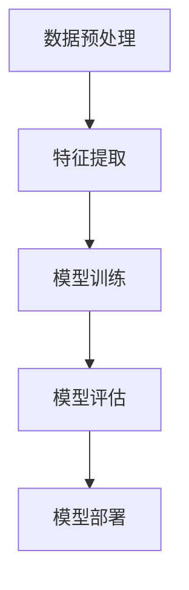

# AI系统日志分析原理与代码实战案例讲解

## 1.背景介绍

在现代信息技术的飞速发展中，系统日志分析已经成为保障系统稳定性和安全性的重要手段。系统日志记录了系统运行过程中的各种事件和状态信息，通过对这些日志的分析，可以发现系统潜在的问题、优化系统性能、提升安全性。随着人工智能技术的进步，AI在系统日志分析中的应用也越来越广泛。本文将深入探讨AI系统日志分析的原理，并通过具体的代码实例进行实战讲解。

## 2.核心概念与联系

### 2.1 系统日志

系统日志是指记录系统运行状态、事件和错误信息的文件或数据流。常见的系统日志包括操作系统日志、应用程序日志、安全日志等。

### 2.2 日志分析

日志分析是指通过对系统日志数据的收集、处理和分析，提取有价值的信息，发现系统问题和优化系统性能的过程。

### 2.3 人工智能

人工智能（AI）是指通过计算机模拟人类智能的技术，包括机器学习、深度学习、自然语言处理等。

### 2.4 AI在日志分析中的应用

AI在日志分析中的应用主要包括异常检测、模式识别、预测分析等。通过AI技术，可以自动化地分析海量日志数据，提高分析效率和准确性。

### 2.5 核心联系

系统日志、日志分析和人工智能三者之间的联系紧密。系统日志是日志分析的基础，而AI技术则是提升日志分析效率和准确性的关键。

## 3.核心算法原理具体操作步骤

### 3.1 数据预处理

数据预处理是日志分析的第一步，主要包括日志数据的收集、清洗和格式化。常见的预处理步骤包括去除无关信息、处理缺失值、时间戳对齐等。

### 3.2 特征提取

特征提取是指从原始日志数据中提取有用的信息，以便后续的分析和建模。常见的特征提取方法包括词频统计、TF-IDF、词向量等。

### 3.3 模型训练

模型训练是指使用机器学习或深度学习算法，基于提取的特征数据，训练一个能够进行日志分析的模型。常见的算法包括决策树、随机森林、支持向量机、神经网络等。

### 3.4 模型评估

模型评估是指对训练好的模型进行性能评估，常用的评估指标包括准确率、召回率、F1值等。

### 3.5 模型部署

模型部署是指将训练好的模型应用到实际的日志分析任务中，实现自动化的日志分析。

以下是核心算法流程图：



## 4.数学模型和公式详细讲解举例说明

### 4.1 词频统计

词频统计是特征提取的一种基本方法，通过统计日志中每个词出现的频率，构建特征向量。假设日志中有 $N$ 个词，词频向量为 $\mathbf{f} = [f_1, f_2, \ldots, f_N]$，其中 $f_i$ 表示第 $i$ 个词的频率。

### 4.2 TF-IDF

TF-IDF（Term Frequency-Inverse Document Frequency）是一种常用的特征提取方法，用于衡量词语在文档中的重要性。TF-IDF 的计算公式为：

$$
\text{TF-IDF}(t, d) = \text{TF}(t, d) \times \text{IDF}(t)
$$

其中，$\text{TF}(t, d)$ 表示词 $t$ 在文档 $d$ 中的词频，$\text{IDF}(t)$ 表示词 $t$ 的逆文档频率，计算公式为：

$$
\text{IDF}(t) = \log \frac{N}{|\{d \in D : t \in d\}|}
$$

### 4.3 词向量

词向量是将词语表示为固定维度的向量，常用的方法包括Word2Vec、GloVe等。假设词语 $w$ 的词向量为 $\mathbf{v}_w$，则词向量模型的目标是使相似词语的向量距离尽可能近。

### 4.4 决策树

决策树是一种常用的分类算法，通过构建树形结构进行决策。假设特征向量为 $\mathbf{x} = [x_1, x_2, \ldots, x_n]$，决策树的目标是找到一个最优的划分，使得每个节点的纯度最大。

### 4.5 随机森林

随机森林是由多棵决策树组成的集成学习算法，通过对多个决策树的结果进行投票，得到最终的分类结果。假设有 $M$ 棵决策树，每棵树的分类结果为 $h_m(\mathbf{x})$，则随机森林的分类结果为：

$$
H(\mathbf{x}) = \text{mode}\{h_1(\mathbf{x}), h_2(\mathbf{x}), \ldots, h_M(\mathbf{x})\}
$$

### 4.6 支持向量机

支持向量机（SVM）是一种常用的分类算法，通过找到一个最优的超平面，将不同类别的样本分开。假设特征向量为 $\mathbf{x}$，超平面的方程为 $\mathbf{w} \cdot \mathbf{x} + b = 0$，SVM 的目标是最大化超平面的间隔。

### 4.7 神经网络

神经网络是一种模拟人脑神经元结构的算法，通过多层神经元的连接，实现复杂的非线性映射。假设输入向量为 $\mathbf{x}$，权重矩阵为 $\mathbf{W}$，偏置向量为 $\mathbf{b}$，激活函数为 $f$，则神经网络的输出为：

$$
\mathbf{y} = f(\mathbf{W} \cdot \mathbf{x} + \mathbf{b})
```

## 5.项目实践：代码实例和详细解释说明

### 5.1 数据预处理

以下是一个简单的日志数据预处理示例代码：

```python
import pandas as pd
import re

# 读取日志文件
log_data = pd.read_csv('system_log.csv')

# 去除无关信息
log_data['message'] = log_data['message'].apply(lambda x: re.sub(r'\[.*?\]', '', x))

# 处理缺失值
log_data.dropna(inplace=True)

# 时间戳对齐
log_data['timestamp'] = pd.to_datetime(log_data['timestamp'])
log_data.set_index('timestamp', inplace=True)
```

### 5.2 特征提取

以下是一个简单的TF-IDF特征提取示例代码：

```python
from sklearn.feature_extraction.text import TfidfVectorizer

# 提取日志消息
messages = log_data['message'].tolist()

# 计算TF-IDF
vectorizer = TfidfVectorizer()
tfidf_matrix = vectorizer.fit_transform(messages)
```

### 5.3 模型训练

以下是一个简单的随机森林模型训练示例代码：

```python
from sklearn.ensemble import RandomForestClassifier
from sklearn.model_selection import train_test_split

# 提取特征和标签
X = tfidf_matrix
y = log_data['label']

# 划分训练集和测试集
X_train, X_test, y_train, y_test = train_test_split(X, y, test_size=0.2, random_state=42)

# 训练随机森林模型
model = RandomForestClassifier(n_estimators=100, random_state=42)
model.fit(X_train, y_train)
```

### 5.4 模型评估

以下是一个简单的模型评估示例代码：

```python
from sklearn.metrics import accuracy_score, classification_report

# 预测测试集
y_pred = model.predict(X_test)

# 计算准确率
accuracy = accuracy_score(y_test, y_pred)
print(f'Accuracy: {accuracy:.2f}')

# 打印分类报告
report = classification_report(y_test, y_pred)
print(report)
```

### 5.5 模型部署

以下是一个简单的模型部署示例代码：

```python
import joblib

# 保存模型
joblib.dump(model, 'log_analysis_model.pkl')

# 加载模型
loaded_model = joblib.load('log_analysis_model.pkl')

# 预测新日志数据
new_messages = ['example log message']
new_tfidf_matrix = vectorizer.transform(new_messages)
new_predictions = loaded_model.predict(new_tfidf_matrix)
print(new_predictions)
```

## 6.实际应用场景

### 6.1 异常检测

通过AI技术，可以自动化地检测系统日志中的异常事件，及时发现系统故障和安全威胁。例如，使用机器学习算法训练一个异常检测模型，识别出异常日志条目。

### 6.2 性能优化

通过分析系统日志，可以发现系统性能瓶颈，优化系统配置和资源分配。例如，使用深度学习算法分析日志数据，识别出影响系统性能的关键因素。

### 6.3 安全监控

通过AI技术，可以自动化地监控系统日志中的安全事件，提升系统安全性。例如，使用自然语言处理技术分析日志数据，识别出潜在的安全威胁。

### 6.4 预测分析

通过AI技术，可以对系统日志进行预测分析，提前预警系统故障和性能问题。例如，使用时间序列分析算法预测系统负载变化，提前采取措施。

## 7.工具和资源推荐

### 7.1 日志收集工具

- ELK Stack（Elasticsearch, Logstash, Kibana）：一个开源的日志收集、存储和分析平台。
- Fluentd：一个开源的数据收集和传输工具，支持多种数据源和目标。

### 7.2 数据处理工具

- Pandas：一个强大的数据处理和分析库，适用于处理结构化数据。
- NumPy：一个高性能的科学计算库，适用于处理大规模数据。

### 7.3 机器学习工具

- Scikit-learn：一个开源的机器学习库，提供了丰富的机器学习算法和工具。
- TensorFlow：一个开源的深度学习框架，适用于构建和训练神经网络模型。

### 7.4 自然语言处理工具

- NLTK：一个开源的自然语言处理库，提供了丰富的文本处理工具和资源。
- SpaCy：一个高性能的自然语言处理库，适用于大规模文本处理。

## 8.总结：未来发展趋势与挑战

### 8.1 发展趋势

随着人工智能技术的不断进步，AI在系统日志分析中的应用将会越来越广泛。未来，AI技术将进一步提升日志分析的自动化程度和准确性，帮助企业更好地保障系统稳定性和安全性。

### 8.2 挑战

尽管AI在日志分析中具有广阔的应用前景，但也面临一些挑战。例如，日志数据的多样性和复杂性增加了数据预处理的难度，模型训练和部署也需要大量的计算资源。此外，如何保证日志分析的实时性和准确性，也是一个亟待解决的问题。

## 9.附录：常见问题与解答

### 9.1 如何处理日志数据中的噪声？

日志数据中的噪声可以通过数据清洗和预处理来处理。例如，去除无关信息、处理缺失值、时间戳对齐等。

### 9.2 如何选择合适的特征提取方法？

特征提取方法的选择取决于具体的日志数据和分析任务。常见的特征提取方法包括词频统计、TF-IDF、词向量等。

### 9.3 如何评估模型的性能？

模型的性能可以通过准确率、召回率、F1值等指标进行评估。可以使用交叉验证等方法，确保模型的泛化能力。

### 9.4 如何提升日志分析的实时性？

提升日志分析的实时性可以通过优化数据处理和模型推理的效率。例如，使用高性能的计算资源、优化算法和数据结构等。

### 9.5 如何保证日志分析的准确性？

保证日志分析的准确性可以通过选择合适的算法、进行充分的数据预处理和特征提取、使用交叉验证等方法。

---

作者：禅与计算机程序设计艺术 / Zen and the Art of Computer Programming