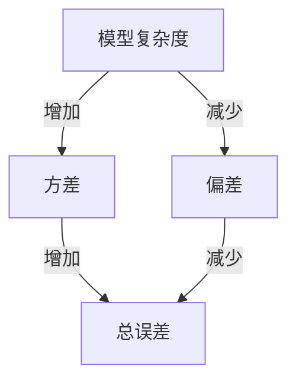

# Bias-Variance Tradeoff 原理与代码实战案例讲解

## 1.背景介绍

在机器学习和统计学中，Bias-Variance Tradeoff（偏差-方差权衡）是一个至关重要的概念。它描述了模型复杂度与预测误差之间的关系。理解这一权衡对于构建高效的机器学习模型至关重要，因为它直接影响模型的泛化能力和预测性能。

### 1.1 什么是偏差和方差

偏差（Bias）是指模型预测值与真实值之间的差异。高偏差通常意味着模型过于简单，无法捕捉数据的复杂模式。方差（Variance）是指模型预测值的波动性。高方差通常意味着模型过于复杂，容易对训练数据中的噪声进行过拟合。

### 1.2 偏差-方差权衡的重要性

偏差和方差之间存在一种权衡关系：降低偏差通常会增加方差，反之亦然。找到一个平衡点，使得模型既不过拟合也不过简化，是构建高效模型的关键。

## 2.核心概念与联系

### 2.1 偏差（Bias）

偏差是指模型预测的期望值与真实值之间的差异。高偏差模型通常过于简单，无法捕捉数据的复杂性，导致系统性误差。

### 2.2 方差（Variance）

方差是指模型预测值的波动性。高方差模型通常过于复杂，容易对训练数据中的噪声进行过拟合，导致在新数据上的表现不佳。

### 2.3 噪声（Noise）

噪声是指数据中不可预测的随机误差。无论模型多么复杂，噪声都是无法完全消除的。

### 2.4 偏差-方差分解

预测误差可以分解为偏差、方差和噪声三部分：

$$
\text{总误差} = \text{偏差}^2 + \text{方差} + \text{噪声}
$$

### 2.5 偏差-方差权衡图示



## 3.核心算法原理具体操作步骤

### 3.1 数据准备

首先，我们需要准备数据集。数据集应包含足够的样本，以便能够有效地训练和评估模型。

### 3.2 模型选择

选择适当的模型是关键。简单模型（如线性回归）通常具有高偏差低方差，而复杂模型（如深度神经网络）通常具有低偏差高方差。

### 3.3 训练模型

使用训练数据集训练模型。确保模型能够有效地拟合训练数据，但不过拟合。

### 3.4 评估模型

使用验证数据集评估模型的性能。计算偏差和方差，以确定模型的泛化能力。

### 3.5 调整模型

根据评估结果，调整模型的复杂度。例如，可以通过正则化技术来控制模型的复杂度。

## 4.数学模型和公式详细讲解举例说明

### 4.1 偏差的数学定义

偏差可以通过以下公式计算：

$$
\text{Bias} = \mathbb{E}[\hat{f}(x)] - f(x)
$$

其中，$\hat{f}(x)$ 是模型的预测值，$f(x)$ 是真实值。

### 4.2 方差的数学定义

方差可以通过以下公式计算：

$$
\text{Variance} = \mathbb{E}[(\hat{f}(x) - \mathbb{E}[\hat{f}(x)])^2]
$$

### 4.3 总误差的分解

总误差可以分解为偏差、方差和噪声：

$$
\text{总误差} = \text{Bias}^2 + \text{Variance} + \text{Noise}
$$

### 4.4 举例说明

假设我们有一个简单的线性回归模型和一个复杂的多项式回归模型。线性回归模型可能具有高偏差低方差，而多项式回归模型可能具有低偏差高方差。通过计算两者的偏差和方差，我们可以确定哪种模型更适合当前数据集。

## 5.项目实践：代码实例和详细解释说明

### 5.1 数据集准备

我们将使用一个简单的合成数据集来演示偏差-方差权衡。

```python
import numpy as np
import matplotlib.pyplot as plt

# 生成数据
np.random.seed(0)
X = np.linspace(-3, 3, 100)
y = np.sin(X) + np.random.normal(0, 0.1, 100)

plt.scatter(X, y)
plt.title("合成数据集")
plt.show()
```

### 5.2 模型训练与评估

我们将训练两个模型：线性回归和多项式回归，并评估它们的偏差和方差。

```python
from sklearn.linear_model import LinearRegression
from sklearn.preprocessing import PolynomialFeatures
from sklearn.pipeline import make_pipeline
from sklearn.metrics import mean_squared_error

# 线性回归模型
linear_model = LinearRegression()
linear_model.fit(X.reshape(-1, 1), y)
y_pred_linear = linear_model.predict(X.reshape(-1, 1))

# 多项式回归模型
poly_model = make_pipeline(PolynomialFeatures(degree=10), LinearRegression())
poly_model.fit(X.reshape(-1, 1), y)
y_pred_poly = poly_model.predict(X.reshape(-1, 1))

# 计算误差
mse_linear = mean_squared_error(y, y_pred_linear)
mse_poly = mean_squared_error(y, y_pred_poly)

print(f"线性回归模型的均方误差: {mse_linear}")
print(f"多项式回归模型的均方误差: {mse_poly}")

# 可视化结果
plt.scatter(X, y, label="真实数据")
plt.plot(X, y_pred_linear, label="线性回归", color="r")
plt.plot(X, y_pred_poly, label="多项式回归", color="g")
plt.legend()
plt.title("模型预测结果")
plt.show()
```

### 5.3 结果分析

通过比较线性回归和多项式回归的均方误差，我们可以看到多项式回归模型在训练数据上的表现更好，但可能在新数据上表现不佳，体现了高方差的特性。

## 6.实际应用场景

### 6.1 机器学习模型选择

在实际应用中，选择合适的模型是关键。偏差-方差权衡可以帮助我们在简单模型和复杂模型之间找到平衡点。

### 6.2 超参数调优

通过调整模型的超参数（如正则化参数、树的深度等），我们可以控制模型的复杂度，从而优化偏差和方差。

### 6.3 数据增强和特征工程

通过增加数据量或进行特征工程，我们可以减少模型的方差，提高其泛化能力。

## 7.工具和资源推荐

### 7.1 机器学习库

- Scikit-learn：一个强大的Python机器学习库，提供了丰富的模型和工具。
- TensorFlow和PyTorch：用于深度学习的框架，适合构建复杂模型。

### 7.2 数据集

- UCI机器学习库：提供了丰富的公开数据集，适合进行模型训练和评估。
- Kaggle：一个数据科学竞赛平台，提供了大量高质量的数据集和竞赛。

### 7.3 在线课程和书籍

- 《机器学习实战》：一本经典的机器学习入门书籍，适合初学者。
- Coursera和edX上的机器学习课程：提供了丰富的在线课程，适合不同水平的学习者。

## 8.总结：未来发展趋势与挑战

### 8.1 未来发展趋势

随着数据量的增加和计算能力的提升，机器学习模型将变得越来越复杂。如何在复杂模型和简单模型之间找到平衡点，将是未来研究的一个重要方向。

### 8.2 挑战

偏差-方差权衡的一个主要挑战是如何在实际应用中有效地评估和调整模型。随着数据和模型的复杂性增加，这一过程将变得更加困难。

## 9.附录：常见问题与解答

### 9.1 什么是偏差-方差权衡？

偏差-方差权衡是指模型复杂度与预测误差之间的关系。降低偏差通常会增加方差，反之亦然。

### 9.2 如何评估模型的偏差和方差？

可以通过交叉验证等方法评估模型的偏差和方差。计算训练误差和验证误差，可以帮助我们理解模型的泛化能力。

### 9.3 如何调整模型的复杂度？

可以通过调整模型的超参数（如正则化参数、树的深度等）来控制模型的复杂度，从而优化偏差和方差。

### 9.4 什么是过拟合和欠拟合？

过拟合是指模型在训练数据上表现很好，但在新数据上表现不佳，通常是由于模型过于复杂。欠拟合是指模型无法有效地拟合训练数据，通常是由于模型过于简单。

### 9.5 如何选择合适的模型？

选择合适的模型需要考虑数据的复杂性和模型的泛化能力。可以通过交叉验证等方法评估不同模型的性能，从而选择最优模型。

---

作者：禅与计算机程序设计艺术 / Zen and the Art of Computer Programming