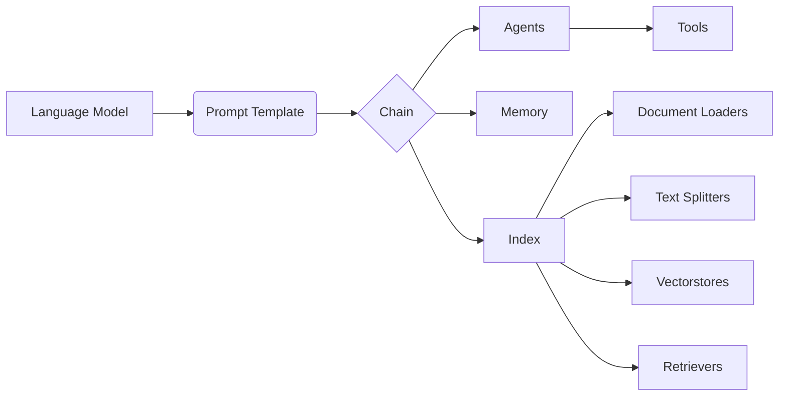

# 【LangChain编程：从入门到实践】快速开始

## 1. 背景介绍
### 1.1  问题的由来
随着人工智能技术的飞速发展，特别是大语言模型的出现，使得自然语言处理(NLP)领域取得了巨大的突破。然而，如何将这些强大的语言模型应用到实际的应用场景中，仍然是一个巨大的挑战。开发者需要花费大量的时间和精力来集成不同的AI组件，处理各种输入输出格式，实现复杂的对话逻辑等。这极大地限制了语言模型的应用范围和效率。

### 1.2  研究现状
为了解决上述问题，一些研究者和开发者开始探索如何简化语言模型应用开发流程，提供更加灵活和高效的工具。其中，LangChain就是一个代表性的开源项目，它提供了一套用于构建语言模型应用的标准接口和工具集，使得开发者可以快速地将语言模型集成到自己的应用中，大大降低了开发难度和成本。

### 1.3  研究意义
LangChain的出现，为语言模型的应用开发带来了新的思路和方法。通过使用LangChain，开发者可以更加专注于应用逻辑本身，而不必过多地关注底层的技术细节。这不仅提高了开发效率，也使得更多的开发者可以参与到语言模型应用的开发中来，促进了人工智能技术的普及和发展。

### 1.4  本文结构
本文将全面介绍LangChain的基本概念、核心组件、开发流程和最佳实践。通过对LangChain的深入剖析，帮助读者快速掌握利用LangChain构建语言模型应用的方法，并在实践中灵活运用。全文分为9个章节，涵盖了LangChain的方方面面：

1. 背景介绍
2. 核心概念与联系
3. 核心算法原理 & 具体操作步骤
4. 数学模型和公式 & 详细讲解 & 举例说明
5. 项目实践：代码实例和详细解释说明
6. 实际应用场景
7. 工具和资源推荐
8. 总结：未来发展趋势与挑战
9. 附录：常见问题与解答

## 2. 核心概念与联系

在正式介绍LangChain之前，我们先来了解几个核心概念：

- 语言模型(Language Model)：一种基于概率统计的自然语言处理模型，通过学习大量文本数据，可以预测下一个最可能出现的词。代表模型有GPT、BERT等。

- 提示工程(Prompt Engineering)：设计优化语言模型输入文本(即Prompt)的过程，使其能够更好地理解任务需求，给出符合预期的输出。

- 语义搜索(Semantic Search)：利用自然语言处理技术，根据文本的语义相似性进行搜索和匹配的方法。常用于问答系统、推荐系统等。

- 知识库问答(Knowledge Base Question Answering)：基于知识库进行自动问答的技术，通过理解自然语言问题并在知识库中搜索匹配，给出准确答案。

LangChain就是围绕着上述几个核心概念来设计和实现的。它利用提示工程来优化语言模型的输入，通过语义搜索和知识库问答来丰富语言模型的知识来源，最终实现端到端的语言模型应用开发。

下面这张图清晰地展示了LangChain中各个核心组件之间的关系：



从图中可以看出，语言模型(Language Model)通过提示模板(Prompt Template)来优化输入，然后将优化后的输入传递给Chain进行处理。Chain是LangChain的核心组件，它将各个组件串联起来，形成一个完整的处理流程。Chain中可以嵌入Agent、Memory和Index等组件，实现更加复杂的功能。

Index主要用于语义搜索和知识库问答，它需要通过Document Loader加载文档，然后对文档进行切分(Text Splitter)、向量化(Vectorstore)，最后通过Retriever实现高效的语义检索。

下面我们将对每个组件进行更加详细的介绍。

## 3. 核心算法原理 & 具体操作步骤
### 3.1 算法原理概述
LangChain的核心算法主要包括两大部分：语言模型的提示优化和语义搜索。

语言模型的提示优化主要是通过Prompt Template来实现的。Prompt Template定义了一套优化语言模型输入的模板和规则，例如如何设置任务描述、上下文信息、few-shot示例等。通过不断地实验和调优Prompt Template，可以显著提升语言模型的性能表现。

语义搜索的核心是将文本转换为语义向量的表示形式，通过向量之间的相似度计算来实现高效的语义匹配。其中，文本向量化的常用算法包括:
- TF-IDF：统计词频-逆文档频率，将文本表示为词袋向量
- Word2Vec：通过浅层神经网络学习词语的分布式表示
- GloVe：基于全局词频统计的无监督学习词向量方法
- BERT等预训练语言模型：利用Transformer编码器学习上下文相关的词语/句子表示

向量化后的文本可以存入向量数据库(Vectorstore)，实现毫秒级的相似度搜索。

### 3.2 算法步骤详解

以下是LangChain执行的主要步骤：

1. 定义Schema：定义目标任务的输入输出接口，明确任务scope和边界。

2. 加载语言模型：选择合适的语言模型，如GPT-3、BERT等，并加载到内存中。

3. 准备Prompt Template：根据Schema设计Prompt Template，优化语言模型输入。可以进一步fine-tune语言模型。

4. 构建Index：加载待检索的文档数据，切分为段落/句子粒度，转换为语义向量并写入Vectorstore。

5. 实例化Chain：将语言模型、Prompt Template、Index等组件组合成一个完整的处理链。

6. 执行Chain：将用户输入传递给Chain，执行端到端的处理流程，返回结果。

7. 评估和调优：对Chain的输出结果进行评估，不断调整Prompt和参数，优化性能。

### 3.3 算法优缺点

LangChain的主要优点包括：

- 简化了语言模型应用开发流程，提供了一套标准的接口和流程
- 封装了丰富的开箱即用的组件，如Prompt Template、Vectorstore等
- 支持灵活组合和定制，可以快速搭建个性化的语言模型应用
- 代码开源，社区活跃，文档丰富，易于学习和使用

但同时它也存在一些局限性：

- 对于超大规模知识库问答等场景，检索效率有待进一步优化
- 语义向量化方法尚不完善，对于一些复杂语义理解任务效果有限
- 缺少成熟的评测基准和实践案例，应用落地有待进一步探索

### 3.4 算法应用领域

LangChain在许多领域都有广泛的应用前景，比如：

- 智能客服/销售助手：利用LangChain搭建基于语言模型的问答系统，自动解答用户咨询。
- 智能文档助手：通过LangChain连接文档库，实现文档智能检索、问答、总结等功能。
- 知识图谱构建：利用LangChain处理非结构化文本数据，自动构建领域知识图谱。
- 语义搜索引擎：通过LangChain将自然语言查询与网页、文档进行语义匹配，实现智能搜索。

未来随着语言模型和LangChain本身的发展，其应用领域必将更加广阔。

## 4. 数学模型和公式 & 详细讲解 & 举例说明
### 4.1 数学模型构建
LangChain中主要涉及两类数学模型：语言模型和向量空间模型。

语言模型使用概率统计方法对文本序列进行建模，其核心是计算一个词语序列 $w_1, w_2, ..., w_n$ 的概率：

$$
P(w_1, w_2, ..., w_n) = \prod_{i=1}^n P(w_i | w_1, w_2, ..., w_{i-1})
$$

其中，$P(w_i | w_1, w_2, ..., w_{i-1})$ 表示在给定前 $i-1$ 个词的情况下，第 $i$ 个词为 $w_i$ 的条件概率。这个概率可以通过训练神经网络模型来估计，如Transformer的Decoder。

向量空间模型将文本对象（如词语、句子、段落等）表示为高维实数向量，通过向量之间的距离或相似度来刻画文本语义。常见的文本向量化方法包括：

- One-hot编码：每个词是一个 $|V|$ 维稀疏向量，只有对应维度为1，其他为0
- Bag-of-words：词袋向量，统计每个词在文本中的出现频次
- TF-IDF：在Bag-of-words基础上，乘以逆文档频率(IDF)，突出重要词语
- Word2Vec：通过预测上下文或者预测当前词来学习词向量
- BERT Embedding：基于Transformer的双向编码器表示学习方法

### 4.2 公式推导过程
以Word2Vec中的Skip-gram模型为例，详细推导其学习词向量的目标函数。

Skip-gram模型的目标是利用中心词来预测其上下文，其似然函数为：

$$
L(\theta) = \prod_{w \in C} \prod_{u \in Context(w)} P(u | w; \theta)
$$

其中，$C$ 为语料库，$Context(w)$ 为词 $w$ 的上下文窗口， $\theta$ 为模型参数。$P(u | w; \theta)$ 为给定中心词 $w$ 生成上下文词 $u$ 的条件概率，可以用Softmax函数定义：

$$
P(u | w; \theta) = \frac{e^{v_u \cdot v_w}}{\sum_{i \in V} e^{v_i \cdot v_w}}
$$

其中，$v_u$ 和 $v_w$ 分别为词 $u$ 和 $w$ 的向量表示，$V$ 为词表。

为了提高训练效率，Skip-gram模型使用负采样(Negative Sampling)来近似Softmax函数。负采样的思想是将多分类问题转化为二分类问题，对于每个正样本，随机采样 $K$ 个负样本，然后最小化如下损失函数：

$$
J_{neg-sample}(\theta) = -\log \sigma(v_{u_o} \cdot v_w) - \sum_{k=1}^K \log \sigma(-v_{u_k} \cdot v_w)
$$

其中，$u_o$ 为中心词 $w$ 的一个真实上下文词，$\{u_k\}_{k=1}^K$ 为随机采样的 $K$ 个负样本，$\sigma(x) = 1 / (1 + e^{-x})$ 为Sigmoid函数。

通过最小化损失函数 $J_{neg-sample}(\theta)$，Skip-gram模型可以学习到每个词语的低维实数向量表示，刻画词语之间的语义相似性。

### 4.3 案例分析与讲解

下面我们以一个简单的例子来说明如何使用LangChain构建一个基于语言模型的问答系统。

假设我们有一个FAQ数据集，包含了一系列常见问题及其答案，格式如下：

```
Q: 如何注册账号？
A: 在首页点击"注册"按钮，填写个人信息并设置密码，即可完成注册。

Q: 如何修改密码？
A: 登录后在个人设置页面中，选择"修改密码"选项，输入旧密码和新密码进行修改。

...
```

我们希望利用LangChain搭建一个问答系统，自动回答用户的常见问题。主要步骤如下：

1. 将FAQ数据集按照问题-答案对的格式进行整理，保存为txt文件或csv文件。

2. 加载FAQ数据集，并将其转化为Document对象列表：

```python
from langchain.document_loaders import TextLoader
loader = TextLoader('faq.txt')
documents = loader.load()