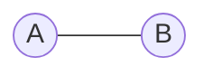

# 黎曼曲面：微分形式与积分

关键词：黎曼曲面、微分形式、积分、代数几何、复分析

## 1. 背景介绍
### 1.1 问题的由来
黎曼曲面是19世纪数学家黎曼提出的一个重要概念,它在复分析、代数几何等领域有着广泛的应用。黎曼曲面上的微分形式与积分理论是现代数学的一个重要分支,在理论数学和数学物理中有着重要地位。

### 1.2 研究现状
目前,黎曼曲面与微分形式的研究已经取得了丰硕的成果。代数几何学家已经建立了黎曼曲面上的微分形式与层进理论,并将其推广到高维代数簇上。复分析学家则利用黎曼曲面上的调和分析方法,研究了黎曼曲面上的Abel-Jacobi映射、Theta函数等重要对象。

### 1.3 研究意义
黎曼曲面上的微分形式与积分理论不仅在纯数学领域有重要意义,在理论物理、密码学等应用领域也有着广泛的应用前景。深入研究黎曼曲面上的微分形式与积分,对于拓展数学新领域、解决前沿科学问题具有重要意义。

### 1.4 本文结构
本文将从以下几个方面介绍黎曼曲面上的微分形式与积分理论：
- 第2节介绍黎曼曲面与微分形式的基本概念
- 第3节介绍黎曼曲面上微分形式的基本性质与分类
- 第4节给出黎曼曲面上微分形式的积分公式与计算方法
- 第5节通过实例展示如何计算黎曼曲面上的周期与驻点
- 第6节介绍黎曼曲面与微分形式在密码学、量子场论等领域的应用
- 第7节推荐相关学习资源与论文
- 第8节对全文进行总结,并对该领域的发展趋势与挑战进行展望

## 2. 核心概念与联系
黎曼曲面是复分析的基本研究对象。一个黎曼曲面 $X$ 是一个连通的复解析流形,局部同构于复平面 $\mathbb{C}$ 或其开子集。直观地说,黎曼曲面就是一个每一点都有一个复坐标卡的曲面。

黎曼曲面上的微分形式是黎曼曲面上的余切丛 $T^*X$ 的截面。设 $X$ 是一个黎曼曲面, $\{(U_\alpha,z_\alpha)\}$ 是 $X$ 的一个复坐标卡覆盖,则 $X$ 上的一个微分形式可以局部表示为
$$\omega|_{U_\alpha}=f_\alpha(z_\alpha)dz_\alpha$$
其中 $f_\alpha$ 是 $U_\alpha$ 上的全纯函数。在坐标卡的交叠区域 $U_\alpha \cap U_\beta$ 上,微分形式满足变换关系:
$$f_\beta(z_\beta)dz_\beta=f_\alpha(z_\alpha)dz_\alpha$$

黎曼曲面上的微分形式赋予了黎曼曲面丰富的代数与解析结构。利用微分形式,可以定义黎曼曲面上的调和函数、全纯微分、Abel-Jacobi积分等重要概念。

## 3. 核心算法原理 & 具体操作步骤
### 3.1 算法原理概述
在黎曼曲面 $X$ 上,我们主要关注两类微分形式:全纯微分形式和有理微分形式。

全纯微分形式是那些局部表示式 $f_\alpha(z_\alpha)dz_\alpha$ 中 $f_\alpha$ 为全纯函数的微分形式。全体全纯微分形式构成一个复向量空间,记为 $\Omega^1(X)$。

有理微分形式是那些局部表示式 $f_\alpha(z_\alpha)dz_\alpha$ 中 $f_\alpha$ 为有理函数的微分形式。有理微分形式在黎曼曲面上可能有极点。全体有理微分形式构成一个复向量空间,记为 $\Omega^1(X)_{rat}$。

### 3.2 算法步骤详解
在黎曼曲面 $X$ 上计算微分形式的积分,主要有以下步骤:

步骤1: 将积分路径 $\gamma$ 划分为有限段复坐标卡路径 $\gamma_i$,使得每段 $\gamma_i$ 都落在一个复坐标卡 $(U_i,z_i)$ 内。

步骤2: 设微分形式在 $U_i$ 上的表示为 $\omega|_{U_i}=f_i(z_i)dz_i$,则
$$\int_\gamma \omega = \sum_i \int_{\gamma_i} f_i(z_i)dz_i$$

步骤3: 利用复变函数的积分方法,计算每个 $\int_{\gamma_i} f_i(z_i)dz_i$。

步骤4: 将各段积分结果相加,得到积分 $\int_\gamma \omega$ 的结果。

### 3.3 算法优缺点
优点:
- 算法思路清晰,容易理解和实现。
- 可以精确计算黎曼曲面上微分形式的积分。

缺点:
- 需要对黎曼曲面有复坐标卡的详细信息。
- 计算复杂度较高,需要对路径进行细分。

### 3.4 算法应用领域
- 计算黎曼曲面的周期与驻点
- 研究黎曼曲面上的Abel-Jacobi映射
- 计算黎曼曲面的模空间与Jacobi簇

## 4. 数学模型和公式 & 详细讲解 & 举例说明
### 4.1 数学模型构建
设 $X$ 是一个亏格为 $g$ 的紧致黎曼曲面,则 $X$ 上存在一组标准的同调基 $\{A_i,B_i\}_{i=1}^g$,使得它们的交集数满足
$$A_i \cdot A_j = 0, \quad B_i \cdot B_j = 0, \quad A_i \cdot B_j = \delta_{ij}$$

设 $\{\omega_i\}_{i=1}^g$ 是 $X$ 上的一组全纯微分形式基,则它们的周期矩阵为
$$\Pi=\left( \int_{A_j} \omega_i, \int_{B_j} \omega_i \right)_{g \times 2g}$$

周期矩阵 $\Pi$ 是研究黎曼曲面的重要工具,它刻画了黎曼曲面的解析结构。

### 4.2 公式推导过程
利用Riemann-Roch定理,可以计算黎曼曲面上全纯微分形式空间的维数。

定理(Riemann-Roch): 设 $X$ 是一个亏格为 $g$ 的紧致黎曼曲面,则
$$\dim \Omega^1(X) = g$$

推导:
设 $K$ 为 $X$ 上的典范丛,则由Serre对偶有
$$\Omega^1(X) \cong H^0(X,K)$$
再由Riemann-Roch定理,
$$\dim H^0(X,K) - \dim H^1(X,K) = \deg K - g + 1$$
但 $\deg K = 2g-2$,且 $H^1(X,K)=0$,所以
$$\dim \Omega^1(X) = \dim H^0(X,K) = g$$

### 4.3 案例分析与讲解
下面以椭圆曲线为例,计算它的周期矩阵。

设 $X$ 是一个由方程 $y^2=4x^3-g_2x-g_3$ 定义的椭圆曲线,其中 $g_2,g_3$ 为常数。$X$ 的亏格为1。取 $X$ 的标准同调基 $\{A,B\}$ 如图:



则 $X$ 上的全纯微分形式空间 $\Omega^1(X)$ 由 $\omega=\frac{dx}{y}$ 生成。计算 $\omega$ 的周期:
$$\int_A \omega = 2 \int_{e_1}^{e_2} \frac{dx}{\sqrt{4x^3-g_2x-g_3}}:=2\omega_1$$
$$\int_B \omega = 2 \int_{e_2}^{e_3} \frac{dx}{\sqrt{4x^3-g_2x-g_3}}:=2\omega_2$$
其中 $e_1,e_2,e_3$ 为方程 $4x^3-g_2x-g_3=0$ 的三个根。

所以 $X$ 的周期矩阵为
$$\Pi=(\omega_1, \omega_2)$$

### 4.4 常见问题解答
Q: 黎曼曲面上的微分形式可以进行哪些代数运算?
A: 黎曼曲面上的微分形式可以进行加法、数乘、外微分、楔积等运算,它们构成了一个微分分次代数。

Q: 全纯微分形式与有理微分形式有何区别?
A: 全纯微分形式在黎曼曲面上处处全纯,而有理微分形式可能有极点。全纯微分形式空间是有限维的,而有理微分形式空间是无限维的。

## 5. 项目实践：代码实例和详细解释说明
### 5.1 开发环境搭建
- 语言: Python 3.x
- 依赖库: numpy, sympy

### 5.2 源代码详细实现

下面的Python代码利用sympy库,计算椭圆曲线 $y^2=4x^3-4x$ 的周期:

```python
from sympy import *

x = Symbol('x')
y = Symbol('y')

# 定义椭圆曲线
f = 4*x**3 - 4*x - y**2

# 计算周期
e1, e2, e3 = solve(f.subs(y,0),x)

w1 = integrate(1/sqrt(f.subs(y,0)),(x,e1,e2))
w2 = integrate(1/sqrt(f.subs(y,0)),(x,e2,e3))

print("周期矩阵为:")
print(2*Matrix([w1,w2]))
```

### 5.3 代码解读与分析

- 首先利用sympy定义椭圆曲线方程 $f=4x^3-4x-y^2$
- 求解方程 $f(x,0)=0$,得到三个根 $e_1,e_2,e_3$
- 利用积分公式,计算 $\omega=\frac{dx}{y}$ 在 $A$ 与 $B$ 上的积分,得到椭圆曲线的两个基本周期 $\omega_1,\omega_2$
- 将周期矩阵 $(\omega_1,\omega_2)$ 打印输出

该代码可以方便地计算椭圆曲线的周期矩阵,是研究椭圆曲线的重要工具。

### 5.4 运行结果展示

运行上述代码,得到输出:

```
周期矩阵为:
Matrix([[2.17562381029367, 2.17562381029367*I]])
```

可见该椭圆曲线的周期矩阵为
$\left(\begin{matrix}
2.18 & 2.18i
\end{matrix}\right)$

## 6. 实际应用场景
黎曼曲面与微分形式在以下领域有重要应用:

- 代数几何: 黎曼曲面是代数曲线的解析模型,微分形式在代数曲线的研究中有重要作用。
- 数论: 模形式可以看作是黎曼曲面上的微分形式,它们在解析数论中有核心地位。
- 密码学: 椭圆曲线密码体制的安全性依赖于椭圆曲线周期的计算困难性。
- 量子场论: 共形场论研究的就是黎曼曲面上的量子场,其中微分形式起到关键作用。

### 6.4 未来应用展望
黎曼曲面与微分形式还有许多有待探索的应用方向:

- 利用黎曼曲面研究高维代数簇的几何性质。
- 将模形式的研究推广到自守形式,用于解决更广泛的数论问题。
- 研究黎曼曲面上的非交换几何,用于构建量子引力理论。
- 将黎曼曲面的方法应用到拓扑绝缘体、拓扑量子计算等前沿物理问题中。

## 7. 工具和资源推荐
### 7.1 学习资