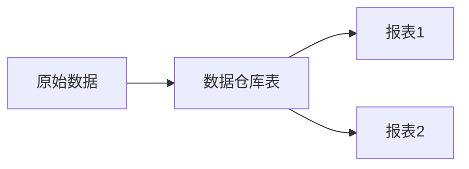

# 【AI大数据计算原理与代码实例讲解】数据治理

作者：禅与计算机程序设计艺术

## 1. 背景介绍
### 1.1 数据治理的重要性
在当今大数据时代,企业和组织面临着海量数据的挑战。如何有效地管理、利用和保护这些数据资产,已成为企业生存和发展的关键。数据治理应运而生,它为企业提供了一套全面的数据管理框架和最佳实践,以确保数据的质量、安全性、可访问性和合规性。

### 1.2 数据治理的目标
数据治理的主要目标包括:
- 提高数据质量,确保数据的准确性、完整性和一致性
- 加强数据安全,保护敏感数据,防止未经授权的访问和泄露
- 优化数据访问,让正确的人在正确的时间访问正确的数据
- 确保合规性,遵守相关的法律法规和行业标准
- 支持业务决策,为管理层提供可靠的数据支持

### 1.3 数据治理的挑战
实施数据治理并非易事,企业面临诸多挑战:
- 数据孤岛:不同部门和系统间数据割裂,缺乏统一管理
- 数据质量差:数据错误、重复、不完整等问题严重
- 缺乏数据标准:没有统一的数据定义和规范
- 安全隐患多:对敏感数据缺乏有效保护措施
- 缺乏数据文化:员工数据意识淡薄,管理层重视不够

## 2. 核心概念与联系
### 2.1 数据治理的定义
数据治理是一套管理数据的过程、政策、标准、角色和责任,旨在提高数据资产的价值,降低数据管理成本和风险。它涉及人员、流程和技术等多个方面。

### 2.2 数据治理与数据管理的区别
数据管理侧重于技术层面,如数据建模、ETL、数据库管理等。而数据治理更侧重管理层面,如制定数据策略、标准,明确角色职责等。二者相辅相成,缺一不可。

### 2.3 数据治理框架的关键要素
一个有效的数据治理框架通常包括以下关键要素:
- 数据策略与标准
- 数据质量管理
- 数据安全与隐私保护
- 数据架构管理
- 元数据管理
- 主数据管理
- 数据生命周期管理
- 数据治理组织与角色

### 2.4 数据治理与大数据、AI的关系
大数据和AI的发展对数据治理提出了更高要求。海量、多样化的大数据需要更加规范化、标准化的管理;AI模型的训练需要高质量的数据。反过来,良好的数据治理也为大数据分析和AI应用奠定了坚实的数据基础。

## 3. 核心算法原理具体操作步骤
### 3.1 数据质量评估算法
数据质量评估是发现和量化数据质量问题的过程。常见的数据质量评估算法包括:
1. 完整性检查:检测缺失值的比例
2. 有效性检查:检测取值是否符合定义域
3. 一致性检查:检测数据间是否存在矛盾
4. 及时性检查:检测数据更新的及时性
5. 唯一性检查:检测重复记录的比例

以完整性检查为例,假设数据集 $D$ 有 $n$ 个记录,第 $i$ 个记录有 $m_i$ 个属性,其中 $k_i$ 个属性的值缺失,则完整性得分为:

$$completeness(D) = 1-\frac{\sum_{i=1}^{n}k_i}{\sum_{i=1}^{n}m_i}$$

### 3.2 数据清洗算法
数据清洗是检测和纠正脏数据的过程,常见算法有:
1. 异常值检测:基于统计方法(如3σ原则)或聚类等识别异常值
2. 不一致纠正:基于业务规则或参考数据修正不一致数据
3. 缺失值填充:根据业务含义填默认值或基于统计/机器学习方法填充
4. 数据标准化:将数据规范化为统一格式,如地址、日期等

以缺失值填充为例,常用方法包括:
- 均值/中位数/众数填充
- 回归填充:基于有值的记录建立回归模型预测缺失值
- KNN填充:用与缺失记录最相似的K个记录的均值填充
- 矩阵补全:将数据集看做不完整矩阵,用低秩矩阵还原

### 3.3 数据安全算法
数据安全算法主要用于数据加密、访问控制、隐私保护等,常见算法有:
1. 加密算法:对称加密(如AES)、非对称加密(如RSA)、哈希(如SHA)等
2. 访问控制:自主访问控制(ACL)、强制访问控制(MAC)、基于角色的访问控制(RBAC)等
3. 数据脱敏:数据掩码、数据置换、差分隐私等
4. 同态加密:在加密状态下直接对数据进行计算
5. 安全多方计算:在不泄露隐私的前提下多方联合计算

以差分隐私为例,其核心思想是在统计查询结果中加入随机噪声,以保护个体隐私不被推断出来。设原始查询结果为 $f(D)$,差分隐私的查询结果为:

$$F(D)=f(D)+Laplace(\frac{\Delta f}{\epsilon})$$

其中 $Laplace()$ 为拉普拉斯分布,参数 $\frac{\Delta f}{\epsilon}$ 控制了噪声强度。$\epsilon$ 为隐私预算,越小隐私保护越强。

## 4. 数学模型和公式详细讲解举例说明
### 4.1 数据质量评估模型
除了前面提到的各种数据质量评估算法外,我们还可以建立数据质量评估的整体模型。一种常见的模型是加权求和模型:

$$DQ(D)=\sum_{i=1}^{n}w_i\cdot q_i$$

其中 $DQ(D)$ 表示数据集 $D$ 的整体质量得分,$q_i$ 为第 $i$ 个质量维度的得分,$w_i$ 为相应权重,满足 $\sum_{i=1}^{n}w_i=1$。这些维度可以是完整性、一致性、唯一性等。

例如,某销售数据集的完整性得分为0.9,一致性得分为0.8,唯一性得分为0.95,假设三个维度权重分别为0.5,0.3,0.2,则其综合质量得分为:

$$DQ(D)=0.5\times 0.9+0.3\times 0.8+0.2\times 0.95=0.88$$

这表明该数据集总体质量较好,但仍有提升空间。

### 4.2 数据血缘模型
数据血缘用于刻画数据集之间的依赖和转换关系,帮助理解数据的来龙去脉。我们可以用有向无环图DAG $G=(V,E)$ 建模数据血缘:
- 节点 $v\in V$ 表示一个数据集
- 边 $e=(u,v)\in E$ 表示数据集 $u$ 经转换生成了数据集 $v$
- 边的属性可以表示转换逻辑、代码等元数据

例如,原始数据经过清洗、转换、集成,生成了数据仓库表,再经由各种SQL加工生成报表。其血缘关系如下:



通过血缘分析,我们可以评估上游数据变化对下游的影响,方便数据溯源、影响分析等。

### 4.3 数据价值评估模型
为了量化数据资产的价值,指导数据治理的优先级,我们可以构建数据价值评估模型。一种思路是综合考虑数据质量、数据使用频率、数据业务影响等因素:

$$Value(D)=\alpha\cdot DQ(D)+\beta\cdot U(D)+\gamma\cdot BI(D)$$

其中 $Value(D)$ 为数据集的价值得分,$DQ(D)$ 为前面提到的质量得分,$U(D)$ 为使用频率得分,$BI(D)$ 为业务影响力得分。$\alpha$、$\beta$、$\gamma$ 为三个因素的权重。

例如,某个数据集的质量得分为0.9,使用频率为每天1000次,业务影响力为核心业务数据。假设质量、使用、影响三个维度权重分别为0.5,0.3,0.2,频率和影响分别划分为高中低三档,分别赋值1、0.6、0.3,则该数据集价值得分为:

$$Value(D)=0.5\times 0.9+0.3\times 1+0.2\times 1=0.95$$

这表明该数据集价值很高,在数据治理中应优先考虑。

## 5. 项目实践：代码实例和详细解释说明
下面我们用Python实现一些数据治理的常见任务。

### 5.1 数据质量评估
以缺失值检测为例,我们可以用Pandas的 `isna()` 和 `mean()` 方法计算缺失率:

```python
import pandas as pd

# 读取数据
df = pd.read_csv('data.csv')

# 计算每列的缺失率
miss_rate = df.isna().mean()

# 打印结果
print(miss_rate)
```

输出示例:
```
user_id    0.00
age        0.15
gender     0.10
order_amt  0.20
```

可见 `age`、`gender`、`order_amt` 三列分别有15%、10%、20%的缺失值,需要进一步处理。

### 5.2 数据清洗
以缺失值填充为例,我们可以用Pandas的 `fillna()` 方法实现各种常见的填充逻辑:

```python
# 填充默认值
df.age.fillna(0, inplace=True)

# 填充均值
mean_age = df.age.mean()
df.age.fillna(mean_age, inplace=True)

# 前向填充
df.fillna(method='ffill', inplace=True)

# 回归填充
from sklearn.linear_model import LinearRegression

# 构建特征X和标签y
X = df[['gender','order_amt']]
y = df.age

# 拟合模型
model = LinearRegression()
model.fit(X, y)

# 预测缺失值
miss_index = df.age.isna()
X_miss = df[miss_index][['gender','order_amt']]
y_miss = model.predict(X_miss)

# 填充预测值
df.age.fillna(pd.Series(y_miss, index=df[miss_index].index), inplace=True)
```

这里展示了默认值填充、均值填充、前向填充、回归填充等常用方法。实践中可以根据业务场景选择适当的方法。

### 5.3 数据安全
以数据脱敏为例,我们可以用Faker库生成模拟数据,避免泄露真实隐私数据:

```python
from faker import Faker

fake = Faker(locale='zh_CN') # 指定生成中文数据

# 生成模拟数据
data = []
for _ in range(100):
    data.append([
        fake.name(),
        fake.phone_number(),
        fake.address(),
        fake.email(),
        fake.ssn()
    ])

# 转为DataFrame
df_fake = pd.DataFrame(data, columns=['name','phone','address','email','ssn'])
```

这里我们生成了100条模拟的中文个人信息数据,可以用于测试和开发,而不触及真实用户隐私。

## 6. 实际应用场景
数据治理在各行各业都有广泛应用,下面列举几个典型场景。

### 6.1 金融行业的客户数据治理
银行、保险等金融机构掌握了海量的客户数据,但往往存在数据分散、不一致等问题。通过数据治理,可以建立客户主数据,统一客户视图,提升数据质量,更好地支持营销、风控等业务。

### 6.2 电商行业的商品数据治理
电商平台的商品数据来源复杂、变化频繁,如何保证商品数据的规范性、一致性是个大挑战。通过数据治理,可以建立统一的商品主数据、数据标准和业务规则,提高数据可用性,为商品推荐、搜索等提供有力保障。

### 6.3 制造业的设备数据治