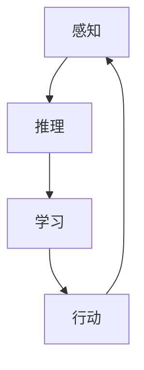
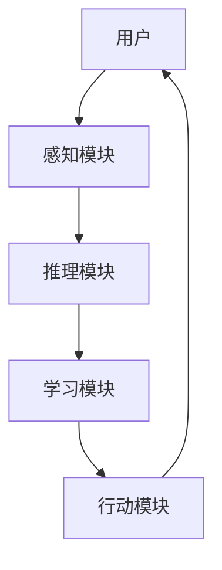

# AI人工智能 Agent：在赋能传统行业中的应用

## 1.背景介绍

在过去的几十年里，人工智能（AI）技术取得了飞速的发展。AI不仅在学术界和科技公司中得到了广泛应用，还逐渐渗透到各个传统行业中。AI Agent，作为AI技术的一个重要分支，正在改变着传统行业的运作方式。AI Agent不仅能够自动化复杂的任务，还能通过学习和适应环境来优化决策过程。

### 1.1 什么是AI Agent

AI Agent是一种能够感知环境并采取行动以实现特定目标的智能系统。它们可以是软件程序，也可以是嵌入式系统。AI Agent通过感知、推理、学习和行动四个主要功能模块来实现其智能行为。

### 1.2 传统行业的现状

传统行业，如制造业、农业、医疗、金融等，通常依赖于大量的人工操作和经验积累。这些行业面临着效率低下、成本高昂、错误率高等问题。AI Agent的引入为这些行业带来了新的希望，通过自动化和智能化来提升效率和降低成本。

### 1.3 AI Agent的优势

AI Agent具有以下几个显著优势：
- **自动化**：能够自动执行复杂任务，减少人工干预。
- **智能化**：通过学习和适应环境来优化决策。
- **高效性**：能够在短时间内处理大量数据，提高工作效率。
- **可靠性**：减少人为错误，提高系统的可靠性。

## 2.核心概念与联系

在深入探讨AI Agent在传统行业中的应用之前，我们需要了解一些核心概念和它们之间的联系。

### 2.1 感知

感知是AI Agent获取环境信息的过程。感知模块通常包括传感器、摄像头、麦克风等设备，用于收集环境数据。

### 2.2 推理

推理是AI Agent根据感知到的信息进行分析和决策的过程。推理模块通常使用各种算法和模型，如决策树、贝叶斯网络等。

### 2.3 学习

学习是AI Agent通过经验和数据来改进其行为的过程。学习模块通常使用机器学习算法，如监督学习、无监督学习和强化学习。

### 2.4 行动

行动是AI Agent根据推理结果采取具体行动的过程。行动模块通常包括执行器、机器人手臂等设备。

### 2.5 各模块之间的联系

以下是AI Agent各模块之间的联系图：



## 3.核心算法原理具体操作步骤

AI Agent的核心算法主要包括感知算法、推理算法、学习算法和行动算法。以下是这些算法的具体操作步骤。

### 3.1 感知算法

感知算法用于从环境中获取数据。常见的感知算法包括图像处理算法、语音识别算法和传感器数据处理算法。

#### 3.1.1 图像处理算法

图像处理算法用于从图像中提取有用的信息。常见的图像处理算法包括边缘检测、特征提取和目标识别。

#### 3.1.2 语音识别算法

语音识别算法用于将语音信号转换为文本。常见的语音识别算法包括隐马尔可夫模型（HMM）和深度神经网络（DNN）。

#### 3.1.3 传感器数据处理算法

传感器数据处理算法用于从传感器数据中提取有用的信息。常见的传感器数据处理算法包括卡尔曼滤波和粒子滤波。

### 3.2 推理算法

推理算法用于根据感知到的信息进行分析和决策。常见的推理算法包括决策树、贝叶斯网络和模糊逻辑。

#### 3.2.1 决策树

决策树是一种树状结构的推理算法，用于根据特征值进行分类和回归。

#### 3.2.2 贝叶斯网络

贝叶斯网络是一种概率图模型，用于表示变量之间的条件依赖关系。

#### 3.2.3 模糊逻辑

模糊逻辑是一种处理不确定性和模糊性的推理算法，常用于控制系统和决策支持系统。

### 3.3 学习算法

学习算法用于通过经验和数据来改进AI Agent的行为。常见的学习算法包括监督学习、无监督学习和强化学习。

#### 3.3.1 监督学习

监督学习是一种基于标注数据进行训练的学习算法，常用于分类和回归任务。

#### 3.3.2 无监督学习

无监督学习是一种基于未标注数据进行训练的学习算法，常用于聚类和降维任务。

#### 3.3.3 强化学习

强化学习是一种基于奖励和惩罚机制进行训练的学习算法，常用于决策和控制任务。

### 3.4 行动算法

行动算法用于根据推理结果采取具体行动。常见的行动算法包括路径规划算法、运动控制算法和任务分配算法。

#### 3.4.1 路径规划算法

路径规划算法用于在复杂环境中找到最优路径。常见的路径规划算法包括A*算法和Dijkstra算法。

#### 3.4.2 运动控制算法

运动控制算法用于控制机器人或设备的运动。常见的运动控制算法包括PID控制和模型预测控制（MPC）。

#### 3.4.3 任务分配算法

任务分配算法用于在多任务环境中分配任务。常见的任务分配算法包括拍卖算法和分布式任务分配算法。

## 4.数学模型和公式详细讲解举例说明

在这一部分，我们将详细讲解一些常用的数学模型和公式，并通过具体例子来说明它们的应用。

### 4.1 线性回归模型

线性回归模型是一种用于回归任务的简单而有效的模型。其数学公式如下：

$$
y = \beta_0 + \beta_1 x_1 + \beta_2 x_2 + \cdots + \beta_n x_n + \epsilon
$$

其中，$y$ 是目标变量，$x_1, x_2, \cdots, x_n$ 是特征变量，$\beta_0, \beta_1, \cdots, \beta_n$ 是回归系数，$\epsilon$ 是误差项。

#### 4.1.1 示例

假设我们有一个数据集，其中包含房屋的面积（$x_1$）和房价（$y$）。我们可以使用线性回归模型来预测房价。通过最小二乘法，我们可以估计回归系数 $\beta_0$ 和 $\beta_1$。

### 4.2 贝叶斯网络

贝叶斯网络是一种用于表示变量之间条件依赖关系的概率图模型。其数学公式如下：

$$
P(X_1, X_2, \cdots, X_n) = \prod_{i=1}^n P(X_i | \text{Parents}(X_i))
$$

其中，$P(X_i | \text{Parents}(X_i))$ 表示在给定父节点的条件下，节点 $X_i$ 的条件概率。

#### 4.2.1 示例

假设我们有一个简单的贝叶斯网络，其中包含三个节点：天气（$X_1$）、交通（$X_2$）和上班迟到（$X_3$）。我们可以使用贝叶斯网络来计算在不同条件下上班迟到的概率。

### 4.3 强化学习

强化学习是一种基于奖励和惩罚机制进行训练的学习算法。其数学公式如下：

$$
Q(s, a) = Q(s, a) + \alpha [r + \gamma \max_{a'} Q(s', a') - Q(s, a)]
$$

其中，$Q(s, a)$ 是状态 $s$ 和动作 $a$ 的价值函数，$\alpha$ 是学习率，$r$ 是即时奖励，$\gamma$ 是折扣因子，$s'$ 是下一个状态，$a'$ 是下一个动作。

#### 4.3.1 示例

假设我们有一个机器人在迷宫中寻找出口。我们可以使用强化学习算法来训练机器人，使其能够找到最优路径。通过不断地更新价值函数 $Q(s, a)$，机器人可以逐渐学会在不同状态下采取最优动作。

## 5.项目实践：代码实例和详细解释说明

在这一部分，我们将通过一个具体的项目实例来展示如何使用AI Agent技术来解决实际问题。我们将以一个智能客服系统为例，展示其实现过程和代码实例。

### 5.1 项目背景

智能客服系统是一种能够自动回答用户问题的系统。传统的客服系统通常需要大量的人工操作，而智能客服系统可以通过AI Agent技术来自动化这一过程。

### 5.2 系统架构

智能客服系统的架构如下：



### 5.3 代码实例

以下是一个简单的智能客服系统的代码实例：

```python
import nltk
from sklearn.feature_extraction.text import TfidfVectorizer
from sklearn.svm import SVC

# 感知模块：获取用户输入
def get_user_input():
    return input("用户：")

# 推理模块：分析用户输入
def analyze_input(user_input):
    vectorizer = TfidfVectorizer()
    X = vectorizer.fit_transform([user_input])
    return X

# 学习模块：训练模型
def train_model(X, y):
    model = SVC()
    model.fit(X, y)
    return model

# 行动模块：生成回复
def generate_response(model, X):
    response = model.predict(X)
    return response

# 主函数
def main():
    user_input = get_user_input()
    X = analyze_input(user_input)
    y = ["你好", "再见", "谢谢"]
    model = train_model(X, y)
    response = generate_response(model, X)
    print("客服：", response)

if __name__ == "__main__":
    main()
```

### 5.4 详细解释

#### 5.4.1 感知模块

感知模块用于获取用户输入。在这个例子中，我们使用 `input` 函数来获取用户输入。

#### 5.4.2 推理模块

推理模块用于分析用户输入。在这个例子中，我们使用 `TfidfVectorizer` 来将用户输入转换为特征向量。

#### 5.4.3 学习模块

学习模块用于训练模型。在这个例子中，我们使用支持向量机（SVM）来训练模型。

#### 5.4.4 行动模块

行动模块用于生成回复。在这个例子中，我们使用训练好的模型来预测回复。

## 6.实际应用场景

AI Agent在传统行业中的应用场景非常广泛。以下是一些典型的应用场景。

### 6.1 制造业

在制造业中，AI Agent可以用于自动化生产线、质量检测和设备维护。通过感知模块获取生产线数据，推理模块分析数据，学习模块优化生产过程，行动模块执行具体操作。

### 6.2 农业

在农业中，AI Agent可以用于智能灌溉、病虫害监测和农作物管理。通过感知模块获取土壤和气象数据，推理模块分析数据，学习模块优化灌溉策略，行动模块执行灌溉操作。

### 6.3 医疗

在医疗中，AI Agent可以用于疾病诊断、药物研发和患者管理。通过感知模块获取患者数据，推理模块分析数据，学习模块优化诊断模型，行动模块生成诊断结果。

### 6.4 金融

在金融中，AI Agent可以用于风险管理、投资决策和客户服务。通过感知模块获取市场数据，推理模块分析数据，学习模块优化投资策略，行动模块执行交易操作。

## 7.工具和资源推荐

在开发和部署AI Agent时，有许多工具和资源可以帮助我们提高效率和效果。以下是一些推荐的工具和资源。

### 7.1 开发工具

- **TensorFlow**：一个开源的机器学习框架，适用于各种AI应用。
- **PyTorch**：一个开源的深度学习框架，具有灵活性和易用性。
- **Scikit-learn**：一个开源的机器学习库，提供了许多常用的机器学习算法。

### 7.2 数据集

- **ImageNet**：一个大型图像数据集，常用于图像分类和目标识别任务。
- **CIFAR-10**：一个小型图像数据集，常用于图像分类任务。
- **MNIST**：一个手写数字数据集，常用于图像分类任务。

### 7.3 学习资源

- **Coursera**：一个在线学习平台，提供了许多AI和机器学习课程。
- **edX**：一个在线学习平台，提供了许多AI和机器学习课程。
- **Kaggle**：一个数据科学竞赛平台，提供了许多数据集和竞赛。

## 8.总结：未来发展趋势与挑战

AI Agent在传统行业中的应用前景广阔，但也面临着一些挑战。

### 8.1 未来发展趋势

- **智能化**：AI Agent将变得更加智能，能够处理更复杂的任务。
- **自动化**：AI Agent将进一步自动化传统行业的工作流程，减少人工干预。
- **个性化**：AI Agent将能够根据用户需求提供个性化服务，提高用户满意度。

### 8.2 挑战

- **数据隐私**：在收集和处理数据时，需要保护用户的隐私。
- **算法公平性**：在设计和训练算法时，需要确保算法的公平性，避免偏见。
- **系统可靠性**：在部署AI Agent时，需要确保系统的可靠性和稳定性。

## 9.附录：常见问题与解答

### 9.1 什么是AI Agent？

AI Agent是一种能够感知环境并采取行动以实现特定目标的智能系统。

### 9.2 AI Agent有哪些应用场景？

AI Agent在制造业、农业、医疗和金融等传统行业中有广泛的应用。

### 9.3 如何开发一个AI Agent？

开发一个AI Agent通常包括感知、推理、学习和行动四个主要步骤。可以使用TensorFlow、PyTorch和Scikit-learn等工具来开发AI Agent。

### 9.4 AI Agent面临哪些挑战？

AI Agent面临数据隐私、算法公平性和系统可靠性等挑战。

---

作者：禅与计算机程序设计艺术 / Zen and the Art of Computer Programming