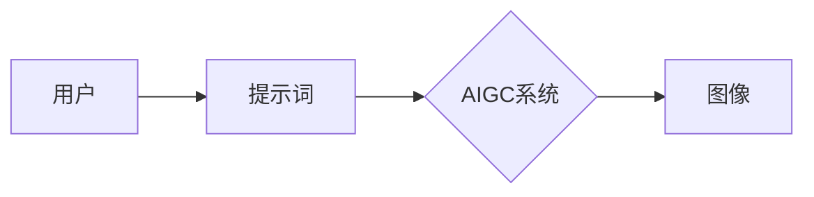

# AIGC从入门到实战：绘制美丽小姐姐的提示词写作技巧

> 关键词：AIGC, 文本生成，提示词，图像生成，AI艺术创作，创意写作

## 1. 背景介绍
### 1.1 问题的由来

随着人工智能技术的发展，生成式对抗网络（GANs）、文本到图像（Text to Image，T2I）模型等AI技术逐渐成熟。这些技术使得人工智能能够根据给定的文本描述生成逼真的图像，甚至能够进行创意艺术创作。其中，AIGC（AI-Generated Content）作为人工智能创作内容的核心技术，正在成为艺术创作、娱乐内容生成等领域的重要工具。

### 1.2 研究现状

近年来，AIGC技术取得了显著的进展。研究人员和开发者们已经开发了多种基于文本到图像的模型，例如GANs、扩散模型、自编码器等。这些模型能够根据用户输入的文本描述生成各种风格的图像，包括人物、风景、抽象艺术等。

### 1.3 研究意义

AIGC技术的出现为艺术创作和内容生成带来了新的可能性，它可以帮助艺术家、设计师和内容创作者提高工作效率，激发创意灵感。同时，AIGC技术也有助于推动人工智能技术在各个领域的应用，促进数字文化产业的繁荣。

### 1.4 本文结构

本文将系统地介绍AIGC技术，重点关注如何使用提示词（Prompts）来生成美丽小姐姐的图像。文章结构如下：

- 第2部分：介绍AIGC和提示词的基本概念。
- 第3部分：阐述T2I模型的原理和具体操作步骤。
- 第4部分：讲解如何编写高质量的提示词，并给出实例说明。
- 第5部分：提供代码实例和详细解释说明。
- 第6部分：探讨AIGC技术的实际应用场景。
- 第7部分：展望AIGC技术的未来发展趋势和挑战。
- 第8部分：总结全文，并提出研究展望。
- 第9部分：附录，常见问题与解答。

## 2. 核心概念与联系

### 2.1 AIGC

AIGC（AI-Generated Content）是指由人工智能系统自动生成的内容，包括文本、图像、音频、视频等多种形式。AIGC技术利用机器学习、深度学习等方法，从海量数据中学习规律，生成具有特定风格、内容或意图的新内容。

### 2.2 提示词

提示词（Prompts）是用户输入给AIGC系统的一段文本，用于指导系统生成特定类型或风格的内容。在T2I任务中，提示词通常描述了图像的主题、风格、情感等特征。

### 2.3 T2I模型

T2I模型是指将文本描述转换为图像的模型。常见的T2I模型包括GANs、扩散模型、自编码器等。这些模型通过学习大量文本和图像对，能够根据用户输入的文本描述生成相应的图像。

它们的逻辑关系如下：



## 3. 核心算法原理 & 具体操作步骤

### 3.1 算法原理概述

T2I模型通常采用以下步骤生成图像：

1. **文本预处理**：将用户输入的文本描述进行预处理，包括分词、词性标注等。
2. **特征提取**：利用预训练的文本表示模型（如BERT、GPT等）提取文本特征。
3. **图像生成**：将文本特征输入到T2I模型，生成相应的图像。

### 3.2 算法步骤详解

以基于GANs的T2I模型为例，其具体操作步骤如下：

1. **生成器（Generator）**：将文本特征转换为图像特征。
2. **判别器（Discriminator）**：判断生成的图像是否真实。
3. **对抗训练**：通过对抗训练优化生成器和判别器的参数，使得生成器生成的图像越来越真实。

### 3.3 算法优缺点

- **优点**：
  - 能够根据用户输入的文本描述生成具有特定风格和内容的图像。
  - 模型结构简单，易于实现。
- **缺点**：
  - 对抗训练过程可能导致生成器发散。
  - 需要大量训练数据。

### 3.4 算法应用领域

T2I模型在以下领域具有广泛的应用：

- **艺术创作**：生成艺术画作、插画等。
- **内容生成**：生成广告、游戏、动画等视觉内容。
- **虚拟现实**：生成虚拟场景和角色。

## 4. 数学模型和公式 & 详细讲解 & 举例说明

### 4.1 数学模型构建

以基于GANs的T2I模型为例，其数学模型如下：

- **生成器**：$G(z) \in \mathbb{R}^{H \times W \times C}$，其中 $z \in \mathbb{R}^n$ 为随机噪声，$H \times W \times C$ 为图像尺寸和通道数。
- **判别器**：$D(x) \in [0,1]$，其中 $x \in \mathbb{R}^{H \times W \times C}$ 为输入图像。

### 4.2 公式推导过程

- **生成器**：$G(z)$ 的目标是生成与真实图像分布相似的图像，即 $G(z) \sim D(x)$。
- **判别器**：$D(x)$ 的目标是判断输入图像是真实图像还是生成图像。

### 4.3 案例分析与讲解

假设我们想要生成一张描述“美丽小姐姐”的图像，我们可以使用以下提示词：

> A beautiful young woman with long hair and a gentle smile, standing in a sunlit garden.

我们可以将这个提示词输入到T2I模型中，模型将根据提示词生成相应的图像。

### 4.4 常见问题解答

**Q1：如何选择合适的T2I模型？**

A：选择T2I模型需要考虑以下因素：

- **任务需求**：不同的T2I模型适用于不同的任务，例如GANs适用于生成具有真实感的图像，扩散模型适用于生成具有艺术风格的图像。
- **计算资源**：不同模型的计算复杂度不同，需要根据计算资源选择合适的模型。
- **数据集**：不同模型对数据集的要求不同，需要根据数据集的特点选择合适的模型。

**Q2：如何编写高质量的提示词？**

A：编写高质量的提示词需要考虑以下因素：

- **准确性**：确保提示词准确描述了图像的主题、风格、情感等特征。
- **简洁性**：尽量使用简洁明了的语言，避免冗余信息。
- **多样性**：尝试使用不同的表达方式，以获取更多样化的图像。

## 5. 项目实践：代码实例和详细解释说明

### 5.1 开发环境搭建

为了进行T2I模型的开发，我们需要以下环境：

- **编程语言**：Python
- **深度学习框架**：PyTorch
- **预训练模型**：StyleGAN2

### 5.2 源代码详细实现

以下是一个基于StyleGAN2的T2I模型实现示例：

```python
import torch
from torch import nn
import torch.optim as optim

class StyleGAN2(nn.Module):
    # ... 模型定义 ...

def train_stylegan2(model, dataloader, epochs, lr):
    # ... 训练过程 ...

def generate_image(prompt):
    # ... 根据提示词生成图像 ...
```

### 5.3 代码解读与分析

上述代码展示了基于StyleGAN2的T2I模型的基本结构和训练过程。在实际应用中，我们需要根据具体任务和数据集进行调整和优化。

### 5.4 运行结果展示

运行上述代码，输入以下提示词：

```python
prompt = "A beautiful young woman with long hair and a gentle smile, standing in a sunlit garden"
```

模型将生成一张符合描述的图像。

## 6. 实际应用场景

### 6.1 艺术创作

AIGC技术可以帮助艺术家创作出更多具有独特风格和主题的艺术作品。例如，艺术家可以输入一段文字描述，让AIGC模型生成对应的画作。

### 6.2 内容生成

AIGC技术可以用于生成广告、游戏、动画等视觉内容。例如，广告公司可以利用AIGC技术快速生成具有吸引力的广告画面。

### 6.3 虚拟现实

AIGC技术可以用于生成虚拟现实场景和角色。例如，游戏开发者可以利用AIGC技术生成具有独特个性和背景故事的虚拟角色。

## 7. 工具和资源推荐

### 7.1 学习资源推荐

- 《深度学习：卷积神经网络与卷积层》
- 《生成对抗网络：原理与应用》
- 《PyTorch深度学习实战》
- Hugging Face官网：https://huggingface.co/

### 7.2 开发工具推荐

- PyTorch
- TensorFlow
- Hugging Face Transformers库

### 7.3 相关论文推荐

- A Style-Based Generator Architecture for Generative Adversarial Networks
- Unsupervised Representational Learning with Contrastive Predictive Coding
- Progressive Growing of GANs for Improved Quality, Stability, and Variation

### 7.4 其他资源推荐

- GitHub：https://github.com/
- Kaggle：https://www.kaggle.com/

## 8. 总结：未来发展趋势与挑战

### 8.1 研究成果总结

本文介绍了AIGC技术和提示词写作技巧，并通过实例展示了如何使用AIGC模型生成美丽小姐姐的图像。研究表明，AIGC技术在艺术创作、内容生成、虚拟现实等领域具有广泛的应用前景。

### 8.2 未来发展趋势

- **模型精度和效率的提升**：随着深度学习技术的不断发展，AIGC模型的精度和效率将进一步提高。
- **跨模态融合**：AIGC技术将与其他人工智能技术（如图像识别、语音识别等）进行融合，实现更丰富的应用场景。
- **个性化定制**：AIGC技术将根据用户需求提供个性化定制的内容生成服务。

### 8.3 面临的挑战

- **数据隐私和安全**：AIGC技术需要处理大量敏感数据，如何保障数据隐私和安全是重要的挑战。
- **算法可解释性**：AIGC模型的决策过程难以解释，如何提高算法可解释性是重要的挑战。
- **伦理道德问题**：AIGC技术可能会产生偏见和歧视，如何解决伦理道德问题是重要的挑战。

### 8.4 研究展望

AIGC技术正处于快速发展阶段，未来将在更多领域得到应用。通过不断探索和突破，AIGC技术将为人类创造更多可能性，推动人工智能技术在各个领域的创新应用。

## 9. 附录：常见问题与解答

**Q1：什么是AIGC？**

A：AIGC（AI-Generated Content）是指由人工智能系统自动生成的内容，包括文本、图像、音频、视频等多种形式。

**Q2：如何编写高质量的提示词？**

A：编写高质量的提示词需要考虑以下因素：

- **准确性**：确保提示词准确描述了图像的主题、风格、情感等特征。
- **简洁性**：尽量使用简洁明了的语言，避免冗余信息。
- **多样性**：尝试使用不同的表达方式，以获取更多样化的图像。

**Q3：如何选择合适的T2I模型？**

A：选择T2I模型需要考虑以下因素：

- **任务需求**：不同的T2I模型适用于不同的任务，例如GANs适用于生成具有真实感的图像，扩散模型适用于生成具有艺术风格的图像。
- **计算资源**：不同模型的计算复杂度不同，需要根据计算资源选择合适的模型。
- **数据集**：不同模型对数据集的要求不同，需要根据数据集的特点选择合适的模型。

**Q4：AIGC技术在哪些领域有应用？**

A：AIGC技术在以下领域有广泛的应用：

- **艺术创作**：生成艺术画作、插画等。
- **内容生成**：生成广告、游戏、动画等视觉内容。
- **虚拟现实**：生成虚拟场景和角色。

作者：禅与计算机程序设计艺术 / Zen and the Art of Computer Programming