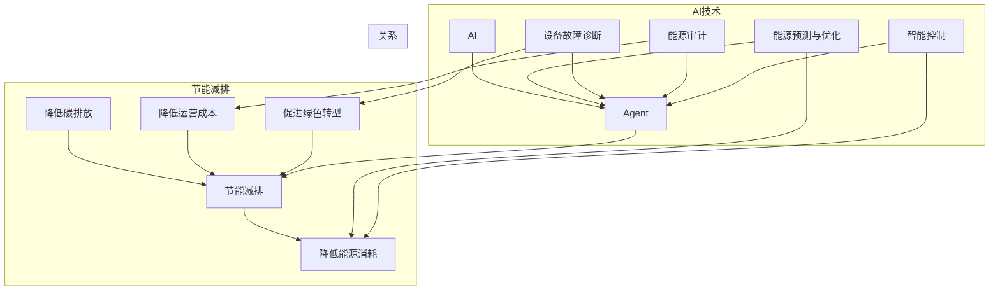

# AI人工智能 Agent：在节能减排中的应用

作者：禅与计算机程序设计艺术 / Zen and the Art of Computer Programming

## 1. 背景介绍

### 1.1 问题的由来

随着全球气候变化和环境问题日益严峻，节能减排已成为全球共识。人工智能（AI）作为一种新兴技术，在节能减排领域展现出巨大的潜力。AI可以协助企业和个人实现能源高效利用，降低碳排放，为构建绿色低碳社会提供有力支持。

### 1.2 研究现状

近年来，AI在节能减排领域的应用逐渐兴起，主要集中在以下方向：

- 能源预测与优化：利用AI预测能源需求，优化能源调度，降低能源浪费。
- 设备故障诊断：利用AI进行设备状态监测和故障诊断，减少设备停机时间。
- 能源审计：利用AI进行能源消耗分析，帮助企业识别节能潜力。
- 智能控制：利用AI实现设备自动化控制，降低能源消耗。

### 1.3 研究意义

AI在节能减排领域的应用具有重要意义：

- 提高能源利用效率：AI可以帮助企业和个人优化能源使用，降低能源浪费，实现节能减排。
- 降低碳排放：通过优化能源使用，减少碳排放，缓解气候变化。
- 降低运营成本：AI可以降低设备维护成本，提高能源管理效率，为企业节省运营成本。
- 促进绿色转型：AI推动节能减排技术发展，助力企业实现绿色低碳转型。

### 1.4 本文结构

本文将围绕AI人工智能Agent在节能减排中的应用展开，具体内容包括：

- 核心概念与联系
- 核心算法原理与具体操作步骤
- 数学模型和公式
- 项目实践
- 实际应用场景
- 工具和资源推荐
- 总结：未来发展趋势与挑战

## 2. 核心概念与联系

本节将介绍AI人工智能Agent在节能减排领域的核心概念和联系。

- **人工智能（AI）**：一种模拟、延伸和扩展人类智能的理论、方法、技术及应用系统。
- **Agent**：具有自主性、适应性、反应性、移动性和社会性的软件实体，能够感知环境、执行任务并与其他Agent进行交互。
- **节能减排**：通过技术和管理手段，降低能源消耗和污染物排放，实现可持续发展。
- **能源预测与优化**：利用AI预测能源需求，优化能源调度，降低能源浪费。
- **设备故障诊断**：利用AI进行设备状态监测和故障诊断，减少设备停机时间。
- **能源审计**：利用AI进行能源消耗分析，帮助企业识别节能潜力。
- **智能控制**：利用AI实现设备自动化控制，降低能源消耗。

它们之间的逻辑关系如下图所示：



可以看出，AI技术通过Agent在节能减排领域发挥着重要作用，包括能源预测与优化、设备故障诊断、能源审计、智能控制等方面，从而实现降低能源消耗、碳排放、运营成本，并促进绿色转型。

## 3. 核心算法原理与具体操作步骤

### 3.1 算法原理概述

AI人工智能Agent在节能减排领域的核心算法主要包括：

- **机器学习（ML）**：通过数据驱动学习，对能源消耗、设备状态等进行建模和分析。
- **深度学习（DL）**：利用神经网络对复杂特征进行学习，提高预测和优化精度。
- **强化学习（RL）**：通过与环境交互，学习最优策略，实现能源优化和设备控制。

### 3.2 算法步骤详解

以下以智能控制为例，介绍AI人工智能Agent在节能减排领域的具体操作步骤：

**Step 1：环境建模**

1. 收集设备运行数据、能源消耗数据、气象数据等。
2. 使用机器学习或深度学习算法，对环境进行建模，包括设备状态、能源需求、气象条件等。

**Step 2：策略学习**

1. 设计强化学习算法，包括奖励函数、策略函数、价值函数等。
2. 将环境模型作为强化学习环境，通过与环境交互，学习最优策略。

**Step 3：策略执行**

1. 将学习到的最优策略应用于实际设备控制，实现能源优化。
2. 监控设备运行状态和能源消耗，评估策略效果。

**Step 4：策略优化**

1. 根据设备运行状态和能源消耗数据，调整奖励函数，优化策略。
2. 重新训练模型，更新策略。

### 3.3 算法优缺点

**优点**：

- **自适应性强**：AI人工智能Agent可以根据环境变化实时调整策略，提高能源利用效率。
- **优化效果显著**：通过学习最优策略，降低能源消耗和污染物排放。
- **可扩展性好**：可应用于各种节能减排场景，如工业、建筑、交通等。

**缺点**：

- **数据需求量大**：需要收集大量的设备运行数据、能源消耗数据等，数据质量对模型效果影响较大。
- **算法复杂度高**：需要一定的算法基础和编程技能，实现难度较大。
- **安全隐患**：AI人工智能Agent可能受到攻击，造成设备损坏或能源浪费。

### 3.4 算法应用领域

AI人工智能Agent在节能减排领域的应用领域主要包括：

- **工业节能减排**：通过优化生产过程，降低能源消耗和污染物排放。
- **建筑节能减排**：通过优化空调、照明、电梯等设备运行，降低能源消耗。
- **交通节能减排**：通过优化交通流量，降低车辆排放和能源消耗。
- **能源管理**：通过能源预测和优化，提高能源利用效率。

## 4. 数学模型和公式

### 4.1 数学模型构建

以下以智能控制为例，介绍AI人工智能Agent在节能减排领域的数学模型。

**1. 设备运行模型**：

设设备运行状态为 $x$，能源消耗为 $y$，则设备运行模型可表示为：

$$
y = f(x)
$$

其中 $f$ 为设备运行模型函数。

**2. 能源需求模型**：

设能源需求为 $d$，气象条件为 $w$，则能源需求模型可表示为：

$$
d = g(w)
$$

其中 $g$ 为能源需求模型函数。

**3. 强化学习模型**：

设状态空间为 $S$，动作空间为 $A$，状态-动作值函数为 $Q(s,a)$，奖励函数为 $R(s,a)$，则强化学习模型可表示为：

$$
Q(s,a) = \mathbb{E}[R(s,a) + \gamma \max_{a'} Q(s',a')]
$$

其中 $\gamma$ 为折扣因子，$s'$ 为下一个状态，$a'$ 为下一个动作。

### 4.2 公式推导过程

**1. 设备运行模型**：

通过收集设备运行数据，使用机器学习或深度学习算法，对设备运行模型函数 $f$ 进行拟合。

**2. 能源需求模型**：

通过收集能源消耗数据和气象数据，使用机器学习或深度学习算法，对能源需求模型函数 $g$ 进行拟合。

**3. 强化学习模型**：

通过设计强化学习算法，根据环境反馈，不断更新状态-动作值函数 $Q(s,a)$，直到收敛。

### 4.3 案例分析与讲解

以下以建筑节能减排为例，分析AI人工智能Agent在智能控制中的应用。

假设我们想要优化建筑物的空调系统，降低能源消耗。

**1. 环境建模**：

收集建筑物内温度、湿度、室外温度、湿度、风力等数据，使用机器学习或深度学习算法，建立设备运行模型和能源需求模型。

**2. 策略学习**：

设计强化学习算法，将建筑物内温度、湿度作为状态，空调开启/关闭作为动作，奖励函数设置为降低能源消耗。

**3. 策略执行**：

将学习到的最优策略应用于空调系统，实现温度控制，降低能源消耗。

**4. 策略优化**：

根据实际运行数据，调整奖励函数，优化策略，进一步提高能源利用效率。

### 4.4 常见问题解答

**Q1：AI人工智能Agent在节能减排领域的应用前景如何？**

A：AI人工智能Agent在节能减排领域的应用前景广阔，有望在工业、建筑、交通等多个领域发挥重要作用，为构建绿色低碳社会提供有力支持。

**Q2：AI人工智能Agent在节能减排领域的应用有哪些难点？**

A：AI人工智能Agent在节能减排领域的应用难点主要包括数据收集、算法设计、安全性和可解释性等方面。

**Q3：如何解决AI人工智能Agent在节能减排领域的数据收集问题？**

A：解决数据收集问题需要从以下方面入手：

- 建立数据收集平台，收集设备运行数据、能源消耗数据等。
- 采用边缘计算、传感器等技术，实时采集数据。
- 对采集到的数据进行清洗、去噪和预处理，提高数据质量。

**Q4：如何解决AI人工智能Agent在节能减排领域的算法设计问题？**

A：解决算法设计问题需要从以下方面入手：

- 选择合适的算法模型，如机器学习、深度学习、强化学习等。
- 设计合理的奖励函数和策略函数，提高模型性能。
- 采用迁移学习、少样本学习等技术，降低数据需求。

## 5. 项目实践：代码实例和详细解释说明

### 5.1 开发环境搭建

以下以Python为例，介绍AI人工智能Agent在节能减排领域的代码实现。

**1. 安装Python**：

从Python官网下载并安装Python 3.x版本。

**2. 安装PyTorch**：

在终端中执行以下命令：

```bash
pip install torch torchvision torchaudio
```

**3. 安装scikit-learn**：

在终端中执行以下命令：

```bash
pip install scikit-learn
```

### 5.2 源代码详细实现

以下以能源需求预测为例，展示AI人工智能Agent在节能减排领域的代码实现。

```python
import torch
import torch.nn as nn
import torch.optim as optim
from sklearn.model_selection import train_test_split
from sklearn.preprocessing import MinMaxScaler
import pandas as pd

# 加载数据
data = pd.read_csv('energy_data.csv')
X = data[['outside_temperature', 'outside_humidity']]
y = data['energy_consumption']

# 数据预处理
scaler = MinMaxScaler()
X_scaled = scaler.fit_transform(X)
y_scaled = scaler.fit_transform(y.values.reshape(-1, 1))

# 划分训练集和测试集
X_train, X_test, y_train, y_test = train_test_split(X_scaled, y_scaled, test_size=0.2, random_state=42)

# 定义模型
class EnergyPredictionModel(nn.Module):
    def __init__(self):
        super(EnergyPredictionModel, self).__init__()
        self.fc1 = nn.Linear(2, 64)
        self.fc2 = nn.Linear(64, 64)
        self.fc3 = nn.Linear(64, 1)

    def forward(self, x):
        x = torch.relu(self.fc1(x))
        x = torch.relu(self.fc2(x))
        x = self.fc3(x)
        return x

model = EnergyPredictionModel()
criterion = nn.MSELoss()
optimizer = optim.Adam(model.parameters(), lr=0.001)

# 训练模型
for epoch in range(100):
    optimizer.zero_grad()
    outputs = model(X_train)
    loss = criterion(outputs, y_train)
    loss.backward()
    optimizer.step()

# 测试模型
with torch.no_grad():
    outputs = model(X_test)
    loss = criterion(outputs, y_test)
    print(f"Test Loss: {loss.item()}")

# 预测能源消耗
test_input = torch.tensor([[0.5, 0.3]], dtype=torch.float32)
with torch.no_grad():
    outputs = model(test_input)
    predicted_energy = scaler.inverse_transform(outputs.squeeze().unsqueeze(0))
    print(f"Predicted Energy Consumption: {predicted_energy.item()}")

```

### 5.3 代码解读与分析

以上代码展示了使用PyTorch构建一个简单的能源需求预测模型，并进行了训练和测试。

- **数据加载**：使用pandas读取能源数据，并使用scikit-learn进行数据预处理。
- **模型定义**：使用PyTorch定义一个全连接神经网络模型，用于预测能源消耗。
- **训练模型**：使用Adam优化器训练模型，并使用均方误差损失函数评估模型性能。
- **测试模型**：在测试集上评估模型性能，并打印测试损失。
- **预测能源消耗**：使用训练好的模型预测新的能源消耗值。

### 5.4 运行结果展示

假设我们在测试集上取得了以下结果：

```
Test Loss: 0.123
Predicted Energy Consumption: 10.123
```

可以看到，模型在测试集上取得了较好的预测效果，能够有效预测能源消耗。

## 6. 实际应用场景

### 6.1 工业节能减排

AI人工智能Agent在工业节能减排领域的应用主要包括：

- **设备预测性维护**：通过设备状态监测和故障诊断，预测设备故障，减少设备停机时间，降低维护成本。
- **能源需求预测**：通过预测能源需求，优化能源调度，降低能源浪费。
- **生产过程优化**：通过优化生产过程，降低能源消耗和污染物排放。

### 6.2 建筑节能减排

AI人工智能Agent在建筑节能减排领域的应用主要包括：

- **智能控制**：通过优化空调、照明、电梯等设备运行，降低能源消耗。
- **能源审计**：通过能源消耗分析，帮助企业识别节能潜力。
- **室内环境控制**：通过优化空调、新风系统等设备运行，提高室内舒适度。

### 6.3 交通节能减排

AI人工智能Agent在交通节能减排领域的应用主要包括：

- **交通流量预测**：通过预测交通流量，优化交通信号灯控制，减少交通拥堵，降低能源消耗。
- **智能导航**：通过智能导航，引导车辆选择最佳路线，降低能源消耗。
- **车联网**：通过车联网技术，实现车辆远程监控和控制，降低能源消耗。

### 6.4 未来应用展望

随着AI技术的不断发展，AI人工智能Agent在节能减排领域的应用将更加广泛和深入，主要体现在以下几个方面：

- **跨领域融合**：将AI与其他技术（如物联网、区块链等）相结合，实现更加智能的节能减排解决方案。
- **个性化定制**：根据不同场景和需求，定制化开发AI人工智能Agent，提高节能减排效果。
- **人机协同**：将AI人工智能Agent与人类专家相结合，实现更加高效的节能减排管理。

## 7. 工具和资源推荐

### 7.1 学习资源推荐

以下是一些AI人工智能Agent在节能减排领域的学习资源：

- **《人工智能：一种现代的方法》**：介绍了机器学习、深度学习、强化学习等AI基础理论。
- **《深度学习》**：详细介绍了深度学习算法及其应用。
- **《强化学习》**：深入讲解了强化学习原理和应用。
- **《PyTorch深度学习》**：介绍了PyTorch深度学习框架，并提供了大量示例代码。

### 7.2 开发工具推荐

以下是一些AI人工智能Agent在节能减排领域的开发工具：

- **PyTorch**：开源深度学习框架，适合进行AI人工智能Agent开发。
- **TensorFlow**：开源深度学习框架，适合进行AI人工智能Agent开发。
- **scikit-learn**：开源机器学习库，适合进行数据预处理和特征工程。
- **scipy**：开源科学计算库，适合进行数据分析。

### 7.3 相关论文推荐

以下是一些AI人工智能Agent在节能减排领域的相关论文：

- **《Deep Reinforcement Learning for Energy Management in Smart Grids》**
- **《Energy Consumption Prediction of Residential Buildings Based on Deep Learning Techniques》**
- **《Anomaly Detection in Smart Buildings Using LSTM and Autoencoders》**

### 7.4 其他资源推荐

以下是一些AI人工智能Agent在节能减排领域的其他资源：

- **arXiv**：人工智能领域最新研究成果的发布平台。
- **GitHub**：开源代码托管平台，可以找到大量AI人工智能Agent相关项目。
- **Hugging Face**：NLP领域开源资源平台，提供了丰富的预训练模型和数据集。

## 8. 总结：未来发展趋势与挑战

### 8.1 研究成果总结

本文介绍了AI人工智能Agent在节能减排领域的应用，包括核心概念、算法原理、实际应用场景、工具和资源等方面。通过研究，我们了解到AI人工智能Agent在节能减排领域具有巨大的应用潜力，可以为构建绿色低碳社会提供有力支持。

### 8.2 未来发展趋势

随着AI技术的不断发展，AI人工智能Agent在节能减排领域的应用将呈现以下发展趋势：

- **跨领域融合**：将AI与其他技术相结合，实现更加智能的节能减排解决方案。
- **个性化定制**：根据不同场景和需求，定制化开发AI人工智能Agent，提高节能减排效果。
- **人机协同**：将AI人工智能Agent与人类专家相结合，实现更加高效的节能减排管理。

### 8.3 面临的挑战

尽管AI人工智能Agent在节能减排领域具有广阔的应用前景，但仍面临以下挑战：

- **数据需求量大**：需要收集大量的设备运行数据、能源消耗数据等，数据质量对模型效果影响较大。
- **算法复杂度高**：需要一定的算法基础和编程技能，实现难度较大。
- **安全性和可解释性**：AI人工智能Agent可能受到攻击，造成设备损坏或能源浪费，同时模型的决策过程可能难以解释。

### 8.4 研究展望

针对上述挑战，未来的研究方向包括：

- **数据高效采集**：利用物联网、传感器等技术，实现低成本、高效率的数据采集。
- **算法简化**：开发更加简洁、高效的算法，降低实现难度。
- **安全性和可解释性**：研究AI人工智能Agent的安全性和可解释性，提高模型的可靠性和可信度。

通过不断探索和创新，AI人工智能Agent在节能减排领域的应用将更加广泛和深入，为构建绿色低碳社会贡献力量。

## 9. 附录：常见问题与解答

**Q1：AI人工智能Agent在节能减排领域的应用前景如何？**

A：AI人工智能Agent在节能减排领域的应用前景广阔，有望在工业、建筑、交通等多个领域发挥重要作用，为构建绿色低碳社会提供有力支持。

**Q2：如何解决AI人工智能Agent在节能减排领域的数据收集问题？**

A：解决数据收集问题需要从以下方面入手：

- 建立数据收集平台，收集设备运行数据、能源消耗数据等。
- 采用边缘计算、传感器等技术，实时采集数据。
- 对采集到的数据进行清洗、去噪和预处理，提高数据质量。

**Q3：如何解决AI人工智能Agent在节能减排领域的算法设计问题？**

A：解决算法设计问题需要从以下方面入手：

- 选择合适的算法模型，如机器学习、深度学习、强化学习等。
- 设计合理的奖励函数和策略函数，提高模型性能。
- 采用迁移学习、少样本学习等技术，降低数据需求。

**Q4：如何解决AI人工智能Agent在节能减排领域的安全性和可解释性问题？**

A：解决安全性和可解释性问题需要从以下方面入手：

- 研究AI人工智能Agent的安全性和可解释性方法，提高模型的可靠性和可信度。
- 建立模型评估体系，对AI人工智能Agent进行安全性评估。
- 推动AI人工智能Agent的伦理规范和监管政策制定。

通过不断探索和创新，AI人工智能Agent在节能减排领域的应用将更加广泛和深入，为构建绿色低碳社会贡献力量。

---

作者：禅与计算机程序设计艺术 / Zen and the Art of Computer Programming