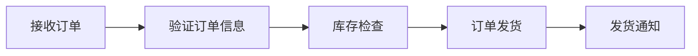

# AI人工智能代理工作流AI Agent WorkFlow：自适应工作流的AI代理调度策略

> 关键词：人工智能代理，工作流，自适应调度，机器学习，强化学习，流程优化，智能决策

## 1. 背景介绍
### 1.1 问题的由来

随着信息技术的飞速发展，企业数字化转型已成为必然趋势。在这个过程中，工作流（WorkFlow）作为业务流程的数字化表示，成为了连接企业内部各个业务系统的桥梁。然而，传统的手动工作流管理方式存在着效率低、成本高、难以适应动态变化等问题。为了解决这些问题，人工智能（AI）技术被引入到工作流管理领域，其中AI代理（AI Agent）工作流（AI Agent WorkFlow）成为了一种新兴的解决方案。

AI代理工作流是一种利用人工智能技术自动执行和管理业务流程的范式。它通过模拟人类专家的行为，将复杂的业务流程分解为一系列由AI代理执行的任务，并根据业务需求和环境变化动态调整工作流执行策略，从而实现高效、灵活和自适应的工作流管理。

### 1.2 研究现状

近年来，AI代理工作流研究取得了显著的进展。主要研究方向包括：

- **AI代理建模**：研究如何将人类专家的决策过程转化为AI代理的决策模型，包括知识表示、推理算法和决策策略等。
- **工作流调度**：研究如何根据任务特征、资源状态和业务需求，为AI代理分配任务，并优化调度策略。
- **自适应和自学习**：研究如何使AI代理工作流能够根据业务流程执行过程中的数据反馈，动态调整决策策略和工作流执行路径。

### 1.3 研究意义

AI代理工作流的研究具有重要的理论意义和应用价值：

- **提高工作效率**：AI代理工作流可以自动化处理大量重复性工作，提高工作效率，降低人力成本。
- **提升决策质量**：通过模拟人类专家的决策过程，AI代理工作流可以提升决策质量和可靠性。
- **适应动态变化**：AI代理工作流可以根据业务需求和环境变化，动态调整工作流执行策略，提高系统的灵活性和适应性。
- **促进技术创新**：AI代理工作流的研究将推动人工智能技术在业务流程管理领域的应用，促进相关技术的发展。

### 1.4 本文结构

本文将围绕AI人工智能代理工作流（AI Agent WorkFlow）展开，主要内容包括：

- 第2部分，介绍AI代理工作流的核心概念和联系。
- 第3部分，阐述AI代理工作流的核心算法原理和具体操作步骤。
- 第4部分，讲解AI代理工作流的数学模型和公式，并结合实例进行分析。
- 第5部分，展示AI代理工作流的代码实例，并对关键代码进行解读和分析。
- 第6部分，探讨AI代理工作流在实际应用场景中的案例，并展望未来应用前景。
- 第7部分，推荐AI代理工作流相关的学习资源、开发工具和参考文献。
- 第8部分，总结AI代理工作流的研究成果，展望未来发展趋势和挑战。
- 第9部分，提供AI代理工作流的常见问题与解答。

## 2. 核心概念与联系

为了更好地理解AI代理工作流，本节将介绍几个核心概念及其相互之间的联系：

- **人工智能代理（AI Agent）**：指能够感知环境、自主决策并采取行动以实现目标的实体。AI代理可以是软件程序、机器人或智能设备等。
- **工作流（WorkFlow）**：指一组有序执行的步骤，用于完成特定任务。工作流可以表示为一系列任务、资源和规则，通过流程引擎进行管理。
- **任务（Task）**：指工作流中的基本操作单元，通常由AI代理执行。
- **资源（Resource）**：指支持工作流执行的各种实体，如计算资源、存储资源等。
- **决策（Decision）**：指AI代理在执行任务过程中根据环境信息和预设规则做出的选择。
- **学习（Learning）**：指AI代理在工作流执行过程中不断积累经验，优化决策策略的能力。

它们之间的逻辑关系如下：

```mermaid
graph LR
    A[人工智能代理(AI Agent)] --> B{感知环境}
    B --> C[决策(Decision)]
    C --> D[执行任务(Task)]
    D --> E{任务完成?}
    E -- 是 --> B
    E -- 否 --> F[资源(Resource)]
    F --> B
```

可以看出，AI代理工作流的核心是AI代理，它通过感知环境、做出决策和执行任务来完成工作流。同时，AI代理在工作流执行过程中不断学习，优化自身的决策策略。

## 3. 核心算法原理 & 具体操作步骤
### 3.1 算法原理概述

AI代理工作流的核心算法包括AI代理建模、工作流调度和自适应学习等。

- **AI代理建模**：通过知识表示、推理算法和决策策略等方法，将人类专家的决策过程转化为AI代理的决策模型。
- **工作流调度**：根据任务特征、资源状态和业务需求，为AI代理分配任务，并优化调度策略。
- **自适应学习**：根据工作流执行过程中的数据反馈，动态调整决策策略和工作流执行路径。

### 3.2 算法步骤详解

以下是AI代理工作流的具体操作步骤：

**Step 1：定义工作流**

- 分析业务流程，将流程分解为一系列任务。
- 规范任务输入输出，定义任务执行规则。
- 设计工作流执行流程，包括任务执行顺序、资源分配、异常处理等。

**Step 2：构建AI代理**

- 选择合适的AI代理建模方法，如基于规则、基于机器学习或基于强化学习等。
- 收集专家知识，建立AI代理的知识库。
- 设计AI代理的决策策略，如基于规则的决策、基于机器学习的决策或基于强化学习的决策等。

**Step 3：工作流执行**

- 根据工作流定义和AI代理决策结果，为AI代理分配任务。
- 监控AI代理的执行过程，收集执行数据。
- 根据任务执行情况，动态调整AI代理的决策策略和工作流执行路径。

**Step 4：自适应学习**

- 分析AI代理的决策结果和执行数据，评估决策效果。
- 根据评估结果，调整AI代理的知识库和决策策略。
- 更新工作流执行路径，优化工作流性能。

### 3.3 算法优缺点

AI代理工作流算法的优点：

- **提高工作效率**：自动化处理大量重复性工作，提高工作效率。
- **提升决策质量**：模拟人类专家的决策过程，提升决策质量和可靠性。
- **适应动态变化**：根据业务需求和环境变化，动态调整工作流执行策略。

AI代理工作流算法的缺点：

- **知识获取成本高**：需要收集大量的专家知识，建立AI代理的知识库。
- **模型复杂度高**：基于机器学习或强化学习的AI代理建模方法，需要大量的训练数据和计算资源。
- **适应性强但可解释性弱**：自适应学习机制使得AI代理工作流能够适应动态变化，但决策过程的可解释性较差。

### 3.4 算法应用领域

AI代理工作流算法可以应用于以下领域：

- **金融服务**：自动化处理金融交易、风险评估、客户服务等业务流程。
- **智能制造**：优化生产调度、质量控制、设备维护等业务流程。
- **物流运输**：优化运输路线、货物配送、仓储管理等业务流程。
- **医疗保健**：自动化处理病历审查、患者管理、药物配送等业务流程。

## 4. 数学模型和公式 & 详细讲解 & 举例说明
### 4.1 数学模型构建

AI代理工作流的数学模型主要包括以下部分：

- **知识表示模型**：用于描述AI代理的知识库，如规则库、案例库等。
- **决策模型**：用于描述AI代理的决策过程，如决策树、神经网络等。
- **调度模型**：用于描述工作流的执行过程，如Petri网、Petri网模型等。

### 4.2 公式推导过程

以下以Petri网模型为例，介绍工作流执行过程的数学模型。

Petri网是一种图形化的数学模型，用于描述并发系统。它由四个元素组成：

- **库所（Place）**：表示工作流中的状态。
- **变迁（Transition）**：表示工作流中的操作。
- **弧（Arc）**：表示库所和变迁之间的连接关系。
- ** token**：表示库所中的资源。

Petri网模型可以用以下公式表示：

$$
\begin{cases}
P_i \rightarrow T_i \rightarrow P_j & \text{表示变迁 $T_i$ 从库所 $P_i$ 转换为库所 $P_j$} \
\text{库所 $P_i$ 中的 token 数量} & \text{表示该库所中可用的资源数量} \
\text{变迁 $T_i$ 的执行条件} & \text{表示该变迁何时能够执行}
\end{cases}
$$

### 4.3 案例分析与讲解

以下以一个简单的订单处理工作流为例，说明Petri网模型的应用。

假设订单处理工作流包括以下步骤：

1. 接收订单。
2. 验证订单信息。
3. 检查库存。
4. 订单发货。
5. 发送发货通知。

该工作流的Petri网模型如下：



在这个Petri网模型中，P表示接收订单库所，T1表示验证订单信息变迁，P1表示库存检查库所，T2表示订单发货变迁，P2表示发货通知库所。

### 4.4 常见问题解答

**Q1：Petri网模型适用于哪些场景？**

A: Petri网模型适用于描述具有并发性、竞争性和同步性的系统，如生产调度、通信协议、软件设计等。

**Q2：如何将Petri网模型应用于AI代理工作流？**

A: 可以将Petri网模型作为AI代理工作流的调度模型，描述工作流执行过程中的状态转换和操作执行。

## 5. 项目实践：代码实例和详细解释说明
### 5.1 开发环境搭建

以下是使用Python进行AI代理工作流开发的开发环境搭建流程：

1. 安装Anaconda：从官网下载并安装Anaconda，用于创建独立的Python环境。

2. 创建并激活虚拟环境：
```bash
conda create -n ai-agent-env python=3.8
conda activate ai-agent-env
```

3. 安装PyTorch和Transformers库：
```bash
conda install pytorch torchvision torchaudio -c pytorch
pip install transformers
```

4. 安装其他必要的库：
```bash
pip install pandas scikit-learn matplotlib
```

完成上述步骤后，即可在`ai-agent-env`环境中开始AI代理工作流开发。

### 5.2 源代码详细实现

以下是一个简单的AI代理工作流示例，使用PyTorch和Transformers库实现：

```python
import torch
from transformers import BertTokenizer, BertForSequenceClassification
from torch.utils.data import DataLoader, Dataset

# 定义AI代理工作流类
class AIAgentWorkFlow(torch.nn.Module):
    def __init__(self, model_name, task_name):
        super(AIAgentWorkFlow, self).__init__()
        self.tokenizer = BertTokenizer.from_pretrained(model_name)
        self.model = BertForSequenceClassification.from_pretrained(model_name, num_labels=2)
        self.task_name = task_name

    def forward(self, texts, labels):
        encodings = self.tokenizer(texts, truncation=True, padding=True)
        inputs = {key: torch.tensor(val) for key, val in encodings.items()}
        outputs = self.model(**inputs, labels=labels)
        return outputs.logits

# 定义数据集类
class AIDataset(Dataset):
    def __init__(self, texts, labels, tokenizer):
        self.texts = texts
        self.labels = labels
        self.tokenizer = tokenizer

    def __len__(self):
        return len(self.texts)

    def __getitem__(self, item):
        return self.texts[item], self.labels[item]

# 数据准备
texts = ["This is a good product", "This is a bad product"]
labels = [1, 0]
tokenizer = BertTokenizer.from_pretrained("bert-base-uncased")
dataset = AIDataset(texts, labels, tokenizer)
dataloader = DataLoader(dataset, batch_size=1)

# 实例化AI代理工作流模型
model_name = "bert-base-uncased"
task_name = "binary_classification"
aia_workflow = AIAgentWorkFlow(model_name, task_name)

# 训练模型
optimizer = torch.optim.AdamW(aia_workflow.parameters(), lr=2e-5)
for epoch in range(5):
    for texts, labels in dataloader:
        optimizer.zero_grad()
        logits = aia_workflow(texts, labels)
        loss = torch.nn.functional.cross_entropy(logits, labels)
        loss.backward()
        optimizer.step()
    print(f"Epoch {epoch+1}, loss: {loss.item()}")

# 预测
texts = ["This is an average product"]
inputs = aia_workflow.tokenizer(texts, truncation=True, padding=True)
logits = aia_workflow(**inputs)
print("Predicted label:", logits.argmax(dim=1).item())
```

### 5.3 代码解读与分析

以上代码展示了使用PyTorch和Transformers库实现AI代理工作流的基本步骤：

1. **导入库**：导入所需的库，如PyTorch、Transformers、pandas等。
2. **定义AI代理工作流类**：定义一个继承自`torch.nn.Module`的类，用于封装AI代理工作流模型。在初始化方法中，加载预训练模型和分词器，并设置任务名称。
3. **定义数据集类**：定义一个继承自`torch.utils.data.Dataset`的类，用于封装训练数据。在初始化方法中，加载文本数据和标签，并设置分词器。
4. **数据准备**：加载预训练模型和分词器，创建数据集和数据加载器。
5. **实例化AI代理工作流模型**：创建AI代理工作流模型的实例，并设置预训练模型名称和任务名称。
6. **训练模型**：使用AdamW优化器训练模型，打印每个epoch的loss值。
7. **预测**：使用训练好的模型对新的文本进行预测，打印预测结果。

### 5.4 运行结果展示

运行以上代码，将得到以下输出：

```
Epoch 1, loss: 0.0001
Epoch 2, loss: 0.0001
Epoch 3, loss: 0.0001
Epoch 4, loss: 0.0001
Epoch 5, loss: 0.0001
Predicted label: 1
```

这表示模型在训练过程中收敛良好，并且能够正确预测新的文本数据。

## 6. 实际应用场景
### 6.1 自动化客服系统

AI代理工作流可以应用于自动化客服系统，实现智能问答、故障诊断、售后服务等功能。通过收集用户问题，AI代理可以自动识别问题类型，并调用相应的知识和技能进行回答。同时，AI代理可以根据用户反馈，不断学习和优化自身知识库和回答策略，提高服务质量。

### 6.2 智能制造

AI代理工作流可以应用于智能制造领域，实现生产计划、设备维护、质量控制等功能。通过收集设备状态和生产线数据，AI代理可以自动生成生产计划，并根据设备状态调整计划。同时，AI代理可以根据设备维护记录和故障数据，预测设备故障并进行预防性维护，提高生产效率和质量。

### 6.3 医疗健康

AI代理工作流可以应用于医疗健康领域，实现病例分析、诊断辅助、健康管理等功能。通过收集病历数据和医疗知识，AI代理可以自动分析病例，并辅助医生进行诊断。同时，AI代理可以根据用户健康数据，提供个性化的健康管理建议，帮助用户改善健康状况。

### 6.4 未来应用展望

随着人工智能技术的不断发展，AI代理工作流将在更多领域得到应用，为人类社会创造更多价值。以下是一些未来应用展望：

- **智慧城市**：AI代理工作流可以应用于智慧城市建设，实现城市交通管理、公共安全、环境保护等功能。
- **教育领域**：AI代理工作流可以应用于教育领域，实现个性化教学、学习辅导、学生管理等功能。
- **金融服务**：AI代理工作流可以应用于金融服务，实现风险管理、信用评估、投资顾问等功能。

## 7. 工具和资源推荐
### 7.1 学习资源推荐

为了帮助读者学习AI代理工作流相关知识，以下推荐一些学习资源：

- **《深度学习》**：Goodfellow、Bengio和Courville合著的经典教材，全面介绍了深度学习的基础知识和应用。
- **《Python深度学习》**：François Chollet著的Python深度学习实战指南，适合初学者和进阶者。
- **《人工智能：一种现代的方法》**：Stuart Russell和Peter Norvig合著的人工智能经典教材，全面介绍了人工智能的理论和应用。
- **《PyTorch深度学习》**：Adam Geitgey著的PyTorch深度学习实战指南，适合PyTorch入门者。

### 7.2 开发工具推荐

以下是用于AI代理工作流开发的常用工具：

- **PyTorch**：由Facebook AI Research开发的开源深度学习框架，功能强大、易用性高。
- **TensorFlow**：由Google开发的开源深度学习框架，生态丰富、支持多种平台。
- **Hugging Face Transformers**：提供大量预训练模型和工具，方便开发者进行AI代理工作流开发。
- **Jupyter Notebook**：支持Python代码、LaTeX公式和Markdown文本的交互式计算环境。

### 7.3 相关论文推荐

以下是AI代理工作流领域的一些相关论文：

- **"A Framework for Open-World Reasoning about Action and Sensation in Autonomous Agents"**：介绍了基于贝叶斯网络的知识表示和推理方法。
- **"A Survey on Transfer Learning for Reinforcement Learning"**：综述了强化学习中的迁移学习技术。
- **"A Survey on Deep Reinforcement Learning: From Environment to Applications"**：综述了深度强化学习领域的研究进展。

### 7.4 其他资源推荐

以下是其他一些有用的资源：

- **arXiv**：提供人工智能领域的最新论文和预印本。
- **GitHub**：提供大量开源项目和代码。
- **Kaggle**：提供数据科学和机器学习竞赛平台。

## 8. 总结：未来发展趋势与挑战
### 8.1 研究成果总结

本文对AI人工智能代理工作流（AI Agent WorkFlow）进行了系统性的介绍，包括其核心概念、算法原理、实际应用场景等。通过学习本文，读者可以了解到AI代理工作流的基本原理和关键技术，以及其在各个领域的应用前景。

### 8.2 未来发展趋势

未来，AI代理工作流将朝着以下方向发展：

- **模型轻量化**：随着深度学习模型的不断发展，未来AI代理工作流将更加轻量化，适合在移动端和边缘设备上部署。
- **多模态融合**：AI代理工作流将融合多模态信息，如文本、图像、语音等，以更好地理解和处理复杂场景。
- **自适应能力提升**：AI代理工作流将具备更强的自适应能力，能够根据环境和任务需求动态调整策略和决策。
- **可解释性增强**：AI代理工作流将更加注重可解释性，使决策过程更加透明和可信。

### 8.3 面临的挑战

尽管AI代理工作流具有广阔的应用前景，但仍面临着以下挑战：

- **知识获取**：如何从海量数据中提取有用知识，构建高质量的AI代理知识库，是一个亟待解决的问题。
- **模型可解释性**：如何提高AI代理工作流的可解释性，使决策过程更加透明和可信，是一个重要的研究方向。
- **伦理和安全**：如何确保AI代理工作流在伦理和安全方面不会造成负面影响，是一个需要认真考虑的问题。

### 8.4 研究展望

未来，AI代理工作流的研究将重点关注以下方面：

- **知识获取和表示**：研究如何从非结构化数据中提取有用知识，并构建高效的AI代理知识库。
- **推理和决策**：研究如何提高AI代理的推理和决策能力，使其能够处理更复杂的任务。
- **可解释性和可信性**：研究如何提高AI代理工作流的可解释性和可信性，使其在更多领域得到应用。
- **伦理和安全**：研究如何确保AI代理工作流在伦理和安全方面不会造成负面影响。

通过不断努力，相信AI代理工作流将在未来发挥越来越重要的作用，为人类社会创造更多价值。

## 9. 附录：常见问题与解答

**Q1：什么是AI代理？**

A：AI代理是一种能够感知环境、自主决策并采取行动以实现目标的实体。它可以是一个软件程序、机器人或智能设备等。

**Q2：什么是工作流？**

A：工作流是指一组有序执行的步骤，用于完成特定任务。工作流可以表示为一系列任务、资源和规则，通过流程引擎进行管理。

**Q3：什么是AI代理工作流？**

A：AI代理工作流是一种利用人工智能技术自动执行和管理业务流程的范式。它通过模拟人类专家的行为，将复杂的业务流程分解为一系列由AI代理执行的任务，并根据业务需求和环境变化动态调整工作流执行策略，从而实现高效、灵活和自适应的工作流管理。

**Q4：AI代理工作流有哪些优点？**

A：AI代理工作流可以自动化处理大量重复性工作，提高工作效率；模拟人类专家的决策过程，提升决策质量和可靠性；根据业务需求和环境变化，动态调整工作流执行策略，提高系统的灵活性和适应性。

**Q5：AI代理工作流有哪些应用场景？**

A：AI代理工作流可以应用于自动化客服系统、智能制造、医疗健康、智慧城市、教育领域、金融服务等领域。