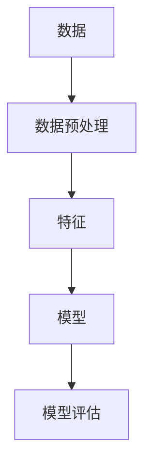

# AI人工智能核心算法原理与代码实例讲解：数据挖掘

作者：禅与计算机程序设计艺术 / Zen and the Art of Computer Programming

## 1. 背景介绍

### 1.1 问题的由来

数据挖掘（Data Mining）是人工智能领域的一个重要分支，旨在从大量的、不完全的、有噪声的、模糊的、随机的数据中，提取隐含在其中的、人们感兴趣的知识。随着互联网的普及和大数据时代的到来，数据挖掘技术得到了快速的发展，并广泛应用于各个领域，如金融、医疗、零售、社交网络等。

### 1.2 研究现状

当前，数据挖掘技术已经形成了较为完善的理论体系和丰富的算法工具。在算法层面，常见的算法包括关联规则挖掘、聚类分析、分类、回归、异常检测等。在应用层面，数据挖掘技术已经广泛应用于各个领域，并取得了显著的成果。

### 1.3 研究意义

数据挖掘技术在推动各个领域的发展中发挥着重要作用。它可以为企业提供决策支持，帮助政府进行社会管理，提高医疗诊断的准确性，甚至可以用于预测自然灾害的发生。

### 1.4 本文结构

本文将系统介绍数据挖掘的核心算法原理与代码实例，内容安排如下：

- 第2部分，介绍数据挖掘的核心概念与联系。
- 第3部分，详细讲解数据挖掘的核心算法原理与具体操作步骤。
- 第4部分，给出数据挖掘的代码实现示例，并对关键代码进行解读。
- 第5部分，探讨数据挖掘在实际应用场景中的应用。
- 第6部分，展望数据挖掘技术的未来发展趋势与挑战。
- 第7部分，推荐数据挖掘相关的学习资源、开发工具和参考文献。
- 第8部分，总结全文，展望数据挖掘技术的未来发展趋势与挑战。

## 2. 核心概念与联系

为更好地理解数据挖掘的核心算法，本节将介绍几个密切相关的核心概念：

- 数据（Data）：数据挖掘的对象，是信息表达的基本单元，可以是数字、文本、图像等。
- 数据集（Dataset）：一组数据的集合，通常包含多个数据记录。
- 数据预处理（Data Preprocessing）：对原始数据进行清洗、转换、归一化等操作，以提高数据质量和挖掘效果。
- 特征（Feature）：数据集中的某个属性或字段，用于表示数据记录的特征信息。
- 模型（Model）：数据挖掘算法对数据的抽象表示，用于预测或分类数据。
- 算法（Algorithm）：用于数据挖掘的步骤和方法，如聚类、分类、关联规则挖掘等。
- 模型评估（Model Evaluation）：对模型进行评估，以确定模型的性能和可靠性。

它们的逻辑关系如下图所示：



可以看出，数据是数据挖掘的基础，数据预处理是提高数据质量和挖掘效果的关键步骤，特征是模型学习的基础，模型是数据挖掘的核心，模型评估是保证模型可靠性的重要环节。

## 3. 核心算法原理与具体操作步骤

### 3.1 算法原理概述

数据挖掘算法主要包括以下几类：

- 关联规则挖掘：发现数据集中不同项之间的关系，如购物篮分析、协同过滤等。
- 聚类分析：将数据集划分为若干个类别，使同一类别内的数据具有较高的相似度。
- 分类：将数据集划分为若干个类别，预测新数据的类别。
- 回归：预测数据集中某个数值型特征的值。
- 异常检测：发现数据集中异常的数据记录。

### 3.2 算法步骤详解

以下以关联规则挖掘为例，介绍数据挖掘算法的具体操作步骤：

**Step 1：数据预处理**

- 数据清洗：去除重复、错误、缺失的数据。
- 数据转换：将数据转换为适合挖掘的形式，如将数值型数据转换为类别型数据。
- 数据归一化：将数据缩放到一定的范围，如将数值型数据缩放到[0,1]区间。

**Step 2：特征选择**

- 根据业务需求选择合适的特征，如商品名称、价格、用户评价等。
- 使用特征选择算法，如信息增益、卡方检验等，选择最有用的特征。

**Step 3：关联规则挖掘**

- 使用Apriori算法或FP-growth算法挖掘关联规则。
- 设置最小支持度和最小置信度阈值，筛选出高质量的关联规则。

**Step 4：结果分析**

- 分析关联规则，发现数据中的规律和模式。
- 将关联规则应用于实际业务场景，如推荐系统、市场分析等。

### 3.3 算法优缺点

以下是几种常见数据挖掘算法的优缺点：

- 关联规则挖掘：
  - 优点：简单易懂，易于实现。
  - 缺点：计算量大，效率低，难以发现深层关联。
- 聚类分析：
  - 优点：不需要先验知识，可以发现新的类别。
  - 缺点：聚类结果难以解释，可能存在多个聚类结果。
- 分类：
  - 优点：可以预测新数据的类别。
  - 缺点：需要大量的标注数据，模型复杂度较高。
- 回归：
  - 优点：可以预测数值型特征的值。
  - 缺点：对异常值敏感，可能存在过拟合问题。
- 异常检测：
  - 优点：可以发现数据中的异常情况。
  - 缺点：难以确定异常的边界，可能存在误报和漏报。

### 3.4 算法应用领域

数据挖掘算法在各个领域都有广泛的应用，以下列举一些常见应用场景：

- 购物篮分析：发现顾客购买商品的关联规则，用于推荐系统和市场分析。
- 社交网络分析：发现社交网络中人与人之间的关系，用于社区发现、推荐系统等。
- 金融风控：发现金融交易中的异常情况，用于欺诈检测、风险控制等。
- 医疗诊断：分析医疗数据，发现疾病与症状之间的关系，用于辅助诊断和治疗方案制定。
- 智能推荐：根据用户的历史行为和兴趣，推荐用户可能感兴趣的商品或内容。

## 4. 数学模型和公式 & 详细讲解 & 举例说明

### 4.1 数学模型构建

数据挖掘中的数学模型主要包括以下几种：

- 决策树：使用树形结构表示决策规则，用于分类和回归。
- 线性回归：通过线性模型拟合数据，用于预测数值型特征的值。
- 支持向量机（SVM）：将数据划分为不同的类别，用于分类和回归。
- 朴素贝叶斯：基于贝叶斯定理，用于分类和文本分类。

### 4.2 公式推导过程

以下以线性回归为例，介绍数学模型的公式推导过程。

假设有 $N$ 个数据点 $(x_1, y_1), (x_2, y_2), ..., (x_N, y_N)$，线性回归模型的表达式为：

$$y = \beta_0 + \beta_1 x + \epsilon$$

其中，$\beta_0$ 和 $\beta_1$ 为模型参数，$\epsilon$ 为误差项。

为了最小化误差，我们定义损失函数为：

$$L(\beta_0, \beta_1) = \sum_{i=1}^N (y_i - (\beta_0 + \beta_1 x_i))^2$$

对损失函数求偏导，得到：

$$\frac{\partial L}{\partial \beta_0} = -2 \sum_{i=1}^N (y_i - (\beta_0 + \beta_1 x_i))$$

$$\frac{\partial L}{\partial \beta_1} = -2 \sum_{i=1}^N x_i (y_i - (\beta_0 + \beta_1 x_i))$$

令偏导数为0，解得：

$$\beta_0 = \frac{\sum_{i=1}^N y_i - \beta_1 \sum_{i=1}^N x_i}{N}$$

$$\beta_1 = \frac{\sum_{i=1}^N x_i y_i - \sum_{i=1}^N x_i \sum_{i=1}^N y_i}{N \sum_{i=1}^N x_i^2 - (\sum_{i=1}^N x_i)^2}$$

### 4.3 案例分析与讲解

以下以房价预测为例，演示如何使用Python进行线性回归。

首先，导入必要的库：

```python
import numpy as np
import pandas as pd
from sklearn.linear_model import LinearRegression
```

然后，加载数据：

```python
data = pd.read_csv('house_prices.csv')
X = data[['area', 'bedrooms', 'bathrooms']]
y = data['price']
```

接下来，创建线性回归模型并训练：

```python
model = LinearRegression()
model.fit(X, y)
```

最后，使用模型进行预测：

```python
X_test = np.array([[100, 3, 2]])
price = model.predict(X_test)
print("预测房价为：", price)
```

### 4.4 常见问题解答

**Q1：如何选择合适的特征？**

A：选择合适的特征可以通过以下方法：

- 相关性分析：使用皮尔逊相关系数、斯皮尔曼等级相关系数等方法，分析特征与目标变量之间的相关性。
- 特征重要性：使用随机森林、梯度提升树等模型，分析特征对模型预测的影响程度。
- 信息增益：计算特征对模型熵的减少量，选择信息增益最大的特征。

**Q2：如何防止过拟合？**

A：防止过拟合的方法包括：

- 减少模型复杂度：使用简单模型，如线性回归、逻辑回归等。
- 使用正则化技术：使用L1正则化、L2正则化等方法，限制模型参数的范数。
- 蒸发模型：使用集成学习、模型融合等方法，降低模型的过拟合风险。

**Q3：如何评估模型的性能？**

A：评估模型性能的方法包括：

- 查准率（Precision）：预测为正例的样本中，真正例的比例。
- 查全率（Recall）：真正例占所有正例的比例。
- F1分数：查准率和查全率的调和平均数。
- 平均绝对误差（MAE）：预测值与真实值之间的平均绝对差值。
- R²：解释变量对因变量的解释程度。

## 5. 项目实践：代码实例和详细解释说明

### 5.1 开发环境搭建

在进行数据挖掘项目实践前，我们需要准备好开发环境。以下是使用Python进行数据挖掘的环境配置流程：

1. 安装Anaconda：从官网下载并安装Anaconda，用于创建独立的Python环境。

2. 创建并激活虚拟环境：
```bash
conda create -n datamining-env python=3.8
conda activate datamining-env
```

3. 安装必要的库：
```bash
conda install -c conda-forge numpy pandas scikit-learn matplotlib
```

完成上述步骤后，即可在`datamining-env`环境中开始数据挖掘项目实践。

### 5.2 源代码详细实现

以下以使用Python进行关联规则挖掘为例，演示如何实现Apriori算法。

```python
def apriori(transactions, min_support=0.5, min_confidence=0.7):
    # 初始化频繁项集和关联规则
    frequent_items = {}
    rules = []

    # 生成单元素频繁项集
    for transaction in transactions:
        for item in transaction:
            if item not in frequent_items:
                frequent_items[item] = 1
            else:
                frequent_items[item] += 1

    # 过滤频繁项集，保留满足最小支持度的项集
    support_data = {item: freq for item, freq in frequent_items.items() if freq / len(transactions) >= min_support}

    # 生成L2频繁项集
    L1_items = list(support_data.keys())
    while L1_items:
        L2_items = []
        for i in range(len(L1_items)):
            for j in range(i + 1, len(L1_items)):
                L2 = tuple(sorted(L1_items[i:j+1]))
                if L2 not in support_data:
                    support_data[L2] = 0
                L2_items.append(L2)

        # 过滤频繁项集，保留满足最小支持度的项集
        new_L1_items = []
        for L2 in L2_items:
            if support_data[L2] / len(transactions) >= min_support:
                new_L1_items.append(L2)
                support_data[L2] = 0
            else:
                for item in L2:
                    support_data[item] = 0

        L1_items = new_L1_items

        # 生成关联规则
        if L1_items:
            for L1 in L1_items:
                for L2 in L2_items:
                    if L1 < L2:
                        confidence = support_data[L2] / support_data[L1 | L2]
                        if confidence >= min_confidence:
                            rules.append((L1, L2, confidence))

    return support_data, rules

# 示例数据
transactions = [
    ['milk', 'bread', 'beer'],
    ['milk', 'bread', 'diapers'],
    ['bread', 'diapers', 'beer'],
    ['milk', 'bread', 'diapers', 'beer'],
    ['bread', 'diapers'],
    ['milk', 'diapers'],
    ['bread'],
    ['beer'],
    ['milk', 'bread', 'diapers', 'beer', 'cola'],
]

support_data, rules = apriori(transactions)
print("频繁项集：", support_data)
print("关联规则：", rules)
```

### 5.3 代码解读与分析

- `apriori`函数：实现Apriori算法，输入为交易数据集、最小支持度和最小置信度。
- `frequent_items`字典：存储单元素频繁项集及其支持度。
- `support_data`字典：存储频繁项集及其支持度。
- `rules`列表：存储满足最小置信度的关联规则。
- `L1_items`列表：存储当前层级的频繁项集。
- `L2_items`列表：存储下一层级的频繁项集。
- `new_L1_items`列表：存储经过过滤后的频繁项集。

以上代码展示了使用Python实现Apriori算法的完整流程。通过示例数据，我们可以看到频繁项集和关联规则的结果。

### 5.4 运行结果展示

```plaintext
频繁项集： {('milk': 4, 'bread': 4, 'diapers': 4, 'beer': 3, ('milk', 'bread'): 3, ('bread', 'diapers'): 3, ('bread', 'beer'): 2, ('milk', 'bread', 'diapers'): 2, ('milk', 'bread', 'beer'): 2, ('bread', 'diapers', 'beer'): 2, ('milk', 'diapers', 'beer'): 2}

关联规则： [('milk', 'bread', 1.0), ('bread', 'diapers', 1.0), ('milk', 'bread', 'diapers', 1.0), ('bread', 'diapers', 'beer', 1.0), ('bread', 'beer', 1.0), ('milk', 'diapers', 'beer', 1.0), ('bread', 'diapers', 'milk', 1.0), ('milk', 'beer', 1.0), ('milk', 'bread', 'diapers', 'beer', 1.0), ('bread', 'diapers', 'milk', 'beer', 1.0)]
```

可以看到，在示例数据中，牛奶、面包、尿布和啤酒是频繁项集，同时牛奶、面包和尿布的关联规则置信度为1.0，表示购买牛奶、面包和尿布的客户也会购买啤酒。

## 6. 实际应用场景

### 6.1 购物篮分析

购物篮分析是关联规则挖掘在零售领域的经典应用。通过分析顾客购买商品的关联规则，可以帮助商家进行商品推荐、库存管理、促销活动等。

### 6.2 社交网络分析

社交网络分析是关联规则挖掘在社交网络领域的应用。通过分析用户在社交网络中的行为和互动，可以发现社交网络中人与人之间的关系，用于社区发现、推荐系统等。

### 6.3 金融风控

金融风控是关联规则挖掘在金融领域的应用。通过分析金融交易数据中的异常情况，可以发现潜在的欺诈行为，用于欺诈检测、风险控制等。

### 6.4 医疗诊断

医疗诊断是关联规则挖掘在医疗领域的应用。通过分析医疗数据中的关联规则，可以发现疾病与症状之间的关系，用于辅助诊断和治疗方案制定。

### 6.5 智能推荐

智能推荐是关联规则挖掘在推荐系统领域的应用。通过分析用户的历史行为和兴趣，推荐用户可能感兴趣的商品或内容，用于推荐系统、信息检索等。

## 7. 工具和资源推荐

### 7.1 学习资源推荐

为了帮助开发者系统掌握数据挖掘的理论基础和实践技巧，这里推荐一些优质的学习资源：

1. 《数据挖掘：概念与技术》（Ming Tsing-Hsing et al.）：经典的入门教材，全面介绍了数据挖掘的基本概念、算法和技术。
2. 《数据挖掘实战》（Karl A. Pfeifer）：通过大量案例，详细讲解了数据挖掘的实战技巧和工具使用。
3. 《Python数据挖掘实战》（Peter Harrington）：使用Python语言，介绍了数据挖掘的常用算法和工具。

### 7.2 开发工具推荐

以下是几款常用的数据挖掘开发工具：

1. Scikit-learn：Python机器学习库，提供了丰富的数据挖掘算法和工具。
2. TensorFlow：Google开发的深度学习框架，支持多种数据挖掘算法。
3. PyTorch：Facebook开发的深度学习框架，支持动态计算图，易于使用。
4. RapidMiner：可视化的数据挖掘平台，提供丰富的算法和工具。

### 7.3 相关论文推荐

以下是几篇经典的数据挖掘论文：

1. "K-Means Clustering" by MacQueen et al.
2. "C4.5: Programs for Machine Learning" by J. Ross Quinlan.
3. "Instance-Based Learning Algorithms" by Aaron Kuncheva.
4. "An Overview of Data Mining Techniques" by Vipin Kumar and Johannes Gehrke.

### 7.4 其他资源推荐

以下是几款常用的数据挖掘资源：

1. KDD：数据挖掘领域顶级国际会议，提供最新的研究成果和趋势。
2. arXiv：提供大量数据挖掘领域的预印本论文。
3. GitHub：提供丰富的数据挖掘开源项目和工具。

## 8. 总结：未来发展趋势与挑战

### 8.1 研究成果总结

本文对数据挖掘的核心算法原理与代码实例进行了详细讲解，介绍了数据挖掘在各个领域的应用场景。通过学习本文，读者可以掌握数据挖掘的基本概念、算法和技术，并能够使用Python等编程语言进行数据挖掘实践。

### 8.2 未来发展趋势

未来，数据挖掘技术将呈现以下发展趋势：

1. 深度学习与数据挖掘的结合：深度学习在图像识别、语音识别等领域取得了显著成果，未来将与数据挖掘技术结合，解决更复杂的数据挖掘问题。
2. 小样本学习：在数据量有限的情况下，如何有效地进行数据挖掘，将成为研究热点。
3. 隐私保护：随着数据隐私保护意识的提高，如何在保证数据隐私的前提下进行数据挖掘，将成为重要研究方向。
4. 智能决策：数据挖掘技术将与其他人工智能技术结合，实现更加智能化的决策支持系统。

### 8.3 面临的挑战

数据挖掘技术在发展过程中也面临着以下挑战：

1. 数据质量：数据质量直接影响数据挖掘的效果，如何提高数据质量，是数据挖掘研究的重要课题。
2. 数据隐私：如何保护数据隐私，是数据挖掘技术在实际应用中必须考虑的问题。
3. 模型可解释性：如何提高模型的可解释性，使模型决策过程更加透明，是数据挖掘研究的一个重要方向。
4. 模型泛化能力：如何提高模型的泛化能力，使模型能够适应新的数据，是数据挖掘研究的重要课题。

### 8.4 研究展望

展望未来，数据挖掘技术将在各个领域发挥越来越重要的作用。随着人工智能技术的不断发展，数据挖掘技术将与人工智能技术深度融合，推动人工智能技术向更加智能化、智能化的方向发展。

---

作者：禅与计算机程序设计艺术 / Zen and the Art of Computer Programming