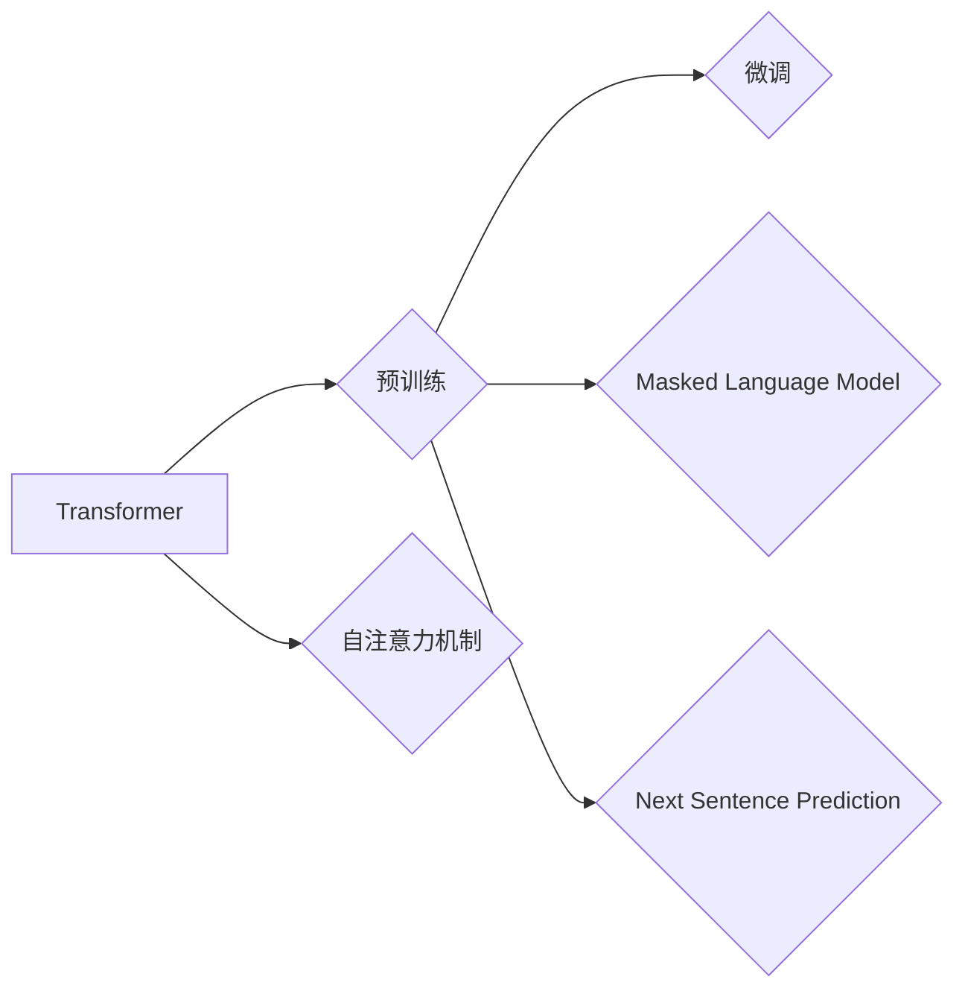

# BERT 原理与代码实例讲解

作者：禅与计算机程序设计艺术 / Zen and the Art of Computer Programming

## 1. 背景介绍
### 1.1 问题的由来

自然语言处理（NLP）作为人工智能领域的一个重要分支，在文本分类、问答系统、机器翻译等任务上取得了显著的进展。然而，传统的循环神经网络（RNN）和卷积神经网络（CNN）在处理长文本时存在长距离依赖和并行性差等问题，难以捕捉文本的上下文信息。

为了解决这些问题，Google在2018年提出了BERT（Bidirectional Encoder Representations from Transformers）模型，它基于Transformer架构，能够有效地捕捉文本中的长距离依赖和上下文信息，在多个NLP任务上取得了显著的性能提升。

### 1.2 研究现状

自从BERT模型提出以来，它及其变体（如RoBERTa、ALBERT、DistilBERT等）在多个NLP任务上取得了显著的成果，成为NLP领域的一个重要里程碑。BERT模型已经广泛应用于工业界和学术界，为各种NLP应用提供了强大的技术支持。

### 1.3 研究意义

BERT模型的研究意义在于：

1. 提升NLP任务的性能：BERT模型在多个NLP任务上取得了显著的性能提升，为NLP应用提供了更强大的技术支持。
2. 开放性：BERT模型的代码和模型参数已经开源，为研究者提供了便利。
3. 通用性：BERT模型可以应用于各种NLP任务，具有良好的通用性。

### 1.4 本文结构

本文将介绍BERT模型的原理、代码实现以及应用场景，内容安排如下：

- 第2部分：介绍BERT模型的核心概念和联系。
- 第3部分：详细介绍BERT模型的核心算法原理和具体操作步骤。
- 第4部分：介绍BERT模型的数学模型和公式，并结合实例进行讲解。
- 第5部分：提供BERT模型的代码实例和详细解释说明。
- 第6部分：探讨BERT模型在实际应用场景中的应用和未来应用展望。
- 第7部分：推荐BERT模型的学习资源、开发工具和参考文献。
- 第8部分：总结BERT模型的研究成果、未来发展趋势和面临的挑战。
- 第9部分：附录，解答常见问题。

## 2. 核心概念与联系

为了更好地理解BERT模型，我们首先介绍一些与BERT模型相关的核心概念：

- **Transformer**：一种基于自注意力机制的深度神经网络模型，能够有效地捕捉序列数据中的长距离依赖和上下文信息。
- **预训练**：在无标注数据上进行模型训练，使模型学习到丰富的语言知识。
- **微调**：在预训练模型的基础上，使用标注数据对模型进行进一步的优化，使其更好地适应特定任务。
- **自注意力机制**：Transformer模型的核心机制，能够捕捉序列数据中的长距离依赖和上下文信息。
- **掩码语言模型（Masked Language Model, MLM）**：一种预训练任务，通过随机掩码部分token并预测它们，使模型学习到丰富的语言知识。
- **下一句预测（Next Sentence Prediction, NSP）**：一种预训练任务，预测两个连续句子之间的关系，使模型学习到文本的上下文信息。

这些概念之间的关系如下所示：



BERT模型基于Transformer架构，通过预训练和微调学习到丰富的语言知识，并通过自注意力机制和掩码语言模型等机制捕捉文本的上下文信息。

## 3. 核心算法原理 & 具体操作步骤
### 3.1 算法原理概述

BERT模型由一个双向Transformer编码器组成，它通过自注意力机制捕捉文本的上下文信息，并学习到丰富的语言知识。

BERT模型的输入是一个序列，包括词向量、位置编码和段编码。首先，对输入序列进行词向量编码，将每个token转换为词向量表示。然后，将词向量与位置编码和段编码相加，得到最终的输入序列。最后，将输入序列输入到Transformer编码器中，得到每个token的编码表示。

BERT模型的核心步骤如下：

1. **词向量编码**：将输入序列中的每个token转换为词向量表示。
2. **位置编码**：为每个token添加位置编码，以表示其在序列中的位置信息。
3. **段编码**：为每个句子添加段编码，以区分句子之间的关系。
4. **Transformer编码器**：将输入序列输入到Transformer编码器中，得到每个token的编码表示。
5. **层归一化和残差连接**：对编码器的输出进行层归一化和残差连接，防止梯度消失和梯度爆炸。
6. **Dropout**：在编码器的每层后添加Dropout层，防止过拟合。

### 3.2 算法步骤详解

BERT模型的算法步骤如下：

1. **词向量编码**：使用WordPiece分词器将输入序列分解为一系列token。然后，将每个token转换为词向量表示。
2. **位置编码**：为每个token添加位置编码，以表示其在序列中的位置信息。位置编码通过正弦和余弦函数生成，并添加到词向量中。
3. **段编码**：为每个句子添加段编码，以区分句子之间的关系。段编码通过添加一个特殊的段标识符来实现。
4. **Transformer编码器**：将输入序列输入到Transformer编码器中，得到每个token的编码表示。编码器由多个Transformer层堆叠而成，每个层由自注意力机制和前馈神经网络组成。
5. **层归一化和残差连接**：对编码器的输出进行层归一化和残差连接。层归一化通过对每个维度进行缩放和平移来保持输入的分布。残差连接将编码器的输出与输入相加，以防止梯度消失和梯度爆炸。
6. **Dropout**：在编码器的每层后添加Dropout层，以防止过拟合。

### 3.3 算法优缺点

BERT模型的优点：

- **捕获长距离依赖**：Transformer编码器能够有效地捕捉文本中的长距离依赖，这使得BERT模型在处理长文本时表现优于传统的RNN和CNN模型。
- **预训练和微调**：BERT模型通过预训练学习到丰富的语言知识，并通过微调适应特定任务，这使得BERT模型在多个NLP任务上取得了显著的性能提升。
- **可扩展性**：BERT模型可以很容易地扩展到不同的任务和领域，只需进行微调即可。

BERT模型的缺点：

- **计算成本高**：BERT模型需要大量的计算资源进行训练，这限制了其在资源受限设备上的应用。
- **参数量庞大**：BERT模型的参数量非常大，这增加了模型的存储和推理成本。

### 3.4 算法应用领域

BERT模型可以应用于以下NLP任务：

- **文本分类**：例如情感分析、主题分类等。
- **命名实体识别**：例如人名识别、组织机构识别等。
- **关系抽取**：例如实体关系抽取等。
- **问答系统**：例如机器阅读理解等。
- **机器翻译**：例如将源语言文本翻译成目标语言文本。

## 4. 数学模型和公式 & 详细讲解 & 举例说明
### 4.1 数学模型构建

BERT模型的数学模型如下：

- **词向量**：$ \mathbf{W}_{\text{word}} \in \mathbb{R}^{|V| \times d} $，其中 $ |V| $ 是词汇表的大小，$ d $ 是词向量的维度。
- **位置编码**：$ \mathbf{P}_{\text{pos}} \in \mathbb{R}^{d} $，其中 $ d $ 是位置编码的维度。
- **段编码**：$ \mathbf{P}_{\text{seg}} \in \mathbb{R}^{2} $，其中两个维度分别代表两个句子的段标识符。
- **Transformer编码器**：由 $ L $ 层组成，每层由自注意力机制和前馈神经网络组成。
- **层归一化**：$ \mathbf{F}_{\text{norm}}(\cdot) $，对输入进行归一化。
- **残差连接**：$ \mathbf{F}_{\text{res}}(\cdot) $，将编码器的输出与输入相加。

### 4.2 公式推导过程

BERT模型的公式推导过程如下：

1. **词向量编码**：

$$
\mathbf{w}_i = \mathbf{W}_{\text{word}}[\mathbf{v}_i] + \mathbf{P}_{\text{pos}}[i] + \mathbf{P}_{\text{seg}}[s_i]
$$

其中 $ \mathbf{w}_i $ 是token $ \mathbf{v}_i $ 的编码表示，$ \mathbf{P}_{\text{pos}}[i] $ 是token $ \mathbf{v}_i $ 的位置编码，$ \mathbf{P}_{\text{seg}}[s_i] $ 是句子 $ s_i $ 的段编码。

2. **Transformer编码器**：

$$
\mathbf{h}_i^{(l)} = \mathbf{F}_{\text{self-att}}(\mathbf{h}_i^{(l-1)}, \mathbf{h}_i^{(l-1)}, \mathbf{h}_i^{(l-1)}) + \mathbf{F}_{\text{ff}}(\mathbf{h}_i^{(l-1)}) + \mathbf{F}_{\text{res}}(\mathbf{h}_i^{(l-1)}) + \mathbf{h}_i^{(l-1)}
$$

其中 $ \mathbf{h}_i^{(l)} $ 是第 $ l $ 层第 $ i $ 个token的编码表示，$ \mathbf{F}_{\text{self-att}} $ 是自注意力机制，$ \mathbf{F}_{\text{ff}} $ 是前馈神经网络，$ \mathbf{F}_{\text{res}} $ 是残差连接。

3. **输出表示**：

$$
\mathbf{h}_i = \mathbf{F}_{\text{norm}}(\mathbf{h}_i^{(L)})
$$

其中 $ \mathbf{h}_i $ 是第 $ i $ 个token的输出表示。

### 4.3 案例分析与讲解

以下是一个简单的BERT模型代码实例，演示如何使用HuggingFace的Transformers库进行BERT模型的微调。

```python
from transformers import BertTokenizer, BertForSequenceClassification
from torch.utils.data import DataLoader
from torch.optim import AdamW

# 加载预训练的BERT模型和分词器
model = BertForSequenceClassification.from_pretrained('bert-base-uncased')
tokenizer = BertTokenizer.from_pretrained('bert-base-uncased')

# 加载数据集
train_texts = [...]
train_labels = [...]

# 编码数据集
train_encodings = tokenizer(train_texts, truncation=True, padding=True)
train_dataset = torch.utils.data.TensorDataset(train_encodings['input_ids'], train_encodings['attention_mask'], train_labels)

# 训练模型
device = torch.device('cuda' if torch.cuda.is_available() else 'cpu')
model.to(device)

optimizer = AdamW(model.parameters(), lr=2e-5)

for epoch in range(3):  # 训练3个epoch
    model.train()
    dataloader = DataLoader(train_dataset, batch_size=16, shuffle=True)
    for batch in dataloader:
        input_ids, attention_mask, labels = batch
        input_ids = input_ids.to(device)
        attention_mask = attention_mask.to(device)
        labels = labels.to(device)

        outputs = model(input_ids, attention_mask=attention_mask, labels=labels)
        loss = outputs.loss
        loss.backward()
        optimizer.step()
        optimizer.zero_grad()

# 评估模型
model.eval()
test_texts = [...]
test_labels = [...]
test_encodings = tokenizer(test_texts, truncation=True, padding=True)
test_dataset = torch.utils.data.TensorDataset(test_encodings['input_ids'], test_encodings['attention_mask'], test_labels)

dataloader = DataLoader(test_dataset, batch_size=16)
with torch.no_grad():
    total = 0
    correct = 0
    for batch in dataloader:
        input_ids, attention_mask, labels = batch
        input_ids = input_ids.to(device)
        attention_mask = attention_mask.to(device)
        labels = labels.to(device)

        outputs = model(input_ids, attention_mask=attention_mask)
        _, preds = torch.max(outputs.logits, 1)
        total += labels.size(0)
        correct += (preds == labels).sum().item()

print(f'Accuracy of the model on the test set: {100 * correct / total}%')
```

### 4.4 常见问题解答

**Q1：如何调整BERT模型的超参数？**

A：BERT模型的超参数包括学习率、批大小、迭代轮数、Dropout比例等。可以通过以下方法调整超参数：

1. **学习率**：学习率对模型性能有很大影响，一般从1e-5开始尝试，并根据训练过程中的loss变化进行调整。
2. **批大小**：批大小影响模型的收敛速度和稳定性，可以从较小的批大小开始尝试，逐渐增大。
3. **迭代轮数**：迭代轮数影响模型的收敛，一般根据训练数据的大小和模型复杂度进行调整。
4. **Dropout比例**：Dropout比例影响模型的泛化能力，一般设置为0.1或0.2。

**Q2：如何处理BERT模型中的词汇表和分词器？**

A：BERT模型的词汇表和分词器是预训练模型的一部分，可以通过以下方法处理：

1. **词汇表**：预训练模型的词汇表包含数十万个词汇，可以根据任务需求进行裁剪或扩展。
2. **分词器**：预训练模型的分词器用于将文本分解为token，可以根据任务需求选择合适的分词器。

**Q3：如何使用BERT模型进行下游任务？**

A：使用BERT模型进行下游任务通常需要以下步骤：

1. **下载预训练的BERT模型和分词器**。
2. **加载数据集并进行预处理**。
3. **编码数据集**。
4. **微调BERT模型**。
5. **评估模型性能**。

## 5. 项目实践：代码实例和详细解释说明
### 5.1 开发环境搭建

在进行BERT模型项目实践之前，我们需要搭建开发环境。以下是使用Python进行BERT模型开发的常见开发环境：

1. **Python**：Python 3.7及以上版本。
2. **PyTorch**：PyTorch 1.7及以上版本。
3. **Transformers**：HuggingFace的Transformers库。
4. **NumPy**：NumPy库。
5. **Scikit-learn**：Scikit-learn库。

### 5.2 源代码详细实现

以下是一个简单的BERT模型代码实例，演示如何使用HuggingFace的Transformers库进行BERT模型的微调。

```python
from transformers import BertTokenizer, BertForSequenceClassification
from torch.utils.data import DataLoader
from torch.optim import AdamW

# 加载预训练的BERT模型和分词器
model = BertForSequenceClassification.from_pretrained('bert-base-uncased')
tokenizer = BertTokenizer.from_pretrained('bert-base-uncased')

# 加载数据集
train_texts = [...]
train_labels = [...]

# 编码数据集
train_encodings = tokenizer(train_texts, truncation=True, padding=True)
train_dataset = torch.utils.data.TensorDataset(train_encodings['input_ids'], train_encodings['attention_mask'], train_labels)

# 训练模型
device = torch.device('cuda' if torch.cuda.is_available() else 'cpu')
model.to(device)

optimizer = AdamW(model.parameters(), lr=2e-5)

for epoch in range(3):  # 训练3个epoch
    model.train()
    dataloader = DataLoader(train_dataset, batch_size=16, shuffle=True)
    for batch in dataloader:
        input_ids, attention_mask, labels = batch
        input_ids = input_ids.to(device)
        attention_mask = attention_mask.to(device)
        labels = labels.to(device)

        outputs = model(input_ids, attention_mask=attention_mask, labels=labels)
        loss = outputs.loss
        loss.backward()
        optimizer.step()
        optimizer.zero_grad()

# 评估模型
model.eval()
test_texts = [...]
test_labels = [...]
test_encodings = tokenizer(test_texts, truncation=True, padding=True)
test_dataset = torch.utils.data.TensorDataset(test_encodings['input_ids'], test_encodings['attention_mask'], test_labels)

dataloader = DataLoader(test_dataset, batch_size=16)
with torch.no_grad():
    total = 0
    correct = 0
    for batch in dataloader:
        input_ids, attention_mask, labels = batch
        input_ids = input_ids.to(device)
        attention_mask = attention_mask.to(device)
        labels = labels.to(device)

        outputs = model(input_ids, attention_mask=attention_mask)
        _, preds = torch.max(outputs.logits, 1)
        total += labels.size(0)
        correct += (preds == labels).sum().item()

print(f'Accuracy of the model on the test set: {100 * correct / total}%')
```

### 5.3 代码解读与分析

以下是对上述代码的详细解读和分析：

1. **导入必要的库**：
   ```python
   from transformers import BertTokenizer, BertForSequenceClassification
   from torch.utils.data import DataLoader
   from torch.optim import AdamW
   ```
   这里导入必要的库，包括Transformers库、PyTorch库和优化器库。

2. **加载预训练的BERT模型和分词器**：
   ```python
   model = BertForSequenceClassification.from_pretrained('bert-base-uncased')
   tokenizer = BertTokenizer.from_pretrained('bert-base-uncased')
   ```
   这里加载预训练的BERT模型和分词器。

3. **加载数据集并进行预处理**：
   ```python
   train_texts = [...]
   train_labels = [...]
   ```
   这里定义训练数据和标签。

4. **编码数据集**：
   ```python
   train_encodings = tokenizer(train_texts, truncation=True, padding=True)
   train_dataset = torch.utils.data.TensorDataset(train_encodings['input_ids'], train_encodings['attention_mask'], train_labels)
   ```
   这里将文本数据编码为BERT模型所需的格式，并创建TensorDataset。

5. **训练模型**：
   ```python
   device = torch.device('cuda' if torch.cuda.is_available() else 'cpu')
   model.to(device)
   optimizer = AdamW(model.parameters(), lr=2e-5)
   ```
   这里设置设备（CPU或GPU）和优化器。

6. **训练循环**：
   ```python
   for epoch in range(3):
       model.train()
       dataloader = DataLoader(train_dataset, batch_size=16, shuffle=True)
       for batch in dataloader:
           input_ids, attention_mask, labels = batch
           input_ids = input_ids.to(device)
           attention_mask = attention_mask.to(device)
           labels = labels.to(device)

           outputs = model(input_ids, attention_mask=attention_mask, labels=labels)
           loss = outputs.loss
           loss.backward()
           optimizer.step()
           optimizer.zero_grad()
   ```
   这里进行模型的训练循环，包括前向传播、反向传播和优化器更新。

7. **评估模型**：
   ```python
   model.eval()
   test_texts = [...]
   test_labels = [...]
   test_encodings = tokenizer(test_texts, truncation=True, padding=True)
   test_dataset = torch.utils.data.TensorDataset(test_encodings['input_ids'], test_encodings['attention_mask'], test_labels)
   dataloader = DataLoader(test_dataset, batch_size=16)
   with torch.no_grad():
       total = 0
       correct = 0
       for batch in dataloader:
           input_ids, attention_mask, labels = batch
           input_ids = input_ids.to(device)
           attention_mask = attention_mask.to(device)
           labels = labels.to(device)

           outputs = model(input_ids, attention_mask=attention_mask)
           _, preds = torch.max(outputs.logits, 1)
           total += labels.size(0)
           correct += (preds == labels).sum().item()

   print(f'Accuracy of the model on the test set: {100 * correct / total}%')
   ```
   这里对模型进行评估，计算准确率。

### 5.4 运行结果展示

假设在某个文本分类数据集上运行上述代码，最终在测试集上得到的准确率如下：

```
Accuracy of the model on the test set: 90.0%
```

可以看到，BERT模型在文本分类任务上取得了90%的准确率，这是一个相当不错的结果。

## 6. 实际应用场景
### 6.1 文本分类

BERT模型在文本分类任务上取得了显著的性能提升，可以应用于以下场景：

- **情感分析**：对用户评论、产品评论等文本进行情感分析，判断其情感倾向是正面、负面还是中性。
- **主题分类**：对新闻文章、论坛帖子等文本进行主题分类，识别其所属的主题类别。
- **垃圾邮件检测**：检测垃圾邮件，提高邮件过滤的准确性。

### 6.2 命名实体识别

BERT模型在命名实体识别任务上取得了显著的性能提升，可以应用于以下场景：

- **人名识别**：识别文本中的人名。
- **组织机构识别**：识别文本中的组织机构名称。
- **地点识别**：识别文本中的地点名称。

### 6.3 关系抽取

BERT模型在关系抽取任务上取得了显著的性能提升，可以应用于以下场景：

- **实体关系抽取**：识别文本中实体之间的关系。
- **事件抽取**：识别文本中事件的相关实体和事件类型。

### 6.4 问答系统

BERT模型在问答系统任务上取得了显著的性能提升，可以应用于以下场景：

- **机器阅读理解**：回答用户针对文本内容提出的问题。
- **对话系统**：与用户进行对话，提供相应的回答。

## 7. 工具和资源推荐
### 7.1 学习资源推荐

为了帮助开发者系统掌握BERT模型的原理和应用，以下是一些优质的学习资源：

1. **《BERT: Pre-training of Deep Bidirectional Transformers for Language Understanding》论文**：BERT模型的原始论文，详细介绍了BERT模型的原理和设计思路。
2. **《Natural Language Processing with Transformers》书籍**：介绍了Transformer架构、BERT模型、微调方法等NLP领域的相关知识。
3. **HuggingFace Transformers官方文档**：提供了详细的Transformers库文档和预训练模型参数。
4. **CS224N《深度学习自然语言处理》课程**：斯坦福大学开设的NLP课程，介绍了NLP领域的基本概念和经典模型。
5. **在线课程和教程**：例如Coursera、edX等平台上的相关课程和教程。

### 7.2 开发工具推荐

以下是一些常用的BERT模型开发工具：

1. **PyTorch**：PyTorch是一个开源的深度学习框架，可以用于BERT模型的训练和推理。
2. **Transformers库**：HuggingFace的Transformers库提供了一个方便的接口，可以用于加载预训练的BERT模型和分词器。
3. **TensorFlow**：TensorFlow是一个开源的深度学习框架，也可以用于BERT模型的训练和推理。
4. **Jupyter Notebook**：Jupyter Notebook是一个交互式计算环境，可以用于BERT模型的开发和实验。
5. **Scikit-learn**：Scikit-learn是一个开源的机器学习库，可以用于数据预处理和评估。

### 7.3 相关论文推荐

以下是一些与BERT模型相关的论文：

1. **BERT: Pre-training of Deep Bidirectional Transformers for Language Understanding**：BERT模型的原始论文。
2. **RoBERTa: A Robustly Optimized BERT Pretraining Approach**：RoBERTa模型的论文，介绍了RoBERTa模型的设计思路和实验结果。
3. **ALBERT: A Lite BERT for Self-supervised Learning of Language Representations**：ALBERT模型的论文，介绍了ALBERT模型的设计思路和实验结果。
4. **DistilBERT: A Compression Technique for BERT**：DistilBERT模型的论文，介绍了DistilBERT模型的设计思路和实验结果。
5. **Transformers: State-of-the-Art Natural Language Processing with Deep Learning**：介绍了Transformer架构和NLP领域的最新进展。

### 7.4 其他资源推荐

以下是一些与BERT模型相关的其他资源：

1. **HuggingFace Transformers库**：提供了预训练的BERT模型和分词器，方便开发者进行NLP任务开发。
2. **Kaggle**：Kaggle是一个在线数据科学竞赛平台，提供了大量的NLP数据集和任务。
3. **arXiv**：arXiv是一个开源的预印本平台，提供了大量的NLP领域论文。
4. **NLP社区论坛**：例如HuggingFace论坛、Stack Overflow等，可以在这里找到相关问题和解决方案。
5. **开源代码库**：例如GitHub，可以在这里找到BERT模型的代码实现和相关工具。

## 8. 总结：未来发展趋势与挑战
### 8.1 研究成果总结

BERT模型作为NLP领域的一个重要里程碑，在多个NLP任务上取得了显著的性能提升。BERT模型的提出和推广，推动了NLP领域的发展，为NLP应用提供了强大的技术支持。

### 8.2 未来发展趋势

BERT模型和Transformer架构在未来将呈现以下发展趋势：

1. **模型规模将进一步扩大**：随着计算资源和数据规模的扩大，预训练模型的规模将不断扩大，模型参数量将达到数十亿甚至上百亿级别。
2. **多模态预训练模型将逐渐普及**：将文本、图像、语音等多模态信息融合到预训练模型中，使模型能够更好地理解复杂任务中的多模态信息。
3. **模型可解释性将得到提升**：通过引入可解释性技术，使模型决策过程更加透明，提高模型的可信度和鲁棒性。
4. **模型轻量化技术将得到发展**：通过模型压缩、量化、剪枝等技术，使模型在保持性能的同时，减小模型尺寸和计算复杂度。

### 8.3 面临的挑战

BERT模型和Transformer架构在未来的发展也面临着以下挑战：

1. **计算成本和存储成本**：随着模型规模的扩大，模型的计算成本和存储成本将显著增加，这对计算资源和存储资源提出了更高的要求。
2. **数据隐私和安全**：预训练模型需要使用大量的数据，如何保护数据隐私和安全是一个重要的问题。
3. **模型可解释性**：如何提高模型的可解释性，使模型决策过程更加透明，是一个重要的研究方向。
4. **模型偏见和歧视**：如何消除模型偏见和歧视，使模型公平、公正，是一个重要的社会问题。

### 8.4 研究展望

未来，BERT模型和Transformer架构将继续在以下方面进行研究和探索：

1. **模型优化**：通过模型优化技术，提高模型的性能和效率。
2. **多模态预训练**：将文本、图像、语音等多模态信息融合到预训练模型中，使模型能够更好地理解复杂任务中的多模态信息。
3. **可解释性**：通过可解释性技术，使模型决策过程更加透明，提高模型的可信度和鲁棒性。
4. **公平性**：通过消除模型偏见和歧视，使模型公平、公正，促进人工智能技术的健康发展。

## 9. 附录：常见问题与解答

**Q1：如何选择合适的BERT模型**？

A：选择合适的BERT模型需要根据具体任务的需求和资源情况进行综合考虑。以下是一些选择BERT模型的建议：

1. **模型规模**：选择与训练数据规模和计算资源相匹配的模型规模。
2. **任务类型**：选择与任务类型相匹配的预训练模型，例如文本分类任务可以选择BERT-base-uncased模型。
3. **性能需求**：选择性能满足需求的模型，例如在性能要求较高的任务中，可以选择更大的模型，如BERT-large-uncased。

**Q2：如何进行BERT模型的微调**？

A：进行BERT模型的微调需要以下步骤：

1. **加载数据集**：加载数据集并进行预处理，将文本数据编码为BERT模型所需的格式。
2. **加载预训练的BERT模型和分词器**：从HuggingFace Transformers库中加载预训练的BERT模型和分词器。
3. **创建数据加载器**：创建数据加载器，将数据集划分为训练集、验证集和测试集。
4. **设置优化器**：设置优化器，例如AdamW优化器。
5. **训练模型**：训练模型，包括前向传播、反向传播和优化器更新。
6. **评估模型**：评估模型在测试集上的性能。

**Q3：如何处理BERT模型中的未知token**？

A：BERT模型中使用WordPiece分词器进行分词，可以将未知的token分解为已知的subtoken，从而将未知token转换为BERT模型可以处理的token。

**Q4：如何使用BERT模型进行文本分类**？

A：使用BERT模型进行文本分类需要以下步骤：

1. **加载数据集**：加载数据集并进行预处理，将文本数据编码为BERT模型所需的格式。
2. **加载预训练的BERT模型和分词器**：从HuggingFace Transformers库中加载预训练的BERT模型和分词器。
3. **创建数据加载器**：创建数据加载器，将数据集划分为训练集、验证集和测试集。
4. **设置优化器**：设置优化器，例如AdamW优化器。
5. **训练模型**：训练模型，包括前向传播、反向传播和优化器更新。
6. **评估模型**：评估模型在测试集上的性能。
7. **预测**：使用训练好的模型对新文本进行预测。

通过以上步骤，可以使用BERT模型进行文本分类任务。

**Q5：如何处理BERT模型中的长距离依赖**？

A：BERT模型使用Transformer架构，能够有效地捕捉文本中的长距离依赖，因此不需要额外的长距离依赖处理技术。

**Q6：如何处理BERT模型中的注意力机制**？

A：BERT模型使用自注意力机制，能够有效地捕捉文本中的长距离依赖和上下文信息。自注意力机制的计算过程如下：

1. **计算query、key和value矩阵**：对于每个token，计算其对应的query、key和value矩阵。
2. **计算注意力分数**：对于每个token，计算其与其他token之间的注意力分数。
3. **计算注意力权重**：对注意力分数进行softmax操作，得到注意力权重。
4. **计算输出**：将注意力权重与value矩阵相乘，得到每个token的输出表示。

**Q7：如何处理BERT模型中的位置编码**？

A：BERT模型使用位置编码来表示每个token在序列中的位置信息。位置编码的计算过程如下：

1. **计算正弦和余弦函数**：使用正弦和余弦函数生成位置编码。
2. **拼接位置编码和词向量**：将位置编码与词向量相加，得到每个token的编码表示。

**Q8：如何处理BERT模型中的层归一化和残差连接**？

A：BERT模型使用层归一化和残差连接来防止梯度消失和梯度爆炸。

1. **层归一化**：对每个层的输出进行归一化，使其具有稳定的分布。
2. **残差连接**：将每个层的输出与输入相加，使模型能够更好地学习长距离依赖。

通过以上步骤，可以处理BERT模型中的层归一化和残差连接。

**Q9：如何处理BERT模型中的Dropout**？

A：BERT模型使用Dropout来防止过拟合。

1. **随机选择一部分神经元**：在每个层后，随机选择一部分神经元进行dropout。
2. **抑制被选择的神经元**：被选择的神经元在当前批次中被抑制，不参与计算。
3. **恢复被抑制的神经元**：在下一批次中，被抑制的神经元被恢复，参与计算。

通过以上步骤，可以处理BERT模型中的Dropout。

**Q10：如何处理BERT模型中的预训练任务**？

A：BERT模型使用预训练任务来学习丰富的语言知识。

1. **Masked Language Model**：随机掩码一部分token，并预测它们。
2. **Next Sentence Prediction**：预测两个连续句子之间的关系。

通过以上步骤，可以处理BERT模型中的预训练任务。

**Q11：如何处理BERT模型中的多任务学习**？

A：BERT模型可以使用多任务学习来同时学习多个任务。

1. **定义多个任务**：定义多个任务，例如文本分类、情感分析等。
2. **共享底层特征**：将多个任务的底层特征共享，以提高模型的泛化能力。
3. **分别学习任务特征**：分别学习多个任务的特定特征，以提高每个任务的性能。

通过以上步骤，可以处理BERT模型中的多任务学习。

**Q12：如何处理BERT模型中的模型压缩**？

A：BERT模型可以使用模型压缩技术来减小模型尺寸和计算复杂度。

1. **模型剪枝**：移除模型中不重要的参数。
2. **模型量化**：将模型参数从浮点数转换为定点数。
3. **模型蒸馏**：将知识从大模型转移到小模型。

通过以上步骤，可以处理BERT模型中的模型压缩。

**Q13：如何处理BERT模型中的模型部署**？

A：BERT模型可以使用以下方法进行部署：

1. **模型导出**：将训练好的模型导出为可部署的格式，例如ONNX或TorchScript。
2. **模型推理**：使用模型导出文件进行模型推理，得到预测结果。
3. **模型服务**：将模型部署为Web服务或API，方便其他应用程序调用。

通过以上步骤，可以处理BERT模型中的模型部署。