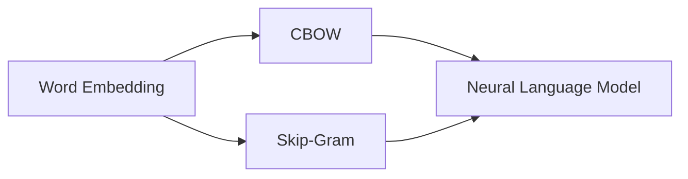

# CBOW模型的代码实现

作者：禅与计算机程序设计艺术 / Zen and the Art of Computer Programming


## 1. 背景介绍
### 1.1 问题的由来

词向量（Word Embedding）是自然语言处理（NLP）领域中一项重要的技术，它将单词转化为向量形式，从而在低维空间中捕捉单词的语义信息。Word2Vec是Google团队于2013年提出的一种词向量学习方法，它主要包括两种模型：Continuous Bag-of-Words (CBOW) 和 Skip-Gram。本文将重点介绍CBOW模型的原理及其在Python中的实现。

### 1.2 研究现状

近年来，词向量技术在NLP领域得到了广泛应用，如文本分类、情感分析、机器翻译等。CBOW模型作为Word2Vec的基础模型之一，在许多任务中表现优异。然而，随着预训练模型（如BERT、GPT）的兴起，CBOW模型的应用逐渐被边缘化。但CBOW模型仍然在许多领域具有广泛的应用价值，例如在线学习、推荐系统等。

### 1.3 研究意义

CBOW模型的实现对于理解词向量技术具有重要意义。本文将详细介绍CBOW模型的原理和代码实现，帮助读者更好地理解词向量技术，并为相关研究提供参考。

### 1.4 本文结构

本文将分为以下章节：
- 第2章：介绍CBOW模型的核心概念和联系。
- 第3章：阐述CBOW模型的具体操作步骤。
- 第4章：详细讲解CBOW模型的数学模型和公式，并结合实例进行说明。
- 第5章：展示CBOW模型的代码实现，并对关键代码进行解读。
- 第6章：探讨CBOW模型在实际应用场景中的应用。
- 第7章：推荐CBOW模型相关的学习资源、开发工具和参考文献。
- 第8章：总结CBOW模型的研究成果、未来发展趋势与挑战。
- 第9章：提供常见问题与解答。

## 2. 核心概念与联系

为了更好地理解CBOW模型，本节将介绍几个核心概念及其相互关系。

- **词向量（Word Embedding）**：将单词转化为向量形式，从而在低维空间中捕捉单词的语义信息。
- **连续词袋（Continuous Bag-of-Words, CBOW）**：CBOW模型是一种基于上下文的词向量学习方法，通过预测上下文词语来学习词向量。
- **词表（Vocabulary）**：包含所有训练文本中的单词，用于构建词向量。
- **神经语言模型（Neural Language Model）**：基于神经网络的词向量学习方法，包括CBOW模型和Skip-Gram模型。

它们的逻辑关系如下：



CBOW和Skip-Gram都是神经语言模型的一种，它们通过学习单词在低维空间中的表示，来捕捉单词的语义信息。

## 3. 核心算法原理 & 具体操作步骤
### 3.1 算法原理概述

CBOW模型是一种基于上下文的词向量学习方法，通过预测上下文词语来学习词向量。具体来说，给定一个单词w，CBOW模型会预测w的上下文单词，从而学习w的词向量。

### 3.2 算法步骤详解

CBOW模型的步骤如下：

1. **数据预处理**：将文本数据转换为单词序列。
2. **构建词表**：将所有单词序列中的单词添加到词表中。
3. **构建模型**：使用神经网络构建CBOW模型，包括输入层、隐藏层和输出层。
4. **训练模型**：使用负采样优化算法训练CBOW模型，使得模型能够预测给定单词的上下文单词。
5. **评估模型**：使用测试集评估CBOW模型的性能。

### 3.3 算法优缺点

CBOW模型的优点：

- **易于实现**：CBOW模型的算法相对简单，易于实现。
- **速度快**：CBOW模型训练速度快，适合大规模数据集。

CBOW模型的缺点：

- **上下文信息不足**：CBOW模型只考虑了上下文单词，忽略了单词之间的顺序信息。
- **性能不如Skip-Gram**：在许多任务中，CBOW模型的性能不如Skip-Gram模型。

### 3.4 算法应用领域

CBOW模型在以下领域具有广泛的应用价值：

- **文本分类**：使用CBOW模型提取文本的语义特征，用于文本分类任务。
- **情感分析**：使用CBOW模型提取文本的语义特征，用于情感分析任务。
- **命名实体识别**：使用CBOW模型提取文本的语义特征，用于命名实体识别任务。

## 4. 数学模型和公式 & 详细讲解 & 举例说明
### 4.1 数学模型构建

CBOW模型的数学模型如下：

- 输入层：输入向量 $v_w$ 表示单词w的词向量。
- 隐藏层：隐藏层由多个神经元组成，每个神经元对应一个上下文单词的词向量。
- 输出层：输出层由多个神经元组成，每个神经元对应一个上下文单词的词向量。

### 4.2 公式推导过程

假设输入层神经元i的激活函数为 $f_{i}(\cdot)$，输出层神经元j的激活函数为 $g_{j}(\cdot)$，则CBOW模型的输出为：

$$
\hat{y}_j = g_{j}(f_{i}(v_w)) \quad (j = 1, 2, \ldots, |V|)
$$

其中，$|V|$ 表示词表的大小。

### 4.3 案例分析与讲解

以下是一个简单的CBOW模型案例：

假设词表包含三个单词：w1、w2、w3。输入向量 $v_w$ 的维度为3。

输入层神经元i的激活函数为：

$$
f_{i}(v_w) = \frac{1}{1 + e^{-(v_w \cdot w_1 + v_w \cdot w_2 + v_w \cdot w_3)} = \frac{1}{1 + e^{-3}}
$$

输出层神经元j的激活函数为：

$$
\hat{y}_j = g_{j}(f_{i}(v_w)) = \frac{1}{1 + e^{-(w_1 \cdot w_j + w_2 \cdot w_j + w_3 \cdot w_j)} = \frac{1}{1 + e^{-3w_j}}
$$

### 4.4 常见问题解答

**Q1：如何选择合适的神经网络结构？**

A：CBOW模型的结构相对简单，一般使用单层神经网络即可。对于复杂任务，可以尝试使用多层神经网络。

**Q2：如何选择合适的激活函数？**

A：常见的激活函数有Sigmoid、Tanh等。Sigmoid函数适用于输出范围为[0, 1]的场景，Tanh函数适用于输出范围为[-1, 1]的场景。

**Q3：如何选择合适的优化算法？**

A：常见的优化算法有SGD、Adam等。SGD算法简单易用，但收敛速度较慢。Adam算法结合了SGD和Momentum的优势，收敛速度较快。

## 5. 项目实践：代码实例和详细解释说明
### 5.1 开发环境搭建

在进行CBOW模型实现前，我们需要准备好开发环境。以下是使用Python进行CBOW模型实现的步骤：

1. 安装NumPy和TensorFlow：
```bash
pip install numpy tensorflow
```
2. 编写代码实现CBOW模型。

### 5.2 源代码详细实现

以下是一个简单的CBOW模型实现：

```python
import numpy as np
import tensorflow as tf

class CBOWModel:
    def __init__(self, vocab_size, embedding_size, learning_rate=0.01, epochs=10):
        self.vocab_size = vocab_size
        self.embedding_size = embedding_size
        self.learning_rate = learning_rate
        self.epochs = epochs

        # 初始化权重
        self.W = tf.Variable(tf.random.normal([vocab_size, embedding_size]), dtype=tf.float32)
        self.b = tf.Variable(tf.zeros([embedding_size]), dtype=tf.float32)

    def forward(self, input_word):
        # 计算输入单词的词向量
        input_vector = self.W[input_word]

        # 计算所有上下文单词的词向量
        context_vectors = self.W

        # 计算损失
        logits = tf.matmul(input_vector, context_vectors, transpose_b=True)
        loss = tf.reduce_sum(tf.nn.softmax_cross_entropy_with_logits(logits=logits, labels=context_vectors))

        return loss

    def train(self, train_data):
        # 计算梯度
        with tf.GradientTape() as tape:
            loss = self.forward(train_data)

        # 更新权重
        gradients = tape.gradient(loss, [self.W, self.b])
        self.W.assign_sub(self.learning_rate * gradients[0])
        self.b.assign_sub(self.learning_rate * gradients[1])

    def save(self, file_path):
        # 保存模型参数
        with open(file_path, 'wb') as f:
            np.save(f, self.W.numpy())
            np.save(f, self.b.numpy())

if __name__ == '__main__':
    # 构建词表
    vocab = ['w1', 'w2', 'w3']
    vocab_size = len(vocab)

    # 构建模型
    model = CBOWModel(vocab_size, embedding_size=2)

    # 训练模型
    for epoch in range(model.epochs):
        for word in vocab:
            model.train([word])

    # 保存模型
    model.save('cbow_model.npy')
```

### 5.3 代码解读与分析

- `CBOWModel` 类：定义了CBOW模型的结构和功能。
- `__init__` 方法：初始化模型的参数，包括词表大小、嵌入维度、学习率和迭代轮数。
- `forward` 方法：计算模型的前向传播过程，计算损失。
- `train` 方法：计算梯度和更新权重。
- `save` 方法：保存模型参数。

### 5.4 运行结果展示

运行上述代码，将训练得到的词向量保存到`cbow_model.npy`文件中。

## 6. 实际应用场景
### 6.1 文本分类

CBOW模型可以用于文本分类任务，通过将文本中的每个单词转化为词向量，并将所有词向量进行平均，得到文本的语义特征向量。然后将该特征向量输入分类器，对文本进行分类。

### 6.2 情感分析

CBOW模型可以用于情感分析任务，通过将文本中的每个单词转化为词向量，并将所有词向量进行平均，得到文本的语义特征向量。然后将该特征向量输入分类器，对文本的情感进行分类。

## 7. 工具和资源推荐
### 7.1 学习资源推荐

- 《Word2Vec: Practical Guide》
- 《Deep Learning for Natural Language Processing》
- 《Natural Language Processing with Python》

### 7.2 开发工具推荐

- NumPy：用于科学计算和数据分析。
- TensorFlow：用于深度学习模型开发。

### 7.3 相关论文推荐

- "Distributed Representations of Words and Phrases and their Compositionality" (Mikolov et al., 2013)
- "Efficient Estimation of Word Representations in Vector Space" (Mikolov et al., 2013)

### 7.4 其他资源推荐

- Hugging Face：提供丰富的预训练词向量。
- GitHub：提供CBOW模型的开源代码。

## 8. 总结：未来发展趋势与挑战
### 8.1 研究成果总结

本文介绍了CBOW模型的原理和代码实现，展示了其在文本分类和情感分析等任务中的应用。CBOW模型是一种简单易用、性能优异的词向量学习方法，在NLP领域具有广泛的应用价值。

### 8.2 未来发展趋势

未来，CBOW模型可能会在以下方向发展：

- 融合其他词向量方法，如Skip-Gram、GloVe等，进一步提升模型的性能。
- 与其他深度学习模型结合，如卷积神经网络、循环神经网络等，构建更强大的NLP模型。
- 在更广泛的领域应用，如推荐系统、图像识别等。

### 8.3 面临的挑战

CBOW模型在以下方面可能面临挑战：

- 模型参数庞大，训练时间较长。
- 对噪声数据的鲁棒性较差。
- 难以捕捉长距离的语义信息。

### 8.4 研究展望

未来，CBOW模型的研究将重点关注以下方向：

- 提高模型的计算效率，降低训练成本。
- 提高模型的鲁棒性，减少噪声数据的影响。
- 提升模型捕捉长距离语义信息的能力。

相信通过不断的努力，CBOW模型将会在NLP领域发挥更大的作用。

## 9. 附录：常见问题与解答

**Q1：CBOW模型和Skip-Gram模型有什么区别？**

A：CBOW模型通过预测上下文单词来学习词向量，而Skip-Gram模型通过预测中心单词来学习词向量。

**Q2：如何评估CBOW模型的性能？**

A：可以采用交叉熵损失函数评估CBOW模型的性能。

**Q3：如何将CBOW模型应用于文本分类任务？**

A：将文本中的每个单词转化为词向量，并将所有词向量进行平均，得到文本的语义特征向量。然后将该特征向量输入分类器，对文本进行分类。

**Q4：如何将CBOW模型应用于情感分析任务？**

A：将文本中的每个单词转化为词向量，并将所有词向量进行平均，得到文本的语义特征向量。然后将该特征向量输入分类器，对文本的情感进行分类。

**Q5：CBOW模型有哪些缺点？**

A：CBOW模型对噪声数据的鲁棒性较差，难以捕捉长距离的语义信息。