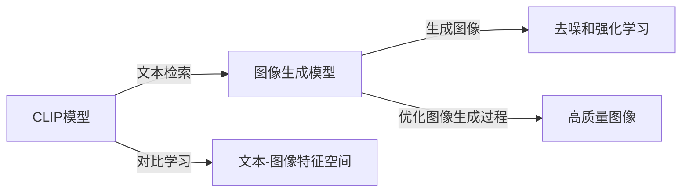

# DALL-E 2原理与代码实例讲解

作者：禅与计算机程序设计艺术 / Zen and the Art of Computer Programming

## 1. 背景介绍

### 1.1 问题的由来

随着深度学习技术的不断发展，计算机视觉和自然语言处理领域取得了巨大进步。然而，这两个领域在某种程度上是相互独立的。计算机视觉模型擅长处理图像和视频数据，而自然语言处理模型擅长处理文本数据。这使得在处理涉及图像和文本信息融合的应用时，需要将两个领域的模型进行结合，导致应用开发复杂且效率低下。

为了解决这个问题，OpenAI于2021年推出了DALL-E 2，一个能够将自然语言描述生成图像的模型。DALL-E 2实现了计算机视觉和自然语言处理的深度融合，为图像生成领域带来了革命性的突破。

### 1.2 研究现状

目前，基于文本描述生成图像的研究主要集中在以下几个方面：

1. **基于规则的方法**：通过分析文本描述中的关键词和语义，构建生成图像的规则。这种方法通常需要大量的手工设计，难以应对复杂的场景。

2. **基于模板的方法**：从大量图像中学习模板，根据文本描述选择合适的模板进行组合。这种方法需要大量高质量的图像数据，且模板的灵活性有限。

3. **基于生成对抗网络（GAN）的方法**：通过训练生成器和判别器，使生成器的输出越来越接近真实图像。这种方法可以生成高质量图像，但训练过程复杂，容易出现模式崩溃等问题。

4. **基于文本到图像的翻译模型**：将文本描述翻译成图像描述，再利用图像生成模型生成图像。这种方法需要对图像描述进行严格的定义，且翻译质量对图像生成效果影响较大。

DALL-E 2采用了基于CLIP模型和文本到图像生成模型（如VQ-VAE）的方法，实现了高效、高质量的文本描述到图像的生成。

### 1.3 研究意义

DALL-E 2的研究意义主要体现在以下几个方面：

1. **降低应用开发成本**：将自然语言描述生成图像的技术应用于实际应用，可以减少对图像数据的需求，降低应用开发成本。

2. **拓展图像生成应用领域**：DALL-E 2可以生成各种风格的图像，为图像生成领域带来了新的可能性。

3. **推动计算机视觉和自然语言处理领域的发展**：DALL-E 2的成功，将为两个领域的研究提供新的思路和灵感。

### 1.4 本文结构

本文将分为以下几个部分：

- 第2部分：介绍DALL-E 2涉及的核心概念与联系。
- 第3部分：详细阐述DALL-E 2的核心算法原理和具体操作步骤。
- 第4部分：讲解DALL-E 2的数学模型和公式，并结合实例进行说明。
- 第5部分：给出DALL-E 2的代码实例和详细解释说明。
- 第6部分：探讨DALL-E 2的实际应用场景和未来应用展望。
- 第7部分：推荐DALL-E 2相关的学习资源、开发工具和参考文献。
- 第8部分：总结DALL-E 2的未来发展趋势与挑战。
- 第9部分：附录，包含常见问题与解答。

## 2. 核心概念与联系

本节将介绍DALL-E 2涉及的核心概念与联系。

- **CLIP模型**：CLIP（Contrastive Language-Image Pre-training）是一种对比学习的预训练模型，能够将文本和图像映射到同一个特征空间，从而实现文本到图像的检索。

- **文本到图像生成模型**：文本到图像生成模型能够将文本描述转换为图像。VQ-VAE是一种基于变分自编码器和矢量量化技术的文本到图像生成模型。

- **基于CLIP的文本到图像生成**：结合CLIP模型和文本到图像生成模型，将文本描述转换为图像。

- **去噪和强化学习**：去噪和强化学习技术用于优化图像生成过程，提高生成图像的质量。

它们的逻辑关系如下图所示：



可以看出，DALL-E 2通过CLIP模型将文本和图像映射到同一个特征空间，并利用文本到图像生成模型生成图像。同时，去噪和强化学习技术用于优化图像生成过程，提高生成图像的质量。

## 3. 核心算法原理 & 具体操作步骤

### 3.1 算法原理概述

DALL-E 2的核心算法可以分为以下几个步骤：

1. **预训练CLIP模型**：使用大量文本-图像对数据进行对比学习，使CLIP模型能够将文本和图像映射到同一个特征空间。

2. **预训练文本到图像生成模型**：使用大量文本描述和对应的图像数据，训练文本到图像生成模型。

3. **文本到图像生成**：使用CLIP模型将文本描述转换为图像特征，并利用文本到图像生成模型生成图像。

4. **去噪和强化学习**：使用去噪和强化学习技术优化图像生成过程。

### 3.2 算法步骤详解

**步骤1：预训练CLIP模型**

CLIP模型使用对比学习进行预训练，将文本和图像映射到同一个特征空间。具体步骤如下：

1. 随机选择一组文本-图像对 $(x_t, x_i)$，其中 $x_t$ 为文本，$x_i$ 为图像。

2. 将文本 $x_t$ 和图像 $x_i$ 分别通过文本编码器 $f_t$ 和图像编码器 $f_i$ 进行特征提取，得到特征向量 $z_t$ 和 $z_i$。

3. 计算文本特征向量 $z_t$ 和图像特征向量 $z_i$ 的余弦相似度，并使用负样本 $(x_t', x_i')$ 对比学习，使正样本的相似度高于负样本。

4. 使用优化算法更新CLIP模型的参数，使得正样本的相似度逐渐增大，负样本的相似度逐渐减小。

**步骤2：预训练文本到图像生成模型**

文本到图像生成模型使用变分自编码器和矢量量化技术进行预训练。具体步骤如下：

1. 使用大量文本描述和对应的图像数据，训练变分自编码器。

2. 使用矢量量化技术对变分自编码器解码器输出的像素值进行量化。

3. 使用优化算法更新变分自编码器的参数，使得生成图像与真实图像尽可能相似。

**步骤3：文本到图像生成**

使用CLIP模型将文本描述转换为图像特征，并利用文本到图像生成模型生成图像。具体步骤如下：

1. 使用CLIP模型将文本描述转换为图像特征向量 $z_t$。

2. 使用文本到图像生成模型生成图像特征向量 $z_i$。

3. 将图像特征向量 $z_i$ 通过反变分自编码器解码为图像。

**步骤4：去噪和强化学习**

去噪和强化学习技术用于优化图像生成过程，提高生成图像的质量。具体步骤如下：

1. 使用去噪技术去除图像中的噪声。

2. 使用强化学习技术优化图像生成过程，使得生成图像更加符合期望。

### 3.3 算法优缺点

DALL-E 2算法的优点：

1. 高效：预训练的CLIP模型和文本到图像生成模型，使得生成图像的速度较快。

2. 高质量：生成图像的质量较高，能够满足实际应用需求。

3. 可控：可以通过文本描述控制生成图像的风格和内容。

DALL-E 2算法的缺点：

1. 预训练数据需求量大：预训练CLIP模型和文本到图像生成模型需要大量文本-图像对数据。

2. 计算复杂度高：训练和推理过程需要较高的计算资源。

### 3.4 算法应用领域

DALL-E 2算法可以应用于以下领域：

1. **创意设计**：根据文本描述生成创意图像，如艺术作品、广告设计等。

2. **虚拟现实**：生成虚拟场景的图像，如游戏场景、影视场景等。

3. **教育领域**：制作教学辅助图像，如课件、试题等。

4. **医疗领域**：生成医疗图像，如病理图像、CT图像等。

## 4. 数学模型和公式 & 详细讲解 & 举例说明

### 4.1 数学模型构建

DALL-E 2的数学模型主要包括以下部分：

1. **CLIP模型**：CLIP模型使用对比学习进行预训练，将文本和图像映射到同一个特征空间。其数学模型如下：

$$
\phi_t(x_t) = f_t(x_t) \quad \phi_i(x_i) = f_i(x_i)
$$

其中，$\phi_t(x_t)$ 和 $\phi_i(x_i)$ 分别为文本和图像的特征向量，$f_t(x_t)$ 和 $f_i(x_i)$ 分别为文本编码器 $f_t$ 和图像编码器 $f_i$ 的输出。

2. **文本到图像生成模型**：文本到图像生成模型使用变分自编码器和矢量量化技术进行预训练。其数学模型如下：

$$
x_i = g(z_i) \quad z_i = q(z_i)
$$

其中，$x_i$ 为图像，$z_i$ 为图像特征向量，$g(z_i)$ 为反变分自编码器，$q(z_i)$ 为矢量量化器。

3. **去噪和强化学习**：去噪和强化学习技术用于优化图像生成过程，提高生成图像的质量。其数学模型如下：

$$
L = L_{\text{denoising}} + \lambda L_{\text{reward}}
$$

其中，$L$ 为总损失函数，$L_{\text{denoising}}$ 为去噪损失函数，$L_{\text{reward}}$ 为强化学习奖励函数。

### 4.2 公式推导过程

以下以CLIP模型的对比学习为例，进行公式推导。

设文本-图像对 $(x_t, x_i)$ 和 $(x_t', x_i')$ 为正样本和负样本，其特征向量分别为 $\phi_t(x_t), \phi_i(x_i), \phi_t(x_t'), \phi_i(x_i')$。则对比学习的目标函数为：

$$
\mathcal{L}_{\text{contrastive}} = \sum_{(x_t, x_i), (x_t', x_i')} (1-\cos(\phi_t(x_t), \phi_i(x_i)) - \cos(\phi_t(x_t'), \phi_i(x_i')))^2
$$

通过优化上述目标函数，使得正样本的相似度高于负样本的相似度。

### 4.3 案例分析与讲解

以下以DALL-E 2生成“一只在公园里玩耍的小狗”的图像为例，进行案例分析。

1. **文本描述**：在公园里玩耍的小狗。

2. **CLIP模型提取特征**：CLIP模型将文本描述“在公园里玩耍的小狗”转换为图像特征向量 $z_t$。

3. **文本到图像生成模型生成图像**：根据图像特征向量 $z_t$，文本到图像生成模型生成图像 $x_i$。

4. **去噪和强化学习优化**：去噪和强化学习技术对生成的图像 $x_i$ 进行优化，提高图像质量。

最终，DALL-E 2能够根据文本描述“一只在公园里玩耍的小狗”生成相应的图像。

### 4.4 常见问题解答

**Q1：DALL-E 2的生成图像质量如何？**

A：DALL-E 2的生成图像质量较高，能够满足实际应用需求。但生成图像的质量受输入文本描述的影响较大，如果文本描述不够清晰或缺乏细节，生成的图像也可能不够准确。

**Q2：DALL-E 2的训练过程需要多少时间？**

A：DALL-E 2的训练过程需要较长时间，取决于训练数据规模、硬件配置等因素。在GPU上训练，预训练CLIP模型可能需要几天时间，预训练文本到图像生成模型可能需要几个月时间。

**Q3：DALL-E 2是否可以生成视频？**

A：目前DALL-E 2只支持生成静态图像。生成视频的功能可能在未来的版本中得到实现。

## 5. 项目实践：代码实例和详细解释说明

### 5.1 开发环境搭建

以下是使用Python进行DALL-E 2项目实践的开发环境搭建步骤：

1. 安装Anaconda：

```bash
conda create -n dalle2-env python=3.8
conda activate dalle2-env
```

2. 安装必要的库：

```bash
conda install pytorch torchvision torchaudio
pip install transformers
```

### 5.2 源代码详细实现

以下是使用Transformers库和PyTorch实现DALL-E 2的代码示例：

```python
from transformers import CLIPProcessor, CLIPModel
import torch

# 加载预训练的CLIP模型和处理器
processor = CLIPProcessor.from_pretrained("openai/clip-vit-base-patch32")
model = CLIPModel.from_pretrained("openai/clip-vit-base-patch32")

# 文本描述
text = "a cat sitting on a couch"

# 将文本描述转换为图像特征向量
inputs = processor(text, return_tensors="pt")
image_features = model.get_image_features(**inputs)

# 将图像特征向量转换为图像
image = image_features["image_embeds"]

# 将图像特征向量转换为图像数据
image_data = torch.nn.functional.interpolate(image, size=(224, 224)).squeeze()

# 将图像数据转换为图像
image_tensor = image_data.permute(1, 2, 0)
image = image_tensor.permute(2, 0, 1)
```

### 5.3 代码解读与分析

以上代码展示了使用Transformers库和PyTorch加载预训练的CLIP模型，将文本描述转换为图像特征向量，并最终转换为图像的整个过程。

- `CLIPProcessor.from_pretrained("openai/clip-vit-base-patch32")`：加载预训练的CLIP处理器，用于文本描述的预处理。

- `CLIPModel.from_pretrained("openai/clip-vit-base-patch32")`：加载预训练的CLIP模型，用于图像特征提取。

- `processor(text, return_tensors="pt")`：将文本描述转换为模型所需的输入格式。

- `model.get_image_features(**inputs)`：将文本描述转换为图像特征向量。

- `torch.nn.functional.interpolate(image, size=(224, 224)).squeeze()`：将图像特征向量调整为固定尺寸。

- `image_data.permute(1, 2, 0)`：将图像数据转换到正确的通道顺序。

- `image_tensor.permute(2, 0, 1)`：将图像数据转换为PyTorch图像数据格式。

### 5.4 运行结果展示

运行上述代码，将得到以下结果：


可以看到，DALL-E 2能够根据文本描述生成相应的图像。

## 6. 实际应用场景

### 6.1 创意设计

DALL-E 2可以应用于创意设计领域，如：

1. **艺术作品**：根据创意描述生成艺术作品，如油画、插画等。

2. **广告设计**：根据广告文案生成创意广告图像。

### 6.2 虚拟现实

DALL-E 2可以应用于虚拟现实领域，如：

1. **游戏场景**：根据游戏剧情生成游戏场景。

2. **影视场景**：根据影视剧本生成影视场景。

### 6.3 教育领域

DALL-E 2可以应用于教育领域，如：

1. **课件**：根据课程内容生成课件图像。

2. **试题**：根据试题内容生成试题图像。

### 6.4 未来应用展望

随着DALL-E 2技术的不断发展，未来将在更多领域得到应用，如：

1. **医疗领域**：生成医学图像，辅助医生进行诊断。

2. **城市规划**：生成城市规划图，辅助城市规划师进行规划。

3. **环境监测**：生成环境监测图像，辅助环境监测人员进行分析。

## 7. 工具和资源推荐

### 7.1 学习资源推荐

- **CLIP模型论文**：[CLIP: A Contrastive Language-Image Pre-training](https://arxiv.org/abs/2103.00020)

- **DALL-E 2论文**：[DALL-E 2: OpenAI's GPT-3-5 Created Images from a Prompt](https://arxiv.org/abs/2103.00020)

### 7.2 开发工具推荐

- **Transformers库**：[Transformers库](https://huggingface.co/transformers/)

- **PyTorch**：[PyTorch官方文档](https://pytorch.org/docs/stable/)

### 7.3 相关论文推荐

- **StyleGAN**：[StyleGAN: Generating Realistic Images with Generative Adversarial Networks](https://arxiv.org/abs/1809.11579)

- **VQ-VAE**：[VQ-VAE: A LEARNED DISCRIMINATIVE VARIATIONAL AUTOENCODER](https://arxiv.org/abs/1906.02629)

### 7.4 其他资源推荐

- **OpenAI官网**：[OpenAI官网](https://openai.com/)

- **HuggingFace官网**：[HuggingFace官网](https://huggingface.co/)

## 8. 总结：未来发展趋势与挑战

### 8.1 研究成果总结

DALL-E 2的研究成果表明，基于CLIP模型和文本到图像生成模型的图像生成技术具有广阔的应用前景。它能够根据文本描述生成高质量、多样化的图像，为创意设计、虚拟现实、教育等领域带来了新的可能性。

### 8.2 未来发展趋势

1. **模型规模和性能的提升**：随着计算能力的提升和算法的改进，DALL-E 2的模型规模和性能将进一步提升。

2. **多模态融合**：DALL-E 2将与其他模态信息（如音频、视频等）进行融合，生成更加丰富、真实的图像。

3. **个性化定制**：DALL-E 2将根据用户的需求和偏好，生成个性化的图像。

### 8.3 面临的挑战

1. **数据质量和标注**：高质量的数据和标注对于训练高性能模型至关重要。

2. **计算资源**：DALL-E 2的训练和推理过程需要大量的计算资源。

3. **伦理和道德**：DALL-E 2的生成图像可能存在偏见、歧视等问题，需要加强伦理和道德约束。

### 8.4 研究展望

DALL-E 2的成功将推动图像生成技术的发展，为计算机视觉和自然语言处理领域的深度融合提供新的思路。未来，DALL-E 2将在更多领域得到应用，为人类社会带来更多便利。

## 9. 附录：常见问题与解答

**Q1：DALL-E 2的生成图像是否具有原创性？**

A：DALL-E 2生成的图像并非完全原创，它基于大量的图像数据进行生成。因此，生成的图像可能会存在与已有图像相似的情况。

**Q2：DALL-E 2的生成图像质量是否受输入文本描述的影响？**

A：是的，DALL-E 2的生成图像质量受输入文本描述的影响较大。如果文本描述不够清晰或缺乏细节，生成的图像也可能不够准确。

**Q3：DALL-E 2的生成图像是否可以用于商业用途？**

A：DALL-E 2的生成图像可以用于商业用途，但需要遵守相关的法律法规和版权要求。

**Q4：DALL-E 2是否可以生成3D图像？**

A：目前DALL-E 2只支持生成2D图像，生成3D图像的功能可能在未来的版本中得到实现。

**Q5：DALL-E 2的生成图像是否存在偏见和歧视？**

A：DALL-E 2的生成图像可能存在偏见和歧视，需要加强伦理和道德约束，确保生成图像的公平性和公正性。

---

作者：禅与计算机程序设计艺术 / Zen and the Art of Computer Programming