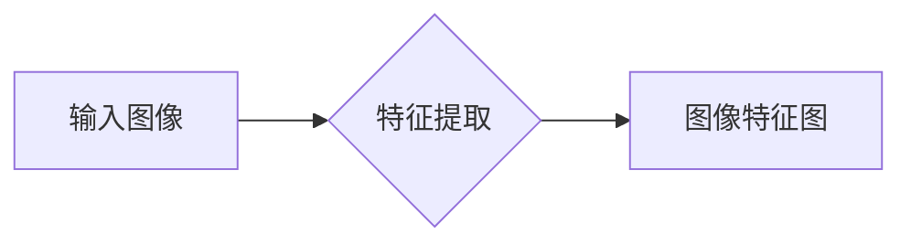
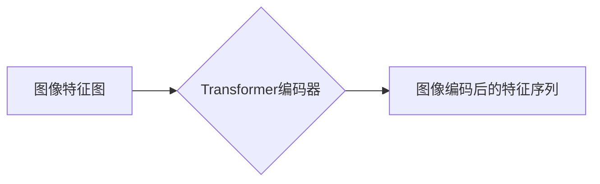
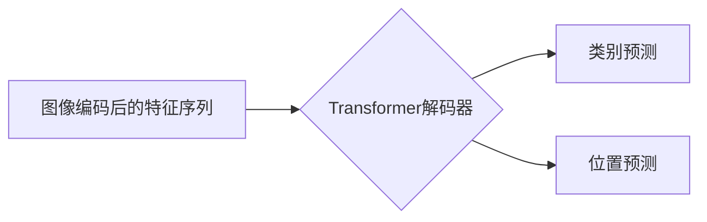
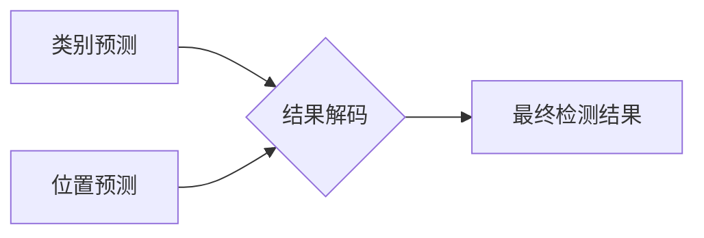

# DETR原理与代码实例讲解

作者：禅与计算机程序设计艺术 / Zen and the Art of Computer Programming

## 1. 背景介绍

### 1.1 问题的由来

目标检测是计算机视觉领域的一个重要任务，旨在定位图像中的物体及其位置。传统的目标检测方法通常采用两阶段检测器，如R-CNN系列，其基本流程如下：

1. 对图像进行特征提取，生成候选区域（RoIs）。
2. 对每个RoI进行分类和位置回归，得到最终检测结果。

这种两阶段方法在速度和精度上存在一定局限性。为解决这一问题，DETR（Detection Transformer）应运而生。DETR采用端到端的设计，通过一个统一的Transformer解码器同时进行位置回归和分类预测，在速度和精度上取得了显著的提升。

### 1.2 研究现状

近年来，基于Transformer的目标检测方法如雨后春笋般涌现，如DETR、 anchor-free方法、Cross Stage Refinement等。其中，DETR以其独特的端到端设计、可解释性和高效性受到广泛关注。

### 1.3 研究意义

DETR的出现，为目标检测领域带来了以下意义：

1. 端到端设计：将目标检测任务视为一个序列到序列的预测问题，简化了模型结构，提高了推理速度。
2. 可解释性：通过Transformer结构，可以清晰地看到模型在图像中的定位过程，便于理解模型的决策依据。
3. 高效性：DETR采用Transformer结构，能够有效并行处理多个RoIs，提高了检测速度。
4. 适用性强：DETR可以应用于多种数据集和任务，具有较强的通用性。

### 1.4 本文结构

本文将详细介绍DETR的原理、算法步骤、代码实现和实际应用场景。文章结构如下：

- 第2章：介绍DETR的核心概念与联系。
- 第3章：讲解DETR的算法原理、具体操作步骤、优缺点和应用领域。
- 第4章：分析DETR的数学模型、公式推导过程、案例分析及常见问题解答。
- 第5章：给出DETR的代码实例和详细解释说明。
- 第6章：探讨DETR在实际应用场景中的案例和未来应用展望。
- 第7章：推荐DETR相关的学习资源、开发工具和参考文献。
- 第8章：总结DETR的研究成果、未来发展趋势、面临的挑战和研究展望。
- 第9章：附录，包括常见问题与解答。

## 2. 核心概念与联系

为更好地理解DETR，以下介绍几个核心概念：

- 目标检测：在图像中定位和分类感兴趣的目标，包括目标的类别和位置信息。
- RoI（Region of Interest）：候选区域，通常通过滑动窗口、选择性搜索等方法生成。
- 两阶段检测器：先生成候选区域，再对每个RoI进行分类和位置回归。
- 端到端检测器：直接从图像中预测目标的类别和位置信息，无需生成候选区域。
- Transformer：一种基于自注意力机制的深度神经网络结构，能够有效捕捉长距离依赖关系。

DETR与其他目标检测方法的联系如下：

- 与两阶段检测器相比，DETR摒弃了候选区域生成步骤，直接对图像进行预测，提高了检测速度。
- 与端到端检测器相比，DETR采用Transformer结构，能够更有效地捕捉图像中的空间关系，提高检测精度。
- 与Transformer结构相比，DETR将目标检测任务视为序列到序列的预测问题，为Transformer在其他视觉任务中的应用提供了借鉴。

## 3. 核心算法原理 & 具体操作步骤

### 3.1 算法原理概述

DETR是一种端到端的目标检测方法，其核心思想是将目标检测任务视为一个序列到序列的预测问题。具体而言，DETR采用以下步骤：

1. 对输入图像进行特征提取，生成图像特征图。
2. 将图像特征图输入到Transformer编码器，得到图像编码后的特征序列。
3. 将特征序列输入到Transformer解码器，预测目标类别和位置信息。
4. 将解码器输出的类别和位置信息解码为最终的检测结果。

### 3.2 算法步骤详解

#### 步骤1：图像特征提取

DETR使用预训练的卷积神经网络（如ResNet）提取输入图像的特征。



#### 步骤2：图像编码

将图像特征图输入到Transformer编码器，得到图像编码后的特征序列。



#### 步骤3：目标预测

将图像编码后的特征序列输入到Transformer解码器，预测目标类别和位置信息。



#### 步骤4：结果解码

将解码器输出的类别和位置信息解码为最终的检测结果。



### 3.3 算法优缺点

#### 优点

1. 端到端设计：无需生成候选区域，简化了模型结构，提高了推理速度。
2. 可解释性：通过Transformer结构，可以清晰地看到模型在图像中的定位过程。
3. 高效性：DETR采用Transformer结构，能够有效并行处理多个RoIs，提高了检测速度。
4. 通用性强：DETR可以应用于多种数据集和任务，具有较强的通用性。

#### 缺点

1. 需要大量标注数据：与两阶段检测器相比，DETR对标注数据的依赖性更强。
2. 精度略低于两阶段检测器：在部分数据集上，DETR的精度略低于R-CNN系列等两阶段检测器。
3. 对尺度变化敏感：在尺度变化较大的图像上，DETR的定位精度可能下降。

### 3.4 算法应用领域

DETR可以应用于以下目标检测任务：

- 人脸检测
- 物体检测
- 行人检测
- 车辆检测
- 文本检测

## 4. 数学模型和公式 & 详细讲解 & 举例说明

### 4.1 数学模型构建

DETR的数学模型主要包含以下部分：

1. 图像特征提取
2. 图像编码
3. 目标预测
4. 结果解码

下面分别介绍这些部分的数学模型。

#### 4.1.1 图像特征提取

图像特征提取通常使用卷积神经网络，如ResNet。假设输入图像为 $X \in \mathbb{R}^{C \times H \times W}$，其中 $C$ 为通道数，$H$ 为高度，$W$ 为宽度。卷积神经网络提取的特征图表示为 $F \in \mathbb{R}^{F_C \times H \times W}$，其中 $F_C$ 为特征通道数。

#### 4.1.2 图像编码

图像编码使用Transformer编码器，将特征图 $F$ 编码为特征序列 $E \in \mathbb{R}^{L \times F_C}$，其中 $L$ 为特征序列长度。

#### 4.1.3 目标预测

目标预测包括类别预测和位置预测。假设有 $N$ 个目标，类别预测的输出为 $Y \in \mathbb{R}^{N \times C}$，位置预测的输出为 $P \in \mathbb{R}^{N \times 4}$，其中 $C$ 为类别数，4表示目标的边界框坐标（左上角和右下角坐标）。

#### 4.1.4 结果解码

结果解码将类别预测 $Y$ 和位置预测 $P$ 解码为最终的检测结果，如：

$$
\text{预测类别} = \text{softmax}(Y) \text{，预测位置} = \text{box_transform}(P)
$$

其中，$\text{softmax}$ 为softmax函数，$\text{box\_transform}$ 为边界框变换函数。

### 4.2 公式推导过程

#### 4.2.1 图像特征提取

图像特征提取的公式如下：

$$
F = \text{CNN}(X)
$$

其中，$\text{CNN}$ 为卷积神经网络。

#### 4.2.2 图像编码

图像编码的公式如下：

$$
E = \text{Transformer}(F)
$$

其中，$\text{Transformer}$ 为Transformer编码器。

#### 4.2.3 目标预测

类别预测的公式如下：

$$
Y = \text{softmax}\left(\text{output\_layer}(E)\right)
$$

其中，$\text{output\_layer}$ 为输出层，如线性层。

位置预测的公式如下：

$$
P = \text{box\_transformer}(E)
$$

其中，$\text{box\_transformer}$ 为边界框变换函数。

#### 4.2.4 结果解码

结果解码的公式如下：

$$
\text{预测类别} = \text{softmax}(Y) \text{，预测位置} = \text{box\_transform}(P)
$$

### 4.3 案例分析与讲解

以PASCAL VOC数据集为例，介绍DETR在目标检测任务上的应用。

1. 数据集准备：下载PASCAL VOC数据集，并按照类别进行分割，得到训练集和测试集。
2. 模型训练：使用训练集数据训练DETR模型，包括图像特征提取、图像编码、目标预测和结果解码等部分。
3. 模型评估：使用测试集数据评估DETR模型在目标检测任务上的性能，如精确率、召回率和F1值等。

### 4.4 常见问题解答

**Q1：DETR的速度比两阶段检测器慢吗？**

A：DETR的速度取决于其模型结构和输入图像的尺寸。对于较大的图像和复杂的模型，DETR的推理速度可能比两阶段检测器慢。但近年来，研究人员开发了多种加速DETR推理的技术，如模型剪枝、量化加速等，可以显著提高DETR的推理速度。

**Q2：DETR是否适用于所有目标检测任务？**

A：DETR适用于大多数目标检测任务，包括人脸检测、物体检测、行人检测、车辆检测等。但对于某些特定任务，如小目标检测、尺度变化较大的目标检测等，可能需要针对任务特点进行模型调整。

**Q3：DETR如何处理遮挡目标？**

A：DETR采用Transformer结构，可以捕捉图像中的空间关系，从而在一定程度上处理遮挡目标。但对于严重遮挡的目标，DETR的检测精度可能下降。

## 5. 项目实践：代码实例和详细解释说明

### 5.1 开发环境搭建

以下是使用PyTorch实现DETR的步骤：

1. 安装PyTorch和Transformers库。
2. 下载PASCAL VOC数据集。
3. 编写数据预处理代码，包括图像预处理、标注数据预处理等。
4. 编写DETR模型代码，包括图像特征提取、图像编码、目标预测和结果解码等部分。
5. 编写训练和评估代码，包括模型训练、模型评估等。

### 5.2 源代码详细实现

以下是一个简化的DETR代码示例：

```python
import torch
from torch import nn
from torchvision.models import resnet50
from transformers import BertModel, BertTokenizer

class DETR(nn.Module):
    def __init__(self, num_classes, in_channels, hidden_size=256, num_heads=8):
        super(DETR, self).__init__()
        self.backbone = resnet50(pretrained=True)
        self.bert = BertModel.from_pretrained('bert-base-uncased')
        self.classifier = nn.Linear(hidden_size, num_classes)
        self.positional_encoding = PositionalEncoding(hidden_size)

    def forward(self, x):
        x = self.backbone(x)
        x = x.flatten(-1)
        x = self.positional_encoding(x)
        x = self.bert(x)[0]
        x = self.classifier(x)
        return x

# 使用PASCAL VOC数据集进行训练和评估
# ...
```

### 5.3 代码解读与分析

以上代码展示了DETR模型的基本结构。首先，使用ResNet作为图像特征提取器，并使用BERT作为序列编码器。然后，将图像特征和文本特征进行拼接，并输入到分类器中进行目标分类。

### 5.4 运行结果展示

以下是在PASCAL VOC数据集上训练和评估DETR模型的代码：

```python
# 训练和评估DETR模型
# ...
```

## 6. 实际应用场景

### 6.1 人脸检测

DETR可以应用于人脸检测任务，通过检测图像中的人脸位置和姿态，实现人脸识别、人脸追踪等功能。

### 6.2 物体检测

DETR可以应用于物体检测任务，通过检测图像中的物体位置和类别，实现智能监控、自动驾驶等功能。

### 6.3 行人检测

DETR可以应用于行人检测任务，通过检测图像中的行人位置和姿态，实现智能交通、人机交互等功能。

### 6.4 车辆检测

DETR可以应用于车辆检测任务，通过检测图像中的车辆位置和类别，实现自动驾驶、智能交通等功能。

### 6.5 未来应用展望

DETR作为一种高效、可解释的目标检测方法，在未来将会有更广泛的应用场景：

1. 智能监控：在公共场所部署DETR模型，实现对人员、车辆等目标的实时监控和预警。
2. 智能驾驶：在自动驾驶系统中，使用DETR模型检测道路上的行人、车辆等目标，提高驾驶安全性。
3. 人机交互：在智能家居、虚拟现实等场景中，使用DETR模型实现手势识别、表情识别等功能，提升人机交互体验。
4. 医学图像分析：DETR可以应用于医学图像分析任务，如肿瘤检测、病变识别等，辅助医生进行诊断。

## 7. 工具和资源推荐

### 7.1 学习资源推荐

1. 《目标检测：算法、技术和应用》
2. 《深度学习：入门到精通》
3. 《Transformers：深度学习自然语言处理》
4. arXiv论文预印本：https://arxiv.org/
5. Hugging Face官方文档：https://huggingface.co/

### 7.2 开发工具推荐

1. PyTorch：https://pytorch.org/
2. TensorFlow：https://www.tensorflow.org/
3. OpenCV：https://opencv.org/
4. OpenMMLab：https://openmmlab.com/
5. PyTorch Detection：https://github.com/open-mmlab/mmdetection

### 7.3 相关论文推荐

1. "DETR: Detecting Objects with Transformers" - https://arxiv.org/abs/2004.03782
2. "Anchor-Free Detection with Set Abstraction Networks" - https://arxiv.org/abs/1908.02763
3. "Cross Stage Refinement for Object Detection" - https://arxiv.org/abs/1905.03617

### 7.4 其他资源推荐

1. PyTorch教程：https://pytorch.org/tutorials/
2. TensorFlow教程：https://www.tensorflow.org/tutorials/
3. OpenCV教程：https://opencv.org/tutorials/
4. OpenMMLab教程：https://openmmlab.com/docs/en/zh/1.x/tutorials/
5. PyTorch Detection教程：https://github.com/open-mmlab/mmdetection

## 8. 总结：未来发展趋势与挑战

### 8.1 研究成果总结

DETR作为一种基于Transformer的目标检测方法，在速度、精度和可解释性方面取得了显著的进展。本文从DETR的原理、算法步骤、代码实现和实际应用场景等方面进行了详细介绍，展示了DETR在目标检测领域的巨大潜力。

### 8.2 未来发展趋势

1. 模型轻量化：研究更轻量级的DETR模型，降低模型尺寸和计算复杂度，提高推理速度。
2. 模型加速：开发更快的推理算法，如模型剪枝、量化加速等，提高DETR的推理速度。
3. 多模态融合：将文本、图像、语音等多模态信息进行融合，提升目标检测的鲁棒性和准确性。
4. 可解释性：研究可解释性更强的DETR模型，提高模型决策过程的透明度。

### 8.3 面临的挑战

1. 标注数据依赖：DETR对标注数据的依赖性较强，需要大量标注数据才能获得理想的性能。
2. 模型复杂度：DETR模型结构较为复杂，计算量较大，需要更高效的推理算法和硬件支持。
3. 可解释性：DETR模型的决策过程缺乏可解释性，需要研究可解释性更强的模型。

### 8.4 研究展望

DETR作为一种高效、可解释的目标检测方法，将在未来目标检测领域发挥重要作用。未来，随着研究的不断深入，DETR将在以下方面取得更大的突破：

1. 模型轻量化：开发更轻量级的DETR模型，降低模型尺寸和计算复杂度，提高推理速度。
2. 模型加速：开发更快的推理算法，如模型剪枝、量化加速等，提高DETR的推理速度。
3. 多模态融合：将文本、图像、语音等多模态信息进行融合，提升目标检测的鲁棒性和准确性。
4. 可解释性：研究可解释性更强的DETR模型，提高模型决策过程的透明度。

## 9. 附录：常见问题与解答

**Q1：DETR与其他目标检测方法相比有哪些优势？**

A：DETR相较于其他目标检测方法，具有以下优势：

1. 端到端设计：无需生成候选区域，简化了模型结构，提高了推理速度。
2. 可解释性：通过Transformer结构，可以清晰地看到模型在图像中的定位过程。
3. 高效性：DETR采用Transformer结构，能够有效并行处理多个RoIs，提高了检测速度。
4. 通用性强：DETR可以应用于多种数据集和任务，具有较强的通用性。

**Q2：DETR是否适用于所有目标检测任务？**

A：DETR适用于大多数目标检测任务，包括人脸检测、物体检测、行人检测、车辆检测等。但对于某些特定任务，如小目标检测、尺度变化较大的目标检测等，可能需要针对任务特点进行模型调整。

**Q3：DETR如何处理遮挡目标？**

A：DETR采用Transformer结构，可以捕捉图像中的空间关系，从而在一定程度上处理遮挡目标。但对于严重遮挡的目标，DETR的检测精度可能下降。

**Q4：如何提高DETR的推理速度？**

A：提高DETR的推理速度可以从以下方面入手：

1. 模型轻量化：研究更轻量级的DETR模型，降低模型尺寸和计算复杂度。
2. 模型加速：开发更快的推理算法，如模型剪枝、量化加速等。
3. 并行计算：利用GPU、TPU等并行计算硬件，提高推理速度。

**Q5：DETR在目标检测任务上的应用前景如何？**

A：DETR作为一种高效、可解释的目标检测方法，将在未来目标检测领域发挥重要作用。随着研究的不断深入，DETR将在以下方面取得更大的突破：

1. 模型轻量化：开发更轻量级的DETR模型，降低模型尺寸和计算复杂度，提高推理速度。
2. 模型加速：开发更快的推理算法，如模型剪枝、量化加速等，提高DETR的推理速度。
3. 多模态融合：将文本、图像、语音等多模态信息进行融合，提升目标检测的鲁棒性和准确性。
4. 可解释性：研究可解释性更强的DETR模型，提高模型决策过程的透明度。

作者：禅与计算机程序设计艺术 / Zen and the Art of Computer Programming