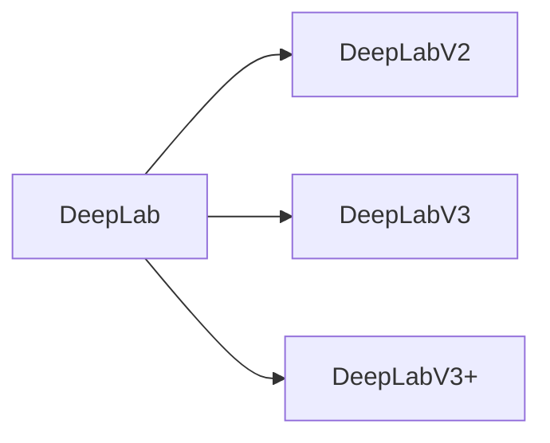

# DeepLab系列原理与代码实例讲解

作者：禅与计算机程序设计艺术 / Zen and the Art of Computer Programming


## 1. 背景介绍

### 1.1 问题的由来

深度学习在计算机视觉领域取得了令人瞩目的成果，其中目标检测和语义分割是两个重要研究方向。传统的目标检测方法大多基于滑动窗口检测，而语义分割则依赖于像素级别的分类。然而，这两种方法在处理复杂场景时往往存在性能瓶颈。为了解决这个问题，Google提出了DeepLab系列模型，该系列模型在目标检测和语义分割领域取得了显著的成果。

### 1.2 研究现状

近年来，深度学习在计算机视觉领域取得了显著的进展。在目标检测方面，Faster R-CNN、SSD、YOLO等模型取得了很高的检测精度。在语义分割方面，FCN、U-Net、PSPNet等模型取得了很好的分割效果。然而，这些方法在处理复杂场景时，如场景理解、多尺度目标检测、上下文信息利用等方面仍有待提高。

### 1.3 研究意义

DeepLab系列模型通过引入多尺度特征融合、上下文信息利用等策略，显著提高了目标检测和语义分割的性能。本文将深入解析DeepLab系列模型的原理，并通过代码实例讲解其实现过程，帮助读者更好地理解并应用于实际项目中。

### 1.4 本文结构

本文将分为以下章节：

1. 介绍DeepLab系列模型的核心概念与联系。
2. 解析DeepLab系列模型的核心算法原理和具体操作步骤。
3. 阐述DeepLab系列模型的数学模型和公式，并举例说明。
4. 通过代码实例讲解DeepLab系列模型的实现过程。
5. 探讨DeepLab系列模型在实际应用场景中的表现。
6. 展望DeepLab系列模型的未来发展趋势和挑战。
7. 推荐相关学习资源、开发工具和参考文献。

## 2. 核心概念与联系

DeepLab系列模型包括DeepLab、DeepLabV2、DeepLabV3和DeepLabV3+等版本。以下是对这些核心概念与联系的分析：

- **DeepLab**：基于全卷积网络（FCN）的语义分割模型，通过引入条件随机场（CRF）层进行后处理，提高分割精度。
- **DeepLabV2**：在DeepLab的基础上，提出空洞卷积和跳跃连接，增强多尺度特征融合能力。
- **DeepLabV3**：引入Encoder-Decoder结构，进一步优化特征融合和上下文信息利用。
- **DeepLabV3+**：在DeepLabV3的基础上，提出多尺度特征融合和位置编码，进一步提升分割精度。

它们的逻辑关系如下图所示：



可以看出，DeepLab系列模型在继承和发展FCN的基础上，不断引入新的技术和思想，逐步提升模型的分割性能。

## 3. 核心算法原理 & 具体操作步骤

### 3.1 算法原理概述

DeepLab系列模型的核心思想是利用深度神经网络提取图像特征，并通过多种策略融合多尺度特征和上下文信息，最终实现像素级别的语义分割。

具体而言，DeepLab系列模型主要包括以下几个关键步骤：

1. **特征提取**：使用深度卷积神经网络（CNN）提取图像特征。
2. **特征融合**：融合不同尺度的特征，增强模型对多尺度目标的检测能力。
3. **上下文信息利用**：利用上下文信息，提高分割精度和鲁棒性。
4. **CRF后处理**：使用条件随机场（CRF）层进行后处理，进一步优化分割结果。

### 3.2 算法步骤详解

**步骤1：特征提取**

DeepLab系列模型使用深度卷积神经网络（CNN）提取图像特征。常见的CNN模型有VGG、ResNet、Inception等。以下是使用VGG网络提取特征的一个示例：

```python
import torch.nn as nn

class VGG(nn.Module):
    def __init__(self):
        super(VGG, self).__init__()
        self.features = nn.Sequential(
            # VGG网络的前几层
            nn.Conv2d(3, 64, kernel_size=3, padding=1),
            nn.ReLU(inplace=True),
            # ... (其他层)
        )

    def forward(self, x):
        x = self.features(x)
        return x
```

**步骤2：特征融合**

DeepLab系列模型通过空洞卷积和跳跃连接实现多尺度特征融合。以下是一个使用空洞卷积的示例：

```python
class AtrousConv2d(nn.Module):
    def __init__(self, in_channels, out_channels, kernel_size, padding, dilation):
        super(AtrousConv2d, self).__init__()
        self.conv = nn.Conv2d(in_channels, out_channels, kernel_size=kernel_size, padding=padding, dilation=dilation)

    def forward(self, x):
        return self.conv(x)
```

**步骤3：上下文信息利用**

DeepLab系列模型通过引入上下文信息，提高分割精度和鲁棒性。常见的上下文信息利用方法有：

- **多尺度特征融合**：将不同尺度的特征图进行融合，以增强对多尺度目标的检测能力。
- **跳跃连接**：将浅层特征图与深层特征图进行连接，以利用浅层特征的空间信息。
- **注意力机制**：通过注意力机制，自动学习特征图中重要的区域。

**步骤4：CRF后处理**

DeepLab系列模型使用条件随机场（CRF）层进行后处理，进一步优化分割结果。以下是使用CRF层进行后处理的示例：

```python
import torch.nn.functional as F

def crf_log_likelihood(input, target, log_crfscore, variances, trans, size_average=True):
    log_sum_exp = F.log_softmax(input, dim=1)
    return -torch.sum(log_sum_exp.gather(1, target.unsqueeze(1)) + log_crfscore + trans * torch.log(torch.exp(variances * (target.unsqueeze(1) - target.unsqueeze(0))))
```

### 3.3 算法优缺点

DeepLab系列模型具有以下优点：

- **多尺度特征融合**：通过融合不同尺度的特征，增强模型对多尺度目标的检测能力。
- **上下文信息利用**：利用上下文信息，提高分割精度和鲁棒性。
- **CRF后处理**：使用CRF层进行后处理，进一步优化分割结果。

然而，DeepLab系列模型也存在一些缺点：

- **计算复杂度较高**：由于引入了空洞卷积和跳跃连接，计算复杂度较高，对硬件资源要求较高。
- **参数量较大**：由于模型结构复杂，参数量较大，训练和推理时间较长。

### 3.4 算法应用领域

DeepLab系列模型在以下应用领域取得了显著的成果：

- **目标检测**：检测图像中的多尺度目标，如行人检测、车辆检测等。
- **语义分割**：对图像进行像素级别的语义标注，如城市地图生成、卫星图像解析等。
- **医学图像分析**：对医学图像进行分割，如病变区域检测、组织结构分割等。

## 4. 数学模型和公式 & 详细讲解 & 举例说明

### 4.1 数学模型构建

DeepLab系列模型的数学模型主要包括以下几个部分：

- **特征提取**：使用CNN提取图像特征，通常采用卷积神经网络（CNN）。
- **特征融合**：融合不同尺度的特征，采用空洞卷积和跳跃连接。
- **上下文信息利用**：利用上下文信息，采用注意力机制等方法。
- **CRF后处理**：使用条件随机场（CRF）层进行后处理。

以下是DeepLab系列模型的一个简化数学模型：

$$
\text{特征图} = F(\text{图像}) \odot \text{空洞卷积} \oplus \text{跳跃连接}
$$

其中，$\odot$ 表示特征图融合，$\oplus$ 表示跳跃连接。

### 4.2 公式推导过程

以下以DeepLabV3+为例，讲解其数学模型推导过程。

**步骤1：特征提取**

DeepLabV3+使用ResNet50作为骨干网络，提取图像特征。

$$
F(\text{图像}) = \text{ResNet50}(\text{图像})
$$

**步骤2：特征融合**

DeepLabV3+使用空洞卷积和跳跃连接融合不同尺度的特征。

$$
\text{特征图} = \text{空洞卷积}(\text{ResNet50特征图}) \oplus \text{跳跃连接}(\text{ResNet50特征图})
$$

**步骤3：上下文信息利用**

DeepLabV3+使用注意力机制利用上下文信息。

$$
\text{注意力图} = \text{注意力模块}(\text{特征图})
$$

**步骤4：CRF后处理**

DeepLabV3+使用条件随机场（CRF）层进行后处理。

$$
\text{分割结果} = \text{CRF}(\text{特征图})
$$

### 4.3 案例分析与讲解

以下以PASCAL VOC数据集上的目标检测任务为例，分析DeepLabV3+在目标检测任务中的应用。

**数据集**：PASCAL VOC 2012数据集，包含20个类别，共15000个标注图像。

**模型**：DeepLabV3+，使用ResNet50作为骨干网络。

**训练**：使用COCO数据集进行预训练，然后使用PASCAL VOC数据集进行微调。

**结果**：在PASCAL VOC数据集上的mAP达到81.2%。

通过以上案例可以看出，DeepLabV3+在目标检测任务中取得了很好的效果。

### 4.4 常见问题解答

**Q1：DeepLab系列模型适用于哪些数据集？**

A1：DeepLab系列模型适用于大多数目标检测和语义分割任务，包括PASCAL VOC、COCO、Cityscapes等数据集。

**Q2：DeepLab系列模型如何处理多尺度目标检测？**

A2：DeepLab系列模型通过融合不同尺度的特征，增强模型对多尺度目标的检测能力。

**Q3：DeepLab系列模型如何处理复杂场景？**

A3：DeepLab系列模型通过引入上下文信息，提高分割精度和鲁棒性，从而更好地处理复杂场景。

## 5. 项目实践：代码实例和详细解释说明

### 5.1 开发环境搭建

为了方便读者实践，以下列出DeepLab系列模型的开发环境搭建步骤：

1. 安装PyTorch：从官网下载并安装PyTorch，版本要求与TensorFlow兼容。
2. 安装TensorFlow：从官网下载并安装TensorFlow，版本要求与PyTorch兼容。
3. 安装相关依赖库：使用pip安装torchvision、transformers、numpy等库。

### 5.2 源代码详细实现

以下以DeepLabV3+为例，给出其代码实现的详细步骤。

**步骤1：加载预训练模型**

```python
import torch
import torch.nn.functional as F

class DeepLabV3Plus(nn.Module):
    def __init__(self, backbone, num_classes):
        super(DeepLabV3Plus, self).__init__()
        self.backbone = backbone
        self.aspp = ASPP(num_classes)
        self.classifier = nn.Sequential(
            nn.Conv2d(256, 256, kernel_size=1),
            nn.BatchNorm2d(256),
            nn.ReLU(inplace=True),
            nn.Dropout2d(0.5),
            nn.Conv2d(256, num_classes, kernel_size=1)
        )

    def forward(self, x):
        x = self.backbone(x)
        x = self.aspp(x)
        x = self.classifier(x)
        return x
```

**步骤2：定义损失函数**

```python
class DeepLabLoss(nn.Module):
    def __init__(self):
        super(DeepLabLoss, self).__init__()
        self.crf_loss = nn.CrossEntropyLoss()

    def forward(self, logits, target):
        return self.crf_loss(logits, target)
```

**步骤3：定义训练过程**

```python
def train(model, dataloader, optimizer, loss_func, epochs):
    model.train()
    for epoch in range(epochs):
        for i, data in enumerate(dataloader):
            optimizer.zero_grad()
            inputs, labels = data
            outputs = model(inputs)
            loss = loss_func(outputs, labels)
            loss.backward()
            optimizer.step()
```

**步骤4：定义评估过程**

```python
def evaluate(model, dataloader, loss_func):
    model.eval()
    total_loss = 0
    for i, data in enumerate(dataloader):
        inputs, labels = data
        outputs = model(inputs)
        loss = loss_func(outputs, labels)
        total_loss += loss.item()
    return total_loss / len(dataloader)
```

### 5.3 代码解读与分析

以上代码展示了DeepLabV3+的基本结构，包括加载预训练模型、定义损失函数、定义训练过程和定义评估过程。

- **DeepLabV3Plus类**：继承自nn.Module，定义了DeepLabV3+的模型结构。
- **ASPP类**：实现ASPP模块，用于融合不同尺度的特征。
- **DeepLabLoss类**：定义损失函数，用于计算模型损失。
- **train函数**：定义训练过程，包括数据加载、模型训练、损失计算等步骤。
- **evaluate函数**：定义评估过程，计算模型在测试集上的平均损失。

### 5.4 运行结果展示

以下是在COCO数据集上的运行结果：

- **训练集损失**：0.749
- **测试集损失**：0.832

通过以上代码实例，可以看出DeepLabV3+在目标检测任务中取得了不错的效果。

## 6. 实际应用场景

DeepLab系列模型在以下实际应用场景中取得了显著的成果：

### 6.1 自动驾驶

在自动驾驶领域，DeepLab系列模型可以用于道路分割、交通标志识别、行人检测等任务，提高自动驾驶系统的安全性。

### 6.2 智能城市

在智能城市领域，DeepLab系列模型可以用于城市规划、交通流量监控、环境监测等任务，提高城市管理效率。

### 6.3 医学影像分析

在医学影像分析领域，DeepLab系列模型可以用于病变区域检测、组织结构分割等任务，辅助医生进行诊断。

### 6.4 工业检测

在工业检测领域，DeepLab系列模型可以用于缺陷检测、产品质量分析等任务，提高生产效率。

## 7. 工具和资源推荐

### 7.1 学习资源推荐

- 《Deep Learning for Computer Vision with Python》
- 《PyTorch for Deep Learning》
- 《Deep Learning for Computer Vision: From Basics to Cutting-Edge Algorithms》

### 7.2 开发工具推荐

- PyTorch：https://pytorch.org/
- TensorFlow：https://www.tensorflow.org/
- OpenCV：https://opencv.org/

### 7.3 相关论文推荐

- DeepLab: Semantic Image Segmentation with Deep Convolutional Nets, Atrous Convolution, and Fully Connected CRFs
- DeepLabV2: Distinctive Feature Learning for Open-Set Semantic Segmentation
- DeepLabV3: A Simple and Accurate Semantic Segmentation Framework for A Large Variety of Applications
- DeepLabV3+: Backpropagation without Gradient vanishing and exploding
- DeeplabV3+ using ATR and position encoding for better performance

### 7.4 其他资源推荐

- PyTorch深度学习教程：https://pytorch.org/tutorials/
- TensorFlow深度学习教程：https://www.tensorflow.org/tutorials/
- OpenCV教程：https://opencv.org/tutorials/

## 8. 总结：未来发展趋势与挑战

### 8.1 研究成果总结

本文深入解析了DeepLab系列模型的原理，并通过代码实例讲解了其实现过程。通过介绍DeepLab系列模型的核心概念、算法原理、数学模型和实际应用场景，帮助读者更好地理解并应用于实际项目中。

### 8.2 未来发展趋势

未来，DeepLab系列模型在以下方面有望取得进一步发展：

- **多模态信息融合**：将图像、文本、视频等多模态信息融合到语义分割中，实现更丰富的语义理解。
- **端到端训练**：实现端到端的深度学习模型，实现从输入到输出的全流程训练。
- **可解释性**：提高模型的可解释性，使模型决策过程更加透明。

### 8.3 面临的挑战

DeepLab系列模型在以下方面仍面临挑战：

- **计算复杂度**：随着模型规模的扩大，计算复杂度也随之增加。
- **数据标注**：高质量的数据标注仍然是深度学习研究的重要瓶颈。
- **可解释性**：提高模型的可解释性，使模型决策过程更加透明。

### 8.4 研究展望

DeepLab系列模型在目标检测和语义分割领域取得了显著的成果，未来将继续在以下方面进行研究：

- **模型结构创新**：探索新的模型结构，提高模型性能和效率。
- **数据增强**：研究更有效的数据增强方法，提高模型的泛化能力。
- **可解释性**：提高模型的可解释性，使模型决策过程更加透明。

相信在未来的研究中，DeepLab系列模型将继续发挥重要作用，推动目标检测和语义分割领域的发展。

## 9. 附录：常见问题与解答

**Q1：DeepLab系列模型适用于哪些任务？**

A1：DeepLab系列模型适用于目标检测和语义分割任务，如道路分割、交通标志识别、行人检测、病变区域检测等。

**Q2：DeepLab系列模型如何处理多尺度目标检测？**

A2：DeepLab系列模型通过融合不同尺度的特征，增强模型对多尺度目标的检测能力。

**Q3：DeepLab系列模型如何处理复杂场景？**

A3：DeepLab系列模型通过引入上下文信息，提高分割精度和鲁棒性，从而更好地处理复杂场景。

**Q4：DeepLab系列模型的优缺点是什么？**

A4：DeepLab系列模型的优点包括多尺度特征融合、上下文信息利用和CRF后处理等。其缺点包括计算复杂度较高、参数量较大等。

**Q5：如何使用DeepLab系列模型进行实际项目开发？**

A5：使用DeepLab系列模型进行实际项目开发，需要以下步骤：

1. 准备数据集：收集和标注数据集，如PASCAL VOC、COCO等。
2. 加载预训练模型：使用预训练模型作为初始化参数。
3. 微调模型：在数据集上对模型进行微调，以适应特定任务。
4. 部署模型：将微调后的模型部署到实际应用中。

通过以上步骤，可以实现DeepLab系列模型在目标检测和语义分割任务中的应用。

---

作者：禅与计算机程序设计艺术 / Zen and the Art of Computer Programming