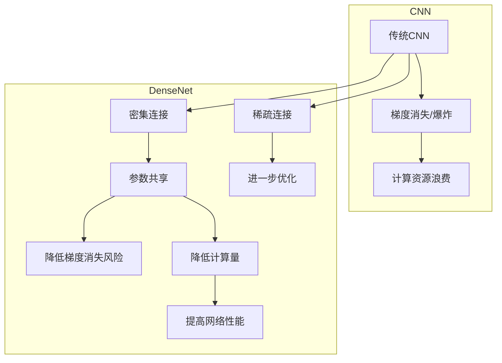

# DenseNet原理与代码实例讲解

作者：禅与计算机程序设计艺术 / Zen and the Art of Computer Programming


## 1. 背景介绍
### 1.1 问题的由来

随着深度学习的快速发展，卷积神经网络（Convolutional Neural Network, CNN）在图像识别、物体检测、图像分割等领域取得了显著的成果。然而，随着网络层数的不断增加，传统CNN模型面临着梯度消失和计算资源浪费的问题。为了解决这些问题，DenseNet应运而生。DenseNet通过引入密集连接机制，实现了参数共享，降低了梯度消失风险，提高了网络的性能和效率。

### 1.2 研究现状

DenseNet自2016年提出以来，已经在多个图像识别任务上取得了优异的性能，并在ImageNet竞赛中获得了冠军。随后，DenseNet在目标检测、图像分割、视频处理等领域也得到了广泛应用。

### 1.3 研究意义

DenseNet通过改进CNN的结构，为深度学习提供了新的思路和方法。它不仅提高了网络的性能，还降低了模型的复杂度和计算资源消耗，具有很高的研究价值和应用前景。

### 1.4 本文结构

本文将首先介绍DenseNet的核心概念和联系，然后详细阐述其原理和具体操作步骤，并通过代码实例进行讲解。最后，我们将探讨DenseNet的实际应用场景和未来发展趋势。

## 2. 核心概念与联系

在介绍DenseNet之前，我们需要了解以下几个核心概念：

- 卷积神经网络（CNN）：一种深度学习模型，用于图像识别、物体检测等任务。
- 梯度消失和梯度爆炸：在深层网络中，梯度在反向传播过程中会逐渐消失或爆炸，导致网络难以学习到有效的参数。
- 参数共享：通过共享权重，减少模型参数数量，降低计算量和存储需求。

DenseNet通过以下方式解决了传统CNN模型的问题：

- 密集连接：将网络中的每一层都连接到所有后续层，实现参数共享，降低梯度消失风险。
- 稀疏连接：在网络中添加稀疏连接，进一步提高网络的性能。

它们的逻辑关系如下所示：



可以看出，DenseNet通过改进CNN结构，实现了参数共享，降低了梯度消失风险，提高了网络的性能和效率。

## 3. 核心算法原理 & 具体操作步骤
### 3.1 算法原理概述

DenseNet的核心思想是将网络中的每一层都连接到所有后续层，实现参数共享。这样，每一层都能够利用前面所有层的特征，从而提高网络的性能。

DenseNet的网络结构如下：

```
input -> (Conv -> BN -> ReLU) -> (Dense -> BN -> ReLU) -> (Dense -> BN -> ReLU) -> ... -> (Dense -> BN) -> output
```

其中，Conv表示卷积层，BN表示批归一化层，ReLU表示ReLU激活函数，Dense表示密集连接层。

### 3.2 算法步骤详解

DenseNet的具体操作步骤如下：

1. 输入：输入原始图像数据。
2. 卷积层：对输入图像进行卷积操作，提取特征。
3. 批归一化层：对卷积层的输出进行批归一化，提高网络稳定性。
4. ReLU激活函数：对批归一化层的输出进行ReLU激活，引入非线性关系。
5. 密集连接层：将当前层的输出连接到所有后续层，实现参数共享。
6. 重复步骤3-5，直至网络末端。
7. 输出层：对网络的最终输出进行分类或回归。

### 3.3 算法优缺点

DenseNet的优点如下：

- 参数共享：降低了模型参数数量，减少了计算量和存储需求。
- 降低梯度消失风险：通过密集连接机制，提高了网络的性能。
- 提高网络性能：在多个图像识别任务上取得了优异的性能。

DenseNet的缺点如下：

- 计算复杂度较高：密集连接增加了网络的计算复杂度。
- 网络结构复杂：DenseNet的网络结构比传统CNN复杂，难以理解。

### 3.4 算法应用领域

DenseNet在以下领域得到了广泛应用：

- 图像识别：在多个图像识别任务上取得了优异的性能。
- 物体检测：在目标检测任务中，DenseNet能够有效地检测出图像中的物体。
- 图像分割：在图像分割任务中，DenseNet能够准确地分割出图像中的物体和区域。

## 4. 数学模型和公式 & 详细讲解 & 举例说明
### 4.1 数学模型构建

DenseNet的数学模型如下：

$$
h_l = f(x_l, \theta_{l-1})
$$

其中，$h_l$ 表示第 $l$ 层的特征，$x_l$ 表示第 $l$ 层的输入，$\theta_{l-1}$ 表示第 $l-1$ 层的参数，$f$ 表示密集连接函数。

### 4.2 公式推导过程

DenseNet的公式推导过程如下：

1. 输入层：$x_0 = x$
2. 第 $l$ 层的输入为 $x_l = h_{l-1}$
3. 第 $l$ 层的特征为 $h_l = f(x_l, \theta_{l-1})$

其中，$f$ 为：

$$
f(x_l, \theta_{l-1}) = W_l \cdot x_l + b_l
$$

其中，$W_l$ 为权重矩阵，$b_l$ 为偏置项。

### 4.3 案例分析与讲解

以下是一个简单的DenseNet模型示例：

```
input -> (Conv -> BN -> ReLU) -> (Dense -> BN -> ReLU) -> (Dense -> BN) -> output
```

在这个例子中，输入层输入原始图像数据，经过卷积层提取特征，然后进行批归一化和ReLU激活。接着，将卷积层的输出连接到密集连接层，实现参数共享。最后，将密集连接层的输出连接到输出层，进行分类或回归。

### 4.4 常见问题解答

**Q1：DenseNet的密集连接是什么意思？**

A：DenseNet的密集连接是指将网络中的每一层都连接到所有后续层，实现参数共享。

**Q2：DenseNet为什么能够降低梯度消失风险？**

A：DenseNet通过密集连接机制，使得每一层都能够利用前面所有层的特征，从而降低了梯度消失风险。

**Q3：DenseNet和传统CNN相比有哪些优势？**

A：DenseNet相比传统CNN具有以下优势：
1. 参数共享：降低了模型参数数量，减少了计算量和存储需求。
2. 降低梯度消失风险：通过密集连接机制，提高了网络的性能。

## 5. 项目实践：代码实例和详细解释说明
### 5.1 开发环境搭建

在进行DenseNet实践之前，我们需要搭建以下开发环境：

1. 安装Python 3.6及以上版本。
2. 安装PyTorch 1.0及以上版本。
3. 安装TensorFlow 2.0及以上版本（可选）。

### 5.2 源代码详细实现

以下是一个简单的DenseNet模型实现：

```python
import torch
import torch.nn as nn

class DenseNet(nn.Module):
    def __init__(self, growth_rate, block_num):
        super(DenseNet, self).__init__()
        # 第一层卷积
        self.conv1 = nn.Conv2d(3, 64, kernel_size=3, stride=1, padding=1)
        # Dense块
        self.dense_blocks = nn.Sequential(
            *[
                nn.Sequential(
                    nn.BatchNorm2d(64 + i * growth_rate, momentum=0.9),
                    nn.ReLU(inplace=True),
                    nn.Conv2d(64 + i * growth_rate, growth_rate, kernel_size=3, stride=1, padding=1),
                )
                for i in range(block_num)
            ]
        )
        self.conv2 = nn.Conv2d(64 + block_num * growth_rate, 64, kernel_size=1, stride=1)

    def forward(self, x):
        out = self.conv1(x)
        out = self.dense_blocks(out)
        out = self.conv2(out)
        return out
```

在这个例子中，我们定义了一个DenseNet模型，其中growth_rate表示每层增加的通道数，block_num表示Dense块的数量。

### 5.3 代码解读与分析

在这个DenseNet模型中，我们首先定义了一个卷积层conv1，用于提取图像特征。然后定义了一个Dense块，其中包含了多个Dense层。Dense层由BatchNorm、ReLU和卷积层组成，用于增加通道数。最后，定义了一个卷积层conv2，用于将Dense块的输出压缩到64个通道。

### 5.4 运行结果展示

以下是一个简单的测试代码：

```python
import torch.optim as optim

model = DenseNet(growth_rate=32, block_num=8)
criterion = nn.CrossEntropyLoss()
optimizer = optim.SGD(model.parameters(), lr=0.01)

# 假设x是输入数据，y是标签
optimizer.zero_grad()
output = model(x)
loss = criterion(output, y)
loss.backward()
optimizer.step()
```

在这个例子中，我们定义了一个DenseNet模型，并使用交叉熵损失函数进行训练。

## 6. 实际应用场景
### 6.1 图像识别

DenseNet在图像识别任务中取得了优异的性能。以下是一些常见的应用场景：

- 通用图像识别：对图像进行分类，如猫狗识别、交通工具识别等。
- 特征提取：提取图像特征，用于其他任务，如目标检测、图像分割等。

### 6.2 物体检测

DenseNet在物体检测任务中也取得了很好的效果。以下是一些常见的应用场景：

- 检测图像中的物体：检测图像中的物体类别和位置，如YOLO、SSD等。
- 实时物体检测：在实时视频流中检测物体，如R-CNN、Faster R-CNN等。

### 6.3 图像分割

DenseNet在图像分割任务中也表现出色。以下是一些常见的应用场景：

- 基于深度学习的语义分割：对图像中的每个像素进行分类，如FCN、U-Net等。
- 基于深度学习的实例分割：对图像中的每个实例进行分割，如Mask R-CNN、实例分割等。

### 6.4 未来应用展望

随着DenseNet等深度学习模型的发展，未来在图像识别、物体检测、图像分割等领域的应用将会更加广泛。以下是一些未来应用展望：

- 更高的性能：通过改进模型结构和优化算法，提高模型在各个领域的性能。
- 更快的速度：通过模型压缩和加速技术，提高模型的运行速度。
- 更低的功耗：通过模型压缩和低功耗设计，降低模型的功耗。

## 7. 工具和资源推荐
### 7.1 学习资源推荐

以下是一些学习DenseNet的资源推荐：

- 《深度学习》（Goodfellow等著）：介绍了深度学习的基本概念和经典模型，包括DenseNet。
- PyTorch官方文档：提供了PyTorch框架的详细文档，包括DenseNet的代码示例。
- TensorFlow官方文档：提供了TensorFlow框架的详细文档，包括DenseNet的代码示例。

### 7.2 开发工具推荐

以下是一些用于DenseNet开发的工具推荐：

- PyTorch：开源的深度学习框架，支持DenseNet的代码实现。
- TensorFlow：开源的深度学习框架，支持DenseNet的代码实现。
- Keras：基于TensorFlow的开源深度学习库，支持DenseNet的代码实现。

### 7.3 相关论文推荐

以下是一些关于DenseNet的论文推荐：

- DenseNet: Implementing Dense Connectives Between Layers of Convolutional Networks
- Aggregated Channel Attention for Squeeze-and-Excitation Networks

### 7.4 其他资源推荐

以下是一些其他资源推荐：

- GitHub：DenseNet的开源代码和实现。
- arXiv：DenseNet的相关论文。

## 8. 总结：未来发展趋势与挑战
### 8.1 研究成果总结

本文介绍了DenseNet的核心概念、原理、操作步骤、代码实例和实际应用场景。通过介绍，我们可以看到DenseNet在深度学习领域的广泛应用和巨大潜力。

### 8.2 未来发展趋势

未来，DenseNet将会在以下方面得到进一步发展：

- 模型结构优化：通过改进模型结构，提高模型性能和效率。
- 模型压缩：通过模型压缩技术，减小模型大小，提高模型运行速度。
- 跨模态学习：通过跨模态学习技术，使DenseNet能够处理多种模态的数据。

### 8.3 面临的挑战

DenseNet在发展过程中也面临着一些挑战：

- 模型复杂度：随着模型结构的复杂化，模型的计算量和存储需求也会增加。
- 模型解释性：如何提高模型的解释性，使其更易于理解。

### 8.4 研究展望

未来，DenseNet将会在以下方面进行深入研究：

- 模型结构优化：通过改进模型结构，提高模型性能和效率。
- 模型压缩：通过模型压缩技术，减小模型大小，提高模型运行速度。
- 跨模态学习：通过跨模态学习技术，使DenseNet能够处理多种模态的数据。

## 9. 附录：常见问题与解答

**Q1：DenseNet和传统CNN相比有哪些优缺点？**

A：DenseNet相比传统CNN具有以下优点：
1. 参数共享：降低了模型参数数量，减少了计算量和存储需求。
2. 降低梯度消失风险：通过密集连接机制，提高了网络的性能。

缺点：
1. 计算复杂度较高：密集连接增加了网络的计算复杂度。
2. 网络结构复杂：DenseNet的网络结构比传统CNN复杂，难以理解。

**Q2：DenseNet的密集连接是什么意思？**

A：DenseNet的密集连接是指将网络中的每一层都连接到所有后续层，实现参数共享。

**Q3：DenseNet为什么能够降低梯度消失风险？**

A：DenseNet通过密集连接机制，使得每一层都能够利用前面所有层的特征，从而降低了梯度消失风险。

**Q4：DenseNet在哪些领域得到了应用？**

A：DenseNet在以下领域得到了广泛应用：
1. 图像识别
2. 物体检测
3. 图像分割

**Q5：DenseNet的未来发展趋势是什么？**

A：未来，DenseNet将会在以下方面得到进一步发展：
1. 模型结构优化
2. 模型压缩
3. 跨模态学习