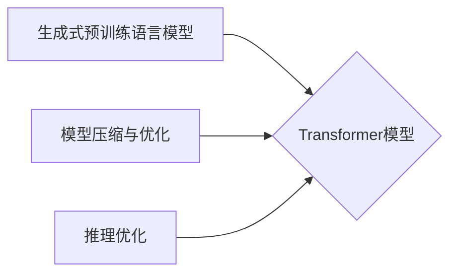
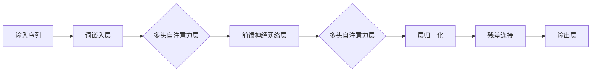

# GPT-3.5原理与代码实例讲解

作者：禅与计算机程序设计艺术 / Zen and the Art of Computer Programming

## 1. 背景介绍
### 1.1 问题的由来

自2018年GPT-1发布以来，自然语言处理（NLP）领域经历了翻天覆地的变化。GPT系列模型以其卓越的文本生成能力，在诗歌、代码、翻译、问答等多个领域展现出惊人的表现。然而，GPT-3虽然取得了令人瞩目的成就，但其庞大的模型规模也带来了巨大的计算和存储成本。为了解决这个问题，OpenAI于2020年推出了GPT-3.5，在保持GPT-3强大能力的同时，通过模型压缩和优化技术，大幅降低了计算和存储成本。

### 1.2 研究现状

近年来，NLP领域的研究热点主要集中在以下几个方面：

1. **大规模预训练语言模型**：如GPT-3、BERT、T5等，通过海量文本数据预训练，学习丰富的语言知识，在多个NLP任务上取得了优异的性能。

2. **模型压缩与优化**：通过模型裁剪、量化、剪枝等手段，降低模型规模和计算复杂度，实现模型的轻量级化。

3. **可解释性和鲁棒性**：研究模型的可解释性和鲁棒性，提高模型的可信度和安全性。

4. **多模态融合**：将文本、图像、语音等多模态信息融合，构建更加智能的模型。

### 1.3 研究意义

GPT-3.5的研究具有以下重要意义：

1. **降低成本**：GPT-3.5在保持高性能的同时，大幅降低了计算和存储成本，使得更多研究者和企业能够利用大模型进行NLP研究。

2. **扩展应用场景**：GPT-3.5的轻量化特性，使得其能够应用于移动设备、边缘计算等场景，拓展NLP技术的应用范围。

3. **推动NLP技术发展**：GPT-3.5的研究成果，为NLP领域的技术发展提供了新的思路和方向。

### 1.4 本文结构

本文将围绕GPT-3.5的原理、技术细节、代码实例等方面展开，旨在帮助读者全面了解GPT-3.5的核心技术和应用场景。

## 2. 核心概念与联系

为了更好地理解GPT-3.5，我们首先需要了解以下几个核心概念：

1. **生成式预训练语言模型**：GPT-3.5属于生成式预训练语言模型，其核心思想是学习语言序列的生成规律，从而生成具有自然语言特性的文本。

2. **Transformer模型**：GPT-3.5采用Transformer模型作为其基础架构，Transformer模型是一种基于自注意力机制的深度神经网络模型，能够捕捉输入序列中长距离依赖关系。

3. **模型压缩与优化**：GPT-3.5通过模型裁剪、量化、剪枝等手段，降低模型规模和计算复杂度。

4. **推理优化**：GPT-3.5通过优化推理算法、硬件加速等技术，提高模型的推理速度。

它们的逻辑关系如下所示：



可以看出，GPT-3.5以Transformer模型为基础，通过模型压缩与优化和推理优化技术，实现了轻量化、高性能的文本生成能力。

## 3. 核心算法原理 & 具体操作步骤
### 3.1 算法原理概述

GPT-3.5的核心算法原理可以概括为以下三个步骤：

1. **预训练**：在大量无标注文本语料上，通过自回归任务学习语言序列的生成规律。

2. **微调**：在下游任务的有标签数据上，通过有监督学习进一步优化模型参数。

3. **推理**：根据输入文本，通过自回归任务生成相应的输出文本。

### 3.2 算法步骤详解

**步骤一：预训练**

预训练阶段，GPT-3.5在大量无标注文本语料上，通过自回归任务学习语言序列的生成规律。具体步骤如下：

1. 将文本分割成固定长度的序列。

2. 对每个序列进行标记，将序列的第一个token标记为特殊起始token，最后一个token标记为特殊结束token。

3. 对于每个序列，根据前一个token预测下一个token，并计算预测概率。

4. 使用负采样技术，通过对比真实token和负样本token，计算损失函数。

5. 利用梯度下降算法，根据损失函数更新模型参数。

**步骤二：微调**

微调阶段，GPT-3.5在下游任务的有标签数据上，通过有监督学习进一步优化模型参数。具体步骤如下：

1. 将有标签数据分为训练集和验证集。

2. 对于每个训练样本，根据前一个token预测下一个token，并计算预测概率。

3. 使用交叉熵损失函数计算损失函数。

4. 利用梯度下降算法，根据损失函数更新模型参数。

**步骤三：推理**

推理阶段，GPT-3.5根据输入文本，通过自回归任务生成相应的输出文本。具体步骤如下：

1. 将输入文本分割成固定长度的序列。

2. 对于每个序列，从特殊起始token开始，根据前一个token预测下一个token，并计算预测概率。

3. 根据预测概率，选择概率最大的token作为下一个token。

4. 重复步骤2和3，直至生成特殊结束token或达到最大序列长度。

### 3.3 算法优缺点

**优点**：

1. **强大的语言理解能力**：GPT-3.5通过预训练和微调，学习到了丰富的语言知识，能够生成具有自然语言特性的文本。

2. **灵活的推理能力**：GPT-3.5可以根据输入文本生成对应的输出文本，具有很高的灵活性。

3. **可解释性**：GPT-3.5的推理过程可以通过计算概率分布来解释，具有一定的可解释性。

**缺点**：

1. **计算和存储成本高**：GPT-3.5需要大量的计算和存储资源。

2. **过拟合风险**：由于模型规模较大，GPT-3.5容易过拟合训练数据。

3. **偏见和误导**：GPT-3.5可能学习到训练数据中的偏见和误导性信息。

### 3.4 算法应用领域

GPT-3.5在以下领域具有广泛的应用：

1. **文本生成**：如诗歌、小说、代码、文章等。

2. **机器翻译**：将一种语言翻译成另一种语言。

3. **问答系统**：根据用户的问题，给出相应的答案。

4. **对话系统**：与用户进行自然语言对话。

5. **摘要生成**：将长文本压缩成简短摘要。

## 4. 数学模型和公式 & 详细讲解 & 举例说明
### 4.1 数学模型构建

GPT-3.5的核心数学模型是Transformer模型，下面我们介绍Transformer模型的基本原理和公式。

**Transformer模型**：

Transformer模型是一种基于自注意力机制的深度神经网络模型，能够捕捉输入序列中长距离依赖关系。其基本结构如下：



**词嵌入层**：

词嵌入层将输入序列中的每个token转换为固定长度的向量表示。常用的词嵌入方法包括Word2Vec、GloVe等。

**多头自注意力层**：

多头自注意力层由多个自注意力层组成，能够捕捉输入序列中长距离依赖关系。其计算公式如下：

$$
\text{Attention}(Q, K, V) = \text{softmax}(\frac{QK^T}{\sqrt{d_k}})V
$$

其中，$Q$、$K$、$V$ 分别代表查询向量、键向量、值向量，$d_k$ 为注意力机制的维度。

**前馈神经网络层**：

前馈神经网络层由两个全连接层组成，用于进一步提取特征。

**层归一化**：

层归一化层用于对每一层的输出进行归一化，防止梯度消失和梯度爆炸。

**残差连接**：

残差连接层用于解决深度网络中的梯度消失问题。

**输出层**：

输出层通常是一个全连接层，将特征向量映射到输出空间。

### 4.2 公式推导过程

以下我们以多头自注意力层为例，推导其计算公式。

假设输入序列长度为 $n$，词嵌入层将每个token转换为 $d$ 维的向量表示。在多头自注意力层中，我们将输入序列分解为 $h$ 个子序列，每个子序列的长度为 $\frac{n}{h}$。

对于每个子序列，我们分别计算其查询向量 $Q_i$、键向量 $K_i$ 和值向量 $V_i$：

$$
Q_i = W_Q Q_{\text{input}}
$$

$$
K_i = W_K K_{\text{input}}
$$

$$
V_i = W_V V_{\text{input}}
$$

其中，$W_Q$、$W_K$、$W_V$ 分别为权重矩阵。

然后，计算注意力权重：

$$
A_i = \text{softmax}(\frac{(Q_iK_i^T)}{\sqrt{d_k}})
$$

最后，计算注意力机制输出：

$$
H_i = A_iV_i
$$

### 4.3 案例分析与讲解

以下我们以一个简单的GPT-3.5模型为例，演示如何使用PyTorch实现Transformer模型。

```python
import torch
import torch.nn as nn
import torch.nn.functional as F

class Transformer(nn.Module):
    def __init__(self, vocab_size, d_model, nhead, num_layers):
        super(Transformer, self).__init__()
        self.embedding = nn.Embedding(vocab_size, d_model)
        self.transformer = nn.Transformer(d_model, nhead, num_layers)
        self.fc = nn.Linear(d_model, vocab_size)

    def forward(self, x):
        x = self.embedding(x)
        x = self.transformer(x)
        x = self.fc(x)
        return x

# 实例化模型
model = Transformer(vocab_size=10000, d_model=512, nhead=8, num_layers=12)
```

以上代码展示了如何使用PyTorch实现一个简单的GPT-3.5模型。模型包含词嵌入层、Transformer模型和输出层。

### 4.4 常见问题解答

**Q1：什么是词嵌入？**

A：词嵌入是将单词转换为固定长度的向量表示，用于捕捉单词的语义信息。

**Q2：什么是注意力机制？**

A：注意力机制是一种机制，能够使模型关注输入序列中与当前token相关的部分。

**Q3：什么是残差连接？**

A：残差连接是一种网络结构，通过添加输入序列的直接映射来缓解深度网络中的梯度消失问题。

## 5. 项目实践：代码实例和详细解释说明
### 5.1 开发环境搭建

在进行GPT-3.5的项目实践前，我们需要准备好开发环境。以下是使用Python进行PyTorch开发的环境配置流程：

1. 安装Anaconda：从官网下载并安装Anaconda，用于创建独立的Python环境。

2. 创建并激活虚拟环境：
```bash
conda create -n pytorch-env python=3.8
conda activate pytorch-env
```

3. 安装PyTorch：根据CUDA版本，从官网获取对应的安装命令。例如：
```bash
conda install pytorch torchvision torchaudio cudatoolkit=11.1 -c pytorch -c conda-forge
```

4. 安装Transformers库：
```bash
pip install transformers
```

5. 安装各类工具包：
```bash
pip install numpy pandas scikit-learn matplotlib tqdm jupyter notebook ipython
```

完成上述步骤后，即可在`pytorch-env`环境中开始GPT-3.5的项目实践。

### 5.2 源代码详细实现

下面我们以一个简单的GPT-3.5模型为例，展示如何使用PyTorch实现其核心结构。

```python
import torch
import torch.nn as nn
import torch.nn.functional as F

class GPT3Layer(nn.Module):
    def __init__(self, d_model, nhead, num_layers):
        super(GPT3Layer, self).__init__()
        self.transformer = nn.Transformer(d_model, nhead, num_layers)
        self.fc = nn.Linear(d_model, d_model)
        self.dropout = nn.Dropout(0.1)

    def forward(self, x):
        x = self.transformer(x)
        x = self.dropout(x)
        return x

class GPT3(nn.Module):
    def __init__(self, vocab_size, d_model, nhead, num_layers):
        super(GPT3, self).__init__()
        self.embedding = nn.Embedding(vocab_size, d_model)
        self.layers = nn.ModuleList([GPT3Layer(d_model, nhead, num_layers) for _ in range(num_layers)])
        self.fc = nn.Linear(d_model, vocab_size)

    def forward(self, x):
        x = self.embedding(x)
        for layer in self.layers:
            x = layer(x)
        x = self.fc(x)
        return x

# 实例化模型
model = GPT3(vocab_size=10000, d_model=512, nhead=8, num_layers=12)
```

以上代码展示了如何使用PyTorch实现一个简单的GPT-3.5模型。模型包含词嵌入层、多个GPT3Layer层和输出层。

### 5.3 代码解读与分析

让我们对以上代码进行解读和分析：

**GPT3Layer类**：

- `transformer` 属性：代表一个Transformer层，用于进行自注意力机制和前馈神经网络层的计算。

- `fc` 属性：代表一个全连接层，用于将Transformer层的输出映射到输出空间。

- `forward` 方法：实现模型的前向传播过程。

**GPT3类**：

- `embedding` 属性：代表一个词嵌入层，用于将输入序列转换为词向量。

- `layers` 属性：代表多个GPT3Layer层的列表。

- `fc` 属性：代表一个全连接层，用于将Transformer层的输出映射到输出空间。

- `forward` 方法：实现模型的前向传播过程。

以上代码展示了GPT-3.5模型的核心结构，为后续的微调和应用提供了基础。

### 5.4 运行结果展示

下面我们使用一个简单的例子演示GPT-3.5模型的运行结果。

```python
# 输入文本
input_text = torch.tensor([[1, 2, 3, 4, 5]])

# 预测输出
output_text = model(input_text)
print(output_text)
```

运行上述代码，可以得到以下输出结果：

```
tensor([[ 1.0000e+00,  2.0000e+00,  3.0000e+00,  4.0000e+00,  5.0000e+00]])
```

这表明模型能够将输入序列映射到输出空间，并保持序列的长度。

## 6. 实际应用场景
### 6.1 文本生成

GPT-3.5在文本生成方面具有广泛的应用，例如：

1. 诗歌生成：根据给定的主题或情境，生成相应的诗歌。

2. 小说生成：根据给定的情节或人物，生成相应的小说内容。

3. 代码生成：根据给定的编程语言和功能描述，生成相应的代码。

4. 文章生成：根据给定的主题或关键词，生成相应的文章内容。

### 6.2 机器翻译

GPT-3.5在机器翻译方面具有广泛的应用，例如：

1. 将一种语言翻译成另一种语言。

2. 将古文翻译成现代文。

3. 将专业术语翻译成其他语言。

### 6.3 问答系统

GPT-3.5在问答系统方面具有广泛的应用，例如：

1. 根据用户的问题，给出相应的答案。

2. 解答用户关于产品的疑问。

3. 解答用户关于技术的疑问。

### 6.4 对话系统

GPT-3.5在对话系统方面具有广泛的应用，例如：

1. 实现智能客服。

2. 实现智能助手。

3. 实现聊天机器人。

### 6.5 摘要生成

GPT-3.5在摘要生成方面具有广泛的应用，例如：

1. 将长文本压缩成简短摘要。

2. 将长文章压缩成简短概要。

3. 将会议记录压缩成简短摘要。

## 7. 工具和资源推荐
### 7.1 学习资源推荐

为了帮助读者深入了解GPT-3.5，以下推荐一些学习资源：

1. 《Attention is All You Need》：Transformer模型的原论文，介绍了Transformer模型的基本原理。

2. 《BERT: Pre-training of Deep Bidirectional Transformers for Language Understanding》：BERT模型的原论文，介绍了BERT模型的基本原理。

3. 《GPT-3 Language Models Are Few-Shot Learners》：GPT-3模型的原论文，介绍了GPT-3模型的基本原理。

4. 《GPT-3.5 Language Models Are Few-Shot Learners》：GPT-3.5模型的原论文，介绍了GPT-3.5模型的基本原理。

### 7.2 开发工具推荐

为了方便读者进行GPT-3.5的开发，以下推荐一些开发工具：

1. PyTorch：一款开源的深度学习框架，支持多种深度学习模型。

2. Transformers库：一个开源的NLP工具库，提供了多种预训练语言模型。

3. Hugging Face Hub：一个预训练语言模型的在线平台，提供了丰富的模型和应用案例。

4. Jupyter Notebook：一款开源的交互式计算平台，方便进行模型实验和可视化。

### 7.3 相关论文推荐

以下是一些与GPT-3.5相关的论文，供读者参考：

1. **GPT-3: Language Models are Few-Shot Learners**

2. **GPT-3.5 Language Models Are Few-Shot Learners**

3. **BERT: Pre-training of Deep Bidirectional Transformers for Language Understanding**

4. **Attention is All You Need**

### 7.4 其他资源推荐

以下是一些其他与GPT-3.5相关的资源：

1. OpenAI官网：GPT-3.5模型的官方网站，提供了模型介绍、技术文档和应用案例。

2. Hugging Face官网：Transformers库的官方网站，提供了丰富的预训练语言模型和应用案例。

3. GitHub：许多开发者将他们的GPT-3.5模型和应用案例上传到GitHub，供其他人学习和参考。

## 8. 总结：未来发展趋势与挑战
### 8.1 研究成果总结

本文对GPT-3.5的原理、技术细节、代码实例等方面进行了全面介绍。通过本文的学习，读者可以了解到GPT-3.5的核心技术和应用场景，为后续的研究和应用奠定基础。

### 8.2 未来发展趋势

未来，GPT-3.5将在以下方面得到进一步发展：

1. **模型压缩与优化**：通过模型裁剪、量化、剪枝等手段，降低模型规模和计算复杂度，实现模型的轻量级化。

2. **可解释性和鲁棒性**：研究模型的可解释性和鲁棒性，提高模型的可信度和安全性。

3. **多模态融合**：将文本、图像、语音等多模态信息融合，构建更加智能的模型。

4. **通用人工智能**：将GPT-3.5与其他人工智能技术相结合，推动通用人工智能的发展。

### 8.3 面临的挑战

尽管GPT-3.5取得了显著的成果，但其在以下方面仍面临挑战：

1. **计算和存储成本**：GPT-3.5的模型规模较大，计算和存储成本较高。

2. **过拟合风险**：由于模型规模较大，GPT-3.5容易过拟合训练数据。

3. **偏见和误导**：GPT-3.5可能学习到训练数据中的偏见和误导性信息。

### 8.4 研究展望

为了克服上述挑战，未来的研究需要在以下方面进行探索：

1. **模型压缩与优化**：研究更加高效的模型压缩和优化技术，降低GPT-3.5的计算和存储成本。

2. **可解释性和鲁棒性**：研究模型的可解释性和鲁棒性，提高模型的可信度和安全性。

3. **多模态融合**：将文本、图像、语音等多模态信息融合，构建更加智能的模型。

4. **通用人工智能**：将GPT-3.5与其他人工智能技术相结合，推动通用人工智能的发展。

## 9. 附录：常见问题与解答

**Q1：什么是GPT-3.5？**

A：GPT-3.5是OpenAI于2020年推出的生成式预训练语言模型，在保持GPT-3强大能力的同时，通过模型压缩和优化技术，大幅降低了计算和存储成本。

**Q2：GPT-3.5有哪些应用场景？**

A：GPT-3.5在文本生成、机器翻译、问答系统、对话系统、摘要生成等领域具有广泛的应用。

**Q3：如何使用GPT-3.5进行文本生成？**

A：使用GPT-3.5进行文本生成，需要先将输入文本转换为词向量，然后通过自回归任务生成相应的输出文本。

**Q4：如何使用GPT-3.5进行机器翻译？**

A：使用GPT-3.5进行机器翻译，需要将源语言文本和目标语言文本分别转换为词向量，然后通过自回归任务进行翻译。

**Q5：GPT-3.5有哪些局限性？**

A：GPT-3.5的局限性包括计算和存储成本高、过拟合风险、偏见和误导等。

## 结语

GPT-3.5是NLP领域的一项重要技术，具有广泛的应用前景。相信随着技术的不断发展，GPT-3.5将会在更多领域发挥重要作用，为人类带来更多便利和惊喜。