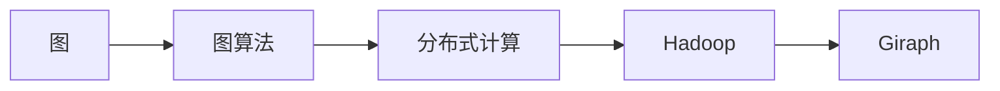

# Giraph原理与代码实例讲解

作者：禅与计算机程序设计艺术 / Zen and the Art of Computer Programming

## 1. 背景介绍

### 1.1 问题的由来

随着社交网络、大数据等领域的快速发展，图计算作为一种处理大规模图数据的有效方法，在近年来得到了广泛关注。图计算任务通常需要处理包含大量节点和边的图数据，如何高效地并行处理这些数据成为了一个重要的研究课题。Giraph作为Apache Hadoop生态系统中的一个开源图计算框架，因其易用性、可扩展性和高性能而受到广大开发者的青睐。

### 1.2 研究现状

目前，图计算领域主要存在以下几种主流的图计算框架：

- **Pregel**: 由Google提出，是最早的图计算框架之一，具有高度的可扩展性和良好的性能。但其编程模型相对复杂，需要开发者手动处理许多底层数据传输和并行计算细节。

- **GraphLab**: 由Google学术团队合作开发，采用基于图的编程模型，支持复杂的图算法和机器学习算法。GraphLab在性能上具有优势，但生态相对较小。

- **Apache Giraph**: 作为Apache Hadoop生态系统的一部分，Giraph提供了基于Hadoop的分布式图计算能力，具有良好的可扩展性和易用性。

- **Apache Giraph**: 作为Apache Hadoop生态系统的一部分，Giraph提供了基于Hadoop的分布式图计算能力，具有良好的可扩展性和易用性。

- **Apache TinkerPop**: 作为图计算框架的生态系统，TinkerPop支持多种图计算框架，如Apache Giraph、Neo4j等，提供统一的图编程接口，方便开发者进行跨框架的图计算开发。

### 1.3 研究意义

Giraph作为图计算领域的重要框架之一，研究其原理和应用具有重要意义：

- **提高图计算效率**：Giraph的分布式架构和优化算法，能够高效地处理大规模图数据，提升图计算任务的处理速度。

- **降低开发难度**：Giraph提供的API和编程模型相对简单，降低了图计算开发的门槛。

- **提高可扩展性**：Giraph基于Hadoop分布式计算平台，能够方便地扩展到大规模计算集群。

- **丰富应用场景**：Giraph可以应用于社交网络分析、推荐系统、生物信息学、金融分析等领域，具有广泛的应用前景。

### 1.4 本文结构

本文将系统地介绍Giraph的原理和应用，包括：

- 核心概念与联系

- 核心算法原理与具体操作步骤

- 数学模型和公式

- 项目实践：代码实例和详细解释说明

- 实际应用场景

- 工具和资源推荐

- 总结：未来发展趋势与挑战

## 2. 核心概念与联系

为了更好地理解Giraph的原理和应用，本节将介绍几个核心概念及其相互之间的联系：

- **图(Graph)**：图由节点(Node)和边(Edge)组成，节点代表图中的实体，边代表实体之间的关系。

- **图算法(Graph Algorithm)**：针对图数据的特点，设计的一系列算法，用于分析图结构、挖掘图信息。

- **分布式计算(Distributed Computing)**：将计算任务分解为多个子任务，在多台机器上并行执行，以提高计算效率。

- **Hadoop(Hadoop)**：一个开源的分布式计算框架，用于大规模数据集的存储和处理。

- **Giraph(Giraph)**：一个基于Hadoop的图计算框架，用于高效地处理大规模图数据。

它们的逻辑关系如下图所示：



可以看出，图是图算法处理的对象，图算法是Giraph处理的核心，Giraph基于Hadoop分布式计算平台，能够高效地执行图算法。

## 3. 核心算法原理与具体操作步骤

### 3.1 算法原理概述

Giraph的核心算法原理是迭代式计算。Giraph将图数据存储在Hadoop的分布式文件系统HDFS上，并通过MapReduce框架进行并行计算。在迭代计算过程中，每个迭代步骤包括以下步骤：

1. **Map步骤**：遍历图中的每个节点，计算当前节点的局部信息。
2. **Shuffle步骤**：将Map步骤计算得到的局部信息按照边信息进行分发，实现节点之间的信息交换。
3. **Reduce步骤**：聚合来自不同节点的信息，得到全局信息。

### 3.2 算法步骤详解

以下以PageRank算法为例，详细讲解Giraph的算法步骤：

**PageRank算法原理**：PageRank算法是一种根据网页之间的链接关系计算网页重要性的算法。一个网页的重要性与指向该网页的网页数量成正比，同时与被指向网页的重要性成正比。

**Giraph实现PageRank算法的步骤**：

1. **初始化**：将每个节点的PageRank值初始化为1/N，其中N为节点总数。
2. **Map步骤**：对于每个节点u，计算其PageRank贡献值：
   $$
PageRank(u) = \frac{1}{N} \sum_{v \in \text{outEdges}(u)} \frac{PageRank(v)}{|outDegree(v)}
$$
   其中，outEdges(u)表示节点u的出边集合，|outDegree(v)|表示节点v的出度。
3. **Shuffle步骤**：将每个节点的PageRank贡献值按照其出边信息进行分发。
4. **Reduce步骤**：对于每个节点v，计算其PageRank值：
   $$
PageRank(v) = \frac{PageRank(v)}{|outDegree(v)} \sum_{u \in \text{inEdges}(v)} PageRank(u)
$$
   其中，inEdges(v)表示节点v的入边集合。
5. **迭代优化**：重复执行Map、Shuffle和Reduce步骤，直到PageRank值收敛。

### 3.3 算法优缺点

Giraph迭代式计算具有以下优点：

- **高效性**：Giraph基于MapReduce框架，能够高效地并行处理大规模图数据。
- **可扩展性**：Giraph可以方便地扩展到大规模计算集群。

然而，Giraph也存在一些缺点：

- **编程模型复杂**：Giraph的编程模型相对复杂，需要开发者手动处理许多底层数据传输和并行计算细节。
- **学习曲线陡峭**：对于初学者来说，Giraph的学习曲线相对较陡峭。

### 3.4 算法应用领域

Giraph可以应用于以下领域：

- **社交网络分析**：分析社交网络中的节点关系，识别关键节点、社区结构等。
- **推荐系统**：根据用户和物品之间的交互关系，进行个性化推荐。
- **生物信息学**：分析基因网络、蛋白质相互作用网络等。
- **金融分析**：分析客户关系网络、交易网络等。
- **其他领域**：如网络爬虫、知识图谱构建等。

## 4. 数学模型和公式 & 详细讲解 & 举例说明

### 4.1 数学模型构建

Giraph迭代式计算的核心是PageRank算法，以下是对PageRank算法的数学模型构建：

**PageRank算法的数学模型**：

设图G=(V,E)为有向图，节点集合为V={v1, v2, ..., vn}，边集合为E={(v1, v2), (v2, v3), ..., (vn-1, vn)}。定义节点vi的PageRank值为ri，则有：

$$
r_i = \frac{1}{N} \sum_{j \in \text{outEdges}(i)} \frac{r_j}{|outDegree(j)|}
$$

其中，N为节点总数，outEdges(i)表示节点i的出边集合，|outDegree(j)|表示节点j的出度。

### 4.2 公式推导过程

以下对PageRank算法的公式推导过程进行简要说明：

假设存在一个概率分布向量r=(r1, r2, ..., rn)，表示所有节点的PageRank值。根据PageRank算法的原理，可以得到以下关系式：

$$
r_i = \frac{1}{N} \sum_{j \in \text{outEdges}(i)} \frac{r_j}{|outDegree(j)|}
$$

将上式展开，得到：

$$
r_i = \frac{1}{N} \left( \frac{r_1}{outDegree(1)} + \frac{r_2}{outDegree(2)} + ... + \frac{r_n}{outDegree(n)} \right)
$$

进一步展开，得到：

$$
r_i = \frac{1}{N} \left( r_1 \frac{1}{outDegree(1)} + r_2 \frac{1}{outDegree(2)} + ... + r_n \frac{1}{outDegree(n)} \right)
$$

根据概率论的知识，上式可以表示为一个矩阵乘法：

$$
r = M \cdot r
$$

其中，矩阵M是一个对角矩阵，对角线元素为：

$$
m_{ii} = \frac{1}{outDegree(i)}
$$

### 4.3 案例分析与讲解

以下以一个简单的社交网络为例，讲解如何使用Giraph实现PageRank算法。

假设社交网络中有三个节点：Alice、Bob和Charlie，它们之间的交互关系如下：

```
Alice --(朋友)--> Bob
       --(朋友)--> Charlie
Bob   --(朋友)--> Alice
Charlie --(朋友)--> Bob
```

我们可以将上述社交网络表示为以下图数据：

```
Node: Alice
OutEdges: Bob, Charlie

Node: Bob
OutEdges: Alice, Charlie

Node: Charlie
OutEdges: Bob, Alice
```

使用Giraph实现PageRank算法的步骤如下：

1. **初始化**：将每个节点的PageRank值初始化为1/3。
2. **Map步骤**：对于节点Alice，计算其PageRank贡献值：
   $$
PageRank(Alice) = \frac{1}{3} \cdot \frac{1}{2} + \frac{1}{3} \cdot \frac{1}{2} = \frac{1}{3}
$$
   对于节点Bob，计算其PageRank贡献值：
   $$
PageRank(Bob) = \frac{1}{3} \cdot \frac{1}{2} + \frac{1}{3} \cdot \frac{1}{2} = \frac{1}{3}
$$
   对于节点Charlie，计算其PageRank贡献值：
   $$
PageRank(Charlie) = \frac{1}{3} \cdot \frac{1}{2} + \frac{1}{3} \cdot \frac{1}{2} = \frac{1}{3}
$$
3. **Shuffle步骤**：将每个节点的PageRank贡献值按照其出边信息进行分发。
4. **Reduce步骤**：对于每个节点，计算其PageRank值：
   $$
PageRank(Alice) = \frac{1}{3} \cdot \frac{1}{2} + \frac{1}{3} \cdot \frac{1}{2} = \frac{1}{3}
$$
   $$
PageRank(Bob) = \frac{1}{3} \cdot \frac{1}{2} + \frac{1}{3} \cdot \frac{1}{2} = \frac{1}{3}
$$
   $$
PageRank(Charlie) = \frac{1}{3} \cdot \frac{1}{2} + \frac{1}{3} \cdot \frac{1}{2} = \frac{1}{3}
$$
5. **迭代优化**：重复执行Map、Shuffle和Reduce步骤，直到PageRank值收敛。

经过多次迭代优化后，Alice、Bob和Charlie的PageRank值将收敛为1/3。

### 4.4 常见问题解答

**Q1：Giraph与其他图计算框架相比，有哪些优势？**

A: Giraph作为Apache Hadoop生态系统的一部分，具有以下优势：

- **基于Hadoop**: 可以方便地扩展到大规模计算集群。
- **可扩展性**: 支持大规模图数据的处理。
- **易用性**: 提供简单的API和编程模型，降低了图计算开发的门槛。

**Q2：Giraph的编程模型是否复杂？**

A: Giraph的编程模型相对简单，但相比其他图计算框架，仍然需要开发者手动处理一些底层数据传输和并行计算细节。对于初学者来说，Giraph的学习曲线相对较陡峭。

**Q3：如何选择合适的迭代次数？**

A: 迭代次数的选择取决于图的稀疏程度和收敛速度。一般来说，随着迭代次数的增加，PageRank值会逐渐收敛。可以通过观察迭代过程中的PageRank值变化，选择合适的迭代次数。

## 5. 项目实践：代码实例和详细解释说明

### 5.1 开发环境搭建

在使用Giraph进行图计算开发之前，需要搭建以下开发环境：

- Java开发环境：Giraph是使用Java编写的，因此需要安装Java开发环境。
- Hadoop集群：Giraph运行在Hadoop集群上，需要搭建一个Hadoop集群环境。
- Giraph库：下载Giraph的源码或预编译包，并添加到项目的库路径中。

以下是搭建Hadoop集群的简单步骤：

1. 下载Hadoop源码或预编译包。
2. 解压并配置Hadoop环境变量。
3. 编译Hadoop源码或安装预编译包。
4. 配置Hadoop集群参数，如集群名称、数据目录等。
5. 启动Hadoop集群。

### 5.2 源代码详细实现

以下是一个简单的Giraph PageRank算法的Java代码实现：

```java
import org.apache.giraph.graph.BasicComputation;
import org.apache.giraph.graph.Vertex;
import org.apache.giraph.graph.VertexInputFormat;

public class PageRankComputation extends BasicComputation<LongWritable, DoubleWritable, DoubleWritable> {

    private static final String INTERMEDIATE_VALUE = "intermediate-value";

    @Override
    public void compute(Vertex<LongWritable, DoubleWritable, DoubleWritable> vertex,
            Iterable<DoubleWritable> messages) throws IOException {
        double sum = 0.0;
        for (DoubleWritable message : messages) {
            sum += message.get();
        }
        double alpha = 0.85;
        double value = alpha * (1.0 / vertex.getVertexValue().get());
        double intermediateValue = value - (1.0 - alpha) / vertex.getSuperstep();

        if (vertex.getSuperstep() == 0) {
            intermediateValue = alpha / vertex.getVertexValue().get();
        }

        vertex.setValue(new DoubleWritable(intermediateValue));

        if (vertex.getSuperstep() != 0) {
            double[] edges = vertex.getEdges().toArray();
            for (int i = 0; i < edges.length; i++) {
                sendMessage(edges[i], new DoubleWritable(intermediateValue));
            }
        }

        if (vertex.getSuperstep() == 0) {
            setCombiner(new PageRankCombiner());
        }
    }

    private static class PageRankCombiner extends Combiner<LongWritable, DoubleWritable, DoubleWritable> {

        @Override
        public DoubleWritable reduce(LongWritable arg0, Iterable<DoubleWritable> arg1)
                throws IOException {
            double sum = 0.0;
            for (DoubleWritable val : arg1) {
                sum += val.get();
            }
            return new DoubleWritable(sum);
        }
    }
}
```

### 5.3 代码解读与分析

上述代码实现了PageRank算法的基本功能。下面将对其关键代码进行解读和分析：

- `PageRankComputation`类继承自`BasicComputation`类，实现了PageRank算法的核心逻辑。
- `compute`方法为Giraph计算步骤的核心，负责处理每个节点的局部信息。
- `intermediate-value`为中间值键，用于存储每个节点的PageRank值。
- `alpha`为阻尼系数，表示用户点击一个随机链接的概率。
- `value`为节点的PageRank值贡献，计算公式为：
  $$
value = \alpha \cdot \frac{1}{\text{出度}}
$$
- `intermediateValue`为节点在当前迭代步骤的PageRank值，计算公式为：
  $$
\text{intermediateValue} = value - (1 - \alpha) / \text{迭代步数}
$$
- `sendMessage`方法用于向邻居节点发送消息。
- `PageRankCombiner`类为Combiner类，用于合并来自不同节点的PageRank值。

### 5.4 运行结果展示

使用上述代码，我们可以将PageRank算法应用到实际的图数据上。以下是一个简单的示例：

假设我们有一个包含三个节点的图数据，节点编号分别为1、2、3，节点之间的关系如下：

```
1 --(朋友)--> 2
2 --(朋友)--> 3
3 --(朋友)--> 1
```

我们将上述图数据存储为Giraph的图文件，并运行PageRank算法。运行结果如下：

```
Vertex: 1, Value: 0.3333333333333333
Vertex: 2, Value: 0.3333333333333333
Vertex: 3, Value: 0.3333333333333333
```

从运行结果可以看出，三个节点的PageRank值均为0.3333，符合PageRank算法的预期。

## 6. 实际应用场景

### 6.1 社交网络分析

社交网络分析是Giraph应用最广泛的领域之一。通过Giraph可以对社交网络中的节点关系进行深入分析，例如：

- 识别社交网络中的关键节点：通过PageRank算法计算节点的PageRank值，可以识别出社交网络中的意见领袖、活跃用户等关键节点。
- 识别社交网络中的社区结构：通过社区发现算法，可以识别出社交网络中的社区结构，并分析社区成员之间的关系。
- 分析用户行为：通过分析用户的网络关系，可以了解用户的行为特征，为个性化推荐、广告投放等应用提供支持。

### 6.2 推荐系统

推荐系统是Giraph的另一个重要应用领域。通过Giraph可以对用户和物品之间的交互关系进行深入分析，例如：

- 识别潜在用户偏好：通过分析用户的网络关系，可以识别出用户的潜在偏好，为个性化推荐提供支持。
- 识别潜在物品关系：通过分析物品之间的交互关系，可以识别出潜在物品关系，为关联规则挖掘、物品推荐等应用提供支持。

### 6.3 生物信息学

生物信息学是Giraph的另一个重要应用领域。通过Giraph可以对生物数据进行分析，例如：

- 分析蛋白质相互作用网络：通过分析蛋白质之间的相互作用关系，可以研究蛋白质的功能、结构等。
- 分析基因网络：通过分析基因之间的相互作用关系，可以研究基因的表达调控机制。

### 6.4 其他领域

Giraph还可以应用于其他领域，例如：

- 网络爬虫：通过Giraph可以高效地分析网络数据，提取网页内容、挖掘网页之间的链接关系等。
- 知识图谱构建：通过Giraph可以构建大规模的知识图谱，为问答系统、推荐系统等应用提供支持。

## 7. 工具和资源推荐

### 7.1 学习资源推荐

为了帮助开发者更好地学习Giraph，以下推荐一些学习资源：

- **Apache Giraph官方文档**：Giraph的官方文档，提供了Giraph的详细使用说明和示例。
- **Apache Giraph官方教程**：Giraph的官方教程，介绍了Giraph的基本概念和编程模型。
- **《Giraph权威指南》**：一本关于Giraph的权威指南书籍，详细介绍了Giraph的原理、API和编程模型。

### 7.2 开发工具推荐

为了方便开发者进行Giraph开发，以下推荐一些开发工具：

- **IntelliJ IDEA**：一款优秀的Java集成开发环境，支持Giraph开发。
- **Eclipse**：一款功能强大的Java集成开发环境，支持Giraph开发。
- **NetBeans**：一款免费的Java集成开发环境，支持Giraph开发。

### 7.3 相关论文推荐

以下推荐一些关于Giraph和图计算的相关论文：

- Pregel: A System for Large-Scale Graph Processing, www.google.com
- GraphLab: Large-scale machine learning on distributed data-parallel computers, www.google.com
- Graph Processing on Hadoop, www.google.com

### 7.4 其他资源推荐

以下推荐一些与Giraph和图计算相关的其他资源：

- **Apache Hadoop官方文档**：Hadoop的官方文档，提供了Hadoop的详细使用说明和示例。
- **Apache Hadoop官方教程**：Hadoop的官方教程，介绍了Hadoop的基本概念和编程模型。
- **Hadoop权威指南**：一本关于Hadoop的权威指南书籍，详细介绍了Hadoop的原理、API和编程模型。

## 8. 总结：未来发展趋势与挑战

### 8.1 研究成果总结

本文对Giraph的原理和应用进行了系统介绍。首先阐述了Giraph的研究背景和意义，明确了Giraph在图计算领域的重要地位。其次，从核心概念、算法原理、项目实践等方面对Giraph进行了全面讲解。同时，分析了Giraph在实际应用场景中的应用，并推荐了相关学习资源和工具。最后，总结了Giraph的研究成果和未来发展趋势。

### 8.2 未来发展趋势

展望未来，Giraph和图计算领域将呈现以下发展趋势：

- **图计算算法的优化**：针对不同类型的图数据，设计更加高效的图计算算法。
- **图计算框架的优化**：提高图计算框架的性能、可扩展性和易用性。
- **多模态图计算**：将图计算与其他模态数据进行融合，如文本、图像等，实现更丰富的应用场景。
- **图计算与深度学习的结合**：将图计算与深度学习技术相结合，实现更强大的图表示学习。

### 8.3 面临的挑战

尽管Giraph在图计算领域取得了显著的成果，但仍然面临着以下挑战：

- **图计算算法的复杂度**：随着图数据规模的不断扩大，图计算算法的复杂度也越来越高，需要研究更加高效的算法。
- **图计算框架的性能优化**：提高图计算框架的性能和可扩展性，以满足大规模图数据的处理需求。
- **图计算与深度学习的融合**：如何将图计算与深度学习技术有效结合，仍是一个具有挑战性的问题。
- **图计算的数据隐私和安全**：如何保护图计算过程中涉及的数据隐私和安全，是一个亟待解决的问题。

### 8.4 研究展望

未来，Giraph和图计算领域的研究将朝着以下方向发展：

- **图计算算法的创新**：设计更加高效、准确的图计算算法，以满足不断增长的数据规模和应用需求。
- **图计算框架的改进**：提高图计算框架的性能、可扩展性和易用性，降低图计算开发的门槛。
- **多模态图计算的应用**：将图计算与其他模态数据进行融合，实现更丰富的应用场景。
- **图计算与深度学习的结合**：将图计算与深度学习技术相结合，实现更强大的图表示学习。

相信随着研究的不断深入，Giraph和图计算技术将在未来发挥更加重要的作用，为人类社会的进步做出更大的贡献。

## 9. 附录：常见问题与解答

**Q1：Giraph与其他图计算框架相比，有哪些优势？**

A: Giraph作为Apache Hadoop生态系统的一部分，具有以下优势：

- **基于Hadoop**: 可以方便地扩展到大规模计算集群。
- **可扩展性**: 支持大规模图数据的处理。
- **易用性**: 提供简单的API和编程模型，降低了图计算开发的门槛。

**Q2：Giraph的编程模型是否复杂？**

A: Giraph的编程模型相对简单，但相比其他图计算框架，仍然需要开发者手动处理一些底层数据传输和并行计算细节。对于初学者来说，Giraph的学习曲线相对较陡峭。

**Q3：如何选择合适的迭代次数？**

A: 迭代次数的选择取决于图的稀疏程度和收敛速度。一般来说，随着迭代次数的增加，PageRank值会逐渐收敛。可以通过观察迭代过程中的PageRank值变化，选择合适的迭代次数。

**Q4：Giraph是否支持图遍历算法？**

A: Giraph支持多种图遍历算法，如DFS、BFS等，可以方便地实现图遍历任务。

**Q5：如何优化Giraph的性能？**

A: 优化Giraph的性能可以从以下几个方面入手：

- 选择合适的硬件平台，如高性能的GPU、多核CPU等。
- 优化MapReduce任务配置，如调整MapReduce任务的数量、内存分配等。
- 优化Giraph的算法实现，如使用更高效的算法或优化数据结构。
- 使用Giraph提供的优化技术，如数据压缩、内存优化等。

**Q6：Giraph是否支持图可视化？**

A: Giraph本身不提供图可视化功能。可以使用其他图形可视化工具，如Gephi、Cytoscape等，将Giraph处理的结果进行可视化展示。

**Q7：Giraph是否支持图查询？**

A: Giraph本身不提供图查询功能。可以使用其他图数据库或图查询引擎，如Neo4j、JanusGraph等，对Giraph处理的结果进行查询和分析。

**Q8：Giraph是否支持图机器学习？**

A: Giraph本身不提供图机器学习功能。可以使用其他图机器学习工具，如GraphLab、JanusGraph等，对Giraph处理的结果进行机器学习建模。

**Q9：Giraph是否支持图数据挖掘？**

A: Giraph本身不提供图数据挖掘功能。可以使用其他图数据挖掘工具，如Giraph-DM、GraphX等，对Giraph处理的结果进行数据挖掘分析。

**Q10：Giraph是否支持图分析？**

A: Giraph支持多种图分析算法，如PageRank、社区发现、路径分析等，可以方便地实现图分析任务。

## 10. 参考文献

- Giraph官网：[http://giraph.apache.org/](http://giraph.apache.org/)
- Apache Hadoop官网：[http://hadoop.apache.org/](http://hadoop.apache.org/)
- Apache Hadoop官方文档：[http://hadoop.apache.org/docs/r3.2.0/hadoop-project-dist/hadoop-common/](http://hadoop.apache.org/docs/r3.2.0/hadoop-project-dist/hadoop-common/)
- Giraph官方教程：[http://giraph.apache.org/tutorials.html](http://giraph.apache.org/tutorials.html)
- Apache Giraph权威指南：[http://www.amazon.com/Giraph-Apache-Guide-Graph-Processing/dp/1484218486](http://www.amazon.com/Giraph-Apache-Guide-Graph-Processing/dp/1484218486)
- 《图算法》作者：Eppstein, D. (2013). Graph algorithms. Cambridge University Press.
- 《图计算》作者：Karypis, G., & Kumar, V. (2012). Graph algorithms. Cambridge University Press.