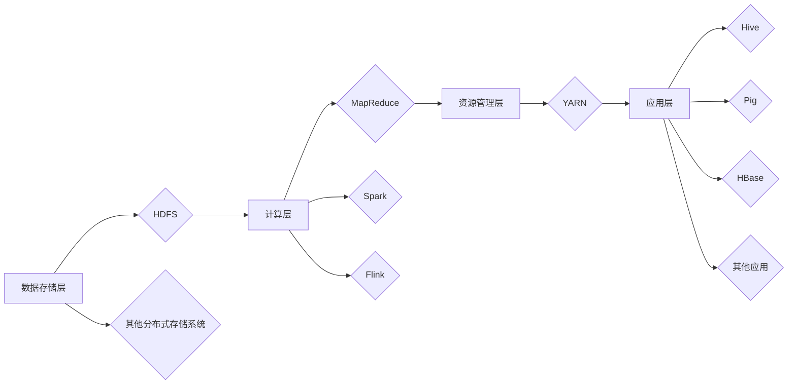

# Hadoop开发实践&代码优化技巧

作者：禅与计算机程序设计艺术 / Zen and the Art of Computer Programming

## 1. 背景介绍

### 1.1 问题的由来

随着互联网和大数据时代的到来，海量数据存储和处理成为了企业面临的重大挑战。传统的数据处理方式已经无法满足日益增长的数据量和处理速度需求。Hadoop作为一款分布式计算框架，凭借其高扩展性、高可靠性、低成本等优势，成为了大数据处理领域的事实标准。

Hadoop不仅需要掌握其基本原理和架构，还需要在实际开发中具备优秀的代码编写和优化技巧，才能充分发挥其性能优势。本文将深入探讨Hadoop开发实践和代码优化技巧，帮助读者提升大数据开发能力。

### 1.2 研究现状

Hadoop自从2006年由Apache Software Foundation开源以来，经过多年的发展，已经成为大数据处理领域的基石。在Hadoop生态圈内，涌现了众多优秀的组件和工具，如HDFS、MapReduce、YARN、Hive、Pig等。这些组件和工具共同构成了一个强大且功能丰富的数据处理平台。

然而，Hadoop生态圈仍然在不断发展和完善，新的技术、新的框架不断涌现。例如，Apache Spark在数据处理速度和易用性方面取得了显著优势，逐渐成为Hadoop的替代品。此外，Flink、Apache HBase等新技术也在不断涌现，为大数据处理领域带来了新的机遇和挑战。

### 1.3 研究意义

掌握Hadoop开发实践和代码优化技巧，对于大数据开发人员来说具有重要意义：

1. 提高开发效率：掌握Hadoop开发技巧可以让我们更快地构建大数据应用，缩短项目周期。
2. 提升系统性能：通过代码优化，我们可以提高Hadoop集群的利用率，降低资源消耗，提高系统性能。
3. 降低维护成本：合理的代码结构和优化策略可以降低系统维护成本，提高系统稳定性。
4. 掌握核心技术：深入了解Hadoop开发实践和代码优化技巧，有助于我们更好地掌握大数据核心技术。

### 1.4 本文结构

本文将围绕Hadoop开发实践和代码优化技巧展开，内容安排如下：

- 第2部分，介绍Hadoop的核心概念和架构。
- 第3部分，讲解Hadoop开发中常用的组件和工具。
- 第4部分，探讨Hadoop代码优化策略和技巧。
- 第5部分，通过实际案例讲解Hadoop代码优化实践。
- 第6部分，分析Hadoop在实际应用中的场景。
- 第7部分，展望Hadoop的未来发展趋势。
- 第8部分，总结全文，展望未来研究方向。

## 2. 核心概念与联系

### 2.1 Hadoop核心概念

Hadoop是一个开源的分布式计算框架，主要包括以下几个核心概念：

1. **HDFS（Hadoop Distributed File System）**：分布式文件系统，用于存储海量数据，提供高吞吐量的数据访问。
2. **MapReduce**：分布式计算模型，用于大规模数据处理和分析。
3. **YARN（Yet Another Resource Negotiator）**：资源管理系统，负责调度和管理集群资源。
4. **Hive**：数据仓库，提供SQL查询功能，支持对存储在HDFS中的数据进行分析。
5. **Pig**：数据处理工具，用于将复杂的数据处理任务转换为简单的数据流。

这些核心概念相互关联，共同构成了Hadoop生态系统。

### 2.2 Hadoop架构

Hadoop采用分布式架构，主要包括以下几个层次：

1. **数据存储层**：HDFS提供高吞吐量的数据存储服务。
2. **计算层**：MapReduce、Spark、Flink等分布式计算框架负责数据处理和分析。
3. **资源管理层**：YARN负责调度和管理集群资源。
4. **应用层**：Hive、Pig、HBase等组件提供数据分析工具。

Hadoop架构的逻辑关系如下：



## 3. 核心算法原理 & 具体操作步骤

### 3.1 算法原理概述

Hadoop的核心算法主要包括MapReduce和YARN。

#### MapReduce算法原理

MapReduce是一种分布式计算模型，用于大规模数据处理。其核心思想是将大规模数据分解成多个小任务，在集群上并行执行，最后将结果汇总。

MapReduce算法包括以下几个步骤：

1. **Map阶段**：将输入数据切分成多个小数据块，每个数据块由Map任务进行处理。
2. **Shuffle阶段**：将Map阶段的输出按照键值对进行分组，将相同键的数据发送到相同的Reducer任务。
3. **Reduce阶段**：对每个键值对进行聚合，生成最终结果。

#### YARN算法原理

YARN是一种资源管理系统，负责调度和管理集群资源。其核心思想是将集群资源（CPU、内存、磁盘等）抽象为容器（Container），并根据作业需求动态分配给不同的应用程序。

YARN算法包括以下几个步骤：

1. **资源申请**：应用程序向YARN请求资源，包括CPU、内存、磁盘等。
2. **资源分配**：YARN根据申请需求将资源分配给应用程序。
3. **资源监控**：YARN实时监控资源使用情况，并根据需要调整资源分配。
4. **资源回收**：应用程序完成任务后，YARN回收释放的资源。

### 3.2 算法步骤详解

#### MapReduce算法步骤详解

1. **输入数据切分**：Hadoop将输入数据切分成多个小数据块，每个数据块的大小由HDFS的块大小决定。
2. **Map任务处理**：Map任务对每个数据块进行处理，输出键值对结果。
3. **Shuffle阶段**：MapReduce框架将对所有Map任务的输出进行排序和分组，将相同键的数据发送到相同的Reducer任务。
4. **Reduce任务处理**：Reducer任务对来自各个Map任务的相同键值对进行聚合，生成最终结果。

#### YARN算法步骤详解

1. **应用程序提交**：应用程序向YARN提交作业请求，包括应用程序类型、资源需求等信息。
2. **资源分配**：YARN根据作业需求分配资源，创建容器，并将容器启动命令发送给相应的NodeManager。
3. **容器启动**：NodeManager接收启动命令，启动容器，并运行应用程序。
4. **资源监控**：YARN实时监控资源使用情况，并根据需要调整资源分配。
5. **作业完成**：应用程序完成任务后，YARN回收释放的资源，并将作业状态更新为完成。

### 3.3 算法优缺点

#### MapReduce算法优缺点

**优点**：

* **高可靠性**：Hadoop采用分布式存储和计算，即使部分节点故障，也不会影响整体作业的执行。
* **可扩展性**：Hadoop可以轻松扩展到数千台机器，适应大规模数据处理需求。
* **可移植性**：Hadoop可以在多种操作系统上运行，包括Linux、Windows等。

**缺点**：

* **单点故障**：Hadoop的Master节点（如NameNode）是单点故障，需要考虑高可用方案。
* **资源利用率低**：MapReduce框架在数据倾斜、任务调度等方面存在资源利用率低的问题。
* **开发复杂**：MapReduce编程模型复杂，开发难度大。

#### YARN算法优缺点

**优点**：

* **资源隔离**：YARN为不同应用程序提供资源隔离，提高了集群的利用率。
* **可扩展性**：YARN可以轻松扩展到数千台机器，适应大规模数据处理需求。
* **灵活的资源调度**：YARN可以根据应用程序的需求动态调整资源分配。

**缺点**：

* **复杂性高**：YARN的管理和调度算法较为复杂，需要较高的运维技能。
* **性能瓶颈**：YARN在资源调度、任务提交等方面可能存在性能瓶颈。

### 3.4 算法应用领域

MapReduce和YARN在以下领域得到广泛应用：

* **大规模数据分析**：例如搜索引擎、天气预报、社交网络分析等。
* **数据挖掘**：例如聚类、分类、关联规则挖掘等。
* **机器学习**：例如深度学习、自然语言处理等。

## 4. 数学模型和公式 & 详细讲解 & 举例说明

### 4.1 数学模型构建

Hadoop中的MapReduce和YARN算法涉及以下数学模型：

#### MapReduce算法数学模型

**Map阶段**：

输入数据：$\{(x_1, y_1), (x_2, y_2), \ldots, (x_n, y_n)\}$

Map函数：$f(x_i, y_i) = (k_i, v_i)$

Map阶段输出：$\{(k_1, v_1), (k_2, v_2), \ldots, (k_n, v_n)\}$

**Shuffle阶段**：

Shuffle过程可表示为：

$$
\{(k_1, \{v_{11}, v_{12}, \ldots, v_{1m}\}), (k_2, \{v_{21}, v_{22}, \ldots, v_{2m}\}), \ldots, (k_n, \{v_{n1}, v_{n2}, \ldots, v_{nm}\})\}
$$

**Reduce阶段**：

Reduce函数：$g(k, v) = u$

Reduce阶段输出：$\{(k_1, u_1), (k_2, u_2), \ldots, (k_n, u_n)\}$

#### YARN算法数学模型

**资源分配**：

假设集群中共有N个节点，每个节点有M个核心、G个内存、D个磁盘空间。

应用程序请求资源：CPU = a, 内存 = b, 磁盘 = c

YARN分配资源：$\{(n_1, \{CPU_1, 内存_1, 磁盘_1\}), (n_2, \{CPU_2, 内存_2, 磁盘_2\}), \ldots, (n_k, \{CPU_k, 内存_k, 磁盘_k\})\}$

### 4.2 公式推导过程

#### MapReduce算法公式推导过程

**Map阶段**：

Map函数的输出可表示为：

$$
f(x_i, y_i) = (k_i, v_i) = (h(x_i), f(y_i))
$$

**Shuffle阶段**：

Shuffle过程可表示为：

$$
\{(k_1, \{v_{11}, v_{12}, \ldots, v_{1m}\}), (k_2, \{v_{21}, v_{22}, \ldots, v_{2m}\}), \ldots, (k_n, \{v_{n1}, v_{n2}, \ldots, v_{nm}\})\}
$$

**Reduce阶段**：

Reduce函数的输出可表示为：

$$
u = \sum_{i=1}^m v_{i}
$$

#### YARN算法公式推导过程

**资源分配**：

假设集群中共有N个节点，每个节点有M个核心、G个内存、D个磁盘空间。

应用程序请求资源：CPU = a, 内存 = b, 磁盘 = c

YARN分配资源：

$$
\{(n_1, \{CPU_1, 内存_1, 磁盘_1\}), (n_2, \{CPU_2, 内存_2, 磁盘_2\}), \ldots, (n_k, \{CPU_k, 内存_k, 磁盘_k\})\}
$$

### 4.3 案例分析与讲解

#### MapReduce算法案例分析

假设我们要统计一个包含大量文本数据的文档中每个单词的出现次数。

输入数据：$\{(x_1, y_1), (x_2, y_2), \ldots, (x_n, y_n)\}$

其中 $x_i$ 表示文本数据，$y_i$ 表示文件名。

Map函数：

$$
f(x_i, y_i) = (w_i, 1)
$$

其中 $w_i$ 表示 $x_i$ 中的所有单词。

Shuffle阶段：

将所有单词按照键值对进行分组，将相同单词的数据发送到相同的Reducer任务。

Reduce函数：

$$
g(w, \{v_1, v_2, \ldots, v_m\}) = \sum_{i=1}^m v_i
$$

输出结果：$\{(w_1, u_1), (w_2, u_2), \ldots, (w_n, u_n)\}$

其中 $u_i$ 表示单词 $w_i$ 的出现次数。

#### YARN算法案例分析

假设我们要在Hadoop集群上运行一个MapReduce作业，作业需要100个核心、200GB内存和300GB磁盘空间。

YARN将为作业分配100个核心、200GB内存和300GB磁盘空间。

### 4.4 常见问题解答

**Q1：MapReduce和Spark有哪些区别？**

A：MapReduce和Spark都是分布式计算框架，但它们在架构、编程模型、性能等方面存在一些区别：

* **架构**：MapReduce采用Master/Slave架构，Spark采用Master/Worker架构。
* **编程模型**：MapReduce采用MapReduce编程模型，Spark采用弹性的分布式数据集（RDD）编程模型。
* **性能**：Spark在数据处理速度方面具有显著优势，但MapReduce在稳定性、容错性方面更胜一筹。

**Q2：如何优化Hadoop集群性能？**

A：以下是一些优化Hadoop集群性能的方法：

* **合理配置Hadoop参数**：例如，调整MapReduce的内存、线程数等参数。
* **优化MapReduce程序**：例如，减少数据倾斜、优化Shuffle过程、使用更合适的Reduce函数等。
* **使用更快的存储设备**：例如，使用SSD存储而非HDD。
* **合理配置YARN资源**：例如，根据作业需求动态调整资源分配。

**Q3：如何监控Hadoop集群？**

A：可以使用以下工具监控Hadoop集群：

* **Cloudera Manager**：Cloudera提供的Hadoop管理平台，可以监控集群的各种指标。
* **Ambari**：Apache提供的Hadoop管理平台，可以监控集群的各种指标。
* **Grafana**：开源的可视化监控工具，可以与Prometheus、InfluxDB等数据源结合使用。

## 5. 项目实践：代码实例和详细解释说明

### 5.1 开发环境搭建

在开始Hadoop开发实践之前，我们需要搭建以下开发环境：

1. 安装Java开发环境：Hadoop是基于Java开发的，需要安装Java开发环境。
2. 安装Hadoop：可以从Apache官网下载Hadoop安装包，并根据官方文档进行安装。
3. 安装集成开发环境（IDE）：推荐使用IntelliJ IDEA或Eclipse等IDE进行Hadoop开发。

### 5.2 源代码详细实现

以下是一个简单的MapReduce程序，用于统计文本数据中每个单词的出现次数。

```java
import org.apache.hadoop.conf.Configuration
import org.apache.hadoop.fs.Path
import org.apache.hadoop.io.IntWritable
import org.apache.hadoop.io.Text
import org.apache.hadoop.mapreduce.Job
import org.apache.hadoop.mapreduce.Mapper
import org.apache.hadoop.mapreduce.Reducer
import org.apache.hadoop.mapreduce.lib.input.FileInputFormat
import org.apache.hadoop.mapreduce.lib.output.FileOutputFormat

public class WordCount {
    public static class WordCountMapper extends Mapper<Object, Text, Text, IntWritable> {
        private final static IntWritable one = new IntWritable(1);
        private Text word = new Text();

        public void map(Object key, Text value, Context context) throws IOException, InterruptedException {
            String[] words = value.toString().split("\s+");
            for (String word : words) {
                this.word.set(word);
                context.write(this.word, one);
            }
        }
    }

    public static class WordCountReducer extends Reducer<Text, IntWritable, Text, IntWritable> {
        public void reduce(Text key, Iterable<IntWritable> values, Context context) throws IOException, InterruptedException {
            int sum = 0;
            for (IntWritable val : values) {
                sum += val.get();
            }
            context.write(key, new IntWritable(sum));
        }
    }

    public static void main(String[] args) throws Exception {
        Configuration conf = new Configuration();
        Job job = Job.getInstance(conf, "word count");
        job.setJarByClass(WordCount.class);
        job.setMapperClass(WordCountMapper.class);
        job.setCombinerClass(WordCountReducer.class);
        job.setReducerClass(WordCountReducer.class);
        job.setOutputKeyClass(Text.class);
        job.setOutputValueClass(IntWritable.class);
        FileInputFormat.addInputPath(job, new Path(args[0]));
        FileOutputFormat.setOutputPath(job, new Path(args[1]));
        System.exit(job.waitForCompletion(true) ? 0 : 1);
    }
}
```

### 5.3 代码解读与分析

上述代码实现了MapReduce编程模型，用于统计文本数据中每个单词的出现次数。

* **WordCountMapper类**：实现了Mapper接口，负责将输入数据切分成键值对进行输出。
* **WordCountReducer类**：实现了Reducer接口，负责将相同键的值进行聚合。
* **main方法**：设置作业配置、输入输出路径等信息，启动作业。

### 5.4 运行结果展示

运行上述程序后，可以在输出路径中看到每个单词的出现次数。

## 6. 实际应用场景

Hadoop及其生态系统在以下领域得到广泛应用：

### 6.1 大数据分析

Hadoop可以用于大规模数据分析，例如：

* **搜索引擎**：使用Hadoop处理海量的网页数据，实现高效检索。
* **天气预报**：使用Hadoop分析气象数据，实现精确的天气预报。
* **社交网络分析**：使用Hadoop分析社交网络数据，挖掘用户行为和关系。

### 6.2 数据挖掘

Hadoop可以用于数据挖掘，例如：

* **聚类**：使用Hadoop对海量数据进行聚类分析，发现数据中的潜在模式。
* **分类**：使用Hadoop对数据进行分类，实现个性化推荐、文本分类等应用。
* **关联规则挖掘**：使用Hadoop挖掘数据中的关联规则，发现数据中的关联关系。

### 6.3 机器学习

Hadoop可以用于机器学习，例如：

* **深度学习**：使用Hadoop训练深度学习模型，处理海量数据。
* **自然语言处理**：使用Hadoop进行自然语言处理任务，如文本分类、情感分析等。
* **图像识别**：使用Hadoop进行图像识别任务，处理海量图像数据。

## 7. 工具和资源推荐

### 7.1 学习资源推荐

以下是一些Hadoop学习资源：

* **《Hadoop权威指南》**：Hadoop入门的经典教材，全面介绍了Hadoop的原理、架构、应用等。
* **Apache Hadoop官方文档**：Apache Hadoop官方文档提供了丰富的Hadoop学习资源。
* **Cloudera官方文档**：Cloudera官方文档提供了丰富的Hadoop学习资源，包括课程、视频、案例等。

### 7.2 开发工具推荐

以下是一些Hadoop开发工具：

* **IntelliJ IDEA**：一款功能强大的Java集成开发环境，支持Hadoop开发。
* **Eclipse**：一款功能强大的Java集成开发环境，支持Hadoop开发。
* **Hadoop命令行工具**：Hadoop提供了一系列命令行工具，方便用户进行集群管理、作业管理等操作。

### 7.3 相关论文推荐

以下是一些与Hadoop相关的论文：

* **The Google File System**：介绍了Google File System的设计和实现，对HDFS的设计产生了重要影响。
* **The Google MapReduce Programming Model**：介绍了Google MapReduce编程模型，对MapReduce的设计产生了重要影响。
* **Yet Another Resource Negotiator**：介绍了YARN的设计和实现，对Hadoop生态系统的发展产生了重要影响。

### 7.4 其他资源推荐

以下是一些与大数据相关的资源：

* **Kaggle**：一个数据科学竞赛平台，提供海量数据集和算法竞赛。
* **GitHub**：一个代码托管平台，可以找到大量的开源Hadoop项目。
* **大数据技术社区**：一个大数据技术交流平台，可以学习到最新的大数据技术和应用。

## 8. 总结：未来发展趋势与挑战

### 8.1 研究成果总结

本文对Hadoop开发实践和代码优化技巧进行了全面系统的介绍。首先介绍了Hadoop的核心概念和架构，讲解了MapReduce和YARN的原理和步骤。然后，探讨了Hadoop代码优化策略和技巧，并通过实际案例进行了讲解。最后，分析了Hadoop在实际应用中的场景，展望了Hadoop的未来发展趋势。

### 8.2 未来发展趋势

随着大数据技术的不断发展，Hadoop将呈现以下发展趋势：

* **云原生**：Hadoop将逐步与云原生技术融合，实现云上部署和管理。
* **容器化**：Hadoop将采用容器化技术，实现快速部署和弹性扩展。
* **微服务架构**：Hadoop将采用微服务架构，提高系统的可扩展性和可维护性。
* **人工智能**：Hadoop将与人工智能技术融合，实现更智能的数据处理和分析。

### 8.3 面临的挑战

Hadoop在未来的发展过程中，将面临以下挑战：

* **安全性**：随着数据安全意识的提高，Hadoop需要加强安全性保障。
* **可扩展性**：随着数据规模的不断扩大，Hadoop需要进一步提高可扩展性。
* **易用性**：Hadoop需要降低使用门槛，让更多开发者能够使用Hadoop。
* **生态整合**：Hadoop需要与其他大数据技术和平台进行整合，形成统一的大数据生态系统。

### 8.4 研究展望

为了应对未来的挑战，以下研究方向值得关注：

* **安全性研究**：研究Hadoop的安全机制，提高数据安全性和隐私保护。
* **可扩展性研究**：研究Hadoop的可扩展性，提高集群的规模和性能。
* **易用性研究**：研究Hadoop的易用性，降低使用门槛，提高易用性。
* **生态整合研究**：研究Hadoop与其他大数据技术和平台的整合，构建统一的大数据生态系统。

总之，Hadoop作为大数据处理领域的基石，将继续在未来的发展中发挥重要作用。通过不断优化和完善，Hadoop将为大数据技术发展提供更加坚实的基础。