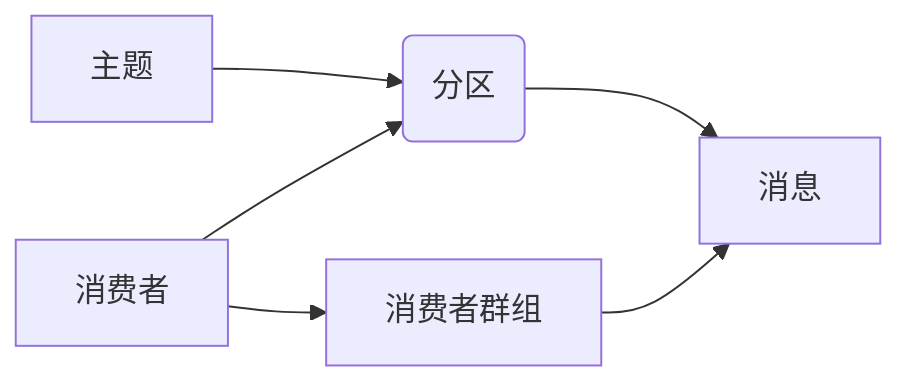
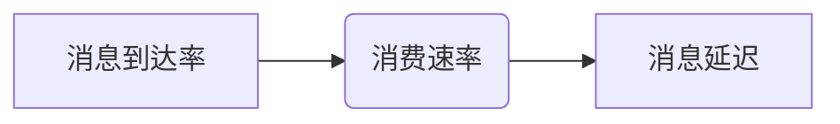

# Kafka Consumer原理与代码实例讲解

作者：禅与计算机程序设计艺术 / Zen and the Art of Computer Programming

## 1. 背景介绍

### 1.1 问题的由来

随着大数据和云计算技术的快速发展，分布式系统在各个领域得到了广泛应用。消息队列作为一种分布式系统中常用的组件，被用于解耦系统、异步处理、系统解耦等场景。Apache Kafka作为一款高性能、可扩展、高吞吐量的分布式流处理平台，已经成为消息队列领域的佼佼者。

Kafka的消费者（Consumer）是Kafka生态系统中重要的组成部分，它允许客户端从Kafka集群中订阅并消费消息。本文将深入探讨Kafka消费者的原理，并通过代码实例进行详细讲解。

### 1.2 研究现状

目前，Kafka消费者已经成为业界主流的消息队列消费方式之一。众多开源和商业消息队列系统都采用了类似的消费者架构。Kafka消费者具有以下特点：

- 支持高并发消费：Kafka消费者可以同时消费多个主题中的消息，并支持多线程消费。
- 可靠性：Kafka消费者支持自动提交offset，保证消息至少被消费一次。
- 容错性：Kafka消费者可以在集群中任意节点上进行重启，而不会丢失已消费的消息。
- 可扩展性：Kafka消费者可以动态增加或减少消费线程，以应对不同负载场景。

### 1.3 研究意义

研究Kafka消费者的原理和实现，对于理解分布式消息队列技术、构建高性能的分布式系统具有重要意义：

1. 提高系统架构设计能力：了解Kafka消费者的原理，有助于设计出更加高效、可靠的分布式系统架构。
2. 提升编程技能：通过学习Kafka消费者的实现，可以掌握分布式系统编程的相关技术，提高编程技能。
3. 解决实际问题：掌握Kafka消费者，可以帮助我们解决实际的生产场景中的消息消费问题。

### 1.4 本文结构

本文将分为以下章节：

- 第2章：介绍Kafka消费者相关的核心概念。
- 第3章：深入解析Kafka消费者的工作原理。
- 第4章：通过代码实例讲解Kafka消费者的应用。
- 第5章：分析Kafka消费者的实际应用场景。
- 第6章：展望Kafka消费者的未来发展趋势与挑战。
- 第7章：推荐相关学习资源、开发工具和参考文献。
- 第8章：总结全文，展望Kafka消费者技术的未来发展趋势。

## 2. 核心概念与联系

为了更好地理解Kafka消费者，本节将介绍几个核心概念及其相互关系。

### 2.1 主题（Topic）

主题是Kafka中的一个核心概念，它代表了一个消息流。每个主题可以包含多条消息，每条消息都有一个唯一的标识符（offset）。

### 2.2 分区（Partition）

分区是主题内部的一个逻辑分区，每个分区包含一个有序的消息流。分区可以提高Kafka集群的吞吐量和并行度。

### 2.3 消费者群组（Consumer Group）

消费者群组是一组消费者实例的集合，它们共同消费同一个主题的消息。每个消费者群组内的消费者实例在同一个分区上可以消费不同的消息，而在不同的分区上可以消费相同的消息。

### 2.4 消息（Message）

消息是Kafka中最小的数据单元，它包含一个key和一个value。key和value可以是任意类型的对象。

### 2.5 消费者（Consumer）

消费者是负责从Kafka集群中消费消息的客户端实例。消费者可以通过订阅主题，获取并处理消息。

下面是这些概念之间的逻辑关系：



## 3. 核心算法原理 & 具体操作步骤

### 3.1 算法原理概述

Kafka消费者的核心算法主要涉及以下几个方面：

- 消费者初始化：初始化消费者，并连接到Kafka集群。
- 订阅主题：订阅一个或多个主题。
- 消费消息：从主题中拉取消息，并处理消息。
- 提交offset：将消费到的消息offset提交到Kafka集群，以保证消息至少被消费一次。

### 3.2 算法步骤详解

以下是Kafka消费者消费消息的步骤：

1. 初始化消费者：创建一个消费者实例，并连接到Kafka集群。

```java
Properties props = new Properties();
props.put("bootstrap.servers", "localhost:9092");
props.put("group.id", "test-group");
props.put("key.deserializer", "org.apache.kafka.common.serialization.StringDeserializer");
props.put("value.deserializer", "org.apache.kafka.common.serialization.StringDeserializer");

KafkaConsumer<String, String> consumer = new KafkaConsumer<>(props);
```

2. 订阅主题：订阅一个或多个主题。

```java
consumer.subscribe(Arrays.asList("test-topic"));
```

3. 消费消息：从主题中拉取消息，并处理消息。

```java
for (ConsumerRecord<String, String> record : consumer.poll(Duration.ofMillis(100))) {
    System.out.printf("offset = %d, key = %s, value = %s%n", record.offset(), record.key(), record.value());
}
```

4. 提交offset：将消费到的消息offset提交到Kafka集群。

```java
consumer.commitSync();
```

5. 关闭消费者：关闭消费者实例。

```java
consumer.close();
```

### 3.3 算法优缺点

Kafka消费者算法的优点：

- 支持高并发消费：消费者可以同时消费多个主题中的消息，并支持多线程消费。
- 可靠性：消费者支持自动提交offset，保证消息至少被消费一次。
- 容错性：消费者可以在集群中任意节点上进行重启，而不会丢失已消费的消息。

Kafka消费者算法的缺点：

- 资源消耗较大：消费者需要连接到Kafka集群，并维护订阅的多个主题，因此资源消耗较大。
- 依赖网络环境：消费者需要连接到Kafka集群，因此依赖网络环境。

### 3.4 算法应用领域

Kafka消费者算法可以应用于以下领域：

- 实时数据处理：从Kafka集群中实时获取并处理数据，例如实时日志收集、实时数据分析等。
- 系统解耦：将消息队列作为系统之间的解耦组件，降低系统间的耦合度。
- 异步处理：通过消息队列实现异步处理，提高系统性能和响应速度。

## 4. 数学模型和公式 & 详细讲解 & 举例说明

### 4.1 数学模型构建

Kafka消费者的数学模型主要涉及以下几个方面：

- 消息到达率：单位时间内到达的消息数量。
- 消费速率：单位时间内消费的消息数量。
- 消息延迟：消息从产生到消费的时间差。

下面是这些概念之间的关系：



### 4.2 公式推导过程

假设消息到达率（R）为恒定值，消费速率（C）为变量，消息延迟（L）为变量，则消息延迟与消费速率的关系可以表示为：

$$
L = \frac{R}{C}
$$

### 4.3 案例分析与讲解

假设某系统每天产生1000万条消息，消费者A和B分别以100万条/秒和50万条/秒的速率消费消息。根据上述公式，我们可以计算出消费者A和B的消息延迟分别为：

- 消费者A：L_A = 1000万 / 100万 = 10秒
- 消费者B：L_B = 1000万 / 50万 = 20秒

由此可见，消费者B的消息延迟是消费者A的两倍。

### 4.4 常见问题解答

**Q1：如何提高Kafka消费者的消费速率？**

A：提高Kafka消费者的消费速率可以通过以下方法：

- 增加消费线程数量。
- 增加消费者实例数量。
- 增加服务器资源，例如CPU、内存和磁盘。

**Q2：如何降低Kafka消费者的消息延迟？**

A：降低Kafka消费者的消息延迟可以通过以下方法：

- 增加消费线程数量。
- 增加消费者实例数量。
- 增加服务器资源，例如CPU、内存和磁盘。
- 使用更快的消费策略，例如使用Lag-Free消费策略。

## 5. 项目实践：代码实例和详细解释说明

### 5.1 开发环境搭建

在进行Kafka消费者项目实践前，我们需要搭建以下开发环境：

1. 安装Java开发环境（例如JDK）。
2. 安装Maven或Gradle等构建工具。
3. 安装Kafka客户端库（例如kafka-clients）。

### 5.2 源代码详细实现

以下是一个使用Java编写的Kafka消费者示例代码：

```java
import org.apache.kafka.clients.consumer.ConsumerConfig;
import org.apache.kafka.clients.consumer.ConsumerRecord;
import org.apache.kafka.clients.consumer.KafkaConsumer;
import org.apache.kafka.common.serialization.StringDeserializer;

import java.time.Duration;
import java.util.Arrays;
import java.util.Properties;

public class KafkaConsumerExample {
    public static void main(String[] args) {
        Properties props = new Properties();
        props.put(ConsumerConfig.BOOTSTRAP_SERVERS_CONFIG, "localhost:9092");
        props.put(ConsumerConfig.GROUP_ID_CONFIG, "test-group");
        props.put(ConsumerConfig.KEY_DESERIALIZER_CLASS_CONFIG, StringDeserializer.class.getName());
        props.put(ConsumerConfig.VALUE_DESERIALIZER_CLASS_CONFIG, StringDeserializer.class.getName());

        KafkaConsumer<String, String> consumer = new KafkaConsumer<>(props);
        consumer.subscribe(Arrays.asList("test-topic"));

        try {
            while (true) {
                ConsumerRecords<String, String> records = consumer.poll(Duration.ofMillis(100));
                for (ConsumerRecord<String, String> record : records) {
                    System.out.printf("offset = %d, key = %s, value = %s%n", record.offset(), record.key(), record.value());
                }
                consumer.commitSync();
            }
        } finally {
            consumer.close();
        }
    }
}
```

### 5.3 代码解读与分析

以下是代码关键部分的解读：

- `Properties props`：配置Kafka消费者的参数，例如Kafka集群地址、消费者组ID、反序列化器等。
- `KafkaConsumer<String, String> consumer`：创建Kafka消费者实例。
- `consumer.subscribe(Arrays.asList("test-topic"))`：订阅`test-topic`主题。
- `while (true)`：循环消费消息。
- `ConsumerRecords<String, String> records = consumer.poll(Duration.ofMillis(100))`：从Kafka集群中拉取消息。
- `for (ConsumerRecord<String, String> record : records)`：遍历拉取到的消息。
- `System.out.printf("offset = %d, key = %s, value = %s%n", record.offset(), record.key(), record.value())`：打印消息的offset、key和value。
- `consumer.commitSync()`：提交消费到的消息offset。
- `consumer.close()`：关闭消费者实例。

### 5.4 运行结果展示

运行上述代码，你将看到从Kafka集群中拉取到的消息内容。

## 6. 实际应用场景

Kafka消费者可以应用于以下实际应用场景：

### 6.1 实时数据处理

将Kafka消费者应用于实时数据处理场景，可以实时获取并处理数据，例如：

- 实时日志收集：从各个系统中收集日志数据，并进行实时分析和报警。
- 实时数据分析：实时分析用户行为、交易数据等，为业务决策提供支持。

### 6.2 系统解耦

将Kafka消费者应用于系统解耦场景，可以降低系统间的耦合度，例如：

- 消息队列作为订单系统和库存系统之间的解耦组件，实现订单的异步处理。
- 消息队列作为支付系统和风控系统之间的解耦组件，实现支付交易的异步处理。

### 6.3 异步处理

将Kafka消费者应用于异步处理场景，可以提高系统性能和响应速度，例如：

- 将用户提交的表单数据发送到Kafka主题，由其他系统异步处理表单数据。
- 将用户点击事件发送到Kafka主题，由其他系统异步处理点击事件。

## 7. 工具和资源推荐

### 7.1 学习资源推荐

以下是一些学习Kafka消费者资源的推荐：

- Apache Kafka官方文档：[Apache Kafka官方文档](https://kafka.apache.org/documentation.html)
- 《Kafka权威指南》
- 《深入理解Kafka》
- 《Kafka源码剖析》

### 7.2 开发工具推荐

以下是一些开发Kafka消费者工具的推荐：

- IntelliJ IDEA
- Eclipse
- Maven
- Gradle

### 7.3 相关论文推荐

以下是一些与Kafka消费者相关的论文推荐：

- 《The Design of the Apache Kafka System》
- 《Scalable and efficient publish/subscribe systems》
- 《A System for Massively Parallel Online Analytical Processing》

### 7.4 其他资源推荐

以下是一些其他与Kafka消费者相关的资源推荐：

- Apache Kafka社区：[Apache Kafka社区](https://kafka.apache.org/communities.html)
- Kafka技术交流群：[Kafka技术交流群](https://kafka.apache.org/communities.html#kafka-users-list)

## 8. 总结：未来发展趋势与挑战

### 8.1 研究成果总结

本文介绍了Kafka消费者的原理、实现和应用场景，并通过代码实例进行了详细讲解。Kafka消费者作为分布式消息队列的重要组件，在实时数据处理、系统解耦、异步处理等领域发挥着重要作用。

### 8.2 未来发展趋势

未来，Kafka消费者技术将呈现以下发展趋势：

- 支持更多消息格式：Kafka消费者将支持更多消息格式，例如JSON、Avro等。
- 支持更复杂的数据处理逻辑：Kafka消费者将支持更复杂的数据处理逻辑，例如流式处理、实时计算等。
- 支持更高级的流处理框架：Kafka消费者将与更高级的流处理框架（例如Apache Flink、Apache Storm等）结合，提供更丰富的功能。

### 8.3 面临的挑战

Kafka消费者技术面临以下挑战：

- 支持更多消息格式：需要考虑不同消息格式的序列化和反序列化性能。
- 支持更复杂的数据处理逻辑：需要考虑数据处理的实时性和准确性。
- 支持更高级的流处理框架：需要考虑与流处理框架的兼容性和集成。

### 8.4 研究展望

未来，Kafka消费者技术将在以下几个方面取得突破：

- 支持更高效的序列化和反序列化技术。
- 开发更智能的消息路由策略。
- 提高消息处理速度和准确性。
- 提供更丰富的流处理功能。

## 9. 附录：常见问题与解答

**Q1：Kafka消费者如何保证消息至少被消费一次？**

A：Kafka消费者通过自动提交offset来保证消息至少被消费一次。在消费消息后，消费者会自动将offset提交到Kafka集群。

**Q2：Kafka消费者如何实现负载均衡？**

A：Kafka消费者通过分配不同的分区到不同的消费者实例来实现负载均衡。

**Q3：Kafka消费者如何处理消息丢失？**

A：Kafka消费者在消费消息时会检查消息的校验和，如果消息损坏，则会丢弃该消息。此外，Kafka集群会定期检查消息的校验和，以确保消息的完整性。

**Q4：Kafka消费者如何处理消费者故障？**

A：Kafka消费者在启动时会尝试连接到Kafka集群，如果连接失败，则会自动重试。如果消费者在一段时间内无法连接到Kafka集群，则会停止消费消息。

**Q5：如何优化Kafka消费者的性能？**

A：优化Kafka消费者性能的方法包括：

- 选择合适的消费者组ID。
- 调整批处理大小。
- 选择合适的分区消费策略。
- 使用更快的反序列化技术。

作者：禅与计算机程序设计艺术 / Zen and the Art of Computer Programming