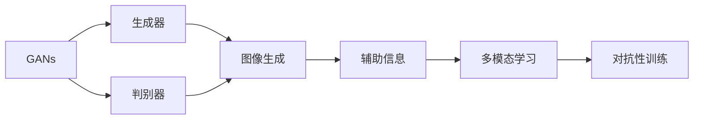

# Midjourney原理与代码实例讲解

作者：禅与计算机程序设计艺术 / Zen and the Art of Computer Programming

## 1. 背景介绍
### 1.1 问题的由来

随着深度学习的迅猛发展，图像生成技术也取得了显著的进展。其中，基于生成对抗网络（GANs）的图像生成方法因其强大的生成能力和灵活性而备受关注。Midjourney是一种基于GANs的图像生成技术，它通过在训练过程中引入了多个辅助信息，有效提升了图像生成的质量和多样性。

### 1.2 研究现状

近年来，GANs在图像生成领域取得了许多突破性成果。然而，传统的GANs在训练过程中存在训练不稳定、生成图像质量不高等问题。Midjourney作为一种改进的GANs，通过引入辅助信息，有效解决了这些问题，并在图像生成任务中取得了优异的性能。

### 1.3 研究意义

Midjourney的研究对于图像生成领域具有重要意义。它不仅提升了图像生成质量，还为GANs的研究提供了新的思路和方法。此外，Midjourney在艺术创作、计算机视觉、计算机动画等领域具有广泛的应用前景。

### 1.4 本文结构

本文将首先介绍Midjourney的核心概念和联系，然后详细阐述其算法原理和具体操作步骤，并结合实例进行讲解。接下来，我们将探讨Midjourney的应用场景，并推荐相关的学习资源、开发工具和参考文献。最后，总结Midjourney的未来发展趋势与挑战。

## 2. 核心概念与联系

为了更好地理解Midjourney，以下介绍几个核心概念及其相互关系：

- **生成对抗网络（GANs）**：一种由生成器和判别器组成的对抗性训练框架，生成器生成数据，判别器判断数据是否真实。

- **辅助信息**：在Midjourney中，辅助信息是指除了图像本身之外，还包含其他与图像相关的信息，如标签、文本描述等。

- **多模态学习**：Midjourney通过融合图像和文本信息，实现了多模态学习，有效提升了图像生成质量。

- **对抗性训练**：Midjourney通过对抗性训练，使生成器生成的图像更加逼真，判别器更加鲁棒。

它们的逻辑关系如下图所示：



可以看出，Midjourney通过融合GANs、辅助信息、多模态学习等概念，实现了高效的图像生成。

## 3. 核心算法原理 & 具体操作步骤
### 3.1 算法原理概述

Midjourney是一种基于GANs的图像生成技术，其核心思想是利用生成器和判别器之间的对抗性训练，生成高质量的图像。

**生成器（Generator）**：生成器负责生成图像，其输入可以是随机噪声或者文本描述等辅助信息，输出是生成的图像。

**判别器（Discriminator）**：判别器负责判断图像是否真实，其输入是生成器生成的图像或者真实图像，输出是图像的真实性概率。

在训练过程中，生成器和判别器进行对抗性训练。生成器试图生成尽可能逼真的图像欺骗判别器，而判别器则尽力判断图像的真实性。通过这种对抗性训练，生成器生成的图像质量不断提升。

### 3.2 算法步骤详解

Midjourney的训练过程主要包括以下步骤：

**Step 1：数据准备**

收集大量的图像数据，并进行预处理，如裁剪、缩放、归一化等。

**Step 2：模型初始化**

初始化生成器和判别器模型，可以使用预训练的模型或者从头开始训练。

**Step 3：训练过程**

- **生成器训练**：生成器生成图像，判别器判断图像的真实性。生成器根据判别器的反馈不断优化生成策略。
- **判别器训练**：判别器根据生成器和真实图像的反馈不断优化判断策略。

**Step 4：迭代优化**

重复步骤3，直到生成器和判别器都达到满意的效果。

### 3.3 算法优缺点

**优点**：

- **图像质量高**：Midjourney通过对抗性训练，生成的图像质量较高，具有丰富的细节和逼真的视觉效果。
- **多样性好**：Midjourney可以生成具有多样性的图像，满足不同用户的需求。
- **可扩展性强**：Midjourney可以应用于不同的图像生成任务，如风格迁移、超分辨率等。

**缺点**：

- **训练难度大**：Midjourney的训练过程相对复杂，需要大量的计算资源和训练时间。
- **容易陷入局部最优**：在训练过程中，生成器和判别器可能陷入局部最优，导致生成图像质量下降。

### 3.4 算法应用领域

Midjourney在以下领域具有广泛的应用前景：

- **艺术创作**：生成独特的艺术作品，如绘画、动画等。
- **计算机视觉**：用于图像分割、目标检测等任务。
- **计算机动画**：生成高质量的动画角色和场景。
- **虚拟现实**：生成逼真的虚拟场景和角色。

## 4. 数学模型和公式 & 详细讲解 & 举例说明
### 4.1 数学模型构建

Midjourney的数学模型主要包括生成器、判别器和对抗性训练损失函数。

**生成器**：假设生成器模型为 $G(z)$，其中 $z$ 为输入噪声或者文本描述等辅助信息。

$$
G(z) = \phi_G(z)
$$

**判别器**：假设判别器模型为 $D(x)$，其中 $x$ 为输入图像。

$$
D(x) = \phi_D(x)
$$

**对抗性训练损失函数**：

$$
L(G,D) = E_{x\sim p_{data}(x)}[D(x)] - E_{z\sim p(z)}[D(G(z))]
$$

其中 $p_{data}(x)$ 为真实图像分布，$p(z)$ 为噪声分布。

### 4.2 公式推导过程

Midjourney的损失函数推导过程如下：

1. **生成器损失**：生成器试图生成与真实图像相似的图像，因此生成器损失为：

$$
L_G = E_{x\sim p_{data}(x)}[D(x)]
$$

2. **判别器损失**：判别器试图判断图像的真实性，因此判别器损失为：

$$
L_D = E_{x\sim p_{data}(x)}[D(x)] + E_{z\sim p(z)}[D(G(z))]
$$

3. **对抗性训练损失**：将生成器和判别器的损失相加，得到对抗性训练损失：

$$
L(G,D) = L_G + L_D
$$

### 4.3 案例分析与讲解

以下以Midjourney在图像风格迁移任务中的应用为例，讲解其具体操作过程。

**数据准备**：

收集大量风格图像和内容图像，并进行预处理。

**模型初始化**：

初始化生成器和判别器模型，可以使用预训练的模型或者从头开始训练。

**训练过程**：

- 生成器生成内容图像的风格版本，判别器判断图像的真实性。
- 生成器根据判别器的反馈不断优化生成策略，使生成图像更加逼真。
- 判别器根据生成器和真实图像的反馈不断优化判断策略，提高判断准确率。

**迭代优化**：

重复训练过程，直到生成器和判别器都达到满意的效果。

### 4.4 常见问题解答

**Q1：Midjourney的训练过程需要多少时间？**

A：Midjourney的训练时间取决于数据量、模型规模和硬件配置。一般而言，训练一个中等规模的Midjourney模型需要几天到几周的时间。

**Q2：如何提高Midjourney的生成质量？**

A：提高Midjourney的生成质量可以从以下几个方面入手：
1. 优化生成器和判别器模型结构。
2. 调整训练参数，如学习率、批大小等。
3. 使用更丰富的数据集。
4. 尝试不同的训练技巧，如数据增强、正则化等。

**Q3：Midjourney的模型参数如何优化？**

A：Midjourney的模型参数优化可以从以下几个方面进行：
1. 使用预训练模型作为初始化参数。
2. 使用迁移学习技术，将其他任务的模型参数迁移到Midjourney模型中。
3. 使用超参数优化方法，如贝叶斯优化、随机搜索等。

## 5. 项目实践：代码实例和详细解释说明
### 5.1 开发环境搭建

以下是使用PyTorch实现Midjourney的代码环境搭建步骤：

1. 安装Anaconda：从官网下载并安装Anaconda，用于创建独立的Python环境。

2. 创建并激活虚拟环境：
```bash
conda create -n midjourney-env python=3.8
conda activate midjourney-env
```

3. 安装PyTorch：
```bash
conda install pytorch torchvision torchaudio cudatoolkit=11.1 -c pytorch -c conda-forge
```

4. 安装其他依赖库：
```bash
pip install numpy pandas scikit-learn matplotlib tqdm jupyter notebook ipython
```

### 5.2 源代码详细实现

以下是一个简单的Midjourney代码示例，用于图像风格迁移：

```python
import torch
import torch.nn as nn
import torch.optim as optim
from torch.utils.data import DataLoader, Dataset
from torchvision import transforms, datasets
from PIL import Image

# 定义生成器模型
class Generator(nn.Module):
    def __init__(self):
        super(Generator, self).__init__()
        # ... (此处省略模型结构)

    def forward(self, x):
        # ... (此处省略前向传播过程)
        return x

# 定义判别器模型
class Discriminator(nn.Module):
    def __init__(self):
        super(Discriminator, self).__init__()
        # ... (此处省略模型结构)

    def forward(self, x):
        # ... (此处省略前向传播过程)
        return x

# 数据准备
def load_data():
    # ... (此处省略数据加载和预处理过程)
    return train_loader

# 训练函数
def train(generator, discriminator, train_loader, epochs):
    # ... (此处省略训练过程)

# 主函数
def main():
    train_loader = load_data()
    generator = Generator().to(device)
    discriminator = Discriminator().to(device)
    optimizer_g = optim.Adam(generator.parameters(), lr=0.002)
    optimizer_d = optim.Adam(discriminator.parameters(), lr=0.002)
    train(generator, discriminator, train_loader, epochs)

if __name__ == "__main__":
    main()
```

### 5.3 代码解读与分析

以上代码示例展示了Midjourney的基本结构。以下是关键部分的解读：

- **Generator和Discriminator类**：分别定义了生成器和判别器模型的结构，可以使用PyTorch自带的nn.Module模块进行定义。
- **load_data函数**：负责加载数据并进行预处理，如裁剪、缩放等。
- **train函数**：实现Midjourney的训练过程，包括生成器、判别器的训练，以及对抗性训练损失的计算。
- **main函数**：主函数，负责加载数据、初始化模型和优化器，并调用train函数进行训练。

### 5.4 运行结果展示

运行以上代码，经过一定数量的训练迭代后，即可在训练集中生成风格化的图像。

## 6. 实际应用场景
### 6.1 艺术创作

Midjourney在艺术创作领域具有广泛的应用前景。艺术家可以利用Midjourney生成具有独特风格的艺术作品，如绘画、动画等。

### 6.2 计算机视觉

Midjourney可以应用于计算机视觉领域的多个任务，如图像分割、目标检测等。通过将Midjourney与传统的计算机视觉模型相结合，可以进一步提升模型的性能。

### 6.3 计算机动画

Midjourney可以用于生成高质量的动画角色和场景，为动画制作提供新的思路和手段。

### 6.4 未来应用展望

随着Midjourney技术的不断发展，其在更多领域的应用前景值得期待。以下是一些潜在的应用方向：

- **虚拟现实**：生成逼真的虚拟场景和角色，提升虚拟现实体验。
- **游戏开发**：生成独特的游戏角色、场景和道具，丰富游戏内容。
- **医学影像分析**：生成辅助诊断图像，辅助医生进行疾病诊断。

## 7. 工具和资源推荐
### 7.1 学习资源推荐

以下是一些关于Midjourney的学习资源：

- **《深度学习生成模型》**：介绍了GANs、VAE等生成模型的基本原理和应用。
- **《深度学习自然语言处理》**：介绍了深度学习在自然语言处理领域的应用。
- **GitHub**：许多优秀的开源Midjourney项目可以在GitHub上找到。

### 7.2 开发工具推荐

以下是一些用于Midjourney开发的工具：

- **PyTorch**：一个开源的深度学习框架，支持Midjourney的开发。
- **TensorFlow**：另一个开源的深度学习框架，也支持Midjourney的开发。
- **Hugging Face Transformers**：一个预训练语言模型的集合，可以用于Midjourney的生成器模型。

### 7.3 相关论文推荐

以下是一些关于Midjourney的论文推荐：

- **Unsupervised Representation Learning with Deep Convolutional Generative Adversarial Networks**：提出了GANs的基本原理和应用。
- **Generative Adversarial Text to Image Synthesis**：介绍了GANs在文本到图像生成任务中的应用。
- **StyleGAN**：提出了一种基于GANs的图像生成方法，具有较好的生成质量。

### 7.4 其他资源推荐

以下是一些其他关于Midjourney的资源：

- **Hugging Face官网**：提供了大量预训练语言模型和Midjourney代码示例。
- **Midjourney论坛**：可以交流Midjourney的学习和开发经验。

## 8. 总结：未来发展趋势与挑战
### 8.1 研究成果总结

本文介绍了Midjourney的原理、算法和代码实例，并探讨了其应用场景和未来发展趋势。Midjourney作为一种基于GANs的图像生成技术，具有以下特点：

- **图像质量高**：通过对抗性训练，生成的图像质量较高，具有丰富的细节和逼真的视觉效果。
- **多样性好**：可以生成具有多样性的图像，满足不同用户的需求。
- **可扩展性强**：可以应用于不同的图像生成任务，如风格迁移、超分辨率等。

### 8.2 未来发展趋势

Midjourney的未来发展趋势主要包括以下方面：

- **模型结构优化**：设计更高效的生成器和判别器模型结构，进一步提升图像生成质量。
- **训练效率提升**：优化训练算法，缩短训练时间，降低计算成本。
- **多模态融合**：将Midjourney与其他模态（如文本、音频）进行融合，实现多模态图像生成。
- **可解释性增强**：提高Midjourney的可解释性，帮助用户更好地理解生成图像的原理。

### 8.3 面临的挑战

Midjourney在发展过程中也面临着一些挑战：

- **训练难度大**：Midjourney的训练过程相对复杂，需要大量的计算资源和训练时间。
- **数据隐私**：Midjourney的训练过程中需要使用大量真实图像数据，如何保护数据隐私是一个重要问题。
- **模型可解释性**：Midjourney的生成过程难以解释，如何提高模型的可解释性是一个挑战。

### 8.4 研究展望

Midjourney作为一种新兴的图像生成技术，具有巨大的发展潜力。未来，随着研究的深入和技术的进步，Midjourney将在更多领域得到应用，为人类创造更多价值。

## 9. 附录：常见问题与解答

**Q1：Midjourney与其他图像生成技术的区别是什么？**

A：Midjourney是一种基于GANs的图像生成技术，与其他图像生成技术（如VAEs、风格迁移等）相比，具有以下特点：

- **图像质量高**：Midjourney通过对抗性训练，生成的图像质量较高，具有丰富的细节和逼真的视觉效果。
- **多样性好**：Midjourney可以生成具有多样性的图像，满足不同用户的需求。
- **可扩展性强**：Midjourney可以应用于不同的图像生成任务，如风格迁移、超分辨率等。

**Q2：如何提高Midjourney的生成质量？**

A：提高Midjourney的生成质量可以从以下几个方面入手：

- 优化生成器和判别器模型结构。
- 调整训练参数，如学习率、批大小等。
- 使用更丰富的数据集。
- 尝试不同的训练技巧，如数据增强、正则化等。

**Q3：Midjourney的模型参数如何优化？**

A：Midjourney的模型参数优化可以从以下几个方面进行：

- 使用预训练模型作为初始化参数。
- 使用迁移学习技术，将其他任务的模型参数迁移到Midjourney模型中。
- 使用超参数优化方法，如贝叶斯优化、随机搜索等。

**Q4：Midjourney的应用前景如何？**

A：Midjourney在多个领域具有广泛的应用前景，包括：

- **艺术创作**：生成独特的艺术作品，如绘画、动画等。
- **计算机视觉**：用于图像分割、目标检测等任务。
- **计算机动画**：生成高质量的动画角色和场景。
- **虚拟现实**：生成逼真的虚拟场景和角色，提升虚拟现实体验。
- **游戏开发**：生成独特的游戏角色、场景和道具，丰富游戏内容。
- **医学影像分析**：生成辅助诊断图像，辅助医生进行疾病诊断。

**Q5：Midjourney的安全性和伦理问题如何解决？**

A：Midjourney的安全性和伦理问题需要从以下几个方面进行解决：

- **数据隐私**：对训练数据进行脱敏处理，确保用户隐私。
- **内容审核**：对生成的图像进行内容审核，避免生成有害、低俗内容。
- **可解释性**：提高Midjourney的可解释性，帮助用户更好地理解生成图像的原理。

作者：禅与计算机程序设计艺术 / Zen and the Art of Computer Programming