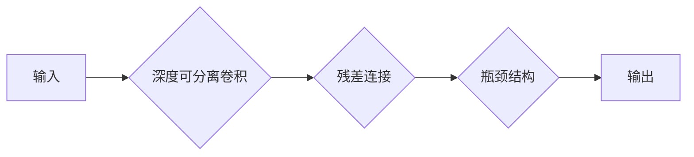

# MobileNet原理与代码实例讲解

作者：禅与计算机程序设计艺术 / Zen and the Art of Computer Programming

## 1. 背景介绍
### 1.1 问题的由来

随着智能手机和移动设备的普及，对移动端图像处理应用的需求日益增长。然而，传统的深度学习模型往往参数量巨大，计算复杂度高，难以在移动端设备上实时运行。为了解决这个问题，Google提出了MobileNet，这是一种轻量级深度学习模型，在保持高精度的同时，大幅降低了模型的复杂度和计算量，成为了移动端图像识别领域的明星模型。

### 1.2 研究现状

MobileNet自2017年发布以来，在移动端图像识别、视频分析、实时增强等领域得到了广泛应用。随着研究的不断深入，MobileNet也不断迭代升级，衍生出多种变体，如MobileNetV2、MobileNetV3等，进一步提升了模型的性能和效率。

### 1.3 研究意义

MobileNet的研究意义主要体现在以下几个方面：

- **降低计算量**：MobileNet通过深度可分离卷积（Depthwise Separable Convolution）等创新设计，大幅降低了模型的复杂度，使得模型可以在移动端设备上高效运行。
- **提升精度**：尽管模型参数量减少，但MobileNet依然保持了较高的识别精度，甚至在某些任务上超过了传统模型。
- **节约存储空间**：MobileNet模型参数量小，可以显著降低模型的存储空间需求，适合在存储资源受限的移动端设备上部署。
- **加速开发**：MobileNet的开源实现和丰富的工具链，简化了移动端图像处理应用的开发流程，降低了开发门槛。

### 1.4 本文结构

本文将详细介绍MobileNet的原理和代码实现，内容安排如下：

- 第2部分，介绍MobileNet的核心概念和联系。
- 第3部分，深入解析MobileNet的算法原理和具体操作步骤。
- 第4部分，阐述MobileNet的数学模型和公式，并结合实例进行讲解。
- 第5部分，给出MobileNet的代码实例，并进行详细解读。
- 第6部分，探讨MobileNet在实际应用场景中的案例。
- 第7部分，推荐MobileNet相关的学习资源、开发工具和参考文献。
- 第8部分，总结全文，展望MobileNet的未来发展趋势与挑战。
- 第9部分，提供附录，解答常见问题。

## 2. 核心概念与联系

MobileNet的核心概念主要包括深度可分离卷积、残差连接、瓶颈结构等。

- **深度可分离卷积**：深度可分离卷积是MobileNet的核心创新点，它将传统的卷积操作分解为空间可分离卷积和逐点卷积两个步骤，有效降低了模型的复杂度和计算量。
- **残差连接**：残差连接是深度学习领域的一项重要技术，它通过引入残差信息，使得模型训练更加稳定，有助于解决深度网络训练过程中的梯度消失和梯度爆炸问题。
- **瓶颈结构**：瓶颈结构是MobileNet中的一种特殊结构，它将输入通道压缩成更小的通道数，再进行扩张，从而在降低模型复杂度的同时，保持较高的信息表达能力。

这些核心概念之间的关系可以用以下Mermaid流程图表示：



从流程图中可以看出，MobileNet的输入经过深度可分离卷积、残差连接和瓶颈结构处理后，最终输出结果。

## 3. 核心算法原理 & 具体操作步骤
### 3.1 算法原理概述

MobileNet的核心算法原理是深度可分离卷积，它将传统的卷积操作分解为两个步骤：

1. **空间可分离卷积**：空间可分离卷积使用一个3x3的小卷积核进行逐像素卷积，从而实现对图像的空间特征提取。
2. **逐点卷积**：逐点卷积使用1x1的卷积核对上一层的输出进行卷积，从而实现对通道特征的聚合。

通过深度可分离卷积，MobileNet在降低模型复杂度的同时，保持了较高的信息表达能力。

### 3.2 算法步骤详解

MobileNet的算法步骤如下：

1. **输入**：输入一个大小为 $H \times W \times C$ 的图像，其中 $H$、$W$ 分别表示图像的高度和宽度，$C$ 表示通道数。
2. **深度可分离卷积**：对输入图像进行空间可分离卷积，得到一个大小为 $H \times W \times \frac{C}{r}$ 的中间特征图，其中 $r$ 为通道压缩比例。
3. **逐点卷积**：对中间特征图进行逐点卷积，得到一个大小为 $H \times W \times C'$ 的特征图，其中 $C'$ 为输出通道数。
4. **残差连接**：将逐点卷积后的特征图与输入图像的对应通道进行连接，形成残差。
5. **瓶颈结构**：对残差进行瓶颈结构处理，包括卷积、激活、逐点卷积等操作。
6. **输出**：将瓶颈结构处理后的特征图输出为最终的输出结果。

### 3.3 算法优缺点

MobileNet的优缺点如下：

**优点**：

- **降低计算量**：深度可分离卷积有效降低了模型的复杂度和计算量，使得模型可以在移动端设备上高效运行。
- **提升精度**：尽管模型参数量减少，但MobileNet依然保持了较高的识别精度，甚至在某些任务上超过了传统模型。
- **节约存储空间**：MobileNet模型参数量小，可以显著降低模型的存储空间需求，适合在存储资源受限的移动端设备上部署。
- **加速开发**：MobileNet的开源实现和丰富的工具链，简化了移动端图像处理应用的开发流程，降低了开发门槛。

**缺点**：

- **参数量较小**：由于参数量较小，MobileNet在处理一些复杂任务时可能无法达到与传统模型相同的精度。
- **灵活性有限**：MobileNet的结构较为固定，难以针对特定任务进行定制化设计。

### 3.4 算法应用领域

MobileNet在以下领域具有广泛的应用：

- **移动端图像识别**：MobileNet可以用于移动端图像识别任务，如物体检测、人脸识别、场景识别等。
- **实时增强**：MobileNet可以用于实时图像增强，如图像缩放、旋转、裁剪等。
- **视频分析**：MobileNet可以用于视频分析，如动作识别、姿态估计等。
- **边缘计算**：MobileNet可以用于边缘计算场景，如智能摄像头、无人机等。

## 4. 数学模型和公式 & 详细讲解 & 举例说明
### 4.1 数学模型构建

MobileNet的数学模型可以表示为以下公式：

$$
\text{output} = f(\text{input}) = \text{BN}(\text{ReLU}(\text{PointwiseConv}(DepthwiseConv(\text{input})))
$$

其中，`DepthwiseConv` 表示深度可分离卷积，`PointwiseConv` 表示逐点卷积，`ReLU` 表示ReLU激活函数，`BN` 表示批归一化。

### 4.2 公式推导过程

假设输入图像的通道数为 $C$，深度可分离卷积的通道压缩比例为 $r$，输出通道数为 $C'$。则深度可分离卷积可以表示为以下公式：

$$
\text{output} = \text{DepthwiseConv}(\text{input}) \times \text{PointwiseConv}(\text{input})
$$

其中，`DepthwiseConv` 的计算过程如下：

$$
\text{DepthwiseConv}(\text{input}) = \sum_{k=0}^{C-1} W_{k} \cdot \text{input}[:,k,:]
$$

其中，$W_{k}$ 表示深度可分离卷积的权重。

`PointwiseConv` 的计算过程如下：

$$
\text{PointwiseConv}(\text{input}) = \sum_{k=0}^{C'} W_{k} \cdot \text{DepthwiseConv}(\text{input})[:,k,:]
$$

其中，$W_{k}$ 表示逐点卷积的权重。

### 4.3 案例分析与讲解

以下是一个简单的MobileNet模型实例：

```python
import torch
import torch.nn as nn
import torch.nn.functional as F

class MobileNet(nn.Module):
    def __init__(self, in_channels, out_channels):
        super(MobileNet, self).__init__()
        self.depthwise = nn.Conv2d(in_channels, in_channels, kernel_size=3, padding=1, groups=in_channels)
        self.pointwise = nn.Conv2d(in_channels, out_channels, kernel_size=1)
        self.bn = nn.BatchNorm2d(out_channels)

    def forward(self, x):
        x = self.depthwise(x)
        x = F.relu(x)
        x = self.bn(x)
        x = self.pointwise(x)
        x = F.relu(x)
        return x
```

在上面的代码中，我们定义了一个简单的MobileNet模型，它包含深度可分离卷积、逐点卷积和批归一化操作。

### 4.4 常见问题解答

**Q1：MobileNet为什么使用深度可分离卷积？**

A1：深度可分离卷积可以将传统的卷积操作分解为空间可分离卷积和逐点卷积两个步骤，从而降低模型的复杂度和计算量，同时保持较高的信息表达能力。

**Q2：MobileNet的瓶颈结构有什么作用？**

A2：瓶颈结构可以将输入通道压缩成更小的通道数，再进行扩张，从而在降低模型复杂度的同时，保持较高的信息表达能力。

## 5. 项目实践：代码实例和详细解释说明
### 5.1 开发环境搭建

在进行MobileNet项目实践前，我们需要准备好开发环境。以下是使用PyTorch进行MobileNet开发的环境配置流程：

1. 安装Anaconda：从官网下载并安装Anaconda，用于创建独立的Python环境。
2. 创建并激活虚拟环境：
```bash
conda create -n pytorch-env python=3.8
conda activate pytorch-env
```
3. 安装PyTorch：根据CUDA版本，从官网获取对应的安装命令。例如：
```bash
conda install pytorch torchvision torchaudio cudatoolkit=11.1 -c pytorch -c conda-forge
```
4. 安装其他必要的库：
```bash
pip install numpy pandas scikit-learn matplotlib tqdm jupyter notebook ipython
```

完成上述步骤后，即可在`pytorch-env`环境中开始MobileNet项目实践。

### 5.2 源代码详细实现

以下是一个简单的MobileNet模型实例，用于图像分类任务：

```python
import torch
import torch.nn as nn
import torch.nn.functional as F

class MobileNet(nn.Module):
    def __init__(self, in_channels, num_classes):
        super(MobileNet, self).__init__()
        self.conv1 = nn.Conv2d(in_channels, 32, kernel_size=3, padding=1)
        self.bn1 = nn.BatchNorm2d(32)
        self.conv2 = nn.Conv2d(32, 64, kernel_size=3, padding=1, groups=32)
        self.bn2 = nn.BatchNorm2d(64)
        self.conv3 = nn.Conv2d(64, 128, kernel_size=3, padding=1, groups=128)
        self.bn3 = nn.BatchNorm2d(128)
        self.conv4 = nn.Conv2d(128, 256, kernel_size=3, padding=1, groups=256)
        self.bn4 = nn.BatchNorm2d(256)
        self.fc = nn.Linear(256, num_classes)

    def forward(self, x):
        x = F.relu(self.bn1(self.conv1(x)))
        x = F.relu(self.bn2(self.conv2(x)))
        x = F.relu(self.bn3(self.conv3(x)))
        x = F.relu(self.bn4(self.conv4(x)))
        x = F.adaptive_avg_pool2d(x, (1, 1))
        x = x.view(x.size(0), -1)
        x = self.fc(x)
        return x
```

在上面的代码中，我们定义了一个简单的MobileNet模型，它包含4个卷积层和1个全连接层，用于图像分类任务。

### 5.3 代码解读与分析

在上面的代码中，我们定义了一个MobileNet模型，它包含以下层：

- **conv1**：输入层，使用3x3卷积核，输出通道数为32。
- **bn1**：批归一化层，用于对conv1的输出进行归一化。
- **conv2**：使用深度可分离卷积，通道压缩比例为32，输出通道数为64。
- **bn2**：批归一化层，用于对conv2的输出进行归一化。
- **conv3**：使用深度可分离卷积，通道压缩比例为64，输出通道数为128。
- **bn3**：批归一化层，用于对conv3的输出进行归一化。
- **conv4**：使用深度可分离卷积，通道压缩比例为128，输出通道数为256。
- **bn4**：批归一化层，用于对conv4的输出进行归一化。
- **fc**：全连接层，输出通道数为类别数。

在`forward`方法中，我们对输入图像进行卷积、归一化、激活等操作，最终得到分类结果。

### 5.4 运行结果展示

以下是一个简单的训练和测试MobileNet模型的示例：

```python
import torch.optim as optim

# 假设已经加载了训练集和测试集
train_loader = ...
test_loader = ...

model = MobileNet(3, 10)
optimizer = optim.Adam(model.parameters(), lr=0.001)
criterion = nn.CrossEntropyLoss()

for epoch in range(10):
    for images, labels in train_loader:
        optimizer.zero_grad()
        outputs = model(images)
        loss = criterion(outputs, labels)
        loss.backward()
        optimizer.step()

    # 测试模型性能
    correct = 0
    total = 0
    with torch.no_grad():
        for images, labels in test_loader:
            outputs = model(images)
            _, predicted = torch.max(outputs.data, 1)
            total += labels.size(0)
            correct += (predicted == labels).sum().item()

    print(f'Epoch {epoch+1}, Loss: {loss.item()}, Accuracy: {100 * correct / total}%')
```

在上面的代码中，我们使用Adam优化器和交叉熵损失函数来训练模型，并在测试集上评估模型性能。

## 6. 实际应用场景
### 6.1 移动端图像识别

MobileNet在移动端图像识别领域具有广泛的应用，以下是一些典型的应用场景：

- **物体检测**：使用MobileNet检测图像中的物体，并给出物体的类别和位置信息。
- **人脸识别**：使用MobileNet识别图像中的人脸，并给出人脸的位置信息。
- **场景识别**：使用MobileNet识别图像的场景类型，如城市、乡村、室内等。

### 6.2 实时增强

MobileNet可以用于实时图像增强，以下是一些典型的应用场景：

- **图像缩放**：使用MobileNet将图像缩放到不同的尺寸。
- **图像旋转**：使用MobileNet将图像旋转到不同的角度。
- **图像裁剪**：使用MobileNet从图像中裁剪出感兴趣的区域。

### 6.3 视频分析

MobileNet可以用于视频分析，以下是一些典型的应用场景：

- **动作识别**：使用MobileNet识别视频中的人物动作。
- **姿态估计**：使用MobileNet估计视频中人物的姿态。
- **目标跟踪**：使用MobileNet跟踪视频中的人物或物体。

### 6.4 未来应用展望

随着MobileNet技术的不断发展，其应用场景将更加丰富，以下是一些未来可能的应用方向：

- **边缘计算**：MobileNet可以用于边缘计算场景，如智能摄像头、无人机等。
- **自动驾驶**：MobileNet可以用于自动驾驶中的目标检测、障碍物识别等任务。
- **机器人视觉**：MobileNet可以用于机器人视觉系统，实现物体识别、场景理解等功能。

## 7. 工具和资源推荐
### 7.1 学习资源推荐

为了帮助开发者系统掌握MobileNet的原理和代码实现，以下推荐一些优质的学习资源：

- **《Deep Learning for Mobile Vision》**：这本书全面介绍了MobileNet及其在移动端视觉应用中的使用方法。
- **PyTorch官方文档**：PyTorch官方文档提供了丰富的PyTorch库和模型示例，包括MobileNet的实现。
- **Hugging Face Transformers库**：Transformers库提供了MobileNet的PyTorch实现，方便开发者进行实验和开发。

### 7.2 开发工具推荐

以下是一些用于MobileNet开发的常用工具：

- **PyTorch**：PyTorch是一个流行的深度学习框架，提供了丰富的API和工具，方便开发者进行MobileNet开发。
- **TensorFlow**：TensorFlow是另一个流行的深度学习框架，也提供了MobileNet的实现。
- **MobileNet模型库**：MobileNet模型库提供了预训练的MobileNet模型，方便开发者进行快速测试和部署。

### 7.3 相关论文推荐

以下是一些关于MobileNet的论文：

- **"MobileNets: Efficient Convolutional Neural Networks for Mobile Vision Applications"**：MobileNet的原论文，详细介绍了MobileNet的原理和设计。
- **"MobileNetV2: Inverted Residuals and Linear Bottlenecks for Mobile Vision"**：MobileNetV2的原论文，介绍了MobileNetV2的改进设计。
- **"MobileNetV3: Exploiting Depthwise Separable Convolutions for Mobile Vision"**：MobileNetV3的原论文，介绍了MobileNetV3的改进设计。

### 7.4 其他资源推荐

以下是一些其他资源，可以帮助开发者了解MobileNet和相关技术：

- **MobileNet GitHub仓库**：MobileNet的GitHub仓库，提供了MobileNet的代码实现和模型文件。
- **Hugging Face MobileNet模型库**：Hugging Face提供的MobileNet模型库，提供了预训练的MobileNet模型。
- **MobileNets论文解读**：一些关于MobileNet的论文解读文章，可以帮助开发者更好地理解MobileNet的原理和设计。

## 8. 总结：未来发展趋势与挑战
### 8.1 研究成果总结

本文对MobileNet的原理、代码实现和应用场景进行了全面介绍。通过学习本文，读者可以了解到MobileNet的核心创新点、算法原理和代码实现，以及在实际应用中的使用方法。

### 8.2 未来发展趋势

未来，MobileNet技术将呈现以下发展趋势：

- **模型轻量化**：随着移动设备的不断发展，对模型轻量化的需求将更加迫切。未来MobileNet将进一步降低模型复杂度和计算量，实现更加高效的移动端应用。
- **多模态融合**：MobileNet将与其他模态（如图像、音频、视频等）进行融合，实现更加全面的信息处理。
- **自适应调整**：MobileNet将根据不同的应用场景和需求，自适应调整模型结构和参数，实现更加灵活的应用。

### 8.3 面临的挑战

MobileNet技术在发展过程中也面临以下挑战：

- **模型精度**：尽管MobileNet在移动端应用中取得了较好的效果，但在某些任务上，其精度仍然无法与传统模型相比。未来需要进一步提高MobileNet的精度。
- **计算效率**：MobileNet在降低计算量的同时，也需要进一步提高计算效率，以满足实时性要求。
- **可解释性**：MobileNet的决策过程较为复杂，其可解释性有待进一步提高。

### 8.4 研究展望

未来，MobileNet技术的研究将朝着以下方向发展：

- **模型结构创新**：探索更加轻量级、高效的模型结构，以满足移动端应用的需求。
- **多模态融合**：将MobileNet与其他模态进行融合，实现更加全面的信息处理。
- **自适应调整**：研究自适应调整模型结构和参数的方法，实现更加灵活的应用。

相信随着MobileNet技术的不断发展，它将在移动端应用领域发挥越来越重要的作用。

## 9. 附录：常见问题与解答

**Q1：MobileNet如何实现轻量化？**

A1：MobileNet通过以下方法实现轻量化：

- **深度可分离卷积**：将传统的卷积操作分解为空间可分离卷积和逐点卷积两个步骤，降低模型复杂度和计算量。
- **瓶颈结构**：将输入通道压缩成更小的通道数，再进行扩张，降低模型参数量。
- **参数量化**：将浮点模型转换为定点模型，降低模型存储空间和计算量。

**Q2：MobileNet如何提高精度？**

A2：MobileNet可以通过以下方法提高精度：

- **引入更深层的网络结构**：使用更深层的网络结构，可以提取更丰富的特征，从而提高模型精度。
- **引入注意力机制**：注意力机制可以帮助模型关注图像中的重要区域，从而提高模型精度。
- **使用更高级的优化算法**：使用更高级的优化算法，可以帮助模型更好地优化参数，从而提高模型精度。

**Q3：MobileNet如何应用于视频分析？**

A3：MobileNet可以应用于视频分析，例如：

- **目标检测**：使用MobileNet检测视频中的物体，并给出物体的类别和位置信息。
- **动作识别**：使用MobileNet识别视频中的动作。
- **姿态估计**：使用MobileNet估计视频中人物的姿态。

**Q4：MobileNet如何应用于边缘计算？**

A4：MobileNet可以应用于边缘计算，例如：

- **智能摄像头**：使用MobileNet进行图像识别、物体检测等任务，实现智能监控。
- **无人机**：使用MobileNet进行图像识别、目标跟踪等任务，实现智能导航。
- **机器人**：使用MobileNet进行视觉感知，实现智能控制。

**Q5：MobileNet与其他轻量级模型相比有哪些优势？**

A5：MobileNet与其他轻量级模型相比，具有以下优势：

- **精度高**：MobileNet在保持模型轻量化的同时，依然保持了较高的精度。
- **效率高**：MobileNet的计算复杂度低，适合在移动端设备上实时运行。
- **开源方便**：MobileNet的开源实现和丰富的工具链，方便开发者进行开发和部署。