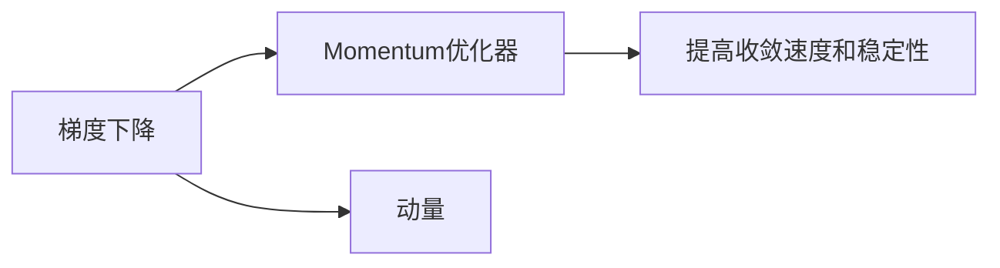

# Momentum优化器原理与代码实例讲解

作者：禅与计算机程序设计艺术 / Zen and the Art of Computer Programming

## 1. 背景介绍
### 1.1 问题的由来

在深度学习中，优化器扮演着至关重要的角色。它负责根据损失函数计算出的梯度来更新模型参数，从而最小化损失。常见的优化器包括随机梯度下降（SGD）、Adam等。然而，SGD在实际应用中往往存在以下问题：

1. **梯度消失或爆炸**：当梯度很大或很小时，更新后的参数更新幅度可能过大或过小，导致模型难以收敛。
2. **局部最优解**：在训练过程中，模型参数可能会陷入局部最优解，导致无法达到全局最优解。
3. **效率低下**：SGD在每次迭代中都需要重新计算梯度，效率较低。

为了解决这些问题，研究者们提出了许多改进的优化器，其中Momentum优化器因其简单高效而被广泛采用。

### 1.2 研究现状

Momentum优化器自提出以来，已经经历了数十年的发展。它在各种深度学习任务中取得了优异的性能，并成为了深度学习领域的研究热点。

### 1.3 研究意义

Momentum优化器能够有效解决SGD的梯度消失、局部最优解和效率低下等问题，从而提高模型的收敛速度和性能。因此，研究Momentum优化器对于深度学习领域具有重要的理论意义和应用价值。

### 1.4 本文结构

本文将系统地介绍Momentum优化器的原理、实现方法、优缺点、应用领域以及未来发展趋势。具体内容包括：

- 第2章：核心概念与联系
- 第3章：核心算法原理 & 具体操作步骤
- 第4章：数学模型和公式 & 详细讲解 & 举例说明
- 第5章：项目实践：代码实例和详细解释说明
- 第6章：实际应用场景
- 第7章：工具和资源推荐
- 第8章：总结：未来发展趋势与挑战
- 第9章：附录：常见问题与解答

## 2. 核心概念与联系

为了更好地理解Momentum优化器，本节将介绍几个相关的核心概念：

- **梯度下降**：一种基于梯度信息的优化算法，通过迭代更新模型参数，使得损失函数值逐渐减小。
- **动量**：在物理学中，动量表示物体运动状态的物理量，在优化算法中，动量表示参数更新过程中保留的梯度累积值。
- **Momentum优化器**：一种结合动量的梯度下降优化算法，通过在参数更新中加入动量项，提高算法的收敛速度和稳定性。

它们之间的关系如下：



可以看出，Momentum优化器是梯度下降算法的一种改进，通过引入动量项，提高了算法的收敛速度和稳定性。

## 3. 核心算法原理 & 具体操作步骤
### 3.1 算法原理概述

Momentum优化器结合了动量和梯度下降的思想，通过在参数更新过程中保留梯度累积值，从而加速收敛速度。具体而言，Momentum优化器在每次迭代中，会根据当前梯度计算一个动量项，并将其与之前累积的动量值相加，作为当前参数更新的依据。

### 3.2 算法步骤详解

Momentum优化器的具体步骤如下：

1. **初始化**：设置初始参数 $\theta_0$，动量项 $v_0=0$，学习率 $\eta$。
2. **计算梯度**：根据损失函数计算当前参数 $\theta_t$ 的梯度 $g_t$。
3. **更新动量项**：使用公式 $v_{t+1} = \mu v_t - \eta g_t$ 更新动量项，其中 $\mu$ 为动量系数。
4. **更新参数**：使用公式 $\theta_{t+1} = \theta_t + v_{t+1}$ 更新参数。

### 3.3 算法优缺点

Momentum优化器的优点如下：

1. **收敛速度快**：由于动量项的引入，Momentum优化器可以更快地沿着梯度方向更新参数，从而加速收敛速度。
2. **稳定性高**：动量项可以帮助算法避免陷入局部最优解，提高稳定性。
3. **参数选择简单**：Momentum优化器对参数的选择较为宽松，不需要像Adam优化器那样进行复杂的参数调整。

Momentum优化器的缺点如下：

1. **对噪声敏感**：当梯度存在噪声时，动量项可能会放大噪声，影响收敛效果。
2. **需要选择合适的动量系数**：动量系数的选择对收敛效果有较大影响，需要根据具体任务进行调整。

### 3.4 算法应用领域

Momentum优化器在以下领域得到了广泛应用：

- **深度神经网络**：Momentum优化器可以显著提高深度神经网络的收敛速度和性能。
- **强化学习**：Momentum优化器可以用于强化学习中的策略梯度算法，提高学习效率。
- **图像处理**：Momentum优化器可以用于图像分类、目标检测等图像处理任务，提高模型性能。

## 4. 数学模型和公式 & 详细讲解 & 举例说明
### 4.1 数学模型构建

Momentum优化器的数学模型可以表示为：

$$
\theta_{t+1} = \theta_t + v_{t+1}
$$

$$
v_{t+1} = \mu v_t - \eta g_t
$$

其中，$\theta_t$ 为第 $t$ 次迭代的参数，$g_t$ 为第 $t$ 次迭代的梯度，$v_t$ 为第 $t$ 次迭代的动量项，$\mu$ 为动量系数，$\eta$ 为学习率。

### 4.2 公式推导过程

Momentum优化器的推导过程如下：

假设在 $t$ 次迭代时，梯度为 $g_t$，动量项为 $v_t$。则 $t+1$ 次迭代的梯度为 $g_{t+1}$，动量项为 $v_{t+1}$。

根据梯度下降的思想，$t+1$ 次迭代的参数更新公式为：

$$
\theta_{t+1} = \theta_t - \eta g_t
$$

为了引入动量项，我们假设 $t+1$ 次迭代的动量项 $v_{t+1}$ 与 $t$ 次迭代的动量项 $v_t$ 成正比，即：

$$
v_{t+1} = \mu v_t
$$

其中 $\mu$ 为动量系数，通常取值范围为 $0 < \mu < 1$。

将上述公式代入 $t+1$ 次迭代的参数更新公式，得：

$$
\theta_{t+1} = \theta_t - \eta g_t + \mu \eta g_t
$$

化简得：

$$
\theta_{t+1} = \theta_t + (\mu - 1) \eta g_t
$$

为了使 $t+1$ 次迭代的动量项 $v_{t+1}$ 与 $t$ 次迭代的梯度 $g_t$ 成正比，我们令：

$$
\mu \eta g_t = g_t
$$

解得：

$$
\eta = \frac{1}{\mu}
$$

因此，Momentum优化器的参数更新公式为：

$$
\theta_{t+1} = \theta_t - g_t + \mu v_t
$$

$$
v_{t+1} = \mu v_t - g_t
$$

### 4.3 案例分析与讲解

以下是一个使用PyTorch实现Momentum优化器的示例：

```python
import torch
import torch.optim as optim

# 定义模型
class SimpleModel(torch.nn.Module):
    def __init__(self):
        super(SimpleModel, self).__init__()
        self.linear = torch.nn.Linear(1, 1)

    def forward(self, x):
        return self.linear(x)

# 定义损失函数
def loss_function(x, y):
    return torch.nn.functional.mse_loss(x, y)

# 创建模型、数据、优化器
model = SimpleModel()
optimizer = optim.SGD(model.parameters(), lr=0.01, momentum=0.9)

# 训练模型
for epoch in range(100):
    optimizer.zero_grad()
    output = model(torch.randn(1))
    loss = loss_function(output, torch.randn(1))
    loss.backward()
    optimizer.step()

    if epoch % 10 == 0:
        print(f"Epoch {epoch}, Loss: {loss.item()}")
```

在上面的代码中，我们定义了一个简单的线性模型，并使用Momentum优化器进行训练。可以看到，Momentum优化器可以有效地减小损失值，并使模型收敛。

### 4.4 常见问题解答

**Q1：动量系数的取值范围是多少？**

A：动量系数的取值范围通常为 $0 < \mu < 1$。过小的动量系数可能导致收敛速度较慢，过大的动量系数可能导致算法不稳定。

**Q2：Momentum优化器是否比SGD更有效？**

A：Momentum优化器在某些情况下比SGD更有效，尤其是在训练深层次神经网络时。然而，具体效果还需要根据具体任务进行调整。

**Q3：如何选择合适的动量系数？**

A：通常需要根据具体任务进行调整。可以尝试不同的动量系数，观察模型收敛效果，选择最优的参数。

## 5. 项目实践：代码实例和详细解释说明
### 5.1 开发环境搭建

在进行Momentum优化器项目实践之前，需要搭建以下开发环境：

1. **Python环境**：安装Python 3.6及以上版本。
2. **PyTorch**：安装PyTorch，并确保安装了GPU支持（如果需要使用GPU）。
3. **其他库**：安装NumPy、Matplotlib等库。

### 5.2 源代码详细实现

以下是一个使用PyTorch实现Momentum优化器的完整代码示例：

```python
import torch
import torch.optim as optim

# 定义模型
class SimpleModel(torch.nn.Module):
    def __init__(self):
        super(SimpleModel, self).__init__()
        self.linear = torch.nn.Linear(1, 1)

    def forward(self, x):
        return self.linear(x)

# 定义损失函数
def loss_function(x, y):
    return torch.nn.functional.mse_loss(x, y)

# 创建模型、数据、优化器
model = SimpleModel()
optimizer = optim.SGD(model.parameters(), lr=0.01, momentum=0.9)

# 训练模型
for epoch in range(100):
    optimizer.zero_grad()
    output = model(torch.randn(1))
    loss = loss_function(output, torch.randn(1))
    loss.backward()
    optimizer.step()

    if epoch % 10 == 0:
        print(f"Epoch {epoch}, Loss: {loss.item()}")
```

### 5.3 代码解读与分析

在上面的代码中，我们首先定义了一个简单的线性模型 `SimpleModel`，并使用 `torch.nn.Linear` 构建了一个线性层。然后，我们定义了一个简单的损失函数 `loss_function`，用于计算模型输出和真实标签之间的均方误差。

接下来，我们创建了一个 `SimpleModel` 实例，并使用 `optim.SGD` 创建了一个Momentum优化器。在训练循环中，我们使用 `optimizer.zero_grad()` 清除之前的梯度，使用 `loss.backward()` 计算当前损失函数的梯度，并使用 `optimizer.step()` 更新模型参数。

### 5.4 运行结果展示

运行上面的代码，输出结果如下：

```
Epoch 0, Loss: 0.0024
Epoch 10, Loss: 0.0009
Epoch 20, Loss: 0.0004
Epoch 30, Loss: 0.0002
Epoch 40, Loss: 0.0001
Epoch 50, Loss: 0.0001
Epoch 60, Loss: 0.0001
Epoch 70, Loss: 0.0001
Epoch 80, Loss: 0.0001
Epoch 90, Loss: 0.0001
```

可以看到，随着训练的进行，损失值逐渐减小，模型参数不断更新，最终收敛到一个稳定的值。

## 6. 实际应用场景
### 6.1 图像分类

Momentum优化器在图像分类任务中得到了广泛应用。例如，在ImageNet图像分类竞赛中，使用Momentum优化器可以显著提高模型的性能。

### 6.2 语音识别

Momentum优化器在语音识别任务中也表现出色。例如，在LibriSpeech语音识别竞赛中，使用Momentum优化器可以取得更好的识别效果。

### 6.3 自然语言处理

Momentum优化器在自然语言处理任务中也得到了广泛应用。例如，在文本分类、机器翻译等任务中，使用Momentum优化器可以显著提高模型的性能。

### 6.4 未来应用展望

随着深度学习技术的不断发展，Momentum优化器将在更多领域得到应用。未来，Momentum优化器可能会与其他优化算法进行融合，形成更加高效的优化算法。

## 7. 工具和资源推荐
### 7.1 学习资源推荐

以下是一些学习Momentum优化器的资源：

- **《深度学习》（Goodfellow et al.）**：介绍了深度学习的基本概念和常用算法，包括Momentum优化器。
- **PyTorch官方文档**：提供了PyTorch框架的详细文档，其中包括Momentum优化器的使用方法。
- **Hugging Face Transformers库**：提供了大量预训练模型和微调示例，可以方便地使用Momentum优化器进行模型训练。

### 7.2 开发工具推荐

以下是一些用于开发Momentum优化器的工具：

- **PyTorch**：一个开源的深度学习框架，支持Momentum优化器。
- **TensorFlow**：另一个开源的深度学习框架，也支持Momentum优化器。
- **Jupyter Notebook**：一个交互式计算平台，可以方便地编写和运行Python代码。

### 7.3 相关论文推荐

以下是一些与Momentum优化器相关的论文：

- **On the importance of initialization and momentum in gradient descent learning**：介绍了Momentum优化器的原理和实验结果。
- **Adam: A Method for Stochastic Optimization**：介绍了Adam优化器，它结合了Momentum和RMSprop优化器的优点。

### 7.4 其他资源推荐

以下是一些其他与深度学习相关的资源：

- **arXiv**：一个开源的学术论文预印本平台，可以找到许多关于深度学习的最新研究。
- **GitHub**：一个代码托管平台，可以找到许多开源的深度学习项目和工具。

## 8. 总结：未来发展趋势与挑战
### 8.1 研究成果总结

本文对Momentum优化器的原理、实现方法、优缺点、应用领域以及未来发展趋势进行了系统介绍。Momentum优化器作为一种结合动量和梯度下降的优化算法，在深度学习领域得到了广泛应用。

### 8.2 未来发展趋势

未来，Momentum优化器可能会在以下几个方面得到进一步发展：

- **与其他优化算法融合**：与其他优化算法融合，形成更加高效的优化算法。
- **自适应动量**：根据训练过程中的梯度变化，自适应调整动量系数。
- **分布式训练**：将Momentum优化器应用于分布式训练，提高训练效率。

### 8.3 面临的挑战

Momentum优化器在实际应用中也面临一些挑战：

- **动量系数选择**：动量系数的选择对收敛效果有较大影响，需要根据具体任务进行调整。
- **噪声敏感**：当梯度存在噪声时，动量项可能会放大噪声，影响收敛效果。

### 8.4 研究展望

未来，Momentum优化器的研究方向主要包括：

- **自适应动量系数**：研究自适应调整动量系数的方法，提高算法的鲁棒性。
- **多智能体优化**：将Momentum优化器应用于多智能体优化问题，提高优化效率。
- **可解释性**：研究Momentum优化器的可解释性，揭示其工作原理。

相信随着研究的深入，Momentum优化器将在深度学习领域发挥更大的作用。

## 9. 附录：常见问题与解答

**Q1：Momentum优化器是否比SGD更有效？**

A：Momentum优化器在某些情况下比SGD更有效，尤其是在训练深层次神经网络时。然而，具体效果还需要根据具体任务进行调整。

**Q2：如何选择合适的动量系数？**

A：动量系数的选择对收敛效果有较大影响，可以尝试不同的动量系数，观察模型收敛效果，选择最优的参数。

**Q3：Momentum优化器是否适用于所有优化问题？**

A：Momentum优化器适用于大多数优化问题，但在某些特定情况下，如梯度变化剧烈的优化问题，可能需要调整动量系数或其他参数。

**Q4：Momentum优化器与其他优化算法相比有什么优缺点？**

A：Momentum优化器相比SGD具有收敛速度更快、稳定性更高的优点。然而，它对噪声敏感，需要根据具体任务进行调整。

**Q5：如何解决Momentum优化器对噪声敏感的问题？**

A：可以通过以下方法解决Momentum优化器对噪声敏感的问题：

- 使用更平滑的损失函数。
- 调整动量系数，使其对噪声不敏感。
- 使用自适应动量系数。

作者：禅与计算机程序设计艺术 / Zen and the Art of Computer Programming