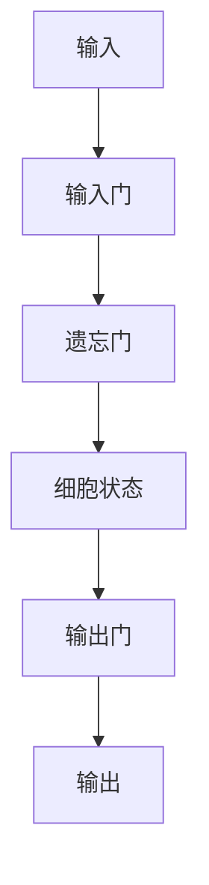

## 1. 背景介绍

在人工智能领域，循环神经网络（Recurrent Neural Network，RNN）是一种非常重要的模型，它可以处理序列数据，如语音、文本、时间序列等。但是，传统的RNN存在着梯度消失和梯度爆炸的问题，导致长序列的信息无法被有效地传递。为了解决这个问题，Hochreiter和Schmidhuber在1997年提出了一种新的循环神经网络模型——长短时记忆网络（Long Short-Term Memory，LSTM）。

LSTM是一种特殊的RNN，它可以有效地处理长序列数据，并且在语音识别、自然语言处理、机器翻译等领域取得了很好的效果。本文将详细介绍LSTM的原理和代码实现。

## 2. 核心概念与联系

### 2.1 循环神经网络（RNN）

循环神经网络是一种能够处理序列数据的神经网络模型。它的输入不仅仅依赖于当前时刻的输入，还依赖于之前的输入。在RNN中，每个时刻的输出都会被传递到下一个时刻作为输入，形成一个循环的结构。

### 2.2 长短时记忆网络（LSTM）

LSTM是一种特殊的RNN，它可以有效地处理长序列数据。LSTM的核心思想是引入了三个门控制器（输入门、遗忘门、输出门），用来控制信息的流动。这三个门控制器可以学习到什么时候需要记忆、什么时候需要遗忘、什么时候需要输出。

## 3. 核心算法原理具体操作步骤

### 3.1 LSTM的结构

LSTM的结构如下图所示：



LSTM的结构包括四个部分：输入门、遗忘门、细胞状态和输出门。输入门和遗忘门用来控制信息的流入和流出，细胞状态用来存储信息，输出门用来控制信息的输出。

### 3.2 输入门

输入门用来控制新的输入信息是否需要被加入到细胞状态中。输入门的计算公式如下：

$$i_t = \sigma(W_i \cdot [h_{t-1}, x_t] + b_i)$$

其中，$h_{t-1}$是上一个时刻的隐藏状态，$x_t$是当前时刻的输入，$W_i$和$b_i$是输入门的权重和偏置，$\sigma$是sigmoid函数。

### 3.3 遗忘门

遗忘门用来控制哪些信息需要从细胞状态中遗忘。遗忘门的计算公式如下：

$$f_t = \sigma(W_f \cdot [h_{t-1}, x_t] + b_f)$$

其中，$h_{t-1}$是上一个时刻的隐藏状态，$x_t$是当前时刻的输入，$W_f$和$b_f$是遗忘门的权重和偏置，$\sigma$是sigmoid函数。

### 3.4 细胞状态

细胞状态用来存储信息。细胞状态的计算公式如下：

$$C_t = f_t \cdot C_{t-1} + i_t \cdot \tanh(W_c \cdot [h_{t-1}, x_t] + b_c)$$

其中，$f_t$是遗忘门的输出，$C_{t-1}$是上一个时刻的细胞状态，$i_t$是输入门的输出，$W_c$和$b_c$是细胞状态的权重和偏置，$\tanh$是双曲正切函数。

### 3.5 输出门

输出门用来控制哪些信息需要输出。输出门的计算公式如下：

$$o_t = \sigma(W_o \cdot [h_{t-1}, x_t] + b_o)$$

其中，$h_{t-1}$是上一个时刻的隐藏状态，$x_t$是当前时刻的输入，$W_o$和$b_o$是输出门的权重和偏置，$\sigma$是sigmoid函数。

### 3.6 隐藏状态

隐藏状态是LSTM的输出，它的计算公式如下：

$$h_t = o_t \cdot \tanh(C_t)$$

其中，$o_t$是输出门的输出，$C_t$是当前时刻的细胞状态，$\tanh$是双曲正切函数。

## 4. 数学模型和公式详细讲解举例说明

假设我们有一个长度为$n$的序列$x_1, x_2, ..., x_n$，我们要用LSTM来预测下一个值$x_{n+1}$。我们可以将序列中的每个值作为LSTM的输入，然后将最后一个隐藏状态作为输出，用来预测$x_{n+1}$。

LSTM的损失函数可以使用交叉熵损失函数，计算公式如下：

$$L = -\frac{1}{n}\sum_{i=1}^{n}y_i\log(\hat{y_i}) + (1-y_i)\log(1-\hat{y_i})$$

其中，$y_i$是真实值，$\hat{y_i}$是预测值。

## 5. 项目实践：代码实例和详细解释说明

下面是使用Python实现LSTM的代码：

```python
import numpy as np

class LSTM:
    def __init__(self, input_size, hidden_size):
        self.input_size = input_size
        self.hidden_size = hidden_size
        self.W_i = np.random.randn(input_size + hidden_size, hidden_size)
        self.b_i = np.zeros(hidden_size)
        self.W_f = np.random.randn(input_size + hidden_size, hidden_size)
        self.b_f = np.zeros(hidden_size)
        self.W_c = np.random.randn(input_size + hidden_size, hidden_size)
        self.b_c = np.zeros(hidden_size)
        self.W_o = np.random.randn(input_size + hidden_size, hidden_size)
        self.b_o = np.zeros(hidden_size)
        self.h = np.zeros(hidden_size)
        self.C = np.zeros(hidden_size)
        
    def sigmoid(self, x):
        return 1 / (1 + np.exp(-x))
    
    def tanh(self, x):
        return np.tanh(x)
    
    def forward(self, x):
        i = self.sigmoid(np.dot(np.concatenate((self.h, x)), self.W_i) + self.b_i)
        f = self.sigmoid(np.dot(np.concatenate((self.h, x)), self.W_f) + self.b_f)
        C_ = self.tanh(np.dot(np.concatenate((self.h, x)), self.W_c) + self.b_c)
        self.C = f * self.C + i * C_
        o = self.sigmoid(np.dot(np.concatenate((self.h, x)), self.W_o) + self.b_o)
        self.h = o * self.tanh(self.C)
        return self.h
```

这段代码实现了一个简单的LSTM模型，包括输入门、遗忘门、细胞状态、输出门和隐藏状态。在前向传播过程中，输入$x$被拼接到上一个时刻的隐藏状态$h$中，然后分别经过输入门、遗忘门、细胞状态和输出门的计算，最后得到当前时刻的隐藏状态$h$。

## 6. 实际应用场景

LSTM在语音识别、自然语言处理、机器翻译等领域都有广泛的应用。例如，在语音识别中，LSTM可以将语音信号转换成文本；在自然语言处理中，LSTM可以用来进行情感分析、命名实体识别等任务；在机器翻译中，LSTM可以将一种语言翻译成另一种语言。

## 7. 工具和资源推荐

- TensorFlow：一个开源的机器学习框架，支持LSTM等循环神经网络模型。
- PyTorch：一个开源的机器学习框架，支持LSTM等循环神经网络模型。
- Keras：一个高级神经网络API，支持LSTM等循环神经网络模型。

## 8. 总结：未来发展趋势与挑战

LSTM作为一种特殊的RNN，已经在语音识别、自然语言处理、机器翻译等领域取得了很好的效果。未来，LSTM还有很大的发展空间，可以用来处理更加复杂的序列数据，如视频、图像等。但是，LSTM也面临着一些挑战，如训练时间长、过拟合等问题。

## 9. 附录：常见问题与解答

Q：LSTM和传统的RNN有什么区别？

A：LSTM引入了三个门控制器（输入门、遗忘门、输出门），用来控制信息的流动，解决了传统RNN存在的梯度消失和梯度爆炸的问题。

Q：LSTM的损失函数是什么？

A：LSTM的损失函数可以使用交叉熵损失函数。

Q：LSTM在哪些领域有应用？

A：LSTM在语音识别、自然语言处理、机器翻译等领域都有广泛的应用。

Q：LSTM面临哪些挑战？

A：LSTM面临着训练时间长、过拟合等问题。