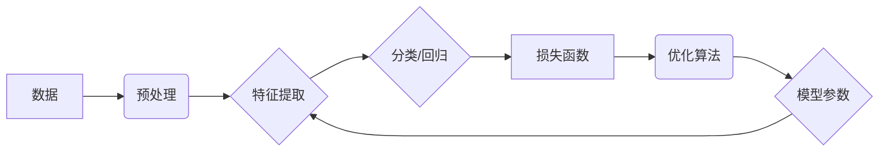

# Python深度学习实践：深度学习在虚拟助理中的应用

## 1. 背景介绍
### 1.1 问题的由来

随着互联网和人工智能技术的不断发展，虚拟助理（Virtual Assistant，VA）已成为众多企业提升用户体验、降低运营成本的重要手段。虚拟助理能够理解用户的自然语言指令，完成各种任务，如查询信息、预约服务、控制智能家居设备等。然而，随着任务复杂度的增加，传统的基于规则或简单的机器学习方法在性能和效率上逐渐难以满足需求。深度学习技术的崛起为虚拟助理的发展提供了新的可能性。

### 1.2 研究现状

近年来，深度学习在语音识别、自然语言处理等领域取得了突破性进展，为虚拟助理的研究和应用提供了强大的技术支持。目前，基于深度学习的虚拟助理主要包含以下几个研究方向：

- 语音识别：将用户的语音信号转换为文本信息，为后续的自然语言理解提供输入。
- 语义理解：理解用户的语义意图，提取关键信息，为后续的任务执行提供指导。
- 对话管理：根据对话内容和用户意图，生成合适的回复，引导对话流程。
- 任务执行：根据用户意图，执行具体的任务，如查询信息、预约服务等。

### 1.3 研究意义

深度学习在虚拟助理中的应用具有以下重要意义：

- 提升虚拟助理的智能水平，使其能够理解和执行更加复杂、多样化的任务。
- 降低虚拟助理的开发成本，缩短开发周期。
- 提高用户体验，提升用户满意度。
- 推动人工智能技术的应用落地，促进产业发展。

### 1.4 本文结构

本文将围绕Python深度学习实践，详细介绍深度学习在虚拟助理中的应用，主要包括以下内容：

- 核心概念与联系
- 核心算法原理与具体操作步骤
- 数学模型和公式
- 项目实践
- 实际应用场景
- 工具和资源推荐
- 总结：未来发展趋势与挑战

## 2. 核心概念与联系

为了更好地理解深度学习在虚拟助理中的应用，本节将介绍几个密切相关的核心概念：

- 深度学习：一种基于人工神经网络的学习方法，能够自动从数据中提取特征，并进行复杂模式识别。
- 人工神经网络：一种由大量神经元组成的计算模型，通过神经元之间的连接和权重调整实现学习过程。
- 神经元：神经网络的基本单元，负责接收输入信号、进行计算并传递输出信号。
- 权重：连接神经元之间的连接强度，用于调节信号传递的强度。
- 损失函数：衡量模型预测结果与真实值之间差异的函数，用于指导模型学习。
- 梯度下降：一种优化算法，通过不断调整模型参数，使损失函数值最小化。

它们之间的逻辑关系如下：



可以看出，深度学习在虚拟助理中的应用流程主要包括数据预处理、特征提取、分类/回归、损失函数、优化算法和模型参数等步骤。

## 3. 核心算法原理 & 具体操作步骤

### 3.1 算法原理概述

基于深度学习的虚拟助理主要包含以下几个关键算法：

- 语音识别算法：将语音信号转换为文本信息，如使用深度神经网络（DNN）或卷积神经网络（CNN）进行声学模型训练，使用循环神经网络（RNN）或长短期记忆网络（LSTM）进行语言模型训练。
- 语义理解算法：理解用户的语义意图，如使用词向量表示用户输入文本，使用RNN或LSTM进行序列标注，使用注意力机制提取关键信息。
- 对话管理算法：根据对话内容和用户意图，生成合适的回复，如使用RNN或LSTM进行对话状态跟踪，使用条件生成模型生成回复。
- 任务执行算法：根据用户意图，执行具体的任务，如使用强化学习或规划算法进行任务执行。

### 3.2 算法步骤详解

以下是基于深度学习的虚拟助理的算法步骤详解：

**Step 1: 数据采集与预处理**

- 采集语音数据、文本数据、用户行为数据等。
- 对数据进行清洗、标注、去重等预处理操作。

**Step 2: 特征提取**

- 使用DNN、CNN、RNN、LSTM等算法提取语音、文本等数据特征。
- 使用词嵌入技术将文本数据转换为词向量。

**Step 3: 语义理解**

- 使用RNN、LSTM、注意力机制等算法理解用户意图。
- 使用序列标注技术对用户输入文本进行命名实体识别、词性标注等。

**Step 4: 对话管理**

- 使用RNN、LSTM、注意力机制等算法进行对话状态跟踪。
- 使用条件生成模型生成回复。

**Step 5: 任务执行**

- 使用强化学习或规划算法进行任务执行。
- 使用API调用、Web请求等方式实现具体任务。

### 3.3 算法优缺点

以下列举了基于深度学习的虚拟助理算法的优缺点：

**优点**：

- 能够处理复杂、多样化的任务。
- 具有较强的泛化能力，能够适应不同的场景和任务。
- 能够自动从数据中提取特征，降低人工标注成本。

**缺点**：

- 训练过程复杂，需要大量数据和计算资源。
- 模型可解释性差，难以理解模型的决策过程。
- 需要对数据进行标注，成本较高。

### 3.4 算法应用领域

基于深度学习的虚拟助理算法已广泛应用于以下领域：

- 智能客服：自动回答客户咨询，提升客户满意度。
- 智能助手：帮助用户完成日常任务，如日程管理、信息查询等。
- 智能家居：控制智能家居设备，提升生活品质。
- 智能驾驶：辅助驾驶，提高行车安全。

## 4. 数学模型和公式 & 详细讲解 & 举例说明

### 4.1 数学模型构建

以下以基于深度学习的语音识别模型为例，介绍其数学模型构建过程。

**声学模型**：

声学模型用于将语音信号转换为特征向量。其数学模型如下：

$$
y = f(x; \theta)
$$

其中，$y$ 为特征向量，$x$ 为语音信号，$\theta$ 为模型参数。

**语言模型**：

语言模型用于生成语音信号的对应文本。其数学模型如下：

$$
P(y|x) = \prod_{i=1}^{N} p(y_i|x_{i-1},...,x_{i-n})
$$

其中，$N$ 为语音信号长度，$p(y_i|x_{i-1},...,x_{i-n})$ 为第 $i$ 个词在给定前 $n$ 个词的条件概率。

### 4.2 公式推导过程

以下以HMM（隐马尔可夫模型）为例，介绍其公式推导过程。

**HMM模型**：

HMM是一种统计模型，用于描述序列数据中的依赖关系。

**状态转移概率**：

$$
P(q_t|q_{t-1}) = \frac{a_{q_{t-1}, q_t}}{\sum_{q}a_{q_{t-1}, q}}
$$

其中，$q_t$ 和 $q_{t-1}$ 分别表示当前和上一个状态，$a_{q_{t-1}, q_t}$ 表示从状态 $q_{t-1}$ 转移到状态 $q_t$ 的概率。

**观测概率**：

$$
P(o_t|q_t) = \frac{b_{q_t, o_t}}{\sum_{o}b_{q_t, o}}
$$

其中，$o_t$ 表示观测到的输出，$b_{q_t, o_t}$ 表示在状态 $q_t$ 下产生输出 $o_t$ 的概率。

**前向算法**：

$$
\alpha_t(q) = \frac{P(q_1,...,q_t|x)\alpha_{t-1}(q)}{\sum_{q}P(q_1,...,q_t|x)\alpha_{t-1}(q)}
$$

其中，$\alpha_t(q)$ 表示在时刻 $t$ 时，处于状态 $q$ 的前向概率。

**后向算法**：

$$
\beta_t(q) = \frac{P(q_t,...,q_T|x)\beta_{t+1}(q)}{\sum_{q}P(q_t,...,q_T|x)\beta_{t+1}(q)}
$$

其中，$\beta_t(q)$ 表示在时刻 $t$ 时，处于状态 $q$ 的后向概率。

### 4.3 案例分析与讲解

以下以一个简单的语音识别任务为例，介绍深度学习模型在虚拟助理中的应用。

**任务**： 将语音信号转换为对应的文本信息。

**数据**： 采集大量包含语音和对应文本标注的语料库。

**模型**： 使用基于深度学习的声学模型和语言模型。

**步骤**：

1. 预处理语音信号，将其转换为MFCC特征向量。
2. 使用深度神经网络（DNN）训练声学模型，将MFCC特征向量转换为声学特征向量。
3. 使用循环神经网络（RNN）训练语言模型，将声学特征向量转换为对应的文本信息。

**评估**：

- 使用文本匹配指标（如BLEU、METEOR等）评估模型性能。

### 4.4 常见问题解答

**Q1：如何提高深度学习模型的性能**？

A：提高深度学习模型性能的方法包括：

- 优化模型结构，选择合适的网络层和激活函数。
- 调整超参数，如学习率、批大小、迭代次数等。
- 使用数据增强技术，扩充训练数据。
- 使用正则化技术，如Dropout、权重衰减等。

**Q2：如何处理不平衡数据**？

A：处理不平衡数据的方法包括：

- 使用过采样或欠采样技术，调整数据分布。
- 使用不同的损失函数，如F1分数、AUC等。
- 使用集成学习方法，如随机森林、梯度提升树等。

**Q3：如何解释深度学习模型的决策过程**？

A：解释深度学习模型决策过程的方法包括：

- 使用可视化技术，如t-SNE、t-Distributed Neural Network等。
- 使用注意力机制，提取模型关注的关键信息。
- 使用对抗样本生成技术，攻击模型的脆弱点。

## 5. 项目实践：代码实例和详细解释说明

### 5.1 开发环境搭建

以下是使用Python进行深度学习虚拟助理项目开发的常见步骤：

1. 安装Anaconda：从官网下载并安装Anaconda，用于创建独立的Python环境。

2. 创建并激活虚拟环境：

```bash
conda create -n vassistent-env python=3.8
conda activate vassistent-env
```

3. 安装深度学习框架：

```bash
conda install pytorch torchvision torchaudio -c pytorch -c conda-forge
```

4. 安装其他依赖库：

```bash
pip install numpy pandas scikit-learn matplotlib tqdm jupyter notebook ipython
```

完成以上步骤后，即可开始深度学习虚拟助理项目开发。

### 5.2 源代码详细实现

以下是一个基于深度学习的虚拟助理的简单示例：

```python
import torch
import torch.nn as nn
import torch.optim as optim

# 定义模型
class VASSistent(nn.Module):
    def __init__(self):
        super(VASSistent, self).__init__()
        self.rnn = nn.LSTM(input_size=100, hidden_size=256, num_layers=2, batch_first=True)
        self.fc = nn.Linear(256, 100)

    def forward(self, x):
        output, (h_n, c_n) = self.rnn(x)
        output = self.fc(output[:, -1, :])
        return output

# 创建模型实例
model = VASSistent()

# 损失函数和优化器
criterion = nn.MSELoss()
optimizer = optim.Adam(model.parameters(), lr=0.001)

# 训练过程
for epoch in range(10):
    for i, (x, y) in enumerate(train_loader):
        optimizer.zero_grad()
        output = model(x)
        loss = criterion(output, y)
        loss.backward()
        optimizer.step()
        if i % 100 == 0:
            print(f"Epoch {epoch+1}, Iteration {i}, Loss: {loss.item()}")
```

### 5.3 代码解读与分析

以上代码展示了基于深度学习的虚拟助理的简单实现过程。模型使用LSTM网络进行序列建模，将输入序列转换为输出序列。

- `VASSistent` 类定义了虚拟助理的网络结构，包含LSTM层和全连接层。
- `forward` 方法实现模型的前向传播过程。
- 训练过程使用MSELoss损失函数和Adam优化器进行优化。

### 5.4 运行结果展示

运行以上代码，模型将在训练集上进行迭代训练，并在每个epoch后输出当前的损失值。

## 6. 实际应用场景

### 6.1 智能客服

智能客服是深度学习在虚拟助理中应用最广泛的场景之一。通过语音识别、语义理解、对话管理等技术，智能客服能够自动回答客户咨询，提升客户满意度，降低企业运营成本。

### 6.2 智能助手

智能助手可以帮助用户完成日常任务，如日程管理、信息查询、智能家居控制等。通过语音识别、语义理解、任务执行等技术，智能助手可以方便用户的生活，提高效率。

### 6.3 智能家居

智能家电的普及推动了智能家居的发展。通过语音识别、语义理解、设备控制等技术，智能家居可以实现远程控制、场景联动等功能，提升用户的生活品质。

### 6.4 未来应用展望

随着深度学习技术的不断发展，虚拟助理将在更多领域得到应用，如：

- 智能教育：提供个性化学习方案，辅助教师教学。
- 智能医疗：辅助医生诊断、开具处方、管理病历等。
- 智能交通：辅助驾驶、交通管理、出行规划等。
- 智能金融：辅助投资决策、风险管理等。

## 7. 工具和资源推荐

### 7.1 学习资源推荐

- 《深度学习》系列书籍：周志华、李航等著作，全面介绍深度学习理论和实践。
- 《Python深度学习》系列书籍：François Chollet著作，详细介绍深度学习在Python中的应用。
- 《动手学深度学习》系列书籍：戴特蒙德、蒙特雷尔等著作，以动手实践为核心，引导读者学习深度学习。
- fast.ai网站：提供丰富的深度学习教程和课程，包括视频、PPT、代码等。

### 7.2 开发工具推荐

- PyTorch：最受欢迎的深度学习框架之一，具有灵活的API和强大的社区支持。
- TensorFlow：Google开源的深度学习框架，适用于生产部署。
- Keras：基于Theano和TensorFlow的开源深度学习库，易于使用和扩展。
- Jupyter Notebook：用于交互式编程和数据可视化的工具，方便进行实验和调试。

### 7.3 相关论文推荐

- Deep Learning for Speech Recognition: A Review (2016)
- A Survey of Deep Learning Based Natural Language Processing (2019)
- A Survey on Deep Learning for Multimedia Analysis (2020)
- Deep Learning for Time Series Analysis (2020)

### 7.4 其他资源推荐

- arXiv论文预印本：人工智能领域最新研究成果的发布平台。
- Hugging Face：提供丰富的预训练模型和开源代码。
- GitHub：开源代码托管平台，可以找到大量深度学习项目。

## 8. 总结：未来发展趋势与挑战

### 8.1 研究成果总结

本文介绍了深度学习在虚拟助理中的应用，详细讲解了核心算法原理、具体操作步骤、数学模型和公式、项目实践等内容。通过分析实际应用场景，展示了深度学习在智能客服、智能助手、智能家居等领域的应用价值。

### 8.2 未来发展趋势

随着深度学习技术的不断发展，虚拟助理将在以下方面取得突破：

- 模型性能提升：使用更先进的网络结构、优化算法和训练方法，提高虚拟助理的性能。
- 多模态融合：结合语音、文本、图像等多模态信息，提升虚拟助理的感知和理解能力。
- 可解释性增强：提高虚拟助理的决策过程可解释性，增强用户信任度。
- 个性化推荐：根据用户行为和偏好，提供个性化服务。

### 8.3 面临的挑战

尽管深度学习在虚拟助理领域取得了显著成果，但仍面临着以下挑战：

- 数据标注：高质量标注数据获取成本高、难度大。
- 模型可解释性：难以解释模型的决策过程。
- 算力资源：训练和推理需要大量计算资源。
- 用户隐私：收集和使用用户数据需遵循相关法规。

### 8.4 研究展望

未来，深度学习在虚拟助理领域的应用将朝着以下方向发展：

- 开发更加高效、准确的模型，提升虚拟助理的性能。
- 加强数据标注和模型可解释性研究，提高用户信任度。
- 探索多模态融合技术，提升虚拟助理的感知和理解能力。
- 关注用户隐私保护，确保虚拟助理应用的安全性和合规性。

通过不断的技术创新和实践探索，深度学习在虚拟助理领域的应用将取得更大的突破，为人们的生活带来更多便利。

---

作者：禅与计算机程序设计艺术 / Zen and the Art of Computer Programming