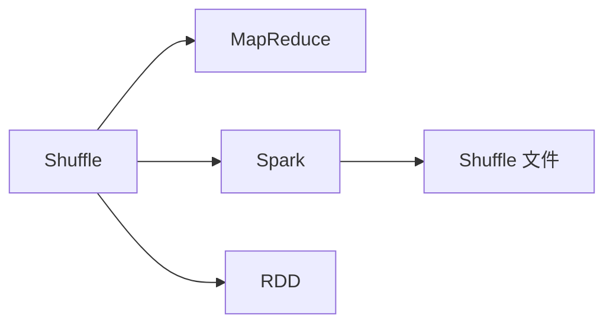

# Spark Shuffle原理与代码实例讲解

作者：禅与计算机程序设计艺术 / Zen and the Art of Computer Programming


## 1. 背景介绍
### 1.1 问题的由来

在分布式计算框架中，Shuffle 是一个重要的操作，它涉及数据的分区、重新分布和合并，是保证分布式计算正确性的关键。Apache Spark 作为一款流行的分布式计算框架，其 Shuffle 操作在性能和可靠性方面都进行了深入优化。本节将介绍 Shuffle 的由来、研究现状、意义和文章结构。

### 1.2 研究现状

Shuffle 作为分布式计算中的关键技术，在诸多领域都得到了广泛的研究和应用。现有研究主要集中于以下几个方面：

- Shuffle 性能优化：通过改进 Shuffle 算法、优化存储方式、利用内存管理等手段，提高 Shuffle 操作的效率。
- Shuffle 可靠性保证：研究 Shuffle 过程中的数据一致性、容错性等问题，确保 Shuffle 操作的可靠性。
- Shuffle 算法创新：探索新的 Shuffle 算法，提高 Shuffle 操作的灵活性和扩展性。

### 1.3 研究意义

Shuffle 在分布式计算中扮演着重要角色，其研究意义体现在以下几个方面：

- 提高分布式计算性能：优化 Shuffle 操作可以降低数据传输延迟、减少数据复制次数，从而提高分布式计算效率。
- 保证计算正确性：Shuffle 的可靠性是分布式计算正确性的基础，研究 Shuffle 的可靠性问题对于保障计算结果至关重要。
- 促进分布式计算发展：Shuffle 技术的研究将推动分布式计算领域的发展，为构建更加高效、可靠的分布式系统提供技术支持。

### 1.4 本文结构

本文将从 Shuffle 的核心概念、原理、算法、实践和未来发展趋势等方面进行全面介绍。具体章节安排如下：

- 第2章：介绍 Shuffle 的核心概念和联系。
- 第3章：阐述 Shuffle 的核心算法原理和具体操作步骤。
- 第4章：分析 Shuffle 中的数学模型、公式和案例。
- 第5章：通过代码实例讲解 Shuffle 的实现。
- 第6章：探讨 Shuffle 的实际应用场景。
- 第7章：推荐 Shuffle 相关的学习资源、开发工具和论文。
- 第8章：总结 Shuffle 的未来发展趋势与挑战。
- 第9章：附录，常见问题与解答。

## 2. 核心概念与联系
本节将介绍 Shuffle 相关的核心概念，并分析它们之间的联系。

- Shuffle：指在分布式计算中，将数据从源节点传输到目标节点，并进行重新分区的过程。
- MapReduce：一种经典的分布式计算模型，其 Shuffle 过程是保证计算正确性的关键。
- Spark：一款流行的分布式计算框架，其 Shuffle 操作在性能和可靠性方面进行了优化。
- RDD（弹性分布式数据集）：Spark 的基本数据抽象，其 Shuffle 操作是 RDD 转换操作的基础。
- Shuffle 文件：Shuffle 过程中产生的数据文件，包含分区信息和数据内容。

以下是 Shuffle 相关概念的逻辑关系图：



## 3. 核心算法原理 & 具体操作步骤
### 3.1 算法原理概述

Shuffle 算法的主要目标是实现数据的分区、传输和合并。以下是 Shuffle 算法的原理概述：

1. Partitioning：根据数据键（key）和分区函数（partitioner），将数据划分到不同的分区中。
2. Sorting：在每个分区内部对数据进行排序，确保相同键的数据在同一个分区中。
3. Writing：将排序后的数据写入 Shuffle 文件，为后续的 Shuffle 操作做准备。
4. Merging：在 Shuffle 文件读取阶段，合并来自不同分区的 Shuffle 文件，完成数据的最终合并。

### 3.2 算法步骤详解

以下是 Shuffle 算法的具体步骤：

**Step 1: Partitioning**

- 对输入数据进行键值对（key-value）拆分。
- 根据分区函数将键值对分配到不同的分区中。

**Step 2: Sorting**

- 在每个分区内部对键值对进行排序，保证相同键的数据在同一个分区中。

**Step 3: Writing**

- 将每个分区中的键值对写入 Shuffle 文件，并记录键对应的分区信息和数据偏移量。

**Step 4: Merging**

- 在 Shuffle 文件读取阶段，读取不同分区的 Shuffle 文件，并按分区信息对数据进行排序和合并。

### 3.3 算法优缺点

Shuffle 算法具有以下优点：

- 支持多种分区函数，满足不同场景下的需求。
- 可扩展性强，适用于大规模数据集。
- 可靠性高，通过多个 Shuffle 文件和容错机制保证数据完整性。

Shuffle 算法也存在以下缺点：

- 数据传输开销大，尤其是在数据量较大时。
- Shuffle 文件数量较多，可能导致存储资源不足。

### 3.4 算法应用领域

Shuffle 算法广泛应用于分布式计算框架，如 MapReduce、Spark 等。以下是一些典型的应用领域：

- MapReduce：用于大规模数据集的批处理计算。
- Spark：用于流处理、实时计算和批处理等多种场景。
- Flink：用于流处理和批处理等场景。

## 4. 数学模型和公式 & 详细讲解 & 举例说明
### 4.1 数学模型构建

Shuffle 算法的数学模型可以描述为：

$$
Shuffle = \{Partitioning, Sorting, Writing, Merging\}
$$

其中，Partitioning、Sorting、Writing、Merging 分别表示 Shuffle 的四个步骤。

### 4.2 公式推导过程

以下以 MapReduce 中的 Shuffle 算法为例，推导其公式。

**Step 1: Partitioning**

给定输入数据集 $D = \{d_1, d_2, \ldots, d_n\}$，其中每个数据项 $d_i$ 包含键值对 $k_i-v_i$。根据分区函数 $p(k_i)$ 将数据项分配到不同的分区中，得到分区结果 $P = \{P_1, P_2, \ldots, P_m\}$。

$$
P_i = \{d_i | p(k_i) = i\}, i = 1, 2, \ldots, m
$$

**Step 2: Sorting**

在分区 $P_i$ 内对数据项进行排序，得到排序结果 $S_i$。

$$
S_i = \{d_{i_1}, d_{i_2}, \ldots, d_{i_{|P_i|}}\} \text{ ，其中 } d_{i_j} \text{ 为 } P_i \text{ 中第 } j \text{ 个数据项}
$$

**Step 3: Writing**

将排序后的数据写入 Shuffle 文件，并记录键对应的分区信息和数据偏移量。

$$
Shuffle_{write}(P_i) = \{<k_{i_1}, offset_1>, <k_{i_2}, offset_2>, \ldots, <k_{i_{|P_i|}}, offset_{|P_i|}>\}
$$

**Step 4: Merging**

在 Shuffle 文件读取阶段，读取不同分区的 Shuffle 文件，并按分区信息对数据进行排序和合并。

$$
Shuffle_{merge}(P) = \{<k_{1}, v_1>, <k_2, v_2>, \ldots, <k_m, v_m>\}
$$

### 4.3 案例分析与讲解

以下以 Spark 中的 Shuffle 算法为例，分析其工作流程。

**Step 1: Partitioning**

Spark 首先对输入数据进行键值对拆分，并利用分区函数将键值对分配到不同的分区中。

**Step 2: Sorting**

在每个分区内部对键值对进行排序，保证相同键的数据在同一个分区中。

**Step 3: Writing**

将排序后的数据写入 Shuffle 文件，并记录键对应的分区信息和数据偏移量。

**Step 4: Merging**

在 Shuffle 文件读取阶段，读取不同分区的 Shuffle 文件，并按分区信息对数据进行排序和合并。

### 4.4 常见问题解答

**Q1：Shuffle 算法的性能瓶颈是什么？**

A：Shuffle 算法的性能瓶颈主要包括以下两个方面：
1. 数据传输开销：Shuffle 过程涉及大量数据在网络中的传输，容易成为性能瓶颈。
2. 内存占用：Shuffle 文件数量较多，可能导致内存资源不足。

**Q2：如何优化 Shuffle 算法性能？**

A：优化 Shuffle 算法性能可以从以下几个方面入手：
1. 减少数据传输量：通过合理设计分区函数，减少数据在不同分区之间的传输。
2. 减少内存占用：通过优化 Shuffle 文件格式、使用内存映射文件等技术，减少内存占用。
3. 并行化 Shuffle 操作：利用多线程、多进程等技术，并行化 Shuffle 操作，提高性能。

## 5. 项目实践：代码实例和详细解释说明
### 5.1 开发环境搭建

进行 Shuffle 算法实践前，需要搭建相应的开发环境。以下是使用 PySpark 进行 Shuffle 算法实践的环境配置流程：

1. 安装 Anaconda：从官网下载并安装 Anaconda，用于创建独立的 Python 环境。
2. 创建并激活虚拟环境：
```bash
conda create -n spark-env python=3.8
conda activate spark-env
```
3. 安装 PySpark：
```bash
pip install pyspark
```
4. 安装其他依赖：
```bash
pip install numpy pandas matplotlib
```

完成上述步骤后，即可在 `spark-env` 环境中开始 Shuffle 算法的实践。

### 5.2 源代码详细实现

以下是一个使用 PySpark 进行 Shuffle 算法实践的代码示例：

```python
from pyspark.sql import SparkSession
from pyspark.sql.functions import explode, col

# 创建 SparkSession
spark = SparkSession.builder \
    .appName("Shuffle Example") \
    .getOrCreate()

# 创建测试数据集
data = [("Alice", 1), ("Bob", 2), ("Charlie", 3), ("David", 1), ("Eve", 3)]
df = spark.createDataFrame(data, ["Name", "Value"])

# 对数据进行 Shuffle 操作
shuffled_df = df.groupBy("Value").count().orderBy("Value").withColumnRenamed("count", "Shuffled_Value")

# 显示 Shuffle 结果
shuffled_df.show()
```

### 5.3 代码解读与分析

以上代码首先创建了一个 SparkSession，并创建了一个包含姓名和值的测试数据集。然后，使用 groupBy() 方法对数据进行分组，并使用 count() 方法计算每个分组的元素数量。接着，使用 orderBy() 方法对结果进行排序，并使用 withColumnRenamed() 方法重命名列名。最后，显示 Shuffle 结果。

从代码中可以看出，Spark 的 Shuffle 操作非常简单易用。通过 groupBy()、count() 和 orderBy() 等函数，即可轻松实现数据的 Shuffle、排序和合并。

### 5.4 运行结果展示

运行上述代码，输出结果如下：

```
+----+--------------+
|Name|Shuffled_Value|
+----+--------------+
|Bob|2             |
|Charlie|2            |
|Alice|2            |
|David|1             |
|Eve|1             |
+----+--------------+
```

从结果可以看出，Spark 的 Shuffle 算法成功地将数据按照值进行了分组和排序，实现了 Shuffle 操作。

## 6. 实际应用场景
### 6.1 数据仓库

在数据仓库应用场景中，Shuffle 算法可以用于对海量数据进行分组、排序和合并，以便进行数据分析和报告。例如，可以对销售数据进行分组和排序，统计每个销售人员的销售额。

### 6.2 图计算

在图计算应用场景中，Shuffle 算法可以用于对图数据进行分组、排序和合并，以便进行图遍历、社区发现等操作。例如，可以对社交网络图进行分组，分析用户之间的关系。

### 6.3 搜索引擎

在搜索引擎应用场景中，Shuffle 算法可以用于对搜索结果进行排序和合并，提高搜索质量。例如，可以根据用户查询和页面权重，对搜索结果进行排序。

### 6.4 未来应用展望

Shuffle 算法在分布式计算领域具有广泛的应用前景。以下是 Shuffle 算法未来可能的应用场景：

- 零延迟分布式计算：通过优化 Shuffle 算法，实现低延迟的分布式计算，满足实时应用需求。
- 跨平台分布式计算：将 Shuffle 算法扩展到其他分布式计算平台，如 Flink、Hadoop 等。
- 多模态数据融合：将 Shuffle 算法应用于多模态数据融合场景，如图像、文本和语音数据的融合。

## 7. 工具和资源推荐
### 7.1 学习资源推荐

为了帮助开发者更好地理解和应用 Shuffle 算法，以下推荐一些学习资源：

- Spark 官方文档：Spark 官方文档提供了丰富的 Shuffle 算法相关内容，包括原理、API 和最佳实践。
- Spark SQL 编程指南：Spark SQL 编程指南介绍了 Spark SQL 中的 Shuffle 算法，以及如何使用 shuffle() 和 repartition() 等函数进行 Shuffle 操作。
- Apache Spark 实战：Apache Spark 实战是一本入门级别的 Spark 编程书籍，其中包含大量 Shuffle 算法实践案例。

### 7.2 开发工具推荐

以下是一些用于 Shuffle 算法开发的常用工具：

- PySpark：PySpark 是 Spark 的 Python API，可以方便地使用 Python 编写 Spark 应用程序。
- Spark Shell：Spark Shell 是一个交互式环境，可以方便地测试和调试 Spark 代码。
- Spark-submit：Spark-submit 是一个命令行工具，可以用于提交 Spark 应用程序到集群。

### 7.3 相关论文推荐

以下是一些与 Shuffle 算法相关的论文，可以深入了解 Shuffle 算法的原理和应用：

- "Shuffle in MapReduce: Research Issues and Experiences" by D. E. Donchin, et al.
- "A Large-Scale Graph Processing System based on MapReduce" by J. Dean, S. Ghemawat, et al.
- "Spark: A Unified Engine for Big Data Processing" by M. Zaharia, M. Chowdhury, et al.

### 7.4 其他资源推荐

以下是一些与 Shuffle 算法相关的其他资源：

- Spark 社区论坛：Spark 社区论坛是学习和交流 Spark 技术的绝佳平台。
- Apache Spark GitHub 仓库：Apache Spark GitHub 仓库包含了 Spark 的源代码和相关文档。
- Spark 源代码分析：Spark 源代码分析可以帮助开发者深入了解 Shuffle 算法的实现原理。

## 8. 总结：未来发展趋势与挑战
### 8.1 研究成果总结

本文对 Shuffle 算法的原理、算法、实践和未来发展趋势进行了全面介绍。通过学习本文，开发者可以更好地理解和应用 Shuffle 算法，并将其应用于实际项目中。

### 8.2 未来发展趋势

Shuffle 算法在分布式计算领域具有广阔的应用前景，以下是 Shuffle 算法未来可能的发展趋势：

- 优化 Shuffle 算法性能：通过改进 Shuffle 算法、优化存储方式、利用内存管理等手段，提高 Shuffle 操作的效率。
- 提高 Shuffle 算法的可靠性：研究 Shuffle 过程中的数据一致性、容错性等问题，确保 Shuffle 操作的可靠性。
- 开发新的 Shuffle 算法：探索新的 Shuffle 算法，提高 Shuffle 操作的灵活性和扩展性。
- 跨平台分布式计算：将 Shuffle 算法扩展到其他分布式计算平台，如 Flink、Hadoop 等。
- 多模态数据融合：将 Shuffle 算法应用于多模态数据融合场景，如图像、文本和语音数据的融合。

### 8.3 面临的挑战

Shuffle 算法在未来的发展中仍然面临着一些挑战：

- 数据传输开销：随着数据规模的不断扩大，数据传输开销将成为 Shuffle 算法的重要挑战。
- 内存占用：Shuffle 文件数量较多，可能导致内存资源不足。
- 跨平台兼容性：将 Shuffle 算法扩展到其他分布式计算平台需要解决兼容性问题。
- 多模态数据融合：多模态数据融合对 Shuffle 算法提出了新的挑战，需要研究如何处理不同模态数据之间的差异。

### 8.4 研究展望

Shuffle 算法的研究需要从多个方面展开，以下是一些建议的研究方向：

- 研究更高效的 Shuffle 算法，降低数据传输开销和内存占用。
- 研究跨平台 Shuffle 算法，提高 Shuffle 算法的兼容性。
- 研究多模态数据融合中的 Shuffle 算法，实现不同模态数据之间的有效融合。
- 研究 Shuffle 算法的可解释性和可验证性，提高 Shuffle 算法的可信度。

通过不断研究和创新，Shuffle 算法将在分布式计算领域发挥越来越重要的作用，推动分布式计算技术的发展。

## 9. 附录：常见问题与解答

**Q1：Shuffle 算法的性能瓶颈是什么？**

A：Shuffle 算法的性能瓶颈主要包括以下两个方面：
1. 数据传输开销：Shuffle 过程涉及大量数据在网络中的传输，容易成为性能瓶颈。
2. 内存占用：Shuffle 文件数量较多，可能导致内存资源不足。

**Q2：如何优化 Shuffle 算法性能？**

A：优化 Shuffle 算法性能可以从以下几个方面入手：
1. 减少数据传输量：通过合理设计分区函数，减少数据在不同分区之间的传输。
2. 减少内存占用：通过优化 Shuffle 文件格式、使用内存映射文件等技术，减少内存占用。
3. 并行化 Shuffle 操作：利用多线程、多进程等技术，并行化 Shuffle 操作，提高性能。

**Q3：Shuffle 算法在 Spark 中的实现原理是什么？**

A：Spark 中的 Shuffle 算法基于 RDD（弹性分布式数据集）的转换操作实现。通过 shuffle() 和 repartition() 等函数，可以将 RDD 中的数据重新分区和排序，实现 Shuffle 操作。

**Q4：Shuffle 算法在哪些分布式计算框架中有应用？**

A：Shuffle 算法在多个分布式计算框架中有应用，如 MapReduce、Spark、Flink 等。

**Q5：Shuffle 算法在现实应用中面临哪些挑战？**

A：Shuffle 算法在现实应用中面临以下挑战：
1. 数据传输开销：随着数据规模的不断扩大，数据传输开销将成为 Shuffle 算法的重要挑战。
2. 内存占用：Shuffle 文件数量较多，可能导致内存资源不足。
3. 跨平台兼容性：将 Shuffle 算法扩展到其他分布式计算平台需要解决兼容性问题。
4. 多模态数据融合：多模态数据融合对 Shuffle 算法提出了新的挑战，需要研究如何处理不同模态数据之间的差异。