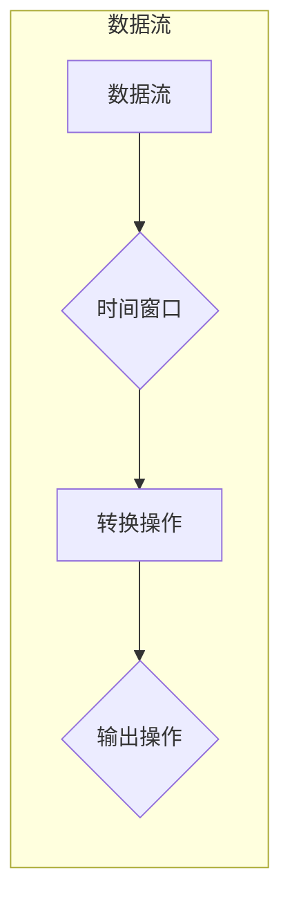

# Spark Structured Streaming原理与代码实例讲解

作者：禅与计算机程序设计艺术 / Zen and the Art of Computer Programming

## 1. 背景介绍
### 1.1 问题的由来

随着互联网和大数据技术的飞速发展，实时数据处理已经成为现代应用不可或缺的一部分。传统的大数据处理框架，如MapReduce和Hadoop，虽然能够处理海量数据，但它们在实时性方面存在不足。为了满足实时数据处理的需求，Apache Spark推出了Structured Streaming模块，它能够将Spark的批处理能力与实时数据处理的优势完美结合。

### 1.2 研究现状

Structured Streaming自2016年推出以来，已经成为实时数据处理领域的事实标准。它支持多种数据源，如Kafka、Flume、Kinesis、RabbitMQ等，并且能够与Spark SQL、MLlib等Spark生态系统中的组件无缝集成。随着Spark 3.0的发布，Structured Streaming的性能和易用性得到了进一步提升。

### 1.3 研究意义

Structured Streaming的出现，为实时数据处理提供了高效、可靠的解决方案，具有重要的研究意义：

- **提升实时数据处理能力**：Structured Streaming能够实时处理流数据，满足现代应用对实时性的需求。
- **简化开发流程**：Structured Streaming的API简单易用，能够帮助开发者快速构建实时数据处理应用。
- **提高开发效率**：Structured Streaming与Spark生态系统中的组件紧密结合，能够提高开发效率。
- **降低成本**：Structured Streaming能够在现有的Spark集群上运行，无需额外的硬件投入。

### 1.4 本文结构

本文将详细介绍Structured Streaming的原理和代码实例，内容安排如下：

- **第2章**：介绍Structured Streaming的核心概念和联系。
- **第3章**：讲解Structured Streaming的算法原理和具体操作步骤。
- **第4章**：分析Structured Streaming的数学模型和公式，并结合实例进行讲解。
- **第5章**：通过代码实例演示Structured Streaming的使用方法。
- **第6章**：探讨Structured Streaming的实际应用场景和未来展望。
- **第7章**：推荐Structured Streaming相关的学习资源、开发工具和参考文献。
- **第8章**：总结Structured Streaming的发展趋势和挑战。
- **第9章**：提供Structured Streaming的常见问题与解答。

## 2. 核心概念与联系

### 2.1 核心概念

- **数据流（Data Stream）**：指数据以连续、顺序的方式产生和消费。
- **时间窗口（Time Window）**：指对数据进行划分的时间范围，如滑动窗口、固定窗口等。
- **转换操作（Transformation）**：指对数据流进行转换的操作，如映射、过滤、聚合等。
- **输出操作（Output Operation）**：指将处理后的数据输出到外部系统，如数据库、文件系统等。

### 2.2 核心联系

Structured Streaming将数据流视为一个有界的时间窗口，通过对时间窗口内的数据进行转换操作，最终将结果输出到外部系统。其核心联系如下：



## 3. 核心算法原理 & 具体操作步骤
### 3.1 算法原理概述

Structured Streaming基于Spark的弹性分布式数据集（RDD）抽象，利用Spark的批处理能力实现实时数据处理。其核心算法原理如下：

1. **数据源接入**：从外部数据源（如Kafka）读取数据流。
2. **数据转换**：对数据流进行转换操作，如映射、过滤、聚合等。
3. **时间窗口划分**：将转换后的数据进行时间窗口划分。
4. **结果输出**：将时间窗口内的结果输出到外部系统。

### 3.2 算法步骤详解

Structured Streaming的算法步骤如下：

1. **初始化Spark环境**：创建SparkSession对象。
2. **定义数据源**：指定数据源的名称、主题等参数。
3. **定义转换操作**：对数据流进行映射、过滤、聚合等操作。
4. **定义时间窗口**：对数据进行时间窗口划分。
5. **定义输出操作**：将结果输出到外部系统，如数据库、文件系统等。
6. **启动流式处理**：启动Structured Streaming流式处理，持续处理数据流。

### 3.3 算法优缺点

Structured Streaming的优点如下：

- **弹性**：能够自动处理节点故障，保证系统的高可用性。
- **可扩展性**：能够根据数据量自动扩展计算资源。
- **易用性**：API简单易用，易于上手。

Structured Streaming的缺点如下：

- **延迟**：由于使用批处理技术，可能会存在一定的延迟。
- **资源消耗**：在高峰时段，可能会消耗较多的计算资源。

### 3.4 算法应用领域

Structured Streaming适用于以下应用领域：

- **实时数据分析**：如股票交易、搜索引擎、推荐系统等。
- **实时数据监控**：如网络流量监控、系统性能监控等。
- **实时数据挖掘**：如点击流分析、异常检测等。

## 4. 数学模型和公式 & 详细讲解 & 举例说明
### 4.1 数学模型构建

Structured Streaming的数学模型可以表示为以下公式：

$$
Y = f(X, t)
$$

其中：

- $X$：输入数据流
- $t$：时间窗口
- $Y$：输出结果
- $f$：转换操作

### 4.2 公式推导过程

以窗口函数为例，其公式推导过程如下：

$$
\text{count}(X, t) = \sum_{x \in X, x \in t} x
$$

其中：

- $\text{count}$：窗口函数
- $x$：数据流中的单个数据
- $t$：时间窗口

### 4.3 案例分析与讲解

以下是一个使用Structured Streaming进行实时数据分析的示例：

```python
from pyspark.sql import SparkSession
from pyspark.sql.functions import window

# 初始化Spark环境
spark = SparkSession.builder.appName("Realtime Analytics").getOrCreate()

# 定义数据源
df = spark.readStream.format("kafka").option("kafka.bootstrap.servers", "kafka-broker:9092") \
    .option("subscribe", "topic1").load()

# 定义转换操作
windowed_df = df.groupBy(window(col("timestamp").between("2021-01-01 00:00:00", "2021-01-01 00:59:59")) \
    .count()

# 定义输出操作
query = windowed_df.writeStream.format("console").outputMode("complete").start()

query.awaitTermination()
```

在这个示例中，我们从Kafka的topic1主题中读取数据，按照每分钟进行窗口划分，并计算每个时间窗口内的数据量，最后将结果输出到控制台。

### 4.4 常见问题解答

**Q1：Structured Streaming与Spark SQL有何区别？**

A：Structured Streaming和Spark SQL都是Spark生态系统中的实时数据处理组件，但它们之间也存在一些区别：

- **数据源**：Structured Streaming支持多种数据源，如Kafka、Flume等；Spark SQL主要支持关系型数据源，如关系数据库、CSV文件等。
- **数据处理方式**：Structured Streaming以数据流的形式进行处理，支持时间窗口等高级操作；Spark SQL以关系型数据库的形式进行处理，支持SQL语法和函数。
- **API**：Structured Streaming的API更加简单易用，Spark SQL的API与关系数据库的SQL类似。

## 5. 项目实践：代码实例和详细解释说明
### 5.1 开发环境搭建

在进行Structured Streaming项目实践前，我们需要准备好以下开发环境：

1. 安装Java开发环境：下载并安装Java开发环境，如OpenJDK。
2. 安装Scala开发环境：下载并安装Scala开发环境，如IntelliJ IDEA。
3. 安装Apache Spark：下载并安装Apache Spark，如使用PySpark进行Python开发。

### 5.2 源代码详细实现

以下是一个使用PySpark进行实时数据分析的示例：

```python
from pyspark.sql import SparkSession
from pyspark.sql.functions import from_json, col

# 初始化Spark环境
spark = SparkSession.builder.appName("Realtime Analytics").getOrCreate()

# 定义数据源
df = spark.readStream.format("kafka").option("kafka.bootstrap.servers", "kafka-broker:9092") \
    .option("subscribe", "topic1").load()

# 定义转换操作
df = df.select(from_json(col("value"), "$.fields").alias("data"))

# 提取数据中的字段
df = df.select(col("data.field1"), col("data.field2"))

# 定义输出操作
query = df.writeStream.format("console").outputMode("complete").start()

query.awaitTermination()
```

在这个示例中，我们从Kafka的topic1主题中读取JSON格式的数据，提取其中的字段，并将结果输出到控制台。

### 5.3 代码解读与分析

- `SparkSession.builder.appName("Realtime Analytics").getOrCreate()`：创建SparkSession对象，设置应用名称为"Realtime Analytics"。
- `spark.readStream.format("kafka").option("kafka.bootstrap.servers", "kafka-broker:9092") .option("subscribe", "topic1").load()`：从Kafka的topic1主题中读取数据。
- `from_json(col("value"), "$.fields").alias("data")`：将JSON格式的数据转换为DataFrame，并命名为"data"。
- `col("data.field1"), col("data.field2")`：提取数据中的字段"field1"和"field2"。
- `df.writeStream.format("console").outputMode("complete").start()`：将结果输出到控制台，并启动流式处理。

### 5.4 运行结果展示

在启动上述代码后，控制台将实时显示从Kafka读取的数据。

## 6. 实际应用场景
### 6.1 实时推荐系统

Structured Streaming可以用于构建实时推荐系统，对用户的实时行为进行分析，并实时推荐相关商品或内容。

### 6.2 实时监控系统

Structured Streaming可以用于构建实时监控系统，对系统性能、网络流量等进行实时监控，并及时发现异常情况。

### 6.3 实时数据分析

Structured Streaming可以用于构建实时数据分析平台，对实时数据进行分析，为企业决策提供支持。

## 7. 工具和资源推荐
### 7.1 学习资源推荐

- 《Spark Programming Guide》
- 《Learning Spark》
- 《High-Performance Spark》

### 7.2 开发工具推荐

- PyCharm
- IntelliJ IDEA
- VS Code

### 7.3 相关论文推荐

- "Spark: The Cluster Computing System with High Throughput and Low Latency"
- "Streaming Data Processing at Scale"

### 7.4 其他资源推荐

- Apache Spark官网
- PySpark官方文档

## 8. 总结：未来发展趋势与挑战
### 8.1 研究成果总结

本文介绍了Structured Streaming的原理和代码实例，展示了其在实时数据处理领域的应用价值。通过本文的学习，读者可以掌握Structured Streaming的核心概念、算法原理、API使用方法，并能够将其应用于实际的开发项目中。

### 8.2 未来发展趋势

Structured Streaming的未来发展趋势如下：

- **更高的性能**：随着Spark集群的优化和硬件设备的升级，Structured Streaming的性能将进一步提升。
- **更丰富的数据源**：Structured Streaming将支持更多类型的数据源，如云数据库、实时消息队列等。
- **更高级的算法**：Structured Streaming将支持更多高级算法，如图计算、图流等。

### 8.3 面临的挑战

Structured Streaming面临的挑战如下：

- **延迟**：如何降低延迟，提高实时性，是一个需要持续优化的方向。
- **资源消耗**：如何降低资源消耗，提高资源利用率，是一个需要关注的问题。
- **可扩展性**：如何保证系统的高可用性和可扩展性，是一个需要解决的问题。

### 8.4 研究展望

Structured Streaming的研究展望如下：

- **混合计算**：将批处理和实时处理结合，实现更灵活的数据处理方式。
- **多模态数据**：支持多种类型的数据，如文本、图像、视频等。
- **可解释性**：提高模型的可解释性，方便用户理解和信任。

Structured Streaming作为Apache Spark生态系统中的重要组成部分，在实时数据处理领域具有广泛的应用前景。相信随着技术的不断发展和完善，Structured Streaming将会在更多场景下发挥重要作用，为大数据和人工智能技术的创新和发展贡献力量。

## 9. 附录：常见问题与解答

**Q1：Structured Streaming与Flink有何区别？**

A：Structured Streaming和Flink都是实时数据处理框架，但它们之间也存在一些区别：

- **数据模型**：Structured Streaming基于DataFrame API，Flink基于DataStream API。
- **性能**：Flink在性能上可能略优于Structured Streaming，但两者的性能差异并不大。
- **社区生态**：Flink社区生态更加丰富，支持更多类型的实时数据处理任务。

**Q2：Structured Streaming是否支持窗口函数？**

A：Structured Streaming支持多种窗口函数，如滑动窗口、固定窗口、会话窗口等。

**Q3：Structured Streaming如何处理故障？**

A：Structured Streaming能够自动处理节点故障，将任务重新分配到其他节点上执行，保证系统的高可用性。

**Q4：Structured Streaming是否支持机器学习？**

A：Structured Streaming可以与MLlib等Spark生态系统中的组件结合，支持实时机器学习。

**Q5：Structured Streaming是否支持多租户？**

A：Structured Streaming支持多租户，可以同时处理多个流式处理任务。