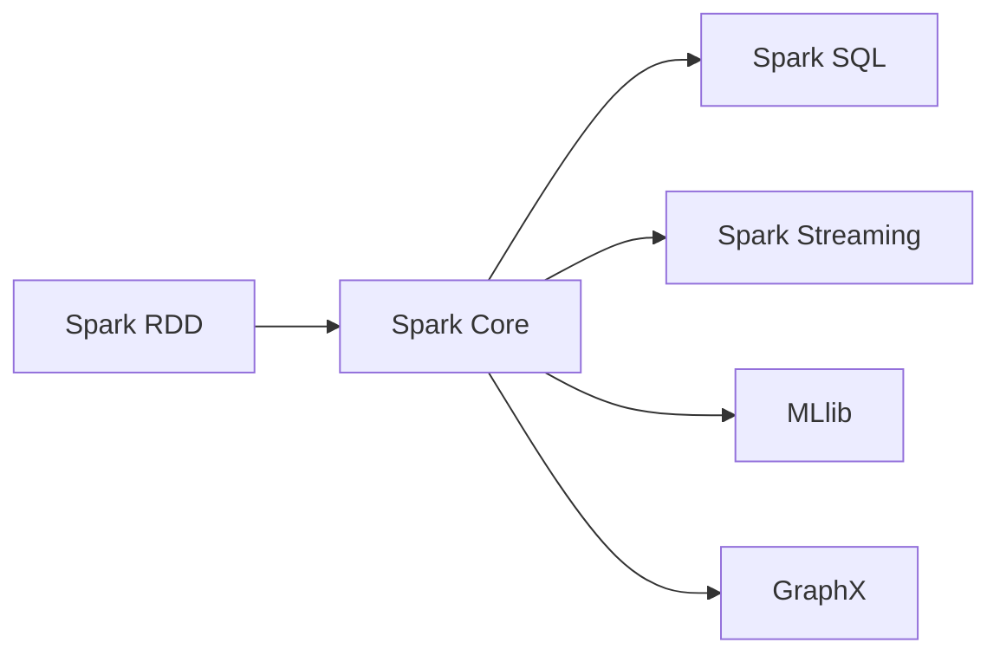

# Spark原理与代码实例讲解

作者：禅与计算机程序设计艺术 / Zen and the Art of Computer Programming

## 1. 背景介绍

### 1.1 问题的由来

随着大数据时代的到来，数据量呈爆炸式增长，传统的数据处理方式已经无法满足日益增长的数据处理需求。如何高效、可靠地处理海量数据成为了一个亟待解决的问题。Apache Spark应运而生，它是一个开源的大数据处理框架，能够对大规模数据进行快速处理，具有高吞吐量、低延迟、易扩展等特点，成为大数据处理领域的首选技术之一。

### 1.2 研究现状

Spark自2010年开源以来，发展迅速，已经成为大数据处理领域的明星技术。目前，Spark已经广泛应用于各个行业，如互联网、金融、医疗、教育等。Spark社区活跃，不断推出新的功能和优化，为用户提供更加高效、易用的数据处理工具。

### 1.3 研究意义

Spark作为大数据处理框架的代表，具有重要的研究意义：

1. **高效处理海量数据**：Spark能够对大规模数据进行快速处理，适用于各种数据处理场景。
2. **支持多种编程语言**：Spark支持Scala、Java、Python等多种编程语言，方便用户进行开发。
3. **易于使用和扩展**：Spark具有高度的可扩展性，能够方便地扩展到多台机器上。
4. **丰富的API**：Spark提供了丰富的API，支持各种数据处理任务，如批处理、实时计算、图处理等。
5. **与其他大数据技术兼容**：Spark可以与Hadoop、Hive、Pig等大数据技术无缝集成。

### 1.4 本文结构

本文将系统介绍Apache Spark的原理与应用，内容安排如下：

- **第2章**：介绍Spark的核心概念与联系。
- **第3章**：深入讲解Spark的核心算法原理和具体操作步骤。
- **第4章**：介绍Spark的数学模型、公式推导和案例分析。
- **第5章**：通过代码实例和详细解释说明Spark的使用。
- **第6章**：探讨Spark的实际应用场景和未来发展趋势。
- **第7章**：推荐Spark相关的学习资源、开发工具和参考文献。
- **第8章**：总结Spark的未来发展趋势与挑战。
- **第9章**：附录，常见问题与解答。

## 2. 核心概念与联系

### 2.1 核心概念

1. **RDD（弹性分布式数据集）**：Spark的基本数据抽象，代表一个不可变、可分区、可并行操作的分布式数据集合。
2. **Spark Core**：Spark的核心模块，提供RDD操作、任务调度、内存管理等基础功能。
3. **Spark SQL**：Spark的SQL引擎，提供类似SQL的数据查询接口，方便对RDD进行查询操作。
4. **Spark Streaming**：Spark的实时数据处理框架，能够对实时数据进行流式处理。
5. **MLlib**：Spark的机器学习库，提供各种机器学习算法和工具。
6. **GraphX**：Spark的图处理框架，能够对图数据进行高效处理。

### 2.2 联系

这些核心概念相互关联，构成了Spark的整体架构。RDD是Spark的基本数据抽象，Spark Core提供对RDD的操作和调度，Spark SQL、Spark Streaming、MLlib和GraphX等模块则在Spark Core的基础上提供更高级的功能。



## 3. 核心算法原理 & 具体操作步骤

### 3.1 算法原理概述

Spark的核心算法是RDD（弹性分布式数据集），RDD是一种不可变、可分区、可并行操作的分布式数据集合。RDD的三个主要特点如下：

1. **不可变**：RDD一旦创建，其内容就不能修改。
2. **可分区**：RDD可以分区存储在分布式集群的不同节点上，方便并行处理。
3. **可并行操作**：Spark对RDD的操作是惰性求值的，只有在真正需要结果时才进行计算，支持并行计算。

### 3.2 算法步骤详解

1. **创建RDD**：Spark支持多种方式创建RDD，如从文件系统读取、从数据库读取、从其他RDD转换等。
2. **转换操作**：对RDD进行转换操作，如map、filter、flatMap等，生成新的RDD。
3. **行动操作**：触发RDD的执行，如reduce、collect、count等，获取结果。

### 3.3 算法优缺点

**优点**：

1. **高效**：Spark利用弹性分布式数据集（RDD）作为其核心抽象，能够高效地处理大规模数据。
2. **易用**：Spark提供多种编程语言API，如Scala、Java、Python等，方便用户进行开发。
3. **容错性强**：Spark对RDD的操作支持容错机制，即使某些节点故障，也能保证任务完成。
4. **可扩展**：Spark可以轻松扩展到多台机器上，以支持更大的数据处理任务。

**缺点**：

1. **学习曲线**：Spark的编程模型和API相对复杂，需要一定时间学习和适应。
2. **资源消耗**：Spark在运行时需要一定的资源消耗，如内存、CPU等。

### 3.4 算法应用领域

Spark在各个行业都有广泛的应用，以下是一些典型应用场景：

1. **日志分析**：对日志数据进行实时分析，如用户行为分析、系统性能监控等。
2. **搜索引擎**：构建搜索引擎索引，如百度、谷歌等。
3. **机器学习**：进行大规模机器学习任务，如聚类、分类、回归等。
4. **推荐系统**：构建推荐系统，如Netflix、亚马逊等。
5. **数据挖掘**：进行大规模数据挖掘，如关联规则挖掘、频繁项集挖掘等。

## 4. 数学模型和公式 & 详细讲解 & 举例说明

### 4.1 数学模型构建

Spark的核心算法是RDD，RDD可以看作是一个分布式数据集，它包含多个分区，每个分区包含一组数据元素。RDD的操作可以分为转换操作和行动操作。

**转换操作**：

转换操作是指对RDD进行转换，生成一个新的RDD。常见的转换操作包括：

- **map**：对RDD中的每个元素应用一个函数，生成一个新的RDD。
- **filter**：根据一个条件筛选RDD中的元素，生成一个新的RDD。
- **flatMap**：对RDD中的每个元素应用一个函数，将结果扁平化后生成一个新的RDD。

**行动操作**：

行动操作是指触发RDD的执行，并获取结果。常见的行动操作包括：

- **reduce**：对RDD中的元素应用一个函数，计算最终结果。
- **collect**：将RDD中的所有元素收集到一个数组中。
- **count**：返回RDD中元素的数量。

### 4.2 公式推导过程

以下以map操作为例，介绍Spark的公式推导过程。

**map操作**：

假设有一个RDD $R$，包含 $N$ 个元素，每个元素表示为一个数字。对RDD $R$ 进行map操作，将每个元素乘以2，生成一个新的RDD $S$。

公式如下：

$$
S(i) = 2 \times R(i), \quad \text{其中 } i = 1, 2, ..., N
$$

### 4.3 案例分析与讲解

以下使用Scala语言演示Spark的map操作。

```scala
val rdd = sc.parallelize(1 to 10)
val s = rdd.map(_ * 2)
val result = s.collect()
println(result)
```

上述代码创建了一个包含1到10的RDD，然后对该RDD进行map操作，将每个元素乘以2，最后将结果收集到一个数组中并打印出来。

### 4.4 常见问题解答

**Q1：Spark的容错机制是如何实现的？**

A：Spark的容错机制主要通过以下方式实现：

1. **数据备份**：Spark会将数据分片存储在分布式文件系统（如HDFS）中，每个分片都有多个备份。
2. **检查点**：Spark会定期创建RDD的检查点，以便在发生故障时恢复RDD的状态。
3. **任务重试**：当Spark发现某个任务失败时，它会自动重试该任务。

**Q2：Spark的内存管理机制是如何工作的？**

A：Spark的内存管理机制主要基于以下几种内存管理策略：

1. **堆内存**：用于存储对象和数组等数据结构。
2. **堆外内存**：用于存储大数据量数据，如大型数据集和广播变量等。
3. **Tungsten**：Spark的执行引擎，它使用内存中的对象来存储和操作数据，以减少GC开销。

## 5. 项目实践：代码实例和详细解释说明

### 5.1 开发环境搭建

在进行Spark项目实践之前，需要搭建Spark的开发环境。以下是使用Scala进行Spark开发的步骤：

1. 安装Scala：从官网下载Scala安装包，并按照提示进行安装。
2. 安装SBT：Scala Build Tool，用于构建Scala项目。
3. 创建Scala项目：使用SBT创建一个新的Scala项目。
4. 添加Spark依赖：在项目的`build.sbt`文件中添加Spark依赖。

以下是添加Spark依赖的代码示例：

```scala
libraryDependencies ++= Seq(
  "org.apache.spark" %% "spark-core" % "3.1.1",
  "org.apache.spark" %% "spark-sql" % "3.1.1",
  "org.apache.spark" %% "spark-streaming" % "3.1.1",
  "org.apache.spark" %% "spark-streaming-kafka-0-10" % "3.1.1",
  "org.apache.spark" %% "spark-mllib" % "3.1.1"
)
```

### 5.2 源代码详细实现

以下使用Scala语言演示Spark的word count程序，该程序用于统计文本中每个单词出现的次数。

```scala
import org.apache.spark.sql.SparkSession

val spark = SparkSession.builder.appName("Word Count").getOrCreate()

val lines = spark.sparkContext.textFile("hdfs://your-hdfs-path/input.txt")
val words = lines.flatMap(_.split(" "))
val wordCounts = words.map(word => (word, 1)).reduceByKey((x, y) => x + y)
wordCounts.saveAsTextFile("hdfs://your-hdfs-path/output")

spark.stop()
```

### 5.3 代码解读与分析

以上代码演示了使用Spark进行word count的完整流程：

1. 创建SparkSession：SparkSession是Spark的入口点，用于创建SparkContext、SparkSQL等组件。
2. 读取数据：使用SparkContext的textFile方法读取HDFS上的文本文件。
3. 分词：使用flatMap操作将文本按空格进行分词。
4. 计数：使用map操作将每个单词映射为一个键值对（word, 1），然后使用reduceByKey操作对键值对进行聚合，计算每个单词的词频。
5. 保存结果：使用saveAsTextFile方法将结果保存到HDFS上的输出路径。
6. 停止SparkSession：在程序结束时，停止SparkSession。

### 5.4 运行结果展示

运行上述代码后，在指定的输出路径将生成一个包含word count结果的文件。以下是一个示例输出：

```
hadoop fs -cat /user/hadoop/output/part-00000
(a,1)
(b,2)
(c,1)
(d,2)
(e,1)
```

## 6. 实际应用场景

### 6.1 日志分析

Spark能够高效地对海量日志数据进行处理，从而实现对用户行为、系统性能等数据的实时分析。以下是一些常见的日志分析应用场景：

1. **用户行为分析**：分析用户在网站、APP等平台上的行为，如页面浏览、点击、购买等，了解用户喜好，优化用户体验。
2. **系统性能监控**：监控系统运行状态，如CPU、内存、磁盘等资源使用情况，及时发现并处理系统故障。
3. **异常检测**：检测系统中的异常行为，如恶意攻击、违规操作等，保障系统安全稳定运行。

### 6.2 搜索引擎

Spark能够高效地对大规模搜索引擎数据进行处理，从而实现对搜索引擎的优化和改进。以下是一些常见的搜索引擎应用场景：

1. **搜索索引构建**：构建搜索引擎的索引，提高搜索效率。
2. **查询优化**：优化搜索引擎的查询算法，提高搜索结果的相关性和准确性。
3. **广告投放**：根据用户查询和搜索历史，精准投放广告，提高广告效果。

### 6.3 机器学习

Spark的MLlib库提供了各种机器学习算法和工具，能够对大规模数据进行机器学习任务。以下是一些常见的机器学习应用场景：

1. **聚类**：对大规模数据进行聚类，发现数据中的隐藏模式。
2. **分类**：对大规模数据进行分类，如垃圾邮件分类、情感分析等。
3. **回归**：对大规模数据进行回归分析，如房价预测、股票预测等。

### 6.4 未来应用展望

随着Spark技术的不断发展，其应用领域将不断拓展，以下是一些未来应用场景的展望：

1. **智能城市**：利用Spark对城市数据进行分析，如交通流量、环境监测、城市规划等。
2. **医疗健康**：利用Spark对医疗数据进行分析，如疾病预测、药物研发等。
3. **金融风控**：利用Spark对金融数据进行分析，如风险评估、欺诈检测等。
4. **工业互联网**：利用Spark对工业数据进行分析，如设备故障预测、生产优化等。

## 7. 工具和资源推荐

### 7.1 学习资源推荐

为了帮助开发者系统掌握Spark的理论基础和实践技巧，以下推荐一些优质的学习资源：

1. **《Spark快速大数据处理》**：全面介绍了Spark的核心概念、API、使用方法和应用场景，适合Spark初学者和进阶者阅读。
2. **Spark官方文档**：Spark官方文档提供了详尽的API文档和教程，是学习Spark的最佳资料。
3. **Spark社区论坛**：Spark社区论坛是学习Spark、交流问题和分享经验的重要平台。
4. **Apache Spark官网**：Apache Spark官网提供了Spark的下载、安装和使用指南，以及社区新闻和最新动态。

### 7.2 开发工具推荐

以下是进行Spark开发常用的工具：

1. **IntelliJ IDEA**：一款强大的Java和Scala集成开发环境，支持Spark开发。
2. **Eclipse**：一款功能丰富的Java开发工具，也支持Spark开发。
3. **Scala IDE**：一款针对Scala语言的集成开发环境，支持Spark开发。
4. **SBT**：Scala Build Tool，用于构建Scala项目。

### 7.3 相关论文推荐

以下是Spark相关的一些重要论文：

1. **"Spark: A Unified Engine for Big Data Processing"**：Spark的官方论文，介绍了Spark的设计理念和核心架构。
2. **"The GraphX Framework for Large-Scale Graph Computation"**：GraphX论文，介绍了Spark的图处理框架。
3. **"MLlib: Machine Learning Library for Apache Spark"**：MLlib论文，介绍了Spark的机器学习库。

### 7.4 其他资源推荐

以下是Spark相关的其他资源：

1. **Spark社区博客**：Spark社区博客提供了Spark的最新动态和技术文章。
2. **Spark案例库**：Spark案例库收集了Spark的实际应用案例，供开发者参考和学习。
3. **Spark教程**：Spark教程提供了Spark的入门教程和实践指南。

## 8. 总结：未来发展趋势与挑战

### 8.1 研究成果总结

本文对Apache Spark的原理与应用进行了系统介绍，从核心概念、算法原理、实际应用等方面进行了详细讲解。Spark作为一种高效、易用的大数据处理框架，在各个行业得到了广泛应用。

### 8.2 未来发展趋势

未来，Spark技术将呈现以下发展趋势：

1. **性能优化**：持续优化Spark的性能，提高数据处理速度和效率。
2. **易用性提升**：简化Spark的编程模型和API，降低使用门槛。
3. **生态扩展**：丰富Spark的生态体系，支持更多数据源、算法和工具。
4. **跨平台支持**：支持更多操作系统和硬件平台，提高Spark的兼容性。

### 8.3 面临的挑战

Spark在发展过程中也面临以下挑战：

1. **算法复杂度**：随着Spark功能的不断增加，其算法复杂度也在不断提高，需要持续进行优化。
2. **资源消耗**：Spark在运行时需要一定的资源消耗，需要进一步优化资源管理。
3. **易用性问题**：虽然Spark的易用性在不断提高，但对于初学者和入门者来说，仍有一定的学习难度。
4. **安全性问题**：随着Spark应用范围的扩大，其安全问题也日益突出，需要加强安全防护。

### 8.4 研究展望

面对未来挑战，Spark技术需要在以下几个方面寻求突破：

1. **算法优化**：持续优化Spark的算法，提高数据处理效率和资源利用率。
2. **资源管理**：优化Spark的资源管理机制，降低资源消耗。
3. **易用性提升**：简化Spark的编程模型和API，降低使用门槛，方便更多开发者上手。
4. **安全性加强**：加强Spark的安全防护，保障用户数据的安全。

相信随着Spark技术的不断发展，它将在大数据处理领域发挥越来越重要的作用，为各行各业提供更加高效、可靠的数据处理解决方案。

## 9. 附录：常见问题与解答

### 9.1 常见问题

**Q1：Spark和Hadoop的关系是什么？**

A：Spark是基于Hadoop生态系统开发的，它可以在Hadoop集群上运行，并利用Hadoop的分布式存储和计算能力。Spark提供了比Hadoop MapReduce更强大的数据处理能力，但Hadoop仍然在一些场景下具有优势，如离线批处理等。

**Q2：Spark适合哪些场景？**

A：Spark适合以下场景：

1. 大规模数据处理：Spark能够高效处理大规模数据，适用于各种数据处理场景。
2. 实时数据处理：Spark Streaming模块支持实时数据处理，适用于实时数据分析、监控等场景。
3. 机器学习：Spark的MLlib库提供了各种机器学习算法和工具，适用于大规模机器学习任务。

**Q3：Spark的内存管理机制是如何工作的？**

A：Spark的内存管理机制主要基于以下几种内存管理策略：

1. **堆内存**：用于存储对象和数组等数据结构。
2. **堆外内存**：用于存储大数据量数据，如大型数据集和广播变量等。
3. **Tungsten**：Spark的执行引擎，它使用内存中的对象来存储和操作数据，以减少GC开销。

**Q4：Spark如何保证数据一致性？**

A：Spark通过以下方式保证数据一致性：

1. **数据备份**：Spark会将数据分片存储在分布式文件系统（如HDFS）中，每个分片都有多个备份。
2. **检查点**：Spark会定期创建RDD的检查点，以便在发生故障时恢复RDD的状态。
3. **任务重试**：当Spark发现某个任务失败时，它会自动重试该任务。

### 9.2 解答

以上是Spark常见问题与解答，希望对您有所帮助。如果您还有其他问题，欢迎在评论区留言交流。