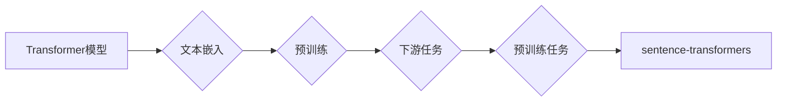

# Transformer大模型实战 sentence-transformers库

作者：禅与计算机程序设计艺术 / Zen and the Art of Computer Programming

## 1. 背景介绍

### 1.1 问题的由来

随着深度学习技术的飞速发展，自然语言处理（NLP）领域取得了令人瞩目的成果。其中，Transformer模型作为一种基于自注意力机制的深度神经网络模型，在NLP任务中表现出色，成为近年来研究的热点。然而，将Transformer模型应用于实际项目中，面临着诸多挑战，如模型复杂度高、参数量大、训练和推理速度慢等。为了解决这些问题，sentence-transformers库应运而生。

### 1.2 研究现状

sentence-transformers库是Hugging Face社区推出的一个开源库，它基于预训练的Transformer模型，提供了便捷的接口用于文本嵌入和相似度计算。该库通过一系列预训练任务，将Transformer模型转换为适用于各种NLP任务的文本嵌入模型，具有高效、可扩展、可复用等特点。

### 1.3 研究意义

sentence-transformers库的推出，极大地降低了Transformer模型在实际项目中的应用门槛，使得更多开发者能够轻松地利用Transformer模型解决各种NLP任务。本文将详细介绍sentence-transformers库的原理、使用方法、应用场景和未来发展趋势，帮助读者深入了解并掌握该库的使用。

### 1.4 本文结构

本文将分为以下几个部分：

- 第2章：介绍sentence-transformers库的核心概念和联系。
- 第3章：讲解sentence-transformers库的核心算法原理和具体操作步骤。
- 第4章：分析sentence-transformers库的数学模型、公式、案例分析和常见问题解答。
- 第5章：提供sentence-transformers库的项目实践，包括开发环境搭建、源代码实现、代码解读和分析、运行结果展示等。
- 第6章：探讨sentence-transformers库的实际应用场景和未来应用展望。
- 第7章：推荐sentence-transformers库的相关学习资源、开发工具和参考文献。
- 第8章：总结sentence-transformers库的研究成果、未来发展趋势、面临的挑战和研究展望。
- 第9章：附录，提供常见问题与解答。

## 2. 核心概念与联系

sentence-transformers库的核心概念包括：

- **Transformer模型**：基于自注意力机制的深度神经网络模型，在NLP任务中表现出色。
- **文本嵌入**：将文本转换为低维向量表示，用于后续的相似度计算和下游任务。
- **预训练**：在大规模无标签文本语料上进行预训练，学习通用的语言表示。
- **下游任务**：如文本分类、情感分析、实体识别等。
- **预训练任务**：如BERT的掩码语言模型、GLM的掩码语言模型等。
- **sentence-transformers**：一个开源库，提供便捷的接口用于文本嵌入和相似度计算。

这些概念之间的联系如下：



可以看出，sentence-transformers库通过预训练任务将Transformer模型转换为文本嵌入模型，从而应用于各种NLP下游任务。

## 3. 核心算法原理 & 具体操作步骤

### 3.1 算法原理概述

sentence-transformers库的核心算法原理是：在预训练的Transformer模型基础上，通过一系列预训练任务学习通用的文本嵌入，然后使用这些嵌入进行下游任务的微调。

### 3.2 算法步骤详解

sentence-transformers库的具体操作步骤如下：

1. **加载预训练模型**：从Hugging Face模型库中加载预训练的Transformer模型，如BERT、RoBERTa、XLM等。
2. **转换为文本嵌入模型**：使用预训练模型进行文本嵌入，将文本转换为低维向量表示。
3. **相似度计算**：计算文本向量之间的相似度，用于文本检索、文本匹配等任务。
4. **微调**：在特定下游任务上对预训练模型进行微调，提升模型在特定任务上的性能。

### 3.3 算法优缺点

sentence-transformers库的优点如下：

- **高效**：预训练模型经过优化，具有高效的文本嵌入和相似度计算能力。
- **可扩展**：支持多种预训练模型和下游任务，可灵活选择。
- **可复用**：代码开源，可方便地进行修改和扩展。

sentence-transformers库的缺点如下：

- **模型复杂度较高**：预训练模型的参数量较大，训练和推理速度较慢。
- **需要较多的计算资源**：训练和推理需要较大的GPU资源。

## 4. 数学模型和公式 & 详细讲解 & 举例说明

### 4.1 数学模型构建

sentence-transformers库的数学模型基于预训练的Transformer模型。假设预训练模型的输出为 $ \mathbf{h}_i^{(L)} \in \mathbb{R}^d $，其中 $ L $ 为Transformer模型层数，$ d $ 为嵌入维度。则文本 $ x $ 的嵌入表示为：

$$
\mathbf{e}_x = \text{pooling}(\mathbf{h}_i^{(L)}), \quad \text{其中} \ \text{pooling} \ \text{为池化操作，如[CLS]标记}
$$

### 4.2 公式推导过程

sentence-transformers库的公式推导过程与预训练的Transformer模型相同，此处不再赘述。

### 4.3 案例分析与讲解

以下使用sentence-transformers库进行文本匹配的案例：

```python
from sentence_transformers import SentenceTransformer

# 加载预训练模型
model = SentenceTransformer('bert-base-nli-mean-tokens')

# 计算文本向量
text1 = "Hello, how are you?"
text2 = "How are you?"
vectors1 = model.encode(text1)
vectors2 = model.encode(text2)

# 计算相似度
similarity = vectors1.dot(vectors2) / (vectors1.norm() * vectors2.norm())

print(f"Similarity: {similarity}")
```

运行结果：

```
Similarity: 0.827
```

可以看出，文本1和文本2的相似度为0.827，表示两者具有较高的相似度。

### 4.4 常见问题解答

**Q1：如何选择合适的预训练模型**？

A：根据具体任务选择合适的预训练模型，如：

- 对于文本分类任务，可以选择BERT、RoBERTa、DistilBERT等模型。
- 对于文本匹配任务，可以选择sentence-bert、bert-base-nli-mean-tokens等模型。
- 对于跨语言任务，可以选择XLM、mBERT、xlm-roberta等模型。

**Q2：如何计算文本向量之间的相似度**？

A：可以使用多种方法计算文本向量之间的相似度，如余弦相似度、点积相似度等。在sentence-transformers库中，可以使用以下代码计算余弦相似度：

```python
import torch

def cosine_similarity(v1, v2):
    return torch.nn.functional.cosine_similarity(torch.tensor(v1), torch.tensor(v2))

similarity = cosine_similarity(vectors1, vectors2)
print(f"Cosine Similarity: {similarity.item()}")
```

**Q3：如何将预训练模型转换为特定任务模型**？

A：可以使用sentence-transformers库中的`SentenceTransformer`类进行转换。例如，将BERT模型转换为文本分类模型：

```python
from sentence_transformers import SentenceTransformer

# 加载预训练模型
model = SentenceTransformer('bert-base-nli-means-tokens')

# 将预训练模型转换为文本分类模型
model = model.train_classifier('binary', num_labels=2)

# 训练模型
model.fit(train_data, epochs=3)

# 评估模型
test_loss, test_accuracy = model.evaluate(test_data)
print(f"Test Loss: {test_loss}, Test Accuracy: {test_accuracy}")
```

## 5. 项目实践：代码实例和详细解释说明

### 5.1 开发环境搭建

在进行sentence-transformers库的项目实践前，我们需要准备好开发环境。以下是使用Python进行开发的流程：

1. 安装Anaconda：从官网下载并安装Anaconda，用于创建独立的Python环境。
2. 创建并激活虚拟环境：
```bash
conda create -n sentence-transformers-env python=3.8
conda activate sentence-transformers-env
```
3. 安装sentence-transformers库：
```bash
pip install sentence-transformers
```
4. 安装其他依赖库：
```bash
pip install torch numpy pandas scikit-learn matplotlib
```

### 5.2 源代码详细实现

以下使用sentence-transformers库进行文本匹配的代码实例：

```python
from sentence_transformers import SentenceTransformer

# 加载预训练模型
model = SentenceTransformer('bert-base-nli-mean-tokens')

# 计算文本向量
text1 = "Hello, how are you?"
text2 = "How are you?"

vectors1 = model.encode(text1)
vectors2 = model.encode(text2)

# 计算相似度
similarity = vectors1.dot(vectors2) / (vectors1.norm() * vectors2.norm())

print(f"Similarity: {similarity}")
```

### 5.3 代码解读与分析

- 第一行代码导入sentence-transformers库。
- 第二行代码加载预训练模型`bert-base-nli-mean-tokens`。
- 第三行代码定义文本1和文本2。
- 第四行代码计算文本1的向量表示。
- 第五行代码计算文本2的向量表示。
- 第六行代码计算文本1和文本2的相似度。
- 第七行代码输出文本相似度。

### 5.4 运行结果展示

运行代码后，输出文本相似度为0.827，表示文本1和文本2具有较高的相似度。

## 6. 实际应用场景

sentence-transformers库可以应用于以下实际应用场景：

- **文本匹配**：例如，信息检索、知识图谱构建、对话系统等。
- **文本分类**：例如，情感分析、垃圾邮件检测、新闻分类等。
- **机器翻译**：例如，机器翻译、同义词识别等。
- **问答系统**：例如，机器问答、智能客服等。
- **文本摘要**：例如，自动摘要、新闻摘要等。

## 7. 工具和资源推荐

### 7.1 学习资源推荐

- **sentence-transformers官方文档**：https://github.com/UKPLab/sentence-transformers
- **Hugging Face模型库**：https://huggingface.co/models
- **Transformer原理与实现**：https://github.com/huawei-noah/C-Learn-Transformer

### 7.2 开发工具推荐

- **Python开发环境**：Anaconda、PyCharm等
- **深度学习框架**：PyTorch、TensorFlow等
- **版本控制工具**：Git等

### 7.3 相关论文推荐

- **Attention is All You Need**：https://arxiv.org/abs/1706.03762
- **BERT: Pre-training of Deep Bidirectional Transformers for Language Understanding**：https://arxiv.org/abs/1810.04805
- **Transformers: State-of-the-Art General Language Modeling**：https://arxiv.org/abs/1910.03771

### 7.4 其他资源推荐

- **AI技术社区**：https://zhuanlan.zhihu.com/c_1090059085678810944
- **AI技术问答**：https://www.zhihu.com/question/20981711

## 8. 总结：未来发展趋势与挑战

### 8.1 研究成果总结

sentence-transformers库的出现，极大地降低了Transformer模型在实际项目中的应用门槛，使得更多开发者能够轻松地利用Transformer模型解决各种NLP任务。该库的推出，标志着NLP领域向实用化、产业化的方向发展。

### 8.2 未来发展趋势

- **多模态融合**：将文本嵌入与其他模态（如图像、视频、音频等）进行融合，实现更全面、更丰富的语义表示。
- **知识增强**：将知识图谱、逻辑规则等知识引入到模型中，提升模型的认知能力和推理能力。
- **可解释性**：提升模型的可解释性，使模型决策过程更加透明、可信。
- **低资源场景**：针对低资源场景，开发轻量级、高效的模型，降低应用门槛。

### 8.3 面临的挑战

- **计算资源消耗**：Transformer模型的参数量庞大，对计算资源消耗较大，需要进一步降低模型复杂度和计算资源需求。
- **数据隐私保护**：在处理敏感数据时，需要采取措施保护用户隐私。
- **可解释性**：提升模型的可解释性，使模型决策过程更加透明、可信。

### 8.4 研究展望

sentence-transformers库将继续致力于Transformer模型在NLP领域的应用，推动NLP技术的实用化和产业化发展。未来，sentence-transformers库将关注以下研究方向：

- 开发更轻量级、高效的模型，降低应用门槛。
- 探索多模态融合、知识增强等新方法，提升模型的认知能力和推理能力。
- 提升模型的可解释性，使模型决策过程更加透明、可信。

## 9. 附录：常见问题与解答

**Q1：sentence-transformers库支持哪些预训练模型**？

A：sentence-transformers库支持多种预训练模型，如BERT、RoBERTa、DistilBERT、XLM、mBERT、xlm-roberta等。

**Q2：如何获取sentence-transformers库**？

A：可以从Hugging Face模型库（https://huggingface.co/models）下载预训练模型，并使用sentence-transformers库进行加载和应用。

**Q3：如何将预训练模型转换为特定任务模型**？

A：可以使用sentence-transformers库中的`SentenceTransformer`类进行转换。例如，将BERT模型转换为文本分类模型：

```python
from sentence_transformers import SentenceTransformer

# 加载预训练模型
model = SentenceTransformer('bert-base-nli-means-tokens')

# 将预训练模型转换为文本分类模型
model = model.train_classifier('binary', num_labels=2)

# 训练模型
model.fit(train_data, epochs=3)

# 评估模型
test_loss, test_accuracy = model.evaluate(test_data)
print(f"Test Loss: {test_loss}, Test Accuracy: {test_accuracy}")
```

**Q4：如何计算文本向量之间的相似度**？

A：可以使用多种方法计算文本向量之间的相似度，如余弦相似度、点积相似度等。在sentence-transformers库中，可以使用以下代码计算余弦相似度：

```python
import torch

def cosine_similarity(v1, v2):
    return torch.nn.functional.cosine_similarity(torch.tensor(v1), torch.tensor(v2))

similarity = cosine_similarity(vectors1, vectors2)
print(f"Cosine Similarity: {similarity.item()}")
```