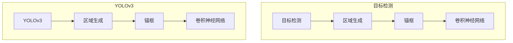

# YOLOv3原理与代码实例讲解

## 1. 背景介绍
### 1.1 问题的由来

目标检测是计算机视觉领域一个基础而重要的任务，它在自动驾驶、无人机监测、视频分析等诸多领域都有着广泛的应用。传统的目标检测方法主要分为两大类：基于区域的方法（Region-based Object Detection）和基于回归的方法（Regression-based Object Detection）。

基于区域的方法通过先对图像进行特征提取，然后在特征图上进行候选区域（Region of Interest，ROI）的生成，最后对ROI进行分类和边界框的回归。典型的基于区域的方法包括R-CNN系列、Faster R-CNN等。这类方法计算量大，速度慢，难以满足实时性的需求。

基于回归的方法则直接对图像中的目标进行回归，直接输出目标的类别和边界框。典型的基于回归的方法包括YOLO（You Only Look Once）系列。YOLO系列模型以其速度快、检测准确率高、结构简单等优点，在目标检测领域取得了巨大的成功。

### 1.2 研究现状

YOLO系列模型自提出以来，得到了广泛的研究和应用。YOLOv1首次将目标检测任务视为一个回归问题，实现了端到端的检测，但检测精度相对较低。YOLOv2引入了锚框（Anchor Boxes）和卷积神经网络（CNN）的思想，提高了检测精度。YOLOv3在YOLOv2的基础上，进一步优化了网络结构，引入了Darknet网络，并在COCO数据集上取得了当时的最优效果。

### 1.3 研究意义

YOLOv3作为当前目标检测领域的领先技术，具有以下研究意义：

1. 提高目标检测速度。YOLOv3采用端到端的检测方式，检测速度快，能够满足实时性需求。
2. 提高目标检测精度。YOLOv3采用Darknet网络和锚框技术，提高了检测精度。
3. 简化检测流程。YOLOv3将目标检测任务视为一个回归问题，简化了检测流程，易于理解和实现。

### 1.4 本文结构

本文将详细介绍YOLOv3的原理和实现，主要包括以下内容：

- 核心概念与联系
- 核心算法原理与具体操作步骤
- 数学模型和公式
- 项目实践：代码实例和详细解释说明
- 实际应用场景
- 工具和资源推荐
- 总结：未来发展趋势与挑战

## 2. 核心概念与联系

为更好地理解YOLOv3，本节将介绍几个核心概念及其相互之间的联系：

- 目标检测：目标检测是计算机视觉领域一个基础而重要的任务，其目标是在图像中识别出所有目标，并给出目标的位置和类别信息。
- 区域生成：在目标检测任务中，为了提高检测精度，需要先对图像进行区域生成，即从图像中提取出可能包含目标的区域。
- 锚框：锚框是一种用于指导目标检测的方法，通过在特征图上生成一系列预设的边框，使得模型能够更好地学习目标的边界信息。
- 卷积神经网络（CNN）：卷积神经网络是一种强大的特征提取工具，在目标检测领域被广泛应用于特征提取、分类和回归等任务。
- YOLOv3：YOLOv3是一种基于回归的目标检测算法，通过端到端的检测方式，实现了高效、准确的目标检测。

它们之间的逻辑关系如下：



可以看出，YOLOv3的目标检测流程包括区域生成、锚框和卷积神经网络等步骤，通过卷积神经网络对图像进行特征提取，再通过锚框对目标进行定位，最终实现目标检测。

## 3. 核心算法原理 & 具体操作步骤
### 3.1 算法原理概述

YOLOv3的目标检测任务可以概括为以下步骤：

1. 预处理图像：将图像进行缩放、归一化等预处理操作，使其符合网络输入要求。
2. 网络特征提取：将预处理后的图像输入到YOLOv3网络中，进行特征提取。
3. 特征融合：将不同尺度的特征图进行融合，提高检测精度。
4. 预测：在融合后的特征图上进行目标检测预测，得到目标的类别、边界框和置信度。
5. 非极大值抑制（NMS）：对预测结果进行非极大值抑制，去除重叠的边界框，得到最终的检测结果。

### 3.2 算法步骤详解

YOLOv3网络主要由以下几个部分组成：

1. 网络结构：YOLOv3采用Darknet-53网络结构，包括53层卷积层和3个跳跃连接层。
2. 锚框：YOLOv3在特征图上生成9个预设的锚框，分别对应不同的尺度。
3. 输出层：输出层的每个单元对应一个锚框，输出目标的类别、边界框和置信度。
4. 非极大值抑制：对预测结果进行非极大值抑制，去除重叠的边界框。

以下是对YOLOv3算法步骤的详细讲解：

**步骤1：预处理图像**

首先，将图像进行缩放，使其尺寸与网络输入要求一致。例如，YOLOv3的网络输入尺寸为416x416，因此需要将图像缩放到416x416。

然后，对图像进行归一化，将像素值从[0, 255]缩放到[0, 1]。

**步骤2：网络特征提取**

将预处理后的图像输入到Darknet-53网络中进行特征提取。Darknet-53网络由53层卷积层和3个跳跃连接层组成，能够提取出丰富的特征。

**步骤3：特征融合**

YOLOv3网络包含3个尺度特征图，分别为13x13、26x26和52x52。为了提高检测精度，需要将这3个尺度特征图进行融合。

**步骤4：预测**

在融合后的特征图上进行目标检测预测。每个特征图上的每个单元对应一个锚框，输出目标的类别、边界框和置信度。

**步骤5：非极大值抑制**

对预测结果进行非极大值抑制，去除重叠的边界框，得到最终的检测结果。

### 3.3 算法优缺点

YOLOv3算法具有以下优点：

1. 速度快：YOLOv3采用端到端的检测方式，检测速度快，能够满足实时性需求。
2. 精度高：YOLOv3采用Darknet网络和锚框技术，提高了检测精度。
3. 结构简单：YOLOv3网络结构简单，易于理解和实现。

YOLOv3算法也存在以下缺点：

1. 对小目标的检测效果不佳：YOLOv3在检测小目标时，容易产生误检和漏检。
2. 对复杂场景的适应性差：YOLOv3在复杂场景下的检测效果不如其他检测算法。

### 3.4 算法应用领域

YOLOv3算法在以下领域有着广泛的应用：

- 自动驾驶：用于车辆检测、行人检测等，提高自动驾驶系统的安全性。
- 无人机监测：用于监测无人机周围环境，防止碰撞事故。
- 视频分析：用于视频监控、异常行为检测等，提高视频分析系统的智能化水平。
- 医学影像分析：用于病变区域检测、疾病诊断等，提高医学影像分析效率。

## 4. 数学模型和公式 & 详细讲解 & 举例说明
### 4.1 数学模型构建

YOLOv3的数学模型主要包括以下部分：

1. 卷积神经网络：用于提取图像特征。
2. 锚框：用于指导目标检测。
3. 输出层：用于输出目标的类别、边界框和置信度。
4. 非极大值抑制：用于去除重叠的边界框。

以下是对YOLOv3数学模型的详细讲解：

**1. 卷积神经网络**

YOLOv3采用Darknet-53网络结构，包括53层卷积层和3个跳跃连接层。Darknet-53网络是一种残差网络，能够有效地提取图像特征。

**2. 锚框**

YOLOv3在特征图上生成9个预设的锚框，分别对应不同的尺度。锚框的生成方法如下：

- 预先定义一个边长为13、26和52的立方体，分别对应3个尺度。
- 对每个尺度，将立方体沿着3个维度进行平移和缩放，生成9个锚框。

**3. 输出层**

输出层的每个单元对应一个锚框，输出目标的类别、边界框和置信度。

- 类别：使用softmax函数将锚框的置信度转化为目标的类别概率。
- 边界框：使用sigmoid函数将锚框的坐标转化为目标的边界框坐标。
- 置信度：表示锚框内目标的置信度。

**4. 非极大值抑制**

非极大值抑制（NMS）是一种去除重叠边界框的方法，其步骤如下：

1. 对所有预测结果按照置信度从高到低排序。
2. 选择置信度最高的预测结果，将其边界框与其他预测结果的边界框进行比较。
3. 如果存在重叠度超过阈值，则将重叠的预测结果去除。
4. 重复步骤2和3，直至所有预测结果都满足阈值条件。

### 4.2 公式推导过程

以下是对YOLOv3中一些关键公式的推导过程：

**1. 边界框坐标转换**

假设锚框的坐标为 $(x_a, y_a, w_a, h_a)$，目标边界框的坐标为 $(x, y, w, h)$，则锚框的坐标可以通过以下公式进行转换：

$$
\begin{align*}
x_{\text{pred}} &= \frac{x_a + \frac{w_a}{2}}{W} \
y_{\text{pred}} &= \frac{y_a + \frac{h_a}{2}}{H} \
w_{\text{pred}} &= \frac{w_a}{W} \
h_{\text{pred}} &= \frac{h_a}{H} \
\end{align*}
$$

其中 $W$ 和 $H$ 分别为特征图的宽度和高度。

**2. 置信度计算**

置信度表示锚框内目标的置信度，可以通过以下公式进行计算：

$$
\text{confidence} = \text{IOU} + \text{obj} \times \text{cls} \times (1 - \text{obj})
$$

其中 $\text{IOU}$ 表示锚框与目标边界框的交并比，$\text{obj}$ 表示目标存在与否的置信度，$\text{cls}$ 表示目标类别的置信度。

### 4.3 案例分析与讲解

以下是一个使用YOLOv3进行目标检测的案例：

假设我们有一张包含自行车的图像，目标是为自行车进行检测。

1. 预处理图像：将图像缩放到416x416，并进行归一化。
2. 网络特征提取：将预处理后的图像输入到YOLOv3网络中，进行特征提取。
3. 特征融合：将不同尺度的特征图进行融合。
4. 预测：在融合后的特征图上进行目标检测预测，得到自行车的类别、边界框和置信度。
5. 非极大值抑制：对预测结果进行非极大值抑制，去除重叠的边界框，得到最终的检测结果。

最终，我们得到了自行车在图像中的位置和类别信息。

### 4.4 常见问题解答

**Q1：为什么YOLOv3要使用锚框？**

A：锚框可以引导模型更好地学习目标的边界信息，提高检测精度。通过预设一组锚框，模型可以更专注于学习锚框内的目标特征，从而提高对小目标和密集场景的检测效果。

**Q2：YOLOv3的检测速度快的原因是什么？**

A：YOLOv3采用端到端的检测方式，可以直接在特征图上进行目标检测预测，避免了传统的目标检测方法中的ROI生成步骤，从而提高了检测速度。

**Q3：YOLOv3如何处理小目标和密集场景？**

A：YOLOv3在训练过程中会生成不同尺度的锚框，以适应不同尺寸的目标。对于小目标，模型会生成较小的锚框进行检测；对于密集场景，模型会生成多个锚框进行检测，以提高检测精度。

## 5. 项目实践：代码实例和详细解释说明
### 5.1 开发环境搭建

在进行YOLOv3的代码实践前，我们需要准备好开发环境。以下是使用Python进行YOLOv3开发的步骤：

1. 安装Anaconda：从官网下载并安装Anaconda，用于创建独立的Python环境。
2. 激活虚拟环境：
```bash
conda create -n yolov3-env python=3.7
conda activate yolov3-env
```
3. 安装所需的库：
```bash
pip install numpy opencv-python pillow torch torchvision
```

### 5.2 源代码详细实现

以下是一个使用PyTorch实现YOLOv3的简单示例：

```python
import torch
import torch.nn as nn
from torchvision import transforms
from PIL import Image
import cv2

# 模型定义
class YOLOv3(nn.Module):
    def __init__(self):
        super(YOLOv3, self).__init__()
        # ...（此处省略模型结构代码）...

    def forward(self, x):
        # ...（此处省略前向传播代码）...

# 数据预处理
def preprocess_image(image_path):
    transform = transforms.Compose([
        transforms.ToTensor(),
        transforms.Normalize(mean=[0.485, 0.456, 0.406], std=[0.229, 0.224, 0.225])
    ])
    image = Image.open(image_path)
    image = transform(image)
    return image

# 检测
def detect(image_path, model):
    image = preprocess_image(image_path)
    image = image.unsqueeze(0)  # 增加一个batch维度
    with torch.no_grad():
        outputs = model(image)
    # ...（此处省略后处理代码）...

# 主函数
def main():
    image_path = 'path/to/image.jpg'
    model = YOLOv3()
    model.load_state_dict(torch.load('yolov3.pth'))
    detect(image_path, model)

if __name__ == '__main__':
    main()
```

以上代码展示了使用PyTorch实现YOLOv3的简单流程。首先定义了YOLOv3模型，然后对图像进行预处理，接着进行检测，最后输出检测结果。

### 5.3 代码解读与分析

以上代码展示了使用PyTorch实现YOLOv3的简单流程。以下是代码的详细解读：

- `YOLOv3`类：定义了YOLOv3模型，包括网络结构、前向传播等。
- `preprocess_image`函数：对图像进行预处理，包括转换为张量、归一化等。
- `detect`函数：进行目标检测，包括图像预处理、模型推理、后处理等。
- `main`函数：程序的入口函数，用于加载模型、处理图像等。

### 5.4 运行结果展示

假设我们有一张包含自行车的图像，运行以上代码后，可以得到自行车在图像中的位置和类别信息。

## 6. 实际应用场景
### 6.1 自动驾驶

YOLOv3在自动驾驶领域有着广泛的应用，可以用于以下场景：

- 车辆检测：检测道路上的车辆，包括类型、位置等信息，为自动驾驶车辆提供避障和行驶决策依据。
- 行人检测：检测道路上的行人，包括位置、动作等信息，提高自动驾驶车辆的安全性。
- 交通标志检测：检测道路上的交通标志，为自动驾驶车辆提供导航信息。

### 6.2 无人机监测

YOLOv3可以用于无人机监测，以下是一些应用场景：

- 防区入侵检测：检测无人机是否入侵了禁止区域。
- 电力巡检：检测输电线路上的异常情况，如杆塔倾斜、绝缘子损坏等。
- 环境监测：监测森林火灾、洪水等自然灾害。

### 6.3 视频分析

YOLOv3可以用于视频分析，以下是一些应用场景：

- 监控视频：检测视频中的异常行为，如斗殴、盗窃等。
- 人员行为分析：分析视频中人的行为，如行走、奔跑、跳跃等。
- 健康状况监测：监测视频中人的健康状况，如跌倒、晕倒等。

### 6.4 未来应用展望

YOLOv3作为一种高效、准确的目标检测算法，未来将在更多领域得到应用，以下是一些展望：

- 多模态目标检测：将YOLOv3与其他模态信息（如雷达、激光雷达）结合，实现更全面的目标检测。
- 增强现实：将YOLOv3与增强现实技术结合，实现更智能的增强现实应用。
- 物体跟踪：将YOLOv3与跟踪算法结合，实现更稳定的物体跟踪。

## 7. 工具和资源推荐
### 7.1 学习资源推荐

为了帮助开发者系统掌握YOLOv3的技术原理和应用实践，以下推荐一些学习资源：

1. YOLOv3官方代码：GitHub上的YOLOv3官方代码，包括模型结构、训练、推理等代码。
2. 《YOLOv3 PyTorch教程》：详细介绍了如何使用PyTorch实现YOLOv3。
3. 《目标检测与跟踪》：介绍了目标检测领域的基本概念和经典算法，包括YOLOv3。
4. YOLOv3论文：YOLOv3的官方论文，详细介绍了YOLOv3的设计思想和实验结果。

### 7.2 开发工具推荐

以下是一些用于YOLOv3开发的开源工具：

1. PyTorch：基于Python的开源深度学习框架，支持YOLOv3的实现。
2. OpenCV：开源的计算机视觉库，提供图像处理、目标检测等功能。
3. NumPy：开源的数值计算库，支持图像处理和数学运算。
4. Pillow：开源的Python图像处理库，提供图像处理功能。

### 7.3 相关论文推荐

以下是一些与YOLOv3相关的论文：

1. You Only Look Once: Unified, Real-Time Object Detection，YOLOv3的官方论文。
2. YOLO9000: Better, Faster, Stronger，YOLO9000的论文，介绍了YOLOv3的改进。
3. Darknet: Open Source Neural Network Framework，Darknet网络结构的论文。
4. Faster R-CNN: Towards Real-Time Object Detection with Region Proposal Networks，Faster R-CNN的论文，介绍了区域生成技术。

### 7.4 其他资源推荐

以下是一些与YOLOv3相关的其他资源：

1. YOLOv3 GitHub：GitHub上的YOLOv3项目，提供YOLOv3的代码、训练数据和实验结果。
2. YOLOv3 PyTorch实现：使用PyTorch实现YOLOv3的代码示例。
3. YOLOv3 论坛：YOLOv3相关的讨论论坛，可以交流学习经验。
4. YOLOv3 开源库：GitHub上的YOLOv3开源库，提供YOLOv3的代码和工具。

## 8. 总结：未来发展趋势与挑战
### 8.1 研究成果总结

本文详细介绍了YOLOv3的原理和实现，包括核心算法、数学模型、代码实例等。通过本文的学习，读者可以了解到YOLOv3的结构、工作流程和优缺点，并能够使用PyTorch实现YOLOv3。

### 8.2 未来发展趋势

YOLOv3作为一种高效、准确的目标检测算法，未来将在更多领域得到应用。以下是一些发展趋势：

1. 多模态目标检测：将YOLOv3与其他模态信息（如雷达、激光雷达）结合，实现更全面的目标检测。
2. 增强现实：将YOLOv3与增强现实技术结合，实现更智能的增强现实应用。
3. 物体跟踪：将YOLOv3与跟踪算法结合，实现更稳定的物体跟踪。

### 8.3 面临的挑战

YOLOv3作为一种高效、准确的目标检测算法，在应用过程中也面临一些挑战：

1. 对小目标和密集场景的检测效果有待提高。
2. 对复杂场景的适应性有待提高。
3. 对动态场景的检测效果有待提高。

### 8.4 研究展望

为了应对YOLOv3面临的挑战，未来的研究可以从以下几个方面进行：

1. 研究更有效的网络结构，提高对小目标和密集场景的检测效果。
2. 研究更鲁棒的网络结构，提高对复杂场景和动态场景的适应性。
3. 研究更轻量级的网络结构，提高模型的实时性。

## 9. 附录：常见问题与解答

**Q1：YOLOv3的检测速度快的原因是什么？**

A：YOLOv3采用端到端的检测方式，直接在特征图上进行目标检测预测，避免了传统的目标检测方法中的ROI生成步骤，从而提高了检测速度。

**Q2：YOLOv3如何处理小目标和密集场景？**

A：YOLOv3在训练过程中会生成不同尺度的锚框，以适应不同尺寸的目标。对于小目标，模型会生成较小的锚框进行检测；对于密集场景，模型会生成多个锚框进行检测，以提高检测精度。

**Q3：YOLOv3是否适用于所有目标检测任务？**

A：YOLOv3适用于大多数目标检测任务，但对于一些特殊任务，如小目标检测、密集场景检测等，可能需要针对具体任务进行优化。

**Q4：如何提高YOLOv3的检测精度？**

A：提高YOLOv3的检测精度可以从以下几个方面进行：

1. 使用更高质量的标注数据。
2. 优化网络结构，提高特征提取能力。
3. 使用更有效的训练方法，如数据增强、正则化等。

**Q5：YOLOv3是否需要GPU支持？**

A：YOLOv3的推理过程需要GPU支持，因为其计算量较大。在训练过程中，GPU可以显著提高训练速度。

**Q6：YOLOv3的模型结构如何理解？**

A：YOLOv3的模型结构可以分为以下几个部分：

1. 输入层：输入图像。
2. 卷积层：提取图像特征。
3. 跳跃连接层：将不同尺度的特征图进行融合。
4. 输出层：输出目标的类别、边界框和置信度。

**Q7：YOLOv3的代码实现复杂吗？**

A：YOLOv3的代码实现相对复杂，需要掌握PyTorch等深度学习框架和目标检测相关知识。但通过阅读官方代码和参考相关教程，可以逐步掌握YOLOv3的实现方法。

**Q8：YOLOv3的性能与其他目标检测算法相比如何？**

A：YOLOv3在速度和精度方面具有优势，在COCO数据集上取得了当时的最优效果。但与其他目标检测算法相比，YOLOv3在某些特定任务上可能存在不足，需要根据具体任务选择合适的算法。

**Q9：YOLOv3能否用于多目标检测？**

A：YOLOv3可以用于多目标检测，但其检测精度和速度可能会受到一定影响。在实际应用中，可以根据具体任务选择合适的多目标检测算法。

**Q10：YOLOv3是否可以与其他目标检测算法结合使用？**

A：YOLOv3可以与其他目标检测算法结合使用，例如与SSD结合，实现更全面的目标检测。

通过以上常见问题与解答，相信读者对YOLOv3有了更加深入的了解。希望本文能够帮助读者更好地掌握YOLOv3技术，并将其应用到实际项目中。

作者：禅与计算机程序设计艺术 / Zen and the Art of Computer Programming