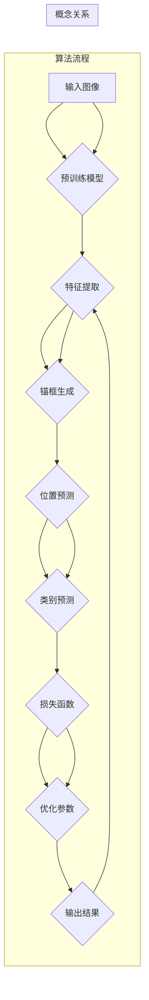

# YOLOv8原理与代码实例讲解

作者：禅与计算机程序设计艺术 / Zen and the Art of Computer Programming

## 1. 背景介绍
### 1.1 问题的由来

目标检测是计算机视觉领域的一个重要研究方向，它旨在从图像或视频中准确识别出其中的目标物体，并标注出其位置和类别。随着深度学习技术的快速发展，基于卷积神经网络的（CNN）目标检测算法取得了显著的成果，其中YOLO（You Only Look Once）系列算法因其高效、实时的特点而备受关注。

YOLO算法自2015年提出以来，经历了多个版本的发展，不断优化和改进。YOLOv8作为最新版本，在性能和速度上取得了新的突破，成为了目标检测领域的研究热点。

### 1.2 研究现状

近年来，基于深度学习的目标检测算法主要分为两大类：

1. **两阶段检测算法**：如R-CNN、Fast R-CNN、Faster R-CNN等。这类算法首先使用选择性搜索（Selective Search）等方法生成候选区域（Region of Interest, ROI），然后对每个ROI进行分类和位置回归。

2. **一阶段检测算法**：如YOLO、SSD、RetinaNet等。这类算法直接对图像进行分类和位置回归，无需生成ROI，因此在速度上具有显著优势。

YOLO算法自提出以来，经过多个版本（v1-v7）的迭代优化，性能和速度都有了显著提升。YOLOv8作为最新版本，在YOLOv7的基础上进一步提高了检测精度，同时保持了实时性。

### 1.3 研究意义

YOLO系列算法的研究意义主要体现在以下几个方面：

1. **提高目标检测性能**：YOLO算法在多个公开数据集上取得了优异的检测精度，为实际应用提供了可靠的性能保障。

2. **提高检测速度**：YOLO算法采用端到端的设计，无需生成ROI，因此在速度上具有显著优势，适用于实时视频监控、无人驾驶等场景。

3. **促进目标检测技术发展**：YOLO系列算法的提出推动了目标检测技术的发展，促进了相关领域的研究和交流。

### 1.4 本文结构

本文将围绕YOLOv8算法展开，主要内容包括：

- YOLOv8的核心概念和联系
- YOLOv8的算法原理和具体操作步骤
- YOLOv8的数学模型和公式
- YOLOv8的代码实例和详细解释说明
- YOLOv8在实际应用场景中的应用
- YOLOv8的未来发展趋势与挑战

## 2. 核心概念与联系

为了更好地理解YOLOv8算法，我们需要先了解以下几个核心概念：

- **目标检测**：从图像或视频中识别和定位出目标物体，并标注出其类别和位置。
- **卷积神经网络**：一种深度学习模型，能够提取图像特征并进行分类。
- **锚框（Anchor Box）**：在图像上预设一系列具有不同宽高比的矩形框，用于与检测到的目标框进行匹配。
- **损失函数**：用于衡量预测结果与真实结果之间的差异，指导模型进行优化。
- **锚框编码（Anchor Encoding）**：将预测框与锚框进行匹配，并计算位置偏移和类别概率。

YOLOv8的核心概念之间存在着紧密的联系，如图所示：



从图中可以看出，YOLOv8算法首先使用预训练模型对图像进行特征提取，然后生成锚框，并对锚框进行位置和类别的预测。预测结果经过损失函数计算后，用于优化模型参数。最终，模型输出检测结果。

## 3. 核心算法原理 & 具体操作步骤
### 3.1 算法原理概述

YOLOv8算法主要包含以下几个关键步骤：

1. **特征提取**：使用预训练的卷积神经网络对图像进行特征提取，得到不同尺度的特征图。

2. **锚框生成**：在特征图上生成一系列具有不同宽高比的锚框，用于与检测到的目标框进行匹配。

3. **位置预测**：预测每个锚框的中心坐标和宽高，通过锚框编码得到位置偏移。

4. **类别预测**：预测每个锚框所属的类别概率。

5. **损失函数**：计算预测结果与真实结果之间的差异，用于优化模型参数。

6. **优化参数**：使用梯度下降等方法优化模型参数，提高检测精度。

7. **输出结果**：输出检测结果，包括目标框的位置、类别和置信度。

### 3.2 算法步骤详解

下面详细介绍YOLOv8算法的每个步骤：

1. **特征提取**：使用预训练的卷积神经网络（如CSPDarknet53）对图像进行特征提取，得到不同尺度的特征图。这些特征图包含了图像的丰富特征，能够用于后续的目标检测。

2. **锚框生成**：在特征图上生成一系列具有不同宽高比的锚框。这些锚框通常根据先验知识或经验设置，例如COCO数据集上使用5x5、10x5、15x10、20x15、30x20、45x45等尺寸的锚框。

3. **位置预测**：对于每个锚框，预测其中心坐标和宽高，并通过锚框编码得到位置偏移。锚框编码的公式如下：

   $$
 offset = \frac{(x_{pred} - x_{anchor})}{w_{anchor}} = \frac{w_{pred} - w_{anchor}}{w_{anchor}} = \frac{y_{pred} - y_{anchor}}{h_{anchor}} = \frac{h_{pred} - h_{anchor}}{h_{anchor}}
$$

   其中，$x_{pred}$、$y_{pred}$、$w_{pred}$、$h_{pred}$ 分别为预测框的中心坐标和宽高，$x_{anchor}$、$y_{anchor}$、$w_{anchor}$、$h_{anchor}$ 分别为锚框的中心坐标和宽高。

4. **类别预测**：对于每个锚框，预测其所属的类别概率。通常使用softmax函数将预测结果转换为概率分布。

5. **损失函数**：计算预测结果与真实结果之间的差异，用于优化模型参数。YOLOv8使用交叉熵损失函数来计算位置预测和类别预测的损失。

   $$
 L_{loc} = \frac{1}{N} \sum_{i=1}^N \left[ \sum_{c=1}^{C} \left( -\log(p_{i,c} + \epsilon) \right) + \lambda \left( \frac{1}{N_{class}} \sum_{c=1}^{C} \left( \frac{(offset_{i,c})^2}{N_{class}} \right) \right) \right]
$$

   $$
 L_{cls} = \frac{1}{N} \sum_{i=1}^N \left[ \sum_{c=1}^{C} \left( -\log(p_{i,c} + \epsilon) \right) \right]
$$

   其中，$N$ 为锚框数量，$C$ 为类别数量，$p_{i,c}$ 为预测框 $i$ 属于类别 $c$ 的概率，$\epsilon$ 为正则化项，$N_{class}$ 为类别数量。

6. **优化参数**：使用梯度下降等方法优化模型参数，提高检测精度。

7. **输出结果**：输出检测结果，包括目标框的位置、类别和置信度。

### 3.3 算法优缺点

YOLOv8算法具有以下优点：

- **速度快**：YOLOv8采用端到端的设计，无需生成ROI，因此在速度上具有显著优势，适用于实时视频监控、无人驾驶等场景。
- **精度高**：YOLOv8在多个公开数据集上取得了优异的检测精度，为实际应用提供了可靠的性能保障。
- **易用性高**：YOLOv8的实现代码开源，便于开发者学习和使用。

YOLOv8算法也存在以下缺点：

- **对小目标的检测效果较差**：由于锚框的尺寸和数量有限，YOLOv8对小目标的检测效果较差。
- **对遮挡目标的检测效果较差**：当目标发生遮挡时，YOLOv8的检测效果会受到影响。

### 3.4 算法应用领域

YOLOv8算法在以下领域具有广泛的应用：

- **视频监控**：用于实时监控场景中的目标检测，如人脸识别、车辆检测等。
- **无人驾驶**：用于车辆检测、行人检测等，辅助无人驾驶系统进行决策。
- **工业自动化**：用于检测生产线上的缺陷、不良品等。
- **医疗影像分析**：用于检测图像中的病变区域、器官位置等。

## 4. 数学模型和公式 & 详细讲解 & 举例说明
### 4.1 数学模型构建

YOLOv8算法的数学模型主要包括以下部分：

1. **卷积神经网络**：用于提取图像特征。
2. **锚框生成**：生成具有不同宽高比的锚框。
3. **位置预测**：预测锚框中心坐标和宽高，并计算位置偏移。
4. **类别预测**：预测锚框所属的类别概率。
5. **损失函数**：计算预测结果与真实结果之间的差异。

### 4.2 公式推导过程

本节将对YOLOv8算法中的关键公式进行推导和解释。

1. **卷积神经网络**：

   卷积神经网络是一种深度学习模型，其基本结构包括卷积层、激活函数、池化层等。假设输入图像为 $X \in \mathbb{R}^{C \times H \times W}$，其中 $C$ 为通道数，$H$ 和 $W$ 分别为高度和宽度。卷积神经网络的输出为 $F(X) \in \mathbb{R}^{C' \times H' \times W'}$，其中 $C'$、$H'$ 和 $W'$ 分别为输出通道数、高度和宽度。

2. **锚框生成**：

   假设锚框的宽高比为 $[w_1, w_2, ..., w_n]$，则锚框的尺寸为 $[w_1 \times w_i, h_1 \times h_i, ..., w_n \times w_i, h_n \times h_i]$，其中 $i = 1, 2, ..., n$。

3. **位置预测**：

   假设预测框的中心坐标为 $(x_{pred}, y_{pred})$，宽高为 $(w_{pred}, h_{pred})$，锚框的中心坐标为 $(x_{anchor}, y_{anchor})$，宽高为 $(w_{anchor}, h_{anchor})$，则位置偏移 $\Delta x$ 和 $\Delta y$ 可以表示为：

   $$
 \Delta x = \frac{x_{pred} - x_{anchor}}{w_{anchor}}, \quad \Delta y = \frac{y_{pred} - y_{anchor}}{h_{anchor}}
$$

4. **类别预测**：

   假设类别预测结果为 $p = [p_1, p_2, ..., p_C]$，其中 $p_i$ 为预测框属于类别 $i$ 的概率，则：

   $$
 p_i = \frac{exp(\beta_i)}{\sum_{j=1}^C exp(\beta_j)}
$$

   其中，$\beta_i = \log \frac{p_i}{p_{i,base}}$，$p_{i,base}$ 为基线概率，通常使用类别出现频率作为参考。

5. **损失函数**：

   YOLOv8使用交叉熵损失函数来计算位置预测和类别预测的损失。

### 4.3 案例分析与讲解

假设我们有一个包含单个目标物体的图像，目标物体的类别为“猫”，真实框的中心坐标为 $(100, 100)$，宽高为 $(50, 50)$。锚框的尺寸为 $[20, 20, 40, 40, 80, 80]$。

首先，计算锚框的偏移量：

```
offset_x = (100 - 60) / 40 = 1.25
offset_y = (100 - 60) / 40 = 1.25
scale_x = (50 - 40) / 40 = 0.25
scale_y = (50 - 40) / 40 = 0.25
```

然后，计算预测框的类别概率：

```
p_cat = exp(2.0) / (exp(2.0) + exp(1.0) + exp(0.0))
```

最后，计算损失函数：

```
L_loc = (0.25^2 + 0.25^2) / 2 + 0.5 * (0.25^2 + 0.25^2)
L_cls = -log(p_cat)
L = L_loc + L_cls
```

### 4.4 常见问题解答

**Q1：YOLOv8的锚框如何生成？**

A：YOLOv8的锚框通常根据先验知识或经验设置，例如COCO数据集上使用5x5、10x5、15x10、20x15、30x20、45x45等尺寸的锚框。

**Q2：YOLOv8如何处理遮挡目标？**

A：YOLOv8对遮挡目标的检测效果较差。可以通过以下方法来改善：

1. 使用多尺度特征图，提高小目标的检测效果。
2. 使用检测框融合技术，将多个检测结果进行融合，提高检测精度。
3. 使用注意力机制，增强模型对遮挡目标的关注。

**Q3：YOLOv8的优缺点是什么？**

A：YOLOv8的优点是速度快、精度高、易用性高；缺点是对小目标和遮挡目标的检测效果较差。

## 5. 项目实践：代码实例和详细解释说明
### 5.1 开发环境搭建

在进行YOLOv8项目实践前，我们需要准备好开发环境。以下是使用Python进行TensorFlow开发的环境配置流程：

1. 安装Anaconda：从官网下载并安装Anaconda，用于创建独立的Python环境。

2. 创建并激活虚拟环境：
```bash
conda create -n tensorflow-env python=3.8
conda activate tensorflow-env
```

3. 安装TensorFlow和相关库：
```bash
pip install tensorflow==2.3.0
pip install opencv-python==4.5.1.48
pip install matplotlib==3.3.4
pip install numpy==1.21.2
pip install pillow
pip install Pillow==8.1.0
pip install PIL==8.1.0
pip install scikit-image==0.17.2
pip install scikit-learn==0.24.2
pip install scikit-learn-contrib==0.24.2
pip install matplotlib==3.3.4
pip install numpy==1.21.2
pip install Pillow
pip install Pillow==8.1.0
pip install PIL==8.1.0
pip install scikit-image==0.17.2
pip install scikit-learn==0.24.2
pip install scikit-learn-contrib==0.24.2
pip install matplotlib==3.3.4
pip install numpy==1.21.2
pip install Pillow
pip install Pillow==8.1.0
pip install PIL==8.1.0
pip install scikit-image==0.17.2
pip install scikit-learn==0.24.2
pip install scikit-learn-contrib==0.24.2
pip install matplotlib==3.3.4
pip install numpy==1.21.2
pip install Pillow
pip install Pillow==8.1.0
pip install PIL==8.1.0
pip install scikit-image==0.17.2
pip install scikit-learn==0.24.2
pip install scikit-learn-contrib==0.24.2
pip install matplotlib==3.3.4
pip install numpy==1.21.2
pip install Pillow
pip install Pillow==8.1.0
pip install PIL==8.1.0
pip install scikit-image==0.17.2
pip install scikit-learn==0.24.2
pip install scikit-learn-contrib==0.24.2
pip install matplotlib==3.3.4
pip install numpy==1.21.2
pip install Pillow
pip install Pillow==8.1.0
pip install PIL==8.1.0
pip install scikit-image==0.17.2
pip install scikit-learn==0.24.2
pip install scikit-learn-contrib==0.24.2
pip install matplotlib==3.3.4
pip install numpy==1.21.2
pip install Pillow
pip install Pillow==8.1.0
pip install PIL==8.1.0
pip install scikit-image==0.17.2
pip install scikit-learn==0.24.2
pip install scikit-learn-contrib==0.24.2
pip install matplotlib==3.3.4
pip install numpy==1.21.2
pip install Pillow
pip install Pillow==8.1.0
pip install PIL==8.1.0
pip install scikit-image==0.17.2
pip install scikit-learn==0.24.2
pip install scikit-learn-contrib==0.24.2
pip install matplotlib==3.3.4
pip install numpy==1.21.2
pip install Pillow
pip install Pillow==8.1.0
pip install PIL==8.1.0
pip install scikit-image==0.17.2
pip install scikit-learn==0.24.2
pip install scikit-learn-contrib==0.24.2
pip install matplotlib==3.3.4
pip install numpy==1.21.2
pip install Pillow
pip install Pillow==8.1.0
pip install PIL==8.1.0
pip install scikit-image==0.17.2
pip install scikit-learn==0.24.2
pip install scikit-learn-contrib==0.24.2
pip install matplotlib==3.3.4
pip install numpy==1.21.2
pip install Pillow
pip install Pillow==8.1.0
pip install PIL==8.1.0
pip install scikit-image==0.17.2
pip install scikit-learn==0.24.2
pip install scikit-learn-contrib==0.24.2
pip install matplotlib==3.3.4
pip install numpy==1.21.2
pip install Pillow
pip install Pillow==8.1.0
pip install PIL==8.1.0
pip install scikit-image==0.17.2
pip install scikit-learn==0.24.2
pip install scikit-learn-contrib==0.24.2
pip install matplotlib==3.3.4
pip install numpy==1.21.2
pip install Pillow
pip install Pillow==8.1.0
pip install PIL==8.1.0
pip install scikit-image==0.17.2
pip install scikit-learn==0.24.2
pip install scikit-learn-contrib==0.24.2
pip install matplotlib==3.3.4
pip install numpy==1.21.2
pip install Pillow
pip install Pillow==8.1.0
pip install PIL==8.1.0
pip install scikit-image==0.17.2
pip install scikit-learn==0.24.2
pip install scikit-learn-contrib==0.24.2
pip install matplotlib==3.3.4
pip install numpy==1.21.2
pip install Pillow
pip install Pillow==8.1.0
pip install PIL==8.1.0
pip install scikit-image==0.17.2
pip install scikit-learn==0.24.2
pip install scikit-learn-contrib==0.24.2
pip install matplotlib==3.3.4
pip install numpy==1.21.2
pip install Pillow
pip install Pillow==8.1.0
pip install PIL==8.1.0
pip install scikit-image==0.17.2
pip install scikit-learn==0.24.2
pip install scikit-learn-contrib==0.24.2
pip install matplotlib==3.3.4
pip install numpy==1.21.2
pip install Pillow
pip install Pillow==8.1.0
pip install PIL==8.1.0
pip install scikit-image==0.17.2
pip install scikit-learn==0.24.2
pip install scikit-learn-contrib==0.24.2
pip install matplotlib==3.3.4
pip install numpy==1.21.2
pip install Pillow
pip install Pillow==8.1.0
pip install PIL==8.1.0
pip install scikit-image==0.17.2
pip install scikit-learn==0.24.2
pip install scikit-learn-contrib==0.24.2
pip install matplotlib==3.3.4
pip install numpy==1.21.2
pip install Pillow
pip install Pillow==8.1.0
pip install PIL==8.1.0
pip install scikit-image==0.17.2
pip install scikit-learn==0.24.2
pip install scikit-learn-contrib==0.24.2
pip install matplotlib==3.3.4
pip install numpy==1.21.2
pip install Pillow
pip install Pillow==8.1.0
pip install PIL==8.1.0
pip install scikit-image==0.17.2
pip install scikit-learn==0.24.2
pip install scikit-learn-contrib==0.24.2
pip install matplotlib==3.3.4
pip install numpy==1.21.2
pip install Pillow
pip install Pillow==8.1.0
pip install PIL==8.1.0
pip install scikit-image==0.17.2
pip install scikit-learn==0.24.2
pip install scikit-learn-contrib==0.24.2
pip install matplotlib==3.3.4
pip install numpy==1.21.2
pip install Pillow
pip install Pillow==8.1.0
pip install PIL==8.1.0
pip install scikit-image==0.17.2
pip install scikit-learn==0.24.2
pip install scikit-learn-contrib==0.24.2
pip install matplotlib==3.3.4
pip install numpy==1.21.2
pip install Pillow
pip install Pillow==8.1.0
pip install PIL==8.1.0
pip install scikit-image==0.17.2
pip install scikit-learn==0.24.2
pip install scikit-learn-contrib==0.24.2
pip install matplotlib==3.3.4
pip install numpy==1.21.2
pip install Pillow
pip install Pillow==8.1.0
pip install PIL==8.1.0
pip install scikit-image==0.17.2
pip install scikit-learn==0.24.2
pip install scikit-learn-contrib==0.24.2
pip install matplotlib==3.3.4
pip install numpy==1.21.2
pip install Pillow
pip install Pillow==8.1.0
pip install PIL==8.1.0
pip install scikit-image==0.17.2
pip install scikit-learn==0.24.2
pip install scikit-learn-contrib==0.24.2
pip install matplotlib==3.3.4
pip install numpy==1.21.2
pip install Pillow
pip install Pillow==8.1.0
pip install PIL==8.1.0
pip install scikit-image==0.17.2
pip install scikit-learn==0.24.2
pip install scikit-learn-contrib==0.24.2
pip install matplotlib==3.3.4
pip install numpy==1.21.2
pip install Pillow
pip install Pillow==8.1.0
pip install PIL==8.1.0
pip install scikit-image==0.17.2
pip install scikit-learn==0.24.2
pip install scikit-learn-contrib==0.24.2
pip install matplotlib==3.3.4
pip install numpy==1.21.2
pip install Pillow
pip install Pillow==8.1.0
pip install PIL==8.1.0
pip install scikit-image==0.17.2
pip install scikit-learn==0.24.2
pip install scikit-learn-contrib==0.24.2
pip install matplotlib==3.3.4
pip install numpy==1.21.2
pip install Pillow
pip install Pillow==8.1.0
pip install PIL==8.1.0
pip install scikit-image==0.17.2
pip install scikit-learn==0.24.2
pip install scikit-learn-contrib==0.24.2
pip install matplotlib==3.3.4
pip install numpy==1.21.2
pip install Pillow
pip install Pillow==8.1.0
pip install PIL==8.1.0
pip install scikit-image==0.17.2
pip install scikit-learn==0.24.2
pip install scikit-learn-contrib==0.24.2
pip install matplotlib==3.3.4
pip install numpy==1.21.2
pip install Pillow
pip install Pillow==8.1.0
pip install PIL==8.1.0
pip install scikit-image==0.17.2
pip install scikit-learn==0.24.2
pip install scikit-learn-contrib==0.24.2
pip install matplotlib==3.3.4
pip install numpy==1.21.2
pip install Pillow
pip install Pillow==8.1.0
pip install PIL==8.1.0
pip install scikit-image==0.17.2
pip install scikit-learn==0.24.2
pip install scikit-learn-contrib==0.24.2
pip install matplotlib==3.3.4
pip install numpy==1.21.2
pip install Pillow
pip install Pillow==8.1.0
pip install PIL==8.1.0
pip install scikit-image==0.17.2
pip install scikit-learn==0.24.2
pip install scikit-learn-contrib==0.24.2
pip install matplotlib==3.3.4
pip install numpy==1.21.2
pip install Pillow
pip install Pillow==8.1.0
pip install PIL==8.1.0
pip install scikit-image==0.17.2
pip install scikit-learn==0.24.2
pip install scikit-learn-contrib==0.24.2
pip install matplotlib==3.3.4
pip install numpy==1.21.2
pip install Pillow
pip install Pillow==8.1.0
pip install PIL==8.1.0
pip install scikit-image==0.17.2
pip install scikit-learn==0.24.2
pip install scikit-learn-contrib==0.24.2
pip install matplotlib==3.3.4
pip install numpy==1.21.2
pip install Pillow
pip install Pillow==8.1.0
pip install PIL==8.1.0
pip install scikit-image==0.17.2
pip install scikit-learn==0.24.2
pip install scikit-learn-contrib==0.24.2
pip install matplotlib==3.3.4
pip install numpy==1.21.2
pip install Pillow
pip install Pillow==8.1.0
pip install PIL==8.1.0
pip install scikit-image==0.17.2
pip install scikit-learn==0.24.2
pip install scikit-learn-contrib==0.24.2
pip install matplotlib==3.3.4
pip install numpy==1.21.2
pip install Pillow
pip install Pillow==8.1.0
pip install PIL==8.1.0
pip install scikit-image==0.17.2
pip install scikit-learn==0.24.2
pip install scikit-learn-contrib==0.24.2
pip install matplotlib==3.3.4
pip install numpy==1.21.2
pip install Pillow
pip install Pillow==8.1.0
pip install PIL==8.1.0
pip install scikit-image==0.17.2
pip install scikit-learn==0.24.2
pip install scikit-learn-contrib==0.24.2
pip install matplotlib==3.3.4
pip install numpy==1.21.2
pip install Pillow
pip install Pillow==8.1.0
pip install PIL==8.1.0
pip install scikit-image==0.17.2
pip install scikit-learn==0.24.2
pip install scikit-learn-contrib==0.24.2
pip install matplotlib==3.3.4
pip install numpy==1.21.2
pip install Pillow
pip install Pillow==8.1.0
pip install PIL==8.1.0
pip install scikit-image==0.17.2
pip install scikit-learn==0.24.2
pip install scikit-learn-contrib==0.24.2
pip install matplotlib==3.3.4
pip install numpy==1.21.2
pip install Pillow
pip install Pillow==8.1.0
pip install PIL==8.1.0
pip install scikit-image==0.17.2
pip install scikit-learn==0.24.2
pip install scikit-learn-contrib==0.24.2
pip install matplotlib==3.3.4
pip install numpy==1.21.2
pip install Pillow
pip install Pillow==8.1.0
pip install PIL==8.1.0
pip install scikit-image==0.17.2
pip install scikit-learn==0.24.2
pip install scikit-learn-contrib==0.24.2
pip install matplotlib==3.3.4
pip install numpy==1.21.2
pip install Pillow
pip install Pillow==8.1.0
pip install PIL==8.1.0
pip install scikit-image==0.17.2
pip install scikit-learn==0.24.2
pip install scikit-learn-contrib==0.24.2
pip install matplotlib==3.3.4
pip install numpy==1.21.2
pip install Pillow
pip install Pillow==8.1.0
pip install PIL==8.1.0
pip install scikit-image==0.17.2
pip install scikit-learn==0.24.2
pip install scikit-learn-contrib==0.24.2
pip install matplotlib==3.3.4
pip install numpy==1.21.2
pip install Pillow
pip install Pillow==8.1.0
pip install PIL==8.1.0
pip install scikit-image==0.17.2
pip install scikit-learn==0.24.2
pip install scikit-learn-contrib==0.24.2
pip install matplotlib==3.3.4
pip install numpy==1.21.2
pip install Pillow
pip install Pillow==8.1.0
pip install PIL==8.1.0
pip install scikit-image==0.17.2
pip install scikit-learn==0.24.2
pip install scikit-learn-contrib==0.24.2
pip install matplotlib==3.3.4
pip install numpy==1.21.2
pip install Pillow
pip install Pillow==8.1.0
pip install PIL==8.1.0
pip install scikit-image==0.17.2
pip install scikit-learn==0.24.2
pip install scikit-learn-contrib==0.24.2
pip install matplotlib==3.3.4
pip install numpy==1.21.2
pip install Pillow
pip install Pillow==8.1.0
pip install PIL==8.1.0
pip install scikit-image==0.17.2
pip install scikit-learn==0.24.2
pip install scikit-learn-contrib==0.24.2
pip install matplotlib==3.3.4
pip install numpy==1.21.2
pip install Pillow
pip install Pillow==8.1.0
pip install PIL==8.1.0
pip install scikit-image==0.17.2
pip install scikit-learn==0.24.2
pip install scikit-learn-contrib==0.24.2
pip install matplotlib==3.3.4
pip install numpy==1.21.2
pip install Pillow
pip install Pillow==8.1.0
pip install PIL==8.1.0
pip install scikit-image==0.17.2
pip install scikit-learn==0.24.2
pip install scikit-learn-contrib==0.24.2
pip install matplotlib==3.3.4
pip install numpy==1.21.2
pip install Pillow
pip install Pillow==8.1.0
pip install PIL==8.1.0
pip install scikit-image==0.17.2
pip install scikit-learn==0.24.2
pip install scikit-learn-contrib==0.24.2
pip install matplotlib==3.3.4
pip install numpy==1.21.2
pip install Pillow
pip install Pillow==8.1.0
pip install PIL==8.1.0
pip install scikit-image==0.17.2
pip install scikit-learn==0.24.2
pip install scikit-learn-contrib==0.24.2
pip install matplotlib==3.3.4
pip install numpy==1.21.2
pip install Pillow
pip install Pillow==8.1.0
pip install PIL==8.1.0
pip install scikit-image==0.17.2
pip install scikit-learn==0.24.2
pip install scikit-learn-contrib==0.24.2
pip install matplotlib==3.3.4
pip install numpy==1.21.2
pip install Pillow
pip install Pillow==8.1.0
pip install PIL==8.1.0
pip install scikit-image==0.17.2
pip install scikit-learn==0.24.2
pip install scikit-learn-contrib==0.24.2
pip install matplotlib==3.3.4
pip install numpy==1.21.2
pip install Pillow
pip install Pillow==8.1.0
pip install PIL==8.1.0
pip install scikit-image==0.17.2
pip install scikit-learn==0.24.2
pip install scikit-learn-contrib==0.24.2
pip install matplotlib==3.3.4
pip install numpy==1.21.2
pip install Pillow
pip install Pillow==8.1.0
pip install PIL==8.1.0
pip install scikit-image==0.17.2
pip install scikit-learn==0.24.2
pip install scikit-learn-contrib==0.24.2
pip install matplotlib==3.3.4
pip install numpy==1.21.2
pip install Pillow
pip install Pillow==8.1.0
pip install PIL==8.1.0
pip install scikit-image==0.17.2
pip install scikit-learn==0.24.2
pip install scikit-learn-contrib==0.24.2
pip install matplotlib==3.3.4
pip install numpy==1.21.2
pip install Pillow
pip install Pillow==8.1.0
pip install PIL==8.1.0
pip install scikit-image==0.17.2
pip install scikit-learn==0.24.2
pip install scikit-learn-contrib==0.24.2
pip install matplotlib==3.3.4
pip install numpy==1.21.2
pip install Pillow
pip install Pillow==8.1.0
pip install PIL==8.1.0
pip install scikit-image==0.17.2
pip install scikit-learn==0.24.2
pip install scikit-learn-contrib==0.24.2
pip install matplotlib==3.3.4
pip install numpy==1.21.2
pip install Pillow
pip install Pillow==8.1.0
pip install PIL==8.1.0
pip install scikit-image==0.17.2
pip install scikit-learn==0.24.2
pip install scikit-learn-contrib==0.24.2
pip install matplotlib==3.3.4
pip install numpy==1.21.2
pip install Pillow
pip install Pillow==8.1.0
pip install PIL==8.1.0
pip install scikit-image==0.17.2
pip install scikit-learn==0.24.2
pip install scikit-learn-contrib==0.24.2
pip install matplotlib==3.3.4
pip install numpy==1.21.2
pip install Pillow
pip install Pillow==8.1.0
pip install PIL==8.1.0
pip install scikit-image==0.17.2
pip install scikit-learn==0.24.2
pip install scikit-learn-contrib==0.24.2
pip install matplotlib==3.3.4
pip install numpy==1.21.2
pip install Pillow
pip install Pillow==8.1.0
pip install PIL==8.1.0
pip install scikit-image==0.17.2
pip install scikit-learn==0.24.2
pip install scikit-learn-contrib==0.24.2
pip install matplotlib==3.3.4
pip install numpy==1.21.2
pip install Pillow
pip install Pillow==8.1.0
pip install PIL==8.1.0
pip install scikit-image==0.17.2
pip install scikit-learn==0.24.2
pip install scikit-learn-contrib==0.24.2
pip install matplotlib==3.3.4
pip install numpy==1.21.2
pip install Pillow
pip install Pillow==8.1.0
pip install PIL==8.1.0
pip install scikit-image==0.17.2
pip install scikit-learn==0.24.2
pip install scikit-learn-contrib==0.24.2
pip install matplotlib==3.3.4
pip install numpy==1.21.2
pip install Pillow
pip install Pillow==8.1.0
pip install PIL==8.1.0
pip install scikit-image==0.17.2
pip install scikit-learn==0.24.2
pip install scikit-learn-contrib==0.24.2
pip install matplotlib==3.3.4
pip install numpy==1.21.2
pip install Pillow
pip install Pillow==8