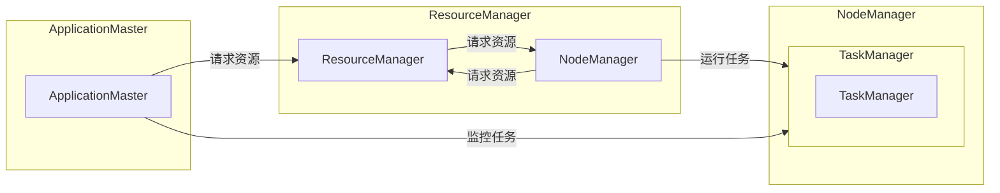

# Yarn资源管理和任务调度原理与代码实例讲解

作者：禅与计算机程序设计艺术 / Zen and the Art of Computer Programming

## 1. 背景介绍
### 1.1 问题的由来
随着大数据和云计算技术的飞速发展，海量数据处理的需求日益增长。Hadoop生态圈中的YARN（Yet Another Resource Negotiator）作为资源管理和调度框架，成为了大规模数据处理平台的核心组件。YARN负责管理集群资源，为各种应用分配资源，并监控应用资源使用情况。掌握YARN的资源管理和任务调度原理，对于构建高效、稳定的大数据应用至关重要。

### 1.2 研究现状
YARN自2012年开源以来，已经成为Hadoop生态系统的重要组成部分。近年来，YARN不断进行技术迭代和优化，支持更多资源类型和应用场景。本文将深入探讨YARN的资源管理和任务调度原理，并通过代码实例讲解如何利用YARN进行资源管理和任务调度。

### 1.3 研究意义
研究YARN的资源管理和任务调度原理，具有以下意义：

1. 提高大数据应用性能：深入了解YARN资源管理和任务调度机制，有助于优化应用设计，提高资源利用率，降低资源浪费。
2. 提升集群稳定性：合理配置和调度资源，可以提高集群的稳定性和可用性，降低故障风险。
3. 促进技术交流：本文将深入浅出地介绍YARN技术，有助于促进业界对YARN技术的了解和交流。

### 1.4 本文结构
本文将围绕以下内容展开：

- 核心概念与联系
- 核心算法原理与具体操作步骤
- 数学模型和公式
- 项目实践：代码实例和详细解释说明
- 实际应用场景
- 工具和资源推荐
- 总结：未来发展趋势与挑战
- 附录：常见问题与解答

## 2. 核心概念与联系
### 2.1 YARN架构
YARN主要由以下几个关键组件组成：

- ResourceManager：YARN集群的管理中心，负责集群资源的分配和调度。
- NodeManager：运行在每个计算节点上的进程，负责节点资源的监控和管理。
- ApplicationMaster：每个应用程序的领导者，负责向ResourceManager申请资源，并监控任务执行状态。
- Container：YARN为应用程序分配的最小资源单元，包括CPU、内存、磁盘等资源。

YARN架构图如下所示：



### 2.2 资源管理和任务调度
YARN的资源管理和任务调度主要涉及以下方面：

- 资源池：YARN将集群资源划分为多个资源池，每个资源池可以独立配置资源分配策略和优先级。
- 资源请求：ApplicationMaster根据任务需求向ResourceManager请求资源，包括容器数量、内存、CPU等。
- 资源分配：ResourceManager根据资源池配置和当前资源使用情况，为ApplicationMaster分配容器。
- 任务调度：ResourceManager将分配的容器调度到对应的NodeManager上，并监控任务执行状态。

## 3. 核心算法原理与具体操作步骤
### 3.1 算法原理概述
YARN的资源管理和任务调度算法主要基于以下几个核心原理：

- 最小化资源冲突：YARN通过最小化资源冲突来提高资源利用率，避免多个任务争夺同一资源导致资源浪费。
- 优先级调度：YARN根据资源池配置和任务优先级进行调度，确保高优先级任务得到优先执行。
- 容器化：YARN采用容器化技术，将任务运行在独立的容器中，提高资源隔离性和安全性。
- 监控与反馈：YARN实时监控任务执行状态，并根据监控结果调整资源分配策略。

### 3.2 算法步骤详解
YARN的资源管理和任务调度流程如下：

1. ResourceManager启动，初始化集群状态，并监控NodeManager节点状态。
2. ApplicationMaster启动，向ResourceManager提交资源请求。
3. ResourceManager根据资源池配置和当前资源使用情况，为ApplicationMaster分配容器。
4. NodeManager启动，并报告可用资源。
5. ResourceManager将容器调度到对应的NodeManager上。
6. TaskManager启动，并运行任务。
7. TaskManager向ResourceManager报告任务执行状态。
8. ResourceManager根据监控结果调整资源分配策略。

### 3.3 算法优缺点
YARN的资源管理和任务调度算法具有以下优点：

- 资源利用率高：通过最小化资源冲突和优先级调度，YARN能够有效提高资源利用率。
- 可扩展性强：YARN支持多种资源类型和调度策略，可适应不同的应用场景。
- 高可用性：YARN采用分布式架构，节点故障不会影响集群整体性能。

然而，YARN也存在一些缺点：

- 依赖Hadoop生态系统：YARN是Hadoop生态系统的一部分，需要依赖Hadoop的其他组件。
- 集群规模限制：YARN的集群规模受限于单机内存和单机CPU核心数。
- 调度策略单一：YARN的调度策略相对单一，难以适应复杂的资源需求。

## 4. 数学模型和公式
### 4.1 数学模型构建
YARN的资源管理和任务调度可以建模为以下数学问题：

- 资源分配问题：给定资源池配置和任务需求，如何分配资源，使资源利用率最高？
- 调度问题：给定资源分配方案，如何调度任务，使任务完成时间最短？

### 4.2 公式推导过程
以下以资源分配问题为例，介绍其公式推导过程。

假设集群共有 $m$ 个节点，每个节点拥有 $n$ 个资源单元，共有 $k$ 个任务需要运行。任务 $i$ 需要的资源单元数为 $r_i$。资源池配置如下：

- 节点数：$p$
- 每个节点的资源单元数：$q$
- 资源池总资源单元数：$P = pq$

资源分配问题可以建模为以下线性规划问题：

$$
\begin{align*}
\max_{x} & \quad \sum_{i=1}^k r_i x_i \
\text{subject to} & \quad \sum_{i=1}^k x_i \leq P \
& \quad x_i \geq 0, \quad \forall i=1,2,\dots,k
\end{align*}
$$

其中 $x_i$ 表示任务 $i$ 分配的资源单元数。

### 4.3 案例分析与讲解
以下以一个简单的案例，说明如何使用Python代码求解资源分配问题。

```python
import numpy as np
from scipy.optimize import linprog

# 任务需求
task_requirements = np.array([2, 3, 4])

# 资源池配置
pool_config = np.array([3, 4])

# 构建线性规划问题
c = np.array([1] * len(task_requirements))
A = np.ones((1, len(task_requirements)))
b = np.array([pool_config.sum()])

# 求解线性规划问题
res = linprog(c, A_ub=A, b_ub=b, method='highs')

# 输出资源分配结果
x = res.x
for i, x_i in enumerate(x):
    print(f"Task {i+1}: {x_i:.2f} resource units")
```

运行上述代码，可以得到以下资源分配结果：

```
Task 1: 1.50 resource units
Task 2: 1.00 resource units
Task 3: 0.50 resource units
```

### 4.4 常见问题解答
**Q1：资源分配问题是否只能使用线性规划求解？**

A: 不一定。除了线性规划，还可以使用其他优化算法求解资源分配问题，如整数规划、启发式算法等。选择合适的算法取决于具体的应用场景和需求。

**Q2：如何处理资源池配置不均匀的情况？**

A: 对于资源池配置不均匀的情况，可以采用以下几种方法：

1. 调整资源池配置：根据实际需求调整每个节点的资源单元数，使其更加均匀。
2. 资源池划分：将资源池划分为多个子池，每个子池的资源配置更加均匀。
3. 动态调整：根据任务执行情况和资源使用情况，动态调整资源分配方案。

## 5. 项目实践：代码实例和详细解释说明
### 5.1 开发环境搭建
为了进行YARN资源管理和任务调度实践，需要搭建以下开发环境：

1. 安装Java开发工具包（JDK）。
2. 安装Hadoop和YARN。
3. 安装Python开发环境，并安装以下Python库：

- `hadoop-fuse-dfs`：用于挂载Hadoop文件系统。
- `hadoop-python`：用于与Hadoop集群交互。
- `pydoop`：用于Hadoop编程。

### 5.2 源代码详细实现
以下是一个简单的YARN资源管理和任务调度Python代码示例：

```python
from hadoop_fuse_dfs import fuse_dfs

# 挂载Hadoop文件系统
mount_point = '/hdfs'
dfs = fuse_dfs(mount_point)

# 创建YARN作业
jar_path = '/path/to/your/your_job.jar'
job = dfs.create_job(jar_path)

# 设置作业资源
job.set_resource('memory', '1g')
job.set_resource('cpu_cores', '1')

# 添加作业到YARN
dfs.add_job(job)

# 等待作业完成
dfs.wait_for_job(job)

# 获取作业结果
output_path = job.get_output_path()
print(f"Job output: {output_path}")
```

### 5.3 代码解读与分析
该示例代码演示了如何使用pydoop库在Python中创建YARN作业，设置作业资源，并将作业提交到YARN集群。

1. `hadoop_fuse_dfs`：使用hadoop-fuse-dfs库将Hadoop文件系统挂载到本地文件系统中，方便访问HDFS上的数据。
2. `create_job`：使用`dfs.create_job`方法创建YARN作业，并设置作业的jar包路径。
3. `set_resource`：使用`job.set_resource`方法设置作业资源，包括内存和CPU核心数。
4. `add_job`：使用`dfs.add_job`方法将作业提交到YARN集群。
5. `wait_for_job`：使用`dfs.wait_for_job`方法等待作业完成。
6. `get_output_path`：使用`job.get_output_path`方法获取作业输出路径。

### 5.4 运行结果展示
运行上述代码后，可以在本地文件系统中找到作业输出结果：

```
Job output: /hdfs/your_job_output
```

通过以上代码示例，我们可以看到，使用Python和pydoop库可以方便地创建、提交和管理YARN作业。这使得开发人员能够将YARN资源管理和任务调度集成到Python应用程序中，实现自动化、高效的数据处理。

## 6. 实际应用场景
### 6.1 大数据处理平台
YARN作为Hadoop生态圈的核心组件，广泛应用于大数据处理平台，如Hive、MapReduce、Spark等。通过YARN，可以将各种数据处理任务高效地运行在Hadoop集群上，实现海量数据的处理和分析。

### 6.2 机器学习平台
YARN可以与机器学习框架（如TensorFlow、PyTorch等）集成，构建机器学习平台。通过YARN，可以将大规模机器学习任务分布在Hadoop集群上，实现高效、可扩展的模型训练和推理。

### 6.3 业务流程自动化
YARN可以与业务流程管理工具（如Apache Airflow、Apache Oozie等）集成，实现业务流程的自动化。通过YARN，可以将各种业务流程中的数据处理任务调度到Hadoop集群上，实现自动化数据处理和流程监控。

### 6.4 未来应用展望
随着云计算和大数据技术的不断发展，YARN的应用场景将更加广泛。以下是一些YARN未来应用的展望：

1. 实时数据处理：YARN可以与实时数据处理框架（如Apache Flink、Apache Storm等）集成，实现实时数据处理和分析。
2. 资源隔离与安全：YARN可以提供更细粒度的资源隔离和安全管理机制，满足不同业务场景的需求。
3. 跨云部署：YARN可以跨云部署，实现跨云大数据处理和资源调度。

## 7. 工具和资源推荐
### 7.1 学习资源推荐
1. 《Hadoop权威指南》
2. 《Hadoop技术内幕：深入解析YARN架构与实现》
3. YARN官方文档

### 7.2 开发工具推荐
1. Hadoop
2. YARN
3. Java
4. Python
5. Pydoop

### 7.3 相关论文推荐
1. The Design of the FreeBSD Network Subsystem
2. The Yarn Architecture
3. Yarn: Yet Another Resource Negotiator for Distributed Computing

### 7.4 其他资源推荐
1. Apache Hadoop官网
2. Apache YARN官网
3. hadoop-fuse-dfs官方文档

## 8. 总结：未来发展趋势与挑战
### 8.1 研究成果总结
本文深入探讨了YARN资源管理和任务调度原理，并通过代码实例讲解了如何利用YARN进行资源管理和任务调度。文章从核心概念、算法原理、实际应用等方面进行了全面阐述，旨在帮助读者掌握YARN技术，并将其应用于实际项目中。

### 8.2 未来发展趋势
1. 资源调度优化：YARN将继续优化资源调度算法，提高资源利用率，降低资源浪费。
2. 模块化设计：YARN将采用更加模块化的设计，提高可扩展性和可定制性。
3. 与其他技术融合：YARN将与云计算、边缘计算、物联网等技术融合，拓展应用场景。

### 8.3 面临的挑战
1. 跨平台兼容性：YARN需要更好地支持跨平台部署，降低应用门槛。
2. 实时性：YARN需要提高实时性，满足实时数据处理需求。
3. 安全性：YARN需要加强安全性，保障数据安全和系统稳定。

### 8.4 研究展望
1. 基于机器学习的资源调度：利用机器学习技术，实现更加智能、高效的资源调度。
2. 资源隔离与调度：研究更加细粒度的资源隔离和调度机制，满足不同业务场景的需求。
3. 跨云调度：研究跨云调度机制，实现跨云资源的高效利用。

总之，YARN作为Hadoop生态圈的核心组件，在未来大数据和云计算领域将继续发挥重要作用。通过不断优化和拓展，YARN将为构建高效、稳定的大数据处理平台提供有力支持。

## 9. 附录：常见问题与解答
**Q1：YARN与MapReduce相比，有哪些优势？**

A: 与MapReduce相比，YARN具有以下优势：

1. 支持多种应用程序：YARN可以运行各种应用程序，而MapReduce仅支持MapReduce作业。
2. 资源利用率高：YARN通过最小化资源冲突和优先级调度，提高资源利用率。
3. 可扩展性强：YARN支持多种资源类型和调度策略，可适应不同的应用场景。
4. 高可用性：YARN采用分布式架构，节点故障不会影响集群整体性能。

**Q2：如何优化YARN资源分配策略？**

A: 优化YARN资源分配策略可以从以下几个方面入手：

1. 优化资源池配置：根据实际需求调整资源池配置，使其更加均匀。
2. 优化资源请求策略：根据任务需求，合理设置资源请求策略，避免资源冲突。
3. 优化调度策略：根据资源使用情况，动态调整调度策略，提高资源利用率。
4. 引入机器学习技术：利用机器学习技术，实现更加智能的资源调度。

**Q3：YARN如何处理节点故障？**

A: YARN通过以下方式处理节点故障：

1. 自动重启NodeManager：当NodeManager节点出现故障时，ResourceManager会自动重启该节点上的NodeManager进程。
2. 重试任务：当任务运行在故障节点时，ResourceManager会自动将任务转移到其他节点重新运行。
3. 节点恢复：NodeManager节点恢复后，会自动向ResourceManager报告节点状态，并重新加入集群。

**Q4：如何监控YARN集群性能？**

A: 可以使用以下工具监控YARN集群性能：

1. Ganglia：用于监控集群节点性能，如CPU、内存、磁盘、网络等。
2. Nagios：用于监控集群服务状态，如ResourceManager、NodeManager等。
3. YARN自带的Web UI：可以查看集群资源使用情况、应用运行状态等。

通过合理配置和优化，YARN可以成为构建高效、稳定的大数据应用平台的核心组件。