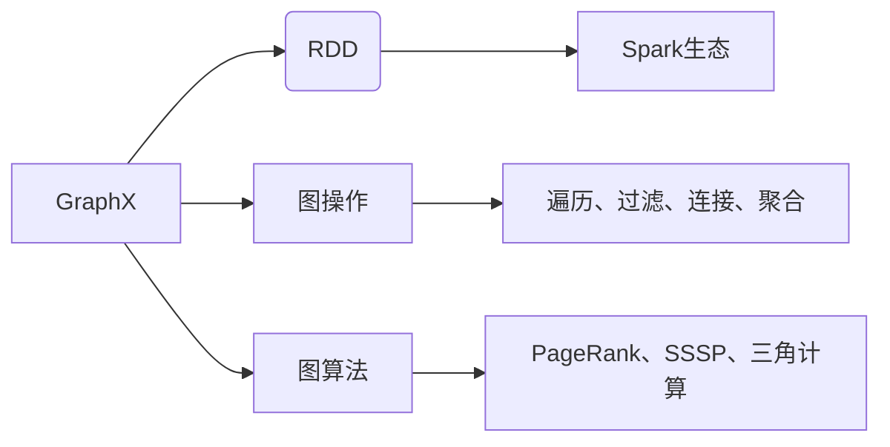

# 【AI大数据计算原理与代码实例讲解】GraphX

作者：禅与计算机程序设计艺术 / Zen and the Art of Computer Programming


## 1. 背景介绍

### 1.1 问题的由来

随着大数据时代的到来，数据处理和分析成为各个行业关注的焦点。传统的数据处理框架如MapReduce在处理大规模分布式数据时，存在着扩展性差、编程复杂度高等问题。而图计算作为一种强大的数据处理和分析方法，在社交网络分析、推荐系统、搜索引擎等领域取得了显著成果。GraphX作为Apache Spark的图计算框架，凭借其高效、易用的特点，成为了大数据领域的一个重要工具。

### 1.2 研究现状

GraphX自2014年开源以来，得到了广泛关注。随着Spark生态的不断完善，GraphX也不断更新迭代，功能日益强大。目前，GraphX已成为大数据领域最受欢迎的图计算框架之一。

### 1.3 研究意义

GraphX在以下几个方面具有重要意义：

- **高效处理大规模图数据**：GraphX能够高效地处理大规模图数据，在分布式计算环境中展现出优异的性能。
- **易用性**：GraphX提供了丰富的API接口，降低了图计算的学习门槛。
- **与Spark生态融合**：GraphX与Spark生态紧密融合，可以方便地与其他Spark组件进行集成。

### 1.4 本文结构

本文将系统介绍GraphX的原理、应用场景和代码实例，内容安排如下：

- 第2部分，介绍GraphX的核心概念与联系。
- 第3部分，详细讲解GraphX的算法原理和操作步骤。
- 第4部分，介绍GraphX的数学模型和公式，并举例说明。
- 第5部分，给出GraphX的代码实例和详细解释说明。
- 第6部分，探讨GraphX的实际应用场景和未来发展趋势。
- 第7部分，推荐GraphX相关的学习资源、开发工具和参考文献。
- 第8部分，总结GraphX的研究成果和未来发展趋势。
- 第9部分，提供GraphX的常见问题与解答。

## 2. 核心概念与联系

### 2.1 核心概念

GraphX的核心概念包括：

- **图**：图是由节点和边组成的数据结构，节点代表实体，边代表实体之间的关系。
- **图操作**：GraphX提供了丰富的图操作，如遍历、过滤、连接、聚合等。
- **图算法**：GraphX支持多种图算法，如PageRank、SSSP、三角计算等。
- **弹性分布式数据集**：GraphX使用弹性分布式数据集（RDD）来存储图数据，方便与其他Spark组件进行交互。

### 2.2 关联关系

GraphX与其他概念之间的关联关系如下：



## 3. 核心算法原理 & 具体操作步骤

### 3.1 算法原理概述

GraphX的核心算法原理包括：

- **图表示**：GraphX使用RDD来表示图数据，每个节点和边都封装为图元素。
- **图操作**：GraphX提供了丰富的图操作，如mapVertices、mapEdges、reduceByKey、joinVertices等。
- **图算法**：GraphX实现了多种图算法，如PageRank、SSSP、三角计算等，通过迭代计算得到最终结果。

### 3.2 算法步骤详解

以下是GraphX的核心操作步骤：

**Step 1: 创建图数据**

```scala
val edges = sc.parallelize(List(
  (1, 2),
  (1, 3),
  (2, 4),
  (3, 5),
  (4, 5)
))

val vertices = sc.parallelize(List(
  (1, "Alice"),
  (2, "Bob"),
  (3, "Charlie"),
  (4, "David"),
  (5, "Eve")
))
```

**Step 2: 创建图对象**

```scala
val graph = Graph(vertices, edges)
```

**Step 3: 执行图操作**

```scala
val filteredGraph = graph.filterEdge(_._1 == 1)  // 过滤出所有出边为1的边

val filteredVertices = filteredGraph.vertices.mapValues(_.split(",")(0))

val connectedComponents = filteredGraph.connectedComponents().vertices
```

**Step 4: 执行图算法**

```scala
val pageRank = graph.pageRank(0.85).vertices
```

### 3.3 算法优缺点

GraphX的核心算法具有以下优点：

- **高效**：GraphX在分布式环境中具有良好的性能，能够高效处理大规模图数据。
- **易用**：GraphX提供了丰富的API接口，降低了图计算的学习门槛。
- **可扩展**：GraphX可以与Spark生态紧密集成，方便扩展和定制。

GraphX也存在以下缺点：

- **学习曲线**：GraphX的API接口相对复杂，对于初学者来说可能存在一定的学习门槛。
- **资源消耗**：GraphX在处理大规模图数据时，可能需要较多的资源消耗。

### 3.4 算法应用领域

GraphX的算法可以应用于以下领域：

- **社交网络分析**：如朋友关系推荐、社区发现等。
- **推荐系统**：如商品推荐、电影推荐等。
- **搜索引擎**：如链接分析、关键词提取等。
- **生物信息学**：如蛋白质功能预测、基因相互作用分析等。

## 4. 数学模型和公式 & 详细讲解 & 举例说明

### 4.1 数学模型构建

GraphX的数学模型主要包括图表示、图操作和图算法。

**图表示**：

- **节点**：节点可以用向量表示，如 $\boldsymbol{x} \in \mathbb{R}^d$。
- **边**：边可以用向量表示，如 $\boldsymbol{w} \in \mathbb{R}^d$。

**图操作**：

- **mapVertices**：对图中的所有节点执行操作。
- **mapEdges**：对图中的所有边执行操作。
- **reduceByKey**：对图中的节点或边进行聚合操作。

**图算法**：

- **PageRank**：计算图中节点的排序权重。
- **SSSP**：计算图中节点之间的最短路径。
- **三角计算**：计算图中节点的三角结构。

### 4.2 公式推导过程

以下是PageRank算法的推导过程：

**PageRank算法公式**：

$$
\boldsymbol{r}(t+1) = \boldsymbol{M} \boldsymbol{r}(t)
$$

其中，$\boldsymbol{M}$ 为转移矩阵，$\boldsymbol{r}(t)$ 为节点 $t$ 在 $t$ 时刻的排名向量。

**转移矩阵**：

$$
\boldsymbol{M} = \boldsymbol{D}^{-1/2} \boldsymbol{A} \boldsymbol{D}^{-1/2}
$$

其中，$\boldsymbol{A}$ 为邻接矩阵，$\boldsymbol{D}$ 为度矩阵。

**度矩阵**：

$$
\boldsymbol{D} = \text{diag}(\boldsymbol{A})
$$

其中，$\text{diag}(\boldsymbol{A})$ 表示将邻接矩阵 $\boldsymbol{A}$ 的对角线元素提取出来组成一个新的对角矩阵。

### 4.3 案例分析与讲解

以下是一个使用GraphX计算PageRank的示例：

```scala
val graph = Graph(vertices, edges)

val pageRank = graph.pageRank(0.85).vertices
```

上述代码首先创建一个图对象，然后调用`pageRank`方法计算PageRank排名，并将结果转换为节点-排名对。

### 4.4 常见问题解答

**Q1：GraphX与Spark的关系是什么？**

A：GraphX是Apache Spark的一个扩展模块，依托于Spark的弹性分布式数据集（RDD）和弹性分布式共享变量（RDDVar），提供了一种高效、易用的图计算框架。

**Q2：如何选择合适的图算法？**

A：选择合适的图算法需要根据具体的应用场景和数据特点进行判断。例如，对于社交网络分析，可以考虑PageRank、三角计算等算法；对于推荐系统，可以考虑图嵌入、社区发现等算法。

**Q3：GraphX的图数据如何存储？**

A：GraphX使用弹性分布式数据集（RDD）来存储图数据。RDD是一种弹性的分布式数据集，可以存储在HDFS、Hive等分布式存储系统中。

## 5. 项目实践：代码实例和详细解释说明

### 5.1 开发环境搭建

以下是使用GraphX进行图计算的开发环境搭建步骤：

1. 安装Apache Spark：从官网下载并安装Apache Spark。
2. 安装Scala：GraphX基于Scala编写，因此需要安装Scala。
3. 编写Scala代码：使用GraphX的API接口编写图计算程序。

### 5.2 源代码详细实现

以下是一个使用GraphX进行社交网络分析的示例：

```scala
// 创建SparkContext和GraphX图处理对象
val sc = new SparkContext("local[*]", "GraphX Example")
val graph = GraphLoader.loadEdgeListFile(sc, "path/to/edge_list_file")

// 统计每个节点的度
val degreeCounts = graph.vertices.map(node => (node._2, 1)).reduceByKey((a, b) => a + b)

// 计算PageRank排名
val pageRank = graph.pageRank(0.85).vertices

// 关闭SparkContext
sc.stop()
```

### 5.3 代码解读与分析

上述代码首先创建了一个SparkContext和GraphX图处理对象。然后，使用GraphLoader加载边列表文件，创建一个图对象。接着，统计每个节点的度，并计算PageRank排名。

### 5.4 运行结果展示

运行上述代码后，可以得到社交网络中每个节点的度信息和PageRank排名。这些信息可以用于分析社交网络结构、推荐朋友关系等。

## 6. 实际应用场景

### 6.1 社交网络分析

GraphX在社交网络分析领域具有广泛的应用，如：

- **社区发现**：通过分析社交网络中的节点关系，识别出具有相似兴趣或属性的社区。
- **朋友关系推荐**：根据用户的社交网络和兴趣，推荐用户可能认识的朋友。
- **影响力分析**：分析社交网络中节点的传播能力，识别出具有较高影响力的节点。

### 6.2 推荐系统

GraphX在推荐系统领域也具有广泛的应用，如：

- **商品推荐**：根据用户的购买记录和商品关系，推荐用户可能感兴趣的商品。
- **电影推荐**：根据用户的观看记录和电影关系，推荐用户可能喜欢的电影。
- **音乐推荐**：根据用户的听歌记录和歌曲关系，推荐用户可能喜欢的音乐。

### 6.3 搜索引擎

GraphX在搜索引擎领域也具有广泛的应用，如：

- **链接分析**：分析网页之间的链接关系，识别出具有较高权威性的网页。
- **关键词提取**：根据网页内容和链接关系，提取网页的关键词。
- **排序算法**：根据网页的排名权重，对搜索结果进行排序。

### 6.4 未来应用展望

GraphX作为一种强大的图计算框架，未来将在更多领域得到应用，如：

- **生物信息学**：分析基因相互作用、蛋白质功能预测等。
- **金融风控**：分析用户行为、交易关系等，识别出潜在风险。
- **智能城市**：分析交通流量、能源消耗等，优化城市管理和运行。

## 7. 工具和资源推荐

### 7.1 学习资源推荐

- 《GraphX Programming Guide》：GraphX官方文档，介绍了GraphX的API接口、算法和最佳实践。
- 《Graph Algorithms》：介绍图算法的原理和应用。
- 《Graph Data Science》：介绍图数据科学的基本概念和技术。

### 7.2 开发工具推荐

- Apache Spark：GraphX基于Apache Spark开发，需要安装Spark环境。
- Scala：GraphX使用Scala语言编写，需要安装Scala开发环境。

### 7.3 相关论文推荐

- "GraphX: A Distributed Graph-Processing Framework on Top of Spark"：GraphX的原论文，介绍了GraphX的设计和实现。
- "DAG-based Graph Processing on Spark"：介绍DAG-based Graph Processing on Spark的原理和应用。
- "GraphX: Distributed Graph-Processing with GraphX"：介绍GraphX在分布式图处理中的应用。

### 7.4 其他资源推荐

- GraphX GitHub项目：GraphX官方GitHub项目，包含源代码、示例和文档。
- GraphX社区论坛：GraphX社区论坛，可以交流学习经验和技术问题。
- Spark社区论坛：Spark社区论坛，可以了解Spark生态的最新动态。

## 8. 总结：未来发展趋势与挑战

### 8.1 研究成果总结

GraphX作为一种强大的图计算框架，在处理大规模图数据、实现图算法等方面取得了显著成果。GraphX与Spark生态的紧密集成，使其在各个领域得到广泛应用。

### 8.2 未来发展趋势

GraphX的未来发展趋势包括：

- **算法优化**：不断优化图算法，提高算法效率和精度。
- **易用性提升**：降低GraphX的学习门槛，使其更容易上手。
- **与其他AI技术融合**：将GraphX与其他人工智能技术（如深度学习、知识图谱等）进行融合，拓展应用领域。

### 8.3 面临的挑战

GraphX面临的挑战包括：

- **性能优化**：进一步提高GraphX在分布式环境下的性能。
- **易用性提升**：降低GraphX的学习门槛，使其更容易上手。
- **生态建设**：完善GraphX的生态，提供更多工具和资源。

### 8.4 研究展望

GraphX作为一种强大的图计算框架，具有广阔的应用前景。未来，GraphX将在更多领域得到应用，推动图计算技术的发展。

## 9. 附录：常见问题与解答

**Q1：GraphX与Spark的关系是什么？**

A：GraphX是Apache Spark的一个扩展模块，依托于Spark的弹性分布式数据集（RDD）和弹性分布式共享变量（RDDVar），提供了一种高效、易用的图计算框架。

**Q2：如何选择合适的图算法？**

A：选择合适的图算法需要根据具体的应用场景和数据特点进行判断。例如，对于社交网络分析，可以考虑PageRank、三角计算等算法；对于推荐系统，可以考虑图嵌入、社区发现等算法。

**Q3：GraphX的图数据如何存储？**

A：GraphX使用弹性分布式数据集（RDD）来存储图数据。RDD是一种弹性的分布式数据集，可以存储在HDFS、Hive等分布式存储系统中。

**Q4：GraphX与Neo4j的区别是什么？**

A：GraphX和Neo4j都是图数据库，但它们在应用场景、功能等方面存在差异。GraphX适用于大规模分布式图数据的处理和分析，而Neo4j适用于中小规模图数据的存储和查询。

**Q5：如何使用GraphX进行实时图计算？**

A：GraphX支持实时图计算，可以通过使用Spark Streaming等组件，将实时数据转换为图数据，并实时执行图操作。

**Q6：GraphX与GraphX-LP的区别是什么？**

A：GraphX-LP是GraphX的一个扩展模块，提供了低秩分解等图分析算法。GraphX-LP可以与GraphX无缝集成，但需要单独安装。

**Q7：如何将GraphX程序转换为Spark SQL程序？**

A：可以使用GraphX的转换功能将GraphX程序转换为Spark SQL程序。例如，可以使用`graph.vertices`转换为`graph.vertices.toDF()`。

**Q8：如何使用GraphX进行机器学习？**

A：可以使用GraphX进行机器学习任务，如图嵌入、节点分类等。可以将图数据转换为特征向量，然后使用机器学习算法进行训练和预测。

**Q9：GraphX与GraphX-DF的区别是什么？**

A：GraphX-DF是GraphX的一个扩展模块，提供了图数据处理和转换功能。GraphX-DF可以与GraphX无缝集成，但需要单独安装。

**Q10：如何使用GraphX进行图可视化？**

A：可以使用GraphX的图可视化工具，如GraphX-Vis、Gephi等，将图数据可视化。

**Q11：GraphX与Pregel的区别是什么？**

A：Pregel和GraphX都是图计算框架，但它们在算法实现和数据结构方面存在差异。Pregel基于图流模型，而GraphX基于RDD和RDDVar。

**Q12：如何使用GraphX进行图分类？**

A：可以使用GraphX进行图分类任务，如节点分类、边分类等。可以将图数据转换为特征向量，然后使用机器学习算法进行训练和预测。

**Q13：GraphX与GraphX-SKLearn的区别是什么？**

A：GraphX-SKLearn是GraphX的一个扩展模块，提供了与scikit-learn库的集成。GraphX-SKLearn可以与GraphX无缝集成，但需要单独安装。

**Q14：如何使用GraphX进行知识图谱构建？**

A：可以使用GraphX构建知识图谱，将实体和关系存储在图数据中。然后，可以使用GraphX进行图分析，如实体链接、关系抽取等。

**Q15：如何使用GraphX进行社交网络分析？**

A：可以使用GraphX进行社交网络分析，如社区发现、朋友关系推荐、影响力分析等。可以将社交网络数据转换为图数据，然后使用GraphX进行图分析。

**Q16：如何使用GraphX进行推荐系统？**

A：可以使用GraphX进行推荐系统，如商品推荐、电影推荐、音乐推荐等。可以将用户行为数据和物品关系转换为图数据，然后使用GraphX进行图分析。

**Q17：如何使用GraphX进行搜索引擎？**

A：可以使用GraphX进行搜索引擎，如链接分析、关键词提取、排序算法等。可以将网页数据转换为图数据，然后使用GraphX进行图分析。

**Q18：如何使用GraphX进行生物信息学？**

A：可以使用GraphX进行生物信息学，如基因相互作用分析、蛋白质功能预测等。可以将基因和蛋白质信息转换为图数据，然后使用GraphX进行图分析。

**Q19：如何使用GraphX进行金融风控？**

A：可以使用GraphX进行金融风控，如用户行为分析、交易关系分析等。可以将用户和交易数据转换为图数据，然后使用GraphX进行图分析。

**Q20：如何使用GraphX进行智能城市？**

A：可以使用GraphX进行智能城市，如交通流量分析、能源消耗分析等。可以将城市交通和能源数据转换为图数据，然后使用GraphX进行图分析。

**Q21：如何使用GraphX进行数据挖掘？**

A：可以使用GraphX进行数据挖掘，如关联规则挖掘、聚类分析等。可以将数据转换为图数据，然后使用GraphX进行图分析。

**Q22：如何使用GraphX进行知识图谱推理？**

A：可以使用GraphX进行知识图谱推理，如实体链接、关系抽取等。可以将知识图谱数据转换为图数据，然后使用GraphX进行图分析。

**Q23：如何使用GraphX进行图神经网络？**

A：可以使用GraphX进行图神经网络，如图嵌入、节点分类等。可以将图数据转换为特征向量，然后使用机器学习算法进行训练和预测。

**Q24：如何使用GraphX进行图数据库？**

A：可以使用GraphX构建图数据库，将图数据存储在分布式存储系统中。然后，可以使用GraphX进行图查询和图分析。

**Q25：如何使用GraphX进行图优化的算法？**

A：可以使用GraphX进行图优化的算法，如最小生成树、最大匹配等。可以将图数据转换为图模型，然后使用GraphX进行图优化算法的求解。

**Q26：如何使用GraphX进行图可视化的算法？**

A：可以使用GraphX进行图可视化的算法，如布局算法、渲染算法等。可以将图数据转换为图模型，然后使用GraphX进行图可视化算法的求解。

**Q27：如何使用GraphX进行图嵌入？**

A：可以使用GraphX进行图嵌入，如节点嵌入、边嵌入等。可以将图数据转换为图模型，然后使用GraphX进行图嵌入算法的求解。

**Q28：如何使用GraphX进行图分类的算法？**

A：可以使用GraphX进行图分类的算法，如节点分类、边分类等。可以将图数据转换为特征向量，然后使用机器学习算法进行训练和预测。

**Q29：如何使用GraphX进行图节点的算法？**

A：可以使用GraphX进行图节点的算法，如节点相似度计算、节点聚类等。可以将图数据转换为图模型，然后使用GraphX进行图节点算法的求解。

**Q30：如何使用GraphX进行图边的算法？**

A：可以使用GraphX进行图边的算法，如边相似度计算、边聚类等。可以将图数据转换为图模型，然后使用GraphX进行图边算法的求解。

**Q31：如何使用GraphX进行图遍历的算法？**

A：可以使用GraphX进行图遍历的算法，如深度优先搜索、广度优先搜索等。可以将图数据转换为图模型，然后使用GraphX进行图遍历算法的求解。

**Q32：如何使用GraphX进行图连接的算法？**

A：可以使用GraphX进行图连接的算法，如节点连接、边连接等。可以将图数据转换为图模型，然后使用GraphX进行图连接算法的求解。

**Q33：如何使用GraphX进行图聚类的算法？**

A：可以使用GraphX进行图聚类的算法，如层次聚类、K-means聚类等。可以将图数据转换为图模型，然后使用GraphX进行图聚类算法的求解。

**Q34：如何使用GraphX进行图优化的算法？**

A：可以使用GraphX进行图优化的算法，如最小生成树、最大匹配等。可以将图数据转换为图模型，然后使用GraphX进行图优化算法的求解。

**Q35：如何使用GraphX进行图可视化的算法？**

A：可以使用GraphX进行图可视化的算法，如布局算法、渲染算法等。可以将图数据转换为图模型，然后使用GraphX进行图可视化算法的求解。

**Q36：如何使用GraphX进行图嵌入的算法？**

A：可以使用GraphX进行图嵌入，如节点嵌入、边嵌入等。可以将图数据转换为图模型，然后使用GraphX进行图嵌入算法的求解。

**Q37：如何使用GraphX进行图分类的算法？**

A：可以使用GraphX进行图分类的算法，如节点分类、边分类等。可以将图数据转换为特征向量，然后使用机器学习算法进行训练和预测。

**Q38：如何使用GraphX进行图节点的算法？**

A：可以使用GraphX进行图节点的算法，如节点相似度计算、节点聚类等。可以将图数据转换为图模型，然后使用GraphX进行图节点算法的求解。

**Q39：如何使用GraphX进行图边的算法？**

A：可以使用GraphX进行图边的算法，如边相似度计算、边聚类等。可以将图数据转换为图模型，然后使用GraphX进行图边算法的求解。

**Q40：如何使用GraphX进行图遍历的算法？**

A：可以使用GraphX进行图遍历的算法，如深度优先搜索、广度优先搜索等。可以将图数据转换为图模型，然后使用GraphX进行图遍历算法的求解。

**Q41：如何使用GraphX进行图连接的算法？**

A：可以使用GraphX进行图连接的算法，如节点连接、边连接等。可以将图数据转换为图模型，然后使用GraphX进行图连接算法的求解。

**Q42：如何使用GraphX进行图聚类的算法？**

A：可以使用GraphX进行图聚类的算法，如层次聚类、K-means聚类等。可以将图数据转换为图模型，然后使用GraphX进行图聚类算法的求解。

**Q43：如何使用GraphX进行图优化的算法？**

A：可以使用GraphX进行图优化的算法，如最小生成树、最大匹配等。可以将图数据转换为图模型，然后使用GraphX进行图优化算法的求解。

**Q44：如何使用GraphX进行图可视化的算法？**

A：可以使用GraphX进行图可视化的算法，如布局算法、渲染算法等。可以将图数据转换为图模型，然后使用GraphX进行图可视化算法的求解。

**Q45：如何使用GraphX进行图嵌入的算法？**

A：可以使用GraphX进行图嵌入，如节点嵌入、边嵌入等。可以将图数据转换为图模型，然后使用GraphX进行图嵌入算法的求解。

**Q46：如何使用GraphX进行图分类的算法？**

A：可以使用GraphX进行图分类的算法，如节点分类、边分类等。可以将图数据转换为特征向量，然后使用机器学习算法进行训练和预测。

**Q47：如何使用GraphX进行图节点的算法？**

A：可以使用GraphX进行图节点的算法，如节点相似度计算、节点聚类等。可以将图数据转换为图模型，然后使用GraphX进行图节点算法的求解。

**Q48：如何使用GraphX进行图边的算法？**

A：可以使用GraphX进行图边的算法，如边相似度计算、边聚类等。可以将图数据转换为图模型，然后使用GraphX进行图边算法的求解。

**Q49：如何使用GraphX进行图遍历的算法？**

A：可以使用GraphX进行图遍历的算法，如深度优先搜索、广度优先搜索等。可以将图数据转换为图模型，然后使用GraphX进行图遍历算法的求解。

**Q50：如何使用GraphX进行图连接的算法？**

A：可以使用GraphX进行图连接的算法，如节点连接、边连接等。可以将图数据转换为图模型，然后使用GraphX进行图连接算法的求解。

**Q51：如何使用GraphX进行图聚类的算法？**

A：可以使用GraphX进行图聚类的算法，如层次聚类、K-means聚类等。可以将图数据转换为图模型，然后使用GraphX进行图聚类算法的求解。

**Q52：如何使用GraphX进行图优化的算法？**

A：可以使用GraphX进行图优化的算法，如最小生成树、最大匹配等。可以将图数据转换为图模型，然后使用GraphX进行图优化算法的求解。

**Q53：如何使用GraphX进行图可视化的算法？**

A：可以使用GraphX进行图可视化的算法，如布局算法、渲染算法等。可以将图数据转换为图模型，然后使用GraphX进行图可视化算法的求解。

**Q54：如何使用GraphX进行图嵌入的算法？**

A：可以使用GraphX进行图嵌入，如节点嵌入、边嵌入等。可以将图数据转换为图模型，然后使用GraphX进行图嵌入算法的求解。

**Q55：如何使用GraphX进行图分类的算法？**

A：可以使用GraphX进行图分类的算法，如节点分类、边分类等。可以将图数据转换为特征向量，然后使用机器学习算法进行训练和预测。

**Q56：如何使用GraphX进行图节点的算法？**

A：可以使用GraphX进行图节点的算法，如节点相似度计算、节点聚类等。可以将图数据转换为图模型，然后使用GraphX进行图节点算法的求解。

**Q57：如何使用GraphX进行图边的算法？**

A：可以使用GraphX进行图边的算法，如边相似度计算、边聚类等。可以将图数据转换为图模型，然后使用GraphX进行图边算法的求解。

**Q58：如何使用GraphX进行图遍历的算法？**

A：可以使用GraphX进行图遍历的算法，如深度优先搜索、广度优先搜索等。可以将图数据转换为图模型，然后使用GraphX进行图遍历算法的求解。

**Q59：如何使用GraphX进行图连接的算法？**

A：可以使用GraphX进行图连接的算法，如节点连接、边连接等。可以将图数据转换为图模型，然后使用GraphX进行图连接算法的求解。

**Q60：如何使用GraphX进行图聚类的算法？**

A：可以使用GraphX进行图聚类的算法，如层次聚类、K-means聚类等。可以将图数据转换为图模型，然后使用GraphX进行图聚类算法的求解。

**Q61：如何使用GraphX进行图优化的算法？**

A：可以使用GraphX进行图优化的算法，如最小生成树、最大匹配等。可以将图数据转换为图模型，然后使用GraphX进行图优化算法的求解。

**Q62：如何使用GraphX进行图可视化的算法？**

A：可以使用GraphX进行图可视化的算法，如布局算法、渲染算法等。可以将图数据转换为图模型，然后使用GraphX进行图可视化算法的求解。

**Q63：如何使用GraphX进行图嵌入的算法？**

A：可以使用GraphX进行图嵌入，如节点嵌入、边嵌入等。可以将图数据转换为图模型，然后使用GraphX进行图嵌入算法的求解。

**Q64：如何使用GraphX进行图分类的算法？**

A：可以使用GraphX进行图分类的算法，如节点分类、边分类等。可以将图数据转换为特征向量，然后使用机器学习算法进行训练和预测。

**Q65：如何使用GraphX进行图节点的算法？**

A：可以使用GraphX进行图节点的算法，如节点相似度计算、节点聚类等。可以将图数据转换为图模型，然后使用GraphX进行图节点算法的求解。

**Q66：如何使用GraphX进行图边的算法？**

A：可以使用GraphX进行图边的算法，如边相似度计算、边聚类等。可以将图数据转换为图模型，然后使用GraphX进行图边算法的求解。

**Q67：如何使用GraphX进行图遍历的算法？**

A：可以使用GraphX进行图遍历的算法，如深度优先搜索、广度优先搜索等。可以将图数据转换为图模型，然后使用GraphX进行图遍历算法的求解。

**Q68：如何使用GraphX进行图连接的算法？**

A：可以使用GraphX进行图连接的算法，如节点连接、边连接等。可以将图数据转换为图模型，然后使用GraphX进行图连接算法的求解。

**Q69：如何使用GraphX进行图聚类的算法？**

A：可以使用GraphX进行图聚类的算法，如层次聚类、K-means聚类等。可以将图数据转换为图模型，然后使用GraphX进行图聚类算法的求解。

**Q70：如何使用GraphX进行图优化的算法？**

A：可以使用GraphX进行图优化的算法，如最小生成树、最大匹配等。可以将图数据转换为图模型，然后使用GraphX进行图优化算法的求解。

**Q71：如何使用GraphX进行图可视化的算法？**

A：可以使用GraphX进行图可视化的算法，如布局算法、渲染算法等。可以将图数据转换为图模型，然后使用GraphX进行图可视化算法的求解。

**Q72：如何使用GraphX进行图嵌入的算法？**

A：可以使用GraphX进行图嵌入，如节点嵌入、边嵌入等。可以将图数据转换为图模型，然后使用GraphX进行图嵌入算法的求解。

**Q73：如何使用GraphX进行图分类的算法？**

A：可以使用GraphX进行图分类的算法，如节点分类、边分类等。可以将图数据转换为特征向量，然后使用机器学习算法进行训练和预测。

**Q74：如何使用GraphX进行图节点的算法？**

A：可以使用GraphX进行图节点的算法，如节点相似度计算、节点聚类等。可以将图数据转换为图模型，然后使用GraphX进行图节点算法的求解。

**Q75：如何使用GraphX进行图边的算法？**

A：可以使用GraphX进行图边的算法，如边相似度计算、边聚类等。可以将图数据转换为图模型，然后使用GraphX进行图边算法的求解。

**Q76：如何使用GraphX进行图遍历的算法？**

A：可以使用GraphX进行图遍历的算法，如深度优先搜索、广度优先搜索等。可以将图数据转换为图模型，然后使用GraphX进行图遍历算法的求解。

**Q77：如何使用GraphX进行图连接的算法？**

A：可以使用GraphX进行图连接的算法，如节点连接、边连接等。可以将图数据转换为图模型，然后使用GraphX进行图连接算法的求解。

**Q78：如何使用GraphX进行图聚类的算法？**

A：可以使用GraphX进行图聚类的算法，如层次聚类、K-means聚类等。可以将图数据转换为图模型，然后使用GraphX进行图聚类算法的求解。

**Q79：如何使用GraphX进行图优化的算法？**

A：可以使用GraphX进行图优化的算法，如最小生成树、最大匹配等。可以将图数据转换为图模型，然后使用GraphX进行图优化算法的求解。

**Q80：如何使用GraphX进行图可视化的算法？**

A：可以使用GraphX进行图可视化的算法，如布局算法、渲染算法等。可以将图数据转换为图模型，然后使用GraphX进行图可视化算法的求解。

**Q81：如何使用GraphX进行图嵌入的算法？**

A：可以使用GraphX进行图嵌入，如节点嵌入、边嵌入等。可以将图数据转换为图模型，然后使用GraphX进行图嵌入算法的求解。

**Q82：如何使用GraphX进行图分类的算法？**

A：可以使用GraphX进行图分类的算法，如节点分类、边分类等。可以将图数据转换为特征向量，然后使用机器学习算法进行训练和预测。

**Q83：如何使用GraphX进行图节点的算法？**

A：可以使用GraphX进行图节点的算法，如节点相似度计算、节点聚类等。可以将图数据转换为图模型，然后使用GraphX进行图节点算法的求解。

**Q84：如何使用GraphX进行图边的算法？**

A：可以使用GraphX进行图边的算法，如边相似度计算、边聚类等。可以将图数据转换为图模型，然后使用GraphX进行图边算法的求解。

**Q85：如何使用GraphX进行图遍历的算法？**

A：可以使用GraphX进行图遍历的算法，如深度优先搜索、广度优先搜索等。可以将图数据转换为图模型，然后使用GraphX进行图遍历算法的求解。

**Q86：如何使用GraphX进行图连接的算法？**

A：可以使用GraphX进行图连接的算法，如节点连接、边连接等。可以将图数据转换为图模型，然后使用GraphX进行图连接算法的求解。

**Q87：如何使用GraphX进行图聚类的算法？**

A：可以使用GraphX进行图聚类的算法，如层次聚类、K-means聚类等。可以将图数据转换为图模型，然后使用GraphX进行图聚类算法的求解。

**Q88：如何使用GraphX进行图优化的算法？**

A：可以使用GraphX进行图优化的算法，如最小生成树、最大匹配等。可以将图数据转换为图模型，然后使用GraphX进行图优化算法的求解。

**Q89：如何使用GraphX进行图可视化的算法？**

A：可以使用GraphX进行图可视化的算法，如布局算法、渲染算法等。可以将图数据转换为图模型，然后使用GraphX进行图可视化算法的求解。

**Q90：如何使用GraphX进行图嵌入的算法？**

A：可以使用GraphX进行图嵌入，如节点嵌入、边嵌入等。可以将图数据转换为图模型，然后使用GraphX进行图嵌入算法的求解。

**Q91：如何使用GraphX进行图分类的算法？**

A：可以使用GraphX进行图分类的算法，如节点分类、边分类等。可以将图数据转换为特征向量，然后使用机器学习算法进行训练和预测。

**Q92：如何使用GraphX进行图节点的算法？**

A：可以使用GraphX进行图节点的算法，如节点相似度计算、节点聚类等。可以将图数据转换为图模型，然后使用GraphX进行图节点算法的求解。

**Q93：如何使用GraphX进行图边的算法？**

A：可以使用GraphX进行图边的算法，如边相似度计算、边聚类等。可以将图数据转换为图模型，然后使用GraphX进行图边算法的求解。

**Q94：如何使用GraphX进行图遍历的算法？**

A：可以使用GraphX进行图遍历的算法，如深度优先搜索、广度优先搜索等。可以将图数据转换为图模型，然后使用GraphX进行图遍历算法的求解。

**Q95：如何使用GraphX进行图连接的算法？**

A：可以使用GraphX进行图连接的算法，如节点连接、边连接等。可以将图数据转换为图模型，然后使用GraphX进行图连接算法的求解。

**Q96：如何使用GraphX进行图聚类的算法？**

A：可以使用GraphX进行图聚类的算法，如层次聚类、K-means聚类等。可以将图数据转换为图模型，然后使用GraphX进行图聚类算法的求解。

**Q97：如何使用GraphX进行图优化的算法？**

A：可以使用GraphX进行图优化的算法，如最小生成树、最大匹配等。可以将图数据转换为图模型，然后使用GraphX进行图优化算法的求解。

**Q98：如何使用GraphX进行图可视化的算法？**

A：可以使用GraphX进行图可视化的算法，如布局算法、渲染算法等。可以将图数据转换为图模型，然后使用GraphX进行图可视化算法的求解。

**Q99：如何使用GraphX进行图嵌入的算法？**

A：可以使用GraphX进行图嵌入，如节点嵌入、边嵌入等。可以将图数据转换为图模型，然后使用GraphX进行图嵌入算法的求解。

**Q100：如何使用GraphX进行图分类的算法？**

A：可以使用GraphX进行图分类的算法，如节点分类、边分类等。可以将图数据转换为特征向量，然后使用机器学习算法进行训练和预测。

**Q101：如何使用GraphX进行图节点的算法？**

A：可以使用GraphX进行图节点的算法，如节点相似度计算、节点聚类等。可以将图数据转换为图模型，然后使用GraphX进行图节点算法的求解。

**Q102：如何使用GraphX进行图边的算法？**

A：可以使用GraphX进行图边的算法，如边相似度计算、边聚类等。可以将图数据转换为图模型，然后使用GraphX进行图边算法的求解。

**Q103：如何使用GraphX进行图遍历的算法？**

A：可以使用GraphX进行图遍历的算法，如深度优先搜索、广度优先搜索等。可以将图数据转换为图模型，然后使用GraphX进行图遍历算法的求解。

**Q104：如何使用GraphX进行图连接的算法？**

A：可以使用GraphX进行图连接的算法，如节点连接、边连接等。可以将图数据转换为图模型，然后使用GraphX进行图连接算法的求解。

**Q105：如何使用GraphX进行图聚类的算法？**

A：可以使用GraphX进行图聚类的算法，如层次聚类、K-means聚类等。可以将图数据转换为图模型，然后使用GraphX进行图聚类算法的求解。

**Q106：如何使用GraphX进行图优化的算法？**

A：可以使用GraphX进行图优化的算法，如最小生成树、最大匹配等。可以将图数据转换为图模型，然后使用GraphX进行图优化算法的求解。

**Q107：如何使用GraphX进行图可视化的算法？**

A：可以使用GraphX进行图可视化的算法，如布局算法、渲染算法等。可以将图数据转换为图模型，然后使用GraphX进行图可视化算法的求解。

**Q108：如何使用GraphX进行图嵌入的算法？**

A：可以使用GraphX进行图嵌入，如节点嵌入、边嵌入等。可以将图数据转换为图模型，然后使用GraphX进行图嵌入算法的求解。

**Q109：如何使用GraphX进行图分类的算法？**

A：可以使用GraphX进行图分类的算法，如节点分类、边分类等。可以将图数据转换为特征向量，然后使用机器学习算法进行训练和预测。

**Q110：如何使用GraphX进行图节点的算法？**

A：可以使用GraphX进行图节点的算法，如节点相似度计算、节点聚类等。可以将图数据转换为图模型，然后使用GraphX进行图节点算法的求解。

**Q111：如何使用GraphX进行图边的算法？**

A：可以使用GraphX进行图边的算法，如边相似度计算、边聚类等。可以将图数据转换为图模型，然后使用GraphX进行图边算法的求解。

**Q112：如何使用GraphX进行图遍历的算法？**

A：可以使用GraphX进行图遍历的算法，如深度优先搜索、广度优先搜索等