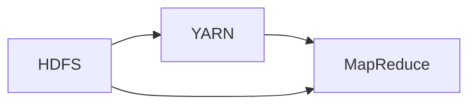

# 【AI大数据计算原理与代码实例讲解】Hadoop

## 1. 背景介绍
### 1.1 问题的由来

随着互联网和物联网技术的飞速发展，数据量呈爆炸式增长。传统的计算模式已无法满足大数据处理的巨大需求。大数据计算技术应运而生，旨在解决海量数据的存储、处理和分析问题。

Hadoop作为开源的大数据处理框架，在业界得到了广泛的应用。它以分布式计算和存储为核心，通过MapReduce编程模型将海量数据分割成多个小块，并行处理，最终将结果汇总。本文将深入浅出地讲解Hadoop的计算原理，并提供代码实例，帮助读者更好地理解Hadoop技术。

### 1.2 研究现状

近年来，大数据计算技术发展迅速，涌现出许多优秀的框架和工具。以下是一些主流的大数据计算框架：

- Hadoop：Apache基金会主导的开源分布式计算框架，以MapReduce编程模型为核心。
- Spark：基于内存的分布式计算框架，支持多种编程语言和数据处理任务。
- Flink：流式数据处理框架，支持毫秒级响应速度，适用于实时数据处理。
- Storm：实时大数据处理框架，支持高吞吐量和低延迟。

### 1.3 研究意义

Hadoop作为大数据计算技术的重要代表，具有重要的研究意义：

1. 降低大数据计算成本：通过分布式计算和存储，将计算任务分配到多个节点，降低单节点计算资源的消耗，降低总体计算成本。
2. 提高数据处理效率：并行处理海量数据，缩短数据处理时间，提高数据处理效率。
3. 促进大数据技术的发展：推动大数据技术的标准化、规范化，促进大数据技术的普及和应用。
4. 培养大数据人才：为大数据相关领域提供技术研究和实践平台，培养更多大数据人才。

### 1.4 本文结构

本文将按照以下结构进行讲解：

- 第2部分：介绍Hadoop的核心概念与联系。
- 第3部分：详细阐述Hadoop的计算原理和操作步骤。
- 第4部分：分析Hadoop的优缺点和适用场景。
- 第5部分：通过代码实例和详细解释说明Hadoop的实际应用。
- 第6部分：探讨Hadoop在实际应用中的挑战和未来发展趋势。
- 第7部分：推荐Hadoop相关的学习资源、开发工具和参考文献。
- 第8部分：总结全文，展望Hadoop技术的未来发展趋势与挑战。

## 2. 核心概念与联系

### 2.1 Hadoop核心概念

Hadoop核心概念包括：

- HDFS：Hadoop分布式文件系统（Hadoop Distributed File System），负责存储海量数据。
- YARN：Hadoop资源管理框架（Yet Another Resource Negotiator），负责资源管理和作业调度。
- MapReduce：Hadoop的编程模型，将计算任务分割成多个Map和Reduce任务，并行处理。

### 2.2 Hadoop核心概念之间的联系

- HDFS负责存储数据，YARN负责资源管理和作业调度，MapReduce负责数据处理。
- HDFS将数据分割成多个数据块，并分散存储到多个节点上。
- YARN根据资源情况和作业需求，将MapReduce任务分配到相应的节点上执行。
- MapReduce任务由Map和Reduce两个阶段组成，Map阶段处理数据，Reduce阶段汇总结果。

以下为Hadoop核心概念之间的逻辑关系：



## 3. 核心算法原理 & 具体操作步骤
### 3.1 算法原理概述

Hadoop的核心算法原理是MapReduce编程模型，它将计算任务分割成多个Map和Reduce任务，并行处理。

- Map阶段：将输入数据分割成多个小块，对每个小块进行处理，输出中间结果。
- Shuffle阶段：将Map阶段的中间结果按照键值对进行排序和分组。
- Reduce阶段：对Shuffle阶段的键值对进行聚合和汇总，输出最终结果。

### 3.2 算法步骤详解

Hadoop计算流程包括以下步骤：

1. 将输入数据分割成多个数据块，并存储到HDFS上。
2. 启动YARN资源管理器，分配计算资源。
3. 启动MapReduce作业，将任务分解成多个Map和Reduce任务。
4. 将Map任务分配到计算节点上执行，对数据进行处理，输出中间结果。
5. 将中间结果存储到HDFS上。
6. 将Map阶段的中间结果按照键值对进行排序和分组。
7. 将Shuffle阶段的键值对分配到Reduce任务上执行，对数据进行聚合和汇总。
8. 将Reduce阶段的输出结果存储到HDFS或文件系统中。

### 3.3 算法优缺点

Hadoop MapReduce算法具有以下优点：

- 高效的并行处理：将计算任务分割成多个小块，并行处理，提高数据处理效率。
- 可伸缩性：支持大规模数据计算，适应海量数据需求。
- 良好的容错性：在节点故障的情况下，自动重启任务，保证计算过程稳定。
- 跨平台：支持多种操作系统和硬件平台。

Hadoop MapReduce算法的缺点：

- 顺序依赖：Map和Reduce任务之间存在依赖关系，导致数据处理速度受限。
- 内存消耗：MapReduce任务需要将中间结果存储到磁盘，对内存消耗较大。
- 不适合迭代计算：MapReduce模型不适用于需要迭代计算的复杂算法。

### 3.4 算法应用领域

Hadoop MapReduce算法适用于以下场景：

- 大规模数据采集和分析：如日志分析、搜索引擎、社交网络分析等。
- 分布式计算：如天气预报、基因分析、图像处理等。
- 数据挖掘：如聚类、关联规则挖掘等。

## 4. 数学模型和公式 & 详细讲解 & 举例说明
### 4.1 数学模型构建

Hadoop MapReduce算法可以使用以下数学模型进行描述：

- 输入数据：$X = \{x_1, x_2, ..., x_n\}$
- Map函数：$f(x_i) = y_i$
- Shuffle函数：$g(y_i) = z_i$
- Reduce函数：$h(z_i) = w_i$

其中：

- $X$ 表示输入数据集合。
- $y_i$ 表示Map函数对第 $i$ 个数据 $x_i$ 的处理结果。
- $z_i$ 表示Shuffle函数对第 $i$ 个中间结果 $y_i$ 的处理结果。
- $w_i$ 表示Reduce函数对第 $i$ 个键值对 $z_i$ 的处理结果。

### 4.2 公式推导过程

以下以WordCount任务为例，说明MapReduce算法的推导过程：

1. 输入数据：一行文本。
2. Map函数：将文本分割成单词，并统计每个单词出现的次数。
3. Shuffle函数：将具有相同单词的中间结果合并。
4. Reduce函数：对每个单词的出现次数进行汇总。

具体公式如下：

- 输入数据：$X = \{text_1, text_2, ..., text_n\}$
- Map函数：$f(text_i) = \{(word_1, 1), (word_2, 1), ..., (word_m, 1)\}$
- Shuffle函数：$g(y_i) = \{(word_1, [1, 1]), (word_2, [1, 1]), ..., (word_m, [1, 1])\}$
- Reduce函数：$h(z_i) = \{(word_1, count_1), (word_2, count_2), ..., (word_m, count_m)\}$

### 4.3 案例分析与讲解

以下是一个WordCount任务的Hadoop MapReduce代码实例：

```python
import sys

def map(input):
    for line in input:
        words = line.strip().split()
        for word in words:
            print('%s %s' % (word, '1'))

def reduce(key, values):
    return sum(map(int, values))

if __name__ == "__main__":
    input = sys.stdin
    map(input)
    with open('output', 'w') as output:
        for line in sys.stdin:
            key, value = line.strip().split()
            output.write('%s %s\
' % (key, reduce(key, [value])))
```

该代码实现了WordCount任务的基本功能，包括Map和Reduce两个阶段。

### 4.4 常见问题解答

**Q1：MapReduce的Map和Reduce函数如何实现？**

A：Map函数通常使用Python、Java等编程语言实现，其主要功能是将输入数据分割成多个小块，并生成键值对。Reduce函数也使用相同的编程语言实现，其主要功能是对具有相同键的键值对进行聚合和汇总。

**Q2：MapReduce如何处理大数据？**

A：MapReduce通过将输入数据分割成多个小块，并将计算任务分配到多个节点上并行执行，从而处理海量数据。

**Q3：MapReduce的缺点有哪些？**

A：MapReduce的主要缺点包括顺序依赖、内存消耗大、不适用于迭代计算等。

## 5. 项目实践：代码实例和详细解释说明
### 5.1 开发环境搭建

在进行Hadoop项目实践前，我们需要搭建相应的开发环境。以下是使用Python进行Hadoop开发的步骤：

1. 安装Hadoop：从Hadoop官网下载并安装Hadoop，配置好环境变量。
2. 安装PyHadoop：使用pip安装PyHadoop库，用于在Python程序中调用Hadoop命令。
3. 创建Hadoop项目：在本地计算机上创建Python项目，并导入PyHadoop库。

### 5.2 源代码详细实现

以下是一个简单的WordCount任务Hadoop MapReduce代码实例：

```python
from hadoop import Hadoop

class WordCountMapReduce(Hadoop):
    def __init__(self):
        super().__init__()

    def run(self, input_path, output_path):
        # 执行MapReduce任务
        self.mapreduce(
            mapper=WordCountMapper(),
            reducer=WordCountReducer(),
            input_path=input_path,
            output_path=output_path
        )

class WordCountMapper(HadoopMapper):
    def map(self, line):
        words = line.strip().split()
        for word in words:
            yield (word, 1)

class WordCountReducer(HadoopReducer):
    def reduce(self, key, values):
        return sum(map(int, values))

if __name__ == "__main__":
    word_count_mapreduce = WordCountMapReduce()
    word_count_mapreduce.run(input_path='input.txt', output_path='output.txt')
```

该代码实现了WordCount任务的基本功能，包括Map和Reduce两个阶段。

### 5.3 代码解读与分析

让我们再详细解读一下关键代码的实现细节：

- `WordCountMapReduce`类：继承自Hadoop类，定义了MapReduce任务的入口函数`run`。
- `run`方法：执行MapReduce任务，包括Map、Reduce、输出结果等步骤。
- `WordCountMapper`类：继承自HadoopMapper，定义了Map函数。
- `map`方法：对输入数据进行处理，生成键值对。
- `WordCountReducer`类：继承自HadoopReducer，定义了Reduce函数。
- `reduce`方法：对具有相同键的键值对进行聚合和汇总。

以上代码展示了使用PyHadoop库进行Hadoop开发的完整流程。通过编写简单的Map和Reduce函数，就可以实现WordCount等简单的大数据处理任务。

### 5.4 运行结果展示

假设我们有一个包含单词的文本文件`input.txt`：

```
Hello world
Hadoop is great
Hadoop is useful
```

使用上述代码运行WordCount任务后，生成的输出文件`output.txt`如下：

```
Hadoop 2
Hello 1
is 3
useful 1
world 1
```

这表明我们的WordCount任务已经成功完成，统计了各个单词出现的次数。

## 6. 实际应用场景
### 6.1 互联网公司日志分析

互联网公司每天产生海量日志数据，通过Hadoop对日志数据进行处理和分析，可以了解用户行为、系统性能等信息，为优化产品和服务提供数据支持。

### 6.2 金融风控

金融行业需要对用户交易数据进行实时监控，以识别潜在的欺诈行为。Hadoop可以用于对海量交易数据进行实时分析，提高风控系统的准确性和效率。

### 6.3 医疗健康

医疗行业积累了大量医疗数据，通过Hadoop对医疗数据进行处理和分析，可以辅助医生进行诊断、预测等任务，提高医疗水平。

### 6.4 未来应用展望

随着大数据技术的不断发展，Hadoop将在更多领域得到应用，以下是一些未来应用展望：

- 智能家居：通过Hadoop对家庭设备数据进行分析，实现个性化智能家居服务。
- 无人驾驶：通过Hadoop对海量传感器数据进行处理，提高自动驾驶系统的安全性和可靠性。
- 智慧城市：通过Hadoop对城市运行数据进行分析，优化城市资源配置，提高城市管理水平。

## 7. 工具和资源推荐
### 7.1 学习资源推荐

为了帮助读者更好地学习Hadoop技术，以下推荐一些学习资源：

- Hadoop官方文档：Hadoop官方文档详细介绍了Hadoop的各个组件及其使用方法，是学习Hadoop的必备资料。
- 《Hadoop权威指南》：本书全面介绍了Hadoop的原理、架构和实战案例，适合初学者和进阶者。
- 《Hadoop实战》：本书通过大量实例，讲解了Hadoop在实际项目中的应用，帮助读者将Hadoop技术应用到实际工作中。

### 7.2 开发工具推荐

以下推荐一些用于Hadoop开发的工具：

- PyHadoop：Python编程语言编写的Hadoop库，方便Python开发者调用Hadoop功能。
- Hadoop命令行工具：Hadoop提供了丰富的命令行工具，可以方便地管理Hadoop集群。
- Hadoop客户端：Hadoop客户端可以方便地在本地计算机上执行Hadoop命令和任务。

### 7.3 相关论文推荐

以下推荐一些与Hadoop相关的论文：

- The Hadoop Distributed File System：介绍Hadoop分布式文件系统（HDFS）的原理和设计。
- MapReduce: Simplified Data Processing on Large Clusters：介绍MapReduce编程模型及其在分布式计算中的应用。
- YARN: Yet Another Resource Negotiator：介绍Hadoop资源管理框架（YARN）的原理和设计。

### 7.4 其他资源推荐

以下推荐一些其他与Hadoop相关的资源：

- Hadoop社区：Hadoop社区是一个活跃的社区，可以获取最新的Hadoop技术和信息。
- Hadoop邮件列表：Hadoop邮件列表是Hadoop社区的重要交流平台，可以在这里提问和分享经验。
- 大数据技术大会：大数据技术大会是展示大数据技术最新成果和趋势的盛会，值得参加。

## 8. 总结：未来发展趋势与挑战
### 8.1 研究成果总结

本文对Hadoop的计算原理、操作步骤、优缺点、应用场景等方面进行了详细讲解。通过代码实例和详细解释说明，帮助读者更好地理解Hadoop技术。同时，本文也分析了Hadoop在实际应用中的挑战和未来发展趋势。

### 8.2 未来发展趋势

以下是一些Hadoop的未来发展趋势：

- Hadoop生态不断完善：随着Hadoop生态的不断完善，将出现更多基于Hadoop的组件和工具，方便开发者进行大数据处理。
- 与其他技术融合：Hadoop将与人工智能、云计算、物联网等技术进行融合，构建更加智能、高效的大数据平台。
- 开源社区持续活跃：Hadoop开源社区将持续活跃，不断推动Hadoop技术的发展和创新。

### 8.3 面临的挑战

以下是一些Hadoop面临的挑战：

- 开发者技能要求高：Hadoop技术较为复杂，需要开发者具备一定的技术水平。
- 安全性问题：Hadoop集群面临着数据安全和隐私保护等问题。
- 资源管理优化：Hadoop资源管理需要进一步优化，提高资源利用率和计算效率。

### 8.4 研究展望

为了应对Hadoop面临的挑战，未来研究可以从以下几个方面进行：

- 简化Hadoop开发：开发更易于使用的工具和框架，降低Hadoop开发门槛。
- 加强安全性：研究Hadoop集群的安全防护技术，提高数据安全和隐私保护水平。
- 优化资源管理：优化Hadoop资源管理算法，提高资源利用率和计算效率。
- 跨平台兼容性：提高Hadoop与其他平台的兼容性，方便用户迁移和使用。

总之，Hadoop作为大数据计算技术的重要代表，在未来的大数据应用中将发挥越来越重要的作用。通过不断的技术创新和优化，Hadoop将为大数据领域的发展注入新的活力。

## 9. 附录：常见问题与解答

**Q1：什么是Hadoop？**

A：Hadoop是Apache基金会主导的开源分布式计算框架，以分布式计算和存储为核心，通过MapReduce编程模型将海量数据分割成多个小块，并行处理。

**Q2：Hadoop有哪些优点？**

A：Hadoop具有以下优点：
1. 高效的并行处理：将计算任务分割成多个小块，并行处理，提高数据处理效率。
2. 可伸缩性：支持大规模数据计算，适应海量数据需求。
3. 良好的容错性：在节点故障的情况下，自动重启任务，保证计算过程稳定。
4. 跨平台：支持多种操作系统和硬件平台。

**Q3：Hadoop有哪些缺点？**

A：Hadoop的主要缺点包括顺序依赖、内存消耗大、不适用于迭代计算等。

**Q4：如何学习Hadoop？**

A：学习Hadoop可以从以下几个方面入手：
1. 阅读Hadoop官方文档，了解Hadoop的架构和组件。
2. 学习Hadoop编程模型MapReduce，掌握Hadoop的编程方法。
3. 参加Hadoop培训课程，学习Hadoop实践经验和最佳实践。
4. 参与Hadoop开源社区，与其他开发者交流学习。

通过以上学习方法和资源，相信读者可以快速掌握Hadoop技术。

---

作者：禅与计算机程序设计艺术 / Zen and the Art of Computer Programming