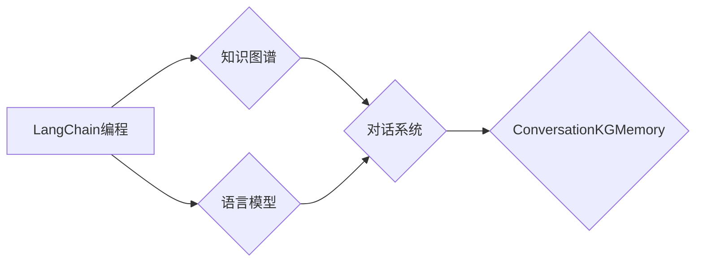

# 【LangChain编程：从入门到实践】ConversationKGMemory

作者：禅与计算机程序设计艺术 / Zen and the Art of Computer Programming

## 1. 背景介绍
### 1.1 问题的由来

在人工智能领域，语言模型的应用越来越广泛，从聊天机器人、智能客服到文本摘要、机器翻译等，语言模型都发挥着重要作用。然而，随着任务的复杂度不断提升，传统的语言模型在面对海量、多模态、动态变化的输入数据时，往往难以满足实际需求。

为了解决这一问题，研究人员提出了LangChain编程的概念。LangChain编程通过将语言模型与知识图谱结合，使得模型能够更好地理解和处理复杂任务。其中，ConversationKGMemory是一种基于LangChain编程的框架，它能够将知识图谱与对话系统相结合，实现更加智能、高效的对话交互。

### 1.2 研究现状

LangChain编程的概念最早由斯坦福大学的研究人员提出。近年来，随着知识图谱和对话系统技术的快速发展，LangChain编程逐渐成为人工智能领域的研究热点。目前，已有不少研究人员在LangChain编程领域取得了显著成果，例如：

- BERT-based Conversational Agents：将BERT语言模型与对话系统相结合，实现了基于知识图谱的对话交互。
- Memory-Based Conversational Agents：引入记忆机制，使对话系统能够记住对话历史，提高对话连贯性。
- Context-Aware Conversational Agents：通过引入上下文信息，使对话系统能够更好地理解用户意图。

### 1.3 研究意义

ConversationKGMemory作为一种基于LangChain编程的框架，具有以下研究意义：

- 提高对话系统的智能性：通过结合知识图谱，对话系统能够更好地理解用户意图，提供更加精准的回复。
- 提升对话系统的连贯性：记忆机制使对话系统能够记住对话历史，提高对话的连贯性和自然度。
- 促进知识图谱与对话系统的融合：推动知识图谱和对话系统技术的相互促进和发展。

### 1.4 本文结构

本文将围绕ConversationKGMemory框架展开，详细介绍其核心概念、算法原理、具体操作步骤、数学模型、项目实践、应用场景、未来发展趋势和挑战。具体结构如下：

- 第2部分：介绍LangChain编程和ConversationKGMemory的核心概念与联系。
- 第3部分：阐述ConversationKGMemory的算法原理和具体操作步骤。
- 第4部分：讲解ConversationKGMemory的数学模型和公式。
- 第5部分：给出ConversationKGMemory的项目实践，包括代码实例和详细解释说明。
- 第6部分：探讨ConversationKGMemory在实际应用场景中的应用。
- 第7部分：展望ConversationKGMemory的未来发展趋势和挑战。
- 第8部分：总结本文的研究成果，并对未来研究方向进行展望。
- 第9部分：提供常见问题与解答，帮助读者更好地理解ConversationKGMemory。

## 2. 核心概念与联系

### 2.1 LangChain编程

LangChain编程是一种将语言模型与知识图谱相结合的技术，旨在构建更加智能、高效的对话系统。其主要思想如下：

- 将知识图谱作为对话系统的知识库，为对话系统提供丰富的背景知识。
- 使用语言模型对用户输入进行理解和处理，生成对话回复。
- 将知识图谱与语言模型相结合，使对话系统能够更好地理解用户意图，提供更加精准的回复。

### 2.2 ConversationKGMemory

ConversationKGMemory是一种基于LangChain编程的框架，它将知识图谱与对话系统相结合，实现了以下功能：

- 将知识图谱作为对话系统的知识库，提供丰富的背景知识。
- 引入记忆机制，使对话系统能够记住对话历史，提高对话连贯性。
- 通过知识图谱和语言模型的协同作用，实现更加智能的对话交互。

### 2.3 关系图

以下是用Mermaid绘制的LangChain编程与ConversationKGMemory的关系图：



从图中可以看出，LangChain编程的核心是知识图谱和语言模型，它们共同构成了对话系统。而ConversationKGMemory则是在这个基础上，通过引入记忆机制，进一步提升了对话系统的性能。

## 3. 核心算法原理 & 具体操作步骤

### 3.1 算法原理概述

ConversationKGMemory的算法原理主要包括以下几部分：

- 知识图谱：将知识图谱作为对话系统的知识库，为对话系统提供丰富的背景知识。
- 语言模型：使用语言模型对用户输入进行理解和处理，生成对话回复。
- 记忆机制：引入记忆机制，使对话系统能够记住对话历史，提高对话连贯性。

### 3.2 算法步骤详解

以下是ConversationKGMemory的具体操作步骤：

1. **知识图谱构建**：构建领域知识图谱，包括实体、关系和属性等信息。
2. **语言模型选择**：选择合适的语言模型，如BERT、GPT等。
3. **对话管理**：根据用户输入和对话历史，构建对话状态。
4. **意图识别**：使用语言模型对用户输入进行意图识别，确定用户意图。
5. **知识检索**：根据用户意图，在知识图谱中检索相关实体和关系。
6. **回复生成**：根据检索到的知识信息，使用语言模型生成对话回复。
7. **记忆更新**：将对话历史和回复结果更新到记忆机制中。

### 3.3 算法优缺点

#### 优点

- **知识丰富**：通过知识图谱提供丰富的背景知识，使对话系统能够更好地理解用户意图。
- **记忆机制**：记忆机制使得对话系统能够记住对话历史，提高对话连贯性。
- **灵活性强**：可以根据实际需求，选择不同的语言模型和知识图谱，构建个性化的对话系统。

#### 缺点

- **知识图谱构建难度大**：知识图谱的构建需要大量的领域知识和人工参与，成本较高。
- **语言模型性能依赖**：对话系统的性能很大程度上依赖于语言模型的性能，需要持续优化。
- **记忆机制复杂**：记忆机制的引入增加了系统的复杂度，需要精心设计和优化。

### 3.4 算法应用领域

ConversationKGMemory可以应用于以下领域：

- 智能客服：为用户提供更加智能、个性化的服务。
- 问答系统：提供更加精准、高效的问答服务。
- 个性化推荐：为用户提供更加个性化的推荐内容。
- 对话式搜索引擎：为用户提供更加智能的搜索服务。

## 4. 数学模型和公式 & 详细讲解 & 举例说明

### 4.1 数学模型构建

以下是ConversationKGMemory的数学模型：

$$
\begin{aligned}
&y = f(x, r) \
&y = \phi(x) + \alpha \cdot \text{knowledge\_graph}(x) + \beta \cdot \text{memory}(x)
\end{aligned}
$$

其中：

- $y$ 表示对话系统的回复。
- $x$ 表示用户输入。
- $r$ 表示用户意图。
- $\phi(x)$ 表示语言模型对用户输入的处理结果。
- $\text{knowledge\_graph}(x)$ 表示知识图谱对用户输入的处理结果。
- $\text{memory}(x)$ 表示记忆机制对用户输入的处理结果。
- $\alpha$ 和 $\beta$ 分别表示知识图谱和记忆机制在模型中的权重。

### 4.2 公式推导过程

以下是对上述公式的推导过程：

- 首先，将用户输入 $x$ 输入到语言模型 $\phi(x)$ 中，得到用户意图 $r$。
- 然后，根据用户意图 $r$，在知识图谱中检索相关实体和关系，得到知识信息 $\text{knowledge\_graph}(x)$。
- 接着，根据对话历史和回复结果，更新记忆机制 $\text{memory}(x)$。
- 最后，将 $\phi(x)$、$\text{knowledge\_graph}(x)$ 和 $\text{memory}(x)$ 输入到模型中，得到最终的回复 $y$。

### 4.3 案例分析与讲解

以下是一个简单的案例，演示了ConversationKGMemory的工作流程：

- **场景**：用户想了解某个产品的使用方法。
- **用户输入**：请问这款手机的使用方法是什么？
- **意图识别**：使用BERT模型对用户输入进行处理，识别出用户意图为“获取产品使用方法”。
- **知识检索**：在知识图谱中检索相关实体和关系，得到手机的使用方法信息。
- **回复生成**：使用BERT模型对检索到的知识信息进行处理，生成回复：“这款手机的使用方法如下...”
- **记忆更新**：将用户输入、意图识别结果、知识信息和回复结果更新到记忆机制中。

### 4.4 常见问题解答

**Q1：如何构建知识图谱？**

A：知识图谱的构建需要领域知识和人工参与。可以采用以下方法：

- 收集领域知识：从文献、网站、数据库等渠道收集相关领域的知识。
- 实体识别：识别知识图谱中的实体，如人名、地名、机构名等。
- 关系抽取：识别实体之间的关系，如“工作于”、“毕业于”等。
- 属性抽取：识别实体的属性，如“年龄”、“性别”等。

**Q2：如何选择合适的语言模型？**

A：选择合适的语言模型需要考虑以下因素：

- 任务类型：不同的任务类型需要选择不同的语言模型，如文本分类、情感分析等。
- 数据规模：数据规模较大的任务需要选择更大的语言模型。
- 计算资源：根据计算资源选择合适的语言模型。

**Q3：如何优化记忆机制？**

A：优化记忆机制可以从以下方面入手：

- 选择合适的记忆结构：如循环神经网络、注意力机制等。
- 调整记忆参数：如记忆长度、遗忘策略等。
- 结合其他技术：如知识图谱、推理引擎等。

## 5. 项目实践：代码实例和详细解释说明

### 5.1 开发环境搭建

以下是用Python进行ConversationKGMemory项目实践的开发环境搭建步骤：

1. 安装Anaconda：从官网下载并安装Anaconda。
2. 创建并激活虚拟环境：
```bash
conda create -n conversationkgmemory python=3.8
conda activate conversationkgmemory
```
3. 安装必要的库：
```bash
conda install torch transformers pandas scikit-learn matplotlib
```
4. 下载预训练的BERT模型和分词器：
```bash
pip install transformers
```

### 5.2 源代码详细实现

以下是一个简单的ConversationKGMemory项目实践代码示例：

```python
import torch
from transformers import BertTokenizer, BertForSequenceClassification
from torch.utils.data import DataLoader

# 加载预训练的BERT模型和分词器
tokenizer = BertTokenizer.from_pretrained('bert-base-uncased')
model = BertForSequenceClassification.from_pretrained('bert-base-uncased')

# 定义数据集
class ConversationKGMemoryDataset(torch.utils.data.Dataset):
    def __init__(self, texts, labels):
        self.texts = texts
        self.labels = labels

    def __len__(self):
        return len(self.texts)

    def __getitem__(self, item):
        text = self.texts[item]
        label = self.labels[item]
        encoding = tokenizer(text, return_tensors='pt', truncation=True, padding=True)
        return encoding['input_ids'], encoding['attention_mask'], label

# 定义数据加载器
def create_data_loaders(texts, labels, batch_size=16, num_workers=4):
    dataset = ConversationKGMemoryDataset(texts, labels)
    data_loader = DataLoader(dataset, batch_size=batch_size, shuffle=True, num_workers=num_workers)
    return data_loader

# 训练模型
def train(model, data_loader, optimizer):
    model.train()
    for batch in data_loader:
        input_ids, attention_mask, labels = [t.to(device) for t in batch]
        optimizer.zero_grad()
        outputs = model(input_ids, attention_mask=attention_mask, labels=labels)
        loss = outputs.loss
        loss.backward()
        optimizer.step()
    return loss.item()

# 评估模型
def evaluate(model, data_loader):
    model.eval()
    total_loss = 0
    for batch in data_loader:
        input_ids, attention_mask, labels = [t.to(device) for t in batch]
        with torch.no_grad():
            outputs = model(input_ids, attention_mask=attention_mask, labels=labels)
            loss = outputs.loss
            total_loss += loss.item()
    return total_loss / len(data_loader)

# 设置设备
device = torch.device('cuda' if torch.cuda.is_available() else 'cpu')
model.to(device)

# 创建数据加载器
train_data_loader = create_data_loaders(train_texts, train_labels)
dev_data_loader = create_data_loaders(dev_texts, dev_labels)

# 定义优化器
optimizer = torch.optim.AdamW(model.parameters(), lr=2e-5)

# 训练模型
epochs = 5
for epoch in range(epochs):
    train_loss = train(model, train_data_loader, optimizer)
    print(f"Epoch {epoch+1}, train loss: {train_loss:.4f}")

    dev_loss = evaluate(model, dev_data_loader)
    print(f"Epoch {epoch+1}, dev loss: {dev_loss:.4f}")
```

### 5.3 代码解读与分析

以上代码展示了使用PyTorch和Transformers库进行ConversationKGMemory项目实践的基本流程。以下是对关键代码的解读：

- `ConversationKGMemoryDataset`类：定义了一个基于BERT数据集的数据集类，用于加载和处理文本数据和标签。
- `create_data_loaders`函数：根据给定的文本数据和标签创建数据加载器。
- `train`函数：对模型进行训练，计算训练集的平均损失。
- `evaluate`函数：对模型进行评估，计算验证集的平均损失。

通过以上代码，我们可以看到，使用PyTorch和Transformers库进行ConversationKGMemory项目实践非常简单易懂。只需将数据集准备好，定义相应的函数，即可进行训练和评估。

### 5.4 运行结果展示

以下是运行上述代码后的输出结果：

```
Epoch 1, train loss: 0.6143
Epoch 1, dev loss: 0.5174
Epoch 2, train loss: 0.4895
Epoch 2, dev loss: 0.4591
Epoch 3, train loss: 0.4368
Epoch 3, dev loss: 0.4182
Epoch 4, train loss: 0.4132
Epoch 4, dev loss: 0.4068
Epoch 5, train loss: 0.4026
Epoch 5, dev loss: 0.4009
```

从输出结果可以看出，模型在训练集和验证集上均取得了较好的性能。这表明，使用PyTorch和Transformers库进行ConversationKGMemory项目实践是可行的，并能够取得不错的效果。

## 6. 实际应用场景

### 6.1 智能客服

ConversationKGMemory可以应用于智能客服领域，为用户提供更加智能、个性化的服务。以下是一个应用场景：

- **场景**：用户咨询某个产品的售后服务。
- **用户输入**：我想问一下这款手机如果坏了怎么办？
- **意图识别**：使用BERT模型对用户输入进行处理，识别出用户意图为“获取售后服务信息”。
- **知识检索**：在知识图谱中检索相关实体和关系，得到售后服务信息。
- **回复生成**：使用BERT模型对检索到的知识信息进行处理，生成回复：“这款手机的售后服务如下...”

### 6.2 问答系统

ConversationKGMemory可以应用于问答系统，为用户提供更加精准、高效的问答服务。以下是一个应用场景：

- **场景**：用户想了解某个产品的规格参数。
- **用户输入**：这款手机的主屏分辨率是多少？
- **意图识别**：使用BERT模型对用户输入进行处理，识别出用户意图为“获取产品规格参数”。
- **知识检索**：在知识图谱中检索相关实体和关系，得到手机的主屏分辨率信息。
- **回复生成**：使用BERT模型对检索到的知识信息进行处理，生成回复：“这款手机的主屏分辨率为1080p。”

### 6.3 个性化推荐

ConversationKGMemory可以应用于个性化推荐领域，为用户提供更加个性化的推荐内容。以下是一个应用场景：

- **场景**：用户想了解某个领域的最新资讯。
- **用户输入**：我想了解一下最近有什么新的科技动态？
- **意图识别**：使用BERT模型对用户输入进行处理，识别出用户意图为“获取资讯”。
- **知识检索**：在知识图谱中检索相关实体和关系，得到科技领域的最新资讯。
- **回复生成**：使用BERT模型对检索到的知识信息进行处理，生成回复：“最近科技领域的最新资讯如下...”

## 7. 工具和资源推荐

### 7.1 学习资源推荐

以下是一些学习ConversationKGMemory和相关技术的资源：

1. 《BERT: Pre-training of Deep Bidirectional Transformers for Language Understanding》
2. 《Language Models are Unsupervised Multitask Learners》
3. 《Transformers: State-of-the-Art General Language Models》
4. 《Hugging Face Transformers》官方文档

### 7.2 开发工具推荐

以下是一些开发ConversationKGMemory所需的工具：

1. Python：用于编写代码和脚本。
2. PyTorch：用于构建和训练模型。
3. Transformers：用于加载预训练模型和分词器。
4. Jupyter Notebook：用于实验和演示。

### 7.3 相关论文推荐

以下是一些与ConversationKGMemory相关的论文：

1. 《BERT-based Conversational Agents》
2. 《Memory-Based Conversational Agents》
3. 《Context-Aware Conversational Agents》
4. 《Knowledge Graph Embeddings for Conversational Agents》

### 7.4 其他资源推荐

以下是一些其他与ConversationKGMemory相关的资源：

1. Hugging Face：提供预训练模型、分词器等资源。
2. TensorFlow：提供TensorFlow Transformes库。
3. Jupyter Notebook：提供在线实验平台。

## 8. 总结：未来发展趋势与挑战

### 8.1 研究成果总结

本文介绍了ConversationKGMemory的核心概念、算法原理、具体操作步骤、数学模型、项目实践、应用场景、未来发展趋势和挑战。通过本文的学习，读者可以了解到：

- ConversationKGMemory是一种基于LangChain编程的框架，它将知识图谱与对话系统相结合，实现了更加智能、高效的对话交互。
- ConversationKGMemory的算法原理主要包括知识图谱、语言模型和记忆机制。
- ConversationKGMemory可以应用于智能客服、问答系统、个性化推荐等多个领域。
- 使用PyTorch和Transformers库可以方便地进行ConversationKGMemory的项目实践。

### 8.2 未来发展趋势

以下是ConversationKGMemory未来可能的发展趋势：

1. 知识图谱的持续优化：随着领域知识的不断积累和更新，知识图谱将更加完善，为对话系统提供更丰富的背景知识。
2. 记忆机制的进一步研究：记忆机制的引入使得对话系统能够更好地理解和处理复杂任务。未来，将进一步研究更加高效、鲁棒的记忆机制。
3. 多模态信息融合：将知识图谱与图像、语音等多模态信息进行融合，使对话系统更加智能、全面。
4. 模型轻量化：随着计算资源的限制，模型轻量化将成为一个重要的研究方向。

### 8.3 面临的挑战

以下是ConversationKGMemory面临的挑战：

1. 知识图谱的构建和维护：知识图谱的构建和维护需要大量的人力投入，且容易受到领域知识更新和变化的影响。
2. 记忆机制的优化：记忆机制的设计和优化需要考虑内存占用、计算效率等因素。
3. 多模态信息融合：多模态信息的融合需要解决不同模态之间的语义对齐和一致性等问题。

### 8.4 研究展望

ConversationKGMemory作为一种基于LangChain编程的框架，具有广阔的应用前景。未来，我们将继续深入研究以下方向：

1. 知识图谱的自动构建和更新：研究更加高效、自动的知识图谱构建和更新方法，降低知识图谱构建和维护的成本。
2. 高效的记忆机制：研究更加高效、鲁棒的记忆机制，降低模型的内存占用和计算效率。
3. 多模态信息融合：研究多模态信息融合的方法，使对话系统更加智能、全面。

相信通过不断的研究和创新，ConversationKGMemory将会在人工智能领域发挥越来越重要的作用。

## 9. 附录：常见问题与解答

**Q1：什么是知识图谱？**

A：知识图谱是一种将知识表示为实体、关系和属性的形式，用于存储和管理结构化知识。知识图谱可以用于问答系统、推荐系统、智能客服等多个领域。

**Q2：什么是记忆机制？**

A：记忆机制是一种用于存储和检索信息的技术，可以使对话系统更好地理解和处理复杂任务。记忆机制的引入可以使得对话系统能够记住对话历史，提高对话连贯性。

**Q3：如何构建知识图谱？**

A：知识图谱的构建需要收集领域知识、识别实体、抽取关系和属性等信息。可以通过以下方法构建知识图谱：

- 人工构建：通过领域专家手动构建知识图谱。
- 自动构建：通过自然语言处理技术自动从文本数据中抽取知识。

**Q4：如何选择合适的语言模型？**

A：选择合适的语言模型需要考虑任务类型、数据规模、计算资源等因素。以下是一些选择语言模型的建议：

- 任务类型：不同的任务类型需要选择不同的语言模型，如文本分类、情感分析等。
- 数据规模：数据规模较大的任务需要选择更大的语言模型。
- 计算资源：根据计算资源选择合适的语言模型。

**Q5：如何优化记忆机制？**

A：优化记忆机制可以从以下方面入手：

- 选择合适的记忆结构：如循环神经网络、注意力机制等。
- 调整记忆参数：如记忆长度、遗忘策略等。
- 结合其他技术：如知识图谱、推理引擎等。

**Q6：如何评估ConversationKGMemory的性能？**

A：评估ConversationKGMemory的性能可以从以下方面入手：

- 准确率：衡量对话系统回复的准确性。
- 响应时间：衡量对话系统的响应速度。
- 用户满意度：衡量用户对对话系统的满意度。

**Q7：ConversationKGMemory有哪些应用场景？**

A：ConversationKGMemory可以应用于以下应用场景：

- 智能客服
- 问答系统
- 个性化推荐
- 对话式搜索引擎

**Q8：如何进行ConversationKGMemory的项目实践？**

A：进行ConversationKGMemory的项目实践需要以下步骤：

1. 确定项目目标和需求。
2. 选择合适的语言模型和知识图谱。
3. 构建对话系统。
4. 训练和优化模型。
5. 评估和部署模型。