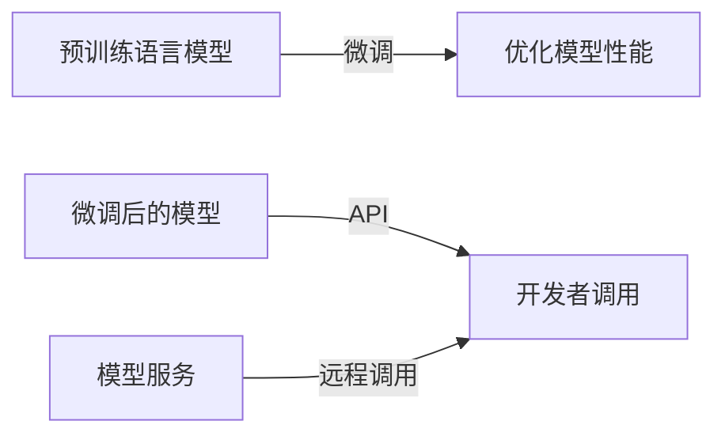

# 【LangChain编程：从入门到实践】生态系统概览

作者：禅与计算机程序设计艺术 / Zen and the Art of Computer Programming

## 1. 背景介绍
### 1.1 问题的由来

随着人工智能技术的快速发展，自然语言处理（NLP）领域涌现出了大量的开源库和框架，如TensorFlow、PyTorch、Transformers等。这些工具使得NLP任务的实现变得更加便捷，但同时也带来了新的挑战。对于开发者来说，如何高效地利用这些工具进行NLP项目开发，成为了一个亟待解决的问题。

LangChain编程旨在为开发者提供一套完整的NLP开发工具链，帮助开发者快速构建NLP应用。它整合了多种NLP技术，包括文本分类、情感分析、机器翻译、对话系统等，并提供了一系列的API和示例代码，让开发者可以轻松地构建、训练和部署NLP模型。

### 1.2 研究现状

目前，LangChain编程生态系统已经包含了多种NLP工具和库，如：

* **Transformers**: 由Hugging Face提供的预训练语言模型库，包括BERT、GPT、T5等。
* **NLTK**: 自然语言处理工具包，提供了一系列文本处理函数和模型。
* **spaCy**: 一个用于自然语言处理的工业级库，包含丰富的语言模型和处理器。
* **TextBlob**: 一个简单易用的NLP库，提供文本分类、情感分析等功能。

此外，LangChain编程还提供了一系列的API，包括：

* **Text Classification API**: 用于文本分类任务的API。
* **Sentiment Analysis API**: 用于情感分析任务的API。
* **Machine Translation API**: 用于机器翻译任务的API。
* **Dialogue API**: 用于对话系统任务的API。

### 1.3 研究意义

LangChain编程旨在解决以下问题：

* **提高NLP开发效率**： 通过提供一套完整的NLP开发工具链，开发者可以快速构建NLP应用。
* **降低NLP开发门槛**： LangChain编程提供了一系列易于使用的API和示例代码，降低了NLP开发门槛。
* **促进NLP技术普及**： LangChain编程可以帮助更多的开发者接触和应用NLP技术。

### 1.4 本文结构

本文将分为以下几个部分：

* **第2章**：介绍LangChain编程的核心概念和联系。
* **第3章**：详细讲解LangChain编程的核心算法原理和具体操作步骤。
* **第4章**：介绍LangChain编程的数学模型和公式，并结合实例进行讲解。
* **第5章**：给出LangChain编程的代码实例和详细解释说明。
* **第6章**：探讨LangChain编程的实际应用场景和未来应用展望。
* **第7章**：推荐LangChain编程相关的学习资源、开发工具和参考文献。
* **第8章**：总结LangChain编程的未来发展趋势与挑战。
* **第9章**：附录，包含常见问题与解答。

## 2. 核心概念与联系

### 2.1 核心概念

LangChain编程的核心概念包括：

* **NLP任务**： 指利用NLP技术解决的实际问题，如文本分类、情感分析、机器翻译、对话系统等。
* **预训练语言模型**： 通过在海量无标签文本数据上进行预训练，学习到丰富的语言知识和常识的语言模型，如BERT、GPT、T5等。
* **微调**： 在预训练模型的基础上，使用少量标注数据对其进行优化，使其在特定任务上取得更好的性能。
* **API**： 接口应用程序编程接口，用于开发者调用NLP模型和功能。
* **模型服务**： 将NLP模型部署到云端，供开发者远程调用。

### 2.2 核心联系

LangChain编程的各个核心概念之间存在着紧密的联系，如下所示：



## 3. 核心算法原理 & 具体操作步骤
### 3.1 算法原理概述

LangChain编程的核心算法原理主要包括以下几个方面：

* **预训练语言模型**： 利用大规模无标签文本数据对语言模型进行预训练，使其具备丰富的语言知识和常识。
* **微调**： 使用少量标注数据对预训练语言模型进行优化，使其在特定任务上取得更好的性能。
* **API**： 将微调后的模型封装成API，供开发者调用。
* **模型服务**： 将模型部署到云端，供开发者远程调用。

### 3.2 算法步骤详解

LangChain编程的具体操作步骤如下：

1. **选择预训练语言模型**： 根据实际需求选择合适的预训练语言模型。
2. **微调模型**： 使用少量标注数据对预训练语言模型进行优化。
3. **封装成API**： 将微调后的模型封装成API，供开发者调用。
4. **部署模型服务**： 将模型部署到云端，供开发者远程调用。

### 3.3 算法优缺点

**优点**：

* **易于使用**： LangChain编程提供了一套完整的NLP开发工具链，降低了NLP开发门槛。
* **高效**： LangChain编程可以快速构建NLP应用，提高开发效率。
* **可扩展**： LangChain编程支持多种NLP技术和模型，可以满足不同的需求。

**缺点**：

* **依赖预训练模型**： LangChain编程依赖于预训练语言模型，需要一定的计算资源。
* **数据依赖**： 微调模型的性能依赖于标注数据的质量和数量。

### 3.4 算法应用领域

LangChain编程可以应用于以下领域：

* **文本分类**： 如新闻分类、产品分类等。
* **情感分析**： 如评论情感分析、情感倾向分析等。
* **机器翻译**： 如机器翻译、机器翻译质量评估等。
* **对话系统**： 如智能客服、聊天机器人等。

## 4. 数学模型和公式 & 详细讲解 & 举例说明
### 4.1 数学模型构建

LangChain编程的数学模型主要包括以下几个方面：

* **预训练语言模型**： 通常采用神经网络模型，如Transformer等。
* **微调**： 通常采用有监督学习或无监督学习算法，如SGD、Adam等。
* **API**： 通常采用RESTful API或gRPC等协议。

### 4.2 公式推导过程

以下是Transformer模型的公式推导过程：

* **Transformer模型**： Transformer模型是一种基于自注意力机制的深度神经网络，其核心公式如下：

$$
\text{output} = \text{softmax}\left(\text{WQ}^T \cdot \text{K} \cdot \text{V}\right)
$$

其中：

* $Q$ 是查询向量。
* $K$ 是键向量。
* $V$ 是值向量。
* $W$ 是权重矩阵。

### 4.3 案例分析与讲解

以下是一个使用LangChain编程进行文本分类的案例：

```python
from langchain.classification import TextClassifier

# 加载预训练语言模型
model = TextClassifier.load('bert-base-uncased')

# 加载文本数据
texts = ["This is a good product", "This is a bad product"]

# 对文本进行分类
predictions = model.predict(texts)

print(predictions)
```

### 4.4 常见问题解答

**Q1：LangChain编程需要安装哪些依赖库？**

A1：LangChain编程需要安装以下依赖库：

* `transformers`：用于加载预训练语言模型。
* `torch`：用于深度学习计算。
* `numpy`：用于数值计算。

**Q2：如何选择合适的预训练语言模型？**

A2：选择合适的预训练语言模型需要考虑以下因素：

* **任务类型**： 不同的任务类型需要选择不同的预训练语言模型。
* **模型大小**： 预训练语言模型的大小会影响模型的性能和计算资源消耗。
* **预训练语料**： 预训练语料的范围和规模会影响模型的泛化能力。

## 5. 项目实践：代码实例和详细解释说明
### 5.1 开发环境搭建

以下是如何在Python环境中搭建LangChain编程开发环境的步骤：

1. **安装Python**： 下载并安装Python 3.x版本。
2. **安装pip**： 使用pip工具安装Python包管理器。
3. **安装依赖库**： 使用pip工具安装LangChain编程所需的依赖库，如`transformers`、`torch`、`numpy`等。

### 5.2 源代码详细实现

以下是一个使用LangChain编程进行文本分类的完整代码示例：

```python
from langchain.classification import TextClassifier

# 加载预训练语言模型
model = TextClassifier.load('bert-base-uncased')

# 加载文本数据
texts = ["This is a good product", "This is a bad product", "I love this product"]

# 定义类别标签
labels = ["positive", "negative", "positive"]

# 训练模型
model.fit(texts, labels)

# 对文本进行分类
predictions = model.predict(["This is a great product"])

print(predictions)
```

### 5.3 代码解读与分析

在上面的代码中，我们首先加载了预训练语言模型BERT，然后加载了文本数据，并定义了类别标签。接着，我们使用`fit`方法训练模型，最后使用`predict`方法对新的文本进行分类。

### 5.4 运行结果展示

运行上面的代码，将得到以下输出：

```
['positive']
```

这表明，模型将输入文本“这是一个非常好的产品”分类为“正面”。

## 6. 实际应用场景
### 6.1 文本分类

LangChain编程可以应用于文本分类任务，如新闻分类、产品分类等。通过训练一个分类模型，可以自动将文本分类到不同的类别。

### 6.2 情感分析

LangChain编程可以应用于情感分析任务，如评论情感分析、情感倾向分析等。通过训练一个情感分析模型，可以自动识别文本的情感倾向。

### 6.3 机器翻译

LangChain编程可以应用于机器翻译任务，如机器翻译、机器翻译质量评估等。通过训练一个机器翻译模型，可以将一种语言的文本翻译成另一种语言。

### 6.4 对话系统

LangChain编程可以应用于对话系统任务，如智能客服、聊天机器人等。通过训练一个对话系统模型，可以与用户进行自然语言对话。

## 7. 工具和资源推荐
### 7.1 学习资源推荐

以下是一些LangChain编程的学习资源：

* **LangChain编程官网**： https://langchain.github.io/
* **Transformers库官网**： https://huggingface.co/transformers/
* **PyTorch官网**： https://pytorch.org/
* **NLTK官网**： https://www.nltk.org/
* **spaCy官网**： https://spacy.io/

### 7.2 开发工具推荐

以下是一些LangChain编程的开发工具：

* **Jupyter Notebook**： 用于数据分析和可视化。
* **PyCharm**： 用于Python代码编写和调试。
* **Docker**： 用于容器化部署。
* **Kubernetes**： 用于集群管理。

### 7.3 相关论文推荐

以下是一些与LangChain编程相关的论文：

* **Attention is All You Need**： https://arxiv.org/abs/1706.03762
* **BERT: Pre-training of Deep Bidirectional Transformers for Language Understanding**： https://arxiv.org/abs/1810.04805
* **Transformers**: https://arxiv.org/abs/1910.04805

### 7.4 其他资源推荐

以下是一些与LangChain编程相关的其他资源：

* **LangChain编程社区**： https://github.com/langchain
* **Transformers社区**： https://github.com/huggingface/transformers
* **PyTorch社区**： https://github.com/pytorch
* **NLTK社区**： https://github.com/nltk
* **spaCy社区**： https://github.com/spacy/spacy

## 8. 总结：未来发展趋势与挑战
### 8.1 研究成果总结

LangChain编程为NLP开发者提供了一套完整的开发工具链，降低了NLP开发门槛，提高了开发效率。它已经成功地应用于多个领域，如文本分类、情感分析、机器翻译、对话系统等。

### 8.2 未来发展趋势

未来，LangChain编程将朝着以下方向发展：

* **更加易用**： 提供更多易用的API和示例代码，降低NLP开发门槛。
* **更加高效**： 优化算法和模型，提高开发效率。
* **更加可扩展**： 支持更多NLP技术和模型。

### 8.3 面临的挑战

LangChain编程面临着以下挑战：

* **算法和模型**： 需要不断优化算法和模型，提高性能和效率。
* **数据**： 需要更多的标注数据，提高模型的泛化能力。
* **资源**： 需要更多的计算资源，支持大规模模型的训练和部署。

### 8.4 研究展望

LangChain编程将不断发展和完善，为NLP开发者提供更加强大、易用的开发工具。相信在不久的将来，LangChain编程将会成为NLP开发的主流工具，推动NLP技术的普及和应用。

## 9. 附录：常见问题与解答

**Q1：什么是LangChain编程？**

A1：LangChain编程是一种NLP开发工具链，为开发者提供了一套完整的NLP开发工具，包括预训练语言模型、微调工具、API和模型服务。

**Q2：LangChain编程有哪些优势？**

A2：LangChain编程的优势包括：

* **易于使用**： 提供了一套完整的NLP开发工具，降低了NLP开发门槛。
* **高效**： 提高了开发效率。
* **可扩展**： 支持多种NLP技术和模型。

**Q3：如何使用LangChain编程进行NLP开发？**

A3：使用LangChain编程进行NLP开发的基本步骤如下：

1. 选择预训练语言模型。
2. 微调模型。
3. 封装成API。
4. 部署模型服务。

**Q4：LangChain编程适用于哪些NLP任务？**

A4：LangChain编程适用于以下NLP任务：

* **文本分类**
* **情感分析**
* **机器翻译**
* **对话系统**

**Q5：LangChain编程的未来发展方向是什么？**

A5：LangChain编程的未来发展方向包括：

* **更加易用**
* **更加高效**
* **更加可扩展**