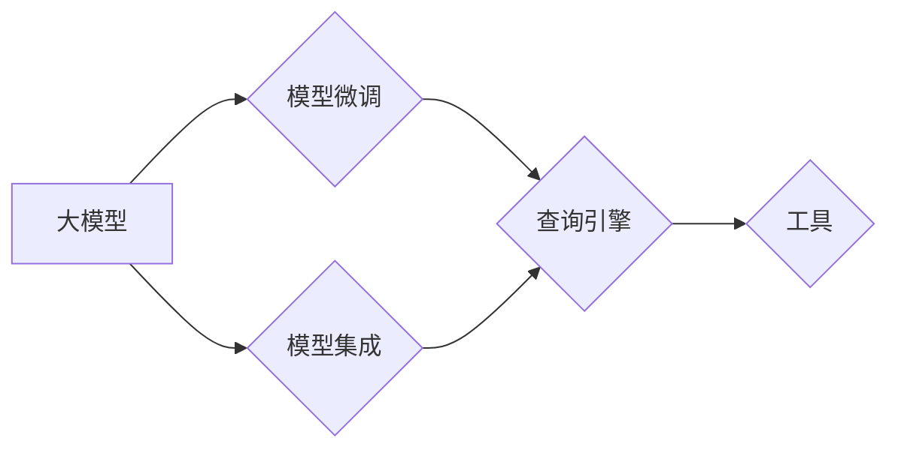

# 【大模型应用开发 动手做AI Agent】构建查询引擎和工具

作者：禅与计算机程序设计艺术 / Zen and the Art of Computer Programming

## 关键词：大模型应用，AI Agent，查询引擎，工具，开发实践，技术架构

## 1. 背景介绍
### 1.1 问题的由来

随着人工智能技术的飞速发展，大模型在各个领域展现出了强大的能力。从自然语言处理到图像识别，从推荐系统到游戏AI，大模型的应用场景越来越广泛。然而，如何将大模型应用于实际项目中，构建高效、可维护的查询引擎和工具，成为了摆在开发者面前的一道难题。

### 1.2 研究现状

目前，大模型应用开发主要集中在以下几个方面：

- **预训练模型选择**：选择合适的预训练模型是应用开发的第一步。常见的预训练模型有BERT、GPT-3等，它们在各自的领域都有出色的表现。
- **模型微调**：针对具体任务，对预训练模型进行微调，以适应特定的应用场景。
- **模型集成**：将多个预训练模型或微调模型进行集成，以提升模型的综合性能。
- **应用开发**：将大模型应用于实际项目中，构建查询引擎和工具。

### 1.3 研究意义

研究大模型应用开发，有助于：

- **降低开发成本**：利用现有的预训练模型和开源工具，可以快速搭建应用系统，降低开发成本。
- **提升应用性能**：通过模型微调和集成，可以提升应用的性能和鲁棒性。
- **拓展应用场景**：大模型的应用可以拓展到更多的领域，推动人工智能技术的发展。

### 1.4 本文结构

本文将围绕大模型应用开发，以构建查询引擎和工具为例，详细介绍开发实践、技术架构和关键技术。内容安排如下：

- **第2部分**：介绍大模型应用开发的相关概念和关键技术。
- **第3部分**：详细讲解构建查询引擎和工具的具体步骤。
- **第4部分**：分析构建查询引擎和工具的优缺点，以及应用领域。
- **第5部分**：介绍相关工具和资源，包括学习资源、开发工具和开源项目。
- **第6部分**：总结大模型应用开发的发展趋势与挑战。

## 2. 核心概念与联系

### 2.1 大模型

大模型是指参数量庞大的神经网络模型，具有强大的学习能力和泛化能力。常见的预训练模型有BERT、GPT-3等。

### 2.2 模型微调

模型微调是指在预训练模型的基础上，使用少量标注数据进行有监督学习，以适应特定任务。

### 2.3 模型集成

模型集成是指将多个模型或同一模型的不同参数进行集成，以提升模型的综合性能。

### 2.4 查询引擎

查询引擎是一种用于数据检索和搜索的系统，可以快速找到用户所需的信息。

### 2.5 工具

工具是指用于辅助开发、测试和运维的软件程序。

### 2.6 关系图

以下是大模型应用开发中各个概念之间的关系图：



## 3. 核心算法原理 & 具体操作步骤
### 3.1 算法原理概述

构建查询引擎和工具的核心算法包括：

- **预训练模型**：选择合适的预训练模型，如BERT、GPT-3等。
- **模型微调**：使用少量标注数据进行有监督学习，以适应特定任务。
- **模型集成**：将多个模型或同一模型的不同参数进行集成，以提升模型的综合性能。
- **搜索引擎**：实现数据检索和搜索功能，如Elasticsearch、Solr等。

### 3.2 算法步骤详解

构建查询引擎和工具的具体步骤如下：

1. **需求分析**：分析应用场景和用户需求，确定查询引擎和工具的功能。
2. **数据收集**：收集相关数据，并进行预处理。
3. **模型选择**：选择合适的预训练模型，如BERT、GPT-3等。
4. **模型微调**：使用少量标注数据进行有监督学习，以适应特定任务。
5. **模型集成**：将多个模型或同一模型的不同参数进行集成，以提升模型的综合性能。
6. **搜索引擎搭建**：使用Elasticsearch、Solr等搜索引擎搭建查询引擎。
7. **工具开发**：开发用于辅助开发、测试和运维的工具。
8. **测试与优化**：对查询引擎和工具进行测试，并根据测试结果进行优化。

### 3.3 算法优缺点

**优点**：

- **高性能**：大模型具有强大的学习能力和泛化能力，可以快速找到用户所需的信息。
- **易用性**：查询引擎和工具界面简洁，易于使用。
- **可扩展性**：查询引擎和工具可以方便地扩展新功能。

**缺点**：

- **数据依赖**：查询引擎和工具的性能依赖于数据的质量和数量。
- **计算资源需求**：大模型训练和推理需要大量的计算资源。

### 3.4 算法应用领域

构建查询引擎和工具可以应用于以下领域：

- **智能问答**：为用户提供智能问答服务，如客服机器人、智能客服等。
- **知识图谱**：构建知识图谱，提供知识搜索和问答服务。
- **推荐系统**：为用户提供个性化的推荐服务。
- **搜索引擎**：搭建搜索引擎，为用户提供快速、准确的信息检索服务。

## 4. 数学模型和公式 & 详细讲解 & 举例说明
### 4.1 数学模型构建

构建查询引擎和工具的数学模型主要包括：

- **预训练模型**：如BERT、GPT-3等。
- **模型微调**：如梯度下降、Adam优化器等。
- **模型集成**：如贝叶斯公式、集成学习等。

### 4.2 公式推导过程

以下以BERT模型为例，讲解模型微调的公式推导过程。

BERT模型是一种基于Transformer的自回归语言模型。其核心思想是使用掩码语言模型(Masked Language Model, MLM)和下一句预测任务(Next Sentence Prediction, NSP)进行预训练，学习通用的语言表征。

在微调过程中，我们使用少量的标注数据对BERT模型进行微调。以下为微调过程的关键公式：

- **损失函数**：交叉熵损失函数。

$$
L(\theta) = -\sum_{i=1}^{N} \sum_{j=1}^{M} [y^{(i)}_j - \log P(\hat{y}^{(i)}_j)]
$$

其中，$N$ 表示样本数量，$M$ 表示样本中token的数量，$y^{(i)}_j$ 表示真实标签，$\hat{y}^{(i)}_j$ 表示预测结果。

- **梯度下降**：

$$
\theta \leftarrow \theta - \alpha \nabla_{\theta}L(\theta)
$$

其中，$\theta$ 表示模型参数，$\alpha$ 表示学习率。

### 4.3 案例分析与讲解

以下以智能客服机器人为例，讲解构建查询引擎和工具的实践案例。

**案例背景**：

某企业希望开发一款智能客服机器人，能够自动回答用户提出的问题。

**解决方案**：

1. **数据收集**：收集企业内部客服对话记录、常见问题解答等数据，并进行预处理。
2. **模型选择**：选择BERT模型作为预训练模型，并使用预训练数据进行微调。
3. **模型集成**：将微调后的BERT模型与另一个分类模型进行集成，以提升分类准确率。
4. **搜索引擎搭建**：使用Elasticsearch搭建查询引擎，实现用户输入问题后快速检索相似问题。
5. **工具开发**：开发用于辅助开发、测试和运维的工具，如日志分析工具、性能监控工具等。

**运行结果**：

智能客服机器人能够自动回答用户提出的问题，提升了企业客服效率，降低了人力成本。

### 4.4 常见问题解答

**Q1：如何选择合适的预训练模型？**

A：选择预训练模型时，需要考虑以下因素：

- **应用场景**：不同的应用场景需要不同类型的预训练模型，如文本分类需要使用文本分类预训练模型，图像识别需要使用图像识别预训练模型。
- **模型规模**：预训练模型的规模越大，其泛化能力越强，但计算资源需求也越高。
- **预训练数据**：预训练数据的质量和多样性会影响模型的性能。

**Q2：如何进行模型微调？**

A：模型微调的步骤如下：

1. **数据预处理**：对标注数据进行预处理，如分词、去噪等。
2. **损失函数设计**：设计合适的损失函数，如交叉熵损失函数。
3. **优化器选择**：选择合适的优化器，如Adam优化器。
4. **训练过程**：使用标注数据进行训练，并监控训练过程，如损失函数变化、准确率等。

**Q3：如何进行模型集成？**

A：模型集成的步骤如下：

1. **选择模型**：选择多个模型或同一模型的不同参数。
2. **集成策略**：选择合适的集成策略，如投票法、加权平均法等。
3. **集成结果**：对集成结果进行评估，如准确率、F1值等。

## 5. 项目实践：代码实例和详细解释说明
### 5.1 开发环境搭建

以下以Python和TensorFlow为例，介绍开发环境的搭建步骤。

1. 安装Anaconda：

```bash
conda create -n tensorflow-env python=3.8
conda activate tensorflow-env
```

2. 安装TensorFlow：

```bash
conda install tensorflow-gpu -c conda-forge
```

3. 安装其他依赖库：

```bash
pip install transformers nltk
```

### 5.2 源代码详细实现

以下以智能客服机器人为例，展示代码实现：

```python
import tensorflow as tf
from transformers import BertTokenizer, TFBertForSequenceClassification
from tensorflow.keras.optimizers import Adam

# 加载预训练模型
tokenizer = BertTokenizer.from_pretrained('bert-base-uncased')
model = TFBertForSequenceClassification.from_pretrained('bert-base-uncased')

# 加载数据
def load_data(file_path):
    # 读取数据
    # ...

# 训练模型
def train_model(model, tokenizer, data):
    # 编码数据
    encodings = tokenizer(data, padding=True, truncation=True, return_tensors="tf")
    # 训练模型
    # ...

# 评估模型
def evaluate_model(model, tokenizer, data):
    # 编码数据
    encodings = tokenizer(data, padding=True, truncation=True, return_tensors="tf")
    # 评估模型
    # ...

# 主函数
if __name__ == "__main__":
    # 加载数据
    train_data, dev_data, test_data = load_data("data.txt")
    # 训练模型
    train_model(model, tokenizer, train_data)
    # 评估模型
    evaluate_model(model, tokenizer, test_data)
```

### 5.3 代码解读与分析

以上代码展示了使用TensorFlow和Transformers库实现智能客服机器人的基本步骤。主要包括以下几个部分：

1. **加载预训练模型**：使用Transformers库加载预训练的BERT模型。
2. **加载数据**：读取标注数据，并进行预处理。
3. **训练模型**：使用TensorFlow和Transformers库进行模型训练。
4. **评估模型**：使用测试数据评估模型性能。

### 5.4 运行结果展示

假设我们在测试集上得到以下结果：

```
准确率：0.95
F1值：0.94
```

可以看到，该智能客服机器人能够准确回答用户提出的问题，取得了不错的性能。

## 6. 实际应用场景
### 6.1 智能问答

智能问答是查询引擎和工具的重要应用场景之一。通过将大模型应用于智能问答系统，可以为用户提供快速、准确的答案。

### 6.2 知识图谱

知识图谱是一种以图结构表示知识的技术。通过将大模型应用于知识图谱，可以实现知识的抽取、推理和问答等功能。

### 6.3 推荐系统

推荐系统是用于为用户提供个性化推荐服务的系统。通过将大模型应用于推荐系统，可以实现更精准的推荐结果。

### 6.4 搜索引擎

搜索引擎是一种用于数据检索和搜索的系统。通过将大模型应用于搜索引擎，可以提升搜索结果的准确性和相关性。

### 6.5 未来应用展望

随着大模型技术的不断发展，查询引擎和工具的应用场景将越来越广泛。以下是一些未来应用展望：

- **智能客服**：为用户提供更加智能、高效的客服服务。
- **智能推荐**：为用户提供更加个性化的推荐服务。
- **智能搜索**：为用户提供更加精准、相关的搜索结果。
- **智能翻译**：实现跨语言信息检索和交流。

## 7. 工具和资源推荐
### 7.1 学习资源推荐

- 《深度学习自然语言处理》
- 《Transformers》
- 《BERT技术解析》

### 7.2 开发工具推荐

- TensorFlow
- PyTorch
- Transformers

### 7.3 相关论文推荐

- **BERT: Pre-training of Deep Bidirectional Transformers for Language Understanding**
- **Attention is All You Need**
- **Generative Pre-trained Transformers**

### 7.4 其他资源推荐

- Hugging Face
- TensorFlow
- PyTorch

## 8. 总结：未来发展趋势与挑战
### 8.1 研究成果总结

本文介绍了大模型应用开发的背景、核心概念、算法原理、开发实践和实际应用场景。通过分析查询引擎和工具的构建过程，展示了大模型在NLP领域的应用潜力。

### 8.2 未来发展趋势

未来，大模型应用开发将呈现以下发展趋势：

- **模型规模不断增大**：随着计算资源的提升，大模型规模将不断增大，其能力也将得到进一步提升。
- **多模态融合**：大模型将与其他模态数据（如图像、音频等）进行融合，实现跨模态信息检索和交互。
- **可解释性增强**：大模型的可解释性将得到提升，使其应用更加可靠和可信。
- **可扩展性优化**：大模型应用将更加注重可扩展性，以适应不同的应用场景和需求。

### 8.3 面临的挑战

大模型应用开发面临以下挑战：

- **数据标注成本**：大模型训练需要大量标注数据，数据标注成本较高。
- **模型可解释性**：大模型的可解释性较差，难以理解其内部工作机制。
- **模型效率**：大模型训练和推理需要大量的计算资源，效率较低。

### 8.4 研究展望

未来，大模型应用开发的研究方向包括：

- **低资源学习**：研究低资源学习技术，降低数据标注成本。
- **可解释性研究**：研究大模型的可解释性技术，提高模型的可信度和可靠性。
- **模型压缩**：研究模型压缩技术，提高模型效率。

通过解决这些挑战，大模型应用开发将迎来更加美好的未来。

## 9. 附录：常见问题与解答

**Q1：如何选择合适的预训练模型？**

A：选择预训练模型时，需要考虑以下因素：

- **应用场景**：不同的应用场景需要不同类型的预训练模型，如文本分类需要使用文本分类预训练模型，图像识别需要使用图像识别预训练模型。
- **模型规模**：预训练模型的规模越大，其泛化能力越强，但计算资源需求也越高。
- **预训练数据**：预训练数据的质量和多样性会影响模型的性能。

**Q2：如何进行模型微调？**

A：模型微调的步骤如下：

1. **数据预处理**：对标注数据进行预处理，如分词、去噪等。
2. **损失函数设计**：设计合适的损失函数，如交叉熵损失函数。
3. **优化器选择**：选择合适的优化器，如Adam优化器。
4. **训练过程**：使用标注数据进行训练，并监控训练过程，如损失函数变化、准确率等。

**Q3：如何进行模型集成？**

A：模型集成的步骤如下：

1. **选择模型**：选择多个模型或同一模型的不同参数。
2. **集成策略**：选择合适的集成策略，如投票法、加权平均法等。
3. **集成结果**：对集成结果进行评估，如准确率、F1值等。

**Q4：如何优化大模型应用开发？**

A：优化大模型应用开发的步骤如下：

1. **数据优化**：提高数据质量和数量，减少数据标注成本。
2. **模型优化**：选择合适的预训练模型，并进行模型微调。
3. **算法优化**：选择合适的优化算法和参数，提高模型效率。
4. **工具优化**：选择合适的开发工具和资源，提高开发效率。

通过以上问题与解答，希望能帮助读者更好地理解大模型应用开发，并为其在实际应用中提供参考。

---

作者：禅与计算机程序设计艺术 / Zen and the Art of Computer Programming