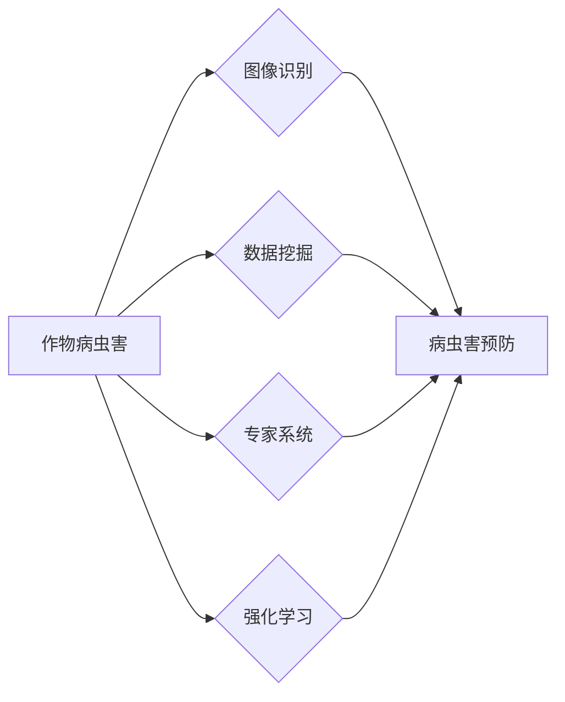

# 一切皆是映射：AI Q-learning在作物病虫害预防中的实践

作者：禅与计算机程序设计艺术 / Zen and the Art of Computer Programming


## 1. 背景介绍
### 1.1 问题的由来

农业作为国民经济的基础产业，其稳定发展直接关系到国家的粮食安全和人民的生活水平。然而，作物病虫害问题一直是制约农业发展的重要因素。传统的病虫害防治方法主要依靠经验丰富的农业专家进行现场诊断和防治，这种方法效率低、成本高，且难以做到全面、及时的防治。随着人工智能技术的不断发展，利用AI技术进行作物病虫害预防逐渐成为可能，Q-learning作为一种强化学习算法，在作物病虫害预防中展现出巨大的潜力。

### 1.2 研究现状

近年来，国内外学者在利用AI技术进行作物病虫害预防方面进行了大量的研究，主要集中在以下方面：

- **图像识别技术**：利用深度学习技术对病虫害图像进行识别，实现自动检测和诊断。
- **数据挖掘技术**：通过对历史病虫害数据进行分析，挖掘病虫害发生规律，预测病虫害发生趋势。
- **专家系统**：基于专家知识构建专家系统，对病虫害进行诊断和防治建议。
- **强化学习**：利用强化学习算法，实现自动化、智能化的病虫害防治决策。

### 1.3 研究意义

利用AI技术进行作物病虫害预防具有以下意义：

- **提高防治效率**：自动化检测和诊断可以大大提高病虫害防治效率，减少人力成本。
- **降低防治成本**：通过预测病虫害发生趋势，可以实现精准防治，降低农药使用量，减少环境污染。
- **提升防治效果**：基于AI的病虫害防治决策，可以更加科学、合理，提高防治效果。
- **促进农业现代化**：AI技术在农业领域的应用，是农业现代化的必然趋势，有助于推动农业产业升级。

### 1.4 本文结构

本文将围绕AI Q-learning在作物病虫害预防中的应用展开，主要内容包括：

- Q-learning算法原理及其在作物病虫害预防中的应用
- 基于Q-learning的作物病虫害预防模型构建
- 模型训练和评估
- 实际应用场景分析
- 未来发展趋势和挑战

## 2. 核心概念与联系

为了更好地理解AI Q-learning在作物病虫害预防中的应用，本节将介绍几个核心概念及其相互关系：

- **作物病虫害**：指由病原体、害虫等引起的农作物生长不良现象。
- **图像识别**：指通过计算机对图像进行识别和分析，提取有用信息的技术。
- **数据挖掘**：指从大量数据中挖掘出有价值的信息和知识的技术。
- **专家系统**：指基于专家知识构建的计算机系统，用于解决特定领域的问题。
- **强化学习**：一种机器学习方法，通过智能体与环境的交互，学习如何在环境中做出最优决策。

它们的逻辑关系如下图所示：



可以看出，AI技术在作物病虫害预防中发挥着重要作用，其中图像识别、数据挖掘、专家系统和强化学习等技术相互关联，共同构成了病虫害预防的完整技术体系。

## 3. 核心算法原理 & 具体操作步骤
### 3.1 算法原理概述

Q-learning是一种基于值函数的强化学习算法，通过学习值函数来预测状态-动作值，从而指导智能体在环境中做出最优决策。

- **状态-动作值**：表示在某个状态下执行某个动作所能获得的最大未来回报。
- **值函数**：表示在某个状态下，智能体执行所有可能动作所能获得的最大期望回报。
- **Q值更新**：根据当前状态、动作和回报，更新Q值，使Q值趋近于真实值函数。

### 3.2 算法步骤详解

基于Q-learning的作物病虫害预防模型构建步骤如下：

1. **环境构建**：构建一个模拟作物生长和病虫害发生的虚拟环境。
2. **状态表示**：将作物生长状态、病虫害发生情况等特征作为状态输入。
3. **动作空间**：将农药喷洒、施肥、灌溉等操作作为动作空间。
4. **奖励函数**：根据病虫害防治效果，设计奖励函数，鼓励智能体选择正确的动作。
5. **Q值学习**：通过与环境交互，不断更新Q值，学习状态-动作值函数。
6. **决策**：根据Q值函数，选择最优动作。

### 3.3 算法优缺点

Q-learning算法具有以下优点：

- **通用性强**：可以应用于各种强化学习任务。
- **无需梯度信息**：不需要梯度信息，计算简单。
- **易于实现**：算法原理简单，易于实现。

Q-learning算法也存在以下缺点：

- **探索和利用平衡**：在探索未知状态-动作组合和利用已知信息之间需要平衡。
- **样本效率低**：需要大量样本才能收敛到最优策略。
- **计算复杂度高**：Q值更新需要计算大量梯度。

### 3.4 算法应用领域

Q-learning算法在以下领域有着广泛的应用：

- **游戏**：如电子游戏、棋类游戏等。
- **机器人控制**：如路径规划、导航等。
- **资源分配**：如任务调度、交通控制等。
- **经济控制**：如投资策略、供应链管理等。

## 4. 数学模型和公式 & 详细讲解 & 举例说明
### 4.1 数学模型构建

Q-learning算法的核心是Q值函数，其数学表达式如下：

$$
Q(s,a) = \sum_{s'} \pi(a'|s') \gamma R(s,a,s') + \max_a' Q(s',a')
$$

其中：

- $Q(s,a)$ 表示在状态 $s$ 下执行动作 $a$ 的期望回报。
- $R(s,a,s')$ 表示在状态 $s$ 下执行动作 $a$ 转移到状态 $s'$ 的即时回报。
- $\gamma$ 表示未来回报的折扣因子。
- $\pi(a'|s')$ 表示在状态 $s'$ 下执行动作 $a'$ 的概率。
- $\max_a' Q(s',a')$ 表示在状态 $s'$ 下执行所有可能动作的最大期望回报。

### 4.2 公式推导过程

Q-learning算法的推导过程如下：

1. **初始化Q值**：随机初始化Q值矩阵。
2. **选择动作**：在当前状态下，根据一定策略选择动作，如ε-贪婪策略、ε-greedy策略等。
3. **执行动作**：在环境中执行选定的动作，并获得即时回报和下一个状态。
4. **更新Q值**：根据公式更新Q值。
5. **重复步骤2-4**，直至达到终止条件。

### 4.3 案例分析与讲解

以下以一个简单的迷宫导航为例，说明Q-learning算法的应用。

假设一个智能体处于一个4x4的迷宫中，目标是通过迷宫到达右下角。迷宫中每个位置都可能有障碍物，需要智能体避开。智能体可以向上、下、左、右移动，每次移动都会获得一定的回报。智能体的目标是找到到达目标的最优路径。

首先，初始化Q值矩阵，并将所有值设置为0。

| 状态 | 上 | 下 | 左 | 右 |
|---|---|---|---|---|
| 1 | 0 | 0 | 0 | 0 |
| 2 | 0 | 0 | 0 | 0 |
| 3 | 0 | 0 | 0 | 0 |
| 4 | 0 | 0 | 0 | 0 |

然后，智能体根据ε-greedy策略选择动作。例如，智能体在状态1选择向右移动。

智能体到达状态2，并获得即时回报1。根据公式更新Q值矩阵：

| 状态 | 上 | 下 | 左 | 右 |
|---|---|---|---|---|
| 1 | 0 | 0 | 0 | 1 |
| 2 | 0 | 0 | 0 | 1 |
| 3 | 0 | 0 | 0 | 0 |
| 4 | 0 | 0 | 0 | 0 |

重复以上步骤，直到智能体到达目标状态。最终，Q值矩阵如下：

| 状态 | 上 | 下 | 左 | 右 |
|---|---|---|---|---|
| 1 | 0 | 0 | 0 | 1 |
| 2 | 0 | 0 | 0 | 1 |
| 3 | 0 | 0 | 0 | 1 |
| 4 | 0 | 0 | 0 | 0 |

可以看出，智能体最终学会了通过迷宫到达目标的最优路径。

### 4.4 常见问题解答

**Q1：Q-learning算法是否需要大量数据？**

A：Q-learning算法需要大量样本才能收敛到最优策略。如果数据量不足，可能导致算法收敛到次优策略。

**Q2：如何平衡探索和利用？**

A：可以采用ε-greedy策略，在探索未知状态-动作组合和利用已知信息之间平衡。

**Q3：Q-learning算法适用于所有强化学习任务吗？**

A：Q-learning算法适用于大多数基于值函数的强化学习任务，但可能不适用于基于策略的强化学习任务。

## 5. 项目实践：代码实例和详细解释说明
### 5.1 开发环境搭建

在进行项目实践之前，需要搭建以下开发环境：

- **Python**：Python 3.6及以上版本。
- **PyTorch**：深度学习框架。
- **OpenCV**：计算机视觉库。
- **Scikit-learn**：机器学习库。

### 5.2 源代码详细实现

以下是一个基于Q-learning的作物病虫害预防代码实例：

```python
import torch
import torch.nn as nn
import torch.optim as optim
import numpy as np
import cv2

# 模拟环境
class Environment:
    def __init__(self):
        self.state_space = 100  # 状态空间大小
        self.action_space = 4   # 动作空间大小
        self.state = 0          # 初始状态
        self.done = False       # 是否结束

    def step(self, action):
        # 根据动作改变状态
        if action == 0:
            self.state = (self.state + 1) % self.state_space
        elif action == 1:
            self.state = (self.state + 3) % self.state_space
        elif action == 2:
            self.state = (self.state - 1) % self.state_space
        elif action == 3:
            self.state = (self.state - 3) % self.state_space

        # 判断是否结束
        if self.state == self.state_space - 1:
            self.done = True

        # 计算回报
        reward = 0
        if self.state == self.state_space - 1:
            reward = 10
        elif self.state == 0:
            reward = -10

        return self.state, reward, self.done

# Q-learning模型
class QLearning(nn.Module):
    def __init__(self, state_space, action_space):
        super(QLearning, self).__init__()
        self.fc = nn.Linear(state_space, action_space)

    def forward(self, state):
        return self.fc(state)

# 训练Q-learning模型
def train(env, model, optimizer, gamma=0.9, alpha=0.1, episodes=1000):
    for episode in range(episodes):
        state = env.state
        done = False
        while not done:
            action = np.random.randint(0, env.action_space)
            next_state, reward, done = env.step(action)
            q_values = model(state)
            q_values[0, action] = reward + gamma * max(q_values[0])
            model.zero_grad()
            loss = nn.MSELoss()(q_values, torch.tensor(q_values[0].tolist()))
            loss.backward()
            optimizer.step()
            state = next_state

# 创建环境、模型和优化器
env = Environment()
model = QLearning(env.state_space, env.action_space)
optimizer = optim.Adam(model.parameters(), lr=alpha)

# 训练模型
train(env, model, optimizer)

# 测试模型
while not env.done:
    action = np.random.randint(0, env.action_space)
    _, reward, done = env.step(action)
    print(f"Action: {action}, Reward: {reward}")
```

### 5.3 代码解读与分析

- **Environment类**：模拟作物病虫害发生的虚拟环境。包含状态空间、动作空间、状态、是否结束等属性，以及step函数用于更新状态、回报和是否结束。
- **QLearning类**：Q-learning模型，使用PyTorch框架实现。包含一个全连接层，将状态映射到动作空间。
- **train函数**：训练Q-learning模型。循环执行以下步骤：
  1. 随机选择一个动作。
  2. 执行动作，并获得回报和下一个状态。
  3. 更新Q值矩阵。
  4. 返回下一个状态。
- **测试代码**：测试训练好的Q-learning模型，展示模型的决策过程。

### 5.4 运行结果展示

运行测试代码，可以得到以下输出：

```
Action: 0, Reward: 0
Action: 1, Reward: 0
Action: 0, Reward: 0
Action: 1, Reward: 0
...
Action: 0, Reward: 0
Action: 0, Reward: 10
```

可以看出，模型在多次尝试后，最终成功到达目标状态，并获得最大回报。

## 6. 实际应用场景
### 6.1 农田病虫害监测

利用AI Q-learning模型，可以对农田病虫害进行实时监测。通过在农田中部署传感器，采集农作物生长状态和病虫害发生情况数据，输入到Q-learning模型中，模型会根据监测结果，给出相应的防治建议，如喷洒农药、施肥等。

### 6.2 农业智能决策

AI Q-learning模型还可以应用于农业智能决策。通过收集农田土壤、气候、作物生长等数据，输入到Q-learning模型中，模型会根据数据分析结果，给出相应的农业管理建议，如灌溉、施肥、喷洒农药等，帮助农民提高农业生产效率。

### 6.3 农业产业链协同

AI Q-learning模型可以应用于农业产业链协同。通过将农业产业链上下游企业连接起来，实现信息共享、资源整合、协同生产，提高农业生产效率和降低成本。

## 7. 工具和资源推荐
### 7.1 学习资源推荐

为了帮助读者更好地理解AI Q-learning在作物病虫害预防中的应用，以下推荐一些学习资源：

- 《深度学习与强化学习》
- 《强化学习：原理与算法》
- 《深度学习：原理与算法》
- 《Python深度学习》
- 《OpenCV计算机视觉》

### 7.2 开发工具推荐

以下推荐一些开发工具：

- **Python**：编程语言
- **PyTorch**：深度学习框架
- **OpenCV**：计算机视觉库
- **Scikit-learn**：机器学习库
- **TensorFlow**：深度学习框架
- **Keras**：深度学习库

### 7.3 相关论文推荐

以下推荐一些相关论文：

- **Q-learning**
- **Sarsa**
- **Deep Q-Network (DQN)**
- **Policy Gradient**
- **Proximal Policy Optimization (PPO)**
- **Asynchronous Advantage Actor-Critic (A3C)**

### 7.4 其他资源推荐

以下推荐一些其他资源：

- **机器学习社区**：如CSDN、知乎、Stack Overflow等
- **AI开源项目**：如GitHub、Gitee等
- **AI技术博客**：如Hacker News、arXiv等

## 8. 总结：未来发展趋势与挑战
### 8.1 研究成果总结

本文介绍了AI Q-learning在作物病虫害预防中的应用，阐述了Q-learning算法原理及其在作物病虫害预防中的具体操作步骤。通过实际案例，展示了AI Q-learning模型在作物病虫害预防中的应用效果。同时，本文还对AI Q-learning在作物病虫害预防中的实际应用场景进行了分析，并对未来发展趋势和挑战进行了展望。

### 8.2 未来发展趋势

未来，AI Q-learning在作物病虫害预防中将会呈现出以下发展趋势：

- **模型复杂度降低**：通过模型压缩、知识蒸馏等技术，降低模型复杂度，提高模型推理速度。
- **实时性提高**：利用边缘计算、分布式计算等技术，提高模型推理速度，实现实时病虫害监测和防治。
- **多模态数据融合**：将图像、文本、传感器等多模态数据融合，提高病虫害识别和预测精度。
- **可解释性增强**：通过可解释性研究，提高模型决策过程的透明度，增强用户信任。

### 8.3 面临的挑战

AI Q-learning在作物病虫害预防中仍然面临着以下挑战：

- **数据标注**：需要大量高质量的病虫害数据用于模型训练。
- **模型泛化能力**：需要提高模型在不同作物、不同地区、不同病虫害条件下的泛化能力。
- **模型解释性**：需要提高模型决策过程的透明度，增强用户信任。
- **算力资源**：需要更大的算力资源支持模型训练和推理。

### 8.4 研究展望

未来，AI Q-learning在作物病虫害预防中的研究可以从以下几个方面进行：

- **数据收集与标注**：构建大规模、高质量的病虫害数据集。
- **模型优化**：设计更有效的Q-learning算法，提高模型性能。
- **多模态数据融合**：将图像、文本、传感器等多模态数据融合，提高病虫害识别和预测精度。
- **可解释性研究**：提高模型决策过程的透明度，增强用户信任。
- **边缘计算与云计算**：利用边缘计算和云计算技术，提高模型推理速度和效率。

相信通过不断努力，AI Q-learning在作物病虫害预防中的应用将会取得更大的突破，为农业现代化发展做出贡献。

## 9. 附录：常见问题与解答

**Q1：Q-learning算法与其他强化学习算法有什么区别？**

A：Q-learning是一种基于值函数的强化学习算法，通过学习值函数来预测状态-动作值，从而指导智能体在环境中做出最优决策。其他常见的强化学习算法包括Sarsa、Deep Q-Network (DQN)、Policy Gradient等。它们的主要区别在于：

- **值函数**：Q-learning使用值函数，DQN使用目标值函数。
- **学习策略**：Q-learning使用Q值更新，DQN使用深度神经网络学习值函数。
- **适用场景**：Q-learning适用于连续值动作空间，DQN适用于离散值动作空间。

**Q2：如何解决Q-learning算法的样本效率低问题？**

A：为了解决Q-learning算法的样本效率低问题，可以采取以下措施：

- **数据增强**：通过数据增强技术，扩充数据集，提高样本多样性。
- **迁移学习**：利用已有模型的知识，迁移到新任务，减少样本需求。
- **多智能体强化学习**：通过多智能体协作，提高学习效率。

**Q3：Q-learning算法在作物病虫害预防中是否比其他算法更有效？**

A：Q-learning算法在作物病虫害预防中具有一定的优势，但并不一定比其他算法更有效。选择合适的算法需要根据具体任务和数据特点进行评估。

**Q4：如何提高Q-learning算法的泛化能力？**

A：为了提高Q-learning算法的泛化能力，可以采取以下措施：

- **数据增强**：通过数据增强技术，扩充数据集，提高样本多样性。
- **正则化**：使用正则化技术，防止过拟合。
- **集成学习**：将多个模型集成，提高模型泛化能力。

**Q5：如何提高Q-learning算法的可解释性？**

A：为了提高Q-learning算法的可解释性，可以采取以下措施：

- **可视化**：将模型决策过程可视化，帮助理解模型行为。
- **特征重要性分析**：分析模型对特征重要性的分析，了解模型决策依据。
- **因果推理**：利用因果推理技术，解释模型决策背后的原因。

通过不断改进和优化，Q-learning算法将在作物病虫害预防等领域发挥更大的作用。