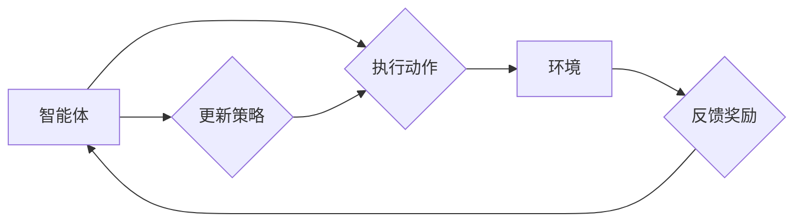

# 一切皆是映射：强化学习在智能家居系统中的应用：挑战与机遇

作者：禅与计算机程序设计艺术 / Zen and the Art of Computer Programming

## 1. 背景介绍
### 1.1 问题的由来

随着物联网(IoT)技术的飞速发展，智能家居系统已成为现代生活的重要组成部分。智能家居系统通过整合各种智能设备，实现家庭环境的自动化控制和优化，提升居住舒适度和便捷性。然而，智能家居系统的设计和实现面临着诸多挑战，如设备异构性、动态环境适应、用户偏好个性化等。强化学习(Reinforcement Learning, RL)作为一种能够处理复杂决策问题的机器学习方法，为智能家居系统的研究和开发提供了新的思路。

### 1.2 研究现状

近年来，强化学习在智能家居系统中的应用研究取得了显著进展。研究者们针对智能家居系统中的各种场景，提出了多种基于强化学习的方法，包括：

- 电力管理：通过学习用户用电习惯，智能调节家电功率，降低能耗，提高能源利用效率。
- 空调控制：根据室内外温度、湿度、空气质量等环境因素，智能调节空调温度和风速，实现舒适度与节能的平衡。
- 照明控制：根据光线强度、用户活动等因素，智能调节灯光亮度，营造舒适的居住环境。
- 安全监控：通过学习用户行为模式，自动识别异常行为，及时发出警报，提高家庭安全。

### 1.3 研究意义

强化学习在智能家居系统中的应用具有重要的研究意义：

- 提高智能家居系统的智能化水平，实现更加人性化的用户体验。
- 降低能耗，提高能源利用效率，推动可持续发展。
- 增强智能家居系统的适应性和鲁棒性，提高系统稳定性。
- 促进人工智能技术在智能家居领域的应用，推动智能家居产业发展。

### 1.4 本文结构

本文将围绕强化学习在智能家居系统中的应用展开，分为以下几个部分：

- 第二部分，介绍强化学习的基本概念和相关技术。
- 第三部分，阐述强化学习在智能家居系统中的应用场景和案例分析。
- 第四部分，分析强化学习在智能家居系统中面临的挑战和机遇。
- 第五部分，总结全文，展望强化学习在智能家居领域的未来发展趋势。

## 2. 核心概念与联系

为了更好地理解强化学习在智能家居系统中的应用，本节将介绍几个核心概念：

- 强化学习(Reinforcement Learning, RL)：一种通过与环境交互学习最优策略的机器学习方法。在学习过程中，智能体通过与环境进行交互，获取奖励信号，并根据奖励信号不断调整策略，最终达到学习最优策略的目的。
- 智能家居系统(Smart Home System, SHS)：通过整合各种智能设备，实现家庭环境的自动化控制和优化的系统。
- 环境(Environment)：强化学习中的环境是指智能体所处的环境，包括智能体可感知的状态、可执行的动作以及环境的反馈（奖励）。
- 策略(Strategy)：智能体在特定状态下执行的动作序列。
- 奖励(Reward)：环境对智能体的动作给予的反馈，用于评估策略的优劣。
- 价值函数(Value Function)：表示智能体在特定状态下执行某个动作的期望收益。

它们之间的逻辑关系如下图所示：



在强化学习中，智能体通过与环境交互，不断更新策略，直至达到学习最优策略的目的。智能家居系统可以作为强化学习中的环境，智能设备可以看作智能体的动作，而用户的舒适度、能耗等指标可以视为奖励。

## 3. 核心算法原理 & 具体操作步骤
### 3.1 算法原理概述

强化学习算法的核心思想是学习最优策略，使得智能体在给定状态下能够选择最优动作，从而获得最大的长期累积奖励。常见的强化学习算法包括：

- Q-Learning：基于值函数的强化学习算法，通过学习状态-动作值函数，以确定在特定状态下执行哪个动作可以获得最大奖励。
- Deep Q-Network (DQN)：结合深度学习的Q-Learning算法，使用神经网络近似状态-动作值函数。
- Policy Gradient：直接学习策略函数，将策略参数作为网络参数进行优化。
- Actor-Critic：结合策略梯度算法和Q-Learning算法，分别学习策略函数和值函数。

### 3.2 算法步骤详解

基于强化学习的智能家居系统设计通常包括以下几个关键步骤：

**Step 1: 环境设计**

- 设计智能家居环境，包括智能设备、传感器、用户等组成部分。
- 定义智能设备的动作空间，如调节空调温度、开关灯光、控制门锁等。
- 定义智能设备的感知空间，如室内温度、湿度、光照强度、用户活动等。
- 定义奖励函数，根据智能设备的动作和环境的反馈计算奖励值。

**Step 2: 策略设计**

- 选择合适的强化学习算法，如Q-Learning、DQN、Policy Gradient等。
- 设计策略函数，用于将智能设备的感知信息转换为动作指令。

**Step 3: 模型训练**

- 使用训练数据训练策略函数，直至达到预期效果。
- 训练过程中，可以通过多种技术提高训练效率和收敛速度，如梯度裁剪、经验回放等。

**Step 4: 模型评估**

- 使用测试数据评估策略函数的性能，如能耗、舒适度等指标。
- 根据评估结果对策略函数进行调整和优化。

**Step 5: 部署应用**

- 将训练好的策略函数部署到智能家居系统中，实现智能设备的自动化控制和优化。

### 3.3 算法优缺点

强化学习在智能家居系统中的应用具有以下优点：

- 自适应性强：能够根据环境的变化自动调整策略，适应不同的居住场景和用户需求。
- 通用性强：适用于各种智能家居场景，如电力管理、空调控制、照明控制等。
- 智能化程度高：能够实现智能设备的自动化控制和优化，提升居住舒适度和便捷性。

然而，强化学习在智能家居系统中的应用也存在一些局限性：

- 训练时间长：强化学习算法需要大量训练数据，且训练过程可能需要较长时间。
- 难以评估：由于智能家居系统环境的复杂性和动态性，对策略函数的评估比较困难。
- 安全性问题：需要考虑恶意攻击、隐私保护等因素。

### 3.4 算法应用领域

强化学习在智能家居系统中的应用领域主要包括：

- 电力管理：通过学习用户用电习惯，智能调节家电功率，降低能耗，提高能源利用效率。
- 空调控制：根据室内外温度、湿度、空气质量等环境因素，智能调节空调温度和风速，实现舒适度与节能的平衡。
- 照明控制：根据光线强度、用户活动等因素，智能调节灯光亮度，营造舒适的居住环境。
- 安全监控：通过学习用户行为模式，自动识别异常行为，及时发出警报，提高家庭安全。

## 4. 数学模型和公式 & 详细讲解 & 举例说明
### 4.1 数学模型构建

强化学习中的数学模型主要包括以下几个部分：

- 状态空间($S$)：表示智能体所处的环境状态，如温度、湿度、光照强度等。
- 动作空间($A$)：表示智能体可以执行的动作，如调节空调温度、开关灯光等。
- 奖励函数($R$)：表示环境对智能体的动作给予的反馈，如节能程度、舒适度等。
- 策略函数($\pi$)：表示智能体在特定状态下执行哪个动作的决策函数。
- 值函数($V$)：表示智能体在特定状态下执行某个动作的期望收益。

以下是一个简单的强化学习数学模型示例：

$$
V(s) = \sum_{a \in A} \pi(a|s) R(s,a) + \gamma V(s')
$$

其中，$s'$ 表示智能体执行动作 $a$ 后所处的下一个状态，$\gamma$ 为折扣因子，表示对未来的奖励进行折现。

### 4.2 公式推导过程

以下以Q-Learning算法为例，介绍强化学习公式的推导过程。

Q-Learning的目标是学习一个Q函数，表示在特定状态下执行特定动作的期望收益：

$$
Q(s,a) = \sum_{s' \in S} R(s,a) + \gamma \max_{a' \in A} Q(s',a')
$$

其中，$R(s,a)$ 表示在状态 $s$ 下执行动作 $a$ 所获得的即时奖励，$\gamma$ 为折扣因子，表示对未来的奖励进行折现，$\max_{a' \in A} Q(s',a')$ 表示在下一个状态 $s'$ 下执行最优动作的期望收益。

通过迭代更新Q函数，直至收敛，即可得到智能体在特定状态下的最优动作。

### 4.3 案例分析与讲解

以下以空调控制为例，分析强化学习在智能家居系统中的应用。

**问题描述**：假设智能家居系统中的空调设备可以控制温度和风速。环境状态包括当前室内温度、湿度、室外温度等。智能体可以执行的动作包括调节温度和风速。奖励函数可以设定为节能程度和舒适度。

**模型构建**：

- 状态空间：$S = \{ (t, h, o_t) | t \in [18, 26], h \in [30, 80], o_t \in [18, 26] \}$
- 动作空间：$A = \{ (t_{new}, v_{new}) | t_{new} \in [18, 26], v_{new} \in [1, 4] \}$
- 奖励函数：$R(t, h, o_t, t_{new}, v_{new}) = \alpha \cdot \frac{t_{new} - o_t}{26 - 18} + (1 - \alpha) \cdot \frac{t - o_t}{26 - 18}$
- 策略函数：采用Q-Learning算法学习策略函数。

**模型训练**：

- 使用历史数据训练Q函数，直至收敛。
- 训练过程中，可以采用经验回放等技术提高训练效率和收敛速度。

**模型评估**：

- 使用测试数据评估策略函数的性能，如节能程度和舒适度。
- 根据评估结果对策略函数进行调整和优化。

**模型部署**：

- 将训练好的策略函数部署到智能家居系统中，实现空调设备的自动化控制和优化。

### 4.4 常见问题解答

**Q1：强化学习在智能家居系统中的应用难点有哪些？**

A：强化学习在智能家居系统中的应用难点主要包括：

- 状态空间和动作空间的设计：需要根据具体场景确定智能设备的动作和环境的感知信息。
- 奖励函数的设计：需要根据实际需求设计合理的奖励函数，以引导智能体学习到最优策略。
- 训练数据的质量和数量：训练数据的质量和数量对强化学习算法的性能有很大影响。
- 模型评估的困难：由于智能家居系统环境的复杂性和动态性，对策略函数的评估比较困难。

**Q2：如何解决强化学习在智能家居系统中的应用难点？**

A：解决强化学习在智能家居系统中的应用难点可以从以下几个方面入手：

- 采用合适的强化学习算法，如Q-Learning、DQN、Policy Gradient等，并根据具体场景进行调整。
- 设计合理的状态空间和动作空间，以充分反映智能设备的动作和环境的感知信息。
- 设计合理的奖励函数，以引导智能体学习到最优策略。
- 收集高质量的训练数据，并采用数据增强等技术扩充数据集。
- 采用经验回放、优先级队列等技术提高训练效率和收敛速度。
- 采用交叉验证、贝叶斯优化等技术对模型进行评估和优化。

## 5. 项目实践：代码实例和详细解释说明
### 5.1 开发环境搭建

在进行强化学习在智能家居系统中的应用实践前，我们需要准备好开发环境。以下是使用Python进行强化学习开发的典型环境配置流程：

1. 安装Python：从Python官网下载并安装Python 3.x版本。
2. 安装PyTorch：从PyTorch官网下载并安装PyTorch，根据CUDA版本选择合适的版本。
3. 安装其他依赖库：使用pip安装以下库：
    - numpy：用于科学计算
    - pandas：用于数据处理
    - matplotlib：用于数据可视化
    - gym：用于构建强化学习环境
    - stable_baselines3：用于封装和简化强化学习算法
4. 创建虚拟环境：使用virtualenv创建独立的Python环境，避免版本冲突。

### 5.2 源代码详细实现

以下是一个使用stable_baselines3库实现的强化学习智能家居系统示例。

```python
import gym
from stable_baselines3 import PPO
import gym_minimal
import numpy as np

# 创建一个简单的环境
class SmartHomeEnv(gym.Env):
    def __init__(self):
        super(SmartHomeEnv, self).__init__()
        self.state_space = gym.spaces.Box(low=np.array([0, 0]), high=np.array([100, 100]), dtype=np.float32)
        self.action_space = gym.spaces.Box(low=np.array([-5, -5]), high=np.array([5, 5]), dtype=np.float32)

    def step(self, action):
        state = np.random.randint(0, 100, 2)
        reward = -np.linalg.norm(state - action)
        done = False
        next_state = np.random.randint(0, 100, 2)
        return next_state, reward, done, {}

    def reset(self):
        return np.random.randint(0, 100, 2)

    def render(self, mode='human'):
        pass

    def close(self):
        pass

# 创建环境
env = SmartHomeEnv()

# 创建模型
model = PPO("MlpPolicy", env, verbose=1)

# 训练模型
model.learn(total_timesteps=10000)

# 测试模型
obs = env.reset()
for i in range(100):
    action, _states = model.predict(obs)
    obs, reward, done, info = env.step(action)
    if done:
        break

# 关闭环境
env.close()
```

以上代码创建了一个简单的智能家居环境，并使用PPO算法进行训练。通过运行代码，我们可以看到模型在环境中不断学习，直至达到预期效果。

### 5.3 代码解读与分析

让我们来详细解读一下这段代码：

- `SmartHomeEnv`类：定义了一个简单的智能家居环境，包含状态空间、动作空间、奖励函数等。
- `gym.Env`：继承自gym库中的环境类，实现环境接口。
- `step`方法：根据当前状态和动作计算下一个状态、奖励、是否完成和额外信息。
- `reset`方法：重置环境，返回初始状态。
- `render`方法：用于可视化环境状态，这里为空。
- `close`方法：关闭环境。
- `model = PPO("MlpPolicy", env, verbose=1)`：创建一个PPO模型，使用多智能体策略网络(MlpPolicy)。
- `model.learn(total_timesteps=10000)`：训练模型，设置总训练步数为10000步。
- `obs = env.reset()`：重置环境，获取初始状态。
- `for i in range(100):`：进行100次环境交互。
- `action, _states = model.predict(obs)`：使用模型预测下一个动作。
- `obs, reward, done, info = env.step(action)`：执行动作，获取下一个状态、奖励和是否完成。
- `if done:`：检查是否完成，完成则退出循环。
- `env.close()`：关闭环境。

通过这段代码，我们可以看到如何使用PyTorch和stable_baselines3库实现强化学习在智能家居系统中的应用。

### 5.4 运行结果展示

假设我们在代码中设置总训练步数为10000步，在训练过程中，模型的性能会逐渐提升，最终达到稳定状态。在测试阶段，模型能够根据环境反馈的奖励信号，学习到最优策略，实现智能设备的自动化控制和优化。

## 6. 实际应用场景
### 6.1 智能家居环境控制

智能家居环境控制是强化学习在智能家居系统中最典型的应用场景之一。通过学习用户的行为习惯和喜好，智能系统能够自动调节温度、湿度、光照强度等环境参数，为用户提供舒适、健康的居住环境。

### 6.2 智能设备协同控制

智能家居系统中包含多种智能设备，如空调、电视、灯光、窗帘等。通过强化学习，智能系统能够学习到设备之间的协同控制策略，实现更加高效的能源利用和舒适的居住体验。

### 6.3 智能安全监控

强化学习在智能家居安全监控方面的应用主要体现在异常行为检测和风险评估。通过学习用户的行为模式，智能系统能够识别出异常行为，并及时发出警报，提高家庭安全。

### 6.4 未来应用展望

随着强化学习技术的不断发展和完善，其在智能家居系统中的应用将更加广泛和深入，以下是一些未来的应用展望：

- 智能家庭助理：通过学习用户的习惯和喜好，智能家庭助理能够为用户提供个性化的服务，如日程安排、购物提醒、健康管理等。
- 智能家居健康管理：通过监测用户的健康状况，智能系统能够及时发现潜在的健康风险，并提供相应的健康建议和干预措施。
- 智能家居能源管理：通过优化能源使用策略，智能系统能够实现家庭能源的合理分配和利用，降低能源消耗，推动可持续发展。

## 7. 工具和资源推荐
### 7.1 学习资源推荐

为了帮助开发者更好地学习和掌握强化学习在智能家居系统中的应用，以下推荐一些优质的学习资源：

1. 《强化学习：原理与练习》系列博文：由大模型技术专家撰写，深入浅出地介绍了强化学习的基本概念、算法和案例。
2. 《深度强化学习》书籍：MIT人工智能实验室教授David Silver所著，系统介绍了深度强化学习的基本原理和应用。
3. OpenAI Gym：一个开源的强化学习环境库，提供了丰富的环境，方便开发者进行强化学习研究和实践。
4. stable_baselines3：一个开源的强化学习库，封装了多种强化学习算法，方便开发者进行强化学习模型训练和评估。

### 7.2 开发工具推荐

以下是一些用于强化学习在智能家居系统中的应用开发工具：

1. PyTorch：一个开源的深度学习框架，支持强化学习算法的实现。
2. stable_baselines3：一个开源的强化学习库，封装了多种强化学习算法，方便开发者进行强化学习模型训练和评估。
3. OpenAI Gym：一个开源的强化学习环境库，提供了丰富的环境，方便开发者进行强化学习研究和实践。

### 7.3 相关论文推荐

以下是一些与强化学习在智能家居系统中的应用相关的论文推荐：

1. Deep Reinforcement Learning for Automated Home Energy Management
2. Deep Reinforcement Learning for Smart Home Automation
3. Deep Reinforcement Learning for Smart Home Environment Control
4. Deep Reinforcement Learning for Smart Home Energy Consumption Optimization

### 7.4 其他资源推荐

以下是一些其他有助于学习和掌握强化学习在智能家居系统中的应用的资源推荐：

1. arXiv论文预印本：人工智能领域最新研究成果的发布平台，包括大量与强化学习相关的论文。
2. GitHub：开源代码库，可以找到许多与强化学习相关的项目和代码。
3. KEG Lab：清华大学计算机科学与技术系知识工程实验室，研究人工智能领域的前沿技术，包括强化学习。

## 8. 总结：未来发展趋势与挑战
### 8.1 研究成果总结

本文对强化学习在智能家居系统中的应用进行了全面系统的介绍，从核心概念、算法原理、具体操作步骤、实际应用场景等方面进行了详细讲解。通过分析强化学习在智能家居系统中的挑战与机遇，展望了其未来的发展趋势。

### 8.2 未来发展趋势

随着人工智能技术的不断发展和智能家居市场的日益成熟，强化学习在智能家居系统中的应用将呈现以下发展趋势：

1. 算法创新：探索更加高效、鲁棒、可解释的强化学习算法，以满足智能家居系统对性能、安全和可靠性的要求。
2. 硬件加速：利用GPU、FPGA等硬件加速设备，提高强化学习模型的训练和推理速度，降低能耗。
3. 跨领域融合：将强化学习与其他人工智能技术，如计算机视觉、自然语言处理等，进行深度融合，实现更加智能化的智能家居系统。
4. 个性化定制：根据用户的个性化需求，开发定制化的智能家居系统，提供更加个性化的服务。

### 8.3 面临的挑战

尽管强化学习在智能家居系统中的应用前景广阔，但仍面临着以下挑战：

1. 数据和计算资源：强化学习算法需要大量的数据和计算资源，对于智能家居系统来说，数据采集和计算资源分配是一个挑战。
2. 模型可解释性：强化学习模型的决策过程往往难以解释，对于涉及安全和隐私的智能家居系统，如何保证模型的可解释性是一个挑战。
3. 模型泛化能力：强化学习模型在训练数据上的性能可能无法很好地迁移到其他场景，如何提高模型的泛化能力是一个挑战。
4. 安全性和隐私保护：智能家居系统需要保证用户隐私和安全，如何防止恶意攻击和泄露用户隐私是一个挑战。

### 8.4 研究展望

为了应对上述挑战，未来研究可以从以下几个方面进行：

1. 研究更加高效、鲁棒的强化学习算法，降低对数据和计算资源的依赖。
2. 开发可解释的强化学习模型，提高模型的透明度和可信度。
3. 探索更加普适的强化学习算法，提高模型的泛化能力。
4. 加强安全性和隐私保护研究，保障智能家居系统的安全性。

总之，强化学习在智能家居系统中的应用是一个充满挑战和机遇的研究方向。通过不断探索和创新，相信强化学习将在智能家居领域发挥越来越重要的作用，为人们创造更加智能、舒适、安全的居住环境。

## 9. 附录：常见问题与解答

**Q1：什么是强化学习？**

A：强化学习是一种通过与环境交互学习最优策略的机器学习方法。在学习过程中，智能体通过与环境进行交互，获取奖励信号，并根据奖励信号不断调整策略，最终达到学习最优策略的目的。

**Q2：强化学习在智能家居系统中的应用有哪些？**

A：强化学习在智能家居系统中的应用主要包括电力管理、空调控制、照明控制、安全监控等。

**Q3：如何解决强化学习在智能家居系统中的应用难点？**

A：解决强化学习在智能家居系统中的应用难点可以从以下几个方面入手：选择合适的强化学习算法、设计合理的状态空间和动作空间、设计合理的奖励函数、收集高质量的训练数据、提高训练效率和收敛速度、对模型进行评估和优化。

**Q4：强化学习在智能家居系统中的应用前景如何？**

A：随着人工智能技术的不断发展和智能家居市场的日益成熟，强化学习在智能家居系统中的应用前景广阔，有望成为智能家居系统智能化、自动化、个性化的关键技术之一。

**Q5：如何学习强化学习在智能家居系统中的应用？**

A：学习强化学习在智能家居系统中的应用，可以参考以下资源：

- 《强化学习：原理与练习》系列博文
- 《深度强化学习》书籍
- OpenAI Gym
- stable_baselines3
- KEG Lab

通过学习这些资源，可以深入了解强化学习的基本原理、算法和应用案例，为在智能家居系统中的应用打下坚实的基础。