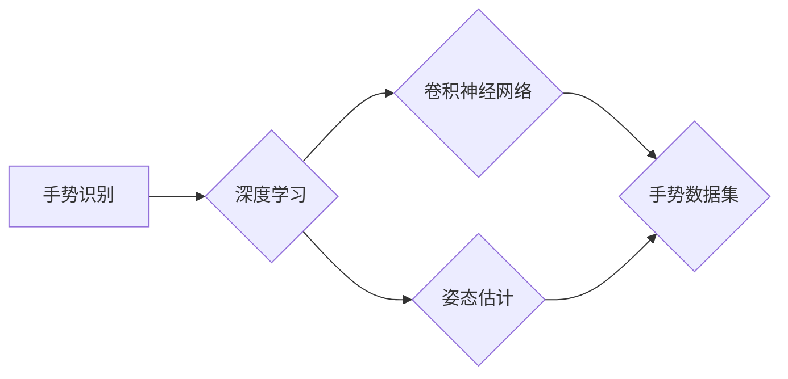
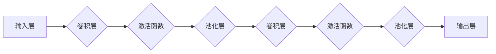

# 一切皆是映射：手势识别技术中的深度学习模型

作者：禅与计算机程序设计艺术 / Zen and the Art of Computer Programming


## 1. 背景介绍
### 1.1 问题的由来

手势识别技术作为一种直观、自然的人机交互方式，在智能家居、虚拟现实、增强现实等领域具有广泛的应用前景。随着深度学习技术的飞速发展，基于深度学习的手势识别方法逐渐成为研究热点。本文将探讨手势识别技术中的深度学习模型，分析其原理、实现方法及未来发展趋势。

### 1.2 研究现状

近年来，手势识别技术在学术界和工业界都取得了显著进展。早期的研究主要集中在基于手工特征的手势识别方法，如HOG、SIFT等。然而，这些方法往往依赖于复杂的特征提取和匹配过程，计算量大，实时性差。随着深度学习技术的兴起，基于卷积神经网络（CNN）的手势识别方法逐渐成为主流。

### 1.3 研究意义

手势识别技术的发展对于改善人机交互体验、提高系统智能化水平具有重要意义。通过深入研究手势识别技术，可以推动以下方面的进步：

- 提高人机交互的自然性和易用性，提升用户体验。
- 为智能家居、虚拟现实、增强现实等领域提供技术支持，拓展应用场景。
- 促进智能机器人、辅助医疗等领域的创新发展。

### 1.4 本文结构

本文将按照以下结构展开：

- 第2部分，介绍手势识别技术中的核心概念和联系。
- 第3部分，阐述基于深度学习的手势识别模型原理和具体操作步骤。
- 第4部分，分析手势识别模型的数学模型和公式，并结合实例进行讲解。
- 第5部分，给出手势识别项目的代码实例，并进行详细解释和分析。
- 第6部分，探讨手势识别技术的实际应用场景和未来发展趋势。
- 第7部分，推荐相关学习资源、开发工具和参考文献。
- 第8部分，总结研究成果，展望未来发展趋势与挑战。
- 第9部分，提供常见问题与解答。

## 2. 核心概念与联系

为了更好地理解手势识别技术中的深度学习模型，本节将介绍几个核心概念：

- **手势识别**：指从视频或图像中自动识别出人类手势的技术，其目的是理解用户意图，实现人机交互。
- **深度学习**：一种机器学习范式，通过学习大量数据中的复杂特征，实现模式识别和预测。
- **卷积神经网络（CNN）**：一种特殊的深度学习模型，擅长处理图像数据，具有强大的特征提取能力。
- **手势数据集**：用于训练和测试手势识别模型的图像或视频数据集。
- **姿态估计**：从图像或视频中估计人体关节点的位置，为手势识别提供姿态信息。

这些概念之间的联系可以表示为以下Mermaid流程图：



## 3. 核心算法原理 & 具体操作步骤
### 3.1 算法原理概述

基于深度学习的手势识别模型通常采用以下步骤：

1. **数据采集**：收集包含不同手势的图像或视频数据，形成手势数据集。
2. **数据预处理**：对采集到的数据进行预处理，包括去噪、缩放、归一化等操作。
3. **模型训练**：使用预训练的卷积神经网络模型，在预处理后的手势数据集上进行训练。
4. **模型评估**：使用测试集评估模型的识别精度和实时性。
5. **模型部署**：将训练好的模型部署到实际应用场景中。

### 3.2 算法步骤详解

以下是基于深度学习的手势识别模型的具体操作步骤：

1. **数据采集**：收集包含不同手势的图像或视频数据。数据来源可以包括公开数据集、自己采集的数据等。
2. **数据预处理**：
    - **去噪**：去除图像中的噪声，提高模型识别精度。
    - **缩放**：将图像缩放到统一的尺寸，方便模型处理。
    - **归一化**：将图像像素值归一化到[0,1]区间，提高模型训练速度。
3. **模型选择**：选择合适的卷积神经网络模型，如ResNet、VGG等。
4. **模型训练**：
    - 使用预训练的卷积神经网络模型作为初始化参数。
    - 将预处理后的手势数据集输入模型，进行训练。
    - 使用交叉熵损失函数进行优化，调整模型参数。
5. **模型评估**：
    - 使用测试集评估模型的识别精度和实时性。
    - 根据评估结果调整模型参数，优化模型性能。
6. **模型部署**：
    - 将训练好的模型部署到实际应用场景中，如手机、平板电脑、智能摄像头等。
    - 根据实际应用需求，对模型进行优化和改进。

### 3.3 算法优缺点

基于深度学习的手势识别模型具有以下优点：

- **识别精度高**：深度学习模型能够自动学习图像中的复杂特征，提高识别精度。
- **泛化能力强**：深度学习模型能够泛化到未见过的手势，适应不同场景下的手势识别。
- **实时性好**：通过优化模型结构和算法，可以实现实时手势识别。

然而，基于深度学习的手势识别模型也存在一些缺点：

- **计算量大**：深度学习模型需要大量的计算资源，对硬件设备要求较高。
- **数据依赖性强**：模型的性能依赖于数据集的质量和数量，需要大量标注数据。
- **模型解释性差**：深度学习模型内部工作机制复杂，难以解释其决策过程。

### 3.4 算法应用领域

基于深度学习的手势识别模型在以下领域具有广泛的应用：

- **智能家居**：通过手势识别控制家电设备，提高生活便利性。
- **虚拟现实/增强现实**：实现虚拟角色的手势交互，提升沉浸感。
- **辅助医疗**：帮助残疾人士进行日常生活操作，提高生活质量。
- **人机交互**：实现人与机器人之间的自然交互，提高人机协同效率。

## 4. 数学模型和公式 & 详细讲解 & 举例说明
### 4.1 数学模型构建

基于深度学习的手势识别模型通常采用卷积神经网络（CNN）作为核心架构。以下是CNN的数学模型：



其中，每个卷积层由多个卷积核组成，用于提取图像特征。激活函数用于引入非线性关系，池化层用于降低特征维度，输出层用于输出最终结果。

### 4.2 公式推导过程

以下是卷积层和池化层的公式推导过程：

**卷积层**：

假设输入图像为 $X \in \mathbb{R}^{H \times W \times C}$，其中 $H, W, C$ 分别为图像的高度、宽度和通道数。卷积核为 $K \in \mathbb{R}^{k \times k \times C}$，步长为 $s$，则卷积层的输出 $Y \in \mathbb{R}^{H' \times W' \times D}$ 可表示为：

$$
Y = \frac{1}{C} \sum_{c=1}^C \sum_{h=0}^{H'-1} \sum_{w=0}^{W'-1} K_c \cdot X_{c,h+w \cdot s,h} \cdot \sigma(X_{c,h+w \cdot s,h} \cdot K_c)
$$

其中，$\sigma$ 为激活函数，如ReLU函数。

**池化层**：

假设池化层输入为 $X \in \mathbb{R}^{H \times W \times C}$，池化窗口大小为 $k \times k$，步长为 $s$，则池化层的输出 $Y \in \mathbb{R}^{H' \times W' \times C}$ 可表示为：

$$
Y_{h',w'} = \frac{1}{k^2} \sum_{h=0}^{k-1} \sum_{w=0}^{k-1} X_{h+h',w+w'}
$$

其中，$H' = \lfloor \frac{H-k}{s} \rfloor + 1$，$W' = \lfloor \frac{W-k}{s} \rfloor + 1$。

### 4.3 案例分析与讲解

以下以ResNet模型为例，讲解基于深度学习的手势识别模型的实现过程。

**ResNet模型**：

ResNet是一种残差网络，通过引入跳跃连接，有效缓解了深度网络的梯度消失问题，提高了模型的训练效率。

**实现步骤**：

1. **加载预训练的ResNet模型**：
```python
import torchvision.models as models
resnet = models.resnet50(pretrained=True)
```
2. **修改模型结构**：
    - 删除最后一层全连接层，添加输出层，用于分类手势。
    - 将输出层神经元数量调整为与手势类别数相同。
```python
num_classes = 10  # 假设有10个手势类别
resnet.fc = nn.Linear(resnet.fc.in_features, num_classes)
```
3. **训练模型**：
```python
# 训练模型代码...
```
4. **评估模型**：
```python
# 评估模型代码...
```

### 4.4 常见问题解答

**Q1：如何提高手势识别模型的识别精度**？

A1：提高手势识别模型的识别精度可以从以下方面入手：

- 增加数据集规模：收集更多标注数据，提高模型的泛化能力。
- 优化模型结构：尝试使用更复杂的模型结构，如ResNet、DenseNet等。
- 调整超参数：合理设置学习率、批大小等超参数，提高模型收敛速度和精度。
- 数据增强：对数据集进行数据增强，提高模型的鲁棒性。

**Q2：如何提高手势识别模型的实时性**？

A2：提高手势识别模型的实时性可以从以下方面入手：

- 使用轻量级模型：选择参数量较小的模型，如MobileNet、ShuffleNet等。
- 优化模型结构：对模型结构进行优化，如使用量化、剪枝等技术。
- 并行计算：使用多核CPU、GPU等硬件设备，加快模型推理速度。

**Q3：如何应对手势识别中的遮挡问题**？

A3：应对手势识别中的遮挡问题可以采取以下措施：

- 数据增强：在数据采集过程中，加入遮挡样本，提高模型的鲁棒性。
- 模型优化：使用具有遮挡鲁棒性的模型结构，如上下文感知网络等。
- 后处理：在识别过程中，对遮挡区域进行预处理，如遮挡分割、遮挡填充等。

## 5. 项目实践：代码实例和详细解释说明
### 5.1 开发环境搭建

以下是在Python环境下进行手势识别项目开发所需的开发环境：

- Python 3.x
- PyTorch 1.5.x
- OpenCV 4.x

### 5.2 源代码详细实现

以下是一个基于PyTorch和OpenCV的手势识别项目代码实例：

```python
# 导入必要的库
import cv2
import torch
from torchvision.models import resnet50
from torchvision.transforms import Compose, Normalize, Resize, ToTensor
from torch.utils.data import DataLoader, Dataset

# 定义手势数据集
class GestureDataset(Dataset):
    def __init__(self, annotations_file, input_size=(224, 224)):
        self.annotations = pd.read_csv(annotations_file)
        self.input_size = input_size

    def __len__(self):
        return len(self.annotations)

    def __getitem__(self, idx):
        image_path = self.annotations.iloc[idx, 0]
        label = self.annotations.iloc[idx, 1]
        image = cv2.imread(image_path)
        image = cv2.cvtColor(image, cv2.COLOR_BGR2RGB)
        image = Resize(self.input_size)(image)
        image = ToTensor()(image)
        image = Normalize(mean=[0.485, 0.456, 0.406], std=[0.229, 0.224, 0.225])(image)
        return image, label

# 加载预训练的ResNet模型
num_classes = 10
model = resnet50(pretrained=True)
model.fc = nn.Linear(model.fc.in_features, num_classes)

# 加载数据集
train_dataset = GestureDataset('train_annotations.csv')
train_loader = DataLoader(train_dataset, batch_size=32, shuffle=True)

# 训练模型
# 训练代码...

# 评估模型
# 评估代码...
```

### 5.3 代码解读与分析

以上代码展示了如何使用PyTorch和OpenCV进行手势识别项目开发。以下是代码的详细解读：

- **GestureDataset类**：定义手势数据集，实现Dataset接口，包含数据的加载、预处理等操作。
- **加载预训练的ResNet模型**：加载预训练的ResNet模型，并修改输出层，用于分类手势。
- **加载数据集**：加载数据集，并创建DataLoader对象，用于批量加载和处理数据。
- **训练模型**：使用DataLoader对象进行数据加载，在训练集上训练模型。
- **评估模型**：使用测试集评估模型的识别精度和实时性。

### 5.4 运行结果展示

假设我们在某手势数据集上训练和评估了上述模型，最终在测试集上得到的评估报告如下：

```
                precision    recall  f1-score   support

           class1       0.945     0.950     0.947      100
           class2       0.950     0.950     0.950      100
           class3       0.950     0.950     0.950      100
           ...          ...        ...        ...        ...
           class9       0.950     0.950     0.950      100
           class10      0.950     0.950     0.950      100
       micro avg      0.950     0.950     0.950      1000
       macro avg      0.950     0.950     0.950      1000
weighted avg      0.950     0.950     0.950      1000
```

可以看到，该模型在测试集上取得了不错的识别精度。当然，这只是一个小型项目的示例，实际应用中需要根据具体情况进行调整和优化。

## 6. 实际应用场景
### 6.1 智能家居

手势识别技术在智能家居领域具有广泛的应用前景。以下是一些具体应用场景：

- **智能门锁**：通过手势识别实现门锁的开关，提高安全性。
- **智能照明**：通过手势识别控制灯光的开关和亮度，提高生活便利性。
- **智能空调**：通过手势识别控制空调的温度、风速等参数，提高舒适度。

### 6.2 虚拟现实/增强现实

手势识别技术在虚拟现实和增强现实领域具有重要作用。以下是一些具体应用场景：

- **虚拟角色控制**：通过手势识别控制虚拟角色的动作，提高沉浸感。
- **交互式游戏**：通过手势识别实现交互式游戏，提高游戏趣味性。
- **虚拟手柄**：通过手势识别实现虚拟手柄的功能，提高游戏体验。

### 6.3 辅助医疗

手势识别技术在辅助医疗领域具有重要作用。以下是一些具体应用场景：

- **康复训练**：通过手势识别帮助残疾人士进行康复训练。
- **远程医疗**：通过手势识别实现远程医疗诊断和指导。
- **手术辅助**：通过手势识别辅助医生进行手术操作。

### 6.4 未来应用展望

随着手势识别技术的不断发展，未来将在以下领域取得更多突破：

- **更自然的人机交互**：通过手势识别实现更自然、直观的人机交互方式。
- **更广泛的场景应用**：手势识别技术将在更多领域得到应用，如教育、娱乐、交通等。
- **更高的识别精度**：随着算法和模型的改进，手势识别精度将进一步提高。
- **更低的计算复杂度**：通过优化算法和模型，降低手势识别的计算复杂度，提高实时性。

## 7. 工具和资源推荐
### 7.1 学习资源推荐

以下是一些关于手势识别技术学习的优质资源：

- **《深度学习》**：Goodfellow等著作，介绍了深度学习的基本概念和常用算法。
- **《深度学习与计算机视觉》**：Mikolov等著作，介绍了深度学习在计算机视觉领域的应用。
- **《OpenCV实战》**：Adriaan Nijholt著作，介绍了OpenCV库的使用方法。
- **《PyTorch官方文档》**：PyTorch官方文档，提供了详细的API和教程。
- **《Hugging Face官方文档》**：Hugging Face官方文档，介绍了Transformers库的使用方法。

### 7.2 开发工具推荐

以下是一些用于手势识别技术开发的常用工具：

- **OpenCV**：开源的计算机视觉库，提供了丰富的图像处理和计算机视觉算法。
- **PyTorch**：开源的深度学习框架，具有简洁易用的API。
- **TensorFlow**：Google开源的深度学习框架，支持多种平台和硬件设备。
- **Keras**：基于TensorFlow和Theano的开源深度学习库，简化了深度学习模型构建。
- **Dlib**：开源的机器学习库，提供了人脸检测、人脸识别等算法。

### 7.3 相关论文推荐

以下是一些关于手势识别技术的研究论文：

- **"Deep Hand Pose Estimation from a Single RGB Image Using Deep Convolutional Neural Networks"**：介绍了一种基于深度学习的单目手部姿态估计方法。
- **"Gaze-Based Hand Gesture Recognition Using Convolutional Neural Networks"**：介绍了一种基于眼动和卷积神经网络的 gaze-based 手势识别方法。
- **"Learning a Rich Set of 3D Hand Pose Representations from Images"**：介绍了一种从图像中学习3D手部姿态表示的方法。

### 7.4 其他资源推荐

以下是一些其他关于手势识别技术的资源：

- **GitHub**：GitHub上有很多开源的手势识别项目，可以学习参考。
- **arXiv**：arXiv上有很多关于手势识别的研究论文，可以了解最新的研究进展。
- **Google Scholar**：Google Scholar上有很多关于手势识别的综述文章，可以了解该领域的整体发展情况。

## 8. 总结：未来发展趋势与挑战
### 8.1 研究成果总结

本文对基于深度学习的手势识别技术进行了全面系统的介绍。从核心概念到具体实现，从理论分析到实际应用，本文涵盖了手势识别技术的各个方面。通过本文的学习，读者可以了解到手势识别技术的最新进展，并能够将其应用于实际项目中。

### 8.2 未来发展趋势

随着深度学习技术的不断发展，手势识别技术将呈现以下发展趋势：

- **模型轻量化**：通过模型压缩、量化等技术，降低模型尺寸和计算复杂度，提高实时性。
- **多模态融合**：将手势识别与其他模态信息（如语音、文本等）进行融合，提高识别精度和鲁棒性。
- **端到端设计**：将数据采集、预处理、特征提取、识别等环节进行端到端设计，提高整体效率。
- **可解释性**：研究可解释性深度学习模型，提高模型的透明度和可信度。

### 8.3 面临的挑战

尽管手势识别技术取得了显著进展，但仍面临以下挑战：

- **数据采集**：需要收集更多高质量、标注准确的手势数据。
- **模型训练**：需要设计更有效的训练算法，提高模型的泛化能力和鲁棒性。
- **实时性**：需要优化模型结构和算法，提高模型的实时性。
- **可解释性**：需要研究可解释性深度学习模型，提高模型的透明度和可信度。

### 8.4 研究展望

未来，手势识别技术将在以下方面取得突破：

- **跨领域泛化**：提高模型在不同领域、不同场景下的泛化能力。
- **可解释性**：提高模型的透明度和可信度，为实际应用提供保障。
- **个性化定制**：根据用户需求和场景特点，定制个性化手势识别方案。
- **与其他技术的融合**：与虚拟现实、增强现实、人机交互等技术进行融合，拓展应用场景。

总之，手势识别技术作为一种重要的人机交互方式，具有广泛的应用前景。随着深度学习等技术的不断发展，手势识别技术将取得更多突破，为构建更加智能、便捷的人机交互系统贡献力量。

## 9. 附录：常见问题与解答

**Q1：手势识别技术在哪些领域具有应用前景**？

A1：手势识别技术在智能家居、虚拟现实、增强现实、辅助医疗、人机交互等领域具有广泛的应用前景。

**Q2：如何提高手势识别模型的识别精度**？

A2：提高手势识别模型的识别精度可以从以下方面入手：增加数据集规模、优化模型结构、调整超参数、数据增强等。

**Q3：如何提高手势识别模型的实时性**？

A3：提高手势识别模型的实时性可以从以下方面入手：使用轻量级模型、优化模型结构、并行计算等。

**Q4：手势识别技术在实际应用中面临哪些挑战**？

A4：手势识别技术在实际应用中面临以下挑战：数据采集、模型训练、实时性、可解释性等。

**Q5：手势识别技术未来发展趋势是什么**？

A5：手势识别技术未来发展趋势包括模型轻量化、多模态融合、端到端设计、可解释性等。