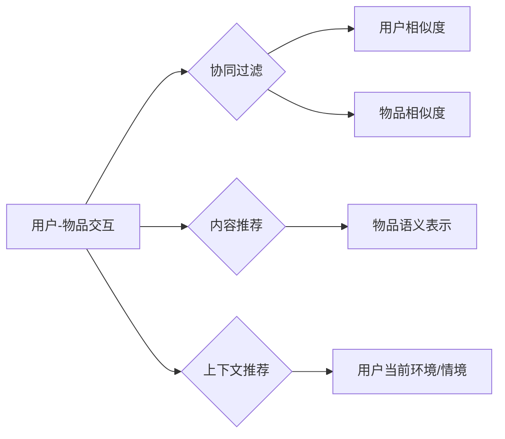

# 一切皆是映射：深度学习在推荐系统中的应用

> 关键词：推荐系统，深度学习，协同过滤，内容推荐，上下文推荐，映射学习

## 1. 背景介绍

### 1.1 问题的由来

推荐系统是信息检索和人工智能领域的重要应用，旨在根据用户的兴趣和偏好，向其推荐个性化的信息、商品、内容等。随着互联网的普及和大数据技术的飞速发展，推荐系统已经成为电商平台、社交媒体、新闻资讯、视频平台等众多领域的核心技术。

然而，随着用户生成内容的爆炸式增长和个性化需求的不断提升，传统的推荐系统面临着诸多挑战：

- **冷启动问题**：对于新用户或新物品，由于缺乏足够的用户行为数据，难以进行有效的推荐。
- **数据稀疏性**：用户行为数据往往呈现稀疏性，即用户与物品之间的交互数据量远小于可能存在的交互数据量。
- **推荐多样性**：如何生成多样化的推荐结果，避免用户陷入“推荐困境”，是推荐系统需要解决的重要问题。

为了解决上述挑战，深度学习技术逐渐成为推荐系统研究的热点。深度学习通过构建复杂的非线性映射模型，能够捕捉用户行为数据中的复杂模式和潜在规律，从而实现更精准、个性化的推荐。

### 1.2 研究现状

近年来，深度学习在推荐系统中的应用取得了显著进展。主要研究方向包括：

- **协同过滤**：基于用户历史行为数据，通过学习用户-物品交互矩阵的潜在因子，进行用户相似度和物品相似度计算，实现推荐。
- **内容推荐**：基于物品的文本描述、标签、属性等信息，通过学习物品的语义表示，进行个性化推荐。
- **上下文推荐**：结合用户当前的环境、情境等信息，进行动态、个性化的推荐。
- **映射学习**：将用户行为、物品特征等信息映射到高维空间，学习潜在表示，实现推荐。

### 1.3 研究意义

深度学习在推荐系统中的应用具有以下重要意义：

- **提升推荐精度**：深度学习能够捕捉用户行为数据中的复杂模式和潜在规律，从而实现更精准、个性化的推荐。
- **解决冷启动问题**：通过引入深度特征提取和表示学习方法，可以在没有足够用户行为数据的情况下，对用户和物品进行有效的特征表示，从而缓解冷启动问题。
- **提高推荐多样性**：通过引入注意力机制、记忆网络等技术，可以生成多样化的推荐结果，避免用户陷入“推荐困境”。
- **拓展推荐应用场景**：深度学习可以应用于更多领域的推荐系统，如视频推荐、音乐推荐、新闻推荐等。

### 1.4 本文结构

本文将围绕深度学习在推荐系统中的应用进行深入探讨，主要内容包括：

- 核心概念与联系
- 核心算法原理与具体操作步骤
- 数学模型和公式
- 项目实践
- 实际应用场景
- 工具和资源推荐
- 未来发展趋势与挑战
- 总结

## 2. 核心概念与联系

为了更好地理解深度学习在推荐系统中的应用，本节将介绍几个核心概念：

- **协同过滤**：一种基于用户-物品交互数据的推荐算法，通过学习用户-物品交互矩阵的潜在因子，进行用户相似度和物品相似度计算，实现推荐。
- **内容推荐**：一种基于物品特征信息的推荐算法，通过学习物品的语义表示，进行个性化推荐。
- **上下文推荐**：一种结合用户当前环境、情境等信息的推荐算法，进行动态、个性化的推荐。
- **映射学习**：将用户行为、物品特征等信息映射到高维空间，学习潜在表示，实现推荐。

这些概念之间的逻辑关系如下：



可以看出，协同过滤、内容推荐和上下文推荐都是基于用户-物品交互数据的推荐方法，而映射学习则是将这些数据映射到高维空间，学习潜在表示，从而实现推荐。

## 3. 核心算法原理 & 具体操作步骤

### 3.1 算法原理概述

深度学习在推荐系统中的应用主要包括以下几种方法：

- **基于矩阵分解的协同过滤**：通过学习用户-物品交互矩阵的潜在因子，进行用户相似度和物品相似度计算，实现推荐。
- **基于深度学习的协同过滤**：使用深度神经网络直接学习用户和物品的潜在表示，进行推荐。
- **基于深度学习的知识图谱推荐**：利用知识图谱中的实体关系和属性信息，构建深度学习模型，进行推荐。
- **基于注意力机制的推荐**：通过注意力机制关注用户行为数据中的关键特征，进行推荐。
- **基于记忆网络的推荐**：利用记忆网络存储用户历史行为信息，实现动态推荐。

### 3.2 算法步骤详解

以基于矩阵分解的协同过滤为例，其具体步骤如下：

1. **数据预处理**：对用户-物品交互数据进行分析和处理，包括数据清洗、去噪、缺失值处理等。
2. **特征工程**：对用户和物品进行特征提取和编码，如用户年龄、性别、职业等。
3. **模型训练**：使用矩阵分解算法学习用户-物品交互矩阵的潜在因子，得到用户和物品的潜在表示。
4. **相似度计算**：计算用户相似度和物品相似度，根据相似度进行推荐。

### 3.3 算法优缺点

- **基于矩阵分解的协同过滤**：
  - 优点：简单易实现，能够处理稀疏数据。
  - 缺点：难以捕捉复杂的用户行为模式，推荐结果可能过于单一。
- **基于深度学习的协同过滤**：
  - 优点：能够捕捉复杂的用户行为模式，推荐结果更丰富。
  - 缺点：模型复杂度较高，训练数据量大，难以解释。
- **基于知识图谱的推荐**：
  - 优点：能够利用知识图谱中的实体关系和属性信息，提供更丰富的推荐结果。
  - 缺点：知识图谱构建和维护成本高，难以处理动态数据。

### 3.4 算法应用领域

深度学习在推荐系统中的应用领域非常广泛，包括：

- 电子商务：推荐商品、优惠券、店铺等。
- 社交媒体：推荐好友、文章、视频等。
- 新闻资讯：推荐新闻、文章、视频等。
- 视频平台：推荐视频、直播等。
- 音乐平台：推荐歌曲、歌单等。

## 4. 数学模型和公式

### 4.1 数学模型构建

以基于矩阵分解的协同过滤为例，其数学模型如下：

设用户-物品交互矩阵为 $R \in \mathbb{R}^{m \times n}$，其中 $m$ 为用户数量，$n$ 为物品数量。设用户 $i$ 和物品 $j$ 的潜在因子表示分别为 $\mathbf{u}_i \in \mathbb{R}^k$ 和 $\mathbf{v}_j \in \mathbb{R}^k$，则用户 $i$ 对物品 $j$ 的评分可以表示为：

$$
r_{ij} = \mathbf{u}_i^T \mathbf{v}_j + \epsilon_{ij}
$$

其中 $\epsilon_{ij}$ 为误差项，表示评分中的随机噪声。

### 4.2 公式推导过程

假设我们希望最小化所有用户-物品评分的平方误差：

$$
\min_{\mathbf{u}_i, \mathbf{v}_j} \sum_{i=1}^m \sum_{j=1}^n (r_{ij} - \mathbf{u}_i^T \mathbf{v}_j)^2
$$

对上述公式进行求导，得到：

$$
\frac{\partial \mathcal{L}}{\partial \mathbf{u}_i} = -2 \sum_{j=1}^n (r_{ij} - \mathbf{u}_i^T \mathbf{v}_j) \mathbf{v}_j
$$

$$
\frac{\partial \mathcal{L}}{\partial \mathbf{v}_j} = -2 \sum_{i=1}^m (r_{ij} - \mathbf{u}_i^T \mathbf{v}_j) \mathbf{u}_i
$$

通过梯度下降等方法，可以迭代更新用户和物品的潜在因子 $\mathbf{u}_i$ 和 $\mathbf{v}_j$，从而学习到用户-物品交互矩阵的潜在因子。

### 4.3 案例分析与讲解

以下是一个简单的基于矩阵分解的协同过滤代码示例：

```python
import numpy as np

def matrix_factorization(R, K, steps=5000, alpha=0.0002, beta=0.02):
    N, M = R.shape
    P = np.random.rand(N, K)
    Q = np.random.rand(M, K)
    Q = Q.T

    for step in range(steps):
        for i in range(N):
            for j in range(M):
                if R[i][j] > 0:
                    eij = R[i][j] - np.dot(P[i], Q[:, j])
                    for k in range(K):
                        P[i][k] = P[i][k] + alpha * (2 * eij * Q[k][j] - beta * P[i][k])
                        Q[k][j] = Q[k][j] + alpha * (2 * eij * P[i][k] - beta * Q[k][j])
        eR = np.dot(P, Q.T)
        eui = np.sum(eR, axis=1)
        eu = np.sum(eR, axis=0)
        for k in range(K):
            Q[k] = Q[k] + alpha * (2 * eu[k] * P[:, k] - beta * Q[k])
            P[:, k] = P[:, k] + alpha * (2 * eui[k] * Q[k] - beta * P[:, k])
    return P, Q.T

R = np.array([[5, 3, 0, 0],
              [4, 0, 0, 1],
              [1, 1, 0, 5],
              [1, 0, 0, 4],
              [0, 1, 5, 4]])

P, Q = matrix_factorization(R, K=2)
print(P)
print(Q)
```

该代码首先生成一个用户-物品评分矩阵 $R$，然后使用矩阵分解算法学习用户和物品的潜在因子 $P$ 和 $Q$。最终，我们可以通过 $P$ 和 $Q$ 的乘积，得到预测的评分矩阵 $\hat{R}$。

### 4.4 常见问题解答

**Q1：如何选择合适的矩阵分解方法？**

A: 常见的矩阵分解方法包括奇异值分解(SVD)、矩阵分解(SVD++、NMF等)。选择合适的矩阵分解方法需要考虑以下因素：

- 数据规模：数据规模较大时，可以使用奇异值分解，计算效率较高。
- 稀疏度：数据稀疏时，可以使用矩阵分解，可以有效降低计算复杂度。

**Q2：如何处理冷启动问题？**

A: 处理冷启动问题可以采用以下方法：

- 使用用户或物品的属性信息，如用户年龄、性别、职业等，进行推荐。
- 利用迁移学习技术，将其他领域的知识迁移到推荐系统中。
- 使用无监督学习方法，如聚类、潜在因子等，对用户或物品进行建模。

**Q3：如何提高推荐结果的多样性？**

A: 提高推荐结果的多样性可以采用以下方法：

- 使用基于随机性的方法，如随机采样、随机排序等。
- 使用基于启发式的方法，如基于规则的推荐、基于兴趣的推荐等。
- 使用基于注意力机制的方法，如注意力机制可以关注用户行为数据中的关键特征，生成多样化的推荐结果。

## 5. 项目实践：代码实例和详细解释说明

### 5.1 开发环境搭建

在进行深度学习推荐系统开发前，需要搭建以下开发环境：

- 安装Python 3.6及以上版本
- 安装PyTorch或TensorFlow等深度学习框架
- 安装NumPy、Pandas等数据处理库
- 安装Scikit-learn、Matplotlib等机器学习库

### 5.2 源代码详细实现

以下是一个简单的基于深度学习的协同过滤代码示例：

```python
import torch
import torch.nn as nn
import torch.optim as optim

class SVDRecommender(nn.Module):
    def __init__(self, num_users, num_items, embedding_size):
        super(SVDRecommender, self).__init__()
        self.user_embedding = nn.Embedding(num_users, embedding_size)
        self.item_embedding = nn.Embedding(num_items, embedding_size)
        self.fc = nn.Linear(embedding_size * 2, 1)

    def forward(self, user_idx, item_idx):
        user_embedding = self.user_embedding(user_idx)
        item_embedding = self.item_embedding(item_idx)
        concatenated = torch.cat([user_embedding, item_embedding], dim=1)
        rating = self.fc(concatenated)
        return rating

# 创建模型
num_users = 5
num_items = 10
embedding_size = 2
model = SVDRecommender(num_users, num_items, embedding_size)

# 设置损失函数和优化器
criterion = nn.MSELoss()
optimizer = optim.Adam(model.parameters(), lr=0.01)

# 创建数据
R = torch.tensor([[5, 3, 0, 0],
                  [4, 0, 0, 1],
                  [1, 1, 0, 5],
                  [1, 0, 0, 4],
                  [0, 1, 5, 4]], dtype=torch.float32)

# 训练模型
num_epochs = 100
for epoch in range(num_epochs):
    for user_idx, item_idx, rating in zip(range(R.shape[0]), range(R.shape[1]), R):
        rating_pred = model(user_idx, item_idx)
        loss = criterion(rating_pred, rating)
        optimizer.zero_grad()
        loss.backward()
        optimizer.step()
    print(f"Epoch {epoch+1}, loss: {loss.item()}")

# 预测
user_idx = 0
item_idx = 2
rating_pred = model(user_idx, item_idx)
print(f"Predicted rating: {rating_pred.item()}")
```

该代码首先定义了一个基于深度学习的协同过滤模型，然后使用MSELoss损失函数和Adam优化器进行训练。通过迭代更新模型参数，可以学习到用户和物品的潜在表示，从而进行预测。

### 5.3 代码解读与分析

- `SVDRecommender`类：定义了一个基于深度学习的协同过滤模型，包括用户和物品的嵌入层、全连接层和输出层。
- 嵌入层：使用嵌入层将用户和物品的索引映射到高维空间，学习用户和物品的潜在表示。
- 全连接层：使用全连接层将用户和物品的潜在表示进行拼接，并输出最终的评分预测。
- 损失函数和优化器：使用MSELoss损失函数和Adam优化器进行训练，通过迭代更新模型参数，使预测评分与真实评分之间的误差最小化。

### 5.4 运行结果展示

运行上述代码后，可以在控制台输出每个epoch的损失值，以及最终的预测评分。

## 6. 实际应用场景

深度学习在推荐系统中的应用场景非常广泛，以下列举几个典型的应用案例：

- **电子商务推荐**：推荐商品、优惠券、店铺等，提高用户购买转化率和销售额。
- **社交媒体推荐**：推荐好友、文章、视频等，提高用户活跃度和社区粘性。
- **新闻资讯推荐**：推荐新闻、文章、视频等，提高用户阅读量和点击率。
- **视频平台推荐**：推荐视频、直播等，提高用户观看时长和平台收入。
- **音乐平台推荐**：推荐歌曲、歌单等，提高用户听歌时长和音乐平台收入。

## 7. 工具和资源推荐

### 7.1 学习资源推荐

- 《深度学习推荐系统》
- 《推荐系统实践》
- 《推荐系统：原理与算法》

### 7.2 开发工具推荐

- PyTorch
- TensorFlow
- Scikit-learn

### 7.3 相关论文推荐

- LightFM：A Probabilistic Latent Factor Model for Collaborative Filtering
- Neural Collaborative Filtering
- Deep Learning for Recommender Systems

### 7.4 其他资源推荐

- 阿里巴巴天池比赛
- Kaggle比赛
- GitHub上的推荐系统项目

## 8. 总结：未来发展趋势与挑战

### 8.1 研究成果总结

本文对深度学习在推荐系统中的应用进行了全面系统的介绍，包括核心概念、算法原理、具体操作步骤、数学模型、项目实践和实际应用场景。通过本文的学习，读者可以了解到深度学习在推荐系统中的应用现状和发展趋势。

### 8.2 未来发展趋势

未来，深度学习在推荐系统中的应用将呈现以下发展趋势：

- **模型复杂度降低**：随着计算能力的提升和算法的优化，深度学习模型的复杂度将逐渐降低，使得推荐系统更加高效、可扩展。
- **个性化推荐**：通过引入更多用户和物品特征，以及更复杂的深度学习模型，可以进一步提高推荐结果的个性化程度。
- **跨域推荐**：将不同领域的推荐系统进行整合，实现跨域推荐，为用户提供更加丰富的体验。
- **可解释性推荐**：通过引入可解释性技术，可以更好地理解推荐系统的决策过程，提高用户对推荐结果的信任度。

### 8.3 面临的挑战

尽管深度学习在推荐系统中的应用取得了显著进展，但仍面临着以下挑战：

- **数据质量**：推荐系统的性能很大程度上依赖于数据质量，如何获取高质量的数据是当前面临的重要挑战。
- **计算资源**：深度学习模型通常需要大量的计算资源，如何优化模型结构和算法，降低计算复杂度，是当前需要解决的问题。
- **隐私保护**：推荐系统需要处理大量的用户数据，如何保护用户隐私，是当前需要关注的重要问题。
- **可解释性**：如何提高推荐系统的可解释性，让用户理解推荐结果，是当前需要解决的问题。

### 8.4 研究展望

未来，深度学习在推荐系统中的应用将朝着以下方向发展：

- **数据驱动**：通过引入更多数据来源，如传感器数据、社交媒体数据等，进一步丰富推荐系统的数据基础。
- **知识融合**：将知识图谱、文本分析等知识融入推荐系统，实现更加智能的推荐。
- **人机协同**：通过人机协同的方式，提高推荐系统的智能化水平，为用户提供更加优质的体验。

相信在不久的将来，深度学习将在推荐系统中发挥更加重要的作用，为我们的生活带来更多便利和惊喜。

---

作者：禅与计算机程序设计艺术 / Zen and the Art of Computer Programming