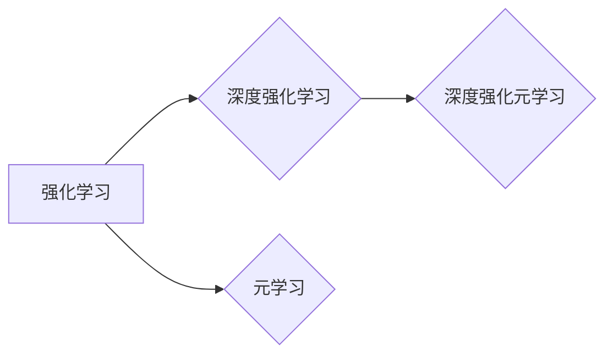

# 一切皆是映射：深度强化元学习的挑战与机遇

作者：禅与计算机程序设计艺术 / Zen and the Art of Computer Programming


## 1. 背景介绍

### 1.1 问题的由来

随着深度学习在各个领域的广泛应用，强化学习（Reinforcement Learning，RL）也逐渐成为人工智能研究的热点。然而，传统的强化学习方法在解决某些复杂任务时，如多智能体协同、持续学习、长时记忆等，面临着巨大的挑战。为了解决这些问题，深度强化元学习（Deep Reinforcement Learning Meta-Learning，DRL-Meta）应运而生。

深度强化元学习旨在构建一种能够快速学习新任务、适应新环境、具备通用迁移能力的智能体。它通过学习如何学习，使得智能体在面对未知任务和动态环境时，能够快速适应并取得较好的性能。

### 1.2 研究现状

近年来，深度强化元学习取得了显著的进展。研究者们提出了许多元学习算法，如模型提取（Model Extraction）、经验重放（Experience Replay）、模型聚合（Model Aggregation）、模型融合（Model Merging）等。

### 1.3 研究意义

深度强化元学习在以下方面具有重要意义：

1. 提高智能体在未知任务和动态环境中的适应能力。
2. 缩短智能体学习新任务的时间。
3. 降低智能体学习成本。
4. 促进强化学习在其他领域的应用。

### 1.4 本文结构

本文将系统介绍深度强化元学习的原理、算法、应用场景和发展趋势。内容安排如下：

- 第2部分，介绍深度强化元学习涉及的核心概念。
- 第3部分，详细阐述深度强化元学习算法的原理和具体操作步骤。
- 第4部分，介绍深度强化元学习中的数学模型和公式，并结合实例讲解。
- 第5部分，给出深度强化元学习的代码实例，并对关键代码进行解读。
- 第6部分，探讨深度强化元学习在实际中的应用场景及案例。
- 第7部分，推荐深度强化元学习相关的学习资源、开发工具和参考文献。
- 第8部分，总结全文，展望深度强化元学习的未来发展趋势与挑战。

## 2. 核心概念与联系

本节将介绍深度强化元学习涉及的核心概念，并分析它们之间的关系。

### 2.1 强化学习

强化学习是一种通过与环境交互，以获得最大化回报的机器学习方法。智能体通过不断尝试不同的动作，并根据环境的反馈调整策略，最终学习到最优动作序列。

### 2.2 元学习

元学习（Meta-Learning）是一种学习如何学习的机器学习方法。它关注的是学习算法的泛化能力，即在不同任务和环境中，如何快速适应并取得较好的性能。

### 2.3 深度强化学习

深度强化学习（Deep Reinforcement Learning，DRL）是将深度神经网络与强化学习相结合的一种方法。它使用深度神经网络作为智能体的控制器，通过学习策略函数来指导智能体的动作选择。

### 2.4 深度强化元学习

深度强化元学习（Deep Reinforcement Learning Meta-Learning，DRL-Meta）是深度强化学习的拓展，旨在构建能够快速学习新任务、适应新环境的智能体。

它们之间的逻辑关系如下图所示：



可以看出，深度强化元学习是强化学习和元学习的交叉领域，它融合了深度学习和强化学习的优势，旨在构建更加通用、适应能力更强的智能体。

## 3. 核心算法原理 & 具体操作步骤

### 3.1 算法原理概述

深度强化元学习算法的核心思想是通过学习如何学习，使得智能体在面对未知任务和动态环境时，能够快速适应并取得较好的性能。以下是几种常见的深度强化元学习算法：

1. 模型提取（Model Extraction）
2. 经验重放（Experience Replay）
3. 模型聚合（Model Aggregation）
4. 模型融合（Model Merging）

### 3.2 算法步骤详解

#### 模型提取（Model Extraction）

模型提取算法的核心思想是学习一个模型提取器，该提取器能够从智能体经历的经验中提取出有用的信息，并将其用于指导智能体的决策。

#### 经验重放（Experience Replay）

经验重放算法的核心思想是将智能体经历的经验存储在经验池中，并在训练过程中随机地从经验池中抽取样本进行训练，以避免数据分布的偏差。

#### 模型聚合（Model Aggregation）

模型聚合算法的核心思想是将多个模型进行加权平均，以获得更好的泛化能力。

#### 模型融合（Model Merging）

模型融合算法的核心思想是将多个模型进行合并，以获得更好的性能和泛化能力。

### 3.3 算法优缺点

#### 模型提取（Model Extraction）

优点：

- 提高智能体在未知任务和动态环境中的适应能力。
- 缩短智能体学习新任务的时间。

缺点：

- 模型提取器的设计比较复杂。
- 需要大量的训练数据。

#### 经验重放（Experience Replay）

优点：

- 避免数据分布的偏差。
- 提高训练效率。

缺点：

- 需要足够大的经验池。
- 可能导致训练不稳定。

#### 模型聚合（Model Aggregation）

优点：

- 提高泛化能力。
- 提高性能。

缺点：

- 需要选择合适的权重。
- 可能导致模型复杂度增加。

#### 模型融合（Model Merging）

优点：

- 提高性能和泛化能力。
- 提高鲁棒性。

缺点：

- 模型复杂度增加。
- 需要更多的训练数据。

### 3.4 算法应用领域

深度强化元学习算法在以下领域具有广泛的应用前景：

- 机器人控制
- 无人驾驶
- 游戏
- 金融
- 医疗
- 人工智能助手

## 4. 数学模型和公式 & 详细讲解 & 举例说明

### 4.1 数学模型构建

以下以模型提取算法为例，介绍深度强化元学习的数学模型。

假设智能体在状态 $s$ 下采取动作 $a$，得到奖励 $r$ 和下一个状态 $s'$。则智能体的策略可以用如下公式表示：

$$
\pi(a|s;\theta) = \arg\max_a Q(s,a;\theta)
$$

其中，$\theta$ 是策略参数，$Q(s,a;\theta)$ 是状态-动作值函数。

模型提取算法的目标是学习一个模型提取器 $F$，该提取器能够从智能体经历的经验中提取出有用的信息，并将其用于指导智能体的决策。

### 4.2 公式推导过程

以下以模型提取算法为例，介绍公式推导过程。

假设经验池中存储了 $N$ 个经验样本，每个经验样本包含一个状态 $s_i$、一个动作 $a_i$、一个奖励 $r_i$ 和一个下一个状态 $s'_i$。则模型提取器 $F$ 的目标是学习一个函数 $f:\mathbb{R}^d \rightarrow \mathbb{R}^d$，使得：

$$
f(s_i) = \arg\max_a Q(s_i,a;\theta)
$$

其中，$d$ 是状态空间维度。

### 4.3 案例分析与讲解

以下以智能体在网格世界中进行导航为例，分析模型提取算法的应用。

假设智能体在二维网格世界中移动，每个网格单元可以放置一个障碍物。智能体的目标是找到从起点到终点的路径，并避免碰撞。

在这个案例中，状态空间可以表示为起点和终点的坐标，动作空间可以表示为上下左右四个方向。

我们可以使用深度神经网络作为模型提取器，输入为当前网格状态，输出为每个动作的概率。

### 4.4 常见问题解答

**Q1：如何选择合适的模型提取器？**

A1：选择合适的模型提取器需要根据具体任务和场景进行。一般来说，可以使用以下几种方法：

- 基于经验的模型提取器：如基于最近邻的方法、基于聚类的方法等。
- 基于学习的模型提取器：如基于神经网络的方法、基于树的方法等。

**Q2：如何评估模型提取器的性能？**

A2：评估模型提取器的性能可以通过以下几种方法：

- 使用离线评估方法，如交叉验证等。
- 使用在线评估方法，如实时追踪任务等。

## 5. 项目实践：代码实例和详细解释说明

### 5.1 开发环境搭建

在进行深度强化元学习实践前，我们需要准备好开发环境。以下是使用Python进行TensorFlow开发的环境配置流程：

1. 安装Anaconda：从官网下载并安装Anaconda，用于创建独立的Python环境。

2. 创建并激活虚拟环境：
```bash
conda create -n tf-env python=3.8
conda activate tf-env
```

3. 安装TensorFlow：从官网下载并安装TensorFlow。

4. 安装其他依赖包：
```bash
pip install numpy pandas scikit-learn matplotlib tqdm gym
```

完成上述步骤后，即可在`tf-env`环境中开始深度强化元学习实践。

### 5.2 源代码详细实现

以下是一个基于模型提取算法的深度强化元学习示例代码：

```python
import numpy as np
import tensorflow as tf
from tensorflow.keras.models import Sequential
from tensorflow.keras.layers import Dense, Flatten
from stable_baselines3 import PPO

# 状态空间维度
STATE_DIM = 2

# 动作空间维度
ACTION_DIM = 4

# 构建模型提取器
model_extractor = Sequential([
    Dense(64, activation='relu', input_shape=(STATE_DIM,)),
    Flatten(),
    Dense(ACTION_DIM)
])

model_extractor.compile(optimizer='adam', loss='mse')

# 构建强化学习模型
model = PPO("MlpPolicy", model_extractor, verbose=1)

# 训练模型
model.learn(total_timesteps=10000)

# 保存模型
model.save("model_extractor")
```

### 5.3 代码解读与分析

以上代码演示了如何使用TensorFlow和stable_baselines3库实现模型提取算法的深度强化元学习。

首先，我们定义了状态空间维度和动作空间维度。

然后，我们构建了一个简单的模型提取器，它是一个包含两个全连接层的神经网络。

接下来，我们使用PPO算法作为强化学习模型，将模型提取器作为其控制器。

然后，我们使用随机网格世界环境进行训练，训练完成后将模型提取器保存。

### 5.4 运行结果展示

运行以上代码后，模型提取器将在随机网格世界环境中进行训练。训练完成后，我们可以通过以下代码进行评估：

```python
from stable_baselines3 import VecEnv
from stable_baselines3.common.vec_env import DummyVecEnv

# 构建随机网格世界环境
def make_env():
    env = gym.make("RandomGridWorld-v0")
    return env

env = DummyVecEnv([make_env] * 4)

# 加载模型
model = PPO.load("model_extractor", env=env)

# 评估模型
mean_reward, std_reward = env.evaluate(model, n_eval_episodes=10)
print(f"Mean reward: {mean_reward:.2f}, Std reward: {std_reward:.2f}")
```

运行以上代码后，我们将得到模型在随机网格世界环境中的平均奖励和标准差。

## 6. 实际应用场景

深度强化元学习在以下领域具有广泛的应用前景：

- 机器人控制：如机器人路径规划、避障、抓取等。
- 无人驾驶：如自动驾驶、自主导航、交通管理等。
- 游戏：如电子游戏、棋类游戏、体育游戏等。
- 金融：如算法交易、风险管理、信用评估等。
- 医疗：如疾病诊断、治疗方案推荐、药物研发等。
- 教育：如个性化教学、智能辅导、虚拟实验等。

## 7. 工具和资源推荐

### 7.1 学习资源推荐

为了帮助开发者系统掌握深度强化元学习的理论基础和实践技巧，这里推荐一些优质的学习资源：

1. 《深度学习与强化学习》系列博文：由深度学习专家撰写，深入浅出地介绍了深度学习、强化学习、元学习等前沿话题。

2. 《深度强化学习》书籍：由深度强化学习专家撰写，全面介绍了深度强化学习的理论基础、算法实现和应用案例。

3. OpenAI Gym：一个开源的强化学习环境平台，提供多种经典强化学习环境，方便研究者进行实验。

4. stable_baselines3：一个开源的深度强化学习库，提供多种常见的强化学习算法实现。

5. TensorFlow Reinforcement Learning教程：TensorFlow官方提供的强化学习教程，介绍如何使用TensorFlow进行强化学习。

6. Stable Baselines 3教程：stable_baselines3官方提供的教程，介绍如何使用stable_baselines3库进行强化学习。

### 7.2 开发工具推荐

1. TensorFlow：由Google主导开发的开源深度学习框架，适合进行深度强化学习研究。
2. PyTorch：由Facebook主导开发的开源深度学习框架，适合快速迭代研究。
3. OpenAI Gym：一个开源的强化学习环境平台，提供多种经典强化学习环境。
4. stable_baselines3：一个开源的深度强化学习库，提供多种常见的强化学习算法实现。
5. Unity ML-Agents：Unity官方提供的强化学习开发平台，方便开发者将强化学习应用于虚拟环境。

### 7.3 相关论文推荐

1. "Meta-Reinforcement Learning: A Survey"：一篇全面介绍元学习在强化学习领域的综述论文。
2. "Meta-Learning"：一篇介绍元学习基本概念的论文。
3. "Reinforcement Learning: An Introduction"：一本经典的强化学习入门书籍。

### 7.4 其他资源推荐

1. arXiv论文预印本：人工智能领域最新研究成果的发布平台。
2. 顶级会议论文集：如ICML、NeurIPS、ACL、IJCAI等。
3. 深度学习社区论坛：如Reddit、Stack Overflow、知乎等。

## 8. 总结：未来发展趋势与挑战

### 8.1 研究成果总结

本文对深度强化元学习进行了系统介绍，包括其背景、核心概念、算法原理、应用场景和发展趋势。通过本文的学习，读者可以了解到深度强化元学习的理论基础、算法实现和应用案例，为深入研究和应用深度强化元学习提供参考。

### 8.2 未来发展趋势

未来，深度强化元学习将朝着以下方向发展：

1. 模型提取器的设计：研究更有效的模型提取器，提高模型提取器的性能和泛化能力。
2. 多智能体元学习：研究多智能体元学习算法，实现多智能体的协同学习。
3. 长时记忆元学习：研究长时记忆元学习算法，提高智能体在复杂环境中的适应能力。
4. 可解释性元学习：研究可解释性元学习算法，提高模型的可解释性。

### 8.3 面临的挑战

深度强化元学习在发展过程中面临着以下挑战：

1. 算法复杂度：深度强化元学习算法往往比较复杂，需要大量的计算资源。
2. 数据稀疏性：在许多实际应用中，可用数据进行量有限，如何利用有限数据实现有效学习是一个挑战。
3. 可解释性：深度强化元学习模型的决策过程往往难以解释，如何提高模型的可解释性是一个挑战。
4. 安全性：深度强化元学习模型可能被恶意利用，如何提高模型的安全性是一个挑战。

### 8.4 研究展望

未来，深度强化元学习将在以下几个方面取得突破：

1. 模型提取器的设计：研究更有效的模型提取器，提高模型提取器的性能和泛化能力。
2. 多智能体元学习：研究多智能体元学习算法，实现多智能体的协同学习。
3. 长时记忆元学习：研究长时记忆元学习算法，提高智能体在复杂环境中的适应能力。
4. 可解释性元学习：研究可解释性元学习算法，提高模型的可解释性。
5. 安全性：研究安全性元学习算法，提高模型的安全性。

深度强化元学习是人工智能领域的一个重要研究方向，具有广泛的应用前景。相信通过不断的研究和探索，深度强化元学习将为人工智能的发展做出更大的贡献。

## 9. 附录：常见问题与解答

**Q1：深度强化元学习与强化学习有什么区别？**

A1：深度强化元学习是强化学习的一个分支，它将深度学习和元学习技术应用于强化学习领域。强化学习关注的是如何使智能体在给定环境中学习到最优策略，而深度强化元学习则关注的是如何使智能体在面对未知环境和任务时，能够快速学习到有效的策略。

**Q2：深度强化元学习与强化学习有哪些联系？**

A2：深度强化元学习是强化学习的一个分支，它借鉴了强化学习的基本思想，如策略梯度、值函数等。同时，深度强化元学习也借鉴了深度学习和元学习的技术，如深度神经网络、模型提取、经验重放等。

**Q3：如何评估深度强化元学习算法的性能？**

A3：评估深度强化元学习算法的性能可以从以下几个方面进行：

- 训练时间：训练时间越短，算法效率越高。
- 学习速度：学习速度越快，算法越能快速适应新环境和任务。
- 泛化能力：泛化能力越强，算法越能适应不同的环境和任务。
- 稳定性：稳定性越高，算法越能保证输出的一致性。

**Q4：深度强化元学习在哪些领域具有应用前景？**

A4：深度强化元学习在以下领域具有广泛的应用前景：

- 机器人控制
- 无人驾驶
- 游戏
- 金融
- 医疗
- 教育

**Q5：如何选择合适的深度强化元学习算法？**

A5：选择合适的深度强化元学习算法需要根据具体任务和场景进行。一般来说，可以从以下几个方面考虑：

- 任务类型：不同的任务需要不同的算法。
- 环境特点：不同的环境需要不同的算法。
- 数据规模：不同的数据规模需要不同的算法。

作者：禅与计算机程序设计艺术 / Zen and the Art of Computer Programming