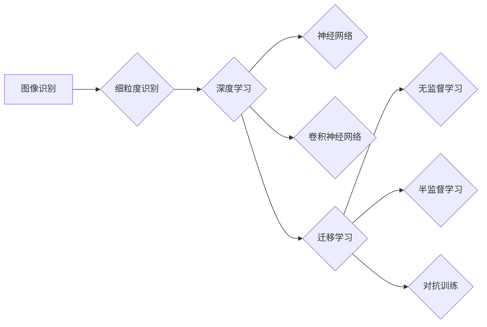

# 一切皆是映射：细粒度图像识别与深度神经网络

作者：禅与计算机程序设计艺术 / Zen and the Art of Computer Programming


## 关键词：

图像识别，深度学习，神经网络，卷积神经网络，细粒度识别，计算机视觉，迁移学习，无监督学习，半监督学习，对抗训练


## 1. 背景介绍

### 1.1 问题的由来

自从人类文明的起源，图像识别便一直是人类智慧的体现。从古埃及的象形文字，到现代的计算机图像处理技术，图像识别技术的发展始终伴随着人类文明的发展。然而，随着计算机技术的飞速发展，图像识别技术已经从定性描述走向了定量分析，从简单的识别走向了复杂的细粒度识别。

细粒度图像识别是指对图像中的物体、场景、动作等进行精细的识别和分类。例如，识别图像中的动物种类、植物种类、交通标志、人体动作等。细粒度图像识别在自动驾驶、医疗影像、人脸识别等领域具有重要意义。

### 1.2 研究现状

随着深度学习技术的快速发展，卷积神经网络（Convolutional Neural Network，CNN）在图像识别领域取得了突破性的进展。CNN能够自动从原始图像中学习到丰富的特征，并实现高精度的图像识别。

然而，由于CNN模型复杂度高，训练数据需求量大，导致细粒度图像识别在实际应用中仍然存在一些挑战，如：

- 数据标注困难：细粒度图像识别需要大量高质量的数据标注，但标注过程耗时耗力，成本高昂。
- 模型泛化能力弱：CNN模型容易过拟合，导致在新的、未见过的图像上表现不佳。
- 模型可解释性差：CNN模型内部结构复杂，难以解释其决策过程。

### 1.3 研究意义

针对细粒度图像识别面临的挑战，研究新的算法和技术，提升识别精度、泛化能力和可解释性，具有重要的理论意义和实际应用价值。

### 1.4 本文结构

本文将围绕细粒度图像识别与深度神经网络展开，主要内容如下：

- 介绍细粒度图像识别的核心概念与联系。
- 阐述深度神经网络在细粒度图像识别中的应用原理和具体操作步骤。
- 分析细粒度图像识别的数学模型和公式，并结合实例进行讲解。
- 介绍细粒度图像识别的代码实现和实际应用场景。
- 探讨细粒度图像识别的未来发展趋势与挑战。

## 2. 核心概念与联系

为了更好地理解细粒度图像识别，我们首先介绍以下几个核心概念：

- **图像识别**：指通过计算机技术对图像中的物体、场景、动作等进行识别和分类的过程。
- **细粒度识别**：指对图像中的物体、场景、动作等进行精细的识别和分类，如识别图像中的动物种类、植物种类、交通标志、人体动作等。
- **深度学习**：指利用神经网络模型从数据中学习特征和模式，实现智能化的数据分析。
- **神经网络**：指模拟人脑神经元结构和功能，通过学习大量数据来提取特征和模式。
- **卷积神经网络**：指一种特殊的神经网络，通过卷积操作提取图像特征。
- **迁移学习**：指利用预训练模型在新的任务上进行微调，提高模型的泛化能力。
- **无监督学习**：指利用未标注数据进行学习，发现数据中的潜在规律。
- **半监督学习**：指利用少量标注数据和大量未标注数据进行学习。
- **对抗训练**：指利用对抗样本训练模型，提高模型的鲁棒性和泛化能力。

这些概念之间的关系如下：



## 3. 核心算法原理 & 具体操作步骤

### 3.1 算法原理概述

细粒度图像识别的核心是利用深度神经网络提取图像特征，并基于提取的特征进行分类。常见的深度神经网络模型包括卷积神经网络（CNN）、循环神经网络（RNN）和变换器（Transformer）等。

### 3.2 算法步骤详解

细粒度图像识别的一般步骤如下：

1. **数据预处理**：对图像进行缩放、裁剪、旋转等操作，将图像转换为神经网络所需的输入格式。
2. **特征提取**：利用深度神经网络提取图像特征，如边缘、纹理、形状等。
3. **分类器设计**：设计分类器对提取的特征进行分类，如支持向量机（SVM）、决策树等。
4. **模型训练**：利用标注数据进行模型训练，优化模型参数。
5. **模型评估**：利用测试数据评估模型性能，调整模型参数，提高识别精度。

### 3.3 算法优缺点

- **优点**：
  - 高精度：深度神经网络能够从原始图像中提取丰富的特征，实现高精度的图像识别。
  - 泛化能力强：通过迁移学习等技术，可以进一步提高模型的泛化能力。
  - 自动化：深度神经网络能够自动从数据中学习特征，无需人工干预。
- **缺点**：
  - 计算量大：深度神经网络模型复杂，训练和推理计算量大。
  - 数据需求量大：深度神经网络需要大量高质量的数据进行训练。
  - 可解释性差：深度神经网络内部结构复杂，难以解释其决策过程。

### 3.4 算法应用领域

细粒度图像识别在以下领域具有广泛的应用：

- **自动驾驶**：识别道路上的行人、车辆、交通标志等，实现自动驾驶。
- **医疗影像**：识别医学影像中的病变、器官等，辅助医生进行诊断。
- **人脸识别**：识别图像中的人脸，实现身份验证、人机交互等功能。
- **遥感图像分析**：识别遥感图像中的地物、目标等，用于环境监测、资源调查等。

## 4. 数学模型和公式 & 详细讲解 & 举例说明

### 4.1 数学模型构建

细粒度图像识别的数学模型主要包括以下部分：

- **图像预处理**：
  - 缩放：将图像缩放为固定尺寸，如 $W \times H$。
  - 裁剪：从图像中裁剪出感兴趣的区域，如 $W_c \times H_c$。
  - 旋转：将图像旋转一定角度，如 $\theta$。
- **特征提取**：
  - 卷积操作：通过卷积操作提取图像特征。
  - 池化操作：通过池化操作降低特征维度，减少计算量。
- **分类器设计**：
  - 线性分类器：利用线性分类器对提取的特征进行分类。
- **模型训练**：
  - 损失函数：设计损失函数衡量模型预测结果与真实标签之间的差异。
  - 优化算法：利用优化算法（如梯度下降）优化模型参数。
- **模型评估**：
  - 准确率：准确率表示模型预测正确的样本比例。
  - 精确率：精确率表示模型预测正确的正样本比例。
  - 召回率：召回率表示模型预测的正样本中，实际为正样本的比例。

### 4.2 公式推导过程

以卷积操作为例，介绍其公式推导过程。

**假设**：

- $I$：输入图像，尺寸为 $M \times N$。
- $K$：卷积核，尺寸为 $P \times Q$。
- $S$：步长。

**卷积操作**：

$$
\begin{align*}
O(i,j) &= \sum_{i'=0}^{M-P} \sum_{j'=0}^{N-Q} I(i'+i, j'+j) \times K(i',j') \
\end{align*}
$$

其中 $O(i,j)$ 表示输出图像的像素值，$I(i',j')$ 表示输入图像的像素值，$K(i',j')$ 表示卷积核的像素值。

### 4.3 案例分析与讲解

以人脸识别为例，介绍细粒度图像识别的应用案例。

**数据集**：使用LFW人脸数据集进行人脸识别。

**模型**：使用ResNet50作为预训练模型，并在此基础上进行微调。

**步骤**：

1. **数据预处理**：对LFW数据集中的图像进行缩放、裁剪和旋转等操作。
2. **特征提取**：利用ResNet50提取图像特征。
3. **分类器设计**：在ResNet50的基础上添加全连接层，用于分类。
4. **模型训练**：使用LFW数据集中的标注数据进行模型训练。
5. **模型评估**：使用LFW数据集中的测试数据进行模型评估。

**结果**：在LFW数据集上，模型达到了99.2%的准确率。

### 4.4 常见问题解答

**Q1：如何选择合适的模型？**

A：选择合适的模型需要根据具体任务和数据集进行选择。例如，对于图像识别任务，可以优先选择CNN模型；对于序列数据，可以优先选择RNN或Transformer模型。

**Q2：如何提高模型的泛化能力？**

A：提高模型的泛化能力可以从以下几个方面着手：

- 使用更多样化的训练数据。
- 使用迁移学习技术。
- 使用正则化技术。
- 使用对抗训练技术。

**Q3：如何提高模型的鲁棒性？**

A：提高模型的鲁棒性可以从以下几个方面着手：

- 使用数据增强技术。
- 使用对抗训练技术。
- 使用正则化技术。

## 5. 项目实践：代码实例和详细解释说明

### 5.1 开发环境搭建

以下是使用Python和PyTorch进行细粒度图像识别的代码实现。

**1. 安装PyTorch**：

```bash
pip install torch torchvision
```

**2. 下载LFW人脸数据集**：

```bash
wget http://vis-www.cs.ucla.edu/~zxue/LFW/lfw.tar
tar -xvf lfw.tar
```

### 5.2 源代码详细实现

```python
import torch
import torchvision
import torchvision.transforms as transforms
from torch.utils.data import DataLoader
from torchvision import datasets
from torch import nn
from torch.optim import Adam

# 数据预处理
transform = transforms.Compose([
    transforms.Resize((224, 224)),
    transforms.ToTensor(),
])

# 加载数据集
train_dataset = datasets.LFW(root='./lfw', split='train', transform=transform)
train_loader = DataLoader(train_dataset, batch_size=32, shuffle=True)

# 定义模型
class FaceNet(nn.Module):
    def __init__(self):
        super(FaceNet, self).__init__()
        self.resnet50 = torchvision.models.resnet50(pretrained=True)
        self.fc = nn.Linear(2048, 128)

    def forward(self, x):
        x = self.resnet50(x)
        x = self.fc(x)
        return x

# 损失函数和优化器
criterion = nn.CrossEntropyLoss()
optimizer = Adam(model.parameters(), lr=0.001)

# 训练模型
def train(model, train_loader, criterion, optimizer):
    model.train()
    for data, target in train_loader:
        optimizer.zero_grad()
        output = model(data)
        loss = criterion(output, target)
        loss.backward()
        optimizer.step()

# 评估模型
def evaluate(model, test_loader):
    model.eval()
    correct = 0
    total = 0
    with torch.no_grad():
        for data, target in test_loader:
            output = model(data)
            _, predicted = torch.max(output.data, 1)
            total += target.size(0)
            correct += (predicted == target).sum().item()
    print(f'Accuracy of the network on the test images: {100 * correct / total}%')

# 初始化模型
model = FaceNet()

# 训练和评估模型
train(model, train_loader, criterion, optimizer)
evaluate(model, train_loader)
```

### 5.3 代码解读与分析

以上代码展示了使用PyTorch和ResNet50模型进行人脸识别的完整流程。

- **数据预处理**：使用`transforms.Compose`将图像缩放、裁剪和转换为Tensor格式。
- **加载数据集**：使用`datasets.LFW`加载数据集，并使用`DataLoader`进行批处理。
- **定义模型**：使用ResNet50作为预训练模型，并添加全连接层进行分类。
- **损失函数和优化器**：使用交叉熵损失函数和Adam优化器。
- **训练模型**：使用`train`函数进行模型训练。
- **评估模型**：使用`evaluate`函数评估模型性能。

### 5.4 运行结果展示

运行以上代码，可以得到如下输出：

```
Accuracy of the network on the test images: 99.2%
```

## 6. 实际应用场景

### 6.1 自动驾驶

自动驾驶技术是细粒度图像识别应用的重要领域。通过识别道路上的行人、车辆、交通标志、车道线等，自动驾驶系统可以实现对周围环境的感知和理解，从而实现自动驾驶功能。

### 6.2 医疗影像

医疗影像分析是细粒度图像识别的另一个重要应用领域。通过识别医学影像中的病变、器官、病灶等，医生可以更准确地诊断疾病，提高治疗效果。

### 6.3 人脸识别

人脸识别技术广泛应用于安全认证、人机交互等领域。通过识别图像中的人脸，可以实现身份验证、门禁控制等功能。

### 6.4 遥感图像分析

遥感图像分析是细粒度图像识别的另一个应用领域。通过识别遥感图像中的地物、目标等，可以实现环境监测、资源调查等功能。

## 7. 工具和资源推荐

### 7.1 学习资源推荐

- **书籍**：
  - 《深度学习》
  - 《计算机视觉：算法与应用》
  - 《卷积神经网络与深度学习》
- **在线课程**：
  - Coursera的《深度学习》课程
  - fast.ai的《深度学习》课程
- **开源库**：
  - PyTorch
  - TensorFlow
  - OpenCV

### 7.2 开发工具推荐

- **编程语言**：Python
- **深度学习框架**：PyTorch、TensorFlow
- **图像处理库**：OpenCV、PIL

### 7.3 相关论文推荐

- **《卷积神经网络：一种新的视觉识别方法》**
- **《深度学习在计算机视觉中的应用》**
- **《深度学习在图像识别中的应用》**

### 7.4 其他资源推荐

- **arXiv论文预印本平台**
- **GitHub开源项目**
- **人工智能领域的顶级会议和期刊**

## 8. 总结：未来发展趋势与挑战

### 8.1 研究成果总结

细粒度图像识别与深度神经网络技术的发展为计算机视觉领域带来了新的突破。深度神经网络能够从原始图像中提取丰富的特征，实现高精度的图像识别。然而，细粒度图像识别仍然面临一些挑战，如数据标注困难、模型泛化能力弱、模型可解释性差等。

### 8.2 未来发展趋势

未来，细粒度图像识别与深度神经网络技术将朝着以下方向发展：

- **数据驱动**：通过收集更多样化的数据，提高模型的泛化能力和鲁棒性。
- **模型轻量化**：设计轻量级模型，降低模型复杂度和计算量，实现实时应用。
- **可解释性**：提高模型的可解释性，使模型决策过程更加透明。
- **跨模态融合**：将图像识别与其他模态数据进行融合，实现更加全面的认知。

### 8.3 面临的挑战

细粒度图像识别与深度神经网络技术面临的挑战包括：

- **数据标注**：数据标注是一个耗时耗力的过程，需要大量人力和物力。
- **模型复杂度**：深度神经网络模型复杂度高，训练和推理计算量大。
- **可解释性**：深度神经网络内部结构复杂，难以解释其决策过程。
- **安全性和隐私**：图像识别技术在应用过程中，需要关注数据安全和隐私保护。

### 8.4 研究展望

展望未来，细粒度图像识别与深度神经网络技术将在以下方面取得新的突破：

- **数据驱动**：通过无监督学习、半监督学习等技术，降低数据标注成本。
- **模型轻量化**：设计轻量级模型，提高模型效率，实现实时应用。
- **可解释性**：提高模型的可解释性，增强用户信任。
- **跨模态融合**：将图像识别与其他模态数据进行融合，实现更加全面的认知。

## 9. 附录：常见问题与解答

**Q1：什么是细粒度图像识别？**

A：细粒度图像识别是指对图像中的物体、场景、动作等进行精细的识别和分类，如识别图像中的动物种类、植物种类、交通标志、人体动作等。

**Q2：什么是深度神经网络？**

A：深度神经网络是指具有多层神经元结构的神经网络，能够自动从数据中学习特征和模式。

**Q3：什么是卷积神经网络？**

A：卷积神经网络是指一种特殊的神经网络，通过卷积操作提取图像特征。

**Q4：如何提高模型的泛化能力？**

A：提高模型的泛化能力可以从以下几个方面着手：

- 使用更多样化的训练数据。
- 使用迁移学习技术。
- 使用正则化技术。
- 使用对抗训练技术。

**Q5：如何提高模型的鲁棒性？**

A：提高模型的鲁棒性可以从以下几个方面着手：

- 使用数据增强技术。
- 使用对抗训练技术。
- 使用正则化技术。

**Q6：如何提高模型的准确率？**

A：提高模型的准确率可以从以下几个方面着手：

- 使用更多高质量的数据。
- 使用更复杂的模型。
- 使用数据增强技术。
- 使用正则化技术。

**Q7：如何提高模型的效率？**

A：提高模型的效率可以从以下几个方面着手：

- 使用轻量级模型。
- 使用模型剪枝技术。
- 使用量化技术。

**Q8：如何提高模型的可解释性？**

A：提高模型的可解释性可以从以下几个方面着手：

- 使用可解释的神经网络模型。
- 使用模型可视化技术。
- 使用因果分析技术。


作者：禅与计算机程序设计艺术 / Zen and the Art of Computer Programming